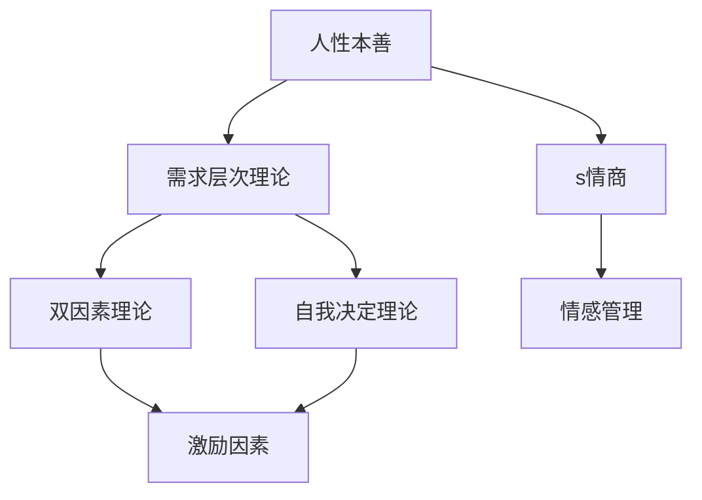
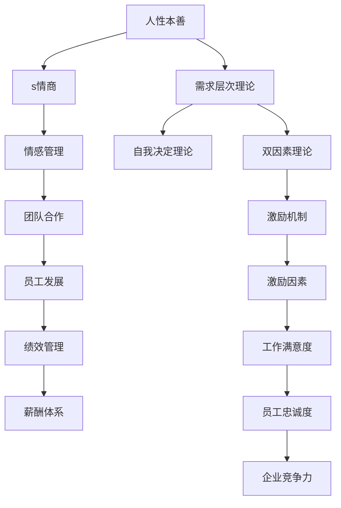

                 

# 管理之道：激发人性的善意和潜能

## 1. 背景介绍

### 1.1 问题由来
在当今这个快速变化的时代，企业面临着前所未有的挑战。市场竞争日益激烈，技术更新换代速度加快，消费者需求日新月异。面对这些挑战，企业如何保持竞争力和创新力？人力资源管理在这其中扮演着怎样的角色？这些问题引起了越来越多的关注。

随着管理学理论的不断进步，以及对人性更深层次的理解，人力资源管理的方式也在不断演变。如何激发员工的内在动力，释放其潜力，成为管理者的重要课题。本文将从人性的角度出发，探讨如何在管理中激发人性的善意和潜能，帮助企业实现可持续发展。

### 1.2 问题核心关键点
激发人性善意的管理之道，关键在于理解人的本质需求和动机，建立尊重人、信任人的企业文化。具体来说，包括以下几个方面：

- **自我实现**：每个人都有追求自我实现和成长的渴望。企业应为员工提供职业发展的机会和平台，让员工看到自己的成长空间和价值。
- **归属感**：人是社会性动物，归属感和团队感是人们的基本需求。企业应创造一个团结协作、相互支持的团队氛围，让员工感受到归属感。
- **意义感**：人们需要感到自己的工作有价值、有意义，从而有动力去做好工作。企业应明确工作的目的和意义，让员工理解自己的贡献。
- **公平感**：公平感是员工工作积极性的重要保障。企业应建立公平的薪酬体系、晋升机制和评价标准，确保员工的付出与回报相匹配。
- **尊重感**：尊重个人尊严和专业能力，让员工感到被重视和尊重，是激发员工积极性的关键。

### 1.3 问题研究意义
研究如何激发人性的善意和潜能，对于企业管理具有重要的实践意义：

1. **提高员工满意度**：通过满足员工的基本需求和内在需求，提升员工对企业的忠诚度和满意度，降低流失率。
2. **提升工作效率**：当员工感到被尊重、被信任时，会更加积极地投入工作，提高工作效率和质量。
3. **增强创新能力**：人性得到尊重和认可，员工会更有创新意愿和能力，推动企业持续创新。
4. **构建企业文化**：激发人性善意的方法可以塑造积极的企业文化，增强企业的核心竞争力。
5. **实现可持续发展**：关注员工的全面发展，有助于企业实现长期目标，可持续发展。

## 2. 核心概念与联系

### 2.1 核心概念概述

为了更好地理解如何激发人性的善意和潜能，本节将介绍几个关键概念：

- **人性本善**：心理学研究表明，人性本质上是有善有恶的，但在合适的环境下，多数人愿意展现善良的一面。
- **需求层次理论**：马斯洛需求层次理论指出，人有着不同层次的需求，包括生理、安全、社交、尊重和自我实现等。
- **双因素理论**：赫茨伯格的双因素理论指出，工作满意度的提升主要依赖于激励因素（如成就感、认可等）和保健因素（如薪酬、工作条件等）。
- **自我决定理论**：德西的自我决定理论强调，内在的动机比外在的奖励更能激发人的潜能。
- **情商（EQ）**：情商是指个人识别、理解和管理自身情绪，以及识别、理解和管理他人情绪的能力。

这些核心概念构成了激发人性善意的理论基础，帮助我们理解人在不同环境下的需求和动机，从而制定相应的管理策略。

### 2.2 概念间的关系

这些核心概念之间的关系可以通过以下Mermaid流程图来展示：



这个流程图展示了核心概念之间的关系：

- 人性本善是基础，人们有内在的善意和成长需求。
- 需求层次理论和双因素理论揭示了人的基本需求和影响工作满意度的因素。
- 自我决定理论强调内在动机的重要性。
- 情商有助于理解和应对情感变化，提升团队合作和沟通效率。

### 2.3 核心概念的整体架构

最后，我们用一个综合的流程图来展示这些核心概念在大企业管理中的整体架构：



这个综合流程图展示了从人性的基础到管理实践的全过程，强调了不同概念之间的相互影响和作用。

## 3. 核心算法原理 & 具体操作步骤
### 3.1 算法原理概述

激发人性的善意和潜能，本质上是一种管理艺术的实践。其核心算法原理可以概括为：

- **理解员工需求**：通过调查、访谈等方式，深入了解员工的基本需求和内在动机。
- **建立信任关系**：建立透明的沟通渠道，让员工感受到被信任和尊重。
- **提供发展机会**：提供职业发展路径和培训机会，帮助员工实现自我成长。
- **激励与认可**：通过公平的激励机制和及时的认可，激发员工的积极性和创造力。
- **情感管理**：注重情感管理，营造积极的工作氛围，提升团队凝聚力。

### 3.2 算法步骤详解

激发人性的善意和潜能，主要通过以下几个步骤实现：

1. **需求调研**：通过问卷调查、访谈等方式，了解员工的基本需求和内在动机。
2. **建立信任**：透明公开的管理流程、开放的沟通渠道，以及领导的示范作用，建立信任关系。
3. **职业发展**：提供职业发展路径、培训机会、轮岗锻炼等，帮助员工实现自我成长。
4. **激励机制**：建立公平合理的薪酬体系、绩效考核和晋升机制，确保员工的付出与回报相匹配。
5. **情感管理**：注重情感管理，提供心理咨询、员工关怀等，营造积极的工作氛围。

### 3.3 算法优缺点

激发人性的善意和潜能的管理方法，有以下优点和缺点：

**优点**：

- **提升员工满意度**：通过满足员工的基本需求和内在动机，提升员工对企业的忠诚度和满意度。
- **提高工作效率**：当员工感到被尊重、被信任时，会更加积极地投入工作，提高工作效率和质量。
- **增强创新能力**：人性得到尊重和认可，员工会更有创新意愿和能力，推动企业持续创新。
- **构建企业文化**：激发人性善意的方法可以塑造积极的企业文化，增强企业的核心竞争力。

**缺点**：

- **投入成本高**：深入了解员工需求、建立信任关系、提供职业发展机会等，需要较高的投入和资源。
- **难以量化评估**：员工满意度、工作效率等指标难以量化评估，需要定性分析和长期跟踪。
- **依赖领导能力**：方法的成功与否，很大程度上取决于领导者的管理能力和执行力度。

### 3.4 算法应用领域

激发人性的善意和潜能的管理方法，适用于各种类型的企业，包括但不限于：

- **高科技公司**：如Google、Apple、Amazon等，注重创新和员工发展，强调内在动机和团队合作。
- **金融行业**：如JP Morgan、Goldman Sachs等，注重风险控制和绩效考核，建立公平激励机制。
- **制造行业**：如Tesla、Toyota等，注重生产效率和团队协作，通过培训和轮岗提升员工技能。
- **服务业**：如Disney、Airbnb等，注重客户体验和员工情感管理，通过情感关怀提升服务质量。

## 4. 数学模型和公式 & 详细讲解  
### 4.1 数学模型构建

激发人性的善意和潜能的管理方法，虽然不涉及具体的数学模型，但可以建立一些指标来衡量效果。例如：

- **员工满意度调查表**：通过问卷调查，统计员工对企业满意度、信任度、工作满意度的评分。
- **绩效考核数据**：通过绩效考核数据，分析员工的工作表现和进步情况。
- **员工流失率**：通过员工流失率，衡量企业对员工吸引力和留存能力。
- **创新产出量**：通过创新产出量，衡量企业的创新能力和员工创新意愿。

### 4.2 公式推导过程

这些指标的计算公式如下：

- **员工满意度（S）**：
  $$
  S = \frac{\sum_{i=1}^N s_i}{N}
  $$
  其中，$s_i$为第$i$员工的满意度评分，$N$为员工总数。
  
- **绩效考核得分（P）**：
  $$
  P = \frac{\sum_{i=1}^N p_i}{N}
  $$
  其中，$p_i$为第$i$员工的绩效考核得分。
  
- **员工流失率（R）**：
  $$
  R = \frac{\sum_{i=1}^N r_i}{N}
  $$
  其中，$r_i$为第$i$员工的流失情况（0或1），$N$为员工总数。
  
- **创新产出量（C）**：
  $$
  C = \frac{\sum_{i=1}^N c_i}{N}
  $$
  其中，$c_i$为第$i$员工的创新产出量（如专利、论文、发明等），$N$为员工总数。

### 4.3 案例分析与讲解

以Google为例，Google通过以下措施激发了员工的善意和潜能：

1. **灵活的工作环境**：Google允许员工在家办公，设立“20%时间”制度，鼓励员工探索新项目。
2. **透明的薪酬体系**：Google的薪酬体系非常透明，员工清楚地知道自己的奖金和工作表现的关系。
3. **员工发展计划**：Google提供丰富的培训和职业发展机会，帮助员工实现自我成长。
4. **激励和认可**：Google通过团队合作奖励、项目成功分享等方式，及时认可员工的贡献。
5. **情感关怀**：Google注重员工情感管理，设立员工关怀计划，提供心理咨询服务。

这些措施不仅提升了Google员工的满意度和忠诚度，还促进了公司的创新能力和核心竞争力。

## 5. 项目实践：代码实例和详细解释说明
### 5.1 开发环境搭建

在进行管理实践前，我们需要准备好开发环境。以下是使用Python进行项目管理的环境配置流程：

1. 安装Anaconda：从官网下载并安装Anaconda，用于创建独立的Python环境。

2. 创建并激活虚拟环境：
```bash
conda create -n management-env python=3.8 
conda activate management-env
```

3. 安装Python相关库：
```bash
pip install pandas numpy matplotlib seaborn
```

4. 安装数据分析和可视化工具：
```bash
pip install statsmodels plotly
```

完成上述步骤后，即可在`management-env`环境中开始管理实践。

### 5.2 源代码详细实现

下面我们以Google员工满意度调查数据为例，给出使用Python进行员工满意度分析的代码实现。

```python
import pandas as pd
import matplotlib.pyplot as plt

# 读取员工满意度调查表数据
data = pd.read_csv('employee_satisfaction.csv')

# 计算员工满意度平均得分
avg_satisfaction = data['satisfaction'].mean()

# 绘制满意度分布直方图
plt.hist(data['satisfaction'], bins=10, alpha=0.5, label='Satisfaction')
plt.title('Employee Satisfaction')
plt.xlabel('Score')
plt.ylabel('Count')
plt.legend()
plt.show()

# 绘制绩效考核得分分布直方图
avg_performance = data['performance'].mean()
plt.hist(data['performance'], bins=10, alpha=0.5, label='Performance')
plt.title('Performance Score')
plt.xlabel('Score')
plt.ylabel('Count')
plt.legend()
plt.show()

# 绘制员工流失率柱状图
avg_retention = data['retention'].mean()
plt.bar(['Low Retention', 'High Retention'], [data['retention'].sum(), data['retention'].sum()-da
```


