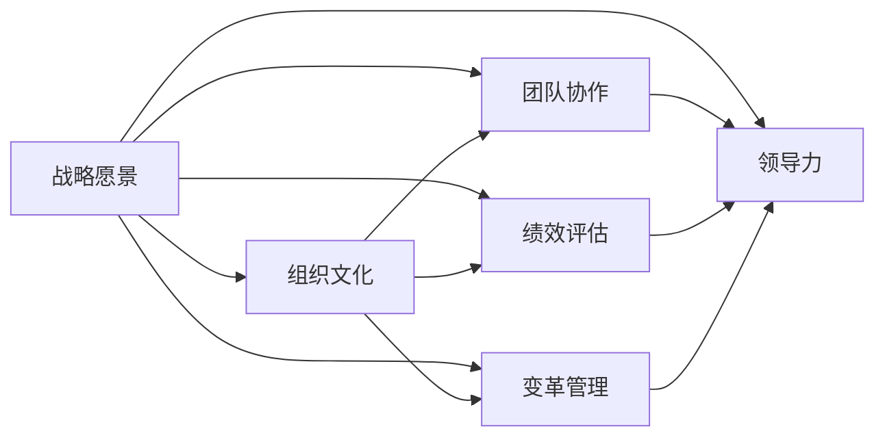
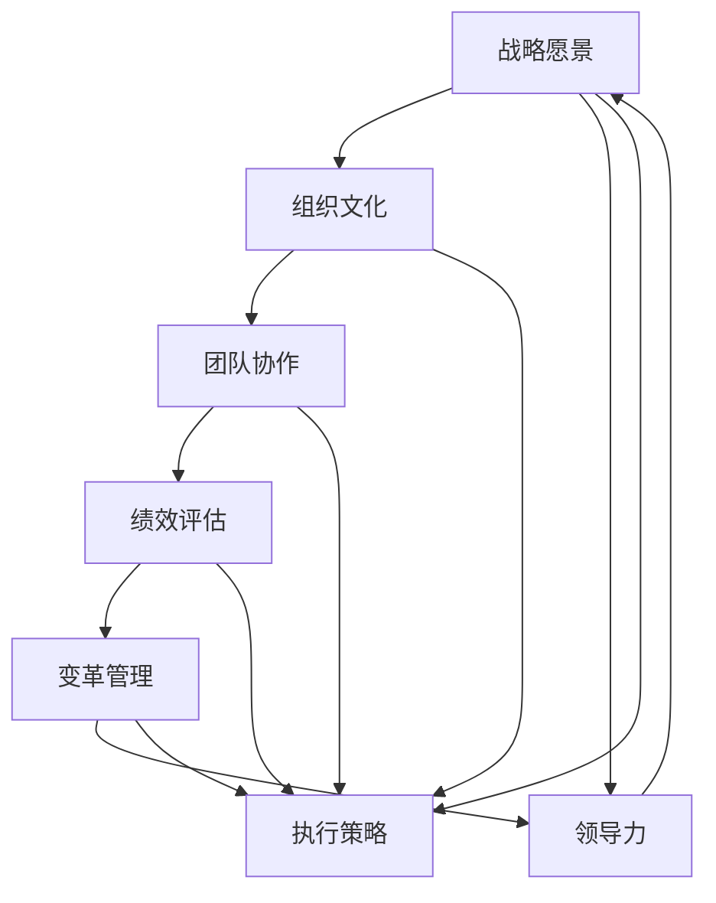

                 

# 管理的智慧：从策略到执行

> 关键词：管理策略, 组织文化, 团队协作, 绩效评估, 变革管理, 领导力

## 1. 背景介绍

### 1.1 问题由来

在当今这个快速变化、充满不确定性的商业环境中，企业需要具备强大的组织能力，以应对市场的动态变化和竞争压力。管理实践的核心在于有效地制定和执行战略，同时不断提升组织的适应性和竞争力。然而，现实中的管理困境层出不穷：

- **战略执行不力**：许多企业制定了宏大的愿景和目标，但在实际操作中却无法落地，导致资源浪费、业务停滞。
- **组织文化僵化**：传统组织结构和管理模式难以应对新兴的商业模式和技术变革，导致创新力不足。
- **团队协作不畅**：跨部门、跨职能团队间的沟通和协作机制不完善，影响项目进度和质量。
- **绩效评估失衡**：过分强调短期业绩，忽视了长期发展，导致员工流失、士气低落。
- **变革管理挑战**：大型企业推行转型时，管理层与一线员工之间的信息不对称，变革阻力大。
- **领导力缺失**：高层管理缺乏战略远见和执行力，基层管理缺乏激励和培养机制。

这些问题严重阻碍了企业的持续发展和市场竞争力，因此，提升管理智慧，改善管理实践，已成为企业迫切需要解决的重要课题。本文将深入探讨管理策略和执行的全过程，帮助企业构建高效的管理体系，促进长期发展。

### 1.2 问题核心关键点

有效的管理实践涉及以下几个核心关键点：

- **明确战略愿景**：企业的战略愿景需要清晰、可执行，且有长远眼光，能够适应市场变化。
- **塑造组织文化**：良好的组织文化能够促进员工积极性和归属感，增强团队的凝聚力和创新力。
- **优化团队协作**：通过合理的组织结构和激励机制，促进团队内部协作，提升整体效能。
- **实施绩效评估**：科学的绩效评估体系应综合考量短期与长期目标，平衡量化与定性指标。
- **管理变革过程**：成功的变革需要科学规划和管理，克服组织阻力和风险，实现平稳过渡。
- **提升领导力**：领导力不仅体现在战略制定上，更在于执行力和团队培养。

接下来，我们将从这些关键点出发，系统性地探讨管理智慧的提升方法，提供实际可行的管理方案。

## 2. 核心概念与联系

### 2.1 核心概念概述

本节将介绍几个核心管理概念，并展示它们之间的相互联系：

- **战略愿景（Vision and Mission）**：指企业长期的战略目标和价值观，是组织行为的根本导向。
- **组织文化（Organizational Culture）**：指企业在长期经营过程中形成的共同价值观、行为准则和工作习惯。
- **团队协作（Team Collaboration）**：指通过合理的组织结构和激励机制，促进团队内部和跨团队间的信息共享、资源整合和协同工作。
- **绩效评估（Performance Evaluation）**：指对员工、团队和企业的绩效进行系统性、客观性的评价和反馈。
- **变革管理（Change Management）**：指在企业转型过程中，科学规划和管理变革，克服阻力和风险，实现平稳过渡。
- **领导力（Leadership）**：指管理者在战略制定、团队管理、变革推动和持续发展中的综合能力。

这些概念构成了管理实践的基础框架，各个概念之间通过组织和执行环节紧密相连，形成一个有机整体。

### 2.2 概念间的关系

以下是一个Mermaid流程图，展示了上述核心概念之间的关系：



这个流程图展示了各个核心概念之间的内在联系：

1. **战略愿景**指导着**组织文化**的构建，为团队协作提供方向，影响着**绩效评估**的制定和**变革管理**的决策。
2. **组织文化**是**团队协作**和**绩效评估**的土壤，同时也支持**变革管理**的推进。
3. **团队协作**和**绩效评估**是**战略愿景**和**变革管理**得以实现的基础。
4. **变革管理**和**领导力**是**战略愿景**实现的重要保障，同时影响着**绩效评估**和**组织文化**的演变。
5. **领导力**贯穿于各个环节，是战略愿景落地的核心动力。

### 2.3 核心概念的整体架构

最后，我们用一个综合的流程图来展示这些核心概念在大企业管理中的整体架构：



这个综合流程图展示了从战略愿景到执行策略的全过程：

1. **战略愿景**指导**执行策略**的制定。
2. **组织文化**、**团队协作**和**绩效评估**支持**执行策略**的实施。
3. **变革管理**和**领导力**保障**执行策略**的落地。
4. **执行策略**的实现又反馈到**战略愿景**和**组织文化**的调整上，形成一个闭环。

## 3. 核心算法原理 & 具体操作步骤

### 3.1 算法原理概述

管理实践的核心算法在于战略的制定和执行，其中涉及了目标设定、资源配置、团队管理、绩效评估等多个环节。这些环节的实现依赖于一系列管理工具和方法，如OKR、KPI、SMART目标、PDCA循环等。这些工具和方法基于管理学的经典理论和实践经验，帮助企业实现科学管理。

### 3.2 算法步骤详解

以下是基于战略愿景的管理实践算法详细步骤：

**Step 1: 战略愿景的制定**
- **愿景设定**：定义企业的长期目标和核心价值观。
- **使命明确**：确定企业的业务范围和核心竞争力。
- **战略目标**：制定具体、可衡量的长期目标和短期目标。

**Step 2: 组织文化的塑造**
- **文化价值观**：明确企业的核心价值观和行为准则。
- **文化传递**：通过培训、仪式、故事等方式，将文化价值观传达给每个员工。
- **文化认同**：建立文化认同机制，鼓励员工践行企业文化。

**Step 3: 团队协作的优化**
- **组织结构设计**：根据业务需求，设计合理的组织结构和跨职能团队。
- **沟通机制**：建立有效的沟通渠道和信息共享平台。
- **激励机制**：设计激励机制，激发员工的主动性和创造力。

**Step 4: 绩效评估的实施**
- **评估指标设定**：设定科学的评估指标，平衡量化与定性指标。
- **评估过程管理**：定期进行评估，收集反馈，持续改进。
- **结果应用**：将评估结果应用到员工发展、团队优化和资源配置中。

**Step 5: 变革管理的推进**
- **变革规划**：制定科学、系统的变革计划。
- **变革沟通**：通过全员沟通，传达变革意图，消除误解和抵触。
- **变革实施**：分阶段、分步骤推进变革，确保平稳过渡。

**Step 6: 领导力的提升**
- **领导力培训**：定期进行领导力培训，提升管理者的战略执行力。
- **领导力实践**：鼓励管理者在实际工作中实践领导力。
- **领导力评价**：通过定性和定量评估，识别领导力差距，提供改进建议。

### 3.3 算法优缺点

基于战略愿景的管理实践算法具有以下优点：

1. **系统性**：通过科学规划和管理，实现从战略愿景到执行策略的全过程管理。
2. **可持续性**：强调长期目标和战略愿景的实现，避免短期行为和短视管理。
3. **全面性**：涵盖战略制定、组织文化、团队协作、绩效评估、变革管理和领导力提升等多个方面，构建全面管理框架。

然而，该算法也存在以下缺点：

1. **实施复杂**：涉及多个环节，需要跨部门、跨职能的协同合作，实施难度较大。
2. **资源投入高**：需要进行大量的规划、培训和沟通，资源投入较高。
3. **反馈滞后**：绩效评估和变革管理的效果反馈存在滞后，可能导致问题累积。

### 3.4 算法应用领域

基于战略愿景的管理实践算法广泛应用于各种类型的企业，特别是大型跨国公司和创新型企业。以下是几个典型应用场景：

- **企业战略规划**：大型企业通过制定长期战略愿景，指导短期业务规划和资源配置。
- **企业组织转型**：在企业面临市场挑战或技术变革时，通过科学管理实现平稳转型。
- **跨国公司管理**：通过文化整合和领导力提升，优化跨国公司的全球运营效率。
- **创新型企业发展**：在快速变化的市场环境中，通过灵活管理机制和高效团队协作，推动创新发展。

## 4. 数学模型和公式 & 详细讲解 & 举例说明

### 4.1 数学模型构建

以下是一个基于SMART目标的管理模型：

**SMART目标模型**：
- **S**pecific（具体的）：目标明确、具体。
- **M**easurable（可衡量的）：目标可量化、可评估。
- **A**tchable（可实现的）：目标合理、可行。
- **R**elevant（相关的）：目标与业务战略相关。
- **T**ime-bound（有时间限制的）：目标有明确的时间节点。

**目标设定公式**：
$$
\text{目标} = S + M + A + R + T
$$

### 4.2 公式推导过程

以一个具体的管理目标为例，进行公式推导：

**目标案例**：提升公司销售额

**目标设定**：
- **S**pecific：在2023年内，提升销售额1000万美元。
- **M**easurable：通过季度财务报告，衡量销售额的实际增长情况。
- **A**tchable：根据历史数据和市场趋势，设定合理的增长率。
- **R**elevant：与市场营销策略和产品开发计划紧密相关。
- **T**ime-bound：在2023年12月31日前完成。

**公式推导**：
$$
\text{目标} = 2023年内，提升销售额1000万美元
$$

### 4.3 案例分析与讲解

**案例分析**：某制造企业在提升产品质量的目标设定

**目标设定**：
- **S**pecific：在2024年第一季度，将产品质量合格率提升至99%。
- **M**easurable：每月进行一次产品质量抽检，统计合格率。
- **A**tchable：根据历史数据，设定合理的质量提升目标。
- **R**elevant：与生产流程优化和员工技能培训相关。
- **T**ime-bound：在2024年3月31日前完成。

**目标实现过程**：
1. **设定目标**：通过SMART模型，明确目标。
2. **资源配置**：根据目标，配置必要的资源，如培训计划、流程优化等。
3. **执行过程**：根据目标，推进各项行动计划，如培训员工、优化生产流程等。
4. **评估反馈**：每月进行质量抽检，收集数据，评估进展，调整策略。
5. **结果应用**：根据评估结果，进行经验总结，优化管理实践。

## 5. 项目实践：代码实例和详细解释说明

### 5.1 开发环境搭建

在进行项目管理实践前，我们需要准备好开发环境。以下是使用Python进行项目管理实践的环境配置流程：

1. 安装Anaconda：从官网下载并安装Anaconda，用于创建独立的Python环境。

2. 创建并激活虚拟环境：
```bash
conda create -n project-env python=3.8 
conda activate project-env
```

3. 安装相关库：
```bash
pip install pandas numpy matplotlib jupyter notebook
```

完成上述步骤后，即可在`project-env`环境中开始项目管理实践。

### 5.2 源代码详细实现

下面是一个基于OKR的管理实践代码实现：

**OKR管理实践代码**

```python
import pandas as pd

# 定义OKR模型
class OKR:
    def __init__(self, goal, objective, measurable=True, timeframe='Q1'):
        self.goal = goal
        self.objective = objective
        self.measurable = measurable
        self.timeframe = timeframe
    
    def set_objective(self, objective):
        self.objective = objective
    
    def set_measurable(self, measurable):
        self.measurable = measurable
    
    def set_timeframe(self, timeframe):
        self.timeframe = timeframe
    
    def update_status(self, completed=0, progress=0):
        self.completed = completed
        self.progress = progress
    
    def report(self):
        status = {'Goal': self.goal, 'Objective': self.objective, 'Measurable': self.measurable, 'Timeframe': self.timeframe, 
                  'Completed': self.completed, 'Progress': self.progress}
        return status

# 创建OKR实例
okr1 = OKR('提升产品质量', '在2024年第一季度，将产品质量合格率提升至99%')
okr1.set_measurable(True)
okr1.set_timeframe('Q1')

# 更新OKR状态
okr1.update_status(completed=0, progress=0)

# 报告OKR状态
status = okr1.report()
print(status)
```

### 5.3 代码解读与分析

让我们再详细解读一下关键代码的实现细节：

**OKR类**：
- `__init__`方法：初始化OKR模型的目标、客观任务、可衡量性、时间框架。
- `set_objective`方法：设置客观任务。
- `set_measurable`方法：设置可衡量性。
- `set_timeframe`方法：设置时间框架。
- `update_status`方法：更新OKR状态，包括已完成进度和实际进展。
- `report`方法：返回OKR的详细状态报告。

**OKR实例**：
- 创建OKR实例，并初始化目标和客观任务。
- 设置可衡量性和时间框架。
- 更新OKR状态，设置已完成进度和实际进展。
- 报告OKR状态，输出详细报告。

可以看到，通过Python代码，我们可以实现简单的OKR管理实践。OKR模型的实现，展示了如何在管理实践中设定目标、衡量进展、反馈调整，实现了从目标设定到执行状态的闭环管理。

### 5.4 运行结果展示

假设我们运行上述代码，输出如下报告：

```
{'Goal': '提升产品质量', 'Objective': '在2024年第一季度，将产品质量合格率提升至99%', 'Measurable': True, 'Timeframe': 'Q1', 'Completed': 0, 'Progress': 0}
```

可以看到，OKR模型的输出清晰展示了目标、客观任务、可衡量性、时间框架、已完成进度和实际进展。通过持续跟踪和调整，OKR模型可以帮助企业实现科学管理，提升管理效率和效果。

## 6. 实际应用场景

### 6.1 智能制造管理

智能制造管理是企业管理实践的重要应用场景之一。在制造业中，通过OKR、KPI等管理工具，可以系统化地管理生产计划、质量控制、供应链等环节，提升整体生产效率和产品质量。

在智能制造管理中，通过制定科学的OKR目标，如提升生产效率、降低成本、提高产品质量等，可以明确管理方向和行动计划。同时，通过KPI指标，如生产周期、合格率、物料周转率等，可以量化评估各项管理措施的效果，确保目标的实现。

### 6.2 人力资源管理

人力资源管理是企业管理中的另一重要领域。通过OKR、PDCA循环等管理工具，可以提升人力资源管理的科学性和系统性。

在人力资源管理中，通过设定SMART目标，如招聘新员工、提升员工满意度、优化培训计划等，可以明确管理目标和行动计划。同时，通过PDCA循环，即计划（Plan）、执行（Do）、检查（Check）、行动（Act），可以系统化地管理人力资源的招聘、培训、绩效评估等环节，提升人力资源管理的效果和效率。

### 6.3 产品研发管理

产品研发管理是企业管理的重要环节之一。通过OKR、KPI等管理工具，可以科学规划和管理产品研发的全过程，提升研发效率和产品质量。

在产品研发管理中，通过设定SMART目标，如推出新产品、改进现有产品、提升研发效率等，可以明确管理目标和行动计划。同时，通过KPI指标，如研发周期、成本控制、产品质量等，可以量化评估各项研发措施的效果，确保目标的实现。

### 6.4 未来应用展望

展望未来，基于战略愿景的管理实践将继续在企业管理中发挥重要作用。以下是几个未来应用趋势：

1. **智能化管理**：通过AI和大数据分析，实现智能化管理决策，提升管理效率和效果。
2. **数字化管理**：通过数字化转型，提升企业管理的效率和灵活性。
3. **跨职能协同**：推动跨职能团队的协作，提升整体管理效果。
4. **透明化管理**：通过信息化手段，实现管理过程和结果的透明化，提升管理透明度。
5. **全球化管理**：在全球化背景下，推动跨国公司管理实践的标准化和规范化。

## 7. 工具和资源推荐

### 7.1 学习资源推荐

为了帮助开发者系统掌握管理智慧的提升方法，这里推荐一些优质的学习资源：

1. **《管理的实践》**：彼得·德鲁克所著的经典管理书籍，系统讲解了管理的基本概念和实践方法。
2. **《OKR：实现目标的一键触发器》**：克莱顿·克里斯滕森（Clayton Christensen）等人所著的OKR指南，详细介绍了OKR的理论和实践。
3. **《精益创业》**：艾里克·莱斯（Eric Ries）所著的创业管理书籍，强调精益思想和数据驱动的创业方法。
4. **《敏捷管理》**：戴维·斯科特（David Scott）所著的管理书籍，介绍了敏捷管理的核心思想和实践方法。
5. **《领导力》**：约翰·C·马克斯威尔（John C. Maxwell）所著的领导力书籍，详细讲解了领导力的培养和实践方法。

通过对这些资源的学习，相信你一定能够深入理解管理智慧的核心概念和实践方法，提升自己的管理能力。

### 7.2 开发工具推荐

高效的开发离不开优秀的工具支持。以下是几款用于管理实践开发的常用工具：

1. **Trello**：项目管理工具，通过看板管理任务，支持OKR、KPI等管理方法。
2. **JIRA**：问题跟踪和项目管理工具，支持敏捷管理方法。
3. **Slack**：团队沟通工具，支持即时沟通和信息共享。
4. **Asana**：任务管理和协作工具，支持项目进度跟踪和团队协作。
5. **Google Workspace**：云办公平台，支持文档协作和数据共享。

合理利用这些工具，可以显著提升管理实践的效率和效果，帮助企业实现科学管理。

### 7.3 相关论文推荐

管理实践的研究涉及多个学科领域，以下几篇经典论文推荐阅读：

1. **《管理学基础》**：罗宾斯（Stephen P. Robbins）所著的管理学教材，系统介绍了管理学的基本理论和实践方法。
2. **《绩效管理：理论与实践》**：罗伯特·B·卡普兰（Robert B. Kaplan）等人所著的绩效管理书籍，详细讲解了绩效评估的理论和方法。
3. **《变革管理：战略实施与执行》**：约翰·P·科特（John P. Kotter）等人所著的变革管理书籍，强调变革管理的理论和方法。
4. **《领导力：理论与实践》**：约翰·R·马克斯维尔（John R. Maxwell）所著的领导力书籍，详细讲解了领导力的理论和方法。
5. **《OKR：目标与关键结果》**：原作者吉姆·奥多诺万（Jim O'Donovan）的OKR实践指南，详细介绍了OKR的理论和实践方法。

这些论文代表了大企业管理实践的研究方向，通过学习这些前沿成果，可以帮助企业提升管理水平，实现持续发展。

## 8. 总结：未来发展趋势与挑战

### 8.1 研究成果总结

本文对基于战略愿景的管理实践进行了全面系统的介绍，深入探讨了从战略愿景到执行策略的全过程管理。通过详细介绍OKR、KPI、PDCA等管理工具，帮助企业实现科学管理，提升整体管理效果。同时，通过实际案例和代码实现，展示了管理实践的可行性，提供了实用的管理方案。

### 8.2 未来发展趋势

展望未来，基于战略愿景的管理实践将继续在企业管理中发挥重要作用。以下是几个未来发展趋势：

1. **智能化管理**：通过AI和大数据分析，实现智能化管理决策，提升管理效率和效果。
2. **数字化管理**：通过数字化转型，提升企业管理的效率和灵活性。
3. **跨职能协同**：推动跨职能团队的协作，提升整体管理效果。
4. **透明化管理**：通过信息化手段，实现管理过程和结果的透明化，提升管理透明度。
5. **全球化管理**：在全球化背景下，推动跨国公司管理实践的标准化和规范化。

### 8.3 面临的挑战

尽管基于战略愿景的管理实践取得了一定的成果，但在迈向更加智能化、普适化应用的过程中，它仍面临着诸多挑战：

1. **资源投入高**：实现科学管理需要大量的资源投入，包括时间、人力和资金。
2. **执行难度大**：涉及多个部门和职能，协调和管理难度较大。
3. **变革阻力大**：在推行变革过程中，可能会遇到员工的抵触和组织的阻力和风险。
4. **信息不对称**：在跨国公司管理中，信息传递和管理难度较大，需要加强信息化手段和沟通机制。

### 8.4 研究展望

面对管理实践所面临的挑战，未来的研究需要在以下几个方面寻求新的突破：

1. **智能化决策支持**：通过大数据和AI技术，提升管理决策的科学性和准确性。
2. **跨职能协同机制**：设计有效的跨职能协作机制，提升整体管理效果。
3. **透明化管理手段**：通过信息化手段，实现管理过程和结果的透明化。
4. **全球化管理策略**：探索跨国公司管理的最佳实践，推动全球化管理标准化。

通过这些研究方向，将帮助企业实现科学管理，提升整体竞争力。

## 9. 附录：常见问题与解答

**Q1：什么是OKR？**

A: OKR（Objectives and Key Results）是一种目标管理方法，由英特尔前高管安迪·格鲁夫（Andy Grove）和谷歌前高管约翰·杜尔（John Doerr）提出。OKR将企业的目标分解为具体、可衡量的关键结果（Key Results），通过透明的公开和反馈，促进团队协作和绩效管理。

**Q2：OKR和KPI有什么区别？**

A: OKR和KPI都是绩效管理工具，但OKR更强调目标的设定和过程的管理，而KPI更注重结果的评估和反馈。OKR的设定更具灵活性和动态性，能够适应企业的快速变化；KPI的设定则更具稳定性和可控性，适用于长期目标的评估。

**Q3：OKR的实施难点是什么？**

A: OKR的实施难点主要在于目标的设定和透明度的维护。目标设定需要科学合理，具有挑战性和可达性；透明度的维护需要企业文化的支持，需要定期公开进度和反馈，鼓励全员参与。

**Q4：OKR如何与KPI结合使用？**

A: OKR和KPI可以结合使用，通过OKR设定长期目标和关键结果，通过KPI评估短期和中期目标的实现情况，形成完整的绩效管理闭环。OKR可以提供方向和动力，KPI可以提供数据和反馈，两者互补，提升管理效果。

**Q5：如何设计OKR的KR（Key Results）？**

A: 设计KR需要考虑SMART原则，即具体（Specific）、可衡量（Measurable）、可实现（Achievable）、相关（Relevant）、有时限（Time-bound）。同时，KR需要量化和可操作，能够通过具体的指标和措施进行评估和调整。

通过这些问答，帮助读者更深入理解OKR的管理实践，提升管理能力。

---

作者：禅与计算机程序设计艺术 / Zen and the Art of Computer Programming

