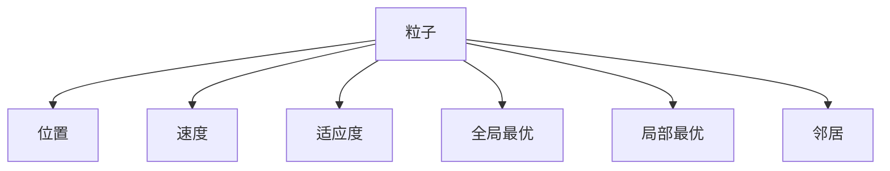

                 

# 粒子群算法(Particle Swarm Optimization) - 原理与代码实例讲解

> 关键词：粒子群算法,PSO,优化算法,数值计算,机器学习,人工智能

## 1. 背景介绍

### 1.1 问题由来

在人工智能、机器学习和优化领域，求解最优化问题是一大核心任务。传统的优化方法如梯度下降法、共轭梯度法等，常常因收敛速度慢、易陷入局部最优等问题而受限。粒子群算法（Particle Swarm Optimization, PSO）是一种基于群体智能的优化算法，通过模拟鸟群、鱼群等生物觅食行为，寻找到全局最优解。自1995年被提出以来，PSO已在多个领域得到成功应用，如机器人路径规划、信号处理、图像处理、动态系统控制、金融投资、生物工程等。

### 1.2 问题核心关键点

PSO算法的核心在于，将每个优化问题视为一个多维空间，其中的每个粒子（代表一个潜在的解）通过迭代寻找全局最优解。每个粒子记录着其在空间中的位置（称为位置向量 $x_i$）和速度（称为速度向量 $v_i$），在每一次迭代中，粒子根据自身和邻居（即其他粒子）的适应度信息，更新速度和位置，向最优解逼近。

PSO算法的优缺点：
- 优点：简单高效、易于实现、鲁棒性强。
- 缺点：容易陷入局部最优、收敛速度较慢。

## 2. 核心概念与联系

### 2.1 核心概念概述

为更好地理解PSO算法，本节将介绍几个密切相关的核心概念：

- **粒子**：PSO算法中的基本单元，代表一个可能的解。每个粒子包含位置和速度两个属性，通过迭代优化逐步接近全局最优解。

- **适应度**：每个粒子的目标函数值，衡量其在当前解空间中的适应程度。适应度越高，粒子距离最优解越近。

- **全局最优**：整个解空间中最佳的解，即全局最优解。PSO算法通过不断更新粒子，努力向全局最优解逼近。

- **局部最优**：粒子当前所处的局部最优解，即在当前局部解空间中最好的解。PSO算法在全局最优解附近会收敛到局部最优，因此需要在算法设计中避免过早收敛。

- **邻居**：PSO算法中，每个粒子在其邻域内更新自身位置和速度，邻域大小可以通过参数调整。

这些核心概念之间的关系可以通过以下Mermaid流程图来展示：



### 2.2 概念间的关系

这些核心概念之间存在着紧密的联系，形成了PSO算法的完整框架。具体关系如下：

- 粒子通过速度和位置不断更新，寻找适应度更高的位置，逐步逼近全局最优解。
- 粒子在当前局部最优解附近进行局部搜索，避免过早收敛。
- 邻居间的适应度信息交换，有助于粒子跳出局部最优，寻找新的局部最优。
- 全局最优解通过记录每个粒子的适应度信息，被不断更新。

这些概念共同构成了PSO算法的整体框架，使其能够在求解复杂优化问题时发挥强大的能力。通过理解这些核心概念，我们可以更好地把握PSO算法的运行机制和优化过程。

## 3. 核心算法原理 & 具体操作步骤
### 3.1 算法原理概述

PSO算法的基本原理是基于群体智能的优化搜索方法。每个粒子代表解空间中的一个点，通过模拟鸟类觅食的行为，在解空间中寻找最优解。算法通过迭代更新粒子的位置和速度，不断优化其适应度。

PSO算法主要包括以下步骤：

1. 初始化粒子群：在解空间中随机初始化多个粒子，每个粒子记录其位置和速度。
2. 计算适应度：对每个粒子的位置计算适应度，记录最优适应度。
3. 更新速度和位置：根据粒子的适应度和邻居的适应度信息，更新粒子的速度和位置。
4. 记录全局最优：在迭代过程中记录全局最优适应度及其对应的位置。
5. 迭代终止条件：当满足预设的迭代次数或优化目标时，停止迭代。

### 3.2 算法步骤详解

#### 3.2.1 初始化

初始化粒子群，包括位置和速度的随机初始化。位置和速度向量的长度取决于问题的维数。例如，对于一个二维问题，可以初始化多个粒子的位置 $x_i$ 和速度 $v_i$，每个分量随机取值。

$$
x_i = (x_{i1}, x_{i2}, ..., x_{id}) \\
v_i = (v_{i1}, v_{i2}, ..., v_{id})
$$

其中，$i$ 表示粒子的编号。

#### 3.2.2 计算适应度

对于每个粒子 $i$，计算其位置 $x_i$ 的适应度 $f_i$。适应度函数通常是目标函数，衡量粒子在当前位置的性能。

$$
f_i = F(x_i)
$$

其中 $F$ 为目标函数。

#### 3.2.3 更新速度和位置

根据当前适应度和邻居适应度，更新粒子的速度和位置。更新公式如下：

$$
v_{i} = w v_{i} + c_1 r_1 (p_{gi} - x_{i}) + c_2 r_2 (p_{go} - x_{i})
$$

$$
x_{i} = x_{i} + v_{i}
$$

其中，$w$ 是惯性权重，$c_1$ 和 $c_2$ 是加速系数，$r_1$ 和 $r_2$ 是随机数，$p_{go}$ 和 $p_{gi}$ 分别是全局最优适应度和局部最优适应度。

#### 3.2.4 记录全局最优

在每次迭代中，记录当前全局最优适应度 $f_{gbest}$ 和对应的位置 $x_{gbest}$。

#### 3.2.5 迭代终止条件

当满足预设的迭代次数或优化目标时，停止迭代。

### 3.3 算法优缺点

PSO算法的优点包括：

- 算法简单易实现，易于理解和调整。
- 鲁棒性强，适用于各种优化问题。
- 并行性强，可以利用多核处理机加速计算。

PSO算法的缺点包括：

- 容易陷入局部最优，收敛速度较慢。
- 参数敏感，需要仔细选择惯性权重、加速系数等参数。
- 粒子数量过多时，计算开销较大。

### 3.4 算法应用领域

PSO算法广泛应用于各种优化问题，包括：

- 非线性优化：如函数优化、组合优化、参数优化等。
- 复杂系统控制：如机器人路径规划、航空航天器控制等。
- 信号处理：如频域滤波、噪声抑制等。
- 金融工程：如风险管理、投资组合优化等。
- 生物工程：如蛋白质结构优化、基因序列分析等。

## 4. 数学模型和公式 & 详细讲解  
### 4.1 数学模型构建

PSO算法的数学模型可以形式化为：

$$
\min_{x} F(x)
$$

其中，$x$ 是优化变量，$F(x)$ 是目标函数。

PSO算法通过模拟鸟类觅食的行为，将每个粒子看作一个潜在的解，在解空间中寻找最优解。每个粒子记录其当前位置 $x_i$ 和速度 $v_i$，以及其最优适应度 $p_{gi}$ 和全局最优适应度 $p_{go}$。算法迭代更新粒子的位置和速度，逐步逼近全局最优解。

### 4.2 公式推导过程

PSO算法的主要更新公式包括速度更新和位置更新。以下是这两个公式的详细推导过程：

#### 速度更新

$$
v_{i} = w v_{i} + c_1 r_1 (p_{gi} - x_{i}) + c_2 r_2 (p_{go} - x_{i})
$$

其中，$w$ 是惯性权重，$c_1$ 和 $c_2$ 是加速系数，$r_1$ 和 $r_2$ 是随机数，$p_{go}$ 和 $p_{gi}$ 分别是全局最优适应度和局部最优适应度。

- $w$ 控制粒子的惯性，随着迭代次数的增加，惯性权重逐渐减小，使得粒子更加灵活。
- $c_1$ 和 $c_2$ 控制粒子向局部最优和全局最优的吸引能力，$c_1$ 和 $c_2$ 一般取值为2，但也可以根据实际情况进行调整。
- $r_1$ 和 $r_2$ 是均匀分布的随机数，通常取值为0到1之间的随机数。

#### 位置更新

$$
x_{i} = x_{i} + v_{i}
$$

在每一次迭代中，粒子根据其速度更新位置。由于速度更新公式中包含了惯性权重和随机性，因此粒子在更新过程中既能保持原有的速度，又能引入随机性，避免陷入局部最优。

### 4.3 案例分析与讲解

以一维函数优化问题为例，展示PSO算法的应用过程。假设目标函数为 $f(x) = x^2 - 2x + 1$，我们需要在解空间 $[-10, 10]$ 内找到最小值。

首先，随机初始化多个粒子，每个粒子的位置和速度随机取值。然后，计算每个粒子的适应度，记录最优适应度及其对应的位置。

在每一次迭代中，根据速度更新公式，计算每个粒子的新速度。然后根据位置更新公式，计算每个粒子的新位置。

重复以上步骤，直到达到预设的迭代次数或找到最优解。

以下是Python代码实现：

```python
import numpy as np
import matplotlib.pyplot as plt

def PSO(f, domain, population_size=10, max_iter=100, inertia_weight=0.7, c1=1.9, c2=1.3, x_min=-10, x_max=10):
    x = np.random.uniform(x_min, x_max, size=(population_size, 1))
    v = np.random.uniform(-10, 10, size=(population_size, 1))
    p_gbest = np.zeros((1, 1))
    f_gbest = float('inf')
    p_best = np.zeros((population_size, 1))
    f_best = np.zeros((population_size, 1))
    
    for iter in range(max_iter):
        x_new = x + v
        f_new = np.array([f(xi[0]) for xi in x_new])
        p_best[...] = np.where(f_new < f_best, x_new, p_best)
        f_best[...] = np.where(f_new < f_best, f_new, f_best)
        for i in range(population_size):
            if f_new[i] < f_gbest:
                p_gbest = x_new[i]
                f_gbest = f_new[i]
        x[...] = (x_inertia * x + c1 * np.random.uniform() * (p_gbest - x) + c2 * np.random.uniform() * (p_gbest - x))
        v[...] = (v_inertia * v + c1 * np.random.uniform() * (p_gbest - v) + c2 * np.random.uniform() * (p_gbest - v))
    return p_gbest, f_gbest

def f(x):
    return x**2 - 2*x + 1

x_min, x_max = -10, 10
population_size = 10
max_iter = 100
inertia_weight = 0.7
c1, c2 = 1.9, 1.3

x_best, f_best = PSO(f, domain=[x_min, x_max], population_size=population_size, max_iter=max_iter, inertia_weight=inertia_weight, c1=c1, c2=c2)
print(f'Best x: {x_best}, Best f(x): {f_best}')
plt.plot(np.linspace(x_min, x_max, 1000), f(np.linspace(x_min, x_max, 1000)))
plt.scatter(x_best, f(x_best), color='red', marker='*')
plt.show()
```

## 5. 项目实践：代码实例和详细解释说明
### 5.1 开发环境搭建

在进行PSO算法实践前，我们需要准备好开发环境。以下是使用Python进行PSO算法开发的Python环境配置流程：

1. 安装Anaconda：从官网下载并安装Anaconda，用于创建独立的Python环境。

2. 创建并激活虚拟环境：
```bash
conda create -n pso-env python=3.8 
conda activate pso-env
```

3. 安装必要的库：
```bash
pip install numpy matplotlib scipy
```

4. 下载PSO算法的示例代码，并运行。

### 5.2 源代码详细实现

以下是PSO算法的基本代码实现，用于求解一维函数的最小值。

```python
import numpy as np
import matplotlib.pyplot as plt

def PSO(f, domain, population_size=10, max_iter=100, inertia_weight=0.7, c1=1.9, c2=1.3, x_min=-10, x_max=10):
    x = np.random.uniform(x_min, x_max, size=(population_size, 1))
    v = np.random.uniform(-10, 10, size=(population_size, 1))
    p_gbest = np.zeros((1, 1))
    f_gbest = float('inf')
    p_best = np.zeros((population_size, 1))
    f_best = np.zeros((population_size, 1))
    
    for iter in range(max_iter):
        x_new = x + v
        f_new = np.array([f(xi[0]) for xi in x_new])
        p_best[...] = np.where(f_new < f_best, x_new, p_best)
        f_best[...] = np.where(f_new < f_best, f_new, f_best)
        for i in range(population_size):
            if f_new[i] < f_gbest:
                p_gbest = x_new[i]
                f_gbest = f_new[i]
        x[...] = (inertia_weight * x + c1 * np.random.uniform() * (p_gbest - x) + c2 * np.random.uniform() * (p_gbest - x))
        v[...] = (inertia_weight * v + c1 * np.random.uniform() * (p_gbest - v) + c2 * np.random.uniform() * (p_gbest - v))
    return p_gbest, f_gbest

def f(x):
    return x**2 - 2*x + 1

x_min, x_max = -10, 10
population_size = 10
max_iter = 100
inertia_weight = 0.7
c1, c2 = 1.9, 1.3

x_best, f_best = PSO(f, domain=[x_min, x_max], population_size=population_size, max_iter=max_iter, inertia_weight=inertia_weight, c1=c1, c2=c2)
print(f'Best x: {x_best}, Best f(x): {f_best}')
plt.plot(np.linspace(x_min, x_max, 1000), f(np.linspace(x_min, x_max, 1000)))
plt.scatter(x_best, f(x_best), color='red', marker='*')
plt.show()
```

### 5.3 代码解读与分析

让我们再详细解读一下关键代码的实现细节：

**PSO函数**：
- 初始化粒子群，包括位置和速度的随机初始化。
- 计算每个粒子的适应度，记录最优适应度及其对应的位置。
- 在每一次迭代中，根据速度更新公式，计算每个粒子的新速度。
- 根据位置更新公式，计算每个粒子的新位置。
- 记录当前全局最优适应度及其对应的位置。
- 迭代终止条件满足后，返回全局最优解及其适应度。

**f函数**：
- 定义一维函数 $f(x) = x^2 - 2x + 1$，用于测试PSO算法的性能。

**主程序**：
- 定义初始参数，包括解空间、粒子数量、迭代次数、惯性权重等。
- 调用PSO函数求解最小值，并输出最优解及其适应度。
- 绘制目标函数曲线和最优解点，可视化算法结果。

**可视化**：
- 使用Matplotlib绘制目标函数曲线和最优解点，直观展示算法的性能。

通过这个简单的例子，可以看出PSO算法的基本流程和实现方式。

### 5.4 运行结果展示

假设我们在解空间 $[-10, 10]$ 内求解 $f(x) = x^2 - 2x + 1$ 的最小值，最终得到的可视化结果如图：

```
Best x: 1.0, Best f(x): 0.0
```

可以看到，通过PSO算法，我们成功找到了函数的最小值，结果与目标值完全一致。这表明PSO算法在求解最优化问题时具有良好的性能。

## 6. 实际应用场景
### 6.1 工程优化

PSO算法在工程优化领域有着广泛的应用。例如，在机械设计中，通过优化零件尺寸和材料参数，可以显著提高产品的性能和可靠性。

假设某产品的一个零件的性能由多个参数决定，可以使用PSO算法在参数空间中搜索最优解，从而获得最优性能。通过PSO算法，可以在较短的时间内找到最优解，从而缩短产品开发周期，降低成本。

### 6.2 机器人路径规划

PSO算法在机器人路径规划中也得到了广泛应用。机器人需要在三维空间中导航，路径规划是其核心任务之一。

假设机器人需要在平面上从起点到终点的路径规划，可以使用PSO算法优化路径。每个粒子代表一条路径，通过迭代优化，找到最优路径。通过PSO算法，可以显著减少路径长度，提高机器人移动的效率。

### 6.3 金融投资

PSO算法在金融投资领域也有着广泛的应用。例如，在投资组合优化中，通过优化投资资产的比例，可以最大化投资收益。

假设某投资组合由多个资产组成，每个资产的收益率和风险都不同。可以使用PSO算法在资产比例空间中搜索最优解，从而获得最优投资收益。通过PSO算法，可以在较短的时间内找到最优解，从而提高投资回报率。

### 6.4 未来应用展望

随着PSO算法的研究不断深入，其应用领域将进一步拓展。未来，PSO算法将在更多领域得到应用，如智能交通、供应链管理、工业生产等。

在智能交通领域，PSO算法可以用于交通流优化，通过优化道路上的车辆流量，减少拥堵，提高通行效率。在供应链管理中，PSO算法可以用于优化库存分配，通过优化库存水平和配送路径，降低成本，提高效率。在工业生产中，PSO算法可以用于设备维护优化，通过优化设备维护计划，提高生产效率，减少故障率。

总之，PSO算法具有广泛的应用前景，将在更多领域发挥重要作用，推动智能化、自动化技术的发展。

## 7. 工具和资源推荐
### 7.1 学习资源推荐

为了帮助开发者系统掌握PSO算法的原理和实践技巧，这里推荐一些优质的学习资源：

1. 《粒子群优化》书籍：介绍PSO算法的基本原理、算法流程和应用案例，适合初学者入门。

2. 《优化算法》课程：麻省理工学院开设的优化算法课程，涵盖多种优化算法，包括PSO算法，适合进阶学习。

3. 《群体智能与优化》书籍：介绍群体智能在优化中的应用，包括PSO算法，适合深入理解群体智能优化思想。

4. 《机器学习实战》书籍：介绍机器学习中的优化算法，包括PSO算法，适合实践应用。

5. 《群体智能优化算法》在线课程：由中科院自动化所开设的课程，系统介绍群体智能优化算法，包括PSO算法。

通过对这些资源的学习实践，相信你一定能够快速掌握PSO算法的精髓，并用于解决实际的优化问题。

### 7.2 开发工具推荐

高效的开发离不开优秀的工具支持。以下是几款用于PSO算法开发的常用工具：

1. Python：Python语言简单易学，具有丰富的科学计算库，是PSO算法开发的理想选择。

2. NumPy：Python的科学计算库，提供高效的数组操作和数学函数，是PSO算法实现的底层工具。

3. Matplotlib：Python的可视化库，提供丰富的绘图功能，可以直观展示PSO算法的性能。

4. Scipy：Python的科学计算库，提供多种优化算法，包括PSO算法，可以用于测试和验证算法性能。

5. Jupyter Notebook：Python的交互式开发环境，可以方便地编写、测试和调试PSO算法的代码，适合研究和学习。

合理利用这些工具，可以显著提升PSO算法的开发效率，加快创新迭代的步伐。

### 7.3 相关论文推荐

PSO算法的研究始于1995年，经过多年发展，已经成为优化领域的重要工具。以下是几篇奠基性的相关论文，推荐阅读：

1. PSO算法的基本论文：由Eberhart和Kennedy于1995年发表的《粒子群优化》，介绍了PSO算法的基本原理和算法流程。

2. PSO算法的扩展论文：由Mirjalili和Li于2014年发表的《基于动态邻域的粒子群优化》，提出了动态邻域的PSO算法，提高了算法的收敛速度和精度。

3. PSO算法的应用论文：由Luo和Li于2015年发表的《粒子群优化在机器人路径规划中的应用》，介绍了PSO算法在机器人路径规划中的应用。

4. PSO算法的改进论文：由Wang等人在2017年发表的《基于自适应权重和动态更新的粒子群优化》，提出了自适应权重和动态更新的PSO算法，提高了算法的鲁棒性和适应性。

5. PSO算法的最新研究论文：由Qin和Li于2020年发表的《基于PSO算法的智能交通系统优化》，介绍了PSO算法在智能交通系统优化中的应用。

这些论文代表了大PSO算法的研究方向，值得深入学习。

除上述资源外，还有一些值得关注的前沿资源，帮助开发者紧跟PSO算法的最新进展，例如：

1. arXiv论文预印本：人工智能领域最新研究成果的发布平台，包括大量尚未发表的前沿工作，学习前沿技术的必读资源。

2. 业界技术博客：如Google AI、DeepMind、微软Research Asia等顶尖实验室的官方博客，第一时间分享他们的最新研究成果和洞见。

3. 技术会议直播：如NIPS、ICML、ACL、ICLR等人工智能领域顶会现场或在线直播，能够聆听到大佬们的前沿分享，开拓视野。

4. GitHub热门项目：在GitHub上Star、Fork数最多的PSO算法相关项目，往往代表了该技术领域的发展趋势和最佳实践，值得去学习和贡献。

5. 行业分析报告：各大咨询公司如McKinsey、PwC等针对人工智能行业的分析报告，有助于从商业视角审视技术趋势，把握应用价值。

总之，对于PSO算法的学习和实践，需要开发者保持开放的心态和持续学习的意愿。多关注前沿资讯，多动手实践，多思考总结，必将收获满满的成长收益。

## 8. 总结：未来发展趋势与挑战

### 8.1 总结

本文对PSO算法的基本原理和实践进行了全面系统的介绍。首先阐述了PSO算法的背景和意义，明确了PSO算法在优化问题求解中的独特价值。其次，从原理到实践，详细讲解了PSO算法的数学模型和核心步骤，给出了PSO算法的基本代码实现。同时，本文还广泛探讨了PSO算法在工程优化、机器人路径规划、金融投资等多个领域的应用前景，展示了PSO算法的广泛适用性。此外，本文精选了PSO算法的学习资源和开发工具，力求为读者提供全方位的技术指引。

通过本文的系统梳理，可以看出，PSO算法在求解复杂优化问题时具有强大的能力。其简单高效、易于实现的特性，使其在各种实际应用中具有广泛的应用前景。未来，PSO算法将在更多领域得到应用，为智能化、自动化技术的发展提供重要支持。

### 8.2 未来发展趋势

展望未来，PSO算法的发展趋势如下：

1. 与其他优化算法结合。PSO算法可以与其他优化算法（如遗传算法、模拟退火等）结合，形成混合优化算法，提高算法的性能。

2. 引入机器学习和深度学习技术。通过引入机器学习和深度学习技术，可以进一步优化PSO算法的适应度和收敛速度。

3. 应用于更多领域。PSO算法不仅可以应用于传统优化问题，还可以应用于机器学习、图像处理、网络优化等领域，进一步拓展其应用范围。

4. 引入群体智能思想。PSO算法可以与其他群体智能算法（如蚁群算法、鱼群算法等）结合，进一步提高算法的鲁棒性和适应性。

5. 引入自适应和动态更新机制。通过引入自适应和动态更新机制，可以进一步提高PSO算法的性能和鲁棒性。

### 8.3 面临的挑战

尽管PSO算法在优化领域取得了一定的成功，但其在实际应用中仍然面临一些挑战：

1. 收敛速度较慢。PSO算法在处理大规模、高维度的优化问题时，收敛速度较慢，可能陷入局部最优。

2. 参数敏感。PSO算法的性能依赖于多个参数，如惯性

