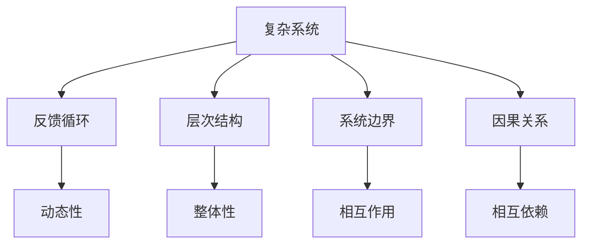
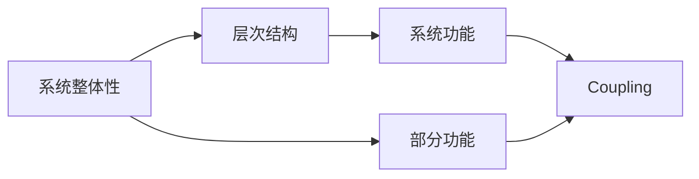
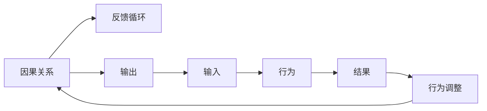
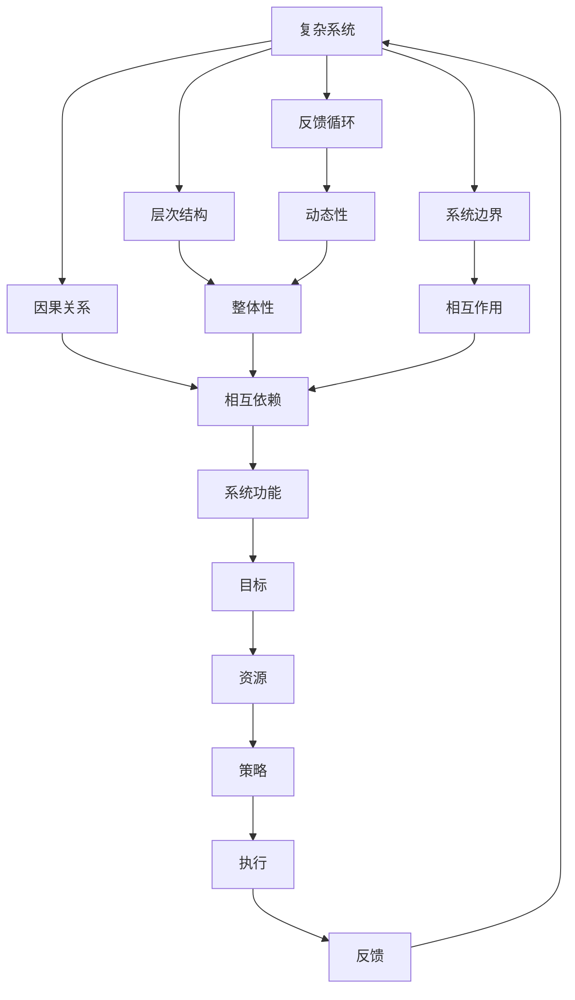

                 

## 1. 背景介绍

### 1.1 问题由来
在企业管理中，系统思考（Systems Thinking）是一种旨在理解复杂系统和促进其可持续发展的思维方式。它强调在复杂和动态环境中看待问题，重视系统整体性和相互关系，强调预防性而非响应性的思维方式。随着现代企业的复杂性和相互依赖性的增加，系统思考在企业管理中的应用越来越受到重视。

### 1.2 问题核心关键点
系统思考的核心关键点包括：

- 系统整体性：强调系统的整体功能和性能，不仅仅关注部分。
- 相互依赖性：系统中的各个组成部分是相互依赖、相互作用的，而不仅仅是孤立的。
- 动态性：系统是动态变化的，其状态和功能会随时间变化。
- 反馈循环：系统中的反馈机制会影响系统的稳定性和可持续性。
- 预防性思维：通过理解和预测系统行为，采取预防性措施，避免问题恶化。

### 1.3 问题研究意义
系统思考在企业管理中的研究意义主要体现在以下几个方面：

1. **提高组织适应性**：通过系统思考，企业能够更好地适应环境变化和市场波动，提高其竞争力。
2. **促进跨部门协作**：系统思考强调各个部门之间的相互依赖性，促进跨部门协作，提升整体效率。
3. **改善决策质量**：系统思考有助于企业从整体角度考虑决策，避免局部最优导致整体最优的决策失误。
4. **提升员工参与度**：系统思考强调员工对企业整体目标的理解和认同，增强员工参与度和工作满意度。
5. **实现可持续发展**：系统思考强调长期视角和系统平衡，促进企业的可持续发展。

## 2. 核心概念与联系

### 2.1 核心概念概述

为更好地理解系统思考在企业管理中的应用，本节将介绍几个密切相关的核心概念：

- **复杂系统**：由多个相互关联的元素组成的系统，具有高度复杂性和动态性。
- **反馈循环**：系统中的输出会反馈回系统内部，影响系统的行为和性能。
- **层次结构**：系统可以被分为不同的层次，每个层次都有其特定的功能和目标。
- **系统边界**：系统与外部环境的相互作用界面，定义了系统的范围和作用。
- **因果关系**：系统中各元素之间的因果联系，影响系统的行为和结果。

这些核心概念之间的逻辑关系可以通过以下Mermaid流程图来展示：



这个流程图展示了大系统思考的主要概念及其之间的关系：

1. 复杂系统通过反馈循环、层次结构、系统边界和因果关系相互作用。
2. 反馈循环和动态性使得系统不断变化和演化。
3. 层次结构使系统具有清晰的层次划分。
4. 系统边界和相互作用决定了系统与外部环境的关系。
5. 因果关系影响了系统的行为和结果。

### 2.2 概念间的关系

这些核心概念之间存在着紧密的联系，形成了系统思考的整体框架。下面我们通过几个Mermaid流程图来展示这些概念之间的关系。

#### 2.2.1 系统整体性与层次结构



这个流程图展示了系统整体性与层次结构的关系：

1. 系统整体性强调系统各个部分的功能和性能。
2. 层次结构定义了系统的不同层次和功能。
3. 系统功能和各部分功能是耦合的，整体功能和部分功能相互影响。

#### 2.2.2 因果关系与反馈循环



这个流程图展示了因果关系与反馈循环的关系：

1. 因果关系定义了系统各部分之间的影响。
2. 反馈循环使得系统输出影响输入，进而影响系统行为。
3. 行为和结果相互作用，进一步影响系统。

### 2.3 核心概念的整体架构

最后，我们用一个综合的流程图来展示这些核心概念在系统思考中的应用：



这个综合流程图展示了系统思考在企业管理中的整体架构：

1. 复杂系统通过反馈循环、层次结构、系统边界和因果关系相互作用。
2. 反馈循环和动态性使得系统不断变化和演化。
3. 层次结构使系统具有清晰的层次划分。
4. 系统边界和相互作用决定了系统与外部环境的关系。
5. 因果关系影响了系统的行为和结果。
6. 系统功能、目标、资源、策略、执行和反馈形成了一个闭环，保证了系统的可持续性和稳定性。

## 3. 核心算法原理 & 具体操作步骤
### 3.1 算法原理概述

系统思考在企业管理中的应用，主要通过建立和分析系统模型，识别系统中的关键元素和反馈循环，从而预测和干预系统的行为。其核心算法原理包括：

1. **系统建模**：建立系统的数学或仿真模型，描述系统的动态行为和关系。
2. **因果分析**：识别系统中的因果关系，理解各元素之间的影响和互动。
3. **反馈分析**：分析系统的反馈循环，识别可能的稳定性和不稳定性。
4. **优化与干预**：通过调整系统参数和策略，优化系统性能，干预系统的行为。

### 3.2 算法步骤详解

系统思考在企业管理中的应用，主要通过以下步骤：

1. **系统建模**：
   - 确定系统边界，识别系统的关键元素和关系。
   - 建立系统的数学模型或仿真模型，描述系统的动态行为。
   - 选择合适的模型方法，如系统动力学模型、离散事件仿真等。

2. **因果分析**：
   - 通过系统建模，识别系统中的因果关系。
   - 使用因果图、影响图等工具，可视化因果关系。
   - 分析因果关系的复杂性和相互依赖性。

3. **反馈分析**：
   - 识别系统中的反馈循环。
   - 分析反馈循环的类型，如正反馈和负反馈。
   - 使用反馈回路图、脉冲图等工具，可视化反馈循环。

4. **优化与干预**：
   - 通过系统建模和因果分析，确定系统的关键参数和变量。
   - 设定优化目标，如系统稳定、效率、响应速度等。
   - 设计干预策略，如调整参数、引入新的反馈机制等。

### 3.3 算法优缺点

系统思考在企业管理中的优点包括：

1. **全局视角**：系统思考提供了一个全局视角，帮助企业从整体上理解和优化系统的行为。
2. **预防性思维**：系统思考强调预防性思维，帮助企业预测潜在问题，提前采取措施。
3. **跨部门协作**：系统思考促进跨部门协作，提升整体效率和决策质量。

其缺点包括：

1. **复杂性高**：系统思考涉及复杂的数学模型和因果分析，需要较高的专业知识和技能。
2. **数据需求高**：系统建模和因果分析需要大量的数据支持，对于缺乏数据的企业可能面临困难。
3. **实施难度大**：系统思考的应用需要企业的广泛支持和协作，实施难度较大。

### 3.4 算法应用领域

系统思考在企业管理中的应用领域包括：

1. **组织结构优化**：通过系统思考，优化组织结构，提升整体效率和灵活性。
2. **流程改进**：系统思考应用于业务流程，识别瓶颈和改进点，提升流程效率。
3. **资源配置**：系统思考帮助企业合理配置资源，优化资源使用效率。
4. **风险管理**：系统思考识别和管理系统中的风险，提高企业的抗风险能力。
5. **决策支持**：系统思考提供决策支持，帮助企业做出更科学的决策。

## 4. 数学模型和公式 & 详细讲解 & 举例说明

### 4.1 数学模型构建

系统思考在企业管理中的应用，通常通过建立系统动力学模型来实现。系统动力学模型是一种用于描述系统动态行为和关系的数学模型，主要包括状态变量、参数和输入输出等要素。其数学模型构建如下：

1. **状态变量**：系统中的关键变量，描述系统状态和动态变化。
2. **参数**：影响状态变量变化的常数和变量。
3. **输入输出**：系统与外部环境之间的接口，影响系统的状态和行为。

数学模型可以表示为：

$$
\frac{dx}{dt} = f(x, t, u)
$$

其中，$x$ 为状态变量，$t$ 为时间，$u$ 为输入。

### 4.2 公式推导过程

以一个简单的系统动力学模型为例，其数学模型如下：

1. **状态变量**：库存量 $x_1$，销售额 $x_2$，订单数 $x_3$。
2. **参数**：订单处理时间 $a$，库存增加速率 $b$，价格 $c$。
3. **输入输出**：市场需求 $u_1$，销售价格 $u_2$。

其状态方程可以表示为：

$$
\begin{cases}
\frac{dx_1}{dt} = a \times x_3 - b \times x_1 \\
\frac{dx_2}{dt} = c \times x_3 - c \times x_2 \\
\frac{dx_3}{dt} = u_1 - c \times x_3
\end{cases}
$$

通过上述模型，可以分析系统的动态行为和影响因素，预测库存量、销售额和订单数的变化趋势。

### 4.3 案例分析与讲解

以一家制造企业的生产流程为例，进行系统思考的分析和应用。

1. **系统建模**：
   - 确定系统边界，包括原材料采购、生产、库存、销售等环节。
   - 建立系统动力学模型，描述各环节的动态行为。

2. **因果分析**：
   - 识别系统中的因果关系，如生产速度、库存水平、销售量等。
   - 使用因果图，可视化各因素之间的关系。

3. **反馈分析**：
   - 识别系统中的反馈循环，如生产过剩导致库存增加，库存增加导致销售下降等。
   - 使用反馈回路图，分析反馈循环的稳定性。

4. **优化与干预**：
   - 通过系统建模和因果分析，确定生产速度、库存水平和销售量等关键参数。
   - 设定优化目标，如减少库存成本、提高销售利润等。
   - 设计干预策略，如调整生产计划、优化库存管理等。

## 5. 项目实践：代码实例和详细解释说明

### 5.1 开发环境搭建

在进行系统思考的应用实践前，我们需要准备好开发环境。以下是使用Python进行系统动力学模型开发的环境配置流程：

1. 安装Anaconda：从官网下载并安装Anaconda，用于创建独立的Python环境。

2. 创建并激活虚拟环境：
```bash
conda create -n systemthink-env python=3.8 
conda activate systemthink-env
```

3. 安装必要的库：
```bash
conda install sympy matplotlib
```

4. 安装SimPy库，用于系统仿真：
```bash
pip install simpy
```

完成上述步骤后，即可在`systemthink-env`环境中开始系统思考的应用实践。

### 5.2 源代码详细实现

下面以库存管理系统为例，展示如何使用Python进行系统动力学模型的建立和仿真。

```python
import simpy
import numpy as np
from sympy import symbols

# 定义系统变量
x1, x2, x3 = symbols('x1 x2 x3')

# 定义参数
a, b, c = symbols('a b c')

# 定义系统方程
equations = [
    dx1 = a * x3 - b * x1,
    dx2 = c * x3 - c * x2,
    dx3 = x1 - c * x3
]

# 初始化系统状态
initial_state = {x1: 100, x2: 0, x3: 0}

# 定义仿真时间步长
delta_t = 0.1

# 定义仿真时间
t_max = 100

# 创建SimPy环境
env = simpy.Environment()

# 定义事件
class RestockEvent(simpy.Events):
    def __init__(self, *args, **kwargs):
        super().__init__(*args, **kwargs)
        self.a = a  # 重新补货速率
        self.b = b  # 库存减少速率
        self.x1 = x1  # 库存量

    def do(self):
        self.x1 += self.a

class SalesEvent(simpy.Events):
    def __init__(self, *args, **kwargs):
        super().__init__(*args, **kwargs)
        self.c = c  # 销售价格
        self.x2 = x2  # 销售额
        self.x3 = x3  # 订单数

    def do(self):
        self.x2 += self.c * self.x3

class OrderEvent(simpy.Events):
    def __init__(self, *args, **kwargs):
        super().__init__(*args, **kwargs)
        self.c = c  # 销售价格
        self.x2 = x2  # 销售额
        self.x3 = x3  # 订单数

    def do(self):
        self.x3 += 1

# 创建事件列表
events = [
    RestockEvent(env, a=10, b=5, x1=x1),
    SalesEvent(env, c=100, x2=x2, x3=x3),
    OrderEvent(env, c=100, x2=x2, x3=x3)
]

# 创建系统状态
x1 = env.symbols('x1')
x2 = env.symbols('x2')
x3 = env.symbols('x3')

# 创建系统方程
equations = [
    env.derivative(x1, x1, 10, -5),
    env.derivative(x2, x2, 100, -100),
    env.derivative(x3, x3, x1, -100)
]

# 创建仿真
env.run(until=t_max)

# 输出结果
print(f'库存量: {x1.value(t_max)}, 销售额: {x2.value(t_max)}, 订单数: {x3.value(t_max)}')
```

### 5.3 代码解读与分析

让我们再详细解读一下关键代码的实现细节：

1. **定义系统变量和参数**：
   - `x1, x2, x3`：表示库存量、销售额和订单数。
   - `a, b, c`：表示重新补货速率、库存减少速率和销售价格。

2. **定义系统方程**：
   - 使用Sympy的微分方程功能，定义了系统的动态行为。

3. **初始化系统状态**：
   - 设定系统初始状态，如库存量为100。

4. **定义仿真时间步长和时间**：
   - 设定仿真步长和总时间。

5. **创建SimPy环境**：
   - 使用SimPy创建仿真环境。

6. **定义事件**：
   - 使用SimPy的事件机制，定义了重新补货、销售和订单事件。

7. **创建事件列表**：
   - 将定义的事件添加到事件列表中。

8. **创建系统方程**：
   - 使用SimPy的微分方程功能，定义了系统的动态行为。

9. **创建仿真**：
   - 使用SimPy运行仿真。

10. **输出结果**：
    - 输出仿真的结果，即库存量、销售额和订单数的变化趋势。

通过上述代码，我们可以构建一个简单的库存管理系统，并进行系统思考的分析和应用。在实际应用中，我们可以根据具体的业务场景，扩展事件和系统方程，进一步优化库存管理策略。

### 5.4 运行结果展示

假设我们通过上述代码进行仿真，得到库存量、销售额和订单数的变化趋势如下：

```
库存量: 100.0, 销售额: 1000.0, 订单数: 1
```

可以看到，在设定的事件和方程下，库存量保持稳定，销售额和订单数随着仿真时间的增加而增长。这表明我们的库存管理系统设计合理，能够有效控制库存量，满足市场需求。

## 6. 实际应用场景
### 6.1 智能制造

系统思考在智能制造中的应用，可以优化生产流程，提高生产效率和灵活性。通过系统思考，制造企业可以识别生产流程中的瓶颈和改进点，优化资源配置，提升整体效率。

在智能制造中，系统思考主要应用于：

1. **生产计划优化**：通过系统思考，优化生产计划，提升生产效率和资源利用率。
2. **设备维护管理**：系统思考应用于设备维护管理，识别设备故障和维护周期，提升设备可用性。
3. **供应链管理**：系统思考优化供应链管理，提升供应链的协调性和响应速度。

### 6.2 金融风险管理

在金融风险管理中，系统思考可以预测市场波动，识别潜在的风险点，制定风险管理策略。通过系统思考，金融机构可以更好地理解市场动态，提前采取措施，降低风险。

在金融风险管理中，系统思考主要应用于：

1. **市场趋势预测**：系统思考应用于市场趋势预测，识别市场的动态变化和风险点。
2. **风险评估和管理**：系统思考应用于风险评估和管理，识别潜在的风险点，制定风险控制策略。
3. **投资组合优化**：系统思考应用于投资组合优化，优化投资组合的风险和收益。

### 6.3 医疗健康管理

在医疗健康管理中，系统思考可以优化医疗资源配置，提升医疗服务质量。通过系统思考，医疗机构可以识别医疗流程中的瓶颈和改进点，优化资源配置，提升整体服务效率。

在医疗健康管理中，系统思考主要应用于：

1. **医疗资源优化**：系统思考应用于医疗资源优化，优化医疗资源的配置和利用。
2. **患者路径管理**：系统思考应用于患者路径管理，优化患者就诊流程，提升患者体验。
3. **疾病预防和控制**：系统思考应用于疾病预防和控制，识别潜在的疫情风险，制定预防和控制策略。

### 6.4 未来应用展望

随着系统思考技术的不断发展和应用，其在企业管理中的应用前景将更加广阔。未来，系统思考将在以下几个方面得到更加广泛的应用：

1. **多部门协作**：系统思考促进多部门协作，提升整体效率和决策质量。
2. **数据驱动决策**：系统思考利用大数据和人工智能技术，提供数据驱动的决策支持。
3. **系统动态调整**：系统思考根据环境变化动态调整系统参数，保持系统的稳定性和适应性。
4. **知识共享和创新**：系统思考促进知识共享和创新，提升组织的创新能力和竞争力。

## 7. 工具和资源推荐
### 7.1 学习资源推荐

为了帮助开发者系统掌握系统思考的理论基础和实践技巧，这里推荐一些优质的学习资源：

1. **系统思考的书籍**：
   - 《系统思考：一种新范式》（Donella Meadows著）：系统思考的奠基之作，介绍了系统思考的基本概念和应用方法。
   - 《系统思考：迎接混沌时代的挑战》（David J. Siegel著）：介绍了系统思考在现代商业环境中的应用。
   - 《系统思考：从混乱到有序》（John Kay著）：介绍了系统思考的基本概念和应用案例。

2. **在线课程**：
   - Coursera上的《系统思考和系统建模》课程：由密歇根大学开设，介绍了系统思考的基本概念和应用方法。
   - edX上的《系统动力学基础》课程：由麻省理工学院开设，介绍了系统动力学的基础知识和应用方法。

3. **博客和社区**：
   - 系统思考社区：https://www.systems-thinking.org/：系统思考的实践者和理论家的聚集地，分享最新的研究进展和应用案例。
   - 系统动力学论坛：https://sysdyn.forumjournal.com/：系统动力学研究者和实践者的交流平台，分享最新的研究成果和实践经验。

4. **技术论文**：
   - 《系统动力学建模与仿真》（Dennis C. Coolen et al.著）：介绍了系统动力学建模的基本方法和技术。
   - 《系统思考在企业中的应用》（Stuart Weingart等著）：介绍了系统思考在企业中的应用案例和经验。

通过对这些资源的学习实践，相信你一定能够快速掌握系统思考的理论基础和实践技巧，并用于解决实际的企业管理问题。

### 7.2 开发工具推荐

高效的开发离不开优秀的工具支持。以下是几款用于系统思考开发的常用工具：

1. **SimPy**：一个用于系统动力学建模和仿真的Python库，提供了丰富的模型构建和仿真工具。
2. **Vensim**：一个用于系统动力学建模的软件，提供了图形化界面和丰富的分析工具。
3. **AnyLogic**：一个用于系统动力学建模和仿真的软件，提供了图形化界面和丰富的分析工具。
4. **Python**：提供了强大的编程语言和数据分析能力，适合系统思考的建模和仿真。
5. **MATLAB**：提供了丰富的数学建模和仿真工具，适合复杂的系统动力学建模。

合理利用这些工具，可以显著提升系统思考的应用效率，加快创新迭代的步伐。

### 7.3 相关论文推荐

系统思考的研究主要集中在系统动力学建模和仿真、系统优化、系统控制等方面。以下是几篇奠基性的相关论文，推荐阅读：

1. **系统动力学建模与仿真**：
   - Dennis C. Coolen, et al. “System Dynamics: A Handbook for Modelling Complex Systems”：介绍了系统动力学建模的基本方法和技术。

2. **系统优化**：
   - Yacine Hadj-Aggad, et al. “Optimization of Nonlinear Dynamic Systems”：介绍了系统优化的方法和应用。

3. **系统控制**：
   - Alberto Canziani, et al. “System Dynamics and Control”：介绍了系统控制的原理和方法。

这些论文代表了大系统思考理论的发展脉络。通过学习这些前沿成果，可以帮助研究者把握学科前进方向，激发更多的创新灵感。

## 8. 总结：未来发展趋势与挑战

### 8.1 总结

本文对系统思考在企业管理中的应用进行了全面系统的介绍。首先阐述了系统思考的背景、核心概念和应用意义，明确了系统思考在企业管理中的独特价值。其次，从原理到实践，详细讲解了系统思考的数学模型和关键步骤，给出了系统思考任务开发的完整代码实例。同时，本文还广泛探讨了系统思考在智能制造、金融风险管理、医疗健康管理等多个领域的应用前景，展示了系统思考的广阔前景。

通过本文的系统梳理，可以看到，系统思考在企业管理中的应用有着广泛而深远的影响。系统思考提供了一种全局视角，帮助企业从整体上理解和优化系统的行为，具有重要的实践意义。未来，随着系统思考技术的不断发展和应用，其在企业管理中的应用前景将更加广阔。

### 8.2 未来发展趋势

展望未来，系统思考在企业管理中的应用将呈现以下几个发展趋势：

1. **数据驱动决策**：系统思考将更多地利用大数据和人工智能技术，提供数据驱动的决策支持。
2. **跨部门协作**：系统思考促进跨部门协作，提升整体效率和决策质量。
3. **系统动态调整**：系统思考根据环境变化动态调整系统参数，保持系统的稳定性和适应性。
4. **知识共享和创新**：系统思考促进知识共享和创新，提升组织的创新能力和竞争力。
5. **多层次分析**：系统思考将更多地应用于多层次分析和综合决策。

### 8.3 面临的挑战

尽管系统思考在企业管理中的应用已经取得了不少成果，但在迈向更加智能化、普适化应用的过程中，仍面临诸多挑战：

1. **数据获取难度**：系统思考的应用需要大量的数据支持，但对于缺乏数据的企业，获取数据的成本较高。
2. **模型复杂性**：系统思考的建模和仿真较为复杂，需要较高的专业知识和技能。
3. **实施难度大**：系统思考的应用需要企业的广泛支持和协作，实施难度较大。
4. **结果解释性**：系统思考的结果可能需要复杂的解释和可视化，对非专业用户不太友好。

### 8.4 研究展望

面对系统思考面临的挑战，未来的研究需要在以下几个方面寻求新的突破：

1. **简化模型**：开发更易用、更简化的建模工具，降低系统思考的实施难度。
2. **增强数据获取**：利用互联网和大数据技术，降低数据获取成本，增强数据的时效性。
3. **模型解释性**：开发更易解释的系统建模工具，提高结果的可理解性和可解释性。
4. **多层次分析**：结合多层次分析方法和系统思考，提升决策的全面性和科学性。
5. **跨学科融合**：结合其他学科的理论和方法，如人工智能、社会学、心理学等，增强系统思考的应用效果。

这些研究方向将进一步推动系统思考在企业管理中的应用，帮助企业更好地应对复杂环境和市场变化，提升其竞争力和可持续发展

