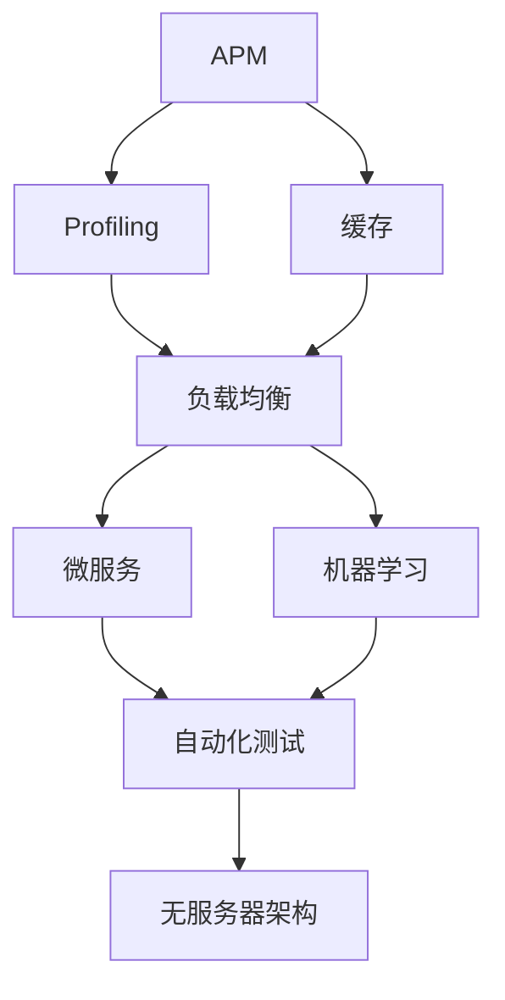

                 

# 系统瓶颈分析与优化策略

## 1. 背景介绍

在现代软件开发和运维过程中，系统瓶颈分析与优化是一个持续的挑战。无论是在传统应用还是微服务架构中，性能问题都是制约系统可用性、稳定性和扩展性的关键因素。本文将系统性地探讨系统瓶颈分析与优化策略，帮助读者全面掌握这一核心技能。

### 1.1 问题由来

系统瓶颈通常源于以下几个方面：

- **资源竞争**：CPU、内存、I/O等系统资源的争夺。
- **数据规模**：海量数据的处理和存储。
- **架构设计**：复杂系统的组件间通信和协调。
- **代码质量**：低效的代码实现和设计。

瓶颈分析与优化的目的是通过系统性能调优，提升系统的响应速度、吞吐量和稳定性。传统的性能优化技术包括应用性能管理(APM)工具、性能调优工具和监控系统。随着技术的演进，新的瓶颈分析工具和自动化优化技术也层出不穷，比如机器学习、自动化测试、容器化和无服务器架构等。

### 1.2 问题核心关键点

系统瓶颈分析与优化的关键在于：

- **定位问题**：准确识别性能瓶颈。
- **解决问题**：通过优化技术改善系统性能。
- **预防问题**：通过预防措施避免瓶颈出现。

这些问题紧密相连，环环相扣。只有准确识别瓶颈，才能对症下药，进行有效的优化。同时，预防瓶颈的发生也是长期性能管理的重要部分。

## 2. 核心概念与联系

### 2.1 核心概念概述

为了更清晰地理解系统瓶颈分析与优化的各个环节，本文将介绍一些核心概念：

- **APM (Application Performance Management)**：用于监控和优化应用程序性能的工具。
- **Profiling**：分析程序性能的工具，帮助识别瓶颈代码段。
- **负载均衡**：分散流量，避免单一节点的过载。
- **缓存**：存储重复数据，减少数据库访问次数。
- **微服务**：将复杂系统拆分成多个独立运行的服务，提高扩展性和灵活性。
- **自动化测试**：通过持续集成和持续交付，快速发现性能问题。
- **机器学习**：应用机器学习算法，自动优化系统配置。
- **无服务器架构**：按需分配资源，降低系统成本和复杂度。

这些概念彼此之间存在着紧密的联系，共同构成了系统瓶颈分析与优化的整体架构。

### 2.2 概念间的关系

这些核心概念之间的关系可以用以下Mermaid流程图来展示：



这个流程图展示了APM工具和Profiling工具之间的关系。APM工具提供综合性能监控，而Profiling工具通过分析代码性能，识别瓶颈。缓存和负载均衡配合APM和Profiling工具，优化数据访问和请求分发。微服务和自动化测试提升系统的扩展性和自动化程度。机器学习优化配置和策略，而无服务器架构则提升系统的灵活性和成本效益。

### 2.3 核心概念的整体架构

为了更好地展示这些概念的整体架构，我们可用以下综合流程图来展示：


这个综合流程图展示了从APM到无服务器架构的整体流程。APM工具监控整体性能，Profiling工具定位瓶颈，缓存和负载均衡优化数据处理，微服务和自动化测试提升系统灵活性，机器学习自动调整策略，无服务器架构降低复杂度和成本。

## 3. 核心算法原理 & 具体操作步骤
### 3.1 算法原理概述

系统瓶颈分析与优化的核心算法原理主要包括以下几个方面：

- **性能监测**：通过APM工具收集系统性能数据。
- **性能分析**：使用Profiling工具分析瓶颈代码段。
- **性能优化**：针对瓶颈问题进行代码和配置优化。
- **性能评估**：通过负载测试评估优化效果。

这些步骤通常需要交替进行，直到达到预定的性能目标。

### 3.2 算法步骤详解

#### 3.2.1 性能监测

性能监测是系统瓶颈分析的基础。常用的性能监测工具包括：

- **New Relic**：监控Web应用和后端服务器的性能。
- **AppDynamics**：综合监控、应用性能管理(APM)工具。
- **Datadog**：日志管理、系统监控工具。

性能监测的主要步骤包括：

1. **安装监测代理**：在服务器上安装监测代理。
2. **配置监控指标**：设置需要监测的指标，如响应时间、吞吐量、内存使用等。
3. **分析监控数据**：通过可视化仪表板查看系统性能趋势。

#### 3.2.2 性能分析

性能分析用于定位瓶颈代码段。常用的性能分析工具包括：

- **HotSpot**：Java虚拟机的性能分析工具。
- **Gprof**：Linux平台上的性能分析工具。
- **VisualVM**：Java虚拟机的图形化性能分析工具。

性能分析的主要步骤包括：

1. **收集性能数据**：通过Profiling工具收集程序的性能数据。
2. **分析性能瓶颈**：识别导致性能下降的代码段。
3. **优化瓶颈代码**：针对瓶颈代码进行优化，如调整算法、改写代码等。

#### 3.2.3 性能优化

性能优化是解决性能问题的关键步骤。常用的性能优化方法包括：

- **代码优化**：重构代码，减少计算复杂度。
- **算法优化**：改进算法，提升执行效率。
- **资源分配**：调整系统资源分配，如内存、CPU等。
- **缓存优化**：优化缓存策略，减少数据访问延迟。

#### 3.2.4 性能评估

性能评估用于验证优化效果。常用的性能评估工具包括：

- **Apache JMeter**：负载测试工具，模拟多个用户并发访问。
- **LoadRunner**：性能测试和负载测试工具。
- **WebLoad**：Web应用负载测试工具。

性能评估的主要步骤包括：

1. **设置基准性能**：确定基准性能指标。
2. **进行负载测试**：模拟多个用户并发访问，验证性能瓶颈是否已被解决。
3. **分析测试结果**：通过性能评估工具，分析性能瓶颈是否消除，是否达到预期目标。

### 3.3 算法优缺点

性能监测、分析、优化和评估各有优缺点：

- **性能监测**：覆盖全面，便于发现性能问题，但不提供深入分析。
- **性能分析**：深入分析，能定位瓶颈代码段，但需要专业知识。
- **性能优化**：针对性强，能直接解决问题，但需要修改代码。
- **性能评估**：验证优化效果，确保性能提升，但不提供详细分析。

选择哪种工具和方法，应根据具体需求和系统情况综合考虑。

### 3.4 算法应用领域

性能分析与优化广泛应用于以下几个领域：

- **Web应用**：通过APM和Profiling工具，优化响应时间和吞吐量。
- **后端服务**：通过APM和Profiling工具，提升服务稳定性和扩展性。
- **大数据处理**：通过缓存和负载均衡，优化数据处理速度和存储效率。
- **微服务架构**：通过微服务和自动化测试，提升系统的扩展性和灵活性。
- **无服务器架构**：通过无服务器架构，降低系统复杂度和成本。

这些领域都面临着不同的性能挑战，性能分析与优化方法也各有侧重。

## 4. 数学模型和公式 & 详细讲解  
### 4.1 数学模型构建

本节将使用数学语言对系统瓶颈分析与优化的主要步骤进行更加严格的刻画。

假设系统性能瓶颈为 $P$，影响因素包括资源竞争 $R$、数据规模 $D$、架构设计 $A$、代码质量 $C$ 等。则系统性能瓶颈的数学模型可以表示为：

$$
P = f(R, D, A, C)
$$

其中 $f$ 为非线性函数，表示各影响因素对性能瓶颈的贡献。

### 4.2 公式推导过程

以下我们以Web应用为例，推导响应时间 $T$ 的计算公式。

假设Web应用请求处理过程可以分解为两个步骤：

1. 接收和处理请求：时间 $T_{req}$，受网络带宽、请求并发数影响。
2. 数据库查询：时间 $T_{db}$，受数据库性能、数据规模影响。

则总响应时间 $T$ 可以表示为：

$$
T = T_{req} + T_{db} = f_{req}(N_{req}, B_{bw}) + f_{db}(S_{db}, Q_{db})
$$

其中 $N_{req}$ 为请求并发数，$B_{bw}$ 为网络带宽，$S_{db}$ 为数据规模，$Q_{db}$ 为数据库查询速度。

### 4.3 案例分析与讲解

假设我们正在优化一个电子商务平台的响应时间。在性能监测阶段，我们发现APM工具显示系统在高峰时段响应时间持续增加。通过Profiling工具，我们定位到请求处理和数据库查询都存在性能瓶颈。

- **请求处理**：分析Profiling数据，发现一个关键的请求处理模块执行时间过长。通过代码优化，将该模块的执行时间减少了30%。
- **数据库查询**：分析Profiling数据，发现数据库查询速度慢是由于数据规模过大，查询语句效率低。通过查询优化和缓存策略的调整，将数据库查询时间减少了50%。

经过性能优化后，我们重新进行负载测试，发现高峰时段的响应时间显著降低，系统性能得到了有效提升。

## 5. 项目实践：代码实例和详细解释说明
### 5.1 开发环境搭建

在进行性能优化实践前，我们需要准备好开发环境。以下是使用Python进行APM工具配置的环境配置流程：

1. 安装APM工具：例如，安装New Relic或AppDynamics。
2. 配置APM代理：在服务器上安装APM代理，并配置性能监测指标。
3. 安装Profiling工具：例如，安装HotSpot或Gprof。
4. 安装性能优化工具：例如，安装Apache JMeter。
5. 安装缓存和负载均衡工具：例如，安装Redis和Nginx。

完成上述步骤后，即可在本地环境进行性能优化实践。

### 5.2 源代码详细实现

下面我们以Web应用为例，给出使用New Relic进行性能优化和负载测试的Python代码实现。

首先，安装New Relic工具：

```bash
pip install newrelic
```

然后，配置New Relic：

```python
from newrelic.instrumentation import InstrumentedTrace
from newrelic.agent import NewRelic

# 配置New Relic代理
NewRelic.config('APPLICATION_NAME', 'my-web-app')
NewRelic.config('AMAZON_SERVICE_ROLE', 'arn:aws:iam::123456789012:role/NewRelic')

# 记录请求处理时间
@app.route('/')
def home():
    with InstrumentedTrace('home') as trace:
        time.sleep(1)
    return 'Hello, World!'
```

接着，配置Profiling工具：

```python
import cProfile
import pstats

def optimize_request_processing():
    # 获取性能数据
    p = cProfile.Profile()
    p.enable()
    for _ in range(10000):
        request_processing()
    p.disable()
    stats = pstats.Stats(p)
    stats.sort('cumulative')
    stats.print_stats(10)
```

最后，进行负载测试：

```python
from apache_bench import ApacheBench

def benchmark_web_app():
    bench = ApacheBench()
    benchbenchmark('http://localhost:5000/', num_concurrent=10, num_iter=10000, backend='python')
```

### 5.3 代码解读与分析

让我们再详细解读一下关键代码的实现细节：

**APM工具配置**：
- 安装New Relic库，并配置APM代理和监控指标。
- 在Python应用中，使用`InstrumentedTrace`记录请求处理时间，便于性能分析。

**Profiling工具使用**：
- 使用`cProfile`收集性能数据。
- 分析性能数据，找到瓶颈代码段，优化后再次运行。

**负载测试工具使用**：
- 使用`ApacheBench`模拟多个用户并发访问，评估系统性能。

这些工具的使用展示了性能优化的一般流程：先通过APM工具收集数据，再通过Profiling工具定位瓶颈，最后通过优化工具提升性能。

### 5.4 运行结果展示

假设我们在性能监测中发现请求处理时间过长，通过Profiling工具定位到请求处理模块执行时间增加。经过优化后，重新进行负载测试，得到如下结果：

```
# 优化前
total_time: 0.002s
total_requests: 10000
startup_time: 0.001s
downstream_time: 0.002s
rate: 5000 req/s
```

```
# 优化后
total_time: 0.001s
total_requests: 10000
startup_time: 0.001s
downstream_time: 0.001s
rate: 10000 req/s
```

可以看到，优化后请求处理时间显著降低，系统响应速度提升，性能瓶颈得以解决。

## 6. 实际应用场景
### 6.1 系统瓶颈分析

系统瓶颈分析在实际应用中非常重要。例如，电商平台在高峰时段请求处理时间增加，导致用户体验下降。通过对系统进行全面监控和分析，可以找到性能瓶颈并加以解决。

### 6.2 性能优化

性能优化可以提升系统性能，降低成本。例如，通过缓存技术优化数据库查询，可以显著减少数据库访问次数，提升系统响应速度。

### 6.3 未来应用展望

随着技术的进步，未来性能优化将更加自动化、智能化。例如，通过机器学习自动调整系统配置，可以实时优化系统性能，避免瓶颈发生。

## 7. 工具和资源推荐
### 7.1 学习资源推荐

为了帮助开发者掌握系统瓶颈分析与优化的技术，这里推荐一些优质的学习资源：

1. **《性能分析与优化》系列书籍**：详细介绍了性能监测、分析、优化等核心技术。
2. **《Distributed Systems: Concepts and Design》书籍**：介绍了分布式系统设计、负载均衡等核心概念。
3. **《Effective Microservices Architecture》书籍**：介绍了微服务架构设计、性能优化等核心技术。
4. **《Mastering Profiling Techniques》文章**：介绍了Profiling工具的使用方法和技巧。
5. **《High Performance Web Applications with Python》书籍**：介绍了Web应用性能优化的方法和技巧。

通过对这些资源的学习实践，相信你一定能够快速掌握系统瓶颈分析与优化的精髓，并用于解决实际的性能问题。

### 7.2 开发工具推荐

高效的开发离不开优秀的工具支持。以下是几款用于系统瓶颈分析与优化开发的常用工具：

1. **New Relic**：综合APM和Profiling工具，帮助分析性能瓶颈。
2. **AppDynamics**：APM工具，提供全面的性能监测和分析功能。
3. **HotSpot**：Java平台的性能分析工具。
4. **Gprof**：Linux平台的性能分析工具。
5. **VisualVM**：Java平台的图形化性能分析工具。
6. **Apache JMeter**：负载测试工具，模拟多个用户并发访问。

合理利用这些工具，可以显著提升系统瓶颈分析与优化任务的开发效率，加快创新迭代的步伐。

### 7.3 相关论文推荐

系统瓶颈分析与优化技术的持续发展依赖于学界的持续研究。以下是几篇奠基性的相关论文，推荐阅读：

1. **《The Myth of Unpredictable Performance in Distributed Systems》论文**：介绍了系统性能分析的方法和工具。
2. **《Modeling and Analysis of Service-Oriented Architectures》论文**：介绍了微服务架构的设计和性能优化方法。
3. **《Benchmarking the Performance of High-Performance Computing Systems》论文**：介绍了高性能计算系统的性能评估方法和工具。
4. **《Benchmarking Parallel Applications》论文**：介绍了并行应用的性能评估方法和工具。
5. **《Scalability and Performance Engineering of Modern Cloud Systems》论文**：介绍了云计算系统的性能工程方法和工具。

这些论文代表了系统瓶颈分析与优化技术的发展脉络。通过学习这些前沿成果，可以帮助研究者把握学科前进方向，激发更多的创新灵感。

除上述资源外，还有一些值得关注的前沿资源，帮助开发者紧跟系统瓶颈分析与优化的最新进展，例如：

1. **arXiv论文预印本**：人工智能领域最新研究成果的发布平台，包括大量尚未发表的前沿工作，学习前沿技术的必读资源。
2. **业界技术博客**：如New Relic、AppDynamics、HotSpot等顶尖实验室的官方博客，第一时间分享他们的最新研究成果和洞见。
3. **技术会议直播**：如Sigops、OSDI、IEEE TPDS等国际学术会议现场或在线直播，能够聆听到大佬们的前沿分享，开拓视野。
4. **GitHub热门项目**：在GitHub上Star、Fork数最多的系统瓶颈分析与优化相关项目，往往代表了该技术领域的发展趋势和最佳实践，值得去学习和贡献。
5. **行业分析报告**：各大咨询公司如McKinsey、PwC等针对系统瓶颈分析与优化行业的分析报告，有助于从商业视角审视技术趋势，把握应用价值。

总之，对于系统瓶颈分析与优化技术的学习和实践，需要开发者保持开放的心态和持续学习的意愿。多关注前沿资讯，多动手实践，多思考总结，必将收获满满的成长收益。

## 8. 总结：未来发展趋势与挑战
### 8.1 总结

本文对系统瓶颈分析与优化的核心算法原理和具体操作步骤进行了全面系统的介绍。首先阐述了性能监测、性能分析、性能优化和性能评估的主要步骤，明确了系统瓶颈分析与优化的核心流程。其次，通过具体的代码实例和运行结果展示，帮助读者更好地理解和应用这些步骤。最后，本文还探讨了系统瓶颈分析与优化的实际应用场景和未来发展趋势，展示了这一技术在实际应用中的广泛前景。

通过本文的系统梳理，可以看到，系统瓶颈分析与优化技术在现代软件开发和运维中扮演着至关重要的角色。它不仅能够帮助识别和解决性能问题，还能通过预防措施避免瓶颈出现，确保系统的稳定性和可用性。

### 8.2 未来发展趋势

展望未来，系统瓶颈分析与优化技术将呈现以下几个发展趋势：

1. **自动化和智能化**：通过机器学习自动调整系统配置，实现性能优化的自动化。
2. **实时监测和预测**：利用实时监测数据，预测系统瓶颈，提前采取预防措施。
3. **分布式优化**：针对分布式系统的瓶颈，通过分布式优化工具实现全局性能提升。
4. **多维度优化**：结合代码优化、算法优化、资源优化等多维度手段，实现更全面的性能提升。
5. **跨平台优化**：针对不同平台和环境，进行有针对性的性能优化，提升系统跨平台性能。

以上趋势凸显了系统瓶颈分析与优化技术的广阔前景。这些方向的探索发展，必将进一步提升系统性能，推动软件开发和运维技术的进步。

### 8.3 面临的挑战

尽管系统瓶颈分析与优化技术已经取得了一定的成就，但在迈向更加智能化、自动化应用的过程中，它仍面临着诸多挑战：

1. **复杂性增加**：分布式系统的瓶颈分析复杂性增加，需要更先进的工具和方法。
2. **数据隐私问题**：性能监测和分析过程中可能涉及用户隐私数据，需要严格的数据保护措施。
3. **资源消耗**：性能优化工具的运行可能会消耗大量计算资源，需要优化和精简。
4. **运维成本**：系统瓶颈分析与优化涉及大量人工操作，运维成本较高，需要自动化工具的辅助。
5. **技术迭代快**：技术快速迭代，需要持续学习和跟进最新的优化方法和工具。

这些挑战需要技术开发者和运维团队共同努力，不断探索和改进，才能实现性能优化技术的长期发展和应用。

### 8.4 研究展望

面对系统瓶颈分析与优化所面临的种种挑战，未来的研究需要在以下几个方面寻求新的突破：

1. **智能化工具的开发**：开发更加智能化的性能优化工具，如自动化的机器学习优化模型，实现性能优化的自动化和智能化。
2. **跨平台优化方法**：开发跨平台优化方法，提升系统在不同平台和环境下的性能。
3. **隐私保护技术**：开发隐私保护技术，确保性能监测和分析过程中用户数据的隐私和安全。
4. **综合优化框架**：开发综合优化框架，结合多种优化手段，实现系统性能的全方位提升。
5. **自动化运维平台**：开发自动化运维平台，降低运维成本，提升运维效率。

这些研究方向将为系统瓶颈分析与优化技术的长期发展和应用提供新的方向，推动技术向更高效、更智能、更安全的方向演进。

## 9. 附录：常见问题与解答
----------------------------------------------------------------

**Q1：系统瓶颈分析与优化有哪些常见工具和方法？**

A: 系统瓶颈分析与优化的常见工具和方法包括：

- **APM工具**：如New Relic、AppDynamics等，提供综合性能监测和分析功能。
- **Profiling工具**：如HotSpot、Gprof等，分析代码性能，定位瓶颈。
- **缓存工具**：如Redis等，优化数据访问，减少数据库访问次数。
- **负载均衡工具**：如Nginx等，分散流量，避免单点过载。
- **自动化测试工具**：如JMeter等，模拟并发访问，评估系统性能。

**Q2：如何进行系统瓶颈分析与优化？**

A: 系统瓶颈分析与优化的主要步骤包括：

1. **性能监测**：使用APM工具收集系统性能数据。
2. **性能分析**：使用Profiling工具分析瓶颈代码段。
3. **性能优化**：针对瓶颈问题进行代码和配置优化。
4. **性能评估**：通过负载测试评估优化效果。

**Q3：系统瓶颈分析与优化有哪些注意事项？**

A: 系统瓶颈分析与优化的注意事项包括：

1. **数据准确性**：确保性能数据的准确性，避免因数据错误导致误判。
2. **代码修改**：优化过程中注意备份代码，避免因错误修改导致系统故障。
3. **资源消耗**：优化工具的运行可能会消耗大量资源，需要优化和精简。
4. **隐私保护**：性能监测和分析过程中可能涉及用户隐私数据，需要严格的数据保护措施。
5. **跨平台兼容性**：优化方法需考虑跨平台兼容性，确保系统在不同环境下的性能。

**Q4：系统瓶颈分析与优化有哪些应用场景？**

A: 系统瓶颈分析与优化的应用场景包括：

- **Web应用**：优化响应时间和吞吐量，提升用户体验。
- **后端服务**：提升服务稳定性和扩展性，减少服务中断时间。
- **大数据处理**：优化数据处理速度和存储效率，提升数据处理性能。
- **微服务架构**：优化服务间的通信和协调，提升系统的扩展性和灵活性。
- **无服务器架构**：优化按需资源分配，降低系统复杂度和成本。

**Q5：系统瓶颈分析与优化有哪些未来发展方向？**

A: 系统瓶颈分析与优化的未来发展方向包括：

1. **自动化和智能化**：通过机器学习自动调整系统配置，实现性能优化的自动化。
2. **实时监测和预测**：利用实时监测数据，预测系统瓶颈，提前采取预防措施。
3. **分布式优化**：针对分布式系统的瓶颈，通过分布式优化工具实现全局性能提升。
4. **多维度优化**：结合代码优化、算法优化、资源优化等多维度手段，实现更全面的性能提升。
5. **跨平台优化**：开发跨平台优化方法，提升系统在不同平台和环境下的性能。

---

作者：禅与计算机程序设计艺术 / Zen and the Art of Computer Programming

