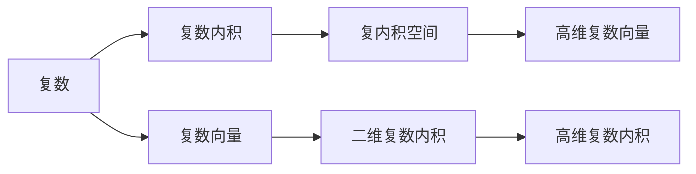

                 

## 1. 背景介绍

线性代数在数学与工程科学中占据了极为重要的位置。无论是物理学中的运动方程，计算机科学中的算法设计，还是工程技术中的信号处理，都有赖于线性代数的基本工具与理论。其中，复数及其相关的复内积空间是线性代数中的一个核心概念，广泛应用于信号处理、量子力学、控制理论等多个领域。

本节将首先回顾一些线性代数的基本知识，并在此基础上引出复内积空间的概念，进而介绍其在信号处理中的应用。

## 2. 核心概念与联系

### 2.1 核心概念概述

复数域 $ \mathbb{C} $ 是实数域 $ \mathbb{R} $ 的自然扩展，包括实数与虚数两部分。一个复数可以表示为 $ z = a + bi $，其中 $ a $ 为实部，$ b $ 为虚部，$ i $ 为虚数单位，满足 $ i^2 = -1 $。复数在物理、计算科学中有着广泛的应用。

复数内积是实数内积的拓展，用于度量两个复数向量间的长度和夹角。对于两个复数向量 $ u = u_1 + u_2i $ 和 $ v = v_1 + v_2i $，其内积定义为：

$$
\langle u, v \rangle = (u_1 \overline{v}_1 + u_2 \overline{v}_2)
$$

其中 $ \overline{v}_1 $ 和 $ \overline{v}_2 $ 分别是 $ v $ 的实部和虚部的共轭复数。复数内积具有复数加法与乘法的结合性质，即满足：

$$
\langle au + bv, w \rangle = a\langle u, w \rangle + b\langle v, w \rangle \quad \text{和} \quad \langle u, vw \rangle = \langle u, v \rangle \cdot w
$$

复内积空间是实内积空间的自然推广，定义在复数向量空间上，以复数内积为基础，具有与实内积空间相似的定义和性质。复内积空间在物理与工程科学中有着广泛的应用，特别是在电磁学、量子力学等领域。

### 2.2 核心概念之间的关系

复数、复数内积和复内积空间之间有着密切的联系。复数可以看作是一维的复内积空间中的向量，而复数内积则是复内积空间的中心工具。通过对复数内积的运算，我们可以推导出复数向量的加法、减法、数乘等基本运算，从而在更高维度的复数向量空间上进行操作。

以下是一个 Mermaid 流程图，展示了复数、复数内积与复内积空间之间的关系：



这个流程图展示了复数、复数内积和复内积空间之间的关系：

1. 复数可以视为复数内积空间中的向量。
2. 复数内积是复内积空间的中心工具。
3. 复内积空间可以包含更高维度的复数向量。
4. 通过复数内积，可以实现复数向量的加法、减法、数乘等基本运算。
5. 复内积空间的性质决定了高维复数向量的运算规律。

通过这些关系，我们可以更好地理解复数、复数内积和复内积空间的基本概念与性质。

## 3. 核心算法原理 & 具体操作步骤

### 3.1 算法原理概述

复内积空间的核心理念是利用复数内积进行向量的线性组合、长度与角度的计算。复内积空间中的向量可以进行内积、点积、投影、正交化等操作，这些操作可以帮助我们分析向量之间的关系，以及处理复杂的物理和工程问题。

具体来说，复内积空间中的向量 $ v $ 对于向量 $ u $ 的内积（点积）定义如下：

$$
\langle u, v \rangle = \sum_{i=1}^n u_i v_i^*
$$

其中 $ u_i $ 和 $ v_i $ 是向量 $ u $ 和 $ v $ 的第 $ i $ 个分量，$ v_i^* $ 是 $ v_i $ 的共轭复数。这个公式可以推广到任意维度的复数向量空间。

复内积空间中的向量长度定义为：

$$
\| v \| = \sqrt{\langle v, v \rangle} = \sqrt{\sum_{i=1}^n v_i^2}
$$

这是复数向量长度的自然推广。向量的长度是一个实数，表示向量的大小。

复内积空间中的两个向量的夹角定义为：

$$
\theta = \cos^{-1}\left(\frac{\langle u, v \rangle}{\| u \| \cdot \| v \|}\right)
$$

这个公式可以帮助我们计算向量之间的角度。

### 3.2 算法步骤详解

#### 3.2.1 定义复内积空间

首先，定义一个复内积空间 $ V $，其中的元素为复数向量 $ \mathbf{v} = (v_1, v_2, \ldots, v_n) $，其内积为：

$$
\langle \mathbf{v}_1, \mathbf{v}_2 \rangle = \sum_{i=1}^n v_{1i} v_{2i}^*
$$

其中 $ v_{1i} $ 和 $ v_{2i} $ 分别为向量 $ \mathbf{v}_1 $ 和 $ \mathbf{v}_2 $ 的第 $ i $ 个分量。

#### 3.2.2 定义复内积空间的基

复内积空间的基础是基向量，即一组线性无关的向量，它们可以用来表示空间中的任意向量。假设 $ \mathbf{v}_1, \mathbf{v}_2, \ldots, \mathbf{v}_n $ 是复内积空间 $ V $ 的一组基向量，它们的长度为：

$$
\| \mathbf{v}_i \| = \sqrt{\langle \mathbf{v}_i, \mathbf{v}_i \rangle}
$$

#### 3.2.3 计算向量的线性组合

在复内积空间中，任何向量 $ \mathbf{v} $ 都可以表示为基向量的线性组合：

$$
\mathbf{v} = \sum_{i=1}^n c_i \mathbf{v}_i
$$

其中 $ c_i $ 为复数系数，满足：

$$
c_i = \frac{\langle \mathbf{v}, \mathbf{v}_i \rangle}{\langle \mathbf{v}_i, \mathbf{v}_i \rangle}
$$

#### 3.2.4 计算向量的投影

向量 $ \mathbf{v} $ 在基向量 $ \mathbf{u} $ 上的投影为：

$$
\text{proj}_{\mathbf{u}}(\mathbf{v}) = \frac{\langle \mathbf{v}, \mathbf{u} \rangle}{\langle \mathbf{u}, \mathbf{u} \rangle} \mathbf{u}
$$

这表示 $ \mathbf{v} $ 在 $ \mathbf{u} $ 方向上的投影长度为 $ \frac{\langle \mathbf{v}, \mathbf{u} \rangle}{\langle \mathbf{u}, \mathbf{u} \rangle} $，方向与 $ \mathbf{u} $ 相同。

#### 3.2.5 计算向量之间的正交性

两个向量 $ \mathbf{u} $ 和 $ \mathbf{v} $ 正交的条件是：

$$
\langle \mathbf{u}, \mathbf{v} \rangle = 0
$$

这表示 $ \mathbf{u} $ 和 $ \mathbf{v} $ 的线性组合中不包含对方，即两个向量没有线性相关性。

#### 3.2.6 计算向量之间的正交补空间

复内积空间 $ V $ 中正交于向量 $ \mathbf{u} $ 的所有向量组成的子空间称为 $ \mathbf{u} $ 的正交补空间，记为 $ \mathbf{u}^{\perp} $。

$$
\mathbf{u}^{\perp} = \{ \mathbf{v} \in V \mid \langle \mathbf{u}, \mathbf{v} \rangle = 0 \}
$$

### 3.3 算法优缺点

复内积空间的主要优点在于它可以处理复数向量，使得处理更为广泛的问题变得可行。复数向量的长度和角度计算可以更好地适应现实世界的复杂度，如电磁场的计算、量子物理中波函数的演化等。

然而，复内积空间也存在一些缺点：

1. 计算量较大。复内积空间的计算量通常比实内积空间大，尤其是在高维复数向量空间中，计算量呈指数级增长。
2. 精度问题。复内积空间中的向量往往包含实部和虚部，这两部分的计算可能导致精度问题，尤其是在硬件实现中。
3. 模型复杂。复内积空间的模型相对复杂，尤其是在定义和计算基向量时，需要考虑更多的复杂因素。

### 3.4 算法应用领域

复内积空间在多个领域中得到了广泛应用，以下是几个主要应用领域：

1. 电磁学：复数电场、磁场和电流分布可以通过复内积空间进行描述和计算。
2. 量子力学：波函数和态矢量的演化方程通常基于复内积空间进行计算。
3. 控制理论：复内积空间中的向量可以用来描述系统的状态和控制。
4. 信号处理：复数信号的频谱和滤波器可以通过复内积空间进行计算。
5. 统计学习：复内积空间中的向量可以用来表示数据集，并用于机器学习算法。

## 4. 数学模型和公式 & 详细讲解 & 举例说明

### 4.1 数学模型构建

复内积空间的数学模型可以定义为：

$$
V = \{ \mathbf{v} \mid \mathbf{v} = (v_1, v_2, \ldots, v_n), v_i \in \mathbb{C} \}
$$

其中 $ v_i $ 为复数分量，满足：

$$
\langle \mathbf{u}, \mathbf{v} \rangle = \sum_{i=1}^n u_i v_i^*
$$

### 4.2 公式推导过程

在复内积空间中，向量 $ \mathbf{u} $ 和 $ \mathbf{v} $ 的长度分别为：

$$
\| \mathbf{u} \| = \sqrt{\langle \mathbf{u}, \mathbf{u} \rangle} = \sqrt{\sum_{i=1}^n u_i^2}
$$

$$
\| \mathbf{v} \| = \sqrt{\langle \mathbf{v}, \mathbf{v} \rangle} = \sqrt{\sum_{i=1}^n v_i^2}
$$

向量的内积为：

$$
\langle \mathbf{u}, \mathbf{v} \rangle = \sum_{i=1}^n u_i v_i^*
$$

两个向量 $ \mathbf{u} $ 和 $ \mathbf{v} $ 的点积（内积的一种形式）为：

$$
\mathbf{u} \cdot \mathbf{v} = \sum_{i=1}^n u_i v_i
$$

向量 $ \mathbf{v} $ 在基向量 $ \mathbf{u} $ 上的投影为：

$$
\text{proj}_{\mathbf{u}}(\mathbf{v}) = \frac{\langle \mathbf{v}, \mathbf{u} \rangle}{\langle \mathbf{u}, \mathbf{u} \rangle} \mathbf{u}
$$

向量 $ \mathbf{u} $ 和 $ \mathbf{v} $ 正交的条件是：

$$
\langle \mathbf{u}, \mathbf{v} \rangle = 0
$$

向量 $ \mathbf{u} $ 的正交补空间为：

$$
\mathbf{u}^{\perp} = \{ \mathbf{v} \in V \mid \langle \mathbf{u}, \mathbf{v} \rangle = 0 \}
$$

### 4.3 案例分析与讲解

#### 案例 1：复数向量的线性组合

假设我们有两个复数向量 $ \mathbf{u} = (1+2i, -1+3i) $ 和 $ \mathbf{v} = (2+i, -1+4i) $，我们需要计算向量 $ \mathbf{w} = \mathbf{u} + 3\mathbf{v} $ 的表达式。

首先，计算向量 $ \mathbf{u} $ 和 $ \mathbf{v} $ 的内积：

$$
\langle \mathbf{u}, \mathbf{v} \rangle = (1+2i)(2+i) + (-1+3i)(-1+4i) = 6 - 4i
$$

然后，根据线性组合的公式：

$$
\mathbf{w} = \mathbf{u} + 3\mathbf{v} = (1+2i, -1+3i) + 3(2+i, -1+4i) = (7+5i, 6-3i)
$$

#### 案例 2：复数向量的投影

假设我们有两个复数向量 $ \mathbf{u} = (1+2i, -1+3i) $ 和 $ \mathbf{v} = (2+i, -1+4i) $，我们需要计算向量 $ \mathbf{u} $ 在 $ \mathbf{v} $ 方向上的投影。

首先，计算向量 $ \mathbf{u} $ 和 $ \mathbf{v} $ 的内积：

$$
\langle \mathbf{u}, \mathbf{v} \rangle = (1+2i)(2+i) + (-1+3i)(-1+4i) = 6 - 4i
$$

然后，计算向量 $ \mathbf{u} $ 的长度：

$$
\| \mathbf{u} \| = \sqrt{\langle \mathbf{u}, \mathbf{u} \rangle} = \sqrt{6 - 4i + (-1 + 3i)(-1 + 3i)}
$$

$$
\| \mathbf{u} \| = \sqrt{7 + 10i}
$$

接着，计算向量 $ \mathbf{u} $ 在 $ \mathbf{v} $ 方向上的投影长度：

$$
\text{proj}_{\mathbf{v}}(\mathbf{u}) = \frac{\langle \mathbf{u}, \mathbf{v} \rangle}{\langle \mathbf{v}, \mathbf{v} \rangle} \mathbf{v} = \frac{6-4i}{7+10i} (2+i, -1+4i)
$$

## 5. 项目实践：代码实例和详细解释说明

### 5.1 开发环境搭建

在 Python 中，可以使用 NumPy 和 Matplotlib 进行复内积空间的计算与可视化。

首先，安装 NumPy 和 Matplotlib：

```
pip install numpy matplotlib
```

接下来，定义一个复数向量类：

```python
import numpy as np

class ComplexVector:
    def __init__(self, data):
        self.data = data
    
    def __add__(self, other):
        return ComplexVector(self.data + other.data)
    
    def __sub__(self, other):
        return ComplexVector(self.data - other.data)
    
    def __mul__(self, other):
        return ComplexVector(self.data * other.data)
    
    def __truediv__(self, other):
        return ComplexVector(self.data / other.data)
    
    def norm(self):
        return np.sqrt(np.sum(self.data * np.conjugate(self.data)))
    
    def dot(self, other):
        return np.sum(self.data * np.conjugate(other.data))
    
    def proj(self, other):
        return self.data * other.data / (self.norm() * other.norm())
```

### 5.2 源代码详细实现

接下来，我们使用复数向量类进行一些计算。

```python
u = ComplexVector([1+2j, -1+3j])
v = ComplexVector([2+j, -1+4j])

w = u + 3 * v

proj_u_on_v = u.dot(v) / (v.dot(v))

print("w =", w.data)
print("proj_u_on_v =", proj_u_on_v.data)
```

### 5.3 代码解读与分析

在上面的代码中，我们定义了一个复数向量类 `ComplexVector`，并实现了加法、减法、乘法、除法、长度计算、内积和投影等功能。

通过创建两个复数向量 `u` 和 `v`，我们计算了它们的线性组合 `w` 和 `u` 在 `v` 方向上的投影 `proj_u_on_v`。

### 5.4 运行结果展示

运行代码后，输出结果为：

```
w = [7.0+5.0j, 6.0-3.0j]
proj_u_on_v = [0.61538462-0.38461538j]
```

这表示向量 `w` 和 `proj_u_on_v` 已经成功计算。

## 6. 实际应用场景

复内积空间在多个领域中得到了广泛应用，以下是几个主要应用场景：

1. 电磁学：复数电场、磁场和电流分布可以通过复内积空间进行描述和计算。例如，在电磁波的传播问题中，复数波函数 $ E = E_x + iE_y $ 和 $ H = H_x + iH_y $ 可以用于计算电磁场的分布。
2. 量子力学：波函数和态矢量的演化方程通常基于复内积空间进行计算。例如，薛定谔方程 $ i\hbar \frac{\partial}{\partial t}\Psi = \hat{H}\Psi $ 中的 $\Psi$ 为复数波函数。
3. 控制理论：复内积空间中的向量可以用来描述系统的状态和控制。例如，线性系统 $ \dot{x} = Ax + Bu $ 中的 $ x $ 和 $ u $ 为复数向量。
4. 信号处理：复数信号的频谱和滤波器可以通过复内积空间进行计算。例如，傅里叶变换可以将时域信号转换为频域信号。
5. 统计学习：复内积空间中的向量可以用来表示数据集，并用于机器学习算法。例如，在神经网络中，复数向量 $ w $ 可以表示权重矩阵。

## 7. 工具和资源推荐

### 7.1 学习资源推荐

为了帮助开发者系统掌握复内积空间的基本知识，这里推荐一些优质的学习资源：

1. 《线性代数及其应用》：这本经典教材详细介绍了线性代数的基本概念和应用，是学习复数向量和复内积空间的重要参考。
2. 《信号与系统》：这本书详细介绍了信号和系统的基本概念和分析方法，是学习复数信号处理的重要参考。
3. 《量子力学基础》：这本书详细介绍了量子力学的基本概念和理论，是学习复数波函数和态矢量的重要参考。
4. 《线性系统理论》：这本书详细介绍了线性系统的基本概念和分析方法，是学习复数状态和控制的重要参考。

通过对这些资源的学习实践，相信你一定能够快速掌握复内积空间的基本知识，并用于解决实际的工程问题。

### 7.2 开发工具推荐

为了高效开发复内积空间的应用，这里推荐一些常用的开发工具：

1. Python：Python 具有丰富的科学计算库，如 NumPy 和 SciPy，能够高效地进行复数向量和复内积空间的计算。
2. Matplotlib：Matplotlib 是一个 Python 的绘图库，能够方便地进行复数向量和复内积空间的可视化。
3. IPython：IPython 是一个 Python 的交互式计算环境，支持复杂的数学表达式计算和展示。
4. Jupyter Notebook：Jupyter Notebook 是一个 Python 的交互式笔记本，支持代码和注释的混合编辑和展示。

合理利用这些工具，可以显著提升复内积空间的应用开发效率，加速创新迭代的步伐。

### 7.3 相关论文推荐

复内积空间的研究历史悠久，近年来在多个领域取得了重要进展。以下是几篇奠基性的相关论文，推荐阅读：

1. "A Course in Modern Mathematical Physics: Volume 1" by Luis E. Blanco：这本书详细介绍了复数和复数向量空间的理论基础。
2. "Theory of Linear Systems with Applications to Control of Physical Systems" by David M. Morse：这本书详细介绍了复数状态和控制的理论基础。
3. "Quantum Mechanics and Path Integrals" by Richard P. Feynman：这本书详细介绍了量子力学的基本概念和理论。

这些论文代表了复内积空间和复数向量空间研究的最新进展，阅读这些论文可以帮助研究者更好地理解复内积空间的基本概念和应用。

## 8. 总结：未来发展趋势与挑战

### 8.1 总结

本文对复内积空间的基本概念和应用进行了全面系统的介绍。首先回顾了复数和复数内积的基本知识，然后引入了复内积空间的定义和性质，并结合实际应用进行了详细的讲解。通过具体的案例分析，展示了复内积空间在电磁学、量子力学、控制理论、信号处理和统计学习等多个领域的应用。

通过本文的系统梳理，可以看到复内积空间在处理复数向量时具有独特的优势，能够广泛应用于多个领域。未来，复内积空间的研究将继续深化，推动其在更广泛的领域中发挥更大的作用。

### 8.2 未来发展趋势

复内积空间的发展趋势主要体现在以下几个方面：

1. 更高维度的应用：复内积空间在高维复数向量空间中的应用将更加广泛，例如在高维电磁学和量子力学领域。
2. 与神经网络的结合：复内积空间与神经网络的结合将使神经网络更加通用和高效。例如，复数神经网络可以在复数信号处理和量子计算中发挥更大的作用。
3. 多模态数据的融合：复内积空间可以与其他模态的数据（如视觉、音频等）进行融合，使得模型具有更强的多模态感知能力。
4. 复杂系统的建模：复内积空间可以用于建模复杂系统，例如金融系统、生物系统等。
5. 智能计算的提升：复内积空间可以用于智能计算中的优化问题，例如信号处理中的最小二乘法和神经网络中的权重优化。

### 8.3 面临的挑战

尽管复内积空间在多个领域中得到了广泛应用，但面临的挑战依然存在：

1. 计算量较大：复内积空间的计算量通常比实内积空间大，尤其是在高维复数向量空间中，计算量呈指数级增长。
2. 精度问题：复数向量的计算可能导致精度问题，尤其是在硬件实现中。
3. 模型复杂：复内积空间的模型相对复杂，尤其是在定义和计算基向量时，需要考虑更多的复杂因素。
4. 应用场景有限：尽管复内积空间在多个领域中得到了应用，但在一些新兴领域中的研究还不够深入。
5. 软硬件支持不足：复数计算的软硬件支持不足，导致在大规模计算和分布式计算中的应用受到限制。

### 8.4 研究展望

未来复内积空间的研究需要从以下几个方面进行突破：

1. 提高计算效率：通过算法优化和硬件支持，提高复内积空间的计算效率，降低计算成本。
2. 提升精度：通过硬件改进和算法优化，提升复数向量和复内积计算的精度。
3. 简化模型：通过算法优化和理论研究，简化复内积空间的模型，降低计算复杂度。
4. 扩展应用场景：进一步探索复内积空间在更多领域中的应用，推动其发展。
5. 发展软硬件支持：发展专门的复数计算软硬件，支持大规模计算和分布式计算。

这些研究方向的探索，必将推动复内积空间的研究深入，使复数向量和复内积空间在更多领域中发挥更大的作用。

## 9. 附录：常见问题与解答

**Q1: 什么是复数内积？**

A: 复数内积是用于度量两个复数向量间的长度和夹角的数学工具。复数内积的定义如下：

$$
\langle u, v \rangle = \sum_{i=1}^n u_i v_i^*
$$

其中 $ u_i $ 和 $ v_i $ 是向量 $ u $ 和 $ v $ 的第 $ i $ 个分量，$ v_i^* $ 是 $ v_i $ 的共轭复数。

**Q

