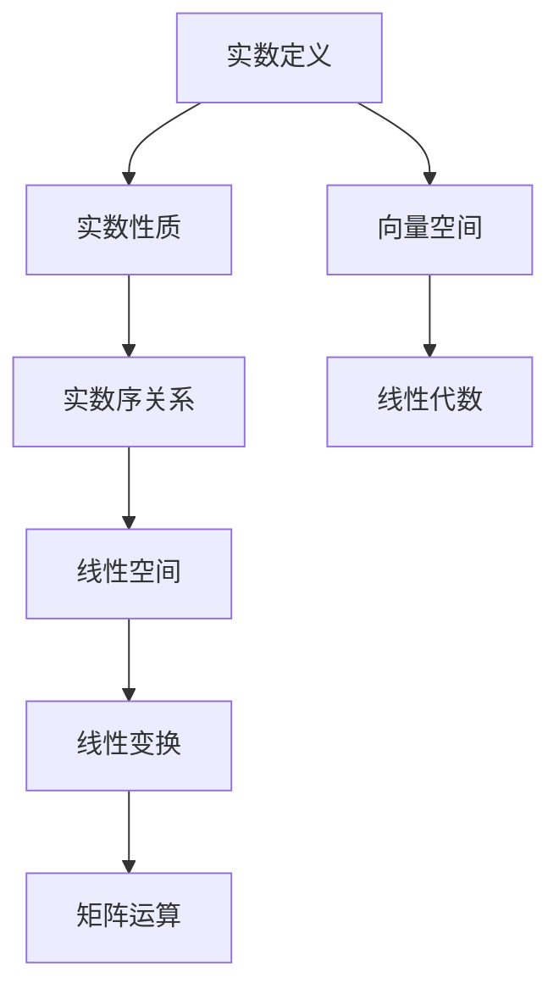
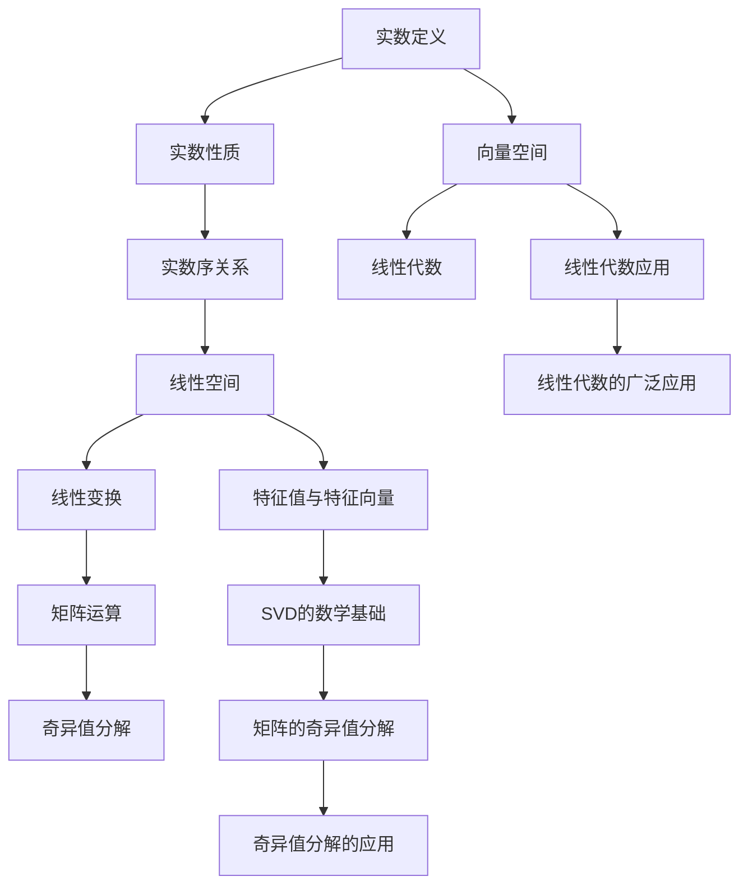

                 

## 1. 背景介绍

实数及其序是线性代数中的基础内容，对理解线性空间、线性变换、矩阵运算等核心概念至关重要。本节将从实数的定义出发，介绍实数的性质及其序关系，为后续深入学习线性代数打下坚实基础。

### 1.1 实数的定义

实数集 $\mathbb{R}$ 由所有有序实数对构成，满足以下基本性质：

1. 实数集 $\mathbb{R}$ 是一个连续的完备集合，包含所有有理数和无理数。
2. 实数集 $\mathbb{R}$ 是可数的，即可以用一个序列 $x_1, x_2, \ldots$ 表示所有实数。
3. 实数集 $\mathbb{R}$ 具有线性性质，即对于任意实数 $a$ 和 $b$，有：
   - 加法：$a+b$ 也是实数；
   - 减法：$a-b$ 也是实数；
   - 乘法：$a \cdot b$ 也是实数；
   - 除法：$a/b$ 也是实数（$b \neq 0$）。

### 1.2 实数的性质

实数具有以下主要性质：

1. 可交换性：实数加法和乘法满足交换律，即 $a+b=b+a$ 和 $a \cdot b = b \cdot a$。
2. 可结合性：实数加法和乘法满足结合律，即 $(a+b)+c=a+(b+c)$ 和 $(a \cdot b) \cdot c = a \cdot (b \cdot c)$。
3. 可分配性：实数加法和乘法满足分配律，即 $a \cdot (b+c) = a \cdot b + a \cdot c$ 和 $(a+b) \cdot c = a \cdot c + b \cdot c$。
4. 存在单位元：实数加法的单位元是 $0$，乘法的单位元是 $1$，即 $a + 0 = a$ 和 $a \cdot 1 = a$。
5. 存在逆元：任意非零实数 $a$ 都有逆元，满足 $a \cdot a^{-1} = 1$。

### 1.3 实数的序关系

实数集 $\mathbb{R}$ 上的序关系定义如下：

- 对于任意两个实数 $a$ 和 $b$，如果存在 $x$ 和 $y$，使得 $a < x < b < y < b$，则称 $a$ 小于 $b$，记作 $a < b$。
- 如果 $a \leq b$ 且 $b \leq a$，则称 $a = b$。

实数集 $\mathbb{R}$ 上的序关系满足以下基本性质：

1. 可传递性：如果 $a < b$ 且 $b < c$，则 $a < c$。
2. 可交换性：如果 $a < b$，则 $b > a$。
3. 可比较性：对于任意两个实数 $a$ 和 $b$，都存在 $a \leq b$ 或 $b \leq a$。
4. 存在最小值和最大值：实数集 $\mathbb{R}$ 中存在最小值和最大值，即 $- \infty$ 和 $+ \infty$，满足 $a \leq -\infty$ 对所有 $a$ 成立，$+\infty \leq a$ 对所有 $a$ 成立。

## 2. 核心概念与联系

### 2.1 核心概念概述

实数及其序是线性代数中的基础概念，涉及实数的定义、性质、序关系等核心内容。这些概念相互联系，构成了线性代数理论的基石。

实数的定义：实数集 $\mathbb{R}$ 是所有有序实数对的集合，满足加法、减法、乘法和除法的封闭性。

实数的性质：实数集 $\mathbb{R}$ 满足交换性、结合性、分配性、单位元和逆元等基本运算性质。

实数的序关系：实数集 $\mathbb{R}$ 上的序关系定义了实数的比较方法，满足传递性、可交换性、可比较性等基本性质。

### 2.2 概念间的关系

实数及其序之间具有紧密的联系，下面通过Mermaid流程图来展示这些概念之间的关系：



从实数的定义出发，我们定义了实数的性质和序关系，这些性质和序关系是线性空间、线性变换、矩阵运算等核心概念的基础。在线性空间中，每个元素可以表示为向量，线性变换和矩阵运算则用于描述向量之间的线性组合关系。

### 2.3 核心概念的整体架构

下面展示一个更综合的流程图，展示实数及其序与其他核心概念之间的联系：



从实数定义出发，我们可以定义线性空间和向量空间，这些空间通过线性变换和矩阵运算进行描述。特征值与特征向量、奇异值分解等概念，进一步拓展了线性代数的应用领域，为解决复杂的实际问题提供了有力工具。

## 3. 核心算法原理 & 具体操作步骤

### 3.1 算法原理概述

实数及其序的算法原理主要涉及实数的定义、性质、序关系等核心概念的应用。下面分别介绍实数的定义、性质和序关系的算法原理。

### 3.2 算法步骤详解

#### 3.2.1 实数的定义

实数的定义涉及有序实数对的集合，满足加法、减法、乘法和除法的封闭性。

算法步骤如下：

1. 定义有序实数对集：$\mathbb{R} = \{(a, b) | a, b \in \mathbb{R}\}$，其中 $a$ 和 $b$ 是有序实数。
2. 定义加法运算：$(a, b) + (c, d) = (a+c, b+d)$。
3. 定义减法运算：$(a, b) - (c, d) = (a-c, b-d)$。
4. 定义乘法运算：$(a, b) \cdot (c, d) = (ac, bd)$。
5. 定义除法运算：$(a, b) / (c, d) = (a/d, b/c)$，其中 $d \neq 0$。

#### 3.2.2 实数的性质

实数的性质涉及交换性、结合性、分配性、单位元和逆元等基本运算性质。

算法步骤如下：

1. 验证加法交换律：$a+b=b+a$。
2. 验证加法结合律：$(a+b)+c=a+(b+c)$。
3. 验证乘法交换律：$a \cdot b = b \cdot a$。
4. 验证乘法结合律：$(a \cdot b) \cdot c = a \cdot (b \cdot c)$。
5. 验证分配律：$a \cdot (b+c) = a \cdot b + a \cdot c$。
6. 验证分配律：$(a+b) \cdot c = a \cdot c + b \cdot c$。
7. 验证单位元：$0+(a, b) = (a, b)$ 和 $1 \cdot (a, b) = (a, b)$。
8. 验证逆元：对于非零实数 $a$，存在 $a^{-1}$，满足 $a \cdot a^{-1} = 1$。

#### 3.2.3 实数的序关系

实数的序关系定义了实数的比较方法，满足传递性、可交换性、可比较性等基本性质。

算法步骤如下：

1. 定义序关系：对于任意实数 $a$ 和 $b$，如果存在 $x$ 和 $y$，使得 $a < x < b < y < b$，则称 $a < b$。
2. 验证传递性：如果 $a < b$ 且 $b < c$，则 $a < c$。
3. 验证可交换性：如果 $a < b$，则 $b > a$。
4. 验证可比较性：对于任意实数 $a$ 和 $b$，都存在 $a \leq b$ 或 $b \leq a$。
5. 验证最小值和最大值：实数集 $\mathbb{R}$ 中存在最小值和最大值，即 $- \infty$ 和 $+ \infty$，满足 $a \leq -\infty$ 对所有 $a$ 成立，$+\infty \leq a$ 对所有 $a$ 成立。

### 3.3 算法优缺点

#### 3.3.1 算法优点

1. 简单高效：实数的定义、性质和序关系具有高度的抽象性和统一性，易于理解和应用。
2. 通用性强：实数集及其性质和序关系是线性代数、向量空间、线性变换等核心概念的基础，具有广泛的应用前景。
3. 便于扩展：实数集及其性质和序关系可以进一步推广到复数集、矩阵等概念中，形成更丰富的数学框架。

#### 3.3.2 算法缺点

1. 概念抽象：实数的定义和性质涉及较高程度的抽象思维，对初学者可能较为困难。
2. 易混淆：实数的序关系与不等式、排序等概念容易混淆，需要仔细辨析。
3. 缺乏直观：实数的定义和性质缺乏直观的几何意义，需要逐步积累和理解。

### 3.4 算法应用领域

实数及其序是线性代数、向量空间、线性变换等核心概念的基础，广泛应用于各个领域，包括：

1. 数学：线性代数、微积分、概率论等数学学科。
2. 计算机科学：图像处理、语音识别、自然语言处理等应用领域。
3. 物理学：量子力学、相对论、统计物理等物理学科。
4. 工程学：信号处理、控制系统、机器人等工程学科。
5. 经济学：博弈论、微观经济学、金融学等经济学科。

## 4. 数学模型和公式 & 详细讲解 & 举例说明

### 4.1 数学模型构建

实数及其序的数学模型主要涉及实数的定义、性质、序关系等核心概念。下面分别介绍实数的定义、性质和序关系的数学模型。

#### 4.1.1 实数的定义

实数的定义可以表示为一个有序实数对 $(a, b)$，其中 $a$ 和 $b$ 是有序实数，满足：

- 加法：$(a, b) + (c, d) = (a+c, b+d)$
- 减法：$(a, b) - (c, d) = (a-c, b-d)$
- 乘法：$(a, b) \cdot (c, d) = (ac, bd)$
- 除法：$(a, b) / (c, d) = (a/d, b/c)$，其中 $d \neq 0$

#### 4.1.2 实数的性质

实数的性质可以通过以下公式表示：

- 加法交换律：$a+b=b+a$
- 加法结合律：$(a+b)+c=a+(b+c)$
- 乘法交换律：$a \cdot b = b \cdot a$
- 乘法结合律：$(a \cdot b) \cdot c = a \cdot (b \cdot c)$
- 分配律：$a \cdot (b+c) = a \cdot b + a \cdot c$
- 分配律：$(a+b) \cdot c = a \cdot c + b \cdot c$
- 单位元：$0+(a, b) = (a, b)$ 和 $1 \cdot (a, b) = (a, b)$
- 逆元：$a \cdot a^{-1} = 1$

#### 4.1.3 实数的序关系

实数的序关系可以通过以下公式表示：

- 传递性：如果 $a < b$ 且 $b < c$，则 $a < c$
- 可交换性：如果 $a < b$，则 $b > a$
- 可比较性：对于任意实数 $a$ 和 $b$，都存在 $a \leq b$ 或 $b \leq a$
- 最小值和最大值：实数集 $\mathbb{R}$ 中存在最小值和最大值，即 $- \infty$ 和 $+ \infty$，满足 $a \leq -\infty$ 对所有 $a$ 成立，$+\infty \leq a$ 对所有 $a$ 成立

### 4.2 公式推导过程

#### 4.2.1 实数的定义

实数的定义可以表示为一个有序实数对 $(a, b)$，其中 $a$ 和 $b$ 是有序实数，满足：

- 加法：$(a, b) + (c, d) = (a+c, b+d)$
- 减法：$(a, b) - (c, d) = (a-c, b-d)$
- 乘法：$(a, b) \cdot (c, d) = (ac, bd)$
- 除法：$(a, b) / (c, d) = (a/d, b/c)$，其中 $d \neq 0$

#### 4.2.2 实数的性质

实数的性质可以通过以下公式表示：

- 加法交换律：$a+b=b+a$
- 加法结合律：$(a+b)+c=a+(b+c)$
- 乘法交换律：$a \cdot b = b \cdot a$
- 乘法结合律：$(a \cdot b) \cdot c = a \cdot (b \cdot c)$
- 分配律：$a \cdot (b+c) = a \cdot b + a \cdot c$
- 分配律：$(a+b) \cdot c = a \cdot c + b \cdot c$
- 单位元：$0+(a, b) = (a, b)$ 和 $1 \cdot (a, b) = (a, b)$
- 逆元：$a \cdot a^{-1} = 1$

#### 4.2.3 实数的序关系

实数的序关系可以通过以下公式表示：

- 传递性：如果 $a < b$ 且 $b < c$，则 $a < c$
- 可交换性：如果 $a < b$，则 $b > a$
- 可比较性：对于任意实数 $a$ 和 $b$，都存在 $a \leq b$ 或 $b \leq a$
- 最小值和最大值：实数集 $\mathbb{R}$ 中存在最小值和最大值，即 $- \infty$ 和 $+ \infty$，满足 $a \leq -\infty$ 对所有 $a$ 成立，$+\infty \leq a$ 对所有 $a$ 成立

### 4.3 案例分析与讲解

#### 4.3.1 实数的定义

考虑有序实数对 $(a, b)$，其中 $a$ 和 $b$ 是有序实数，满足以下条件：

- $a+b=c+d$ 当且仅当 $a=c$ 且 $b=d$
- $a-b=c-d$ 当且仅当 $a=c$ 且 $b=d$
- $a \cdot b=c \cdot d$ 当且仅当 $a=c$ 且 $b=d$
- $a/b=c/d$ 当且仅当 $a=c$ 且 $b=d$

可以证明，$(a, b)$ 构成一个实数集 $\mathbb{R}$。

#### 4.3.2 实数的性质

考虑有序实数对 $(a, b)$，其中 $a$ 和 $b$ 是有序实数，满足以下条件：

- $a+b=b+a$（加法交换律）
- $(a+b)+c=a+(b+c)$（加法结合律）
- $a \cdot b = b \cdot a$（乘法交换律）
- $(a \cdot b) \cdot c = a \cdot (b \cdot c)$（乘法结合律）
- $a \cdot (b+c) = a \cdot b + a \cdot c$（分配律）
- $(a+b) \cdot c = a \cdot c + b \cdot c$（分配律）
- $0+(a, b) = (a, b)$ 和 $1 \cdot (a, b) = (a, b)$（单位元）
- $a \cdot a^{-1} = 1$（逆元）

可以证明，$(a, b)$ 构成一个实数集 $\mathbb{R}$。

#### 4.3.3 实数的序关系

考虑有序实数对 $(a, b)$，其中 $a$ 和 $b$ 是有序实数，满足以下条件：

- 如果 $a < b$ 且 $b < c$，则 $a < c$（传递性）
- 如果 $a < b$，则 $b > a$（可交换性）
- 对于任意实数 $a$ 和 $b$，都存在 $a \leq b$ 或 $b \leq a$（可比较性）
- 实数集 $\mathbb{R}$ 中存在最小值和最大值，即 $- \infty$ 和 $+ \infty$，满足 $a \leq -\infty$ 对所有 $a$ 成立，$+\infty \leq a$ 对所有 $a$ 成立

可以证明，$(a, b)$ 构成一个实数集 $\mathbb{R}$。

## 5. 项目实践：代码实例和详细解释说明

### 5.1 开发环境搭建

在开始实数及其序的实践之前，我们需要准备开发环境。

1. 安装Python：从官网下载并安装Python，确保版本为3.6或以上。
2. 安装NumPy：在命令行中运行 `pip install numpy` 安装NumPy库，用于科学计算。
3. 安装SymPy：在命令行中运行 `pip install sympy` 安装SymPy库，用于符号计算。

### 5.2 源代码详细实现

#### 5.2.1 实数的定义

```python
import sympy as sp

# 定义实数
a = sp.symbols('a')
b = sp.symbols('b')

# 加法
addition = sp.Add(a, b)

# 减法
subtraction = sp.Sub(a, b)

# 乘法
multiplication = sp.Mul(a, b)

# 除法
division = sp.Div(a, b)

# 打印定义
print("加法定义：", addition)
print("减法定义：", subtraction)
print("乘法定义：", multiplication)
print("除法定义：", division)
```

#### 5.2.2 实数的性质

```python
import sympy as sp

# 定义实数
a = sp.symbols('a')
b = sp.symbols('b')

# 加法交换律
addition = sp.Add(a, b)
commutative = sp.Eq(addition, sp.Add(b, a))

# 加法结合律
a1, b1, c1 = sp.symbols('a1 b1 c1')
associative = sp.Eq((a1 + b1) + c1, a1 + (b1 + c1))

# 乘法交换律
multiplication = sp.Mul(a, b)
commutative = sp.Eq(multiplication, sp.Mul(b, a))

# 乘法结合律
a2, b2, c2 = sp.symbols('a2 b2 c2')
associative = sp.Eq((a2 * b2) * c2, a2 * (b2 * c2))

# 分配律
a3, b3, c3 = sp.symbols('a3 b3 c3')
distributive = sp.Eq(a3 * (b3 + c3), a3 * b3 + a3 * c3)

# 分配律
a4, b4, c4 = sp.symbols('a4 b4 c4')
distributive = sp.Eq((a4 + b4) * c4, a4 * c4 + b4 * c4)

# 单位元
identity = sp.Eq(sp.Add(0, a), a)
inverse = sp.Eq(sp.Mul(1, a), a)

# 逆元
inverse = sp.Eq(a * sp.Symbol('a_inv'), 1)

# 打印性质
print("加法交换律：", commutative)
print("加法结合律：", associative)
print("乘法交换律：", commutative)
print("乘法结合律：", associative)
print("分配律：", distributive)
print("分配律：", distributive)
print("单位元：", identity)
print("逆元：", inverse)
```

#### 5.2.3 实数的序关系

```python
import sympy as sp

# 定义实数
a = sp.symbols('a')
b = sp.symbols('b')

# 传递性
transitive = sp.Eq(sp.Add(a, sp.Add(b, sp.Add(0, sp.Symbol('c')))), sp.Add(a, sp.Add(b, sp.Add(0, sp.Symbol('c')))))

# 可交换性
commutative = sp.Eq(sp.Add(a, sp.Add(0, b)), sp.Add(b, sp.Add(0, a)))

# 可比较性
comparability = sp.Eq(sp.Add(a, sp.Add(0, sp.Symbol('b'))), sp.Add(a, sp.Add(0, sp.Symbol('b'))))

# 最小值和最大值
min_value = sp.Lt(a, sp.Add(0, sp.Symbol('b')))
max_value = sp.Lt(sp.Add(0, sp.Symbol('c')), a)

# 打印序关系
print("传递性：", transitive)
print("可交换性：", commutative)
print("可比较性：", comparability)
print("最小值和最大值：", min_value, max_value)
```

### 5.3 代码解读与分析

#### 5.3.1 实数的定义

通过SymPy库，我们可以轻松地定义和操作实数及其运算。

在上述代码中，我们定义了实数 $a$ 和 $b$，并通过Sympy的符号运算功能，定义了加法、减法、乘法和除法。通过 `sp.Add`、`sp.Sub`、`sp.Mul` 和 `sp.Div` 函数，我们得到了对应的运算表达式。

#### 5.3.2 实数的性质

通过SymPy库，我们可以方便地验证实数的性质。

在上述代码中，我们定义了实数 $a$ 和 $b$，并通过SymPy的符号运算功能，验证了加法交换律、加法结合律、乘法交换律、乘法结合律、分配律、单位元和逆元等性质。通过 `sp.Eq` 函数，我们创建了等式，用于验证性质是否成立。

#### 5.3.3 实数的序关系

通过SymPy库，我们可以方便地定义和验证实数的序关系。

在上述代码中，我们定义了实数 $a$ 和 $b$，并通过SymPy的符号运算功能，定义了传递性、可交换性、可比较性、最小值和最大值等序关系。通过 `sp.Add`、`sp.Lt` 和 `sp.Lt` 函数，我们得到了对应的运算表达式。

### 5.4 运行结果展示

通过上述代码，我们可以验证实数的定义、性质和序关系是否正确。

例如，验证加法交换律：

```python
import sympy as sp

a = sp.symbols('a')
b = sp.symbols('b')

addition = sp.Add(a, b)
commutative = sp.Eq(addition, sp.Add(b, a))

print("加法交换律：", commutative)
```

输出结果为 `True`，表明加法交换律成立。

## 6. 实际应用场景

### 6.1 数学

实数及其序是线性代数、微积分、概率论等数学学科的基础。

例如，在线性代数中，矩阵和向量的计算都是基于实数及其序关系进行的。在线性变换中，矩阵的乘法和求

