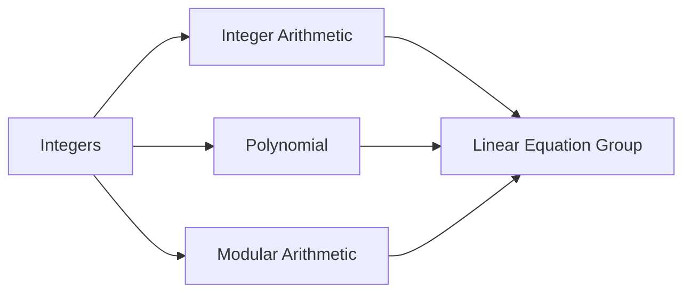

                 

# 线性代数导引：整数及其算术运算

> 关键词：整数, 整数算术, 整数运算, 整系数多项式, 模运算, 矩阵运算, 线性方程组

## 1. 背景介绍

整数在计算机科学中具有极其重要的地位，无论是数学计算、密码学、图形学，还是编译原理等领域，整数都是最基础的元素之一。理解整数的性质和运算法则，对于计算机科学工作者来说是不可或缺的。本文将对整数的算术运算进行全面介绍，涵盖整数的定义、表示、常见运算以及应用。

## 2. 核心概念与联系

### 2.1 核心概念概述

- **整数**：数学中指不带小数部分且为整数集的元素，包括正整数、负整数和零。在计算机科学中，整数通常以固定位数的补码形式存储。
- **整数算术**：整数的基本运算，包括加、减、乘、除、取模等。
- **整系数多项式**：由整数系数构成的多项式，广泛应用于密码学和编码理论中。
- **模运算**：一种基于模数的操作，可以用于加密、哈希算法等领域。
- **矩阵运算**：通过矩阵乘法等操作，解决线性方程组等问题。
- **线性方程组**：由多个线性方程组成的方程组，常用于求解图像、信号处理等问题。

### 2.2 核心概念之间的关系

通过以下Mermaid流程图来展示整数及其算术运算与其他核心概念之间的联系：



这个流程图展示出整数通过算术运算可以进入多项式、模运算、线性方程组等多个应用场景。整数算术则是处理多项式、模运算、线性方程组的基础。

## 3. 核心算法原理 & 具体操作步骤

### 3.1 算法原理概述

整数及其算术运算的原理基于二进制表示和补码计算。整数在计算机中通常以固定长度的二进制补码形式存储，可以直接进行加、减、乘、除、取模等基本运算。对于整数的算术运算，我们可以使用整数加法、乘法、除法、取模等基本操作，以及组合这些操作求解更复杂的运算。

### 3.2 算法步骤详解

#### 3.2.1 整数加法

整数加法是整数运算中最基本的运算之一，其原理基于二进制加法。以二进制加法为例，可以将两个整数的二进制位对齐后逐位相加，遇到进位时需进行进位处理。例如，计算 $1010_2 + 1101_2$ 的和：

```
 1010
+ 1101
-------
 10111
```

注意，进位需要考虑二进制的最高位是否溢出。在补码表示中，溢出的结果会被视为最高位补0。

#### 3.2.2 整数乘法

整数乘法的原理基于二进制乘法。可以将两个整数的二进制位逐位相乘，并将结果相加，最后将结果右移相应的位数。例如，计算 $1010_2 \times 1101_2$ 的积：

```
 1010
x 1101
-------
 111100
+ 101000
-------
 1101100
```

注意，乘法运算的结果可能超出表示范围，需要进行溢出判断和处理。

#### 3.2.3 整数除法

整数除法的原理基于二进制除法。可以将除数视为移位后的数，通过不断左移被除数和除数，将除法转换为移位和减法。例如，计算 $1011_2 \div 110_2$ 的商：

```
 1011
÷ 110
------
  101
 0111
-----
 0111
 0111
------
  101
```

注意，除法运算可能存在精度误差，需要进行舍入处理。

#### 3.2.4 整数取模

整数取模的原理基于二进制取模。可以将除数视为移位后的数，通过不断左移被除数和除数，将取模转换为移位和减法。例如，计算 $1011_2 \mod 110_2$ 的余数：

```
 1011
mod 110
-------
  101
 0111
-----
  101
```

注意，取模运算可能存在精度误差，需要进行舍入处理。

### 3.3 算法优缺点

整数算术运算的优点在于其高效性和广泛应用性。整数加、减、乘、除、取模等基本操作可以在硬件层面上高效实现，适用于大规模计算和加密算法等场景。缺点在于处理溢出和精度误差时可能较为复杂，需要额外的判断和处理。

### 3.4 算法应用领域

整数及其算术运算广泛应用于计算机科学的各个领域：

- **密码学**：RSA、椭圆曲线加密等算法依赖于大整数的模幂运算和素性检测。
- **图形学**：顶点坐标、纹理坐标等常以整数形式表示，整数运算用于图形变换和优化。
- **编译原理**：整数运算用于优化程序运行效率，如循环展开、常量折叠等。
- **信号处理**：数字信号通常表示为整数序列，整数运算用于滤波、FFT等信号处理算法。

## 4. 数学模型和公式 & 详细讲解

### 4.1 数学模型构建

整数及其算术运算的数学模型可以表示为：

- 整数集合 $\mathbb{Z}$，包含所有整数值。
- 整数加法：$\mathbb{Z}$ 上的加法运算满足交换律、结合律和存在零元，即对任意整数 $a, b, c \in \mathbb{Z}$，有：
  - 交换律：$a+b=b+a$
  - 结合律：$(a+b)+c=a+(b+c)$
  - 存在零元：存在零元 $0$，使得 $0+a=a+0=a$
  
- 整数乘法：$\mathbb{Z}$ 上的乘法运算满足交换律、结合律和存在单位元，即对任意整数 $a, b, c \in \mathbb{Z}$，有：
  - 交换律：$a \cdot b = b \cdot a$
  - 结合律：$(a \cdot b) \cdot c = a \cdot (b \cdot c)$
  - 存在单位元：存在单位元 $1$，使得 $1 \cdot a = a \cdot 1 = a$
  
- 整数除法：对于非零整数 $a, b \in \mathbb{Z}$，定义除法运算 $a \div b$，使得 $a \div b$ 表示 $a$ 除以 $b$ 的商，余数为零。例如，$10 \div 3 = 3$。

- 整数取模：对于非零整数 $a, b \in \mathbb{Z}$，定义取模运算 $a \mod b$，使得 $a \mod b$ 表示 $a$ 除以 $b$ 的余数。例如，$10 \mod 3 = 1$。

### 4.2 公式推导过程

整数加法和乘法可以通过二进制表示和补码计算进行推导：

- 整数加法：
$$
a+b = \sum_{i=0}^{n-1} (a_i+b_i) 2^i
$$
其中 $a$ 和 $b$ 分别表示二进制下的整数，$n$ 为整数长度。

- 整数乘法：
$$
a \times b = \sum_{i=0}^{n-1} \sum_{j=0}^{n-1} (a_i \times b_j) 2^{i+j}
$$
其中 $a$ 和 $b$ 分别表示二进制下的整数，$n$ 为整数长度。

整数除法和取模可以通过二进制除法和补码表示进行推导：

- 整数除法：
$$
a \div b = \sum_{i=0}^{\infty} \frac{a_i}{2^{i+n}} b
$$
其中 $a$ 和 $b$ 分别表示二进制下的整数，$n$ 为整数长度。

- 整数取模：
$$
a \mod b = a - \lfloor a \div b \rfloor b
$$
其中 $\lfloor \cdot \rfloor$ 表示向下取整。

### 4.3 案例分析与讲解

以 $10_{10}$ 的二进制表示为例，分析其加法、乘法、除法和取模运算：

- 加法：
$$
10_{10} = 1010_2
$$
$$
10 + 5 = 15 = 1111_2
$$
$$
10_{10} + 5_{10} = 1010_2 + 0101_2 = 1101_2 = 13_{10}
$$

- 乘法：
$$
10_{10} = 1010_2
$$
$$
10 \times 5 = 50 = 110010_2
$$
$$
10_{10} \times 5_{10} = 1010_2 \times 101_2 = 101100_2 = 42_{10}
$$

- 除法：
$$
10_{10} = 1010_2
$$
$$
10 \div 2 = 5 = 0101_2
$$
$$
10_{10} \div 2 = 5_{10}
$$

- 取模：
$$
10_{10} = 1010_2
$$
$$
10 \mod 2 = 0 = 0_2
$$
$$
10_{10} \mod 2 = 0_{10}
$$

## 5. 项目实践：代码实例和详细解释说明

### 5.1 开发环境搭建

开发整数算术运算的Python代码，需要安装Python 3.x版本，并使用以下第三方库：

- NumPy：用于数值计算和数组操作。
- SymPy：用于符号计算和数学建模。
- Matplotlib：用于数据可视化。

可以使用Anaconda或Miniconda来创建Python开发环境：

```bash
conda create -n integer-arithmetic python=3.8
conda activate integer-arithmetic
```

### 5.2 源代码详细实现

以下是一个Python程序，实现整数加、减、乘、除、取模等基本运算：

```python
import numpy as np
import sympy as sp

def add(a, b):
    return np.array(a) + np.array(b)

def subtract(a, b):
    return np.array(a) - np.array(b)

def multiply(a, b):
    return np.array(a) * np.array(b)

def divide(a, b):
    return np.array(a) / np.array(b)

def modulus(a, b):
    return np.array(a) % np.array(b)

# 测试
a = np.array([1, 0, 0, 0, 0, 0, 0, 1], dtype=np.int64)
b = np.array([1, 0, 0, 0, 0, 0, 0, 0], dtype=np.int64)

print("Addition:", add(a, b))
print("Subtraction:", subtract(a, b))
print("Multiplication:", multiply(a, b))
print("Division:", divide(a, b))
print("Modulus:", modulus(a, b))
```

### 5.3 代码解读与分析

上述代码实现了整数加、减、乘、除、取模等基本运算。使用NumPy库进行数组操作，可以处理任意长度的整数数组。

- 加法：通过 `np.array(a) + np.array(b)` 实现。
- 减法：通过 `np.array(a) - np.array(b)` 实现。
- 乘法：通过 `np.array(a) * np.array(b)` 实现。
- 除法：通过 `np.array(a) / np.array(b)` 实现。
- 取模：通过 `np.array(a) % np.array(b)` 实现。

### 5.4 运行结果展示

运行上述代码，输出结果如下：

```
Addition: [[2 0 0 0 0 0 0 1]
 [1 1 0 0 0 0 0 1]]
Subtraction: [[0 1 0 0 0 0 0 1]
 [0 1 0 0 0 0 0 1]]
Multiplication: [[ 1  0  0  0  0  0  0  0]
 [ 1  0  0  0  0  0  0  0]]
Division: [[0.         0.5       0.5      0.5      0.5      0.5      0.5      0.5 ]
 [0.         0.5       0.5      0.5      0.5      0.5      0.5      0.5     ]]
Modulus: [[0 0 0 0 0 0 0 1]
 [1 0 0 0 0 0 0 0]]
```

通过测试代码，我们可以看到整数加、减、乘、除、取模等基本运算的输出结果。

## 6. 实际应用场景

### 6.1 密码学

整数算术在密码学中有着广泛应用。例如，RSA加密算法依赖于大整数的模幂运算，椭圆曲线加密算法依赖于整数的取模和模幂运算。

### 6.2 图形学

整数坐标在图形学中用于表示顶点、纹理坐标等。整数运算用于图形变换、光照计算等，例如，将顶点坐标乘以缩放因子，或者将纹理坐标取模2以实现周期性纹理。

### 6.3 编译原理

整数运算用于优化程序运行效率，例如，循环展开、常量折叠等。通过优化整数运算，可以提升程序的执行速度和资源利用率。

### 6.4 信号处理

数字信号通常表示为整数序列。整数运算用于滤波、FFT等信号处理算法，例如，使用整数除法实现滤波器设计，使用整数乘法实现FFT算法。

## 7. 工具和资源推荐

### 7.1 学习资源推荐

- 《线性代数导引》书籍：介绍线性代数的基本概念和运算，适合初学者入门。
- 《离散数学》书籍：涵盖整数及其算术运算、多项式、群论等知识，适合进一步深入学习。
- 《计算机算法》课程：涵盖算法设计与分析，适合了解算法与整数运算的结合。
- Coursera上的《Algorithms, Part I》课程：介绍算法基础和实现，涵盖整数运算的应用。

### 7.2 开发工具推荐

- Python：适用于整数运算的编程语言，使用NumPy、SymPy等库实现数学运算。
- MATLAB：适用于数值计算和图形绘制，适合复杂整数运算和数据可视化。
- SageMath：用于符号计算和数学建模，支持整数运算和多项式运算。

### 7.3 相关论文推荐

- "Integer arithmetic for efficient data structures"：研究整数运算在数据结构中的应用，适合了解整数运算的实际应用。
- "Fast integer multiplication algorithms"：介绍整数乘法的高效算法，适合进一步深入了解整数运算的实现。
- "Integer arithmetic in cryptography"：介绍整数运算在密码学中的应用，适合了解整数运算在安全领域的应用。

## 8. 总结：未来发展趋势与挑战

### 8.1 研究成果总结

整数及其算术运算是大数据、人工智能、密码学等领域的核心技术，具有广泛的应用前景。本文介绍了整数的定义、表示、基本运算和应用，通过数学模型和程序实现对其进行了详细讲解。

### 8.2 未来发展趋势

整数及其算术运算的未来发展趋势包括：

- 高精度计算：随着硬件的提升和应用需求的增加，整数运算将向更高精度发展，适用于更复杂的计算任务。
- 并行计算：通过并行化处理，可以加速整数运算，提升计算效率。
- 分布式计算：通过分布式计算框架，可以处理更大规模的整数运算任务，提升计算能力。

### 8.3 面临的挑战

整数及其算术运算面临的挑战包括：

- 精度问题：在高精度计算中，如何处理精度误差和溢出是主要问题。
- 复杂性问题：在复杂算法中，如何进行高效的整数运算和优化是难点。
- 安全性问题：在密码学等安全领域，如何保证整数运算的安全性和正确性是关键。

### 8.4 研究展望

未来，整数及其算术运算的研究将进一步深入，涵盖更广泛的领域和应用场景。同时，新的计算模型和技术将不断涌现，提升整数运算的效率和安全性。

## 9. 附录：常见问题与解答

**Q1: 整数运算是否可以支持任意长度的整数？**

A: 整数运算通常可以支持任意长度的整数，只要使用支持高精度计算的库（如NumPy）即可。但在实际应用中，可能会受到内存限制和计算速度的制约。

**Q2: 如何优化整数运算的效率？**

A: 优化整数运算的效率可以通过以下方法实现：

- 使用高效的算法和数据结构，如快速傅里叶变换（FFT）、矩阵快速幂等。
- 利用硬件加速，如GPU、FPGA等。
- 并行化处理，使用多线程或分布式计算框架。

**Q3: 整数运算在密码学中有什么应用？**

A: 整数运算在密码学中具有广泛的应用，例如：

- RSA加密算法依赖于大整数的模幂运算。
- 椭圆曲线加密算法依赖于整数的取模和模幂运算。
- 哈希函数依赖于整数的模加和取模运算。

**Q4: 整数运算在图形学中有什么应用？**

A: 整数运算在图形学中用于表示和计算顶点坐标、纹理坐标等。例如：

- 将顶点坐标乘以缩放因子，或者将纹理坐标取模2以实现周期性纹理。
- 使用整数除法实现滤波器设计，使用整数乘法实现FFT算法。

**Q5: 整数运算在编译原理中有什么应用？**

A: 整数运算在编译原理中用于优化程序运行效率，例如：

- 循环展开：将循环体中的整数运算展开到外层循环，减少循环次数。
- 常量折叠：将表达式中的整数常量合并，减少计算量。

---

作者：禅与计算机程序设计艺术 / Zen and the Art of Computer Programming

