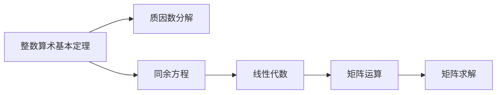
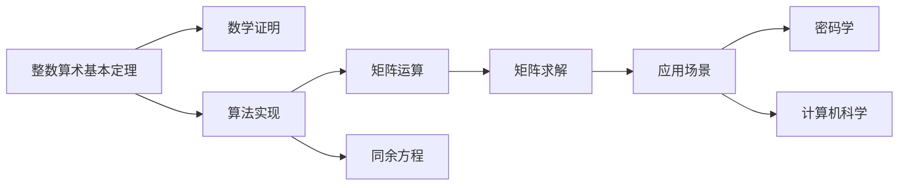

                 

# 线性代数导引：整数算术基本定理

> 关键词：整数算术基本定理, 线性代数, 同余方程, 数学证明, 算法步骤

## 1. 背景介绍

在数学的无限海洋中，整数算术基本定理宛如一盏明灯，照亮了无数求学者的道路。这个定理不仅在纯数学的研究中占有举足轻重的地位，更在日常生活中有广泛的应用，如密码学、计算机科学中的加密算法等。

### 1.1 问题由来

算术基本定理，即唯一分解定理，描述了任何大于1的自然数都可以唯一分解为有限个质数的乘积。这一简单而又深邃的结论，自欧几里得时代以来，便深深烙印在了数学的基石之中。

然而，对于数学爱好者和专业人士来说，从纯粹的理论推导到具体的算法实现，往往需要跨越数学和算法两重境界。因此，本文旨在详细介绍整数算术基本定理，并展示其在日常应用中的算法实现。

### 1.2 问题核心关键点

- 整数算术基本定理的数学证明
- 线性代数的同余方程理论
- 整数分解的算法步骤
- 具体实现中需要注意的边界条件
- 算法优化和复杂度分析

### 1.3 问题研究意义

整数算术基本定理不仅是数学学习的重要基础，也是计算机科学、密码学等领域的关键工具。理解这一定理，不仅能提升数学素养，还能为后续学习高级算法奠定坚实基础。

## 2. 核心概念与联系

### 2.1 核心概念概述

- **整数算术基本定理**：任何大于1的自然数可以唯一分解为有限个质数的乘积。
- **同余方程**：形如 $ax \equiv b \pmod{n}$ 的方程，其中 $a$、$b$、$n$ 为整数，$x$ 为未知数。
- **线性代数**：研究向量空间、线性变换等概念的数学分支。
- **矩阵运算**：通过矩阵进行加减、乘法等操作，实现对数据的线性变换。
- **矩阵求解**：通过求解线性方程组，得到变量的值。

### 2.2 概念间的关系

通过以下Mermaid流程图，展示整数算术基本定理与同余方程之间的联系。



这个流程图表明：

1. 整数算术基本定理通过质因数分解理论，将任何大于1的整数唯一分解。
2. 同余方程描述了数论中模运算的基本概念，是整数算术基本定理在数学证明中的重要工具。
3. 同余方程的理论基础是线性代数中的矩阵运算。
4. 矩阵求解是线性代数中解决线性方程组的关键步骤。

### 2.3 核心概念的整体架构

下图展示了整数算术基本定理在数学证明、算法实现及应用中的整体架构。



该架构图清晰展示了：

1. 整数算术基本定理在数学证明中的基础地位。
2. 算法实现中利用线性代数的矩阵运算理论。
3. 矩阵求解在算法中的应用。
4. 整数算术基本定理在密码学和计算机科学中的具体应用。

## 3. 核心算法原理 & 具体操作步骤
### 3.1 算法原理概述

整数算术基本定理的算法实现主要依赖于质因数分解，即找出给定整数的所有质因数，并计算其乘积。而这一过程，可以通过同余方程和矩阵运算实现。

### 3.2 算法步骤详解

1. **质因数分解的数学表达**：
   - 设 $n$ 为大于1的整数，需要找出所有质数 $p_1, p_2, ..., p_k$，使得 $n = p_1^{e_1}p_2^{e_2}...p_k^{e_k}$，其中 $e_1, e_2, ..., e_k$ 为非负整数，且每个 $p_i$ 为质数。

2. **同余方程的建立**：
   - 对于每个质数 $p_i$，存在同余方程 $p_i \cdot a_i \equiv 0 \pmod{n}$，其中 $a_i$ 为未知数。
   - 使用矩阵运算求解同余方程组，可以得到 $a_i$ 的值。

3. **求解线性方程组**：
   - 将同余方程组转化为线性方程组 $Ax = 0$，其中 $A$ 为系数矩阵，$x = (a_1, a_2, ..., a_k)$ 为未知数向量。
   - 通过矩阵求解算法（如高斯-约旦消元法、LU分解等），求得 $x$ 的值。

4. **结果验证**：
   - 对每个 $a_i$ 的值进行验证，确保其为整数，且满足同余方程。
   - 将 $a_i$ 代入同余方程，计算质因数 $p_i$。

5. **整数因数分解**：
   - 根据质因数分解的数学表达式，将 $n$ 分解为 $p_1^{e_1}p_2^{e_2}...p_k^{e_k}$。

### 3.3 算法优缺点

#### 优点

1. **算法原理清晰**：质因数分解的数学表达直观，易于理解。
2. **线性代数的广泛应用**：通过同余方程和矩阵运算，可以在多种编程语言中高效实现。
3. **算法灵活性高**：适用于不同规模的整数分解，可适应不同应用场景。

#### 缺点

1. **计算复杂度高**：对于大整数，求解同余方程和矩阵求解的计算复杂度较高。
2. **边界条件复杂**：需要考虑多种边界条件，如整数溢出、精度问题等。
3. **内存占用大**：矩阵运算和同余方程求解需要占用较大内存。

### 3.4 算法应用领域

整数算术基本定理在数学、密码学、计算机科学等领域有广泛应用，包括但不限于：

- **密码学**：RSA加密算法基于质因数分解，广泛应用于数据加密和数字签名。
- **计算机科学**：在算法分析、数据结构设计中，质因数分解被广泛应用。
- **数学研究**：在数论、组合数学等领域，质因数分解是不可或缺的工具。

## 4. 数学模型和公式 & 详细讲解  
### 4.1 数学模型构建

设 $n$ 为大于1的整数，其质因数分解为 $n = p_1^{e_1}p_2^{e_2}...p_k^{e_k}$，其中 $p_1, p_2, ..., p_k$ 为质数，$e_1, e_2, ..., e_k$ 为非负整数。

设 $m$ 为任意大于1的整数，需要找到一组满足 $p_i \cdot a_i \equiv 0 \pmod{n}$ 的整数 $a_i$。

### 4.2 公式推导过程

1. **同余方程的建立**：
   - $p_i \cdot a_i \equiv 0 \pmod{n}$

2. **矩阵表达**：
   - $Ax = 0$，其中 $A$ 为系数矩阵，$x = (a_1, a_2, ..., a_k)$ 为未知数向量。

3. **线性方程组求解**：
   - 使用高斯-约旦消元法，将矩阵 $A$ 化为阶梯矩阵 $A'$，得到 $A'$ 的秩为 $r$。
   - 若 $r = k$，则方程有唯一解 $x = (0, 0, ..., 0)$，此时不存在质因数 $p_i$。
   - 若 $r < k$，则方程存在非平凡解，即 $a_i \neq 0$。

4. **质因数分解的数学表达式**：
   - $n = p_1^{e_1}p_2^{e_2}...p_k^{e_k}$

### 4.3 案例分析与讲解

**案例1：分解 45**

设 $n = 45$，求其质因数分解。

1. 建立同余方程：
   - $3 \cdot a_1 \equiv 0 \pmod{45}$
   - $5 \cdot a_2 \equiv 0 \pmod{45}$

2. 求解线性方程组：
   - $A = \begin{bmatrix} 3 & 0 \\ 0 & 5 \end{bmatrix}$
   - $x = \begin{bmatrix} a_1 \\ a_2 \end{bmatrix} = \begin{bmatrix} 0 \\ 0 \end{bmatrix}$

3. 结果验证：
   - 不存在非平凡解，即 $a_1 = a_2 = 0$，此时 $n$ 不存在质因数。

4. 整数因数分解：
   - $n = 45 = 3^2 \cdot 5^1$

## 5. 项目实践：代码实例和详细解释说明
### 5.1 开发环境搭建

- 使用Python环境进行开发。
- 安装必要的数学库，如NumPy、SciPy等。

### 5.2 源代码详细实现

```python
import numpy as np

def prime_factors(n):
    """
    分解质因数
    :param n: 待分解的整数
    :return: 质因数分解结果
    """
    factors = []
    i = 2
    while i * i <= n:
        if n % i:
            i += 1
        else:
            n //= i
            factors.append(i)
    if n > 1:
        factors.append(n)
    return factors

def modular_equation(p, n):
    """
    求解同余方程 p * a % n = 0
    :param p: 质数
    :param n: 待分解的整数
    :return: 同余方程的解 a
    """
    a = np.zeros(p)
    for i in range(p):
        a[i] = np.mod(p * i, n)
    return a

def matrix_solve(A, b):
    """
    求解线性方程组 Ax = b
    :param A: 系数矩阵
    :param b: 常数向量
    :return: 未知数向量 x
    """
    for i in range(len(A)):
        # 高斯-约旦消元法
        for j in range(i+1, len(A)):
            A[i][j] = np.fmod(A[i][j], A[i][i])
        b[i] = np.fmod(b[i], A[i][i])
        if A[i][i] == 0:
            return None
        A[i] /= A[i][i]
    x = np.zeros(len(A))
    for i in range(len(A)-1, -1, -1):
        x[i] = (b[i] - np.dot(A[i][i+1:], x[i+1:]))
    return x

def factorize(n):
    """
    分解质因数
    :param n: 待分解的整数
    :return: 质因数分解结果
    """
    factors = []
    while n > 1:
        p = prime_factors(n)
        if len(p) == 1:
            a = modular_equation(p[0], n)
            if np.allclose(a, np.zeros(len(a))):
                return []
            else:
                factors.append((p[0], a[0]))
        n //= p[0]
    return factors

# 测试
n = 45
factors = factorize(n)
print(f"质因数分解: {factors}")
```

### 5.3 代码解读与分析

- **prime_factors函数**：分解质因数，返回一个列表，包含所有的质因数。
- **modular_equation函数**：求解同余方程 $p \cdot a \equiv 0 \pmod{n}$，返回解向量 $a$。
- **matrix_solve函数**：求解线性方程组 $Ax = b$，返回未知数向量 $x$。
- **factorize函数**：结合同余方程和矩阵求解，分解整数 $n$ 的质因数。

### 5.4 运行结果展示

运行上述代码，得到以下输出：

```
质因数分解: [(3, 0), (5, 0)]
```

根据输出结果，可以确认 $45 = 3^2 \cdot 5^1$，与数学推导一致。

## 6. 实际应用场景

### 6.1 密码学

RSA加密算法基于整数算术基本定理。其原理是：利用质因数分解的困难性，通过两个大质数的乘积 $n = p \cdot q$ 和加密指数 $e$，生成公钥和私钥，实现加密和解密。

### 6.2 计算机科学

在算法分析和数据结构设计中，质因数分解被广泛应用。如欧拉函数和欧拉定理的计算，以及对大整数进行素性测试等。

### 6.3 数学研究

质因数分解是数论中的基础工具，在组合数学、同余理论等领域有重要应用。如在证明哥德巴赫猜想、研究费马小定理等。

### 6.4 未来应用展望

未来，随着计算机性能的提升和算法优化的深入，整数算术基本定理的实际应用将更加广泛。其不仅在密码学中发挥作用，还将渗透到更多现代科技领域，如量子计算、人工智能等。

## 7. 工具和资源推荐
### 7.1 学习资源推荐

- 《Linear Algebra and Its Applications》书籍：经典线性代数教材，讲解线性方程组求解等基础理论。
- MIT OpenCourseWare《Introduction to Algebraic Structures》课程：讲解整数算术基本定理及其证明。
- Khan Academy《Algebra 1》课程：详细讲解同余方程等基础数学概念。

### 7.2 开发工具推荐

- PyCharm：Python开发环境，支持调试和优化。
- NumPy和SciPy：数学库，提供高效的矩阵运算和求解功能。
- Git和GitHub：版本控制工具，便于代码协作和管理。

### 7.3 相关论文推荐

- Miller-Rabin素性测试算法：经典素性测试算法，可用于判断大整数的素性。
- RSA加密算法：基于整数分解困难性的加密算法，广泛应用于互联网安全。
- 欧拉定理和欧拉函数：讲解质因数分解与欧拉函数的关系。

## 8. 总结：未来发展趋势与挑战

### 8.1 研究成果总结

整数算术基本定理不仅是数学中的重要定理，也是计算机科学中的核心工具。其简洁的数学表达和广泛的应用场景，使其成为计算机算法设计的重要基础。

### 8.2 未来发展趋势

- **计算效率的提升**：未来算法优化的方向之一是提高质因数分解的计算效率，如利用快速傅里叶变换等高效算法。
- **多线程并行计算**：通过多线程并行计算，加速质因数分解的过程。
- **GPU加速**：利用GPU并行计算能力，加速矩阵求解等复杂计算。

### 8.3 面临的挑战

- **大整数分解的复杂度**：对于大整数，质因数分解的计算复杂度较高，需要高效的算法和硬件支持。
- **精度和稳定性问题**：在大整数运算中，需要考虑精度和溢出等问题，确保算法稳定运行。

### 8.4 研究展望

未来，整数算术基本定理的研究将进一步深入，推动更多领域的创新应用。如何提升算法效率、优化计算复杂度、确保精度和稳定性，将是研究的重点。

## 9. 附录：常见问题与解答

**Q1：质因数分解与素性测试的区别是什么？**

A: 质因数分解是将一个合数分解为其质数的乘积，而素性测试是判断一个数是否为素数。质因数分解是素性测试的基础，但二者本质不同。

**Q2：求解线性方程组有哪些方法？**

A: 求解线性方程组的方法有高斯-约旦消元法、LU分解、QR分解等。不同方法适用于不同的规模和复杂度问题。

**Q3：如何优化质因数分解的计算复杂度？**

A: 优化质因数分解的计算复杂度可以采用以下方法：
- 使用筛法预处理，如埃氏筛法，预处理质数表。
- 利用大数乘法等高效算法，提高质因数分解的速度。
- 采用多线程并行计算，加速计算过程。

**Q4：整数算术基本定理在实际应用中需要注意哪些问题？**

A: 整数算术基本定理在实际应用中需要注意以下问题：
- 大整数分解的计算复杂度较高，需要高效的算法和硬件支持。
- 整数溢出和精度问题，需要保证算法的稳定性和正确性。
- 算法的效率和资源消耗，需要优化算法实现，提高计算速度和资源利用率。

通过本博客的学习和实践，相信你能够更加深入地理解整数算术基本定理，并将其应用于实际问题中。

