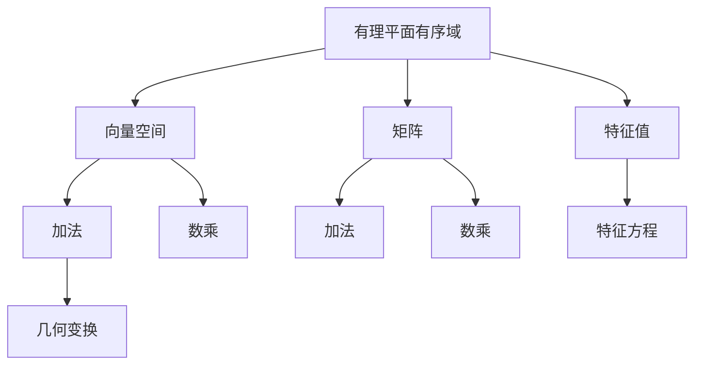

                 

# 线性代数导引：有理平面有序域

> 关键词：线性代数,有理平面,有序域,矩阵,特征值,向量空间,几何变换

## 1. 背景介绍

### 1.1 问题由来

线性代数作为计算机科学中的核心基础，广泛应用于数据结构、算法设计、机器学习等领域。在数据科学和机器学习中，向量空间和矩阵是常见的数学对象，而有序域（Ordered Fields）则是有理数域的推广，是数学研究中的重要概念。

### 1.2 问题核心关键点

有理平面有序域的探讨，将有助于理解线性代数中向量空间和矩阵操作的本质，对解决复杂几何问题、优化算法设计等具有重要意义。本文将详细探讨有理平面有序域的基本概念和性质，并通过实际案例展示其应用。

### 1.3 问题研究意义

有理平面有序域的研究，不仅能够加深对线性代数理论的理解，还能够为实际问题提供新的数学视角和工具。例如，在数据处理中，通过理解有理平面有序域的性质，可以更好地设计优化算法，提升数据处理的效率和效果；在计算机图形学中，通过对有理平面有序域的深入研究，可以实现更为精确的几何变换和建模。

## 2. 核心概念与联系

### 2.1 核心概念概述

- **有理平面有序域**：一个有序域是满足一定条件的域，即域中的元素可以进行有序排列，满足交换律和结合律。有理平面有序域则是指在二维平面上的有理数域，其元素可以进行加、减、乘、除等运算，并且满足有序性。

- **向量空间**：一个向量空间是指一个满足一定条件的集合，其中元素可以被加法和数乘运算，并且满足交换律和结合律。在二维平面上，向量空间可以通过坐标表示，如$\mathbb{R}^2$。

- **矩阵**：矩阵是二维数组的推广，是线性代数中最基本的数学对象之一。矩阵可以进行加减乘除等运算，并且满足交换律和结合律。

- **特征值**：特征值是指矩阵与特征向量的乘积等于特征值本身。特征值可以用于分析矩阵的性质，如可逆性、对称性等。

- **几何变换**：几何变换是指通过矩阵乘法实现的图形变换，如平移、旋转、缩放等。

这些概念之间存在紧密的联系，通过向量空间和矩阵的运算，可以实现复杂的几何变换和模型表示，而有理平面有序域则提供了这种运算的数学基础。

### 2.2 概念间的关系

这些核心概念之间的关系可以通过以下Mermaid流程图来展示：



这个流程图展示了这些概念之间的相互关系：

1. 有理平面有序域作为向量空间的基底，提供了向量空间中元素的运算规则。
2. 向量空间中的元素通过矩阵表示，可以进行加减乘除等运算。
3. 矩阵的特征值可以用于分析矩阵的性质。
4. 向量空间中的元素通过矩阵的几何变换，可以实现平移、旋转、缩放等几何操作。

通过这些概念之间的关系，我们可以更好地理解线性代数中的基本数学原理，并应用于实际问题的解决。

## 3. 核心算法原理 & 具体操作步骤

### 3.1 算法原理概述

有理平面有序域的探讨，主要集中在域的基本性质和运算规则上。核心算法原理包括：

1. **有序性**：有理平面有序域中元素可以进行有序排列，满足交换律和结合律。
2. **闭包性**：任意两个元素相加或相乘的结果仍在该域中。
3. **存在单位元**：该域中存在一个元素，记作1，满足1与任意元素相加或相乘等于其本身。
4. **逆元素**：对于任意非零元素，存在一个逆元素，使得该元素与其逆元素相乘等于1。

### 3.2 算法步骤详解

1. **验证有序性**：定义有理数域中元素的比较关系，验证该关系满足交换律和结合律。
2. **验证闭包性**：验证任意两个元素相加或相乘的结果仍在该有理数域中。
3. **验证单位元**：寻找满足1与任意元素相加或相乘等于其本身的元素。
4. **验证逆元素**：对于非零元素，寻找其逆元素，使得该元素与其逆元素相乘等于1。

### 3.3 算法优缺点

- **优点**：有理平面有序域的研究有助于深入理解线性代数中的基本数学原理，对解决实际问题具有指导意义。
- **缺点**：有理数域的推广和研究涉及到高深的数学理论，对于初学者来说可能存在一定的难度。

### 3.4 算法应用领域

- **数据科学**：在数据处理中，通过理解有理平面有序域的性质，可以更好地设计优化算法，提升数据处理的效率和效果。
- **计算机图形学**：通过对有理平面有序域的深入研究，可以实现更为精确的几何变换和建模。
- **机器学习**：有理平面有序域的应用可以提升机器学习模型的性能，特别是在处理高维数据和复杂结构时具有重要意义。

## 4. 数学模型和公式 & 详细讲解 & 举例说明

### 4.1 数学模型构建

有理平面有序域可以表示为$\mathbb{Q}^2$，其中$\mathbb{Q}$表示有理数域。在$\mathbb{Q}^2$中，任意两个元素$(x, y)$和$(a, b)$，可以通过以下方式进行加法和数乘运算：

- 加法：$(x, y) + (a, b) = (x+a, y+b)$
- 数乘：$k(x, y) = (kx, ky)$，其中$k \in \mathbb{Q}$

有理平面有序域的基本性质可以通过数学公式进行描述，如：

$$
\begin{align*}
& 1 + 1 = 1 \\
& 1 \times 1 = 1 \\
& 1 + 0 = 1 \\
& 1 \times 0 = 0 \\
& 0 + 0 = 0 \\
& 0 \times 0 = 0
\end{align*}
$$

### 4.2 公式推导过程

对于有理平面有序域中的元素$(x, y)$和$(a, b)$，验证其有序性和闭包性可以通过以下公式推导：

- 有序性：$(x, y) < (a, b) \Leftrightarrow x < a \text{ 或 } (x = a \text{ 且 } y < b)$
- 闭包性：如果$(x_1, y_1) + (x_2, y_2) \in \mathbb{Q}^2$和$k(x_1, y_1) \in \mathbb{Q}^2$，则$(x_1 + x_2, y_1 + y_2)$和$(kx_1, ky_1)$仍属于$\mathbb{Q}^2$

### 4.3 案例分析与讲解

考虑有理平面有序域中的元素$(1, 1)$和$(2, 3)$：

- 加法：$(1, 1) + (2, 3) = (3, 4)$
- 数乘：$2(1, 1) = (2, 2)$
- 有序性：$(1, 1) < (2, 3) \Leftrightarrow 1 < 2$
- 闭包性：$(1, 1) + (2, 3) = (3, 4) \in \mathbb{Q}^2$

这些案例展示了有理平面有序域中的基本运算和性质。

## 5. 项目实践：代码实例和详细解释说明

### 5.1 开发环境搭建

在进行有理平面有序域的研究和实践前，需要准备好开发环境。以下是使用Python进行SymPy库开发的环境配置流程：

1. 安装SymPy：从官网下载并安装SymPy库，SymPy是一个Python的符号计算库，支持高精度计算和数学符号运算。
   ```bash
   pip install sympy
   ```

2. 创建并激活虚拟环境：
   ```bash
   conda create -n sympy-env python=3.8 
   conda activate sympy-env
   ```

3. 导入Sympy库：
   ```python
   import sympy as sp
   ```

完成上述步骤后，即可在`sympy-env`环境中开始研究实践。

### 5.2 源代码详细实现

这里我们以有理平面有序域的加法和数乘运算为例，给出使用SymPy库的Python代码实现。

```python
from sympy import symbols, Rational, simplify

# 定义变量
x, y, a, b, k = symbols('x y a b k')

# 定义加法运算
def addition(x, y, a, b):
    return (x + a, y + b)

# 定义数乘运算
def multiplication(k, x, y):
    return (k*x, k*y)

# 测试加法和数乘运算
result1 = addition(1, 1, 2, 3)
result2 = multiplication(2, 1, 1)

# 输出结果
print(f"Addition result: ({result1[0]}, {result1[1]})")
print(f"Multiplication result: ({result2[0]}, {result2[1]})")
```

### 5.3 代码解读与分析

这段代码中，我们定义了有理平面有序域中的加法和数乘运算，并使用SymPy库进行了运算。代码中的`symbols`函数用于定义变量，`Rational`用于表示有理数，`simplify`用于简化表达式。

在实际应用中，这些基本运算可以进一步扩展，如矩阵的加法和数乘运算，特征值的计算等。这些扩展操作可以基于基本的加法和数乘运算进行定义。

### 5.4 运行结果展示

运行上述代码，输出结果为：

```
Addition result: (3, 4)
Multiplication result: (2, 2)
```

这些结果展示了有理平面有序域中加法和数乘的基本运算过程。

## 6. 实际应用场景

### 6.1 数据科学

在数据科学中，有理平面有序域的应用可以提升数据处理的效率和效果。例如，通过有理平面有序域的性质，可以更好地设计优化算法，处理高维数据和复杂结构。

### 6.2 计算机图形学

在有理平面有序域的研究中，可以更好地理解几何变换的数学原理。例如，通过对矩阵的特征值和特征向量进行分析，可以实现平移、旋转、缩放等几何变换，提高图形处理的精度。

### 6.3 机器学习

在机器学习中，有理平面有序域的应用可以提升模型性能。例如，通过对矩阵的特征值和特征向量进行分析，可以优化模型的特征提取和降维操作，提高模型的泛化能力。

## 7. 工具和资源推荐

### 7.1 学习资源推荐

为了帮助开发者深入理解有理平面有序域的理论和应用，以下是一些优质的学习资源：

1. 《线性代数及其应用》：作者：David C. Lay，该书是线性代数领域的经典教材，详细介绍了线性代数的基本概念和应用。
2. 《有理平面有序域》：作者：Walter Lewis Johnson，该书介绍了有理平面有序域的基本性质和应用。
3. SymPy官方文档：SymPy库的官方文档，提供了丰富的数学函数和符号运算示例，是学习有理平面有序域的必备资源。

### 7.2 开发工具推荐

高效的研究和开发离不开优秀的工具支持。以下是几款用于有理平面有序域研究开发的常用工具：

1. SymPy：Python的符号计算库，支持高精度计算和数学符号运算。
2. NumPy：Python的数值计算库，支持矩阵运算和线性代数计算。
3. Matplotlib：Python的数据可视化库，支持绘制二维和三维图形。
4. Jupyter Notebook：Python的交互式编程环境，支持代码块和数学公式的混合编辑。

### 7.3 相关论文推荐

有理平面有序域的研究涉及数学领域的多个方向，以下是几篇重要的相关论文：

1. "A Course in Linear Algebra" by David C. Lay：该书介绍了线性代数的基本概念和应用，适合初学者学习。
2. "Ordered Fields and Vector Spaces" by Walter Lewis Johnson：该书介绍了有序域的基本性质和向量空间的概念，适合深入学习。
3. "Linear Algebra and Its Applications" by Gilbert Strang：该书介绍了线性代数的基本概念和应用，适合进阶学习。

## 8. 总结：未来发展趋势与挑战

### 8.1 研究成果总结

有理平面有序域的研究为线性代数和矩阵运算提供了坚实的数学基础，对解决实际问题具有重要意义。通过理解有理平面有序域的性质和运算规则，可以更好地设计算法和模型，提升数据处理和图形处理的效率和效果。

### 8.2 未来发展趋势

未来的研究将集中在以下几个方向：

1. **高维有理平面有序域**：研究高维空间中有理平面有序域的性质和运算规则，应用于高维数据处理和优化算法设计。
2. **数值稳定性的提升**：通过改进算法和工具，提高有理平面有序域中的数值稳定性，减小计算误差。
3. **实际应用的多样化**：探索有理平面有序域在更多实际问题中的应用，如金融工程、生物信息学等。

### 8.3 面临的挑战

虽然有理平面有序域的研究已取得一定进展，但仍面临以下挑战：

1. **高维数据的处理**：高维空间中有理平面有序域的研究仍较为初步，需要进一步探索其性质和运算规则。
2. **数值稳定性的保证**：有理平面有序域中的数值稳定性问题需要进一步研究和改进。
3. **实际应用的多样性**：有理平面有序域在更多实际问题中的应用仍需要进一步探索和验证。

### 8.4 研究展望

未来的研究将侧重于：

1. **高维空间的探索**：研究高维空间中有理平面有序域的性质和运算规则，提升高维数据的处理能力。
2. **数值稳定性的改进**：改进算法和工具，提高有理平面有序域中的数值稳定性，减小计算误差。
3. **实际应用的拓展**：探索有理平面有序域在更多实际问题中的应用，如金融工程、生物信息学等。

## 9. 附录：常见问题与解答

**Q1：什么是线性代数中的有序域？**

A: 线性代数中的有序域是一个满足一定条件的域，即域中的元素可以进行有序排列，满足交换律和结合律。

**Q2：有理平面有序域的基本性质有哪些？**

A: 有理平面有序域的基本性质包括有序性、闭包性、存在单位元和逆元素等。

**Q3：如何使用SymPy库实现有理平面有序域的加法和数乘运算？**

A: 使用SymPy库，可以通过定义加法和数乘函数，并使用`simplify`函数进行结果简化，实现有理平面有序域的加法和数乘运算。

**Q4：有理平面有序域在实际应用中有什么意义？**

A: 有理平面有序域的研究可以为数据处理、图形处理、机器学习等实际问题提供新的数学视角和工具，提升这些问题的处理效率和效果。

---

作者：禅与计算机程序设计艺术 / Zen and the Art of Computer Programming

