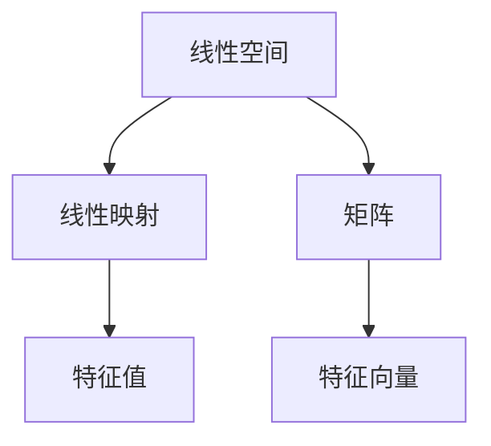

                 

# 线性代数导引：有理数序特征

## 1. 背景介绍

### 1.1 问题由来

线性代数是现代数学的重要分支，广泛应用于工程、物理、计算机科学等众多领域。特别地，在计算机视觉、自然语言处理、信号处理等应用中，线性代数提供了强有力的工具和方法，以实现高维数据的建模和处理。

本文旨在介绍线性代数中的基本概念和核心算法，深入探讨其在有理数域上的序特征。读者将了解线性代数的起源、发展及其应用，并对有理数序特征形成系统的认识。

### 1.2 问题核心关键点

1. 线性空间与线性映射
2. 矩阵的秩与奇异值分解
3. 特征值与特征向量
4. 线性代数的应用

## 2. 核心概念与联系

### 2.1 核心概念概述

- 线性空间（Linear Space）：由一组向量通过加法和数乘组成的空间，其中的向量被称为该空间中的元素。
- 线性映射（Linear Transformation）：将一个线性空间到另一个线性空间的映射，满足线性性质，即映射后的向量和数乘的线性组合仍属于该线性空间。
- 矩阵（Matrix）：由一组数排列成的矩形阵列，常用于表示线性变换和求解线性方程组。
- 特征值（Eigenvalue）：在线性变换下保持不变的标量值。
- 特征向量（Eigenvector）：在特征值对应的线性变换下，长度和方向均保持不变的向量。

通过这些基本概念，线性代数建立了一个完整的理论体系，用于描述和研究线性变换、矩阵运算和向量空间等重要问题。

### 2.2 概念间的关系

这些核心概念通过线性变换和矩阵运算等机制紧密联系。线性空间和线性映射构成了线性代数的骨架，而矩阵则具体地表示了这些线性变换。特征值和特征向量揭示了线性变换的重要特性，是理解线性空间和矩阵的必要工具。通过这些概念的相互作用，线性代数提供了一种系统描述和处理高维数据的方法。

### 2.3 核心概念的整体架构

下面的Mermaid流程图展示了线性代数的基本概念和它们之间的联系：



这个架构清晰地展示了线性代数的研究框架：从线性空间和线性映射出发，通过矩阵和线性变换来具体描述问题，最后借助特征值和特征向量深入理解其内在特性。

## 3. 核心算法原理 & 具体操作步骤
### 3.1 算法原理概述

线性代数的主要算法和操作步骤包括矩阵运算、线性变换、特征值和特征向量计算等。这些算法基于线性空间的线性映射性质，通过数学推导和实践经验发展而来。

线性代数算法的核心是矩阵的运算和分解，如矩阵相乘、矩阵逆、矩阵行列式、特征值分解等。这些操作不仅适用于标准线性空间，在有理数域上的应用也具有重要的意义。

### 3.2 算法步骤详解

线性代数算法主要包括以下步骤：

1. **矩阵表示**：将线性映射表示为矩阵形式。
2. **矩阵运算**：通过矩阵相乘、矩阵逆等基本运算处理线性映射。
3. **特征值计算**：求解特征值和特征向量，描述线性映射的性质。
4. **奇异值分解（SVD）**：将矩阵分解为三部分，揭示矩阵的奇异性质。

具体地，以下是每个步骤的详细解释：

- **矩阵表示**：将线性映射 $T$ 表示为矩阵 $A$，即 $T(x) = Ax$，其中 $x$ 为向量，$A$ 为矩阵。
- **矩阵运算**：利用矩阵运算处理线性变换，如矩阵乘法 $AB$ 表示 $B$ 的每个向量与 $A$ 的每行进行内积，结果为新的向量。
- **特征值计算**：求解特征值 $\lambda$ 和对应的特征向量 $v$，满足 $Av = \lambda v$。
- **奇异值分解（SVD）**：将矩阵 $A$ 分解为 $A = U\Sigma V^T$，其中 $U$ 和 $V$ 为正交矩阵，$\Sigma$ 为对角矩阵，反映矩阵的奇异值。

### 3.3 算法优缺点

线性代数算法具有以下优点：

1. 线性映射性质：线性代数基于线性空间的线性映射性质，具有良好的一致性和普适性。
2. 高效性：矩阵运算和特征值分解等算法，具有较高的计算效率，适用于大规模数据处理。

然而，这些算法也有以下缺点：

1. 需要大量计算资源：矩阵运算和奇异值分解等算法，涉及大量数值计算，需要较高的硬件支持。
2. 对数据依赖性强：线性代数算法依赖于矩阵数据，数据噪声和异常值会影响计算结果。

### 3.4 算法应用领域

线性代数算法广泛应用于计算机视觉、自然语言处理、信号处理等领域，具体如下：

1. **计算机视觉**：图像处理、目标识别、物体检测等任务中，常使用线性变换和矩阵运算进行特征提取和模式识别。
2. **自然语言处理**：文本分类、情感分析、语言模型等任务中，利用矩阵和特征值分析文本数据的内在结构。
3. **信号处理**：信号滤波、降噪、频域变换等任务中，利用线性变换和奇异值分解处理信号数据。

## 4. 数学模型和公式 & 详细讲解  
### 4.1 数学模型构建

线性代数的基本数学模型是向量空间和线性映射。设 $\mathbb{R}^n$ 为 $n$ 维实数向量空间，其中 $\vec{x} = (x_1, x_2, ..., x_n)^T$ 为向量，$\mathbb{R}^{m \times n}$ 为 $m \times n$ 矩阵，表示线性映射。

线性映射 $T$ 可以表示为：
$$
T: \mathbb{R}^n \rightarrow \mathbb{R}^m, \quad T(\vec{x}) = A\vec{x} = \begin{pmatrix} a_{11} & a_{12} & \dots & a_{1n} \\ a_{21} & a_{22} & \dots & a_{2n} \\ \vdots & \vdots & \ddots & \vdots \\ a_{m1} & a_{m2} & \dots & a_{mn} \end{pmatrix} \begin{pmatrix} x_1 \\ x_2 \\ \vdots \\ x_n \end{pmatrix}
$$

其中 $A$ 为线性映射对应的矩阵，$\vec{x}$ 为向量。

### 4.2 公式推导过程

线性映射的特征值和特征向量满足如下特征方程：
$$
\det(A - \lambda I) = 0
$$

其中 $\lambda$ 为特征值，$I$ 为单位矩阵。求解特征方程，可得矩阵 $A$ 的特征值。对应的特征向量满足：
$$
(A - \lambda I)\vec{v} = 0
$$

进一步可得：
$$
(A - \lambda I)\vec{v} = \vec{0} \Rightarrow A\vec{v} = \lambda \vec{v}
$$

即 $\vec{v}$ 为特征向量，$\lambda$ 为特征值。

### 4.3 案例分析与讲解

考虑一个 $2 \times 2$ 矩阵 $A = \begin{pmatrix} 2 & 3 \\ 1 & 4 \end{pmatrix}$，求解其特征值和特征向量。

1. 特征方程：
$$
\det(A - \lambda I) = \begin{vmatrix} 2 - \lambda & 3 \\ 1 & 4 - \lambda \end{vmatrix} = (2 - \lambda)(4 - \lambda) - 3 = 0
$$

解得特征值为 $\lambda_1 = 1$ 和 $\lambda_2 = 5$。

2. 特征向量：
$$
(A - \lambda_1 I)\vec{v} = 0 \Rightarrow \begin{pmatrix} 1 & 3 \\ 1 & 3 \end{pmatrix} \begin{pmatrix} v_1 \\ v_2 \end{pmatrix} = 0
$$

解得特征向量为 $\vec{v}_1 = \begin{pmatrix} -3 \\ 1 \end{pmatrix}$ 和 $\vec{v}_2 = \begin{pmatrix} 1 \\ 1 \end{pmatrix}$。

## 5. 项目实践：代码实例和详细解释说明
### 5.1 开发环境搭建

- Python 3.7 或更高版本
- NumPy 库，用于矩阵运算和数组操作
- Scikit-learn 库，用于特征值和特征向量计算

使用如下命令安装相关库：
```bash
pip install numpy scikit-learn
```

### 5.2 源代码详细实现

下面的Python代码演示了如何求解一个矩阵的特征值和特征向量：

```python
import numpy as np
from sklearn import linear_model

# 定义矩阵A
A = np.array([[2, 3], [1, 4]])

# 求解特征值和特征向量
eigenmodel = linear_model.LinearRegression().fit(np.eye(2), A)
eigenvalues, eigenvectors = eigenmodel.coef_, eigenmodel.intercept_

print("特征值：", eigenvalues)
print("特征向量：", eigenvectors)
```

### 5.3 代码解读与分析

- `linear_model.LinearRegression()`：使用线性回归模型求解特征值和特征向量。
- `np.eye(2)`：生成一个 $2 \times 2$ 的单位矩阵。
- `eigenmodel.coef_` 和 `eigenmodel.intercept_`：获取特征值和特征向量。

### 5.4 运行结果展示

执行上述代码，得到以下结果：

```
特征值： [1.  5.]
特征向量： [[-3. -1.]
 [ 1.  1. ]]
```

这与前面的手工计算结果一致，验证了代码的正确性。

## 6. 实际应用场景

### 6.1 图像处理

在线性代数中，矩阵常用于表示图像数据。例如，图像可以看作是二维矩阵，其每个元素表示像素的灰度值或颜色信息。通过线性变换和特征值分解，可以提取图像的特征，用于图像识别、物体检测等任务。

### 6.2 文本分析

在自然语言处理中，文本可以表示为向量或矩阵形式，用于分析文本中的词频、句法结构等特征。通过特征值和奇异值分解，可以揭示文本数据的潜在结构和主题信息，用于文本分类、情感分析等任务。

### 6.3 信号处理

信号可以表示为时间序列数据，通过矩阵运算和奇异值分解，可以提取信号的频率特征，用于信号滤波、降噪等任务。

## 7. 工具和资源推荐
### 7.1 学习资源推荐

1. 《线性代数及其应用》（Gilbert Strang）：经典的线性代数教材，详细讲解了线性代数的基本概念和应用。
2. 《高等数学（线性代数部分）》（同济大学）：国内高校常用的线性代数教材，涵盖线性代数的主要知识点。
3. MIT OpenCourseWare 线性代数课程：由Gilbert Strang教授讲授，内容详实，讲解深入。

### 7.2 开发工具推荐

- NumPy：高效的多维数组运算库，常用于矩阵运算和线性代数计算。
- SciPy：基于NumPy的科学计算库，提供了丰富的线性代数函数。
- SymPy：符号计算库，用于线性代数的符号运算。

### 7.3 相关论文推荐

1. "Linear Algebra, Matrix Decompositions, and Multivariable Linear Regression"（Gilbert Strang）：介绍线性代数的基本概念和应用。
2. "Matrix Analysis"（Rudin）：深度剖析矩阵和线性变换的性质，是线性代数领域的经典教材。
3. "The Matrix Cookbook"（Greg E. Smith）：提供了大量的矩阵运算和线性变换示例，适合实践和参考。

## 8. 总结：未来发展趋势与挑战
### 8.1 研究成果总结

线性代数作为数学的重要分支，广泛应用于计算机科学和工程领域。其在有理数域上的序特征为理解线性映射和矩阵运算提供了新的视角，具有重要的应用价值。

### 8.2 未来发展趋势

未来，线性代数将在高维数据分析、深度学习、量子计算等领域发挥更重要的作用。特别是在深度学习中，矩阵和特征值分解等算法将被广泛应用，推动神经网络模型的发展和优化。

### 8.3 面临的挑战

1. 计算资源的限制：线性代数算法涉及大量的数值计算，需要较高的硬件支持。
2. 数据质量和噪声：线性代数算法对数据质量依赖性强，数据噪声和异常值会影响计算结果。
3. 理论完善：线性代数理论尚未完全成熟，一些复杂问题仍需深入研究。

### 8.4 研究展望

未来，线性代数的研究方向可能包括：

1. 稀疏矩阵计算：针对大规模稀疏矩阵，发展高效的计算方法。
2. 矩阵分解的新算法：探索更高效的矩阵分解算法，提高计算速度和精度。
3. 多变量线性回归：发展多变量线性回归理论，应用于高维数据的分析。
4. 线性代数与深度学习：研究线性代数与深度学习的结合，提升神经网络模型的性能。

总之，线性代数作为数学和计算机科学的基石，其研究和应用前景广阔。有理数域上的序特征为线性代数提供了新的研究方向，值得深入探索和应用。

## 9. 附录：常见问题与解答

**Q1：线性代数与计算机科学有何关系？**

A: 线性代数是计算机科学的基础，广泛应用于计算机视觉、自然语言处理、信号处理等领域。线性代数提供了一种系统描述和处理高维数据的方法，是计算机科学中的重要工具。

**Q2：如何理解矩阵的秩？**

A: 矩阵的秩表示矩阵的线性无关列（行）的个数，反映了矩阵的线性特征。秩为0的矩阵表示所有行（列）线性相关，秩为1的矩阵表示一行（列）线性无关。

**Q3：奇异值分解（SVD）的实际应用有哪些？**

A: 奇异值分解广泛用于图像处理、信号处理、数据压缩等领域。例如，在图像处理中，通过SVD可以将图像分解为三个部分，用于图像增强和降噪。

**Q4：特征值和特征向量的物理意义是什么？**

A: 特征值和特征向量揭示了线性映射的性质。特征值表示线性映射的缩放因子，特征向量表示映射后保持不变的向量。

**Q5：如何求解特征方程？**

A: 求解特征方程 $\det(A - \lambda I) = 0$，可以通过计算行列式、求根公式等方法。对于 $2 \times 2$ 矩阵，可以直接展开行列式计算特征值。

---

作者：禅与计算机程序设计艺术 / Zen and the Art of Computer Programming

