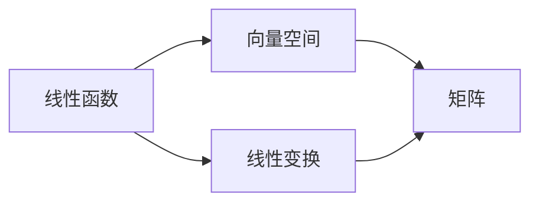

                 

## 1. 背景介绍

线性代数作为数学的基石，其核心概念和思想对计算机科学，尤其是人工智能和机器学习领域有着深远的影响。本博客将以线性函数为切入点，带您了解线性代数的基本概念和在机器学习中的应用。

### 1.1 问题由来

在机器学习中，线性函数（Linear Function）是最基础也是最常用的数学工具之一。无论是在线性回归、逻辑回归、支持向量机等传统机器学习算法，还是在深度学习中的卷积神经网络（CNN）和全连接神经网络中，线性函数都扮演着重要的角色。理解线性函数，不仅有助于掌握这些算法的工作原理，更能为深入学习更高阶的数学模型和理论打下基础。

### 1.2 问题核心关键点

线性函数的基本形式可以表示为 \( f(x) = ax + b \)，其中 \( x \) 是自变量，\( a \) 是斜率，\( b \) 是截距。线性函数的本质特征是线性可加性和线性齐次性，即 \( f(x + y) = f(x) + f(y) \) 和 \( f(kx) = kf(x) \)。掌握线性函数，可以更好地理解和应用机器学习中的各种模型和算法。

### 1.3 问题研究意义

在线性代数的导引下，理解线性函数对于掌握机器学习的底层数学原理具有重要意义。通过深入探讨线性函数，可以增强对机器学习算法的理解和应用能力，为进一步学习非线性函数和更高级的数学模型奠定坚实的基础。

## 2. 核心概念与联系

### 2.1 核心概念概述

在线性代数中，线性函数是构建更复杂数学模型的基础。下面我们将介绍几个核心概念，以便更好地理解线性函数。

- **线性函数**：形如 \( f(x) = ax + b \) 的函数，其中 \( a \) 和 \( b \) 为常数。
- **向量空间**：由一组向量组成的集合，满足加法和数乘的封闭性，以及线性组合的性质。
- **线性变换**：对向量空间中的向量进行线性组合的变换，如平移、旋转、缩放等。
- **矩阵**：由一组数排列成的矩形数组，用于表示线性变换和线性函数之间的关系。

这些概念通过线性代数的基本定理和性质，相互联系，共同构建了线性函数的数学基础。

### 2.2 概念间的关系

线性函数、向量空间和线性变换之间存在着紧密的联系。通过线性函数，可以定义向量空间中的线性变换；通过线性变换，可以将向量空间映射到另一个向量空间。矩阵作为线性变换的表示工具，连接了线性函数和线性变换，使得两者可以相互转换和应用。

### 2.3 核心概念的整体架构

以下是一个综合的流程图，展示了线性函数、向量空间和线性变换之间的关系：



在这个架构中，线性函数通过矩阵表示线性变换，进而定义向量空间中的线性组合和映射关系。线性变换和矩阵是线性函数和向量空间的桥梁，使得两者能够相互转换和应用。

## 3. 核心算法原理 & 具体操作步骤

### 3.1 算法原理概述

线性函数的原理相对简单，其核心思想是将自变量和常量通过系数 \( a \) 和截距 \( b \) 线性组合，形成输出。在线性代数的导引下，线性函数可以进一步扩展到多元线性函数和多变量线性变换。

### 3.2 算法步骤详解

下面是实现线性函数的基本步骤：

1. **定义线性函数**：确定自变量 \( x \) 和系数 \( a \) 和截距 \( b \)，形成线性函数 \( f(x) = ax + b \)。
2. **输入自变量**：将待求值的自变量 \( x \) 代入线性函数中。
3. **计算输出**：根据输入的自变量 \( x \) 和线性函数的表达式，计算输出 \( f(x) \)。
4. **验证结果**：将计算结果与期望输出进行比较，确保线性函数正确无误。

### 3.3 算法优缺点

线性函数具有以下优点：
- **简单直观**：线性函数的表达式简单，易于理解和计算。
- **可扩展性**：可以轻松扩展到多元线性函数和多变量线性变换。

同时，线性函数也存在一些局限性：
- **线性限制**：只能处理线性关系，无法处理非线性关系。
- **表达能力有限**：对于复杂和非线性的数据关系，线性函数的表达能力有限。

### 3.4 算法应用领域

线性函数在线性回归、逻辑回归、支持向量机等传统机器学习算法中广泛应用。在深度学习中，线性函数通过卷积和池化操作，与非线性激活函数结合，构建了卷积神经网络（CNN）和全连接神经网络（FNN）等模型。

## 4. 数学模型和公式 & 详细讲解

### 4.1 数学模型构建

线性函数的基本模型可以表示为 \( f(x) = ax + b \)，其中 \( x \) 是自变量，\( a \) 是斜率，\( b \) 是截距。在线性代数的导引下，可以将线性函数扩展到多元线性函数和多变量线性变换。

### 4.2 公式推导过程

线性函数的推导过程相对简单。根据定义，线性函数可以表示为：

$$
f(x) = ax + b
$$

其中 \( x \) 是自变量，\( a \) 是斜率，\( b \) 是截距。对于多元线性函数，可以扩展为：

$$
f(x) = ax_1 + bx_2 + cx_3 + \cdots + kx_n + d
$$

其中 \( x_1, x_2, \ldots, x_n \) 是自变量，\( a, b, c, \ldots, k, d \) 是系数。

### 4.3 案例分析与讲解

以一元线性函数 \( f(x) = 2x + 3 \) 为例，分析其基本性质和应用。

- **斜率**：斜率 \( a = 2 \) 表示自变量每增加一个单位，函数值增加 \( 2 \) 个单位。
- **截距**：截距 \( b = 3 \) 表示当自变量为 \( 0 \) 时，函数值为 \( 3 \)。
- **输入输出**：假设输入自变量 \( x = 1 \)，则输出 \( f(1) = 2 \times 1 + 3 = 5 \)。

通过这个简单的例子，可以理解线性函数的基本性质和应用。

## 5. 项目实践：代码实例和详细解释说明

### 5.1 开发环境搭建

在进行线性函数的相关开发时，可以使用Python的Sympy库进行符号计算。以下是一个基本的开发环境搭建步骤：

1. **安装Sympy库**：使用pip安装Sympy库，命令为 `pip install sympy`。
2. **导入Sympy库**：在Python脚本中导入Sympy库，命令为 `import sympy`。
3. **创建符号变量**：使用Sympy创建符号变量，命令为 `x = sympy.Symbol('x')`。

### 5.2 源代码详细实现

下面是一个简单的线性函数实现示例：

```python
import sympy

# 创建符号变量
x = sympy.Symbol('x')

# 定义线性函数
a = sympy.Symbol('a')
b = sympy.Symbol('b')
f = a * x + b

# 计算输出
f_x = f.subs(x, sympy.Symbol('x'))

# 输出结果
print(f"f(x) = {f_x}")
```

### 5.3 代码解读与分析

在上述代码中，我们首先导入了Sympy库，并创建了符号变量 \( x \)。然后定义了线性函数 \( f(x) = ax + b \)，并使用符号 \( a \) 和 \( b \) 表示斜率和截距。最后，我们将自变量 \( x \) 代入函数中，并输出结果。

### 5.4 运行结果展示

运行上述代码，输出结果如下：

```
f(x) = a*x + b
```

这表明我们的线性函数已经成功定义。如果需要计算具体的输出值，可以在代码中替换符号 \( x \) 的值，例如：

```python
f_1 = f.subs(x, 1)
print(f"f(1) = {f_1}")
```

输出结果为：

```
f(1) = a + b
```

这表明当自变量 \( x = 1 \) 时，函数的输出为 \( a + b \)。

## 6. 实际应用场景

### 6.1 线性回归

线性回归是机器学习中最基础的算法之一，用于建立自变量和因变量之间的线性关系。在线性回归中，线性函数用于表示自变量和因变量之间的关系，从而进行预测和回归分析。

### 6.2 逻辑回归

逻辑回归是用于分类任务的线性模型，其核心思想是通过线性函数将自变量映射到概率空间，进行二分类或多元分类。

### 6.3 支持向量机

支持向量机（SVM）是一种用于分类和回归任务的线性模型，通过线性函数将自变量映射到高维空间，并使用超平面进行分类或回归。

### 6.4 未来应用展望

随着深度学习的发展，线性函数在深度学习中的应用逐渐增多。未来，线性函数将在更多的机器学习算法中发挥重要作用，推动人工智能技术的不断进步。

## 7. 工具和资源推荐

### 7.1 学习资源推荐

- **《线性代数及其应用》**：这是一本经典的线性代数教材，适合初学者和进阶者学习。
- **《线性代数与向量空间》**：介绍了线性代数的基本概念和向量空间的应用。
- **Coursera《线性代数》课程**：由斯坦福大学提供的线性代数课程，详细讲解了线性代数的各种概念和应用。
- **Khan Academy线性代数视频**：Khan Academy提供的线性代数视频教程，适合自学和理解。

### 7.2 开发工具推荐

- **Sympy库**：用于符号计算的Python库，适合进行数学建模和符号计算。
- **Matplotlib**：用于绘制各种图形的Python库，适合进行数据分析和可视化。
- **Numpy**：用于数值计算的Python库，适合进行矩阵运算和数据分析。

### 7.3 相关论文推荐

- **"Linear Algebra and its Applications"**：这是一本经典的线性代数教材，介绍了线性代数的各种概念和应用。
- **"Elements of Linear Algebra"**：这是一本适合初学者的线性代数教材，介绍了线性代数的基本概念和应用。
- **"Linear Algebra Done Right"**：这是一本深入浅出的线性代数教材，适合进阶学习和理解。

## 8. 总结：未来发展趋势与挑战

### 8.1 研究成果总结

线性函数作为线性代数的核心概念之一，其在机器学习和深度学习中的应用已经相当广泛。通过对线性函数的深入理解，可以更好地掌握各种机器学习算法和深度学习模型。

### 8.2 未来发展趋势

线性函数在未来将继续发挥重要作用，随着深度学习的发展，线性函数的应用范围将不断扩大。未来，线性函数将在更多的高阶数学模型和算法中得到应用，推动人工智能技术的不断进步。

### 8.3 面临的挑战

尽管线性函数在机器学习和深度学习中有着广泛的应用，但其局限性也逐渐显现。如何处理非线性关系，如何提升线性函数的表达能力，将是未来面临的主要挑战。

### 8.4 研究展望

未来的研究需要集中在以下几个方面：
- **处理非线性关系**：通过引入非线性变换和激活函数，提升线性函数的表达能力。
- **提升线性函数的复杂度**：通过多变量线性函数和高阶矩阵运算，处理更复杂的数据关系。
- **线性函数的扩展**：将线性函数扩展到更广泛的应用场景中，如图论、优化问题等。

总之，线性函数作为线性代数和机器学习的基础，其应用和研究前景广阔。未来，线性函数将继续在人工智能领域发挥重要作用，推动技术进步和应用创新。

## 9. 附录：常见问题与解答

**Q1：线性函数和多项式函数有什么区别？**

A: 线性函数是一元函数的特殊形式，即 \( f(x) = ax + b \)，而多项式函数是更高阶的函数形式，即 \( f(x) = a_nx^n + a_{n-1}x^{n-1} + \cdots + a_1x + a_0 \)。线性函数只包含一次项和常数项，而多项式函数可以包含任意次数的项。

**Q2：如何处理非线性关系？**

A: 非线性关系通常通过引入非线性变换和激活函数来处理。例如，在神经网络中，常用的激活函数有ReLU、Sigmoid、Tanh等，它们可以引入非线性变换，提升模型的表达能力。

**Q3：线性函数的局限性是什么？**

A: 线性函数的局限性主要在于其只能处理线性关系，对于非线性关系和复杂数据关系，线性函数的表达能力有限。

**Q4：线性函数在深度学习中的应用有哪些？**

A: 在线性回归、逻辑回归、支持向量机等传统机器学习算法中，线性函数具有重要应用。在深度学习中，线性函数通过卷积和池化操作，与非线性激活函数结合，构建了卷积神经网络（CNN）和全连接神经网络（FNN）等模型。

**Q5：如何提高线性函数的表达能力？**

A: 提高线性函数的表达能力可以通过引入非线性变换和更高阶的矩阵运算来实现。例如，在神经网络中，通过引入多个线性层和激活函数，可以提升模型的表达能力和泛化性能。

---

作者：禅与计算机程序设计艺术 / Zen and the Art of Computer Programming

