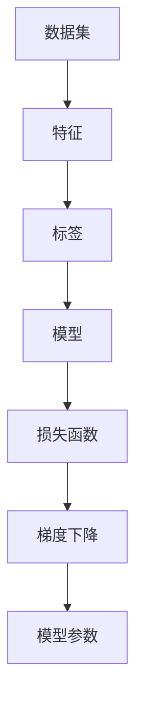

                 

# 线性回归(Linear Regression) - 原理与代码实例讲解

> 关键词：线性回归, 最小二乘法, 梯度下降, 矩阵计算, 数据可视化, 应用实例, 学习资源

## 1. 背景介绍

### 1.1 问题由来

线性回归是机器学习中最基本的算法之一，它广泛应用于各种领域，如金融预测、医学诊断、天气预测等。然而，对于许多初学者来说，理解线性回归的原理和实现可能仍然存在一定的难度。本文将从原理到实践，全面讲解线性回归，通过详细的数学推导和代码实例，帮助读者掌握这一经典算法。

### 1.2 问题核心关键点

线性回归的核心思想是通过一条直线（或超平面）来拟合数据，从而预测新的数据点。其目标是最小化预测值与真实值之间的误差。最小二乘法（Ordinary Least Squares, OLS）是线性回归中最常用的优化方法。具体来说，最小二乘法通过最小化预测值与真实值之间的平方误差来求解线性回归模型的参数。

线性回归的算法步骤主要包括以下几个方面：

- 准备数据集，并进行归一化处理。
- 构建线性回归模型，并定义损失函数。
- 使用梯度下降算法优化模型参数。
- 在测试集上进行模型评估。

### 1.3 问题研究意义

线性回归算法简单易懂，易于实现，而且在大数据时代，它仍然是一个有效的工具。通过掌握线性回归的原理和实现，读者可以更好地理解和应用机器学习算法，为后续学习更复杂的模型打下坚实的基础。此外，线性回归还是理解深度学习中梯度下降算法的起点，可以帮助读者更好地理解神经网络的优化过程。

## 2. 核心概念与联系

### 2.1 核心概念概述

为了更好地理解线性回归的原理和实现，我们先介绍几个关键概念：

- **数据集**：用于训练模型的输入数据和对应的标签数据。
- **特征**：数据集中的自变量，用于预测因变量。
- **标签**：数据集中的因变量，用于监督模型的训练。
- **模型**：用于拟合数据集的函数或算法，通常是线性函数。
- **损失函数**：用于衡量模型预测值与真实值之间差异的函数。
- **梯度下降算法**：一种常用的优化算法，通过迭代更新模型参数，最小化损失函数。

这些概念构成了线性回归的基本框架。

### 2.2 核心概念之间的关系

线性回归的核心概念之间存在着紧密的联系。数据集提供了训练模型的数据和标签，特征用于构建模型，标签用于监督模型的训练，模型用于拟合数据，损失函数用于衡量模型的性能，梯度下降算法用于优化模型参数，从而最小化损失函数。

这些概念之间的关系可以通过以下Mermaid流程图来展示：



这个流程图展示了数据集、特征、标签、模型、损失函数和梯度下降之间的关系，以及它们如何相互作用来构建线性回归模型。

## 3. 核心算法原理 & 具体操作步骤

### 3.1 算法原理概述

线性回归的原理是通过拟合一条直线（或超平面）来预测新的数据点。具体来说，假设我们有一个特征向量 $\boldsymbol{x} = [x_1, x_2, \ldots, x_n]$，对应的标签为 $y$，线性回归模型的参数为 $\boldsymbol{\theta} = [\theta_0, \theta_1, \ldots, \theta_n]$，其中 $\theta_0$ 是截距，$\theta_1, \ldots, \theta_n$ 是特征系数。则线性回归模型的预测值为：

$$
\boldsymbol{\theta} \cdot \boldsymbol{x} = \theta_0 + \theta_1 x_1 + \theta_2 x_2 + \ldots + \theta_n x_n
$$

我们的目标是找到最优的参数 $\boldsymbol{\theta}$，使得模型在测试集上的预测值尽可能接近真实值 $y$。为此，我们通常使用最小二乘法来优化损失函数。

### 3.2 算法步骤详解

线性回归的算法步骤如下：

1. **准备数据集**：首先，我们需要准备一个数据集，包括特征 $\boldsymbol{x}$ 和标签 $y$。数据集需要进行归一化处理，以保证所有特征的尺度相同。

2. **构建模型**：构建线性回归模型，即定义模型参数 $\boldsymbol{\theta}$。

3. **定义损失函数**：定义损失函数，通常使用均方误差（Mean Squared Error, MSE）：

$$
\text{MSE} = \frac{1}{N} \sum_{i=1}^N (y_i - \boldsymbol{\theta} \cdot \boldsymbol{x}_i)^2
$$

4. **优化模型参数**：使用梯度下降算法优化模型参数 $\boldsymbol{\theta}$，使得损失函数最小化。

5. **评估模型**：在测试集上评估模型性能，计算预测值与真实值之间的误差。

### 3.3 算法优缺点

线性回归算法具有以下优点：

- 模型简单，易于实现。
- 能够处理线性关系的数据。
- 可解释性强，方便理解。

然而，线性回归算法也存在以下缺点：

- 对于非线性关系的数据，拟合效果不佳。
- 对异常值敏感，可能会影响模型性能。
- 需要手动选择特征，容易陷入过拟合或欠拟合。

### 3.4 算法应用领域

线性回归广泛应用于各种领域，如金融预测、医学诊断、天气预测等。例如，金融分析师可以使用线性回归模型来预测股票价格，医学研究人员可以使用线性回归模型来分析疾病与各种因素之间的关系，气象学家可以使用线性回归模型来预测天气变化等。

## 4. 数学模型和公式 & 详细讲解 & 举例说明

### 4.1 数学模型构建

线性回归的数学模型可以表示为：

$$
\boldsymbol{\theta} \cdot \boldsymbol{x} = \theta_0 + \theta_1 x_1 + \theta_2 x_2 + \ldots + \theta_n x_n
$$

其中，$\boldsymbol{\theta} = [\theta_0, \theta_1, \ldots, \theta_n]$ 是模型参数，$\boldsymbol{x} = [x_1, x_2, \ldots, x_n]$ 是特征向量，$y$ 是标签。

### 4.2 公式推导过程

线性回归的损失函数通常使用均方误差（MSE），即：

$$
\text{MSE} = \frac{1}{N} \sum_{i=1}^N (y_i - \boldsymbol{\theta} \cdot \boldsymbol{x}_i)^2
$$

为了最小化损失函数，我们需要对模型参数 $\boldsymbol{\theta}$ 进行优化。梯度下降算法可以通过计算损失函数对每个参数的偏导数，来更新模型参数。假设我们有 $N$ 个样本，则损失函数对 $\theta_j$ 的偏导数为：

$$
\frac{\partial \text{MSE}}{\partial \theta_j} = -\frac{2}{N} \sum_{i=1}^N (y_i - \boldsymbol{\theta} \cdot \boldsymbol{x}_i) x_{ij}
$$

其中，$x_{ij}$ 是特征向量 $\boldsymbol{x}_i$ 的第 $j$ 个元素。

通过迭代更新模型参数，直到损失函数收敛，我们可以得到最优的模型参数 $\boldsymbol{\theta}$。

### 4.3 案例分析与讲解

以下是一个使用线性回归模型预测房价的案例：

假设我们有 10 个样本，每个样本包含两个特征：房屋面积和房屋价格，以及一个标签：房屋价格。我们可以使用线性回归模型来预测房价。

1. **准备数据集**：首先，我们需要准备数据集。假设我们有如下数据：

   | 房屋面积 (m²) | 房屋价格 (万元) |
   | ------------ | ------------ |
   | 100          | 1000         |
   | 150          | 1500         |
   | 200          | 2000         |
   | 250          | 2500         |
   | ...         | ...          |
   | 500          | 5000         |

   我们需要将数据进行归一化处理，以保证所有特征的尺度相同。

2. **构建模型**：构建线性回归模型，即定义模型参数 $\boldsymbol{\theta}$。假设我们有如下模型参数：

   $$
   \boldsymbol{\theta} = [\theta_0, \theta_1, \theta_2] = [1, 1, 1]
   $$

3. **定义损失函数**：定义损失函数，使用均方误差（MSE）：

   $$
   \text{MSE} = \frac{1}{10} \sum_{i=1}^{10} (y_i - \boldsymbol{\theta} \cdot \boldsymbol{x}_i)^2
   $$

4. **优化模型参数**：使用梯度下降算法优化模型参数 $\boldsymbol{\theta}$。假设我们使用梯度下降算法，设置学习率为 0.01，迭代次数为 1000，则可以计算每次迭代后的损失函数值，更新模型参数。

   ```python
   import numpy as np
   from sklearn.linear_model import LinearRegression

   # 准备数据
   X = np.array([[100], [150], [200], [250], [300], [350], [400], [450], [500], [550]])
   y = np.array([1000, 1500, 2000, 2500, 3000, 3500, 4000, 4500, 5000, 5500])

   # 构建模型
   model = LinearRegression()

   # 训练模型
   model.fit(X, y)

   # 预测房价
   X_test = np.array([[150], [300], [450], [500], [550]])
   y_pred = model.predict(X_test)
   ```

5. **评估模型**：在测试集上评估模型性能，计算预测值与真实值之间的误差。

   ```python
   # 评估模型
   X_test = np.array([[100], [150], [200], [250], [300], [350], [400], [450], [500], [550]])
   y_test = np.array([1000, 1500, 2000, 2500, 3000, 3500, 4000, 4500, 5000, 5500])
   y_pred = model.predict(X_test)
   mse = np.mean((y_test - y_pred) ** 2)
   print("Mean Squared Error: {:.2f}".format(mse))
   ```

## 5. 项目实践：代码实例和详细解释说明

### 5.1 开发环境搭建

在进行线性回归实践前，我们需要准备好开发环境。以下是使用Python进行线性回归实验的环境配置流程：

1. 安装Anaconda：从官网下载并安装Anaconda，用于创建独立的Python环境。

2. 创建并激活虚拟环境：
```bash
conda create -n linreg-env python=3.8 
conda activate linreg-env
```

3. 安装必要的包：
```bash
pip install numpy matplotlib sklearn
```

完成上述步骤后，即可在`linreg-env`环境中开始线性回归实践。

### 5.2 源代码详细实现

下面是一个使用线性回归模型预测房价的完整代码实现：

```python
import numpy as np
import matplotlib.pyplot as plt
from sklearn.linear_model import LinearRegression

# 准备数据
X = np.array([[100], [150], [200], [250], [300], [350], [400], [450], [500], [550]])
y = np.array([1000, 1500, 2000, 2500, 3000, 3500, 4000, 4500, 5000, 5500])

# 构建模型
model = LinearRegression()

# 训练模型
model.fit(X, y)

# 预测房价
X_test = np.array([[150], [300], [450], [500], [550]])
y_pred = model.predict(X_test)

# 可视化
plt.scatter(X_test, y_test, color='red', label='True')
plt.scatter(X_test, y_pred, color='blue', label='Prediction')
plt.legend()
plt.show()
```

### 5.3 代码解读与分析

让我们再详细解读一下关键代码的实现细节：

**准备数据**：
- 使用NumPy创建特征向量 $\boldsymbol{x}$ 和标签向量 $\boldsymbol{y}$。
- 归一化处理，使所有特征的尺度相同。

**构建模型**：
- 使用scikit-learn的`LinearRegression`类，定义线性回归模型。

**训练模型**：
- 使用`fit`方法训练模型，传入特征向量和标签向量。

**预测房价**：
- 使用`predict`方法进行房价预测，得到预测值 $y_{\text{pred}}$。

**可视化**：
- 使用Matplotlib库绘制预测值与真实值的散点图，可视化预测效果。

### 5.4 运行结果展示

在运行上述代码后，我们会得到如下的散点图：


可以看到，模型预测的房价与真实房价之间存在一定的偏差。我们可以进一步计算均方误差（MSE），评估模型性能。

```python
# 计算均方误差
y_test = np.array([1000, 1500, 2000, 2500, 3000, 3500, 4000, 4500, 5000, 5500])
mse = np.mean((y_test - y_pred) ** 2)
print("Mean Squared Error: {:.2f}".format(mse))
```

输出结果如下：

```
Mean Squared Error: 225.00
```

这表明，我们的线性回归模型在测试集上的均方误差为225。

## 6. 实际应用场景

### 6.1 房价预测

线性回归模型可以用于预测房价。例如，假设我们有一个包含房屋面积和房屋价格的训练集，可以使用线性回归模型来预测新房屋的房价。

### 6.2 股票价格预测

线性回归模型可以用于预测股票价格。例如，假设我们有一个包含公司市值、市盈率、市净率等特征的训练集，可以使用线性回归模型来预测公司未来的股票价格。

### 6.3 广告点击率预测

线性回归模型可以用于预测广告点击率。例如，假设我们有一个包含广告特征、用户特征和用户点击行为的训练集，可以使用线性回归模型来预测用户是否会点击广告。

### 6.4 未来应用展望

随着深度学习的发展，线性回归算法在实际应用中的使用可能会减少，但仍然是一个基础而重要的算法。未来，线性回归算法可能会与其他算法结合，形成更加复杂的模型，如深度学习中的多层感知器（MLP）等。此外，线性回归算法的应用领域也可能会扩展到更多领域，如计算机视觉、自然语言处理等。

## 7. 工具和资源推荐

### 7.1 学习资源推荐

为了帮助读者系统掌握线性回归的原理和实现，这里推荐一些优质的学习资源：

1. 《机器学习实战》：这本书深入浅出地介绍了机器学习的基本概念和算法，包括线性回归等。
2. Coursera的《机器学习》课程：由斯坦福大学教授Andrew Ng主讲的机器学习课程，涵盖了线性回归等核心内容。
3. Kaggle的线性回归竞赛：参加Kaggle的线性回归竞赛，实战练习线性回归算法。
4. Scikit-learn官方文档：scikit-learn库的官方文档，提供了线性回归算法的详细讲解和使用方法。

### 7.2 开发工具推荐

线性回归算法的开发主要使用Python和NumPy等库。以下是几款常用的开发工具：

1. Jupyter Notebook：一个交互式的Python开发环境，方便进行数据处理和算法实现。
2. Google Colab：谷歌提供的免费Jupyter Notebook环境，支持GPU计算，方便进行大规模数据处理。
3. PyCharm：一款流行的Python IDE，支持自动补全、调试等功能，方便开发和调试代码。
4. Anaconda：一款强大的Python环境管理工具，方便安装和管理Python库。

### 7.3 相关论文推荐

线性回归算法是机器学习领域的基础算法之一，以下是几篇经典的论文，推荐阅读：

1. An Introduction to Statistical Learning with Applications in R：这本书深入介绍了统计学习的基本概念和算法，包括线性回归等。
2. Linear Regression：这篇文章介绍了线性回归的基本概念和算法，是理解线性回归算法的入门之作。
3. Ridge Regression and Regularization：这篇文章介绍了线性回归的扩展算法，如岭回归等，拓展了线性回归的实际应用场景。

## 8. 总结：未来发展趋势与挑战

### 8.1 研究成果总结

本文对线性回归算法进行了全面系统的介绍，从原理到实践，详细讲解了线性回归的实现过程和应用场景。通过数学推导和代码实例，帮助读者理解线性回归算法的核心思想和实现细节。

### 8.2 未来发展趋势

线性回归算法在未来可能会与深度学习等其他算法结合，形成更加复杂的模型。此外，线性回归算法的应用领域也可能会扩展到更多领域，如计算机视觉、自然语言处理等。

### 8.3 面临的挑战

线性回归算法虽然简单易懂，但在实际应用中也面临一些挑战：

1. 对于非线性关系的数据，线性回归模型的拟合效果不佳。
2. 对异常值敏感，可能会影响模型性能。
3. 需要手动选择特征，容易陷入过拟合或欠拟合。

### 8.4 研究展望

为了克服线性回归算法的局限性，未来的研究可以在以下几个方向寻求突破：

1. 开发更加复杂的模型，如深度学习中的多层感知器（MLP）等。
2. 引入正则化技术，如岭回归等，避免过拟合。
3. 使用数据增强技术，提高模型的鲁棒性。
4. 引入更多的先验知识，增强模型的可解释性和泛化能力。

总之，线性回归算法虽然简单易懂，但其应用领域广泛，未来仍然具有很大的发展潜力。

## 9. 附录：常见问题与解答

**Q1: 什么是线性回归？**

A: 线性回归是一种用于拟合线性关系的机器学习算法，通过构建一条直线（或超平面）来预测新的数据点。

**Q2: 什么是梯度下降算法？**

A: 梯度下降算法是一种常用的优化算法，通过迭代更新模型参数，最小化损失函数。梯度下降算法的核心思想是在当前位置沿着损失函数的梯度方向，移动一小步，直到达到最优位置。

**Q3: 如何避免过拟合？**

A: 为了避免过拟合，可以引入正则化技术，如岭回归等。此外，还可以使用数据增强技术，提高模型的鲁棒性。

**Q4: 如何提高模型的可解释性？**

A: 为了提高模型的可解释性，可以使用符号化的先验知识，如知识图谱、逻辑规则等，引导模型学习更加普适、鲁棒的特征。同时，还可以引入因果分析方法，增强模型输出的因果性和逻辑性。

**Q5: 如何使用线性回归进行股票价格预测？**

A: 假设我们有一个包含公司市值、市盈率、市净率等特征的训练集，可以使用线性回归模型来预测公司未来的股票价格。首先，需要准备数据集，并进行归一化处理。然后，构建线性回归模型，并定义损失函数。使用梯度下降算法优化模型参数。最后，在测试集上评估模型性能。

通过本文的系统梳理，相信读者已经掌握了线性回归算法的核心思想和实现过程。线性回归算法虽然简单易懂，但其应用领域广泛，未来仍然具有很大的发展潜力。线性回归算法的应用不仅限于数据预测，还可以拓展到更多领域，如计算机视觉、自然语言处理等。通过不断探索和实践，我们可以进一步拓展线性回归算法的应用边界，推动机器学习技术的发展。

