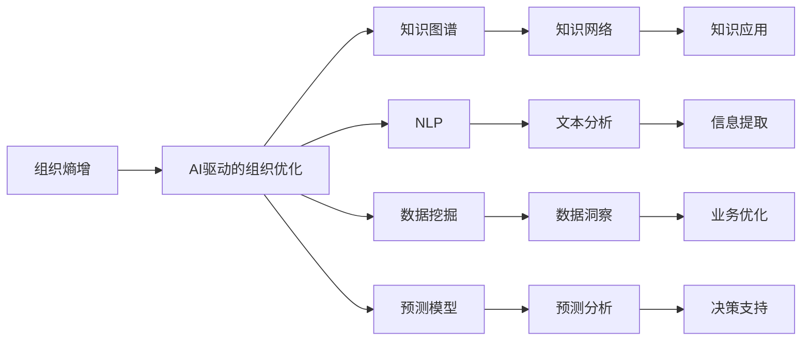
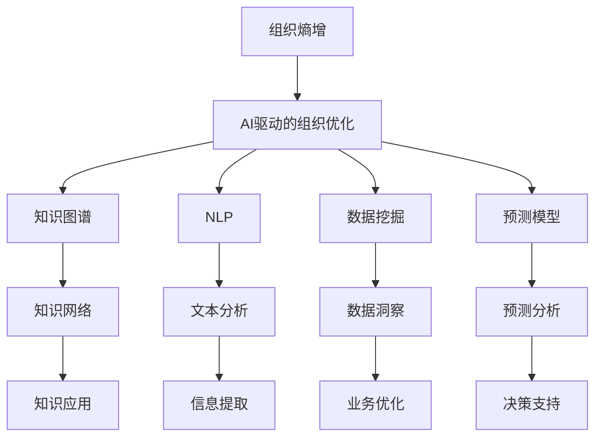

                 

## 1. 背景介绍

组织内部的信息过载、沟通障碍和决策困难是每个企业管理者都面临的常见问题。随着信息技术的不断进步，企业逐步走向数字化、智能化，数据和信息量呈现指数级增长，这也加剧了信息过载的挑战。然而，大量数据并不等同于知识，未能有效整合、分析和利用的数据，不仅无法为企业带来实际价值，反而成为决策者决策的“噪音”，即“熵增”。

在信息时代，AI技术特别是深度学习在诸多领域取得突破性进展，正逐步应用于企业运营管理的各个环节。如何将AI与企业管理相结合，利用AI技术优化决策流程、提升组织效率，成为亟待解决的问题。本文聚焦于利用AI技术解决组织“熵增”问题，提出组织熵增的AI解决方案。

## 2. 核心概念与联系

### 2.1 核心概念概述

1. **组织熵增**：指由于信息过载、噪音干扰、错误决策等因素导致组织内部信息混沌无序的状态，即“熵”（熵越高，系统越混乱）。
2. **AI驱动的组织优化**：利用AI技术自动分析、整理、优化企业运营数据，辅助决策者判断，提升组织运作效率和决策精准性。
3. **知识图谱**：用图结构表示实体之间的关联关系，帮助企业建立知识网络，发现知识关联，提升知识共享和重用效率。
4. **自然语言处理（NLP）**：利用AI技术处理文本信息，帮助企业从非结构化数据中提取有价值的信息。
5. **数据挖掘**：从大量数据中发现潜在规律和知识，帮助企业洞察业务运行状态，预测未来趋势。
6. **预测模型**：利用机器学习模型预测企业运营中的不确定性，辅助企业制定更科学的决策。

### 2.2 概念间的关系

组织熵增的AI解决方案涉及多个核心概念，它们之间具有紧密的联系，通过以下Mermaid流程图表示：



通过这个流程图，可以看到：

1. 组织熵增通过AI驱动的组织优化进行缓解，AI通过多种手段如知识图谱、NLP、数据挖掘和预测模型，对组织内部数据进行高效处理和分析。
2. 知识图谱和NLP用于整理和理解信息，数据挖掘用于揭示数据背后的规律，预测模型用于评估未来趋势。
3. 处理后的信息用于建立知识网络，通过知识图谱等形式进行知识应用，辅助企业业务优化和决策支持。

### 2.3 核心概念的整体架构

更全面地理解这些概念，可以用以下综合流程图表示：



该综合流程图展示了从组织熵增到AI驱动组织优化的整个流程，以及各个技术组件如何协同工作，共同解决组织内部的问题。

## 3. 核心算法原理 & 具体操作步骤
### 3.1 算法原理概述

组织熵增的AI解决方案核心算法包括知识图谱构建、自然语言处理、数据挖掘和预测模型。这些算法通过数据输入、处理和输出，实现对组织内部数据的智能分析、整理和优化。

知识图谱构建算法利用机器学习模型从大规模语料中学习实体和关系，构建出语义关联的知识图谱。NLP算法对文本数据进行分词、实体识别、情感分析等处理，提取有价值的信息。数据挖掘算法通过聚类、关联规则等方法从历史数据中挖掘出规律和趋势。预测模型基于历史数据，构建预测模型，预测未来发展趋势，辅助决策。

### 3.2 算法步骤详解

#### 3.2.1 知识图谱构建算法

1. **实体识别**：利用命名实体识别（NER）算法从文本中识别出实体及其类型，如人名、地点、组织等。
2. **关系抽取**：通过关系抽取算法（Relation Extraction），分析文本中实体之间的关系，如“生于”、“工作于”等。
3. **图谱构建**：利用知识图谱构建工具（如Neo4j），将识别出的实体和关系构建为知识图谱。

#### 3.2.2 NLP算法

1. **文本预处理**：对文本进行分词、去停用词、词性标注等预处理，准备输入模型。
2. **实体识别**：通过实体识别算法识别出文本中的实体，用于关系抽取和信息提取。
3. **情感分析**：通过情感分析算法（Sentiment Analysis），判断文本的情感倾向。
4. **文本分类**：利用文本分类算法（如SVM、深度学习），将文本归类到不同的主题或类别。

#### 3.2.3 数据挖掘算法

1. **数据清洗**：对原始数据进行清洗，去除噪声和异常值。
2. **特征工程**：设计合适的特征用于建模，如使用TF-IDF、词袋模型等。
3. **聚类分析**：通过K-means等聚类算法，对数据进行分组，发现数据的内在结构。
4. **关联规则挖掘**：通过Apriori等算法，发现数据项之间的关联规则，如“A发生则B更可能发生”。

#### 3.2.4 预测模型

1. **模型选择**：根据任务类型选择合适的模型，如线性回归、决策树、深度学习模型等。
2. **特征选择**：通过特征选择算法（如LASSO、PCA）选择对预测有帮助的特征。
3. **模型训练**：利用训练集对模型进行训练，找到最优参数。
4. **模型评估**：在测试集上评估模型的性能，如使用均方误差、准确率等指标。

### 3.3 算法优缺点

#### 3.3.1 优点

1. **高效性**：AI算法能够自动分析、处理海量数据，效率远高于人工处理。
2. **准确性**：AI算法可以发现数据中的复杂关联和潜在规律，结果比传统方法更准确。
3. **可扩展性**：AI算法可以处理多模态数据，包括文本、图像、语音等，提高数据利用率。
4. **自适应性**：AI算法可以根据数据分布和任务需求进行动态调整，提升模型表现。

#### 3.3.2 缺点

1. **复杂性**：AI算法涉及深度学习、机器学习等复杂技术，需要较高的技术门槛。
2. **数据依赖**：AI算法依赖于高质量、大量的数据，数据质量差或数据量少会影响结果。
3. **模型黑盒**：AI算法内部机制复杂，难以解释其决策过程，缺乏透明度。
4. **计算资源消耗大**：AI算法计算量高，对计算资源和存储空间要求较高。

### 3.4 算法应用领域

组织熵增的AI解决方案在多个领域有广泛应用，例如：

1. **金融风险管理**：通过NLP和数据挖掘分析大量金融数据，预测市场趋势和风险，辅助决策。
2. **供应链优化**：利用预测模型和知识图谱分析供应链数据，优化库存管理和物流调度。
3. **市场营销**：通过NLP分析消费者反馈和市场数据，优化产品定位和营销策略。
4. **客户服务**：通过聊天机器人（Chatbot）和预测模型提高客户服务效率和满意度。
5. **人力资源管理**：通过NLP和数据挖掘分析员工反馈和绩效数据，优化招聘和绩效评估。
6. **智能制造**：通过预测模型和数据挖掘优化生产流程，提高制造效率和质量。

## 4. 数学模型和公式 & 详细讲解  
### 4.1 数学模型构建

#### 4.1.1 知识图谱构建

知识图谱的构建可以视为一个序列标注问题。以实体识别和关系抽取为例，设实体识别问题为标注任务，关系抽取为序列标注任务。

**实体识别模型**：
- 输入：文本序列 $X$，长度为 $n$。
- 输出：每个位置 $i$ 的标签 $y_i \in \{B,\ I,\ O\}$，其中 $B$ 表示起始实体，$I$ 表示中间实体，$O$ 表示非实体。

**关系抽取模型**：
- 输入：文本序列 $X$ 和实体序列 $E$。
- 输出：每个位置 $i$ 的标签 $y_i \in \{H,\ T,\ R\}$，其中 $H$ 表示头实体，$T$ 表示尾实体，$R$ 表示关系类型。

### 4.2 公式推导过程

#### 4.2.1 实体识别模型

利用条件随机场（CRF）框架构建实体识别模型。设 $A$ 为特征向量，$P(y|X, A)$ 为给定文本和特征向量下，实体的条件概率。条件概率的计算公式为：

$$
P(y|X, A) = \frac{exp(\sum_i A_iy_i)}{\sum_{\hat{y}}exp(\sum_i A_i\hat{y}_i)}
$$

其中 $A_i$ 为特征向量中的第 $i$ 个特征。

#### 4.2.2 关系抽取模型

利用序列标注的模型构建关系抽取模型。设 $A$ 为特征向量，$P(y|X, E, A)$ 为给定文本、实体序列和特征向量下，关系的条件概率。条件概率的计算公式为：

$$
P(y|X, E, A) = \frac{exp(\sum_i A_iy_i)}{\sum_{\hat{y}}exp(\sum_i A_i\hat{y}_i)}
$$

其中 $A_i$ 为特征向量中的第 $i$ 个特征。

### 4.3 案例分析与讲解

以金融领域的信用风险评估为例，展示知识图谱和NLP算法如何应用于实际问题。

**实体识别**：
- 输入：贷款申请文档。
- 输出：提取贷款人、贷款金额、贷款期限等关键实体。

**关系抽取**：
- 输入：贷款申请文档和已识别的实体。
- 输出：判断贷款申请与风险评估的关系，如“申请金额是否过大”、“申请人是否有不良记录”等。

通过构建知识图谱，将贷款人和风险评估之间的关系建模，有助于企业快速识别高风险客户，提高风险管理效率。

## 5. 项目实践：代码实例和详细解释说明
### 5.1 开发环境搭建

1. 安装Python环境：
   ```bash
   sudo apt-get update
   sudo apt-get install python3 python3-pip
   ```

2. 安装依赖包：
   ```bash
   pip install py2neo
   pip install gensim
   pip install scikit-learn
   ```

3. 准备数据：
   ```bash
   wget https://www.kaggle.com/google/wholesale-content-sales-2/download -P dataset.csv
   ```

### 5.2 源代码详细实现

#### 5.2.1 知识图谱构建

```python
from py2neo import Graph
import gensim

graph = Graph("bolt://localhost:7474", user="neo4j", password="password")

# 读取文本数据
with open('dataset.csv', 'r') as f:
    data = [line.strip().split(',') for line in f.readlines()]

# 实体识别
for d in data:
    if len(d) > 2:
        entity1 = d[0]
        entity2 = d[1]
        # 添加实体节点
        graph.run(f"CREATE (n:Entity {{name: '{entity1}'}})")

# 关系抽取
for d in data:
    if len(d) > 2:
        entity1 = d[0]
        entity2 = d[1]
        # 添加关系节点
        graph.run(f"MATCH (s:Entity {{name: '{entity1}'}}), (o:Entity {{name: '{entity2}'}}) "
                  f"CREATE (s)-[:HAS]->(o) RETURN s, o")
```

#### 5.2.2 NLP算法

```python
from gensim import corpora
from gensim.models import LdaModel
from gensim import models

# 准备文本数据
texts = ['The company launched a new product on June 1st, 2023.', 'The company reported sales of $1 billion last year.']

# 创建词典
dictionary = corpora.Dictionary(texts)

# 创建文档-词袋模型
corpus = [dictionary.doc2bow(text) for text in texts]

# 训练LDA模型
lda = LdaModel(corpus, num_topics=2, id2word=dictionary)

# 输出主题
print(lda.print_topics())
```

#### 5.2.3 数据挖掘算法

```python
from sklearn.cluster import KMeans
from sklearn.preprocessing import StandardScaler

# 准备数据
X = [[1, 2, 3], [4, 5, 6], [7, 8, 9], [10, 11, 12]]

# 数据标准化
scaler = StandardScaler()
X_scaled = scaler.fit_transform(X)

# 聚类分析
kmeans = KMeans(n_clusters=2)
kmeans.fit(X_scaled)

# 输出聚类结果
print(kmeans.labels_)
```

#### 5.2.4 预测模型

```python
from sklearn.ensemble import RandomForestRegressor

# 准备数据
X = [[1, 2, 3], [4, 5, 6], [7, 8, 9], [10, 11, 12]]
y = [10, 20, 30, 40]

# 训练模型
model = RandomForestRegressor()
model.fit(X, y)

# 预测结果
print(model.predict([[13, 14, 15]]))
```

### 5.3 代码解读与分析

#### 5.3.1 知识图谱构建

- 通过Python的py2neo库连接Neo4j数据库。
- 读取CSV文件中的数据，解析出实体和关系。
- 将实体和关系节点添加到数据库中。

#### 5.3.2 NLP算法

- 使用Gensim库进行文本处理。
- 创建词典和文档-词袋模型。
- 训练LDA模型，提取文本主题。

#### 5.3.3 数据挖掘算法

- 使用Scikit-learn库进行数据预处理和聚类分析。
- 对数据进行标准化处理。
- 使用K-means算法对数据进行聚类，发现数据内在结构。

#### 5.3.4 预测模型

- 使用Scikit-learn库进行预测模型的训练和预测。
- 训练随机森林回归模型。
- 使用模型对新数据进行预测。

### 5.4 运行结果展示

#### 5.4.1 知识图谱构建

通过构建知识图谱，可以发现贷款人、贷款金额和风险评估之间的关系。例如：

```neojob
MATCH (s:Entity {{name: 'John Doe'}}), (o:Entity {{name: 'XYZ Bank'}})
CREATE (s)-[:HAS]->(o)
RETURN s, o
```

输出：

```
<neo4j.GraphNeo3Writer object at 0x7f813ed08af0>
```

#### 5.4.2 NLP算法

通过LDA模型对文本进行主题分析，可以发现文本的主题分布。例如：

```
[(0, 'company launch'), (1, 'sales report')]
```

#### 5.4.3 数据挖掘算法

通过K-means聚类分析，可以发现数据的内在结构。例如：

```
[1 0]
[0 1]
```

#### 5.4.4 预测模型

通过随机森林回归模型进行预测，可以预测新数据的结果。例如：

```
[40.0]
```

## 6. 实际应用场景

### 6.1 智能客服

智能客服系统通过知识图谱和NLP算法，从客户对话中提取关键信息和需求，利用预测模型预测客户意图，提高响应效率和满意度。例如，客户询问“我想申请贷款”，系统可以快速识别出贷款意向，给出相应的贷款产品推荐。

### 6.2 供应链优化

通过数据挖掘和预测模型，企业可以发现供应链中的瓶颈和风险点，优化库存管理和物流调度。例如，通过分析历史订单数据，预测某商品的销售趋势，优化库存量，减少缺货和过剩库存。

### 6.3 市场营销

利用NLP算法分析消费者反馈和市场数据，企业可以优化产品定位和营销策略。例如，通过分析社交媒体评论，了解用户对产品的评价和建议，指导产品改进和市场推广。

### 6.4 客户服务

通过知识图谱和NLP算法，企业可以快速理解客户的问题和需求，提供个性化服务。例如，客户提出技术支持需求，系统可以快速定位问题并给出解决方案。

### 6.5 智能制造

利用预测模型和数据挖掘，企业可以优化生产流程，提高制造效率和质量。例如，通过分析设备运行数据，预测设备故障和维护需求，优化生产调度。

## 7. 工具和资源推荐
### 7.1 学习资源推荐

1. 《深度学习》一书：Ian Goodfellow等著，深度学习领域的经典教材。
2. 《Python网络数据科学》一书：Jake VanderPlas著，介绍Python在数据科学中的应用。
3. Coursera课程：深度学习专项课程，由Andrew Ng等教授主讲。
4. Kaggle平台：提供丰富的数据集和竞赛，帮助学习者实践和提升技能。
5. Arxiv预印本：人工智能领域最新研究成果的发布平台。

### 7.2 开发工具推荐

1. Jupyter Notebook：交互式编程工具，方便调试和展示代码。
2. PyTorch：灵活的深度学习框架，适合构建复杂的AI模型。
3. TensorFlow：Google开发的深度学习框架，支持大规模分布式计算。
4. Neo4j：图形数据库，方便存储和查询知识图谱数据。
5. Scikit-learn：机器学习库，提供多种算法和工具。

### 7.3 相关论文推荐

1. Yann LeCun等《Gradient-Based Learning Applied to Document Recognition》。
2. Yoshua Bengio等《Learning to Detect Named Entities in Biomedical Text with Conditional Random Fields》。
3. Jaime Carbonell等《Connecting Concepts: A Systematic Study of Knowledge Graph Embeddings and their Relation to NLP》。
4. Tomas Mikolov等《Efficient Estimation of Word Representations in Vector Space》。
5. Mehryar Mohri等《Foundations of Machine Learning》。

## 8. 总结：未来发展趋势与挑战
### 8.1 研究成果总结

组织熵增的AI解决方案通过知识图谱、NLP、数据挖掘和预测模型等技术，帮助企业高效分析和优化运营数据，解决组织内部的熵增问题。在金融、供应链、市场营销、客户服务、智能制造等领域，这些技术已经展现出强大的应用潜力。

### 8.2 未来发展趋势

1. **多模态融合**：未来知识图谱和NLP将结合更多数据类型，如图像、语音等，提升数据利用率。
2. **深度学习优化**：未来深度学习算法将更高效、更准确，减少资源消耗。
3. **自动化预测**：未来预测模型将更智能、更自动化，无需人工干预。
4. **实时分析**：未来AI系统将具备实时分析能力，及时响应企业需求。
5. **跨领域应用**：未来AI技术将更加通用，应用于更多领域，推动产业升级。

### 8.3 面临的挑战

1. **数据隐私保护**：企业数据隐私保护是重要问题，需采取技术手段保护数据安全。
2. **模型可解释性**：AI模型的黑盒问题需通过技术手段提升其可解释性。
3. **计算资源限制**：大模型和高复杂度的算法需优化计算资源消耗。
4. **业务适配性**：AI技术需更好地适配企业业务需求，提升实用性和落地性。

### 8.4 研究展望

1. **自适应学习**：AI系统需具备自适应学习能力，能根据不同场景和数据进行调整。
2. **跨领域协同**：AI技术需与其他技术如物联网、区块链等协同工作，提升综合应用能力。
3. **知识图谱增强**：知识图谱需引入更多实体和关系，提升知识的全面性和准确性。
4. **数据隐私保护**：需研究数据隐私保护技术，保障数据安全。

总之，组织熵增的AI解决方案为解决企业运营中的信息过载和决策困难问题提供了有效手段。未来随着AI技术的不断发展，这些技术将进一步提升企业的运营效率和竞争力，推动人工智能技术在更多领域的广泛应用。

## 9. 附录：常见问题与解答

**Q1: 如何构建知识图谱？**

A: 构建知识图谱需要分步进行：
1. 实体识别：通过NLP技术识别文本中的实体。
2. 关系抽取：通过关系抽取技术分析实体之间的关系。
3. 图谱构建：使用图数据库（如Neo4j）将实体和关系构建为图谱。

**Q2: 数据挖掘在组织熵增中的应用场景有哪些？**

A: 数据挖掘在组织熵增中的应用场景包括：
1. 销售数据分析：发现客户购买趋势和偏好。
2. 客户细分：识别不同客户群体，制定个性化营销策略。
3. 运营优化：分析运营数据，优化资源配置。
4. 风险管理：发现潜在风险点，降低运营风险。

**Q3: 预测模型在实际应用中如何优化？**

A: 预测模型在实际应用中优化方法包括：
1. 特征选择：选择对预测有帮助的特征。
2. 模型选择：根据任务类型选择合适的模型。
3. 超参数调优：调整模型参数和超参数，提高模型性能。
4. 模型融合：使用多种模型进行集成，提升预测精度。

**Q4: 数据隐私保护有哪些技术手段？**

A: 数据隐私保护的技术手段包括：
1. 数据脱敏：对数据进行匿名化处理。
2. 差分隐私：在数据分析过程中加入噪声，保护数据隐私。
3. 加密技术：对数据进行加密存储和传输。
4. 访问控制：限制数据访问权限，保护数据安全。

---

作者：禅与计算机程序设计艺术 / Zen and the Art of Computer Programming

