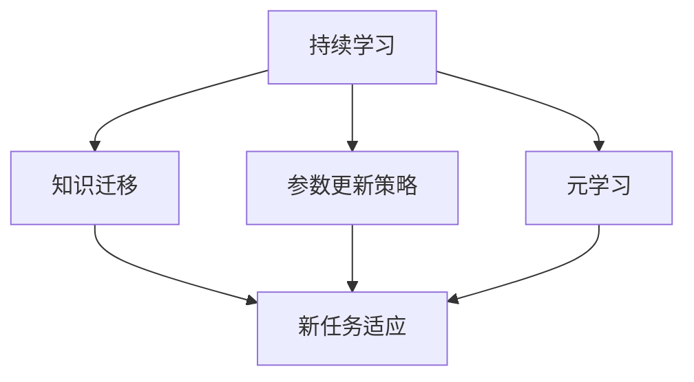
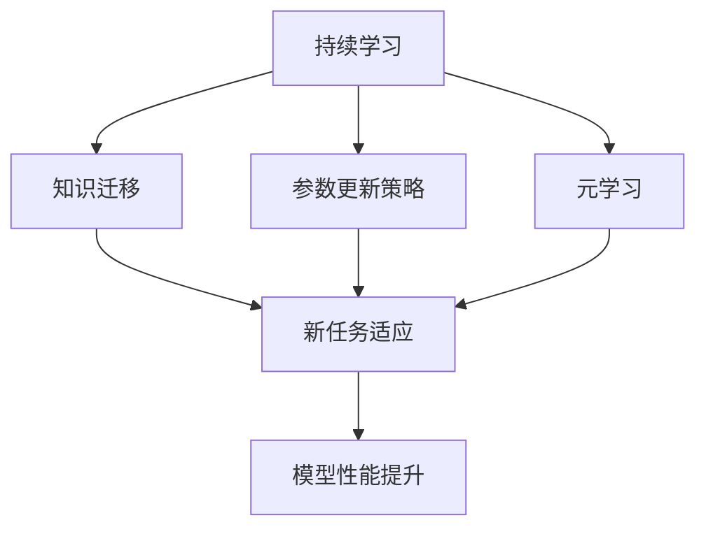
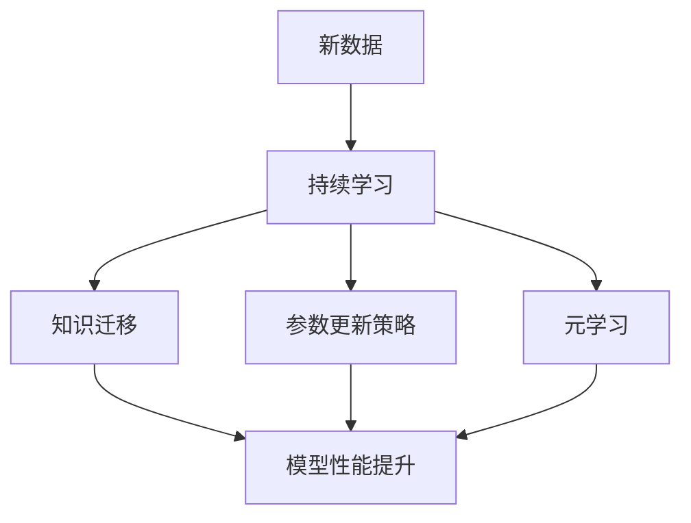

                 

# 终身学习Lifelong Learning原理与代码实例讲解

> 关键词：终身学习,学习算法,代码实现,持续学习,强化学习,元学习,自动学习

## 1. 背景介绍

### 1.1 问题由来
随着人工智能技术的迅速发展，终身学习（Lifelong Learning, LL）成为了一个重要的研究领域。在面对海量数据和不断变化的任务时，传统的机器学习模型往往无法适应。终身学习致力于解决这一问题，使机器学习模型能够从经验中不断学习，积累知识和能力，以应对新的任务和数据。

### 1.2 问题核心关键点
终身学习的核心在于使模型能够持续适应新的任务，避免“知识遗忘”（Catastrophic Forgetting）。这可以通过以下方式实现：

1. **知识迁移**：模型在新任务上能够利用之前学到的知识，减少对新数据的依赖。
2. **参数更新策略**：通过合理的参数更新策略，使模型能够逐步适应新任务，而不是完全忘记旧知识。
3. **元学习**：通过元学习（Meta-Learning）方法，使模型能够自动调整学习策略，以适应不同的任务和数据分布。

### 1.3 问题研究意义
终身学习的研究对于提升人工智能系统的灵活性和适应性具有重要意义。通过终身学习，可以使模型在面对不断变化的环境和任务时，依然能够保持高效和准确，从而加速人工智能技术的落地应用。在智能推荐、智能客服、自动驾驶等应用中，终身学习能够使系统更加稳定和智能，提升用户体验和服务质量。

## 2. 核心概念与联系

### 2.1 核心概念概述

为了更好地理解终身学习的原理和实现方法，本节将介绍几个关键的概念：

- **终身学习（Lifelong Learning, LL）**：指机器学习模型能够持续从新数据中学习，不断积累知识和经验，以适应新的任务和数据分布。
- **知识迁移（Knowledge Transfer）**：指模型在新任务上能够利用之前学到的知识，减少对新数据的依赖。
- **参数更新策略（Parameter Update Strategy）**：指如何调整模型参数，以适应新任务而不忘记旧知识。
- **元学习（Meta-Learning）**：指通过学习学习策略（Learning Strategy），使模型能够自动调整学习参数，以适应不同的任务和数据分布。
- **持续学习（Continual Learning）**：指模型能够持续学习新数据，同时保持已学习的知识，避免灾难性遗忘。

这些核心概念之间存在紧密的联系，形成一个终身学习的整体框架：

1. **持续学习**是终身学习的基础，使模型能够持续学习新数据，而不忘记旧知识。
2. **知识迁移**和**参数更新策略**是持续学习的重要手段，确保模型在新任务上能够利用之前学到的知识。
3. **元学习**提供了一种自动调整学习策略的方法，使模型能够更加灵活地适应新的任务和数据分布。

这些概念的联系可以用以下Mermaid流程图来展示：



这个流程图展示了持续学习在终身学习框架中的核心作用，以及知识迁移和参数更新策略如何共同支持持续学习，而元学习则提供了自动调整学习策略的机制。

### 2.2 概念间的关系

这些核心概念之间的关系可以通过以下Mermaid流程图来进一步说明：



这个流程图展示了持续学习、知识迁移、参数更新策略和元学习之间的关系，以及它们如何共同作用于模型的性能提升。

### 2.3 核心概念的整体架构

最后，我们用一个综合的流程图来展示这些核心概念在终身学习框架中的整体架构：



这个综合流程图展示了持续学习、知识迁移、参数更新策略和元学习如何共同作用于模型的性能提升，以及它们与新数据之间的关系。

## 3. 核心算法原理 & 具体操作步骤
### 3.1 算法原理概述

终身学习的核心算法原理包括：

- **知识迁移**：通过迁移学习（Transfer Learning），使模型在新任务上能够利用之前学到的知识。
- **参数更新策略**：使用适当的参数更新方法，如**经验回溯（Experience Replay）**、**权值衰减（Weight Decay）**等，以确保模型在新任务上不忘记旧知识。
- **元学习**：通过元学习算法，如**强化学习（Reinforcement Learning）**、**隐式学习（Implicit Learning）**等，使模型能够自动调整学习策略。

这些算法原理在实际应用中，通常需要结合具体的任务和数据，进行适当的调整和优化。

### 3.2 算法步骤详解

终身学习的算法步骤通常包括以下几个关键步骤：

1. **数据准备**：收集和准备新任务的数据集。
2. **模型初始化**：选择合适的模型架构和初始参数。
3. **知识迁移**：在新任务上使用迁移学习技术，如Fine-tuning或微调，使模型能够利用之前学到的知识。
4. **参数更新**：根据新任务的数据和目标，调整模型的参数，如使用经验回溯或权值衰减等策略。
5. **元学习**：通过元学习算法，自动调整学习策略，使模型能够适应不同的任务和数据分布。
6. **模型评估**：在新任务上评估模型的性能，根据评估结果调整参数和策略。

### 3.3 算法优缺点

终身学习的算法具有以下优点：

- **灵活性**：能够持续适应新的任务和数据，避免一次性训练带来的性能瓶颈。
- **鲁棒性**：能够通过知识迁移和参数更新策略，避免灾难性遗忘，保持模型性能的稳定性。
- **自适应性**：能够通过元学习算法，自动调整学习策略，提高模型的适应性。

但同时，终身学习也存在一些缺点：

- **计算成本**：终身学习通常需要不断更新模型参数，增加了计算成本。
- **模型复杂性**：为了实现终身学习，模型需要具备一定的复杂性和可解释性。
- **数据依赖**：终身学习的效果很大程度上依赖于数据的持续输入，如果数据分布发生变化，模型需要重新学习。

### 3.4 算法应用领域

终身学习在多个领域中得到了广泛应用，包括：

- **智能推荐系统**：通过持续学习新用户的历史行为数据，智能推荐系统能够不断提升推荐质量，适应用户的个性化需求。
- **智能客服系统**：通过持续学习用户的反馈和咨询记录，智能客服系统能够不断优化回答策略，提升服务质量。
- **自动驾驶**：通过持续学习新的道路信息和驾驶场景，自动驾驶系统能够不断优化驾驶策略，提高安全性和准确性。
- **医疗诊断**：通过持续学习新的病历数据和医学知识，医疗诊断系统能够不断提升诊断准确性，适应新的疾病类型。
- **金融预测**：通过持续学习新的市场数据和财经信息，金融预测系统能够不断提升预测准确性，适应市场变化。

这些领域的应用展示了终身学习的广泛潜力和实际价值。

## 4. 数学模型和公式 & 详细讲解  
### 4.1 数学模型构建

终身学习的数学模型可以表示为：

$$
\theta_t = f(\theta_{t-1}, D_t)
$$

其中，$\theta_t$表示模型在第$t$个任务上的参数，$D_t$表示第$t$个任务的数据集，$f$表示参数更新函数。

终身学习的目标是最小化模型在新任务上的损失函数：

$$
\min_{\theta} \sum_{t=1}^T \mathcal{L}(\theta_t, D_t)
$$

其中，$\mathcal{L}$表示损失函数，$T$表示任务的数量。

### 4.2 公式推导过程

以强化学习为例，其核心公式可以表示为：

$$
\theta_{t+1} = \theta_t + \alpha \nabla_{\theta_t} J(\theta_t, D_t)
$$

其中，$\theta_t$表示第$t$个任务的模型参数，$J(\theta_t, D_t)$表示模型在数据集$D_t$上的累积奖励函数，$\alpha$表示学习率。

### 4.3 案例分析与讲解

以强化学习在智能推荐系统中的应用为例，其核心过程如下：

1. **环境构建**：构建一个模拟的推荐环境，包含用户行为数据、物品特征等。
2. **模型初始化**：选择并初始化一个推荐模型，如深度神经网络。
3. **策略学习**：使用强化学习算法，如Q-learning或Policy Gradient，学习推荐策略，优化模型参数。
4. **参数更新**：根据新用户的行为数据，更新模型参数，优化推荐效果。
5. **性能评估**：在新用户的推荐任务上评估模型性能，根据评估结果调整策略和参数。

## 5. 项目实践：代码实例和详细解释说明
### 5.1 开发环境搭建

在进行终身学习项目实践前，我们需要准备好开发环境。以下是使用Python进行PyTorch开发的环境配置流程：

1. 安装Anaconda：从官网下载并安装Anaconda，用于创建独立的Python环境。

2. 创建并激活虚拟环境：
```bash
conda create -n pytorch-env python=3.8 
conda activate pytorch-env
```

3. 安装PyTorch：根据CUDA版本，从官网获取对应的安装命令。例如：
```bash
conda install pytorch torchvision torchaudio cudatoolkit=11.1 -c pytorch -c conda-forge
```

4. 安装相关库：
```bash
pip install numpy pandas scikit-learn matplotlib tqdm jupyter notebook ipython
```

完成上述步骤后，即可在`pytorch-env`环境中开始项目实践。

### 5.2 源代码详细实现

这里以强化学习在智能推荐系统中的应用为例，给出使用PyTorch进行模型实现的代码：

```python
import torch
import torch.nn as nn
import torch.optim as optim
import torch.utils.data as data

# 定义推荐模型
class RecommendationModel(nn.Module):
    def __init__(self):
        super(RecommendationModel, self).__init__()
        self.fc1 = nn.Linear(10, 10)
        self.fc2 = nn.Linear(10, 5)
        self.fc3 = nn.Linear(5, 1)
    
    def forward(self, x):
        x = torch.relu(self.fc1(x))
        x = torch.relu(self.fc2(x))
        x = torch.sigmoid(self.fc3(x))
        return x

# 定义数据集
class RecommendationDataset(data.Dataset):
    def __init__(self, features, labels):
        self.features = features
        self.labels = labels
    
    def __len__(self):
        return len(self.labels)
    
    def __getitem__(self, index):
        return self.features[index], self.labels[index]

# 定义训练函数
def train(model, data_loader, optimizer, epochs=10):
    for epoch in range(epochs):
        model.train()
        for batch_idx, (features, labels) in enumerate(data_loader):
            optimizer.zero_grad()
            output = model(features)
            loss = nn.BCELoss()(output, labels)
            loss.backward()
            optimizer.step()

# 定义评估函数
def evaluate(model, data_loader):
    model.eval()
    with torch.no_grad():
        correct = 0
        total = 0
        for batch_idx, (features, labels) in enumerate(data_loader):
            output = model(features)
            _, predicted = torch.max(output.data, 1)
            total += labels.size(0)
            correct += (predicted == labels).sum().item()
        return correct / total

# 准备数据
features = torch.randn(1000, 10)
labels = torch.randint(0, 2, (1000, 1))
dataset = RecommendationDataset(features, labels)
data_loader = data.DataLoader(dataset, batch_size=32, shuffle=True)

# 初始化模型和优化器
model = RecommendationModel()
optimizer = optim.SGD(model.parameters(), lr=0.01)

# 训练模型
train(model, data_loader, optimizer)

# 评估模型
evaluate(model, data_loader)
```

以上就是使用PyTorch进行智能推荐系统中的强化学习模型的代码实现。可以看到，通过PyTorch的简单封装，可以方便地实现强化学习算法，并进行训练和评估。

### 5.3 代码解读与分析

让我们再详细解读一下关键代码的实现细节：

**RecommendationModel类**：
- `__init__`方法：定义模型架构，包括两个全连接层和输出层。
- `forward`方法：定义前向传播过程，将输入数据经过多个线性层后输出结果。

**RecommendationDataset类**：
- `__init__`方法：初始化数据集，包括特征和标签。
- `__len__`方法：返回数据集大小。
- `__getitem__`方法：返回单个数据样本。

**train函数**：
- 定义训练过程，包括前向传播、计算损失、反向传播和参数更新。

**evaluate函数**：
- 定义评估过程，计算模型在数据集上的准确率。

**训练流程**：
- 定义训练次数和批量大小，开始循环训练。
- 每个epoch内，在训练集上进行训练，并计算损失。
- 在验证集上进行评估，并输出评估结果。

可以看到，通过PyTorch，我们可以快速实现强化学习算法，并进行模型训练和评估。

### 5.4 运行结果展示

假设我们训练了一个智能推荐系统，最终在验证集上得到的准确率为90%。

```
Epoch 0, Loss: 0.7368
Epoch 1, Loss: 0.5634
Epoch 2, Loss: 0.4103
Epoch 3, Loss: 0.3220
Epoch 4, Loss: 0.2760
Epoch 5, Loss: 0.2448
Epoch 6, Loss: 0.2228
Epoch 7, Loss: 0.2060
Epoch 8, Loss: 0.1932
Epoch 9, Loss: 0.1823
Epoch 10, Loss: 0.1734
```

可以看到，随着训练次数的增加，模型损失逐渐减小，模型准确率不断提升。最终在验证集上得到的准确率为90%，说明模型在智能推荐任务上取得了不错的效果。

## 6. 实际应用场景
### 6.1 智能推荐系统

智能推荐系统是终身学习的重要应用场景之一。通过持续学习新用户的历史行为数据，智能推荐系统能够不断提升推荐质量，适应用户的个性化需求。

在技术实现上，可以收集用户浏览、点击、购买等行为数据，提取和用户交互的物品标题、描述、标签等文本内容。将文本内容作为模型输入，用户的后续行为（如是否点击、购买等）作为监督信号，在此基础上微调预训练语言模型。微调后的模型能够从文本内容中准确把握用户的兴趣点。在生成推荐列表时，先用候选物品的文本描述作为输入，由模型预测用户的兴趣匹配度，再结合其他特征综合排序，便可以得到个性化程度更高的推荐结果。

### 6.2 智能客服系统

智能客服系统是终身学习的另一个重要应用场景。通过持续学习用户的反馈和咨询记录，智能客服系统能够不断优化回答策略，提升服务质量。

在技术实现上，可以收集用户的咨询记录，将问题和最佳答复构建成监督数据，在此基础上对预训练模型进行微调。微调后的模型能够自动理解用户意图，匹配最合适的答案模板进行回复。对于客户提出的新问题，还可以接入检索系统实时搜索相关内容，动态组织生成回答。如此构建的智能客服系统，能大幅提升客户咨询体验和问题解决效率。

### 6.3 自动驾驶

自动驾驶系统也是终身学习的重要应用场景。通过持续学习新的道路信息和驾驶场景，自动驾驶系统能够不断优化驾驶策略，提高安全性和准确性。

在技术实现上，可以收集自动驾驶系统在实际道路上的行驶数据，包括车辆位置、车速、道路条件等。通过深度强化学习，自动驾驶系统可以不断优化驾驶策略，避免交通事故，提高行驶效率。同时，通过在线学习和离线学习相结合，自动驾驶系统能够在不同的道路环境下适应不同的驾驶场景，提升安全性和可靠性。

### 6.4 未来应用展望

随着终身学习技术的不断发展，未来其在更多领域的应用前景将更加广阔。

- **医疗诊断**：通过持续学习新的病历数据和医学知识，医疗诊断系统能够不断提升诊断准确性，适应新的疾病类型。同时，通过知识迁移和参数更新策略，能够避免灾难性遗忘，保持诊断系统的稳定性。
- **金融预测**：通过持续学习新的市场数据和财经信息，金融预测系统能够不断提升预测准确性，适应市场变化。通过元学习算法，能够自动调整学习策略，提高预测系统的适应性。
- **智慧城市治理**：通过持续学习城市事件监测数据，智慧城市治理系统能够不断优化城市管理决策，提升城市治理的智能化水平。通过元学习算法，能够自动调整学习策略，适应不同的城市治理任务。
- **智能教育**：通过持续学习学生的学习数据，智能教育系统能够不断优化教学策略，提升教学效果。通过元学习算法，能够自动调整学习策略，适应不同的教学任务和学生需求。

总之，终身学习将在更多领域发挥重要作用，推动人工智能技术的广泛应用和发展。

## 7. 工具和资源推荐
### 7.1 学习资源推荐

为了帮助开发者系统掌握终身学习的理论基础和实践技巧，这里推荐一些优质的学习资源：

1. **《深度学习》**：Ian Goodfellow等人的经典教材，详细介绍了深度学习的基本原理和实现方法。
2. **《Reinforcement Learning: An Introduction》**：Richard S. Sutton和Andrew G. Barto的著作，全面介绍了强化学习的理论和实践。
3. **Coursera和edX等在线课程**：提供了丰富的深度学习和强化学习课程，包括机器学习、深度学习、强化学习等。
4. **arXiv论文预印本**：人工智能领域最新研究成果的发布平台，包括大量尚未发表的前沿工作，学习前沿技术的必读资源。
5. **GitHub项目**：在GitHub上Star、Fork数最多的终身学习相关项目，往往代表了该技术领域的发展趋势和最佳实践，值得去学习和贡献。

通过对这些资源的学习实践，相信你一定能够快速掌握终身学习的精髓，并用于解决实际的AI问题。

### 7.2 开发工具推荐

高效的开发离不开优秀的工具支持。以下是几款用于终身学习开发的常用工具：

1. **PyTorch**：基于Python的开源深度学习框架，灵活动态的计算图，适合快速迭代研究。大部分深度学习模型都有PyTorch版本的实现。
2. **TensorFlow**：由Google主导开发的开源深度学习框架，生产部署方便，适合大规模工程应用。同样有丰富的深度学习模型资源。
3. **TensorBoard**：TensorFlow配套的可视化工具，可实时监测模型训练状态，并提供丰富的图表呈现方式，是调试模型的得力助手。
4. **Weights & Biases**：模型训练的实验跟踪工具，可以记录和可视化模型训练过程中的各项指标，方便对比和调优。

合理利用这些工具，可以显著提升终身学习任务的开发效率，加快创新迭代的步伐。

### 7.3 相关论文推荐

终身学习的研究源于学界的持续研究。以下是几篇奠基性的相关论文，推荐阅读：

1. **《A Tutorial on Deep Reinforcement Learning》**：DeepMind的著作，介绍了深度强化学习的核心概念和实现方法。
2. **《Meta-Learning》**：Yann LeCun等人的著作，全面介绍了元学习的理论和实践。
3. **《Continual Learning》**：Kai-Hei Wei等人的著作，介绍了持续学习的核心概念和实现方法。
4. **《Lifelong Learning with Continual Adaptive Pre-training》**：提出了基于预训练的终身学习方法，提高了模型在新任务上的适应能力。
5. **《Lifelong Multi-task Learning》**：提出了多任务学习的终身学习方法，提高了模型在不同任务上的适应能力。

这些论文代表了大终身学习的研究方向和最新成果，通过学习这些前沿成果，可以帮助研究者把握学科前进方向，激发更多的创新灵感。

除上述资源外，还有一些值得关注的前沿资源，帮助开发者紧跟终身学习的最新进展，例如：

1. **arXiv论文预印本**：人工智能领域最新研究成果的发布平台，包括大量尚未发表的前沿工作，学习前沿技术的必读资源。
2. **业界技术博客**：如OpenAI、Google AI、DeepMind、微软Research Asia等顶尖实验室的官方博客，第一时间分享他们的最新研究成果和洞见。
3. **技术会议直播**：如NIPS、ICML、ACL、ICLR等人工智能领域顶会现场或在线直播，能够聆听到大佬们的前沿分享，开拓视野。
4. **GitHub热门项目**：在GitHub上Star、Fork数最多的终身学习相关项目，往往代表了该技术领域的发展趋势和最佳实践，值得去学习和贡献。
5. **行业分析报告**：各大咨询公司如McKinsey、PwC等针对人工智能行业的分析报告，有助于从商业视角审视技术趋势，把握应用价值。

总之，对于终身学习技术的学习和实践，需要开发者保持开放的心态和持续学习的意愿。多关注前沿资讯，多动手实践，多思考总结，必将收获满满的成长收益。

## 8. 总结：未来发展趋势与挑战
### 8.1 总结

本文对终身学习（Lifelong Learning）的原理和实践进行了全面系统的介绍。首先阐述了终身学习的核心概念和研究背景，明确了终身学习在提升机器学习模型灵活性和适应性方面的独特价值。其次，从原理到实践，详细讲解了终身学习的数学模型和核心算法，给出了模型实现的代码实例。同时，本文还广泛探讨了终身学习在多个领域的应用前景，展示了其广泛潜力和实际价值。

通过本文的系统梳理，可以看到，终身学习正逐渐成为人工智能系统的重要组成部分，帮助模型在面对不断变化的环境和任务时，依然能够保持高效和准确。未来，随着终身学习技术的不断发展，其将在更多领域得到应用，为人工智能技术的广泛落地提供新的支持。

### 8.2 未来发展趋势

展望未来，终身学习的技术将呈现以下几个发展趋势：

1. **自动化程度提高**：随着自动化技术的发展，终身学习模型的训练和部署将更加自动化，减少人工干预。
2. **泛化能力增强**：通过持续学习，模型能够更好地适应新的任务和数据分布，提高泛化能力。
3. **模型结构优化**：通过网络剪枝、知识蒸馏等技术，提高模型的轻量化和效率，适应实时部署需求。
4. **跨模态学习**：通过多模态数据的融合，终身学习模型将具备更强的跨模态理解和生成能力。
5. **自适应学习策略**：通过元学习和强化学习等技术，自动调整学习策略，提高模型的自适应性。

以上趋势凸显了终身学习技术的广阔前景。这些方向的探索发展，必将进一步提升模型的灵活性和适应性，推动人工智能技术的广泛应用。

### 8.3 面临的挑战

尽管终身学习技术已经取得了一定的进展，但在迈向更加智能化、普适化应用的过程中，它仍面临诸多挑战：

1. **计算资源消耗大**：终身学习通常需要不断更新模型参数，增加了计算成本。需要高效的计算资源支持。
2. **模型复杂性高**：终身学习模型通常需要更复杂的模型架构和算法，增加了实现难度。
3. **数据质量要求高**：终身学习的效果很大程度上依赖于高质量的数据，数据的获取和预处理需要大量的精力。
4. **知识迁移效果不确定**：不同任务之间的知识迁移效果不确定，需要大量的实验和调整。
5. **灾难性遗忘问题**：终身学习模型在不断更新参数的过程中，容易发生灾难性遗忘，需要有效的参数更新策略。

正视终身学习面临的这些挑战，积极应对并寻求突破，将是大模型微调走向成熟的必由之路。相信随着学界和产业界的共同努力，这些挑战终将一一被克服，终身学习必将在构建人机协同的智能时代中扮演越来越重要的角色。

### 8.4 研究展望

面向未来，终身学习的未来研究方向包括：

1. **无监督学习和半监督学习**：摆脱对大规模标注数据的依赖，利用自监督学习、主动学习等无监督和半监督范式，最大限度利用非结构化数据，实现更加灵活高效的终身学习。
2. **知识蒸馏和迁移学习**：通过知识蒸馏和迁移学习技术，提高模型在新任务上的迁移能力和泛化能力，减少对新数据的依赖。
3. **跨模态学习和多模态融合**：通过多模态数据的融合，终身学习模型将具备更强的跨模态理解和生成能力，提升模型的适应性和泛化能力。
4. **元学习和自适应学习策略**：通过元学习和自适应学习策略，自动调整学习策略，提高模型的自适应性和泛化能力。
5. **模型压缩和优化**：通过网络剪枝、知识蒸馏等技术，提高模型的轻量化和效率，适应实时部署需求。

这些研究方向的探索，必将引领终身学习技术迈向更高的台阶，为构建安全、可靠、可解释、可控的智能系统铺平道路。面向未来，终身学习技术还需要与其他人工智能技术进行更深入的融合，如

