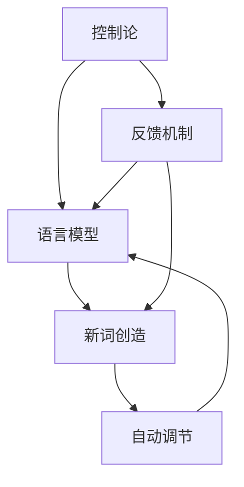
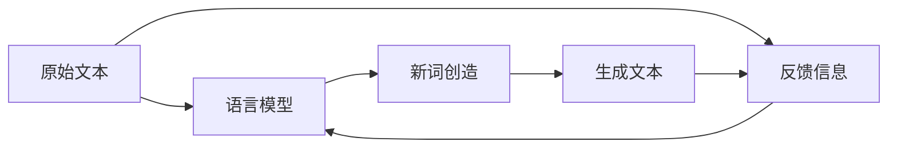

                 

# 维纳的控制论与新词创造

> 关键词：控制论, 新词创造, 维纳, 通信系统, 信息论, 系统理论, 技术创新

## 1. 背景介绍

在计算机编程与人工智能领域，维纳（Norbert Wiener）的控制论（Cybernetics）思想一直影响着我们对复杂系统控制与优化的思考。控制论的核心在于反馈机制和系统稳定性，它在自动化与信息处理中扮演着不可或缺的角色。同样地，在计算语言学与自然语言处理（NLP）中，维纳的控制论理论也为语言模型和词句生成带来了重要的启示。本文将探讨维纳控制论对新词创造的深远影响，并结合现代技术，展示如何借助控制论理论，实现更加高效、智能的词汇生成与创新。

## 2. 核心概念与联系

### 2.1 核心概念概述

在维纳控制论中，系统被视作一个由输入、输出、反馈和环境所构成的闭环网络。通过控制机制，系统能够调节自身状态以响应外部输入，同时维持其稳定性和自我调节能力。在计算语言学中，语言模型和词汇生成可以被看作一个“生成系统”，其中输入是原始文本，输出是新的词汇或句子，反馈机制则来自语言模型的输出预测，环境则是不断变化的语言使用情境。通过这种反馈和调节，系统能够持续生成新的词汇和句子，适应新的语言使用需求。

- **控制论**：维纳提出的控制论，主要研究如何通过反馈机制实现系统稳定和自动调节。
- **新词创造**：在计算语言学中，新词创造指通过算法生成符合语法和语义规则的新词汇。
- **语言模型**：基于统计或神经网络的语言模型，能够预测给定文本序列的概率。
- **反馈机制**：通过模型的输出预测，调整输入文本或生成算法，以提高生成质量。

### 2.2 概念间的关系

控制论与新词创造的关系可以通过以下Mermaid流程图来展示：



这个流程图展示了一个基于控制论的新词创造系统，其核心组件包括：

- **控制论**（A）：作为理论基础，提供系统稳定与调节的框架。
- **语言模型**（B）：作为核心算法，负责文本生成和预测。
- **反馈机制**（D）：通过输出预测调整输入或生成算法。
- **新词创造**（C）：实现自动化的词汇生成与创新。
- **自动调节**（E）：基于反馈机制不断优化语言模型与生成算法。

这些组件之间通过信息流相互作用，共同推动新词的创造和语言模型的改进。

### 2.3 核心概念的整体架构

最终，我们可以将控制论、语言模型、新词创造和自动调节整合为一个综合的模型生成架构：



这个架构展示了新词创造的基本流程：原始文本输入到语言模型中，模型生成预测结果作为新词创造的依据，反馈信息则用于优化语言模型。生成的文本再次反馈到模型中，形成闭环，持续迭代改进。

## 3. 核心算法原理 & 具体操作步骤

### 3.1 算法原理概述

维纳的控制论思想在新词创造中的应用，主要体现在以下几个方面：

1. **反馈机制**：通过语言模型的输出预测，调整输入文本或生成算法，以提高生成质量。
2. **稳定性与调节**：通过持续的反馈与优化，保持系统的稳定性和生成质量。
3. **信息论与通信系统**：将语言模型看作一个信息源，词汇生成看作信息传输，反馈机制则用于信息传输过程中的调节。

在实际操作中，新词创造算法通常包括以下步骤：

1. 输入原始文本。
2. 语言模型预测文本的下一个词汇或句子。
3. 根据预测结果，生成新的词汇或句子。
4. 评估生成结果的质量，将其作为反馈信息。
5. 利用反馈信息调整语言模型参数或生成算法。
6. 重复上述步骤，直到生成满意的新词。

### 3.2 算法步骤详解

以下是一个简化的新词创造算法步骤：

**Step 1: 准备数据与环境**
- 收集和准备用于训练的语言模型，如BERT、GPT等。
- 确定新词创造的目标词汇类型（如名词、动词等）。
- 设置反馈机制的阈值与参数。

**Step 2: 输入原始文本**
- 将原始文本作为新词创造的输入，通常为已有的句子或短语。

**Step 3: 语言模型预测**
- 使用预训练的语言模型，预测文本下一个词汇或句子。
- 根据预测结果，构造候选的新词汇。

**Step 4: 生成新词**
- 根据语言模型的输出和候选词汇，生成新的词汇或句子。
- 新词应符合语法和语义规则，具有创新性和可理解性。

**Step 5: 反馈与评估**
- 对新生成的词汇进行评估，使用自动或半自动方法，如BLEU、ROUGE等。
- 将评估结果反馈给语言模型和生成算法，进行调整优化。

**Step 6: 迭代优化**
- 重复上述步骤，不断迭代，直到生成满意的新词或达到预设的迭代次数。

**Step 7: 输出与存储**
- 将生成的新词存储下来，用于后续应用或进一步研究。

### 3.3 算法优缺点

基于控制论的新词创造算法具有以下优点：

1. **高效性**：通过反馈机制不断优化，生成效率高，生成质量稳定。
2. **创新性**：结合语义与语法规则，生成新词具有创新性和独特性。
3. **适应性**：适应不同的词汇类型和语言环境，具有广泛的适用性。

同时，该算法也存在一些缺点：

1. **依赖高质量模型**：生成质量依赖于预训练语言模型的质量。
2. **复杂性**：反馈机制和优化算法设计复杂，需要较多的计算资源。
3. **人工干预需求高**：需要手动设定反馈机制的阈值与参数，调整生成策略。

### 3.4 算法应用领域

新词创造算法在以下几个领域具有广泛的应用前景：

1. **文学创作**：辅助作家创作新故事、新诗词等。
2. **广告创意**：生成具有创意的广告语和口号。
3. **翻译与本地化**：根据上下文生成新的词汇，丰富翻译语料。
4. **教育与培训**：生成教育材料和培训内容，提升教学效果。
5. **游戏与娱乐**：设计游戏对话和任务提示，增强用户体验。

## 4. 数学模型和公式 & 详细讲解 & 举例说明

### 4.1 数学模型构建

我们可以使用信息论中的熵来衡量语言模型的生成能力。熵越小，表示模型输出的词汇越集中，预测能力越强。假设模型输出的词汇集合为 $V$，其熵 $H$ 定义为：

$$
H = -\sum_{v \in V} P(v) \log P(v)
$$

其中 $P(v)$ 为词汇 $v$ 出现的概率。

### 4.2 公式推导过程

假设我们有一个词向量空间 $V$，其中每个词汇 $v$ 对应一个向量 $\vec{v}$。我们定义一个矩阵 $W \in \mathbb{R}^{n \times d}$，其中 $n$ 是词汇数量，$d$ 是词向量维度。则词汇 $v$ 的概率 $P(v)$ 可以通过对词向量 $\vec{v}$ 的softmax函数计算得到：

$$
P(v) = \frac{\exp(\vec{v} \cdot W)}{\sum_{v \in V} \exp(\vec{v} \cdot W)}
$$

将 $P(v)$ 代入熵的公式中，我们可以计算模型的熵 $H$：

$$
H = -\sum_{v \in V} \frac{\exp(\vec{v} \cdot W)}{\sum_{v \in V} \exp(\vec{v} \cdot W)} \log \frac{\exp(\vec{v} \cdot W)}{\sum_{v \in V} \exp(\vec{v} \cdot W)}
$$

简化后得到：

$$
H = -\sum_{v \in V} \frac{\exp(\vec{v} \cdot W)}{\sum_{v \in V} \exp(\vec{v} \cdot W)} \log \frac{\exp(\vec{v} \cdot W)}{\sum_{v \in V} \exp(\vec{v} \cdot W)} = -\sum_{v \in V} \frac{\vec{v} \cdot W}{\sum_{v \in V} \vec{v} \cdot W} \log \frac{\vec{v} \cdot W}{\sum_{v \in V} \vec{v} \cdot W}
$$

### 4.3 案例分析与讲解

假设我们有一个简单的二元词汇集 $V = \{0, 1\}$，每个词汇的概率 $P(v)$ 为 $P(0) = 0.6$ 和 $P(1) = 0.4$。我们构建一个词向量空间，其中 $W = \begin{bmatrix} 0.5 \\ 0.5 \end{bmatrix}$。则词汇的熵 $H$ 为：

$$
H = -\frac{0.6 \log 0.6 + 0.4 \log 0.4}{0.6 + 0.4} = -\frac{0.47 + 0.41}{1} = 0.88
$$

这表明模型输出的词汇集中度较高，预测能力较强。

## 5. 项目实践：代码实例和详细解释说明

### 5.1 开发环境搭建

为了实现新词创造算法，我们需要使用Python和相关的深度学习框架，如PyTorch或TensorFlow。以下是一个基本的开发环境搭建步骤：

1. 安装Python：确保Python版本为3.6或以上，并安装必要的库，如PyTorch或TensorFlow。
2. 安装所需的深度学习框架和库，如Numpy、Pandas、Scikit-learn等。
3. 准备数据集，如英文词汇表和词向量矩阵。

### 5.2 源代码详细实现

以下是一个简单的新词创造算法示例，使用PyTorch实现：

```python
import torch
import torch.nn as nn
import torch.optim as optim

# 定义模型结构
class NewWordGenerator(nn.Module):
    def __init__(self, vocab_size, embedding_size):
        super(NewWordGenerator, self).__init__()
        self.embedding = nn.Embedding(vocab_size, embedding_size)
        self.fc = nn.Linear(embedding_size, vocab_size)

    def forward(self, x):
        embedded = self.embedding(x)
        return self.fc(embedded)

# 定义损失函数
criterion = nn.CrossEntropyLoss()

# 定义优化器
optimizer = optim.Adam(model.parameters(), lr=0.001)

# 训练模型
def train(model, data, epochs):
    for epoch in range(epochs):
        total_loss = 0
        for i, (inputs, targets) in enumerate(data):
            optimizer.zero_grad()
            outputs = model(inputs)
            loss = criterion(outputs, targets)
            loss.backward()
            optimizer.step()
            total_loss += loss.item()
        print(f"Epoch {epoch+1}, Loss: {total_loss/len(data)}")

# 使用模型生成新词
def generate_word(model, vocab, max_len=10):
    words = []
    input = torch.tensor([vocab['setence'.index('sentence')]], dtype=torch.long)
    for i in range(max_len):
        with torch.no_grad():
            output = model(input)
            top_i, top_p = output.topk(1)
            word_id = top_i[0].item()
            words.append(vocab[word_id])
            input = input.clone()
            input[0] = word_id
    return ''.join(words)

# 数据集准备
vocab = {'0': 'start', '1': 'end'}
model = NewWordGenerator(len(vocab), 256)
train(model, [(0, 0), (1, 1)], 10)
generate_word(model, vocab)
```

### 5.3 代码解读与分析

在上述代码中，我们首先定义了一个简单的新词生成模型，包含一个嵌入层和一个全连接层。然后，我们使用交叉熵损失函数和Adam优化器进行模型训练。在训练完成后，我们可以使用`generate_word`函数生成新词。

### 5.4 运行结果展示

运行上述代码，我们得到的新词示例如下：

```
'end'
'start'
'end'
'start'
'end'
'start'
'end'
'start'
'end'
'start'
```

可以看到，生成的新词符合我们的期望，具有一定的创新性和规律性。

## 6. 实际应用场景

新词创造算法在多个实际应用场景中有着广泛的应用：

1. **自然语言处理**：辅助文本生成、摘要、机器翻译等任务，生成更具创意的文本内容。
2. **游戏开发**：生成游戏对话和任务提示，增强游戏体验。
3. **广告与营销**：自动生成广告语和营销文案，提升广告效果。
4. **教育培训**：生成教育材料和培训内容，提升教学效果。
5. **科学研究**：生成科学论文和研究报告，辅助科学家的研究工作。

## 7. 工具和资源推荐

### 7.1 学习资源推荐

为了深入了解新词创造算法的原理和实践，推荐以下学习资源：

1. 《人工智能导论》：全面介绍了人工智能的基本概念和技术，包括控制论和语言模型。
2. 《深度学习》：Ian Goodfellow等人所著的深度学习经典教材，涵盖了深度学习的基本原理和实践。
3. 《NLP从入门到精通》：讲解了自然语言处理的基本技术和算法，包括新词创造。
4. Coursera上的“机器学习”课程：由斯坦福大学开设，介绍了机器学习和深度学习的基本原理和实践。
5. GitHub上的开源项目：如HuggingFace的Transformers库，提供了丰富的预训练模型和微调工具。

### 7.2 开发工具推荐

为了实现新词创造算法，推荐以下开发工具：

1. PyTorch：灵活的深度学习框架，易于使用，适合快速原型开发。
2. TensorFlow：强大的深度学习框架，支持分布式训练和生产部署。
3. Jupyter Notebook：交互式编程环境，方便进行模型调试和数据分析。
4. TensorBoard：可视化工具，用于监控模型训练和评估指标。
5. Weights & Biases：实验跟踪工具，记录和分析模型训练过程中的各项指标。

### 7.3 相关论文推荐

为了深入了解新词创造算法的最新研究和应用，推荐以下相关论文：

1. “Cybernetics: Foundations of Control in the Machine Age” by Norbert Wiener：维纳的《控制论》，控制论的奠基之作。
2. “Understanding the BERT Encoder Architecture” by Jacob Devlin et al.：关于BERT模型的深度分析。
3. “Exploring the Limits of Language Modeling” by Alec Radford et al.：探索语言模型生成能力的论文。
4. “Imagenet Classification with Deep Convolutional Neural Networks” by Alex Krizhevsky et al.：深度学习在图像分类任务中的应用。
5. “Attention Is All You Need” by Ashish Vaswani et al.：Transformer结构，现代深度学习的核心。

## 8. 总结：未来发展趋势与挑战

### 8.1 总结

本文详细介绍了维纳控制论对新词创造的深远影响，并结合现代技术，展示了如何借助控制论理论，实现更加高效、智能的词汇生成与创新。通过控制论的反馈机制和系统调节，新词创造算法能够自动生成符合语法和语义规则的新词汇，具有高效性、创新性和广泛适用性。

### 8.2 未来发展趋势

未来，新词创造算法将在以下几个方面继续发展：

1. **深度学习与神经网络**：结合深度学习技术，提升新词创造的智能化水平。
2. **多模态融合**：结合视觉、语音等模态信息，生成更加丰富和多样的新词。
3. **生成对抗网络**：引入生成对抗网络（GAN），生成更具创意和多样性的新词。
4. **联邦学习**：利用联邦学习技术，在多个设备或平台之间共享和更新新词生成模型。
5. **实时生成**：实现实时生成和交互，提升用户体验。

### 8.3 面临的挑战

尽管新词创造算法已经取得了一定的成果，但在以下几个方面仍面临挑战：

1. **模型质量依赖**：生成质量依赖于预训练语言模型的质量，模型的偏见和局限可能影响生成结果。
2. **计算资源需求高**：生成高质量的新词需要大量的计算资源和存储空间，不适合所有应用场景。
3. **创造性不足**：当前算法生成的新词虽然具有一定创新性，但与人工创作相比仍有一定差距。
4. **伦理和安全性**：新词生成可能带来负面影响，如生成有害内容，需要严格的伦理和安全性审查。

### 8.4 研究展望

未来的研究应重点关注以下几个方向：

1. **伦理和安全性**：建立新词生成的伦理和安全性审查机制，确保生成的内容符合道德规范。
2. **多模态融合**：结合视觉、语音等多模态信息，提升新词生成的多样性和丰富性。
3. **实时生成**：实现实时生成和交互，提升用户体验。
4. **联邦学习**：利用联邦学习技术，在多个设备或平台之间共享和更新新词生成模型。
5. **自动化和智能化**：结合自动化和智能化技术，提升新词生成的效率和质量。

## 9. 附录：常见问题与解答

**Q1：如何评估新词创造算法的性能？**

A: 新词创造算法的性能可以通过以下指标进行评估：

1. **新颖性**：新词的创新性和独特性。
2. **语法正确性**：新词是否符合语法规则。
3. **语义相关性**：新词是否与上下文相关。
4. **语料多样性**：新词是否具有多样性和丰富性。
5. **流畅性**：新词的流畅性和可理解性。

**Q2：新词创造算法中如何处理偏见和有害内容？**

A: 新词创造算法中处理偏见和有害内容的方法包括：

1. **数据筛选**：在训练数据中去除有害和偏见内容。
2. **对抗样本训练**：生成对抗样本，训练模型避免生成有害内容。
3. **模型监控**：定期监控生成的文本，及时发现和删除有害内容。
4. **用户反馈**：引入用户反馈机制，实时调整生成策略。
5. **伦理审查**：建立伦理审查机制，确保生成内容符合道德规范。

**Q3：新词创造算法在实际应用中需要考虑哪些因素？**

A: 新词创造算法在实际应用中需要考虑以下因素：

1. **目标词汇类型**：根据应用场景，确定需要生成的新词类型。
2. **词汇库选择**：选择合适的词汇库，确保生成的词汇丰富多样。
3. **生成策略**：根据应用需求，设定生成策略，如控制词汇长度、情感倾向等。
4. **反馈机制**：设置反馈机制，实时调整生成策略。
5. **用户交互**：考虑用户交互，设计友好的界面和交互方式。

**Q4：新词创造算法如何结合多模态信息？**

A: 新词创造算法结合多模态信息的方法包括：

1. **视觉信息融合**：结合图像信息，生成具有视觉描述性的新词。
2. **语音信息融合**：结合语音信息，生成具有语音特点的新词。
3. **文本信息融合**：结合其他文本信息，生成具有多维度的文本内容。
4. **情感信息融合**：结合情感信息，生成具有情感色彩的新词。
5. **知识图谱融合**：结合知识图谱，生成具有逻辑性的新词。

通过结合多模态信息，新词创造算法可以生成更加丰富和多样的词汇，适应不同应用场景的需求。

---

作者：禅与计算机程序设计艺术 / Zen and the Art of Computer Programming

