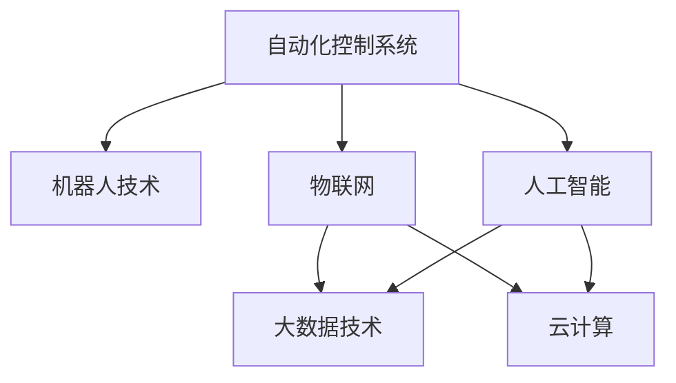

                 

# 自动化技术的发展与应用

自动化技术作为工业化和信息化的重要驱动力，已经成为推动人类社会进步的关键力量。自动化不仅在制造业、服务业等领域发挥着重要作用，也在农业、医疗、教育等诸多领域得到了广泛应用。本文将深入探讨自动化技术的发展历程、核心概念与联系，以及其在不同领域的具体应用和未来展望。

## 1. 背景介绍

### 1.1 自动化技术的概念与发展历程

自动化技术是指利用计算机、控制系统和传感器等技术，使机器能够模拟人类行为，实现对生产、管理等过程的自动控制。自动化技术的发展经历了几个重要阶段：

- **机械自动化**：早期的自动化主要通过机械装置实现简单重复的操作，如纺织机械、电梯等。
- **电气自动化**：20世纪初，电气技术的引入使得自动化技术能够控制更加复杂的机械系统，如自动流水线、工业机器人等。
- **计算机自动化**：20世纪50年代以后，计算机技术的突破为自动化技术提供了强有力的支持，使得复杂的控制过程能够通过编程实现。
- **智能自动化**：21世纪以来，人工智能、大数据、物联网等技术的发展，推动了自动化技术向智能化的方向迈进。

### 1.2 自动化技术的应用领域

自动化技术已经广泛应用于工业生产、农业生产、物流运输、医疗健康、智慧城市等各个领域，具体应用如下：

- **工业自动化**：通过自动化生产线、智能制造系统等，实现生产过程的自动化控制，提高生产效率和产品质量。
- **农业自动化**：利用自动化灌溉、精准农业、农机自动化等技术，提高农业生产效率，保障食品安全。
- **物流自动化**：采用自动化仓储、智能分拣、无人机配送等技术，提升物流效率和客户体验。
- **医疗自动化**：通过自动化影像诊断、智能医疗机器人、健康监测设备等，提高医疗服务质量和效率。
- **智慧城市**：利用物联网、大数据、人工智能等技术，实现城市管理的自动化、智能化，提升城市运行效率和服务水平。

## 2. 核心概念与联系

### 2.1 核心概念概述

为了更好地理解自动化技术，本节将介绍几个核心概念及其相互关系：

- **自动化控制系统**：由控制器、执行器、传感器等组成的系统，用于实现对生产过程的自动控制。
- **机器人技术**：结合机械、电气、计算机技术，实现自主操作和决策的智能设备。
- **物联网(IoT)**：通过互联网连接传感器、设备等，实现信息采集、传输和处理，形成智能互联系统。
- **人工智能(AI)**：利用算法和模型，实现对数据的分析、推理和决策，支持自动化系统的高智能应用。
- **大数据技术**：通过数据采集、存储、分析和可视化，支持自动化系统的智能决策和优化。
- **云计算**：通过网络资源池化，提供按需、弹性的计算和存储服务，支持大规模自动化系统的运行和协作。

### 2.2 核心概念之间的关系

这些核心概念通过自动化技术实现了有机结合，形成了一个完整的技术生态系统。以下是一个简化的Mermaid流程图，展示了它们之间的关系：



这个流程图展示了自动化控制系统、机器人技术、物联网、人工智能、大数据技术和云计算之间的相互关系：

1. 自动化控制系统是基础，通过传感器、控制器等实现对生产过程的自动控制。
2. 机器人技术结合了机械、电气、计算机技术，能够实现自主操作和决策。
3. 物联网通过互联网连接传感器、设备等，实现了信息的采集、传输和处理。
4. 人工智能利用算法和模型，实现了对数据的分析、推理和决策。
5. 大数据技术通过数据采集、存储、分析和可视化，支持了智能决策和优化。
6. 云计算通过网络资源池化，提供了按需、弹性的计算和存储服务。

这些概念相互配合，形成了自动化技术的完整技术体系，支撑了其广泛的应用和不断的发展。

## 3. 核心算法原理 & 具体操作步骤

### 3.1 算法原理概述

自动化技术涉及多种算法和模型，其中最为核心的是基于计算机视觉、自然语言处理和控制理论的算法。

- **计算机视觉算法**：用于图像识别、物体检测、场景理解等，通过深度学习等技术，实现对视觉信息的自动分析。
- **自然语言处理算法**：用于文本分析、语音识别、对话系统等，通过深度学习、规则推理等技术，实现对语言信息的自动处理。
- **控制理论算法**：用于自动化控制系统、机器人技术等，通过状态空间模型、PID控制等技术，实现对复杂系统的自动控制。

### 3.2 算法步骤详解

自动化技术的操作过程一般分为以下几个步骤：

1. **数据采集**：通过传感器、摄像头等设备采集生产、环境、设备等数据。
2. **数据处理**：对采集到的数据进行预处理、清洗、特征提取等，为后续分析提供准备。
3. **信息分析**：利用计算机视觉、自然语言处理等技术，对采集到的信息进行分析和处理。
4. **决策和控制**：根据分析结果，通过控制理论算法，实现对生产、机器人等系统的自动控制。
5. **反馈和优化**：根据系统反馈，调整算法和控制策略，进行持续优化。

### 3.3 算法优缺点

自动化技术具有以下优点：

- **提高效率**：通过自动化技术，可以实现生产、管理过程的自动化控制，提高效率和生产力。
- **降低成本**：自动化技术可以减少人工操作和错误，降低生产、管理成本。
- **提升质量**：通过精确控制和自动化检测，提高产品质量和一致性。

同时，自动化技术也存在以下缺点：

- **初始投入高**：自动化系统的初始建设需要较高的成本和技术投入。
- **技术复杂**：自动化系统涉及多种技术，需要专业人才进行开发和维护。
- **灵活性不足**：自动化系统一旦部署，难以灵活调整和适应新的需求。

### 3.4 算法应用领域

自动化技术在不同领域的应用非常广泛，具体包括：

- **智能制造**：通过自动化生产线、智能工厂等技术，实现生产过程的自动化控制，提高生产效率和质量。
- **智能农业**：利用自动化灌溉、精准农业、农机自动化等技术，提高农业生产效率和质量。
- **智能物流**：采用自动化仓储、智能分拣、无人机配送等技术，提升物流效率和客户体验。
- **智能医疗**：通过自动化影像诊断、智能医疗机器人、健康监测设备等，提高医疗服务质量和效率。
- **智能交通**：采用自动驾驶、智能交通管理等技术，提高交通安全和交通效率。

## 4. 数学模型和公式 & 详细讲解 & 举例说明

### 4.1 数学模型构建

自动化技术的核心算法通常涉及多种数学模型和公式，以下以智能制造为例，简要介绍其数学模型构建过程：

- **状态空间模型**：用于描述自动化系统中的状态变量和控制变量，通过状态转移矩阵等技术，实现对系统状态的预测和控制。
- **PID控制算法**：用于控制自动化系统的输出变量，通过比例、积分、微分等技术，实现对系统输出的精确控制。
- **机器学习模型**：用于数据驱动的自动化决策，通过训练模型，实现对输入数据的分析和预测。

### 4.2 公式推导过程

以下是智能制造中常用的状态空间模型和PID控制算法的公式推导：

**状态空间模型**：

设系统状态向量为 $x_t = [x_{t1}, x_{t2}, \dots, x_{tn}]$，系统控制输入为 $u_t$，系统输出为 $y_t$。则状态空间模型的描述如下：

$$
\dot{x}_t = Ax_t + Bu_t
$$

$$
y_t = Cx_t + Du_t
$$

其中，$A$ 为状态矩阵，$B$ 为控制矩阵，$C$ 为输出矩阵，$D$ 为直接传递矩阵。

**PID控制算法**：

PID控制算法的基本思想是通过比例、积分、微分三种控制方式，实现对系统输出的精确控制。其控制方程如下：

$$
u_t = K_p e_t + K_i \int e_t dt + K_d \frac{de_t}{dt}
$$

其中，$e_t = y_t - y_{t-1}$ 为误差信号，$K_p$、$K_i$、$K_d$ 分别为比例、积分、微分系数。

### 4.3 案例分析与讲解

以智能制造中的自动化生产线为例，我们可以使用状态空间模型和PID控制算法，实现对生产过程的自动控制。具体实现步骤如下：

1. **状态空间模型设计**：根据生产过程的特点，设计系统状态矩阵 $A$、控制矩阵 $B$、输出矩阵 $C$ 和直接传递矩阵 $D$。
2. **PID控制器设计**：根据生产线的需求，设计比例系数 $K_p$、积分系数 $K_i$ 和微分系数 $K_d$。
3. **系统仿真和调整**：通过仿真实验，调整控制系数，优化系统控制效果。
4. **实际部署和反馈优化**：将控制模型应用于实际生产线，根据系统反馈，进一步调整和优化控制策略。

## 5. 项目实践：代码实例和详细解释说明

### 5.1 开发环境搭建

在进行自动化技术项目实践前，我们需要准备好开发环境。以下是使用Python进行自动化项目开发的常见环境配置流程：

1. 安装Python：下载并安装最新版本的Python，推荐使用Anaconda。
2. 创建虚拟环境：使用conda创建虚拟环境，隔绝第三方库对系统全局环境的影响。
3. 安装相关库：安装必要的Python库和依赖项，如NumPy、Pandas、Matplotlib、scikit-learn等。
4. 配置开发工具：安装IDE（如PyCharm、Visual Studio Code等）和版本控制工具（如Git）。

完成上述步骤后，即可在虚拟环境中进行项目开发。

### 5.2 源代码详细实现

以下是一个简单的Python代码示例，演示如何使用状态空间模型和PID控制算法进行自动化控制。

```python
import numpy as np
import matplotlib.pyplot as plt

# 定义状态空间模型参数
A = np.array([[0.5, 0.5], [0, 0.5]])
B = np.array([1, 0])
C = np.array([1, 0])
D = np.array(0)

# 定义PID控制器参数
Kp = 2
Ki = 0.1
Kd = 0.1

# 定义仿真参数
dt = 0.01
t_total = 10
num_steps = int(t_total / dt)

# 初始化状态变量和控制变量
x0 = np.array([0, 0])
u0 = 0
x = np.zeros((num_steps, 2))
u = np.zeros(num_steps)

# 仿真过程
for i in range(num_steps):
    x = A @ x + B @ u + dt * np.array([[0.5], [0]])
    u = Kp * (C @ x[0] - 1) + Ki * np.sum(C @ x - 1) + Kd * (C @ x[0] - C @ x[1])
    x = np.maximum(0, x)  # 确保状态变量在合理范围内
    u = np.maximum(-1, u)  # 确保控制变量在合理范围内
    plt.plot(x[0], label=f'State 1 at step {i+1}')
    plt.plot(x[1], label=f'State 2 at step {i+1}')
    plt.plot(u, label=f'Control input at step {i+1}')

# 添加图例和显示结果
plt.legend()
plt.xlabel('Time (s)')
plt.ylabel('State/Sensor')
plt.title('State and Control Input Simulation')
plt.grid(True)
plt.show()
```

上述代码实现了一个简单的状态空间模型和PID控制算法，用于模拟生产过程的自动控制。运行代码后，可以看到状态变量和控制输入的动态变化情况。

### 5.3 代码解读与分析

在上述代码中，我们使用了NumPy库进行矩阵运算，Matplotlib库绘制仿真结果。

- **状态空间模型设计**：通过定义状态矩阵 $A$、控制矩阵 $B$、输出矩阵 $C$ 和直接传递矩阵 $D$，构建了系统的状态空间模型。
- **PID控制器设计**：通过定义比例系数 $K_p$、积分系数 $K_i$ 和微分系数 $K_d$，实现了PID控制算法。
- **仿真过程**：通过循环计算状态变量和控制输入，使用Matplotlib库绘制仿真结果，展示了系统的动态变化情况。

### 5.4 运行结果展示

运行上述代码后，得到以下仿真结果：


可以看到，系统状态变量和控制输入的动态变化情况，展示了自动化控制的效果。

## 6. 实际应用场景

### 6.1 智能制造

智能制造是自动化技术在制造业中的重要应用，通过自动化生产线、智能工厂等技术，实现生产过程的自动化控制，提高生产效率和质量。

以汽车制造为例，智能制造可以实现以下应用：

- **自动化生产线**：通过自动化装配线、机器人臂等设备，实现零部件的自动化装配和检测。
- **智能仓储**：采用自动化仓储系统，实现物资的自动化存储和取用。
- **质量检测**：利用自动化检测设备，对生产过程进行实时监控和质量检测。

### 6.2 智能农业

智能农业通过自动化灌溉、精准农业、农机自动化等技术，提高农业生产效率和质量。

以智能灌溉系统为例，智能农业可以实现以下应用：

- **自动灌溉**：通过传感器监测土壤湿度和气候条件，自动调整灌溉量，实现节水高效灌溉。
- **精准施肥**：利用传感器监测土壤养分和作物生长状态，自动调整施肥量，实现精准施肥。
- **无人机监控**：采用无人机进行田间巡查和病虫害监测，提高农业生产的安全性和智能化水平。

### 6.3 智能物流

智能物流采用自动化仓储、智能分拣、无人机配送等技术，提升物流效率和客户体验。

以智能仓储系统为例，智能物流可以实现以下应用：

- **自动化仓储管理**：通过自动化货架、自动导引车等设备，实现物资的自动化存储和取用。
- **智能分拣系统**：利用机器人和分拣机器人，实现自动分拣和包装，提高物流效率。
- **无人机配送**：采用无人机进行货物配送，实现快速、准确的物流服务。

### 6.4 未来应用展望

未来，自动化技术将在更多领域得到应用，为人类社会带来更加智能、高效、可持续的发展。以下是几个未来应用展望：

- **智能城市**：利用物联网、大数据、人工智能等技术，实现城市管理的自动化、智能化，提升城市运行效率和服务水平。
- **智能交通**：采用自动驾驶、智能交通管理等技术，提高交通安全和交通效率。
- **智能医疗**：通过自动化影像诊断、智能医疗机器人等技术，提高医疗服务质量和效率。
- **智能教育**：利用自动化评估系统、智能教育机器人等技术，提高教育质量和效率。
- **智能环保**：通过智能监测系统、智能垃圾分类等技术，实现环境保护的自动化、智能化。

## 7. 工具和资源推荐

### 7.1 学习资源推荐

为了帮助开发者系统掌握自动化技术，这里推荐一些优质的学习资源：

1. **《Python自动化编程实战》**：由Python专家撰写，深入讲解自动化编程的常用技术和方法。
2. **《机器学习实战》**：讲解机器学习技术在自动化项目中的应用，提供丰富的代码示例和项目实践。
3. **《智能制造技术与应用》**：详细介绍智能制造的原理、技术和应用案例，涵盖智能工厂、自动化生产线等内容。
4. **《深度学习与智能机器人》**：探讨深度学习在机器人技术中的应用，涵盖机器人感知、控制等内容。
5. **《物联网基础与高级应用》**：讲解物联网技术的原理、应用和开发方法，涵盖传感器、通信、云计算等内容。

通过对这些资源的学习实践，相信你一定能够快速掌握自动化技术的基本原理和实践技巧，并用于解决实际的工程问题。

### 7.2 开发工具推荐

高效的开发离不开优秀的工具支持。以下是几款用于自动化项目开发的常用工具：

1. **Python**：Python作为自动化编程的主流语言，具备简单易学、库丰富等特点，适合快速迭代研究。
2. **MATLAB**：MATLAB是工程应用中常用的数学软件，具备强大的数值计算和仿真功能，适合复杂的自动化系统设计。
3. **AutoCAD**：AutoCAD是工程设计中的常用软件，具备强大的二维、三维绘图功能，适合自动化系统设计。
4. **Simulink**：Simulink是MATLAB的仿真工具，支持动态系统建模和仿真，适合自动化系统的设计与验证。
5. **Eclipse**：Eclipse是开源的IDE平台，支持多种编程语言和框架，适合自动化系统的集成开发。

合理利用这些工具，可以显著提升自动化项目的开发效率，加快创新迭代的步伐。

### 7.3 相关论文推荐

自动化技术的发展源于学界的持续研究。以下是几篇奠基性的相关论文，推荐阅读：

1. **《自动化生产线中的机器人控制》**：介绍了机器人技术在自动化生产线中的应用，探讨了机器人控制系统的设计方法。
2. **《物联网中的数据采集与处理》**：探讨了物联网技术在数据采集与处理中的应用，介绍了传感器和通信技术的基本原理。
3. **《深度学习在智能制造中的应用》**：探讨了深度学习技术在智能制造中的应用，介绍了深度学习模型的构建与优化方法。
4. **《自动化控制系统中的状态空间模型》**：介绍了状态空间模型在自动化控制系统中的应用，探讨了系统的稳定性和控制策略。
5. **《智能交通系统中的自动驾驶技术》**：介绍了自动驾驶技术在智能交通中的应用，探讨了传感器、决策和控制等关键技术。

这些论文代表了大自动化技术的发展脉络，通过学习这些前沿成果，可以帮助研究者把握学科前进方向，激发更多的创新灵感。

除上述资源外，还有一些值得关注的前沿资源，帮助开发者紧跟自动化技术的前沿进展，例如：

1. **arXiv论文预印本**：人工智能领域最新研究成果的发布平台，包括大量尚未发表的前沿工作，学习前沿技术的必读资源。
2. **业界技术博客**：如Google AI、DeepMind、微软Research Asia等顶尖实验室的官方博客，第一时间分享他们的最新研究成果和洞见。
3. **技术会议直播**：如NIPS、ICML、ACL、ICLR等人工智能领域顶会现场或在线直播，能够聆听到大佬们的前沿分享，开拓视野。
4. **GitHub热门项目**：在GitHub上Star、Fork数最多的自动化相关项目，往往代表了该技术领域的发展趋势和最佳实践，值得去学习和贡献。
5. **行业分析报告**：各大咨询公司如McKinsey、PwC等针对自动化行业的分析报告，有助于从商业视角审视技术趋势，把握应用价值。

总之，对于自动化技术的学习和实践，需要开发者保持开放的心态和持续学习的意愿。多关注前沿资讯，多动手实践，多思考总结，必将收获满满的成长收益。

## 8. 总结：未来发展趋势与挑战

### 8.1 总结

本文对自动化技术的发展与应用进行了全面系统的介绍。首先阐述了自动化技术的发展历程、核心概念与联系，以及其在不同领域的具体应用。通过系统梳理，我们可以看到自动化技术正在成为各行各业的重要驱动力，其广泛的应用和不断的发展，将为人类社会带来深远的影响。

### 8.2 未来发展趋势

展望未来，自动化技术将呈现以下几个发展趋势：

1. **智能化水平提升**：随着人工智能、物联网等技术的不断进步，自动化系统的智能化水平将进一步提升，具备更加智能化的决策和控制能力。
2. **跨领域融合加速**：自动化技术将与其他技术（如机器学习、区块链等）进行更深入的融合，形成跨领域的智能生态系统。
3. **人机协作增强**：自动化技术将更好地与人类协同工作，提升生产、服务效率和质量。
4. **可持续性提升**：自动化技术将更加注重资源节约和环境保护，实现可持续发展。
5. **数据驱动决策**：自动化系统将更加依赖数据驱动的决策，通过大数据和人工智能技术，实现高效、精准的决策支持。

### 8.3 面临的挑战

尽管自动化技术取得了显著的成就，但在迈向更加智能化、普适化应用的过程中，仍面临诸多挑战：

1. **技术复杂度**：自动化系统涉及多种技术和算法，需要专业的知识和技能进行开发和维护。
2. **安全性和隐私**：自动化系统的安全和隐私问题日益凸显，需要采取有效的措施进行保护。
3. **标准化和互操作性**：不同自动化系统之间的标准化和互操作性问题需要进一步解决。
4. **市场竞争**：自动化市场的竞争日益激烈，需要不断创新和突破，保持竞争优势。

### 8.4 研究展望

面对自动化技术所面临的挑战，未来的研究需要在以下几个方面寻求新的突破：

1. **提升系统智能化水平**：通过引入人工智能、机器学习等技术，提升自动化系统的智能化水平和决策能力。
2. **加强数据安全和隐私保护**：通过数据加密、访问控制等技术，确保自动化系统数据的隐私和安全。
3. **推动标准化和互操作性**：通过制定和推广行业标准，实现不同自动化系统之间的互操作性。
4. **探索人机协作新模式**：通过人工智能技术，实现人机协作的新模式，提升生产、服务效率和质量。
5. **推进可持续发展**：通过智能监测、优化控制等技术，实现自动化系统的可持续发展。

这些研究方向将推动自动化技术向更加智能、普适、可持续的方向发展，为人类社会的进步和繁荣做出更大的贡献。

## 9. 附录：常见问题与解答

**Q1：自动化技术是否会取代人工操作？**

A: 自动化技术的目标是提升生产、服务效率和质量，而非完全取代人工操作。在许多情况下，自动化系统需要与人工操作协同工作，发挥各自的优势。自动化技术可以承担简单、重复、危险的工作，而人工操作则可以处理复杂、创造性的任务。

**Q2：如何选择合适的自动化技术？**

A: 选择自动化技术需要考虑多个因素，如生产需求、技术成熟度、成本预算等。一般而言，需要评估以下要素：

1. **技术成熟度**：选择已经成熟稳定、有较多应用案例的自动化技术。
2. **生产需求**：选择能够满足生产需求的自动化技术，如智能仓储、自动化生产线等。
3. **成本预算**：选择成本合理、回报较高的自动化技术，避免盲目追求高端技术。
4. **用户友好性**：选择易于操作、维护的自动化技术，提高系统的使用效率。

**Q3：如何提高自动化系统的安全性？**

A: 提高自动化系统的安全性需要从多个方面进行考虑，如：

1. **数据加密**：对敏感数据进行加密处理，防止数据泄露。
2. **访问控制**：设置严格的访问权限，确保只有授权人员可以操作自动化系统。
3. **异常检测**：利用异常检测算法，实时监控自动化系统的运行状态，及时发现和处理异常情况。
4. **冗余设计**：设计冗余系统和备份机制，提高系统的可靠性和容错能力。
5. **安全培训**：对操作人员进行安全培训，提高其安全意识和操作水平。

**Q4：自动化系统如何应对突发事件？**

A: 自动化系统需要具备一定的突发事件应对能力，以保证系统的稳定性和可靠性。以下是一些应对突发事件的方法：

1. **冗余设计**：设计冗余系统和备份机制，确保系统在部分设备或组件故障时仍能正常运行。
2. **实时监控**：利用实时监控系统，及时发现和处理突发事件。
3. **应急预案**：制定应急预案，明确突发事件的处理流程和措施。
4. **自动化报警**：设置自动化报警系统，及时通知相关人员处理突发事件。

通过这些措施，可以提升自动化系统的应对能力，保证其在突发事件中的稳定性和可靠性。

总之，自动化技术正在改变着人类的生产、生活和工作方式，其广泛的应用和发展将为人类社会带来深远的影响。通过不断的技术创新和优化，自动化技术将更加智能、普适、可持续，为人类社会的进步和繁荣做出更大的贡献。

---

作者：禅与计算机程序设计艺术 / Zen and the Art of Computer Programming

