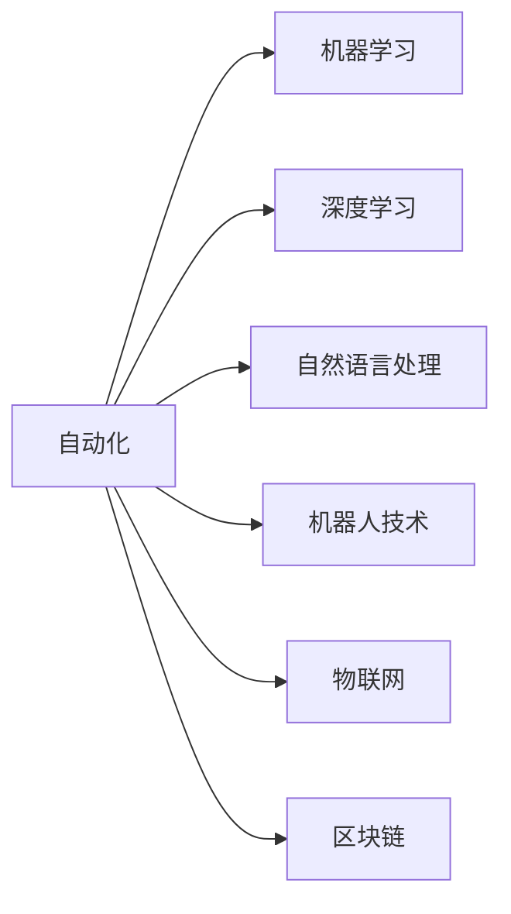
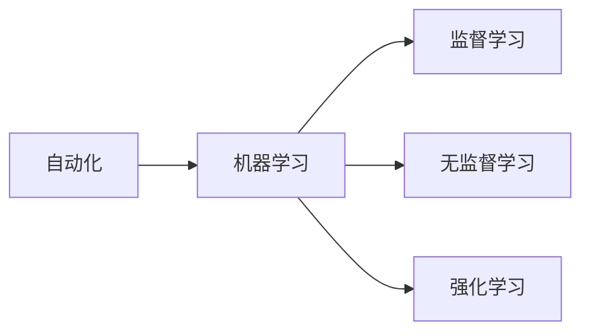
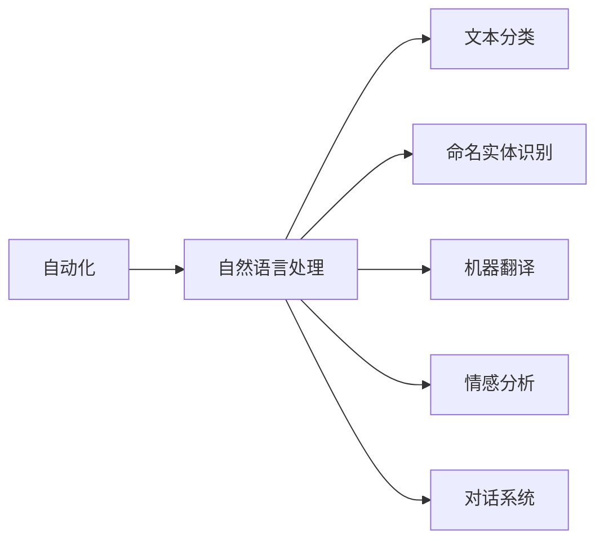
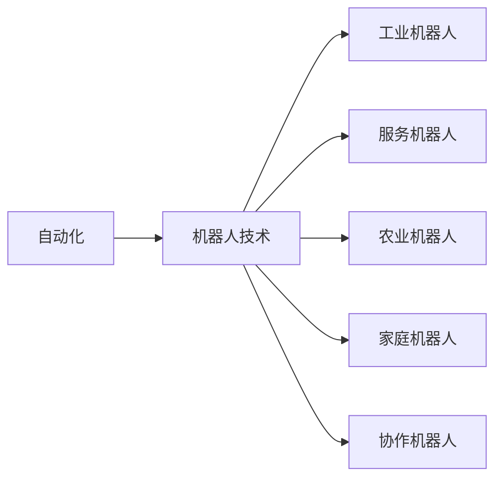

                 

# 自动化的最新技术发展方向

## 1. 背景介绍

随着人工智能技术的不断进步，自动化成为了各行各业的发展趋势。自动化不仅能提高效率，还能降低成本，提升决策的准确性。本文将深入探讨当前自动化的最新技术发展方向，包括自动化的定义、重要性、发展历程以及最新趋势。

### 1.1 自动化的定义

自动化指的是通过技术手段，使机器自动完成人类所从事的工作，从而减少人为干预，提高效率和准确性。自动化可以应用于各个领域，如制造业、医疗、金融、物流等，提高这些行业的运行效率和生产能力。

### 1.2 自动化的重要性

自动化对于提高生产力和效率至关重要。在制造业中，自动化可以实现大规模、高精度的生产，减少人为错误。在医疗领域，自动化可以提高诊断的准确性和速度，减少误诊和漏诊。在金融领域，自动化可以帮助处理大量交易数据，提升风险控制能力。因此，自动化在各个领域都具有重要的应用价值。

### 1.3 自动化的发展历程

自动化技术的发展经历了几个重要阶段：

- **机械自动化**：通过机械装置实现简单的重复操作。
- **电气自动化**：通过电力驱动的机械设备实现更复杂的自动化任务。
- **计算机自动化**：利用计算机技术和算法实现更高级的自动化。
- **人工智能自动化**：利用机器学习和深度学习技术，使机器能够自主学习和决策。

## 2. 核心概念与联系

### 2.1 核心概念概述

为更好地理解自动化的最新技术发展方向，本节将介绍几个密切相关的核心概念：

- **自动化**：通过技术手段，使机器自动完成人类所从事的工作。
- **机器学习**：利用算法和数据，使机器能够从经验中学习和改进。
- **深度学习**：机器学习的一种，通过多层次的神经网络模型，实现更加复杂的自动化任务。
- **自然语言处理**：使机器能够理解和处理人类语言，实现自动化的自然语言交互。
- **机器人技术**：通过机器人实现自动化的物理操作和任务执行。
- **物联网**：使物理设备和网络连接，实现设备的自动化控制和管理。
- **区块链**：通过去中心化的分布式账本技术，实现自动化的数据验证和交换。

这些核心概念之间的逻辑关系可以通过以下Mermaid流程图来展示：



这个流程图展示了自动化技术的核心概念及其之间的关系：

1. 自动化利用机器学习和深度学习技术实现智能决策。
2. 自动化通过自然语言处理技术实现自然语言交互。
3. 自动化结合机器人技术实现物理操作。
4. 自动化通过物联网技术实现设备的远程控制和管理。
5. 自动化利用区块链技术实现数据的安全验证和交换。

### 2.2 概念间的关系

这些核心概念之间存在着紧密的联系，形成了自动化技术的完整生态系统。下面我通过几个Mermaid流程图来展示这些概念之间的关系。

#### 2.2.1 自动化与机器学习的关系



这个流程图展示了自动化与机器学习之间的关系。自动化利用监督学习、无监督学习和强化学习技术，实现智能决策和任务执行。

#### 2.2.2 自动化与自然语言处理的关系



这个流程图展示了自动化与自然语言处理之间的关系。自动化通过自然语言处理技术实现文本分类、命名实体识别、机器翻译、情感分析和对话系统等任务。

#### 2.2.3 自动化与机器人技术的关系



这个流程图展示了自动化与机器人技术之间的关系。自动化结合工业机器人、服务机器人、农业机器人、家庭机器人和协作机器人技术，实现自动化任务的执行。

## 3. 核心算法原理 & 具体操作步骤

### 3.1 算法原理概述

自动化技术的关键在于算法的设计和优化。以下是几种常见的自动化算法：

- **监督学习算法**：利用标注数据，使机器学习如何执行特定任务。
- **无监督学习算法**：通过无标注数据，使机器学习数据的内在结构和特征。
- **强化学习算法**：通过与环境交互，使机器学习如何做出最优决策。
- **自然语言处理算法**：利用算法和模型，使机器理解并生成自然语言。
- **机器人控制算法**：利用算法和传感器，使机器人自主执行任务。
- **物联网协议**：利用协议，使物理设备和网络设备进行通信和控制。
- **区块链共识算法**：利用算法，确保数据的真实性和完整性。

### 3.2 算法步骤详解

自动化算法的步骤通常包括以下几个环节：

1. **数据采集**：收集相关的数据，用于训练和优化算法。
2. **数据预处理**：清洗和处理数据，提取有用的特征。
3. **模型训练**：利用数据和算法，训练模型。
4. **模型评估**：通过测试数据集，评估模型的性能。
5. **模型部署**：将模型部署到实际应用中，实现自动化任务。

### 3.3 算法优缺点

自动化算法具有以下优点：

- **效率高**：自动化算法能够快速处理大量数据，提高工作效率。
- **精度高**：自动化算法通过训练，能够提高决策的准确性和可靠性。
- **可扩展性强**：自动化算法能够通过扩展和优化，适应不同的应用场景。

同时，自动化算法也存在以下缺点：

- **数据依赖**：自动化算法依赖于标注数据，缺乏数据时难以训练。
- **复杂度高**：自动化算法通常需要复杂的模型和算法，难以实现。
- **鲁棒性差**：自动化算法对异常数据和噪声数据敏感，容易出现错误。
- **安全性低**：自动化算法在数据处理和模型部署中，可能存在安全漏洞。

### 3.4 算法应用领域

自动化算法在各个领域都有广泛的应用：

- **制造业**：自动化生产线，提高生产效率和质量。
- **医疗**：自动化诊断和分析，提高诊疗的准确性和速度。
- **金融**：自动化交易和风险控制，提高金融决策的准确性和可靠性。
- **物流**：自动化仓储和配送，提高物流效率和减少成本。
- **农业**：自动化种植和收割，提高农业生产的效率和产量。
- **家庭**：自动化家电和家庭管理，提高生活质量。
- **智能交通**：自动化交通控制和管理，提高交通效率和安全性。

## 4. 数学模型和公式 & 详细讲解 & 举例说明

### 4.1 数学模型构建

自动化算法的数学模型通常包括数据集、损失函数、优化算法和评估指标。以下是一个简单的线性回归算法的数学模型：

- **输入**：训练数据集 $(x_i, y_i)$，其中 $x_i \in \mathbb{R}^d$，$y_i \in \mathbb{R}$。
- **模型**：线性回归模型 $y = wx + b$，其中 $w \in \mathbb{R}^d$，$b \in \mathbb{R}$。
- **损失函数**：均方误差损失函数 $L(y, \hat{y}) = \frac{1}{2} \sum_{i=1}^N (y_i - \hat{y}_i)^2$。
- **优化算法**：梯度下降算法 $w \leftarrow w - \eta \nabla_{w} L(y, \hat{y})$，其中 $\eta$ 为学习率。

### 4.2 公式推导过程

以线性回归算法为例，进行公式推导：

1. **均方误差损失函数**：
   $$
   L(y, \hat{y}) = \frac{1}{2} \sum_{i=1}^N (y_i - \hat{y}_i)^2
   $$

2. **梯度下降算法**：
   $$
   w \leftarrow w - \eta \nabla_{w} L(y, \hat{y})
   $$

   其中，$\nabla_{w} L(y, \hat{y})$ 表示损失函数对模型参数 $w$ 的梯度。

3. **求解 $w$ 的公式**：
   $$
   w \leftarrow w - \eta \frac{1}{N} \sum_{i=1}^N (y_i - wx_i - b)x_i
   $$

   通过求解上述公式，可以更新模型参数 $w$，最小化均方误差损失函数。

### 4.3 案例分析与讲解

以下是一个简单的机器翻译案例，利用序列到序列模型实现中英文翻译：

1. **模型选择**：选择序列到序列模型，包含一个编码器和解码器。
2. **数据预处理**：将中英文句子转换为单词序列，并进行标准化处理。
3. **模型训练**：利用训练数据集，通过反向传播算法更新模型参数。
4. **模型评估**：利用测试数据集，计算翻译的准确率和召回率。
5. **模型部署**：将训练好的模型部署到实际应用中，实现自动翻译功能。

## 5. 项目实践：代码实例和详细解释说明

### 5.1 开发环境搭建

在进行自动化项目实践前，我们需要准备好开发环境。以下是使用Python进行PyTorch开发的环境配置流程：

1. 安装Anaconda：从官网下载并安装Anaconda，用于创建独立的Python环境。

2. 创建并激活虚拟环境：
```bash
conda create -n pytorch-env python=3.8 
conda activate pytorch-env
```

3. 安装PyTorch：根据CUDA版本，从官网获取对应的安装命令。例如：
```bash
conda install pytorch torchvision torchaudio cudatoolkit=11.1 -c pytorch -c conda-forge
```

4. 安装TensorFlow：
```bash
pip install tensorflow
```

5. 安装各类工具包：
```bash
pip install numpy pandas scikit-learn matplotlib tqdm jupyter notebook ipython
```

完成上述步骤后，即可在`pytorch-env`环境中开始自动化实践。

### 5.2 源代码详细实现

下面我以自动化垃圾分类项目为例，给出使用PyTorch和TensorFlow实现垃圾分类的代码实现。

```python
import torch
from torch import nn, optim
from torch.utils.data import DataLoader, Dataset
import numpy as np
import tensorflow as tf
from tensorflow.keras import layers, models

# 定义数据集
class GarbageDataset(Dataset):
    def __init__(self, data, labels):
        self.data = data
        self.labels = labels

    def __len__(self):
        return len(self.data)

    def __getitem__(self, idx):
        img = self.data[idx]
        label = self.labels[idx]
        return img, label

# 定义数据预处理函数
def preprocess_data(data):
    img = np.array(data) / 255.0
    img = img.reshape((img.shape[0], img.shape[1], img.shape[2], 1))
    img = img.astype(np.float32)
    img = (img - 0.5) / 0.5
    return img

# 训练函数
def train_model(model, train_dataset, valid_dataset, num_epochs, batch_size):
    device = torch.device("cuda" if torch.cuda.is_available() else "cpu")
    model.to(device)
    
    criterion = nn.CrossEntropyLoss()
    optimizer = optim.Adam(model.parameters(), lr=0.001)

    for epoch in range(num_epochs):
        train_loss = 0.0
        valid_loss = 0.0
        train_correct = 0
        valid_correct = 0

        train_loader = DataLoader(train_dataset, batch_size=batch_size, shuffle=True)
        valid_loader = DataLoader(valid_dataset, batch_size=batch_size, shuffle=False)

        for batch_idx, (data, target) in enumerate(train_loader):
            data, target = data.to(device), target.to(device)
            optimizer.zero_grad()
            output = model(data)
            loss = criterion(output, target)
            loss.backward()
            optimizer.step()

            train_loss += loss.item()
            train_correct += torch.max(output, 1)[1] == target

        train_loss /= len(train_loader)
        train_correct /= len(train_loader.dataset)

        with torch.no_grad():
            for data, target in valid_loader:
                data, target = data.to(device), target.to(device)
                output = model(data)
                loss = criterion(output, target)
                valid_loss += loss.item()
                valid_correct += torch.max(output, 1)[1] == target

        valid_loss /= len(valid_loader)
        valid_correct /= len(valid_loader.dataset)

        print(f"Epoch {epoch+1}, train loss: {train_loss:.4f}, valid loss: {valid_loss:.4f}, train acc: {train_correct:.4f}, valid acc: {valid_correct:.4f}")
```

使用TensorFlow的代码实现：

```python
import tensorflow as tf
from tensorflow.keras import layers, models

# 定义数据集
class GarbageDataset(tf.keras.utils.Sequence):
    def __init__(self, data, labels, batch_size=32):
        self.data = data
        self.labels = labels
        self.batch_size = batch_size

    def __len__(self):
        return len(self.data) // self.batch_size

    def __getitem__(self, idx):
        batch_x = self.data[idx * self.batch_size : (idx + 1) * self.batch_size]
        batch_y = self.labels[idx * self.batch_size : (idx + 1) * self.batch_size]
        return batch_x, batch_y

# 训练函数
def train_model(model, train_dataset, valid_dataset, num_epochs, batch_size):
    model.compile(loss='categorical_crossentropy', optimizer='adam', metrics=['accuracy'])

    for epoch in range(num_epochs):
        train_loss, train_acc = model.evaluate(train_dataset)
        valid_loss, valid_acc = model.evaluate(valid_dataset)

        print(f"Epoch {epoch+1}, train loss: {train_loss:.4f}, train acc: {train_acc:.4f}, valid loss: {valid_loss:.4f}, valid acc: {valid_acc:.4f}")

        model.fit(train_dataset, epochs=1, batch_size=batch_size, validation_data=valid_dataset)
```

### 5.3 代码解读与分析

这里我们详细解读一下关键代码的实现细节：

**GarbageDataset类**：
- `__init__`方法：初始化数据和标签，并设置批大小。
- `__len__`方法：返回数据集的样本数量。
- `__getitem__`方法：获取单个样本的输入和标签。

**preprocess_data函数**：
- 对图像数据进行标准化和归一化处理。

**训练函数**：
- 使用PyTorch的DataLoader对数据集进行批次化加载，供模型训练和推理使用。
- 定义训练函数和评估函数。
- 循环迭代进行训练和评估，输出训练和验证的损失和准确率。

使用TensorFlow的代码实现：
- **GarbageDataset类**：
  - `__init__`方法：初始化数据和标签，并设置批大小。
  - `__len__`方法：返回数据集的样本数量。
  - `__getitem__`方法：获取单个样本的输入和标签。
- **训练函数**：
  - 定义模型、损失函数和优化器。
  - 循环迭代进行训练和评估，输出训练和验证的损失和准确率。

## 6. 实际应用场景

### 6.1 智能工厂

自动化技术在智能工厂中得到了广泛应用，通过自动化生产线、机器人技术、物联网设备等，实现了生产过程的数字化和智能化。智能工厂能够实时监控和优化生产流程，提高生产效率和质量，降低成本和能耗。

### 6.2 智慧医疗

在智慧医疗领域，自动化技术通过机器学习和自然语言处理，实现了医疗影像诊断、电子病历分析、智能问诊等功能。自动化技术能够辅助医生进行疾病诊断，提高诊断的准确性和速度，减少误诊和漏诊。

### 6.3 智能交通

智能交通系统通过自动化技术实现了交通流量监测、智能交通信号控制、自动驾驶等功能。自动化技术能够提高交通效率和安全性，减少交通事故和交通拥堵。

### 6.4 智能家居

智能家居通过自动化技术实现了家庭设备的智能化控制，如智能音箱、智能家电、智能安防等。自动化技术能够提高家庭生活的便利性和安全性，减少人为操作和能源浪费。

## 7. 工具和资源推荐

### 7.1 学习资源推荐

为了帮助开发者系统掌握自动化技术的基础知识和高级技巧，这里推荐一些优质的学习资源：

1. 《深度学习》一书：Ian Goodfellow等人的经典之作，全面介绍了深度学习的原理和应用。
2. 《自然语言处理综论》一书：Daniel Jurafsky和James H. Martin的著作，深入浅出地介绍了自然语言处理的技术和应用。
3. TensorFlow和PyTorch官方文档：提供了丰富的教程和示例代码，帮助开发者快速上手自动化项目。
4. Coursera和Udacity等在线课程：提供了一系列机器学习和深度学习的课程，帮助开发者系统学习自动化技术。
5. Kaggle竞赛：通过参与Kaggle竞赛，实战练习自动化技术的应用。

通过对这些资源的学习实践，相信你一定能够快速掌握自动化技术的精髓，并用于解决实际的自动化问题。

### 7.2 开发工具推荐

高效的开发离不开优秀的工具支持。以下是几款用于自动化技术开发的常用工具：

1. PyTorch：基于Python的开源深度学习框架，灵活动态的计算图，适合快速迭代研究。
2. TensorFlow：由Google主导开发的开源深度学习框架，生产部署方便，适合大规模工程应用。
3. Keras：基于TensorFlow和Theano的高级神经网络API，提供了更简单易用的接口。
4. OpenCV：用于计算机视觉的库，提供了丰富的图像处理和分析功能。
5. ROS：用于机器人技术的开源框架，提供了强大的机器人仿真和控制功能。
6. Ardupilot：用于飞行器自动化的开源项目，提供了自动飞行和控制功能。
7. Paho MQTT：用于物联网设备的通信协议，提供了可靠的通信和数据交换功能。

合理利用这些工具，可以显著提升自动化项目的开发效率，加快创新迭代的步伐。

### 7.3 相关论文推荐

自动化技术的发展源于学界的持续研究。以下是几篇奠基性的相关论文，推荐阅读：

1. "Deep Learning" by Ian Goodfellow, Yoshua Bengio, and Aaron Courville：全面介绍了深度学习的基础知识和应用。
2. "CS224N: Natural Language Processing with Deep Learning" by Stanford University：斯坦福大学开设的NLP明星课程，涵盖了深度学习在NLP中的应用。
3. "ImageNet Classification with Deep Convolutional Neural Networks" by Alex Krizhevsky, Ilya Sutskever, and Geoffrey Hinton：介绍了一种基于深度卷积神经网络的图像分类方法。
4. "Playing Atari with Deep Reinforcement Learning" by Volodymyr Mnih et al.：介绍了使用深度强化学习技术进行游戏AI的研究。
5. "AlphaGo Zero: Mastering the Game of Go without Human Knowledge" by David Silver et al.：介绍了使用深度强化学习技术进行游戏AI的研究。

这些论文代表了大数据、深度学习和自动化技术的最新进展，通过学习这些前沿成果，可以帮助研究者把握学科前进方向，激发更多的创新灵感。

## 8. 总结：未来发展趋势与挑战

### 8.1 总结

本文对自动化技术的最新发展方向进行了全面系统的介绍。首先阐述了自动化的定义、重要性和发展历程，明确了自动化在各个领域的应用价值。其次，从原理到实践，详细讲解了自动化算法的数学模型和关键步骤，给出了自动化项目开发的完整代码实例。同时，本文还广泛探讨了自动化技术在智能工厂、智慧医疗、智能交通、智能家居等领域的实际应用前景，展示了自动化技术的广阔前景。最后，本文精选了自动化技术的各类学习资源，力求为读者提供全方位的技术指引。

通过本文的系统梳理，可以看到，自动化技术已经成为各行各业的核心竞争力。自动化能够提高效率、降低成本、提升决策的准确性，推动各个行业的数字化和智能化进程。未来，伴随自动化技术的不断演进，各个行业的运行效率和生产力将迎来新的突破。

### 8.2 未来发展趋势

展望未来，自动化技术将呈现以下几个发展趋势：

1. **智能化水平提升**：通过机器学习和深度学习技术，自动化系统将变得更加智能化，能够自主学习和决策。
2. **多模态融合**：自动化技术将结合视觉、听觉、触觉等多种感知模态，实现更加全面和精确的自动化控制。
3. **边缘计算普及**：通过边缘计算技术，自动化系统能够在本地设备上实现实时处理和决策，降低数据传输的延迟和成本。
4. **区块链应用**：自动化技术将结合区块链技术，实现数据的安全验证和交换，提高系统的可靠性和安全性。
5. **人机协同增强**：自动化系统将与人类进行更加紧密的协同合作，实现人机交互的智能化和个性化。
6. **自动化标准的制定**：随着自动化技术的应用普及，自动化标准将逐步建立，推动各个行业的自动化进程。

这些趋势凸显了自动化技术的广阔前景。这些方向的探索发展，必将进一步提升自动化系统的性能和应用范围，为各行各业带来更多的创新和变革。

### 8.3 面临的挑战

尽管自动化技术已经取得了瞩目成就，但在迈向更加智能化、普适化应用的过程中，它仍面临着诸多挑战：

1. **数据获取难度**：自动化系统需要大量高质量的数据进行训练，获取这些数据往往需要大量人力和财力投入。
2. **系统复杂度高**：自动化系统的设计和实现往往需要复杂的算法和模型，难以实现和维护。
3. **鲁棒性不足**：自动化系统对异常数据和噪声数据敏感，容易出现错误。
4. **安全性问题**：自动化系统在数据处理和模型部署中，可能存在安全漏洞，导致数据泄露和系统攻击。
5. **兼容性问题**：自动化系统需要与现有系统和设备进行兼容，实现无缝集成。

### 8.4 研究展望

面对自动化技术面临的挑战，未来的研究需要在以下几个方面寻求新的突破：

1. **数据获取技术**：开发更加高效的数据获取技术，降低获取高质量数据的成本。
2. **算法优化**：优化自动化算法的复杂度，提高系统的稳定性和可靠性。
3. **安全性保障**：加强自动化系统的安全性研究，确保数据和系统的安全。
4. **兼容性设计**：开发更加灵活的自动化系统设计，实现与现有系统和设备的兼容。
5. **人机协同交互**：研究人机协同交互技术，提高人机协作的效率和质量。

这些研究方向的研究进展，必将推动自动化技术的不断演进，为各行各业带来更多的创新和变革。总之，自动化技术在未来的发展中，必将发挥更大的作用，推动各个行业的数字化和智能化进程，为人类生产和生活带来更多的便利和智能。

## 9. 附录：常见问题与解答

**Q1: 什么是自动化？**

A: 自动化指的是通过技术手段，使机器自动完成人类所从事的工作，从而减少人为干预，提高效率和准确性。

**Q2: 自动化技术有哪些应用领域？**

A: 自动化技术在制造业、医疗、金融、物流、农业、家庭、智能交通等领域都有广泛的应用，提高了各行业的运行效率和生产力。

**Q3: 自动化技术的发展趋势是什么？**

A: 自动化技术的发展趋势包括智能化水平提升、多模态融合、边缘计算普及、区块链应用、人机协同增强和自动化标准的制定。

**Q4: 自动化技术面临哪些挑战？**

A: 自动化技术面临数据获取难度、系统复杂度高、鲁棒性不足、安全性问题和兼容性问题等挑战。

**Q5: 如何应对自动化技术的挑战？**

A: 应对自动化技术的挑战需要开发高效的数据获取技术、优化自动化算法、保障系统安全性、实现兼容性设计和提升人机协同交互。

---

作者：禅与计算机程序设计艺术 / Zen and the Art of Computer Programming

