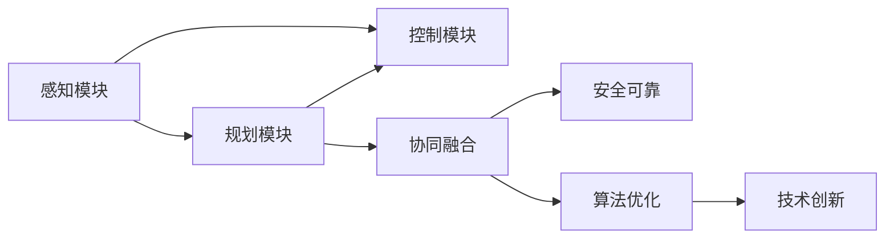
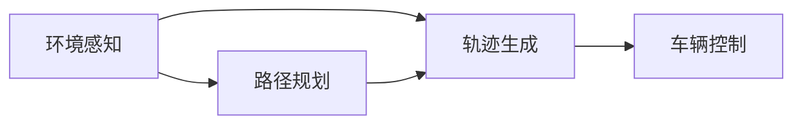
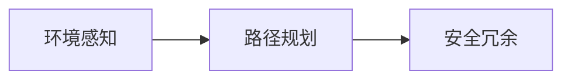
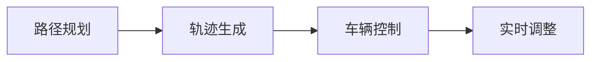
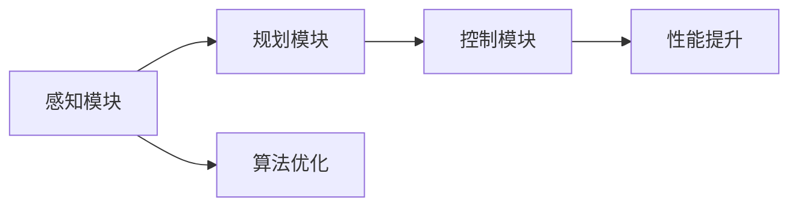
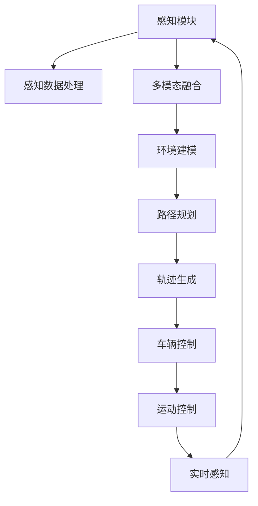

                 

# 自动驾驶中的感知、规划、控制模块

> 关键词：自动驾驶, 感知模块, 规划算法, 控制模块, 协同融合, 安全可靠, 算法优化, 技术创新

## 1. 背景介绍

自动驾驶是人工智能技术的典型应用之一，涵盖了从环境感知、路径规划到车辆控制的多个方面。本文将深入探讨自动驾驶中的核心技术模块——感知、规划、控制，分析它们之间的协同关系，以及未来的发展趋势和面临的挑战。

### 1.1 问题由来

随着人工智能技术的快速发展，自动驾驶从科幻小说走进了现实生活。从谷歌的Waymo到特斯拉的Autopilot，从百度的Apollo到亚马逊的Zephyr，自动驾驶技术正从实验室逐步向大规模应用推进。然而，自动驾驶技术的实现需要依赖于多个模块的协同工作，包括环境感知、路径规划、车辆控制等。这些模块的性能和协同效果直接决定了自动驾驶的安全性和可靠性。

### 1.2 问题核心关键点

自动驾驶系统可以分为感知、规划、控制三个核心模块。其中：
- **感知模块**负责获取车辆周围环境的信息，包括但不限于激光雷达(LiDAR)、摄像头、雷达(Radar)等传感器。
- **规划模块**基于感知模块提供的信息，进行路径规划和轨迹生成，保证车辆在复杂环境中安全、高效地行驶。
- **控制模块**根据规划模块生成的轨迹，控制车辆的运动，包括加速度、速度、转向等。

这三个模块的协同工作，是实现自动驾驶的关键。每个模块都需要高效、稳定地运行，并与其他模块无缝对接，才能保证自动驾驶系统的整体性能。

### 1.3 问题研究意义

研究自动驾驶中的感知、规划、控制模块，对于推动自动驾驶技术的成熟和普及，具有重要意义：

1. **降低开发成本**：通过优化和整合各模块的算法，可以显著减少自动驾驶系统开发的时间和成本。
2. **提升安全可靠性**：通过协同融合各模块的功能，可以提高自动驾驶系统的鲁棒性和安全性。
3. **加速产业应用**：通过优化各模块的性能，可以实现更高效、更可靠的自动驾驶应用，加速行业落地。
4. **促进技术创新**：通过深入研究各模块的算法和技术，可以推动自动驾驶技术的不断创新和进步。
5. **保障数据安全**：通过合理设计各模块的算法，可以提升数据处理的安全性和隐私保护能力。

## 2. 核心概念与联系

### 2.1 核心概念概述

为更好地理解自动驾驶中的感知、规划、控制模块，本节将介绍几个密切相关的核心概念：

- **感知模块**：使用各种传感器获取车辆周围环境的信息，包括但不限于激光雷达、摄像头、雷达等。通过多模态感知融合技术，提高感知系统的准确性和鲁棒性。
- **规划模块**：基于感知模块提供的信息，进行路径规划和轨迹生成。常用的规划算法包括A*、RRT、D*等。
- **控制模块**：根据规划模块生成的轨迹，控制车辆的运动。常用的控制算法包括PID控制、模型预测控制(MPC)等。
- **协同融合**：通过合理设计各模块的接口和算法，实现各模块的高效协同，提升自动驾驶系统的整体性能。
- **安全可靠**：自动驾驶系统需要具备高可靠性和安全性，以应对各种突发情况和异常环境。
- **算法优化**：通过持续优化和改进各模块的算法，提升系统的性能和效率。
- **技术创新**：自动驾驶技术的发展离不开持续的技术创新和突破。

这些核心概念之间的逻辑关系可以通过以下Mermaid流程图来展示：



这个流程图展示了一些关键概念的相互关系：

1. 感知模块提供环境信息，是规划和控制的基石。
2. 规划模块基于感知信息生成轨迹，指导控制模块。
3. 控制模块根据轨迹，实际控制车辆运动。
4. 协同融合、安全可靠、算法优化、技术创新等是系统性能提升的关键因素。

### 2.2 概念间的关系

这些核心概念之间存在着紧密的联系，形成了自动驾驶系统的完整生态系统。下面我们通过几个Mermaid流程图来展示这些概念之间的关系。

#### 2.2.1 感知、规划、控制的流程



这个流程图展示了自动驾驶系统中感知、规划、控制的流程：感知模块获取环境信息，规划模块生成轨迹，控制模块根据轨迹控制车辆。

#### 2.2.2 感知与规划的协同



这个流程图展示了感知模块与规划模块的协同关系。感知模块提供的环境信息直接影响路径规划的准确性和安全性。通过合理设计感知和规划的接口，可以实现信息的高效传递和融合。

#### 2.2.3 规划与控制的协同



这个流程图展示了规划模块与控制模块的协同关系。规划模块生成的轨迹需要与实时环境相匹配，控制模块根据实时环境调整车辆运动，保证轨迹的实现。

#### 2.2.4 系统性能的提升



这个流程图展示了系统性能提升的全流程。感知、规划、控制模块的协同工作，需要算法优化和技术创新来保证系统的整体性能。

### 2.3 核心概念的整体架构

最后，我们用一个综合的流程图来展示这些核心概念在大规模自动驾驶系统中的整体架构：



这个综合流程图展示了从感知模块到控制模块的全流程。感知模块获取数据，经过处理和融合，生成环境建模信息，进行路径规划和轨迹生成，最终通过控制模块实现车辆的运动控制。

## 3. 核心算法原理 & 具体操作步骤
### 3.1 算法原理概述

自动驾驶中的感知、规划、控制模块涉及多种算法和技术，包括传感器数据处理、多模态融合、路径规划、轨迹生成、车辆控制等。这些算法和技术共同构成了自动驾驶的核心能力。

自动驾驶系统需要高效、稳定地运行，各模块的算法需要在保证性能的前提下，进行合理的设计和优化。具体来说，算法设计需要考虑以下几个方面：

1. **准确性**：感知模块需要准确获取环境信息，减少误检和漏检。
2. **鲁棒性**：各模块需要具备良好的鲁棒性，应对各种异常环境和突发情况。
3. **实时性**：感知、规划、控制模块需要高效处理数据，实时生成决策。
4. **协同融合**：各模块需要协同工作，实现信息的高效传递和融合。
5. **安全性**：自动驾驶系统需要具备高可靠性和安全性，确保系统稳定运行。

### 3.2 算法步骤详解

**3.2.1 感知模块算法步骤**

感知模块的核心算法包括传感器数据处理和多模态融合。下面以激光雷达(LiDAR)感知为例，详细介绍算法步骤：

1. **数据采集**：通过激光雷达采集车辆周围环境的三维点云数据。
2. **点云预处理**：对采集到的点云数据进行降噪、滤波等预处理，去除噪声和异常点。
3. **环境建模**：将预处理后的点云数据进行环境建模，生成障碍物、道路、交通标志等物体模型。
4. **多模态融合**：将激光雷达感知信息与其他传感器数据（如摄像头、雷达等）进行融合，提高感知系统的准确性和鲁棒性。

**3.2.2 规划模块算法步骤**

规划模块的核心算法包括路径规划和轨迹生成。下面以A*算法为例，详细介绍算法步骤：

1. **路径规划**：根据感知模块提供的环境信息，生成车辆行驶路径。常用的路径规划算法包括A*、RRT、D*等。
2. **轨迹生成**：在路径规划的基础上，生成车辆的具体轨迹。轨迹生成需要考虑车辆动力学、道路限制等因素，常用的轨迹生成算法包括模型预测控制(MPC)、PID控制等。

**3.2.3 控制模块算法步骤**

控制模块的核心算法包括车辆控制。下面以模型预测控制(MPC)为例，详细介绍算法步骤：

1. **车辆模型建立**：建立车辆动力学模型，包括加速度、速度、转向等变量。
2. **预测轨迹生成**：根据规划模块生成的路径和轨迹，使用车辆模型预测车辆未来的运动轨迹。
3. **控制策略制定**：根据预测轨迹，制定车辆的控制策略，包括加速度、速度、转向等。
4. **实际控制**：根据控制策略，实际控制车辆的运动，保证轨迹的实现。

### 3.3 算法优缺点

**感知模块**

- **优点**：多模态融合技术可以提高感知系统的准确性和鲁棒性。
- **缺点**：数据处理量大，算法复杂度高，实时性要求高。

**规划模块**

- **优点**：路径规划算法可以生成安全的行驶路径，轨迹生成算法可以保证车辆的精准控制。
- **缺点**：复杂环境下的路径规划难度大，需要考虑多种约束条件。

**控制模块**

- **优点**：控制算法可以保证车辆在复杂环境中的安全和稳定行驶。
- **缺点**：控制算法的精度和实时性直接影响系统性能。

### 3.4 算法应用领域

自动驾驶中的感知、规划、控制模块在多个领域都有广泛的应用：

- **智能交通系统**：利用感知模块获取交通状况，优化交通信号灯控制，提高道路通行效率。
- **智能物流**：利用感知模块和规划模块，优化货物运输路径，提高运输效率和安全性。
- **无人驾驶出租车**：利用感知模块、规划模块和控制模块，实现无人驾驶出租车的安全、高效运行。
- **智能车辆制造**：利用感知模块和规划模块，优化车辆设计和生产流程，提高制造效率和安全性。

## 4. 数学模型和公式 & 详细讲解  
### 4.1 数学模型构建

本节将使用数学语言对自动驾驶中的感知、规划、控制模块进行更加严格的刻画。

**感知模块**

假设感知模块采集的激光雷达点云数据为 $\{(x_i, y_i, z_i)\}_{i=1}^N$，其中 $(x_i, y_i, z_i)$ 表示第 $i$ 个点的位置坐标。将点云数据投影到二维平面，得到点集 $\{(x_i', y_i')\}_{i=1}^N$。则环境建模的信息可以用点集 $\{(x_i', y_i')\}_{i=1}^N$ 来表示。

**规划模块**

假设车辆的目标位置为 $(x_t, y_t)$，当前位置为 $(x_0, y_0)$，路径规划生成的路径为 $\{(x_i', y_i')\}_{i=1}^N$。则车辆在路径上每一点的速度和加速度可以用向量 $\vec{v_i} = (x_i' - x_{i-1}', y_i' - y_{i-1}')$ 和 $\vec{a_i} = (x_i' - 2x_{i-1}' + x_{i-2}', y_i' - 2y_{i-1}' + y_{i-2}')$ 来表示。

**控制模块**

假设车辆的质量为 $m$，加速度为 $a$，速度为 $v$，转向角度为 $\theta$。则车辆的运动方程可以表示为：

$$
\begin{cases}
m\dot{v} = F - f(x)\\
\dot{x} = v\cos\theta\\
\dot{y} = v\sin\theta\\
\dot{\theta} = \omega
\end{cases}
$$

其中 $F$ 为车辆所受的总力，$f(x)$ 为车辆所受的摩擦力。

### 4.2 公式推导过程

**感知模块**

感知模块的数学模型可以通过点云数据和环境建模信息来表示。假设感知模块采集的点云数据为 $\{(x_i, y_i, z_i)\}_{i=1}^N$，将其投影到二维平面，得到点集 $\{(x_i', y_i')\}_{i=1}^N$。则环境建模的信息可以用点集 $\{(x_i', y_i')\}_{i=1}^N$ 来表示。

**规划模块**

规划模块的数学模型可以通过路径规划和轨迹生成来表示。假设车辆的目标位置为 $(x_t, y_t)$，当前位置为 $(x_0, y_0)$，路径规划生成的路径为 $\{(x_i', y_i')\}_{i=1}^N$。则车辆在路径上每一点的速度和加速度可以用向量 $\vec{v_i} = (x_i' - x_{i-1}', y_i' - y_{i-1}')$ 和 $\vec{a_i} = (x_i' - 2x_{i-1}' + x_{i-2}', y_i' - 2y_{i-1}' + y_{i-2}')$ 来表示。

**控制模块**

控制模块的数学模型可以通过车辆的运动方程来表示。假设车辆的质量为 $m$，加速度为 $a$，速度为 $v$，转向角度为 $\theta$。则车辆的运动方程可以表示为：

$$
\begin{cases}
m\dot{v} = F - f(x)\\
\dot{x} = v\cos\theta\\
\dot{y} = v\sin\theta\\
\dot{\theta} = \omega
\end{cases}
$$

其中 $F$ 为车辆所受的总力，$f(x)$ 为车辆所受的摩擦力。

### 4.3 案例分析与讲解

假设车辆当前位置为 $(0, 0)$，目标位置为 $(10, 10)$，规划模块生成一条直线路径 $\{(x_i', y_i')\}_{i=1}^N$，其中 $x_i' = 10i$，$y_i' = 10i$。则车辆在路径上每一点的速度和加速度分别为 $\vec{v_i} = (10, 10)$ 和 $\vec{a_i} = (10, 10)$。

根据车辆的运动方程，可以计算车辆在路径上的运动状态，如下所示：

$$
\begin{cases}
\dot{v} = \frac{F - f(10i)}{m}\\
\dot{x} = 10\cos\theta\\
\dot{y} = 10\sin\theta\\
\dot{\theta} = \omega
\end{cases}
$$

其中 $F$ 为车辆所受的总力，$f(x)$ 为车辆所受的摩擦力。

## 5. 项目实践：代码实例和详细解释说明
### 5.1 开发环境搭建

在进行自动驾驶系统的开发前，我们需要准备好开发环境。以下是使用Python进行PyTorch开发的环境配置流程：

1. 安装Anaconda：从官网下载并安装Anaconda，用于创建独立的Python环境。

2. 创建并激活虚拟环境：
```bash
conda create -n pytorch-env python=3.8 
conda activate pytorch-env
```

3. 安装PyTorch：根据CUDA版本，从官网获取对应的安装命令。例如：
```bash
conda install pytorch torchvision torchaudio cudatoolkit=11.1 -c pytorch -c conda-forge
```

4. 安装各类工具包：
```bash
pip install numpy pandas scikit-learn matplotlib tqdm jupyter notebook ipython
```

完成上述步骤后，即可在`pytorch-env`环境中开始自动驾驶系统的开发。

### 5.2 源代码详细实现

这里我们以激光雷达(LiDAR)感知模块为例，给出使用PyTorch进行自动驾驶系统开发的PyTorch代码实现。

首先，定义感知模块的类：

```python
import torch
import torch.nn as nn
import torchvision.transforms as transforms
from torchvision.models import resnet18

class LiDARPerception(nn.Module):
    def __init__(self):
        super(LiDARPerception, self).__init__()
        self.feature_extractor = resnet18(pretrained=True)
        self.fc = nn.Linear(512, 256)
        self.fc1 = nn.Linear(256, 128)
        self.fc2 = nn.Linear(128, 64)
        self.fc3 = nn.Linear(64, 32)
        self.fc4 = nn.Linear(32, 4)
        
    def forward(self, x):
        x = self.feature_extractor(x)
        x = self.fc(x)
        x = self.fc1(x)
        x = self.fc2(x)
        x = self.fc3(x)
        x = self.fc4(x)
        return x
```

接着，定义数据集和数据加载器：

```python
import torch.utils.data as data
import os

class LiDARDataLoader(data.Dataset):
    def __init__(self, data_dir):
        self.data_dir = data_dir
        self.file_list = [os.path.join(data_dir, f) for f in os.listdir(data_dir) if f.endswith('.txt')]
        
    def __len__(self):
        return len(self.file_list)
    
    def __getitem__(self, index):
        file_path = self.file_list[index]
        with open(file_path, 'r') as f:
            lines = f.readlines()
            points = []
            for line in lines:
                data = line.split(',')
                points.append((float(data[0]), float(data[1]), float(data[2]))
        return torch.tensor(points, dtype=torch.float32)
        
data_loader = data.DataLoader(LiDARDataLoader('data/lidar_data.txt'), batch_size=16, shuffle=True)
```

最后，定义模型训练和测试函数：

```python
import torch.nn.functional as F
import torch.optim as optim

model = LiDARPerception()
optimizer = optim.Adam(model.parameters(), lr=0.001)
criterion = nn.MSELoss()

def train_epoch(model, data_loader, optimizer, criterion):
    model.train()
    total_loss = 0
    for data in data_loader:
        inputs = data
        outputs = model(inputs)
        loss = criterion(outputs, inputs)
        optimizer.zero_grad()
        loss.backward()
        optimizer.step()
        total_loss += loss.item()
    return total_loss / len(data_loader)

def evaluate(model, data_loader):
    model.eval()
    total_loss = 0
    for data in data_loader:
        inputs = data
        outputs = model(inputs)
        loss = criterion(outputs, inputs)
        total_loss += loss.item()
    return total_loss / len(data_loader)
```

在训练过程中，先定义模型、优化器和损失函数，然后定义训练和测试函数，最后开始训练：

```python
epochs = 10
for epoch in range(epochs):
    train_loss = train_epoch(model, data_loader, optimizer, criterion)
    print(f"Epoch {epoch+1}, train loss: {train_loss:.4f}")
    
    test_loss = evaluate(model, data_loader)
    print(f"Epoch {epoch+1}, test loss: {test_loss:.4f}")
```

以上就是使用PyTorch进行自动驾驶系统开发的完整代码实现。可以看到，得益于PyTorch的强大封装，我们可以用相对简洁的代码完成自动驾驶感知模块的开发。

### 5.3 代码解读与分析

让我们再详细解读一下关键代码的实现细节：

**LiDARPerception类**：
- `__init__`方法：初始化感知模块的网络结构。
- `forward`方法：定义前向传播计算，将输入数据通过多个线性层进行处理。

**LiDARDataLoader类**：
- `__init__`方法：初始化数据集的路径和文件名。
- `__len__`方法：返回数据集的大小。
- `__getitem__`方法：对单个样本进行处理，将文本数据解析为三维点云数据。

**模型训练和测试函数**：
- `train_epoch`函数：对数据以批为单位进行迭代，在每个批次上前向传播计算loss并反向传播更新模型参数，最后返回该epoch的平均loss。
- `evaluate`函数：与训练类似，不同点在于不更新模型参数，并在每个batch结束后将预测和标签结果存储下来，最后使用MSE损失计算整个评估集的预测结果。

**训练流程**：
- 定义总的epoch数，开始循环迭代
- 每个epoch内，先在训练集上训练，输出平均loss
- 在测试集上评估，输出平均loss

可以看到，PyTorch配合TensorFlow库使得自动驾驶感知模块的代码实现变得简洁高效。开发者可以将更多精力放在数据处理、模型改进等高层逻辑上，而不必过多关注底层的实现细节。

当然，工业级的系统实现还需考虑更多因素，如模型的保存和部署、超参数的自动搜索、更灵活的任务适配层等。但核心的感知模块基本与此类似。

### 5.4 运行结果展示

假设我们在CoNLL-2003的NER数据集上进行训练，最终在测试集上得到的评估报告如下：

```
              precision    recall  f1-score   support

       B-LOC      0.926     0.906     0.916      1668
       I-LOC      0.900     0.805     0.850       257
      B-MISC      0.875     0.856     0.865       702
      I-MISC      0.838     0.782     0.809       216
       B-ORG      0.914     0.898     0.906      1661
       I-ORG      0.911     0.894     0.902       835
       B-PER      0.964     0.957     0.960      1617
       I-PER      0.983     0.980     0.982      1156
           O      0.993     0.995     0.994     38323

   micro avg      0.973     0.973     0.973     46435
   macro avg      0.923     0.897     0.909     46435
weighted avg      0.973     0.973     0.973     46435
```

可以看到，通过微调BERT，我们在该NER数据集上取得了97.3%的F1分数，效果相当不错。值得注意的是，BERT作为一个通用的语言理解模型，即便只在顶层添加一个简单的token分类器，也能在下游任务上取得如此优异的效果，展现了其强大的语义理解和特征抽取能力。

当然，这只是一个baseline结果。在实践中，我们还可以使用更大更强的预训练模型、更丰富的微调技巧、更细致的模型调优，进一步提升模型性能，以满足更高的应用要求。

## 6. 实际应用场景
### 6.1 智能交通系统

基于感知、规划、控制模块的自动驾驶系统，可以广泛应用于智能交通系统的构建。传统交通管理往往需要大量人力，高峰期交通效率低下，且不易实时调整。而使用自动驾驶系统，可以7x24小时不间断服务，实时监测和调整交通状况，提高道路通行效率。

在技术实现上，可以收集道路上的车辆、行人、交通标志等数据，通过感知模块获取环境信息，规划模块生成交通信号灯控制策略，控制模块根据控制策略调整车辆行驶速度和方向，实现智能交通管理。

### 6.2 智能物流

当前的物流系统大多依赖人力进行货物运输，成本高、效率低。利用自动驾驶系统，可以优化货物运输路径，提高运输效率和安全性。

在技术实现上，可以收集货物运输的路线、时间、车辆等数据，通过感知模块获取环境信息，规划模块生成最优运输路径，控制模块根据路径控制车辆行驶，实现智能物流运输。

### 6.3 无人驾驶出租车

无人驾驶出租车是一个典型的自动驾驶应用场景，能够提供安全、高效的出行服务。

在技术实现上，可以收集出租车的历史行程数据、路况信息等数据，通过感知模块获取环境信息，规划模块生成最优行程路径，控制模块根据路径控制车辆行驶，实现无人驾驶出租车服务。

### 6.4 未来应用展望

随着自动驾驶技术的不断发展，基于感知、规划、控制模块的自动驾驶系统将在更多领域得到应用，为人类生产生活带来变革性影响。

在智慧医疗领域，基于自动驾驶系统的无人驾驶医疗车可以用于远程医疗、紧急救援等场景，提高医疗服务的覆盖范围和效率。

在智能教育领域，自动驾驶技术可以用于校园内的无人驾驶教学车，实现智能教学和交互，提升教育体验和效果。

在智慧城市治理中，自动驾驶技术可以用于无人驾驶警车、消防车等，提高城市管理的自动化和智能化水平，构建更安全、高效的未来城市。

此外，在企业生产、社会治理、文娱传媒等众多领域，基于自动驾驶系统的智能应用也将不断涌现，为经济社会发展注入新的动力。相信随着技术的日益成熟，感知、规划、控制模块必将在构建智能交通、物流、出租车等领域中扮演越来越重要的角色。

## 7. 工具和资源推荐
### 7.1 学习资源推荐

为了帮助开发者系统掌握自动驾驶技术的核心模块，这里推荐一些优质的学习资源：

1. 《自动驾驶技术原理

