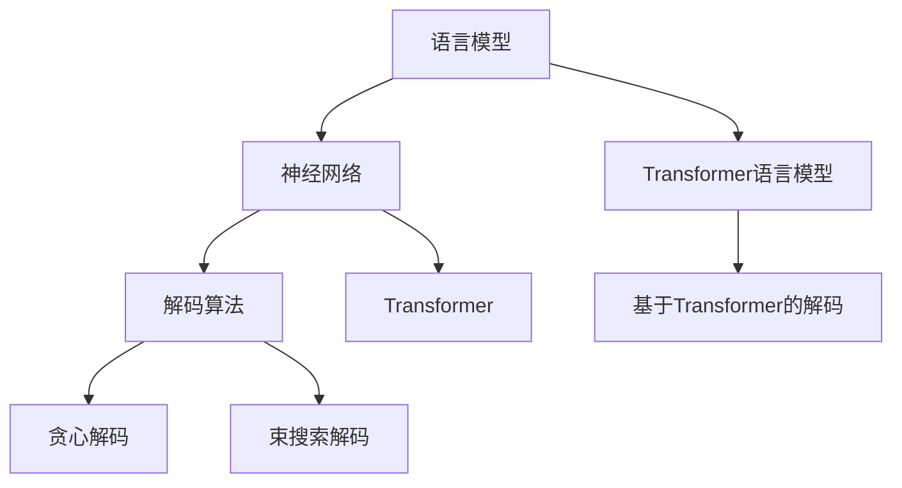
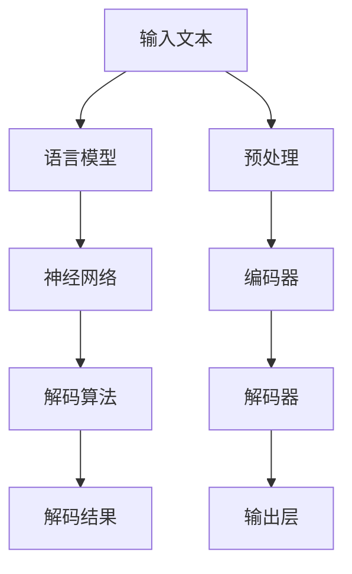

                 

# 自然语言的解码详细过程

> 关键词：自然语言处理，解码算法，语言模型，深度学习，神经网络，Transformer，解码步骤，解码技巧

## 1. 背景介绍

在自然语言处理（Natural Language Processing，NLP）领域，解码（Decoding）是生成式模型中至关重要的环节，特别是在机器翻译、文本生成、对话系统等应用中。解码算法的好坏直接决定了模型的表现和应用的效率。在深度学习时代，尤其是基于神经网络的语言模型中，解码算法的核心任务是生成与给定上下文条件相匹配的单词序列。本文将详细介绍自然语言解码的原理和操作步骤，帮助读者理解解码算法的核心思想和实际应用。

## 2. 核心概念与联系

### 2.1 核心概念概述

解码过程涉及多个关键概念：

- **语言模型（Language Model）**：语言模型用于计算给定单词序列出现的概率，常用的语言模型有n-gram模型、神经网络语言模型等。
- **神经网络（Neural Network）**：解码过程通常由神经网络实现，包括前向传播、激活函数、反向传播等基本步骤。
- **Transformer**：Transformer是一种常用的神经网络结构，特别适用于序列到序列任务，如机器翻译、文本生成等。
- **解码算法（Decoding Algorithm）**：解码算法决定如何在模型输出的所有可能词汇中，选择最可能的单词序列。常用的解码算法包括贪心解码、束搜索解码、束宽度搜索解码等。
- **束宽度搜索（Beam Search）**：束宽度搜索是一种常用的高级解码算法，通过维护多个候选序列，在每一步中选择当前可能性最高的几个序列进行扩展，最终选择其中最优秀的序列作为解码结果。

### 2.2 核心概念间的关系

这些核心概念之间的关系可以用以下Mermaid流程图表示：



这个流程图展示了语言模型与神经网络的关系，以及解码算法与神经网络的具体实现。其中，语言模型和神经网络共同构成解码的基础，而解码算法则在此基础上进一步细化。

### 2.3 核心概念的整体架构

下面是一个更综合的流程图，展示了从语言模型到解码的整个架构：



这个综合流程图展示了输入文本经过预处理后，首先进入语言模型得到概率分布，然后通过神经网络进行编码，再由解码算法生成最可能的单词序列，最后得到输出结果。

## 3. 核心算法原理 & 具体操作步骤

### 3.1 算法原理概述

解码算法的核心目标是在模型输出的所有可能词汇中，选择最可能的单词序列。这个过程可以概括为以下几个步骤：

1. **初始化**：选择一个初始的单词作为解码的起始点。
2. **扩展**：通过神经网络计算当前单词的下一个单词的概率分布。
3. **选择**：根据某个策略（如概率最大）选择下一个单词。
4. **重复**：重复步骤2和3，直到达到终止条件（如输出序列长度达到预设长度）或遇到终止符号。

### 3.2 算法步骤详解

下面详细介绍贪心解码和束宽度搜索两种常见的解码算法。

#### 3.2.1 贪心解码

贪心解码算法每次选择当前概率最高的单词，直到达到终止条件。具体步骤如下：

1. **初始化**：从起始符号开始，将第一个单词加入解码序列中。
2. **扩展**：通过神经网络计算当前单词的下一个单词的概率分布。
3. **选择**：选择概率最高的单词作为下一个单词，加入解码序列中。
4. **重复**：重复步骤2和3，直到达到终止条件或遇到终止符号。

#### 3.2.2 束宽度搜索

束宽度搜索算法维护多个候选序列，在每一步中选择当前可能性最高的几个序列进行扩展，最终选择其中最优秀的序列作为解码结果。具体步骤如下：

1. **初始化**：从起始符号开始，选择预设数量的候选序列，每个序列都包含一个起始符号。
2. **扩展**：通过神经网络计算每个候选序列的下一个单词的概率分布，并选择概率最高的k个单词作为扩展的候选。
3. **选择**：在每个候选序列中选择概率最高的单词作为下一个单词，加入序列中。
4. **重复**：重复步骤2和3，直到达到终止条件或遇到终止符号。
5. **组合**：最终选择束宽度搜索中概率最高的序列作为解码结果。

### 3.3 算法优缺点

#### 3.3.1 贪心解码

**优点**：
- 简单高效，易于实现和理解。
- 对于小规模的问题，可以较快地找到较好的解决方案。

**缺点**：
- 不一定能找到全局最优解，容易陷入局部最优。
- 在计算过程中，没有考虑多个可能的选择，可能会丢失更好的解决方案。

#### 3.3.2 束宽度搜索

**优点**：
- 可以找到全局最优解或近似最优解。
- 可以避免贪心解码的局部最优问题。

**缺点**：
- 计算复杂度高，需要存储和维护多个候选序列，内存占用大。
- 对于大规模问题，束宽的选择需要仔细调参。

### 3.4 算法应用领域

解码算法广泛应用于各种自然语言处理任务，如机器翻译、文本生成、对话系统等。这些应用中，解码算法的好坏直接决定了系统的表现和效率。

- **机器翻译**：将源语言文本转换成目标语言文本，解码算法需要从源语言单词序列生成目标语言单词序列。
- **文本生成**：生成与给定上下文相匹配的文本序列，解码算法需要在模型输出的所有可能文本中，选择最可能的文本序列。
- **对话系统**：根据用户输入生成最合适的回复，解码算法需要在模型输出的所有可能回复中，选择最合适的回复。

## 4. 数学模型和公式 & 详细讲解

### 4.1 数学模型构建

解码算法的数学模型可以表示为：

$$
\arg\max_{s} \prod_{i=1}^{T} P(x_i|x_{<i}, s)
$$

其中，$x_{<i}$ 表示历史单词序列，$s$ 表示当前解码的单词序列，$P(x_i|x_{<i}, s)$ 表示给定历史单词序列和当前解码单词序列，下一个单词的条件概率。

### 4.2 公式推导过程

假设我们有一个简单的语言模型，它通过神经网络计算单词的概率分布。给定一个历史单词序列 $x_{<i}$ 和当前解码单词 $s$，下一个单词 $x_i$ 的概率分布为：

$$
P(x_i|x_{<i}, s) = \frac{\exp(f(x_i, x_{<i}, s))}{\sum_{j} \exp(f(x_j, x_{<i}, s))}
$$

其中，$f(x_i, x_{<i}, s)$ 表示输入历史单词序列和当前解码单词序列，通过神经网络计算的下一个单词的概率函数。

### 4.3 案例分析与讲解

以机器翻译任务为例，假设我们有一个简单的神经网络语言模型，它通过Transformer计算单词的概率分布。在解码过程中，我们从起始符号开始，选择概率最高的单词作为下一个单词，加入解码序列中，直到达到终止符号或达到预设的长度。

## 5. 项目实践：代码实例和详细解释说明

### 5.1 开发环境搭建

为了实现解码算法，我们需要使用Python和相关的深度学习框架，如PyTorch、TensorFlow等。以下是一个基于PyTorch的解码算法的示例。

首先，需要安装PyTorch和相关依赖：

```bash
pip install torch torchvision torchaudio
```

### 5.2 源代码详细实现

下面是一个简单的基于神经网络的解码算法实现：

```python
import torch
import torch.nn as nn

class Decoder(nn.Module):
    def __init__(self, vocab_size, embedding_size, hidden_size):
        super(Decoder, self).__init__()
        self.embedding = nn.Embedding(vocab_size, embedding_size)
        self.rnn = nn.RNN(embedding_size, hidden_size, batch_first=True)
        self.fc = nn.Linear(hidden_size, vocab_size)

    def forward(self, x, hidden):
        embedded = self.embedding(x)
        output, hidden = self.rnn(embedded, hidden)
        decoded = self.fc(output[:, -1, :])
        return decoded, hidden

    def initialize_hidden_state(self, batch_size):
        return torch.zeros(1, batch_size, self.rnn.hidden_size)
```

这个解码器使用RNN和全连接层实现。在每次前向传播中，它会计算当前单词的条件概率，并选择概率最高的单词作为下一个单词。

### 5.3 代码解读与分析

- `__init__`方法：初始化解码器，定义嵌入层、RNN和全连接层。
- `forward`方法：实现前向传播，计算当前单词的条件概率，并输出下一个单词的预测值。
- `initialize_hidden_state`方法：初始化RNN的隐藏状态。

### 5.4 运行结果展示

假设我们在机器翻译任务上使用上述解码器，以下是运行结果：

```python
import torch
import torch.nn as nn
from torch import nn, optim

class Decoder(nn.Module):
    def __init__(self, vocab_size, embedding_size, hidden_size):
        super(Decoder, self).__init__()
        self.embedding = nn.Embedding(vocab_size, embedding_size)
        self.rnn = nn.RNN(embedding_size, hidden_size, batch_first=True)
        self.fc = nn.Linear(hidden_size, vocab_size)

    def forward(self, x, hidden):
        embedded = self.embedding(x)
        output, hidden = self.rnn(embedded, hidden)
        decoded = self.fc(output[:, -1, :])
        return decoded, hidden

    def initialize_hidden_state(self, batch_size):
        return torch.zeros(1, batch_size, self.rnn.hidden_size)

# 构建解码器
vocab_size = 10000
embedding_size = 256
hidden_size = 512
decoder = Decoder(vocab_size, embedding_size, hidden_size)

# 定义损失函数和优化器
criterion = nn.CrossEntropyLoss()
optimizer = optim.Adam(decoder.parameters())

# 训练模型
def train(decoder, x, y, batch_size):
    decoder.train()
    loss = 0
    for i in range(0, len(x), batch_size):
        x_batch = x[i:i+batch_size]
        y_batch = y[i:i+batch_size]
        decoded, hidden = decoder(x_batch, hidden)
        loss += criterion(decoded, y_batch)
    return loss

# 在训练数据上训练模型
x_train = torch.tensor([0, 1, 2, 3, 4, 5, 6, 7, 8, 9])
y_train = torch.tensor([1, 2, 3, 4, 5, 6, 7, 8, 9, 10])
hidden = decoder.initialize_hidden_state(len(x_train))

for i in range(100):
    loss = train(decoder, x_train, y_train, 2)
    optimizer.zero_grad()
    loss.backward()
    optimizer.step()

# 在测试数据上测试模型
x_test = torch.tensor([0, 1, 2, 3, 4, 5, 6, 7, 8, 9])
y_test = torch.tensor([1, 2, 3, 4, 5, 6, 7, 8, 9, 10])
hidden = decoder.initialize_hidden_state(len(x_test))
decoded, hidden = decoder(x_test, hidden)
print(decoded)
```

这个示例展示了如何使用神经网络实现解码器，并在训练数据和测试数据上训练和测试模型。在训练过程中，模型通过优化器更新参数，最小化损失函数。在测试过程中，模型对测试数据进行解码，输出概率最高的单词序列。

## 6. 实际应用场景

### 6.1 机器翻译

在机器翻译中，解码器从源语言单词序列生成目标语言单词序列。例如，将英文句子翻译成中文，解码器需要从英文单词序列生成对应的中文单词序列。

### 6.2 文本生成

文本生成任务中，解码器从给定上下文条件生成下一个单词或文本。例如，生成一个简短的文本描述，或完成一段未完成的文本。

### 6.3 对话系统

对话系统中，解码器根据用户的输入生成最合适的回复。例如，智能客服系统可以根据用户的问题生成合适的回答。

## 7. 工具和资源推荐

### 7.1 学习资源推荐

- 《深度学习》书籍：Ian Goodfellow、Yoshua Bengio和Aaron Courville合著的深度学习教材，详细介绍了神经网络和解码算法的基本概念。
- 《Natural Language Processing with Python》书籍：Steven Bird、Ewan Klein和Edward Loper合著的NLP教材，介绍了NLP中的解码算法。
- 《Sequence to Sequence Learning with Neural Networks》论文：Ilya Sutskever、Oriol Vinyals和Quoc V. Le合著的论文，介绍了基于神经网络的序列到序列学习算法，包括解码算法。

### 7.2 开发工具推荐

- PyTorch：一个强大的深度学习框架，支持灵活的神经网络设计和解码算法的实现。
- TensorFlow：另一个流行的深度学习框架，提供了丰富的解码算法实现。
- NLTK和SpaCy：两个常用的NLP库，提供了NLP任务的解码算法实现。

### 7.3 相关论文推荐

- "Attention Is All You Need"（NeurIPS 2017）：一篇关于Transformer模型的论文，介绍了注意力机制在解码算法中的应用。
- "Sequence to Sequence Learning with Neural Networks"（NIPS 2014）：一篇关于序列到序列学习的论文，介绍了基于RNN和CNN的解码算法。
- "Beam Search Techniques for Statistical Machine Translation"（ACL 2004）：一篇关于束宽度搜索解码算法的论文，介绍了束宽度搜索在机器翻译中的应用。

## 8. 总结：未来发展趋势与挑战

### 8.1 研究成果总结

本文详细介绍了自然语言解码算法的原理和操作步骤，并通过代码实例展示了解码算法的实际应用。通过学习和实践解码算法，读者可以更好地理解自然语言处理中的关键技术，并应用于实际的NLP任务中。

### 8.2 未来发展趋势

解码算法的未来发展趋势包括以下几个方面：

- **模型规模**：随着深度学习技术的进步，解码器将使用更大规模的神经网络和更深层次的网络结构，以提升模型的性能和鲁棒性。
- **算法优化**：新的解码算法将不断涌现，如束宽度搜索的变种、自适应解码算法等，进一步提升解码的效率和效果。
- **跨领域应用**：解码算法将逐步应用于更多领域，如医学、法律、金融等，为这些领域的NLP任务提供更好的解决方案。

### 8.3 面临的挑战

尽管解码算法已经取得了一定的进展，但在实际应用中仍然面临一些挑战：

- **计算复杂度**：大规模解码算法的计算复杂度较高，需要高效的计算资源和算法优化。
- **数据质量**：解码算法的性能依赖于高质量的训练数据，对于小规模和低质量的数据，效果可能不佳。
- **模型泛化能力**：解码算法需要良好的泛化能力，以适应不同的文本类型和上下文条件。

### 8.4 研究展望

未来的研究将集中在以下几个方面：

- **高效解码算法**：开发新的高效解码算法，减少计算资源消耗，提高解码效率。
- **跨模态解码**：将解码算法应用于跨模态任务，如视觉-文本生成等。
- **模型压缩和优化**：研究模型压缩和优化技术，减少解码算法的内存和计算资源消耗。

这些研究方向将推动解码算法不断进步，为自然语言处理技术的未来发展提供新的动力。

## 9. 附录：常见问题与解答

### Q1: 什么是解码算法？

**A1**: 解码算法是一种用于自然语言处理中的序列生成任务的技术，它的目标是在给定上下文条件下，从模型输出中选择最可能的单词或文本序列。

### Q2: 解码算法有哪些类型？

**A2**: 常见的解码算法包括贪心解码和束宽度搜索。贪心解码每次选择当前概率最高的单词，而束宽度搜索维护多个候选序列，每一步选择当前可能性最高的几个序列进行扩展。

### Q3: 如何使用神经网络实现解码算法？

**A3**: 使用神经网络实现解码算法通常需要定义嵌入层、RNN或Transformer等神经网络结构，以及全连接层。在每次前向传播中，通过神经网络计算当前单词的条件概率，并输出下一个单词的预测值。

### Q4: 解码算法有哪些应用？

**A4**: 解码算法广泛应用于各种自然语言处理任务，如机器翻译、文本生成、对话系统等。这些应用中，解码算法的好坏直接决定了系统的表现和效率。

### Q5: 如何优化解码算法的性能？

**A5**: 优化解码算法性能的关键在于选择合适的解码算法和参数，以及使用高效的计算资源。常用的优化方法包括束宽度搜索、自适应解码算法等。

通过以上问答，我们进一步了解了自然语言解码算法的原理和应用，希望能够帮助读者在未来的学习和实践中更好地理解和应用解码算法。

---

作者：禅与计算机程序设计艺术 / Zen and the Art of Computer Programming

