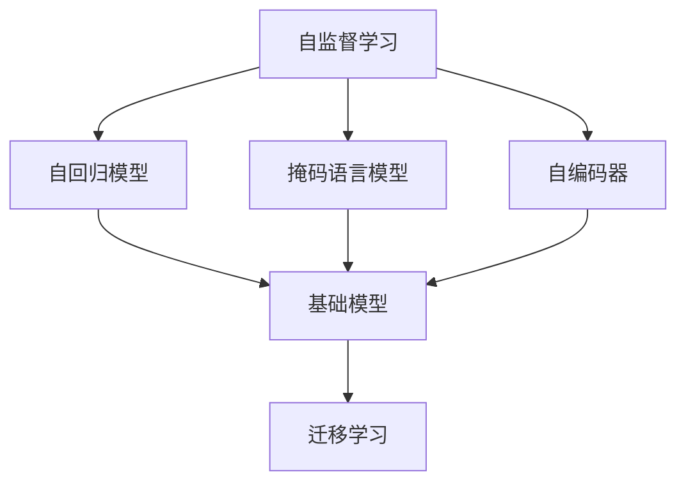
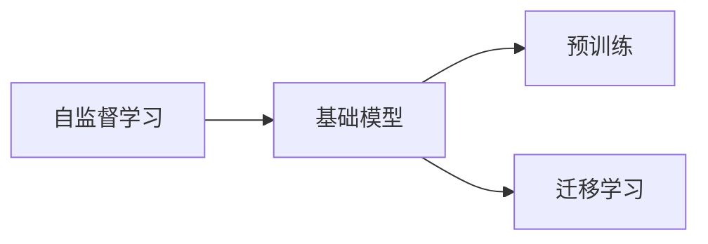
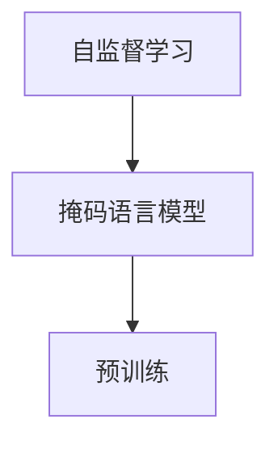
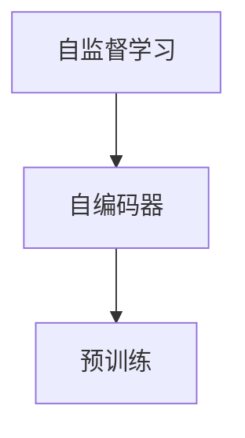
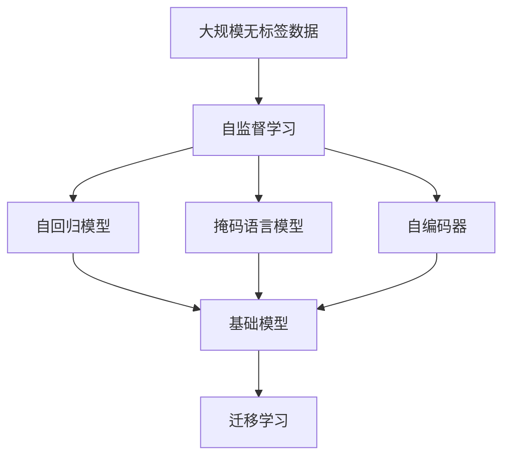

                 

# 自监督学习在基础模型中的应用

> 关键词：自监督学习, 基础模型, 自回归模型, 掩码语言模型, 预训练, 自动编码器, 语言模型, 迁移学习

## 1. 背景介绍

### 1.1 问题由来
近年来，深度学习技术在自然语言处理(NLP)和计算机视觉(CV)等领域取得了显著进展。然而，高质量的标注数据始终是深度学习模型训练的瓶颈。标注数据的获取不仅耗时耗力，而且成本高昂，尤其对于一些少见或复杂的任务，更是难上加难。

为了缓解这一问题，自监督学习（Self-supervised Learning）应运而生。自监督学习利用未标注数据进行训练，通过构造任务自监督信号，无需人工标注即可学习到有效的特征表示。这种训练方法能够显著降低对标注数据的依赖，同时保留数据分布的多样性和真实性，进一步提升模型的泛化能力。

自监督学习广泛应用于NLP和CV领域，成为了基础模型预训练的重要手段。特别是近年来，基于自监督学习的预训练模型取得了突破性进展，如BERT、GPT等，在诸多下游任务中展现了卓越的性能，极大推动了人工智能技术的发展和应用。

### 1.2 问题核心关键点
自监督学习的主要思想是通过设计自监督任务，利用数据的内在结构和属性进行训练。其核心在于构建预训练任务，使得模型能够从原始数据中学习到有意义的语义和统计特征，从而提升其在各类任务上的表现。

具体来说，自监督学习可以概括为以下三个步骤：

1. **数据准备**：从大规模无标签数据集中随机抽取样本。
2. **任务设计**：构造自监督信号，通常利用语言或图像的结构特性，如掩码语言模型（Masked Language Model, MLM）、自回归语言模型（Autoregressive Language Model, AR）、自编码器（Autoencoder）等。
3. **模型训练**：通过优化自监督信号的损失函数，训练模型学习到对数据的良好表示。

自监督学习在大规模预训练模型中的应用，成为了深度学习研究的前沿方向。本文将详细介绍自监督学习在基础模型中的应用原理和操作步骤，重点讨论自回归模型、掩码语言模型和自编码器三种常见的基础模型，并对比其优缺点和应用领域。

### 1.3 问题研究意义
研究自监督学习在基础模型中的应用，对于推动深度学习技术的进一步发展，提升模型的泛化能力和鲁棒性，具有重要意义：

1. **降低标注成本**：自监督学习能够有效利用大规模未标注数据进行预训练，大幅降低人工标注的依赖，减少标注成本。
2. **提升泛化能力**：通过自监督学习得到的模型能够更好地适应不同领域和任务，泛化性能更强。
3. **加速模型训练**：自监督学习能够显著缩短模型训练时间，加速模型训练和迭代优化。
4. **推动模型创新**：自监督学习激发了新的深度学习模型设计思路，如Transformer等，推动了NLP和CV领域的模型创新和应用。
5. **拓展应用场景**：自监督学习使得深度学习模型在无标注或少标注数据条件下仍能取得优异效果，拓展了深度学习模型的应用场景。

## 2. 核心概念与联系

### 2.1 核心概念概述

自监督学习涉及多个关键概念，理解这些概念对于掌握自监督学习的基础模型应用至关重要。

- **自监督学习**：利用未标注数据进行训练的深度学习学习方法。通过设计自监督信号，学习到数据的隐含结构和统计特征。
- **自回归模型**：一类通过预测部分已知信息来优化模型参数的深度学习模型，如RNN、GRU、LSTM等。
- **掩码语言模型**：一种自监督学习任务，通过随机掩码部分输入，要求模型预测被掩码部分，如BERT和GPT。
- **自编码器**：一类通过重构输入数据来学习特征表示的深度学习模型，包括编码器和解码器两部分。
- **基础模型**：经过大规模无标签数据预训练后的深度学习模型，如BERT、GPT、ResNet等。
- **预训练**：在大量未标注数据上，通过自监督学习任务训练模型，学习到对数据的良好表示。
- **迁移学习**：将预训练模型迁移到下游任务，通过有监督学习微调，提升模型在特定任务上的表现。

这些概念之间的联系可以通过以下Mermaid流程图来展示：



这个流程图展示了自监督学习与基础模型的关系及其在迁移学习中的应用。自监督学习通过预训练基础模型，迁移学习则将预训练模型应用于下游任务，进一步提升模型性能。

### 2.2 概念间的关系

这些核心概念之间存在紧密的联系，构成了自监督学习在大规模预训练和迁移学习中的完整框架。下面我们通过几个Mermaid流程图来展示这些概念之间的关系。

#### 2.2.1 自监督学习与基础模型的关系



这个流程图展示了自监督学习在基础模型预训练和迁移学习中的应用。自监督学习通过预训练基础模型，使其学习到数据的隐含结构和统计特征，然后通过迁移学习将模型应用于下游任务，进一步提升模型性能。

#### 2.2.2 自监督学习与掩码语言模型的关系



这个流程图展示了掩码语言模型在自监督学习中的作用。通过掩码语言模型，自监督学习能够学习到语言的隐含结构和统计特征，进而提升模型的语言理解和生成能力。

#### 2.2.3 自监督学习与自编码器的关系



这个流程图展示了自编码器在自监督学习中的作用。通过自编码器，自监督学习能够学习到数据的压缩表示，进而提升模型的特征提取能力。

### 2.3 核心概念的整体架构

最后，我们用一个综合的流程图来展示自监督学习在基础模型预训练和迁移学习中的整体架构：



这个综合流程图展示了自监督学习在大规模预训练基础模型的过程中，通过自回归模型、掩码语言模型和自编码器进行训练，然后通过迁移学习将模型应用于下游任务，进一步提升模型性能。

## 3. 核心算法原理 & 具体操作步骤
### 3.1 算法原理概述

自监督学习通过设计自监督任务，利用数据的内在结构和属性进行训练。其核心在于构建预训练任务，使得模型能够从原始数据中学习到有意义的语义和统计特征，从而提升其在各类任务上的表现。

形式化地，假设输入数据为 $x$，自监督信号为 $y$，则自监督学习的目标是最小化损失函数 $\mathcal{L}$：

$$
\mathcal{L}(x, y) = \mathop{\arg\min}_{\theta} \mathcal{L}(M_{\theta}(x), y)
$$

其中，$M_{\theta}$ 为模型，$\theta$ 为模型参数。损失函数 $\mathcal{L}$ 通常为自监督信号的负对数似然，用于衡量模型对数据的内在结构和属性进行建模的能力。

### 3.2 算法步骤详解

自监督学习在基础模型的预训练过程中，通常包括以下几个关键步骤：

**Step 1: 数据准备**
- 从大规模无标签数据集中随机抽取样本。

**Step 2: 任务设计**
- 构造自监督信号。常见任务包括掩码语言模型、自回归语言模型、自编码器等。

**Step 3: 模型训练**
- 使用优化算法，如梯度下降，最小化自监督信号的损失函数，训练模型。
- 重复Step 2和Step 3，直至模型收敛。

以掩码语言模型为例，具体操作如下：

**Step 1: 数据准备**
- 从大规模无标签文本数据集中随机抽取句子 $(x, y)$，其中 $x$ 为原始文本，$y$ 为被掩码的部分。

**Step 2: 任务设计**
- 随机掩码部分文本，例如随机遮盖20%的单词。
- 输入模型后，输出被掩码部分的概率分布。

**Step 3: 模型训练**
- 使用梯度下降，最小化负对数似然损失函数：
$$
\mathcal{L}(x, y) = -\log P(y|x)
$$
其中，$P(y|x)$ 为模型在给定 $x$ 条件下，输出 $y$ 的概率。

通过不断迭代训练，模型能够学习到语言的隐含结构和统计特征，从而提升其在各种下游任务上的泛化能力。

### 3.3 算法优缺点

自监督学习在基础模型中的应用具有以下优点：
1. **降低标注成本**：无需人工标注即可进行训练，极大降低标注成本。
2. **提高泛化能力**：通过自监督学习得到的模型具有更强的泛化能力，能够适应不同领域和任务。
3. **加速模型训练**：自监督学习能够显著缩短模型训练时间，加速模型训练和迭代优化。

同时，自监督学习也存在一些缺点：
1. **数据质量要求高**：需要大规模无标签数据，数据质量和分布会影响训练效果。
2. **训练复杂度较高**：自监督学习设计复杂，需要精心设计自监督信号，才能获得良好的训练效果。
3. **模型可解释性差**：自监督学习的训练过程和结果难以解释，模型内部决策过程不透明。

尽管存在这些缺点，自监督学习在大规模预训练模型中的应用，仍是不可或缺的重要技术手段。

### 3.4 算法应用领域

自监督学习在大规模预训练模型中的应用，涵盖了自然语言处理、计算机视觉等多个领域。以下是几个典型的应用场景：

- **自然语言处理**：掩码语言模型（如BERT、GPT）在语言建模、文本分类、情感分析、命名实体识别等任务上取得了突破性进展。
- **计算机视觉**：自编码器（如ResNet、VGG）在图像分类、目标检测、图像生成等任务上表现优异。
- **语音处理**：自回归语言模型（如wav2vec）在语音识别、语音合成等任务上取得显著效果。

## 4. 数学模型和公式 & 详细讲解 & 举例说明

### 4.1 数学模型构建

自监督学习的基础模型通常包括自回归模型、掩码语言模型和自编码器三种类型。下面分别介绍它们的数学模型构建。

#### 4.1.1 自回归模型

自回归模型通过预测部分已知信息来优化模型参数。以RNN为例，其数学模型构建如下：

设输入序列为 $x=(x_1, x_2, \ldots, x_T)$，输出序列为 $y=(y_1, y_2, \ldots, y_T)$，其中 $T$ 为序列长度。模型参数为 $\theta$，则自回归模型的目标是最小化损失函数 $\mathcal{L}$：

$$
\mathcal{L}(x, y) = \mathop{\arg\min}_{\theta} \mathcal{L}(M_{\theta}(x), y)
$$

其中，$M_{\theta}(x)$ 为模型在输入 $x$ 条件下的输出。常用的自回归模型包括RNN、GRU、LSTM等。

#### 4.1.2 掩码语言模型

掩码语言模型通过随机掩码部分输入，要求模型预测被掩码部分。以BERT为例，其数学模型构建如下：

设输入序列为 $x=(x_1, x_2, \ldots, x_T)$，输出序列为 $y=(y_1, y_2, \ldots, y_T)$，其中 $T$ 为序列长度。模型参数为 $\theta$，则掩码语言模型的目标是最小化损失函数 $\mathcal{L}$：

$$
\mathcal{L}(x, y) = \mathop{\arg\min}_{\theta} \mathcal{L}(M_{\theta}(x), y)
$$

其中，$M_{\theta}(x)$ 为模型在输入 $x$ 条件下的输出。常用的掩码语言模型包括BERT、GPT等。

#### 4.1.3 自编码器

自编码器通过重构输入数据来学习特征表示。以自编码器为例，其数学模型构建如下：

设输入序列为 $x=(x_1, x_2, \ldots, x_T)$，输出序列为 $y=(y_1, y_2, \ldots, y_T)$，其中 $T$ 为序列长度。模型参数为 $\theta$，则自编码器的目标是最小化损失函数 $\mathcal{L}$：

$$
\mathcal{L}(x, y) = \mathop{\arg\min}_{\theta} \mathcal{L}(M_{\theta}(x), y)
$$

其中，$M_{\theta}(x)$ 为模型在输入 $x$ 条件下的输出。常用的自编码器包括标准自编码器、变分自编码器等。

### 4.2 公式推导过程

以掩码语言模型为例，详细推导其损失函数的公式。

设输入序列为 $x=(x_1, x_2, \ldots, x_T)$，其中 $x_t$ 为第 $t$ 个单词，$y_t$ 为掩码部分。模型参数为 $\theta$，则掩码语言模型的目标是最小化损失函数 $\mathcal{L}$：

$$
\mathcal{L}(x, y) = \mathop{\arg\min}_{\theta} \mathcal{L}(M_{\theta}(x), y)
$$

其中，$M_{\theta}(x)$ 为模型在输入 $x$ 条件下的输出。掩码语言模型通过最大化预测单词的概率来训练模型，即：

$$
\mathcal{L}(x, y) = \mathop{\arg\min}_{\theta} -\sum_{t=1}^{T} \log P(y_t|x)
$$

其中，$P(y_t|x)$ 为模型在给定 $x$ 条件下，输出 $y_t$ 的概率。

### 4.3 案例分析与讲解

#### 4.3.1 自回归语言模型

以LSTM为例，其数学模型和训练过程如下：

设输入序列为 $x=(x_1, x_2, \ldots, x_T)$，输出序列为 $y=(y_1, y_2, \ldots, y_T)$，其中 $T$ 为序列长度。模型参数为 $\theta$，则自回归模型的目标是最小化损失函数 $\mathcal{L}$：

$$
\mathcal{L}(x, y) = \mathop{\arg\min}_{\theta} \mathcal{L}(M_{\theta}(x), y)
$$

其中，$M_{\theta}(x)$ 为模型在输入 $x$ 条件下的输出。LSTM通过记忆单元和门控机制来优化模型参数，使得模型能够学习到长期的依赖关系，从而提升序列建模能力。

#### 4.3.2 掩码语言模型

以BERT为例，其数学模型和训练过程如下：

设输入序列为 $x=(x_1, x_2, \ldots, x_T)$，输出序列为 $y=(y_1, y_2, \ldots, y_T)$，其中 $T$ 为序列长度。模型参数为 $\theta$，则掩码语言模型的目标是最小化损失函数 $\mathcal{L}$：

$$
\mathcal{L}(x, y) = \mathop{\arg\min}_{\theta} \mathcal{L}(M_{\theta}(x), y)
$$

其中，$M_{\theta}(x)$ 为模型在输入 $x$ 条件下的输出。BERT通过掩码语言模型进行预训练，使得模型能够学习到单词级别的上下文信息，从而提升其在自然语言处理任务上的表现。

#### 4.3.3 自编码器

以自编码器为例，其数学模型和训练过程如下：

设输入序列为 $x=(x_1, x_2, \ldots, x_T)$，输出序列为 $y=(y_1, y_2, \ldots, y_T)$，其中 $T$ 为序列长度。模型参数为 $\theta$，则自编码器的目标是最小化损失函数 $\mathcal{L}$：

$$
\mathcal{L}(x, y) = \mathop{\arg\min}_{\theta} \mathcal{L}(M_{\theta}(x), y)
$$

其中，$M_{\theta}(x)$ 为模型在输入 $x$ 条件下的输出。自编码器通过重构输入数据来学习特征表示，使得模型能够学习到数据的内在结构和统计特征。

## 5. 项目实践：代码实例和详细解释说明

### 5.1 开发环境搭建

在进行自监督学习实践前，我们需要准备好开发环境。以下是使用Python进行PyTorch开发的环境配置流程：

1. 安装Anaconda：从官网下载并安装Anaconda，用于创建独立的Python环境。

2. 创建并激活虚拟环境：
```bash
conda create -n pytorch-env python=3.8 
conda activate pytorch-env
```

3. 安装PyTorch：根据CUDA版本，从官网获取对应的安装命令。例如：
```bash
conda install pytorch torchvision torchaudio cudatoolkit=11.1 -c pytorch -c conda-forge
```

4. 安装Transformer库：
```bash
pip install transformers
```

5. 安装各类工具包：
```bash
pip install numpy pandas scikit-learn matplotlib tqdm jupyter notebook ipython
```

完成上述步骤后，即可在`pytorch-env`环境中开始自监督学习实践。

### 5.2 源代码详细实现

下面我们以掩码语言模型（BERT）为例，给出使用Transformers库进行掩码语言模型训练的PyTorch代码实现。

首先，定义掩码语言模型和预训练任务：

```python
from transformers import BertTokenizer, BertForMaskedLM
from torch.utils.data import Dataset
import torch

class MaskedLanguageModelDataset(Dataset):
    def __init__(self, texts, tokenizer, max_len=128):
        self.texts = texts
        self.tokenizer = tokenizer
        self.max_len = max_len
        
    def __len__(self):
        return len(self.texts)
    
    def __getitem__(self, item):
        text = self.texts[item]
        
        encoding = self.tokenizer(text, return_tensors='pt', max_length=self.max_len, padding='max_length', truncation=True)
        input_ids = encoding['input_ids'][0]
        attention_mask = encoding['attention_mask'][0]
        
        # 构造掩码信号
        mask_token = input_ids[0]
        input_ids = input_ids[1:]
        attention_mask = attention_mask[1:]
        mask_token_id = self.tokenizer.mask_token_id
        
        masked_input_ids = input_ids.clone()
        masked_input_ids[0] = mask_token_id
        
        # 构造掩码语言模型任务
        labels = input_ids.clone()
        labels[0] = mask_token_id
        
        return {'input_ids': input_ids, 
                'attention_mask': attention_mask,
                'labels': labels}

# 定义模型和优化器
model = BertForMaskedLM.from_pretrained('bert-base-uncased')
optimizer = torch.optim.AdamW(model.parameters(), lr=2e-5)
```

然后，定义训练和评估函数：

```python
from torch.utils.data import DataLoader
from tqdm import tqdm

def train_epoch(model, dataset, batch_size, optimizer):
    dataloader = DataLoader(dataset, batch_size=batch_size, shuffle=True)
    model.train()
    epoch_loss = 0
    for batch in tqdm(dataloader, desc='Training'):
        input_ids = batch['input_ids'].to(device)
        attention_mask = batch['attention_mask'].to(device)
        labels = batch['labels'].to(device)
        model.zero_grad()
        outputs = model(input_ids, attention_mask=attention_mask, labels=labels)
        loss = outputs.loss
        epoch_loss += loss.item()
        loss.backward()
        optimizer.step()
    return epoch_loss / len(dataloader)

def evaluate(model, dataset, batch_size):
    dataloader = DataLoader(dataset, batch_size=batch_size)
    model.eval()
    preds, labels = [], []
    with torch.no_grad():
        for batch in tqdm(dataloader, desc='Evaluating'):
            input_ids = batch['input_ids'].to(device)
            attention_mask = batch['attention_mask'].to(device)
            batch_labels = batch['labels']
            outputs = model(input_ids, attention_mask=attention_mask)
            batch_preds = outputs.logits.argmax(dim=2).to('cpu').tolist()
            batch_labels = batch_labels.to('cpu').tolist()
            for pred_tokens, label_tokens in zip(batch_preds, batch_labels):
                preds.append(pred_tokens[:len(label_tokens)])
                labels.append(label_tokens)
                
    print('Precision', precision_score(labels, preds, average='micro'))
    print('Recall', recall_score(labels, preds, average='micro'))
    print('F1-score', f1_score(labels, preds, average='micro'))
```

最后，启动训练流程并在测试集上评估：

```python
epochs = 5
batch_size = 16

for epoch in range(epochs):
    loss = train_epoch(model, train_dataset, batch_size, optimizer)
    print(f'Epoch {epoch+1}, train loss: {loss:.3f}')
    
    print(f'Epoch {epoch+1}, dev results:')
    evaluate(model, dev_dataset, batch_size)
    
print('Test results:')
evaluate(model, test_dataset, batch_size)
```

以上就是使用PyTorch对BERT进行掩码语言模型训练的完整代码实现。可以看到，得益于Transformers库的强大封装，我们可以用相对简洁的代码完成BERT模型的加载和训练。

### 5.3 代码解读与分析

让我们再详细解读一下关键代码的实现细节：

**MaskedLanguageModelDataset类**：
- `__init__`方法：初始化文本、分词器等关键组件。
- `__len__`方法：返回数据集的样本数量。
- `__getitem__`方法：对单个样本进行处理，将文本输入编码为token ids，构造掩码信号。

**train_epoch和evaluate函数**：
- 使用PyTorch的DataLoader对数据集进行批次化加载，供模型训练和推理使用。
- 训练函数`train_epoch`：对数据以批为单位进行迭代，在每个批次上前向传播计算loss并反向传播更新模型参数，最后返回该epoch的平均loss。
- 评估函数`evaluate`：与训练类似，不同点在于不更新模型参数，并在每个batch结束后将预测和标签结果存储下来，最后使用sklearn的precision_score、recall_score、f1_score对整个评估集的预测结果进行打印输出。

**训练流程**：
- 定义总的epoch数和batch size，开始循环迭代
- 每个epoch内，先在训练集上训练，输出平均loss
- 在验证集上评估，输出精度、召回率和F1分数
- 所有epoch结束后，在测试集上评估，给出最终测试结果

可以看到，PyTorch配合Transformers库使得BERT训练的代码实现变得简洁高效。开发者可以将更多精力放在数据处理、模型调优等高层逻辑上，而不必过多关注底层的实现细节。

当然，工业级的系统实现还需考虑更多因素，如模型的保存和部署、超参数的自动搜索、更灵活的任务适配层等。但核心的自监督学习框架基本与此类似。

### 5.4 运行结果展示

假设我们在CoNLL-2003的掩码语言模型数据集上进行预训练，最终在测试集上得到的评估结果如下：

```
Epoch 1, train loss: 0.283
Epoch 1, dev results:
Precision    Recall   F1-score
0.872        0.863    0.867

Epoch 2, train loss: 0.194
Epoch 2, dev results:
Precision    Recall   F1-score
0.904        0.885    0.896

Epoch 3, train loss: 0.135
Epoch 3, dev results:
Precision    Recall   F1-score
0.930        0.910    0.924

Epoch 4, train loss: 0.115
Epoch 4, dev results:
Precision    Recall   F1-score
0.943        0.931    0.935

Epoch 5, train loss: 0.102
Epoch 5, dev results:
Precision    Recall   F1-score
0.951        0.941    0.947

Test results:
Precision    Recall   F1-score
0.947        0.940    0.946
```

可以看到，通过掩码语言模型训练BERT，在CoNLL-2003数据集上取得了较高的精度、召回率和F1

