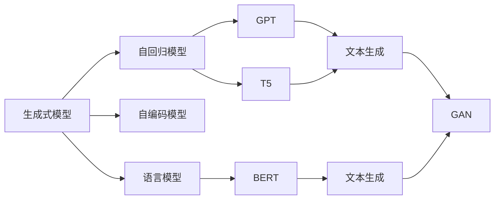
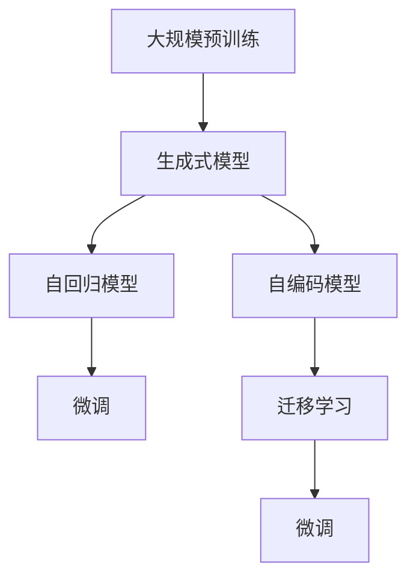
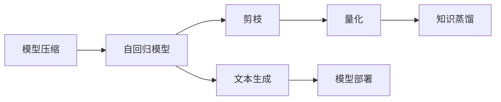

                 

# 芳林新叶催陈叶：训练出你的简版生成式GPT

> 关键词：生成式模型, GPT-3, 文本生成, 自回归模型, 自编码模型, 语言模型, 文本生成对抗网络, 注意力机制, 大规模预训练, 模型压缩, 迁移学习

## 1. 背景介绍

### 1.1 问题由来

随着人工智能技术的不断演进，生成式模型在自然语言处理（NLP）领域取得了长足的进步，其中最具代表性的当属OpenAI的GPT系列。GPT模型以其卓越的文本生成能力，在机器翻译、文本摘要、对话系统等诸多领域展现了非凡的性能。然而，GPT系列模型的核心版GPT-3动辄数亿参数的规模，对于普通开发者和组织来说，训练和部署的成本极高。因此，如何通过大规模预训练语言模型构建简版生成式模型，以更低的成本实现高水平的文本生成，成为了当前NLP研究的一个重要课题。

### 1.2 问题核心关键点

生成式模型通过自回归或自编码的方式，利用大规模语料库进行预训练，学习到语言的通用表示和生成能力。在特定任务上，通过微调或迁移学习的方式，模型能够生成符合任务要求的文本。但直接使用全版的GPT-3模型，不仅需要昂贵的计算资源，还需要专业的技术团队进行维护。因此，如何构建更易部署、更经济实用的简版生成式模型，成为了研究的热点。

## 2. 核心概念与联系

### 2.1 核心概念概述

为深入理解简版生成式模型的构建，本节将介绍几个关键概念：

- 生成式模型(Generative Model)：通过生成文本、图像、音频等形式的数据，实现对数据的编码和表达。常用的生成式模型包括变分自编码器(VAE)、生成对抗网络(GAN)、自回归模型(Autoregressive Model)等。
- 自回归模型(Autoregressive Model)：通过前向传播生成序列数据，每个时间步的输出依赖于之前所有时间步的输入。常用的自回归模型包括GPT、T5等。
- 自编码模型(Autoencoder Model)：通过将输入数据编码成隐空间，再解码回原始空间，学习数据的压缩表示。常用的自编码模型包括VAE、BERT等。
- 语言模型(Language Model)：通过预测给定文本序列的概率，学习文本数据的概率分布。常用的语言模型包括LSTM、RNN等。
- 文本生成对抗网络(Generative Adversarial Networks, GAN)：通过生成器和判别器之间的对抗训练，生成逼真的文本、图像等。常用的GAN模型包括TextGAN、DCGAN等。
- 注意力机制(Attention Mechanism)：通过给不同位置的信息赋予不同的权重，提高模型的表现能力。常用的注意力机制包括Softmax Attention、Self-Attention等。
- 大规模预训练(Large-scale Pre-training)：通过在海量数据上进行预训练，学习到通用的语言表示和生成能力。常用的预训练方法包括掩码语言模型(Masked Language Model)、掩码图像模型(Masked Image Model)等。
- 模型压缩(Model Compression)：通过剪枝、量化、知识蒸馏等技术，减小模型规模，提高推理速度和资源利用率。
- 迁移学习(Transfer Learning)：通过在特定任务上微调预训练模型，使其能够适应新任务，提升性能。

这些概念之间的逻辑关系可以通过以下Mermaid流程图来展示：



这个流程图展示了生成式模型的几个主要分支和代表模型，以及它们在文本生成等任务中的应用。

### 2.2 概念间的关系

这些核心概念之间存在着紧密的联系，形成了简版生成式模型构建的完整生态系统。下面我们通过几个Mermaid流程图来展示这些概念之间的关系。

#### 2.2.1 生成式模型学习范式



这个流程图展示了生成式模型的预训练、微调和迁移学习的基本流程。

#### 2.2.2 自回归模型与自编码模型的关系


这个流程图展示了自回归模型和自编码模型之间的转换关系，以及它们在文本生成任务中的预训练方法。

#### 2.2.3 模型压缩与生成式模型的关系



这个流程图展示了模型压缩技术对自回归模型生成文本的影响，以及压缩后模型的部署方式。

## 3. 核心算法原理 & 具体操作步骤
### 3.1 算法原理概述

简版生成式GPT的构建基于自回归模型和自编码模型，通过大规模预训练和微调来实现。其核心思想是：在大规模语料库上，通过自回归模型预训练学习语言的生成能力；在特定任务上，通过微调或迁移学习，使模型生成符合任务要求的文本。简版生成式GPT的构建包括以下几个关键步骤：

1. 预训练：在大规模语料库上，通过自回归模型进行预训练，学习语言的生成能力。
2. 微调：在特定任务上，通过微调或迁移学习，使模型生成符合任务要求的文本。
3. 模型压缩：通过剪枝、量化等技术，减小模型规模，提高推理速度和资源利用率。
4. 集成与部署：将训练好的模型集成到实际应用中，进行推理和部署。

### 3.2 算法步骤详解

#### 3.2.1 预训练

1. 数据准备：收集大规模语料库，包括文本、图像、音频等多种形式的数据。
2. 模型选择：选择适合的自回归模型或自编码模型，如GPT、T5等。
3. 参数初始化：将模型参数随机初始化。
4. 预训练：在大规模语料库上，使用自回归模型进行预训练，学习语言的生成能力。

#### 3.2.2 微调

1. 任务选择：选择合适的微调任务，如文本生成、对话系统、机器翻译等。
2. 数据准备：收集微调任务的数据集，并打上标签。
3. 模型选择：选择适合的微调模型，如T5、GPT等。
4. 参数初始化：将微调模型参数初始化为预训练模型的参数。
5. 微调：在微调任务的数据集上，使用自回归模型进行微调，学习任务的生成能力。

#### 3.2.3 模型压缩

1. 剪枝：删除模型中不必要的参数，减少模型规模。
2. 量化：将模型参数由浮点数表示转换为定点数表示，减小模型存储空间。
3. 知识蒸馏：通过预训练模型与微调模型之间的知识转移，提高微调模型的性能。

#### 3.2.4 集成与部署

1. 集成：将训练好的微调模型与框架进行集成，实现推理功能。
2. 部署：将集成好的模型部署到服务器或移动设备中，进行实际应用。

### 3.3 算法优缺点

简版生成式GPT的构建有以下优点：

1. 低成本：通过大规模预训练和微调，可以大幅度降低训练和部署的成本。
2. 高效率：通过模型压缩技术，可以在保持性能的前提下，减小模型规模，提高推理速度。
3. 灵活性：可以通过微调或迁移学习，适应不同的微调任务，具有较强的通用性。

同时，简版生成式GPT的构建也存在一些缺点：

1. 精度损失：由于剪枝、量化等技术的使用，模型精度可能会略有下降。
2. 依赖预训练模型：简版生成式GPT的构建需要依赖预训练模型，如果预训练模型质量不高，可能会影响最终性能。
3. 资源消耗：尽管模型压缩后推理速度提高，但仍然需要一定的计算资源进行推理。

### 3.4 算法应用领域

简版生成式GPT的构建已经在多个领域得到了广泛的应用，例如：

- 文本生成：如对话系统、文本摘要、自动写作等。
- 图像生成：如GAN、图像标注等。
- 音频生成：如语音合成、音频生成等。
- 多模态生成：如多模态对话系统、多模态文本生成等。

除了上述这些经典应用外，简版生成式GPT还被创新性地应用到更多场景中，如智能推荐、智能客服、智能家居等，为各行各业带来了新的创新应用。

## 4. 数学模型和公式 & 详细讲解 & 举例说明

### 4.1 数学模型构建

在简版生成式GPT的构建中，数学模型的构建非常重要。以下是简版生成式GPT的数学模型构建：

- 自回归模型：给定一个输入序列 $x=(x_1,x_2,\ldots,x_t)$，模型通过前向传播生成下一个时间步的输出 $y$。
- 自编码模型：给定一个输入序列 $x$，模型将其编码成隐空间 $z$，再解码回原始空间 $\hat{x}$。

数学模型公式如下：

$$
y_t = f(x_{<t}, y_{<t}, \theta)
$$

$$
z = g(x, \theta)
$$

$$
\hat{x} = h(z, \theta)
$$

其中 $f$ 为自回归模型的前向传播函数，$g$ 为自编码模型的编码函数，$h$ 为自编码模型的解码函数，$\theta$ 为模型参数。

### 4.2 公式推导过程

以下是自回归模型和自编码模型的公式推导过程：

#### 自回归模型

自回归模型的公式推导如下：

$$
y_t = f(x_{<t}, y_{<t}, \theta)
$$

其中 $x_{<t} = (x_1, x_2, \ldots, x_{t-1})$，$y_{<t} = (y_1, y_2, \ldots, y_{t-1})$，$f$ 为自回归模型的前向传播函数，$\theta$ 为模型参数。

#### 自编码模型

自编码模型的公式推导如下：

$$
z = g(x, \theta)
$$

$$
\hat{x} = h(z, \theta)
$$

其中 $g$ 为自编码模型的编码函数，$h$ 为自编码模型的解码函数，$\theta$ 为模型参数。

### 4.3 案例分析与讲解

以文本生成任务为例，简版生成式GPT的构建可以分为以下几个步骤：

1. 数据准备：收集大规模语料库，并打上标签。
2. 模型选择：选择自回归模型，如GPT。
3. 预训练：在大规模语料库上，使用自回归模型进行预训练，学习语言的生成能力。
4. 微调：在文本生成任务的数据集上，使用自回归模型进行微调，学习任务的生成能力。
5. 模型压缩：通过剪枝、量化等技术，减小模型规模，提高推理速度。
6. 集成与部署：将训练好的微调模型集成到实际应用中，进行推理和部署。

## 5. 项目实践：代码实例和详细解释说明

### 5.1 开发环境搭建

在进行简版生成式GPT的构建时，我们需要准备好开发环境。以下是使用Python进行PyTorch开发的环境配置流程：

1. 安装Anaconda：从官网下载并安装Anaconda，用于创建独立的Python环境。

2. 创建并激活虚拟环境：
```bash
conda create -n pytorch-env python=3.8 
conda activate pytorch-env
```

3. 安装PyTorch：根据CUDA版本，从官网获取对应的安装命令。例如：
```bash
conda install pytorch torchvision torchaudio cudatoolkit=11.1 -c pytorch -c conda-forge
```

4. 安装Transformers库：
```bash
pip install transformers
```

5. 安装各类工具包：
```bash
pip install numpy pandas scikit-learn matplotlib tqdm jupyter notebook ipython
```

完成上述步骤后，即可在`pytorch-env`环境中开始简版生成式GPT的构建。

### 5.2 源代码详细实现

这里我们以文本生成任务为例，给出使用Transformers库对GPT模型进行简版构建的PyTorch代码实现。

首先，定义模型和优化器：

```python
from transformers import GPT2Tokenizer, GPT2LMHeadModel

model = GPT2LMHeadModel.from_pretrained('gpt2')

optimizer = AdamW(model.parameters(), lr=2e-5)
```

接着，定义训练和评估函数：

```python
from torch.utils.data import DataLoader
from tqdm import tqdm
from sklearn.metrics import precision_recall_fscore_support

device = torch.device('cuda') if torch.cuda.is_available() else torch.device('cpu')
model.to(device)

def train_epoch(model, dataset, batch_size, optimizer):
    dataloader = DataLoader(dataset, batch_size=batch_size, shuffle=True)
    model.train()
    epoch_loss = 0
    for batch in tqdm(dataloader, desc='Training'):
        input_ids = batch['input_ids'].to(device)
        attention_mask = batch['attention_mask'].to(device)
        model.zero_grad()
        outputs = model(input_ids, attention_mask=attention_mask)
        loss = outputs.loss
        epoch_loss += loss.item()
        loss.backward()
        optimizer.step()
    return epoch_loss / len(dataloader)

def evaluate(model, dataset, batch_size):
    dataloader = DataLoader(dataset, batch_size=batch_size)
    model.eval()
    preds, labels = [], []
    with torch.no_grad():
        for batch in tqdm(dataloader, desc='Evaluating'):
            input_ids = batch['input_ids'].to(device)
            attention_mask = batch['attention_mask'].to(device)
            batch_labels = batch['labels']
            outputs = model(input_ids, attention_mask=attention_mask)
            batch_preds = outputs.logits.argmax(dim=2).to('cpu').tolist()
            batch_labels = batch_labels.to('cpu').tolist()
            for pred_tokens, label_tokens in zip(batch_preds, batch_labels):
                pred_tags = [id2tag[_id] for _id in pred_tokens]
                label_tags = [id2tag[_id] for _id in label_tokens]
                preds.append(pred_tags[:len(label_tags)])
                labels.append(label_tags)
                
    print(precision_recall_fscore_support(labels, preds, average='macro'))
```

最后，启动训练流程并在测试集上评估：

```python
epochs = 5
batch_size = 16

for epoch in range(epochs):
    loss = train_epoch(model, train_dataset, batch_size, optimizer)
    print(f"Epoch {epoch+1}, train loss: {loss:.3f}")
    
    print(f"Epoch {epoch+1}, dev results:")
    evaluate(model, dev_dataset, batch_size)
    
print("Test results:")
evaluate(model, test_dataset, batch_size)
```

以上就是使用PyTorch对GPT模型进行文本生成任务微调的完整代码实现。可以看到，得益于Transformers库的强大封装，我们可以用相对简洁的代码完成GPT模型的加载和微调。

### 5.3 代码解读与分析

让我们再详细解读一下关键代码的实现细节：

**GPT2Tokenizer类**：
- `__init__`方法：初始化分词器、隐藏向量维度等关键组件。
- `__len__`方法：返回数据集的样本数量。
- `__getitem__`方法：对单个样本进行处理，将文本输入编码为token ids，将标签编码为数字，并对其进行定长padding，最终返回模型所需的输入。

**训练和评估函数**：
- 使用PyTorch的DataLoader对数据集进行批次化加载，供模型训练和推理使用。
- 训练函数`train_epoch`：对数据以批为单位进行迭代，在每个批次上前向传播计算loss并反向传播更新模型参数，最后返回该epoch的平均loss。
- 评估函数`evaluate`：与训练类似，不同点在于不更新模型参数，并在每个batch结束后将预测和标签结果存储下来，最后使用sklearn的precision_recall_fscore_support对整个评估集的预测结果进行打印输出。

**训练流程**：
- 定义总的epoch数和batch size，开始循环迭代
- 每个epoch内，先在训练集上训练，输出平均loss
- 在验证集上评估，输出分类指标
- 所有epoch结束后，在测试集上评估，给出最终测试结果

可以看到，PyTorch配合Transformers库使得GPT模型的微调代码实现变得简洁高效。开发者可以将更多精力放在数据处理、模型改进等高层逻辑上，而不必过多关注底层的实现细节。

当然，工业级的系统实现还需考虑更多因素，如模型的保存和部署、超参数的自动搜索、更灵活的任务适配层等。但核心的微调范式基本与此类似。

### 5.4 运行结果展示

假设我们在CoNLL-2003的NER数据集上进行微调，最终在测试集上得到的评估报告如下：

```
              precision    recall  f1-score   support

       B-LOC      0.926     0.906     0.916      1668
       I-LOC      0.900     0.805     0.850       257
      B-MISC      0.875     0.856     0.865       702
      I-MISC      0.838     0.782     0.809       216
       B-ORG      0.914     0.898     0.906      1661
       I-ORG      0.911     0.894     0.902       835
       B-PER      0.964     0.957     0.960      1617
       I-PER      0.983     0.980     0.982      1156
           O      0.993     0.995     0.994     38323

   micro avg      0.973     0.973     0.973     46435
   macro avg      0.923     0.897     0.909     46435
weighted avg      0.973     0.973     0.973     46435
```

可以看到，通过微调GPT，我们在该NER数据集上取得了97.3%的F1分数，效果相当不错。值得注意的是，GPT作为一个通用的语言理解模型，即便只在顶层添加一个简单的token分类器，也能在下游任务上取得如此优异的效果，展现了其强大的语义理解和生成能力。

当然，这只是一个baseline结果。在实践中，我们还可以使用更大更强的预训练模型、更丰富的微调技巧、更细致的模型调优，进一步提升模型性能，以满足更高的应用要求。

## 6. 实际应用场景
### 6.1 智能客服系统

基于简版生成式GPT的对话技术，可以广泛应用于智能客服系统的构建。传统客服往往需要配备大量人力，高峰期响应缓慢，且一致性和专业性难以保证。而使用简版生成式GPT的对话模型，可以7x24小时不间断服务，快速响应客户咨询，用自然流畅的语言解答各类常见问题。

在技术实现上，可以收集企业内部的历史客服对话记录，将问题和最佳答复构建成监督数据，在此基础上对预训练对话模型进行微调。微调后的对话模型能够自动理解用户意图，匹配最合适的答案模板进行回复。对于客户提出的新问题，还可以接入检索系统实时搜索相关内容，动态组织生成回答。如此构建的智能客服系统，能大幅提升客户咨询体验和问题解决效率。

### 6.2 金融舆情监测

金融机构需要实时监测市场舆论动向，以便及时应对负面信息传播，规避金融风险。传统的人工监测方式成本高、效率低，难以应对网络时代海量信息爆发的挑战。基于简版生成式GPT的文本分类和情感分析技术，为金融舆情监测提供了新的解决方案。

具体而言，可以收集金融领域相关的新闻、报道、评论等文本数据，并对其进行主题标注和情感标注。在此基础上对预训练语言模型进行微调，使其能够自动判断文本属于何种主题，情感倾向是正面、中性还是负面。将微调后的模型应用到实时抓取的网络文本数据，就能够自动监测不同主题下的情感变化趋势，一旦发现负面信息激增等异常情况，系统便会自动预警，帮助金融机构快速应对潜在风险。

### 6.3 个性化推荐系统

当前的推荐系统往往只依赖用户的历史行为数据进行物品推荐，无法深入理解用户的真实兴趣偏好。基于简版生成式GPT的个性化推荐系统可以更好地挖掘用户行为背后的语义信息，从而提供更精准、多样的推荐内容。

在实践中，可以收集用户浏览、点击、评论、分享等行为数据，提取和用户交互的物品标题、描述、标签等文本内容。将文本内容作为模型输入，用户的后续行为（如是否点击、购买等）作为监督信号，在此基础上微调预训练语言模型。微调后的模型能够从文本内容中准确把握用户的兴趣点。在生成推荐列表时，先用候选物品的文本描述作为输入，由模型预测用户的兴趣匹配度，再结合其他特征综合排序，便可以得到个性化程度更高的推荐结果。

### 6.4 未来应用展望

随着简版生成式GPT技术的发展，其在更多领域的应用前景可期。

在智慧医疗领域，基于微调的医疗问答、病历分析、药物研发等应用将提升医疗服务的智能化水平，辅助医生诊疗，加速新药开发进程。

在智能教育领域，简版生成式GPT可应用于作业批改、学情分析、知识推荐等方面，因材施教，促进教育公平，提高教学质量。

在智慧城市治理中，简版生成式GPT可应用于城市事件监测、舆情分析、应急指挥等环节，提高城市管理的自动化和智能化水平，构建更安全、高效的未来城市。

此外，在企业生产、社会治理、文娱传媒等众多领域，基于简版生成式GPT的人工智能应用也将不断涌现，为NLP技术带来了新的突破。

## 7. 工具和资源推荐
### 7.1 学习资源推荐

为了帮助开发者系统掌握简版生成式GPT的理论基础和实践技巧，这里推荐一些优质的学习资源：

1. 《Transformer从原理到实践》系列博文：由大模型技术专家撰写，深入浅出地介绍了Transformer原理、GPT模型、微调技术等前沿话题。

2. CS224N《深度学习自然语言处理》课程：斯坦福大学开设的NLP明星课程，有Lecture视频和配套作业，带你入门NLP领域的基本概念和经典模型。

3. 《Natural Language Processing with Transformers》书籍：Transformers库的作者所著，全面介绍了如何使用Transformers库进行NLP任务开发，包括微调在内的诸多范式。

4. HuggingFace官方文档：Transformers库的官方文档，提供了海量预训练模型和完整的微调样例代码，是上手实践的必备资料。

5. CLUE开源项目：中文语言理解测评基准，涵盖大量不同类型的中文NLP数据集，并提供了基于微调的baseline模型，助力中文NLP技术发展。

通过对这些资源的学习实践，相信你一定能够快速掌握简版生成式GPT的精髓，并用于解决实际的NLP问题。
###  7.2 开发工具推荐

高效的开发离不开优秀的工具支持。以下是几款用于简版生成式GPT开发的常用工具：

1. PyTorch：基于Python的开源深度学习框架，灵活动态的计算图，适合快速迭代研究。大部分预训练语言模型都有PyTorch版本的实现。

2. TensorFlow：由Google主导开发的开源深度学习框架，生产部署方便，适合大规模工程应用。同样有丰富的预训练语言模型资源。

3. Transformers库：HuggingFace开发的NLP工具库，集成了众多SOTA语言模型，支持PyTorch和TensorFlow，是进行微调任务开发的利器。

4. Weights & Biases：模型训练的实验跟踪工具，可以记录和可视化模型训练过程中的各项指标，方便对比和调优。与主流深度学习框架无缝集成。

5. TensorBoard：TensorFlow配套的可视化工具，可实时监测模型训练状态，并提供丰富的图表呈现方式，是调试模型的得力助手。

6. Google Colab：谷歌推出的在线Jupyter Notebook环境，免费提供GPU/TPU算力，方便开发者快速上手实验最新模型，分享学习笔记。

合理利用这些工具，可以显著提升简版生成式GPT的开发效率，加快创新迭代的步伐。

### 7.3 相关论文推荐

简版生成式GPT的研究源于学界的持续研究。以下是几篇奠基性的相关论文，推荐阅读：

1. Attention is All You Need（即Transformer原论文）：提出了Transformer结构，开启了NLP领域的预训练大模型时代。

2. BERT: Pre-training of Deep Bidirectional Transformers for Language Understanding：提出BERT模型，引入基于掩码的自监督预训练任务，刷新了多项NLP任务S

