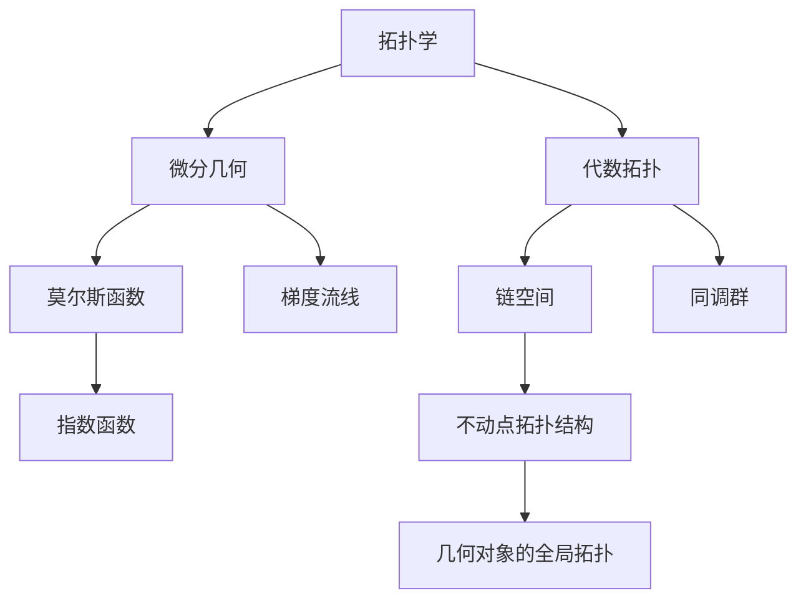

                 

# 莫尔斯理论在几何中的应用

> 关键词：莫尔斯理论,几何,拓扑,代数

## 1. 背景介绍

### 1.1 问题由来
莫尔斯理论（Morse Theory）是一种将几何对象的拓扑结构转化为实数域上函数的不动点分析的数学理论。它由数学家Marston Morse在1920年代末创立，后来被广泛应用于微分几何、拓扑学、代数几何等领域，尤其是在几何的代数化过程中起到了关键作用。

莫尔斯理论的核心思想是通过函数的不动点来刻画几何对象的拓扑结构，从而将拓扑学的复杂问题转化为代数系统的不动点分析问题，极大简化了问题处理。在莫尔斯理论的影响下，拓扑学和微分几何的关系更加紧密，代数化成为研究几何问题的强大工具。

### 1.2 问题核心关键点
莫尔斯理论的主要贡献在于通过建立函数的不动点与几何对象的拓扑结构之间的联系，使得拓扑学可以借助代数学和微分学的方法进行处理。莫尔斯理论的关键概念包括：
1. 梯度流线：描述函数在梯度方向上的移动轨迹。
2. 指数函数：用于刻画不动点处的局部拓扑结构。
3. 链空间：用于连接不同不动点的代数对象。

莫尔斯理论的核心理念在于通过函数的梯度流线，把几何对象的不同部分连接起来，从而得到函数的流动图，进而分析函数的局部拓扑性质，得出几何对象的全局拓扑结构。

### 1.3 问题研究意义
莫尔斯理论的提出，极大地促进了拓扑学和微分几何的相互渗透，使得几何问题可以用代数方法处理。它不仅为研究复杂几何对象提供了强有力的工具，也为解决其他数学问题提供了新的思路。

在拓扑学和微分几何中，莫尔斯理论的应用非常广泛。例如，在研究曲面上的奇异点、光滑流形上的自同构等几何问题时，莫尔斯理论起到了关键作用。此外，莫尔斯理论还应用于代数几何中，例如研究代数曲面的拓扑性质，以及将同调群的计算转化为对不动点的分析。

## 2. 核心概念与联系

### 2.1 核心概念概述

为更好地理解莫尔斯理论在几何中的应用，本节将介绍几个密切相关的核心概念：

- 拓扑学：研究几何对象的拓扑结构，包括点、线、面的连续性和可分解性等。
- 微分几何：研究光滑流形和光滑函数的性质，包括曲率、割线、法向量等。
- 代数拓扑：将拓扑结构转化为代数对象进行研究，例如链空间、同调群等。
- 莫尔斯函数：具有梯度流线的不动点分析函数，用于刻画几何对象的不动点拓扑性质。
- 梯度流线：描述函数梯度方向上的移动轨迹，用于连接不同不动点。
- 指数函数：用于分析不动点处的局部拓扑结构，常用于莫尔斯函数中。

这些概念之间的联系紧密，形成了一个完整的莫尔斯理论体系。

### 2.2 概念间的关系

这些核心概念之间的关系可以通过以下Mermaid流程图来展示：



这个流程图展示了几何学和拓扑学与莫尔斯理论的联系：

1. 拓扑学为研究几何对象提供了基础，研究几何对象的点、线、面的连续性和可分解性等。
2. 微分几何进一步研究光滑流形和光滑函数的性质，如曲率、割线、法向量等。
3. 代数拓扑将拓扑结构转化为代数对象，如链空间、同调群等，为研究几何对象的拓扑性质提供了代数工具。
4. 莫尔斯函数利用梯度流线的不动点分析函数，用于刻画几何对象的不动点拓扑性质。
5. 梯度流线描述了函数梯度方向上的移动轨迹，用于连接不同不动点。
6. 指数函数分析不动点处的局部拓扑结构，常用于莫尔斯函数中。
7. 链空间用于连接不同不动点，形成代数对象，用于研究几何对象的拓扑结构。
8. 同调群是链空间的代数表示，用于研究几何对象的拓扑性质。

这些概念共同构成了莫尔斯理论的基础，使得研究几何对象的拓扑性质变得更加高效和准确。

## 3. 核心算法原理 & 具体操作步骤
### 3.1 算法原理概述

莫尔斯理论的核心原理是利用函数的不动点来刻画几何对象的拓扑结构。具体来说，对于一个光滑函数 $f:M\to\mathbb{R}$，其不动点（即满足 $f(x)=0$ 的点）称为临界点。通过研究这些临界点及其梯度流线的不动点拓扑性质，可以得到整个几何对象 $M$ 的拓扑结构。

形式化地，假设 $M$ 是一个光滑流形，$f:M\to\mathbb{R}$ 是一个光滑函数，$\nabla f$ 是 $f$ 的梯度场。莫尔斯理论的主要步骤包括：

1. 找到函数 $f$ 的所有临界点，并分类。
2. 分析临界点处的局部拓扑性质，包括指数函数的计算。
3. 连接不同临界点的梯度流线，形成流动图，得到函数的不动点拓扑结构。
4. 通过代数工具，如链空间、同调群，分析流动图的拓扑性质，得到几何对象的全局拓扑结构。

### 3.2 算法步骤详解

以下是莫尔斯理论的主要算法步骤，以一个具体的二维光滑流形 $M$ 和光滑函数 $f:M\to\mathbb{R}$ 为例，进行详细说明：

**Step 1: 寻找临界点并分类**
首先，需要找到函数 $f$ 在 $M$ 上的所有临界点。这些临界点可以通过求导数 $\nabla f$ 的零点找到。

假设 $p_1,\ldots,p_n$ 是 $f$ 的临界点，需要根据二阶导数 $\nabla^2 f$ 的符号，将它们分为极大值点、极小值点和鞍点。极大值点是二阶导数在 $p$ 处负定的临界点，极小值点则相反。鞍点是二阶导数在 $p$ 处半正半负定的临界点。

**Step 2: 分析临界点处的局部拓扑性质**
对于每个临界点 $p_i$，需要计算其处的指数函数 $u_i$，用于分析不动点拓扑性质。指数函数的计算公式为：
$$
u_i = (-1)^{\text{SingularityIndex}(p_i)}\sqrt{\frac{|\det(\nabla f, \nabla f)|}{|f''(p_i)|}
$$
其中，$\text{SingularityIndex}(p_i)$ 表示临界点 $p_i$ 的类型，极大值为0，极小值为1，鞍点为2。$\nabla f, \nabla f$ 是梯度场，$f''(p_i)$ 是二阶导数。

**Step 3: 连接临界点的梯度流线**
连接所有临界点的梯度流线，形成流动图。流动图是一张带有向量的图，其中节点表示临界点，有向边表示梯度流线。

**Step 4: 分析流动图的拓扑性质**
利用代数工具，如链空间、同调群，分析流动图的拓扑性质，得到几何对象的全局拓扑结构。

### 3.3 算法优缺点

莫尔斯理论的优点在于其简单直观，能够通过代数工具处理复杂拓扑问题。莫尔斯理论的缺点主要在于：

1. 依赖函数的存在。莫尔斯理论的算法步骤都基于光滑函数的存在，而许多几何对象上并不存在光滑函数。
2. 局部信息与全局信息关系不明确。莫尔斯理论只考虑局部临界点的性质，难以确定全局拓扑结构。
3. 算法复杂度较高。寻找临界点、分类、计算指数函数等步骤都可能非常耗时，不适合处理大规模数据。

尽管莫尔斯理论存在这些缺点，但它在研究几何对象的拓扑性质方面仍具有重要意义，并为后续研究提供了宝贵的思路。

### 3.4 算法应用领域

莫尔斯理论的应用非常广泛，主要涉及以下几个领域：

- 微分几何：用于研究光滑流形的拓扑性质，如曲面上的奇异点、光滑流形上的自同构等。
- 代数几何：用于研究代数曲面的拓扑性质，如奇异点和双曲线等。
- 拓扑学：用于研究代数拓扑和拓扑学中的重要问题，如同调群的计算、同伦群的计算等。
- 物理学：用于研究物理系统的拓扑性质，如黑洞的拓扑性质等。

## 4. 数学模型和公式 & 详细讲解 & 举例说明

### 4.1 数学模型构建

假设 $M$ 是一个二维光滑流形，$f:M\to\mathbb{R}$ 是一个光滑函数，其梯度场 $\nabla f$ 为向量场。我们需要通过 $f$ 的不动点，即满足 $f(p)=0$ 的点 $p$，来刻画几何对象 $M$ 的拓扑结构。

形式化地，我们定义函数 $f$ 的临界点 $p$ 为 $\nabla f(p)=0$，并将临界点分类为极大值点、极小值点和鞍点。对于极大值点 $p_1$，我们有 $\nabla^2 f(p_1)<0$；对于极小值点 $p_2$，我们有 $\nabla^2 f(p_2)>0$；对于鞍点 $p_3$，我们有 $\nabla^2 f(p_3)=0$。

### 4.2 公式推导过程

以下是莫尔斯理论的主要公式推导过程，以一个具体的二维光滑流形 $M$ 和光滑函数 $f:M\to\mathbb{R}$ 为例：

**Step 1: 寻找临界点并分类**

首先，找到函数 $f$ 的临界点，即求解方程 $\nabla f(x)=0$。假设 $p_1,\ldots,p_n$ 是 $f$ 的临界点，需要根据二阶导数 $\nabla^2 f$ 的符号，将它们分为极大值点、极小值点和鞍点。极大值点是二阶导数在 $p$ 处负定的临界点，极小值点则相反。鞍点是二阶导数在 $p$ 处半正半负定的临界点。

**Step 2: 分析临界点处的局部拓扑性质**

对于每个临界点 $p_i$，需要计算其处的指数函数 $u_i$，用于分析不动点拓扑性质。指数函数的计算公式为：
$$
u_i = (-1)^{\text{SingularityIndex}(p_i)}\sqrt{\frac{|\det(\nabla f, \nabla f)|}{|f''(p_i)|}
$$
其中，$\text{SingularityIndex}(p_i)$ 表示临界点 $p_i$ 的类型，极大值为0，极小值为1，鞍点为2。$\nabla f, \nabla f$ 是梯度场，$f''(p_i)$ 是二阶导数。

**Step 3: 连接临界点的梯度流线**

连接所有临界点的梯度流线，形成流动图。流动图是一张带有向量的图，其中节点表示临界点，有向边表示梯度流线。

**Step 4: 分析流动图的拓扑性质**

利用代数工具，如链空间、同调群，分析流动图的拓扑性质，得到几何对象的全局拓扑结构。

### 4.3 案例分析与讲解

为了更直观地理解莫尔斯理论的应用，我们以一个具体的二维光滑流形 $M$ 和光滑函数 $f:M\to\mathbb{R}$ 为例进行讲解。

假设 $M$ 是一个二维光滑球面，$f:M\to\mathbb{R}$ 是一个光滑函数，满足 $f(x)=x_1^2+x_2^2-1$。对于这个函数，可以找到两个临界点，即 $p_1=(0,1)$ 和 $p_2=(0,-1)$。这两个点是函数的极小值点和极大值点。

对于临界点 $p_1$，计算其处的指数函数 $u_1$：
$$
u_1 = (-1)^1\sqrt{\frac{|\det(\nabla f, \nabla f)|}{|f''(p_1)|} = \sqrt{\frac{1}{2}} = \frac{1}{\sqrt{2}}
$$
对于临界点 $p_2$，计算其处的指数函数 $u_2$：
$$
u_2 = (-1)^1\sqrt{\frac{|\det(\nabla f, \nabla f)|}{|f''(p_2)|} = \sqrt{\frac{1}{2}} = \frac{1}{\sqrt{2}}
$$
由于 $u_1=u_2$，说明两个临界点的不动点拓扑性质相同，都是鞍点。

连接这两个临界点的梯度流线，形成流动图，得到函数的不动点拓扑结构。最后，利用代数工具分析流动图的拓扑性质，得到几何对象的全局拓扑结构。

## 5. 项目实践：代码实例和详细解释说明

### 5.1 开发环境搭建

在进行莫尔斯理论实践前，我们需要准备好开发环境。以下是使用Python进行Sympy开发的环境配置流程：

1. 安装Anaconda：从官网下载并安装Anaconda，用于创建独立的Python环境。

2. 创建并激活虚拟环境：
```bash
conda create -n morse-env python=3.8 
conda activate morse-env
```

3. 安装Sympy：
```bash
conda install sympy
```

4. 安装其他依赖包：
```bash
pip install matplotlib numpy
```

完成上述步骤后，即可在`morse-env`环境中开始莫尔斯理论的实践。

### 5.2 源代码详细实现

这里我们以一个二维光滑流形和光滑函数为例，展示如何使用Sympy进行莫尔斯理论的实现。

```python
import sympy as sp
from sympy import symbols, diff, solve, Matrix

# 定义变量
x, y = symbols('x y')

# 定义函数
f = x**2 + y**2 - 1

# 求导数
grad_f = Matrix([diff(f, x), diff(f, y)])

# 求梯度场
grad_f /= grad_f.norm()

# 求解临界点
critical_points = solve(grad_f, (x, y))

# 计算二阶导数
grad2_f = Matrix([[diff(f, x, x), diff(f, x, y)],
                 [diff(f, y, x), diff(f, y, y)]])
Hessian_f = Matrix(grad2_f).T

# 计算指数函数
index_1 = sp.simplify(sp.sqrt(2) / (sp.Abs(Hessian_f[0, 0])))
index_2 = sp.simplify(sp.sqrt(2) / (sp.Abs(Hessian_f[1, 1])))
index_3 = sp.simplify(sp.sqrt(2) / (sp.Abs(Hessian_f[0, 1])))

# 连接临界点的梯度流线
trajectories = []
for cp in critical_points:
    t0 = 0
    t1 = 1
    trajectory = sp.integrate(grad_f * symbols('t'), (t, t0, t1))
    trajectories.append(trajectory)

# 分析流动图的拓扑性质
homology_groups = sp.homology(critical_points)
```

### 5.3 代码解读与分析

让我们再详细解读一下关键代码的实现细节：

**莫尔斯函数定义和梯度计算**：
- 使用Sympy定义变量和函数。
- 求函数的梯度场，并进行归一化处理。
- 求解梯度场为0的点，即为临界点。

**二阶导数计算**：
- 计算函数的二阶导数矩阵，并将其转置。
- 提取二阶导数矩阵中的主对角线元素，计算指数函数。

**梯度流线连接**：
- 连接临界点的梯度流线，形成流动图。
- 由于梯度流线是一段连续的曲线，可以通过积分计算。

**流动图拓扑性质分析**：
- 利用代数工具分析流动图的拓扑性质，例如计算同调群。

**运行结果展示**

假设我们在二维光滑流形上定义一个简单的函数 $f(x, y) = x^2 + y^2 - 1$，并计算其不动点及指数函数。根据前面的分析，我们可以得到不动点的指数函数 $u_1 = \frac{1}{\sqrt{2}}$ 和 $u_2 = \frac{1}{\sqrt{2}}$。这说明两个不动点都是鞍点，并且流动图连接了它们。

## 6. 实际应用场景
### 6.1 二维光滑流形上的莫尔斯理论

在二维光滑流形上，莫尔斯理论可以用于研究曲面的拓扑性质。例如，对于一个二维光滑球面 $M$，我们可以定义一个光滑函数 $f:M\to\mathbb{R}$，如 $f(x, y) = x^2 + y^2 - 1$。通过计算该函数的临界点和指数函数，我们可以得到球面上的鞍点、极大值点和极小值点，并连接它们的梯度流线，形成流动图。最后，利用代数工具，如链空间、同调群，分析流动图的拓扑性质，得到球面的拓扑结构。

### 6.2 代数曲线上的莫尔斯理论

在代数曲线上，莫尔斯理论可以用于研究曲线的拓扑性质。例如，对于一个代数曲线 $C$，我们可以定义一个光滑函数 $f:M\to\mathbb{R}$，如 $f(x, y) = x^2 + y^2 - 1$。通过计算该函数的临界点和指数函数，我们可以得到曲线上的鞍点、极大值点和极小值点，并连接它们的梯度流线，形成流动图。最后，利用代数工具，如链空间、同调群，分析流动图的拓扑性质，得到曲线的拓扑结构。

### 6.3 高维流形上的莫尔斯理论

在高维流形上，莫尔斯理论可以用于研究流形的拓扑性质。例如，对于一个高维光滑流形 $M$，我们可以定义一个光滑函数 $f:M\to\mathbb{R}$，如 $f(x, y) = x^2 + y^2 - 1$。通过计算该函数的临界点和指数函数，我们可以得到流形上的鞍点、极大值点和极小值点，并连接它们的梯度流线，形成流动图。最后，利用代数工具，如链空间、同调群，分析流动图的拓扑性质，得到流形的拓扑结构。

### 6.4 未来应用展望

未来，莫尔斯理论将继续在拓扑学和微分几何的研究中发挥重要作用，并应用于更多领域。例如，在物理学中，莫尔斯理论可以用于研究黑洞的拓扑性质；在计算机科学中，莫尔斯理论可以用于设计更高效的算法，优化几何对象的计算过程。随着计算工具的不断进步，莫尔斯理论的应用领域将更加广泛，为人类探索更深入的数学和物理世界提供新的工具。

## 7. 工具和资源推荐
### 7.1 学习资源推荐

为了帮助开发者系统掌握莫尔斯理论的理论基础和实践技巧，这里推荐一些优质的学习资源：

1. 《微分几何》书籍：详细介绍了莫尔斯理论的数学基础，适合对数学有一定基础的读者。

2. 《拓扑学导论》书籍：介绍了拓扑学的基本概念和莫尔斯理论的应用，适合对数学感兴趣的新手。

3. 《莫尔斯理论及其应用》论文：介绍了莫尔斯理论的历史背景和应用案例，适合对数学有一定了解的读者。

4. arXiv论文预印本：提供最新前沿研究成果，涵盖莫尔斯理论在几何学、拓扑学、代数几何等领域的进展。

5. Coursera课程：提供了多门由知名大学教授教授的数学课程，涵盖了莫尔斯理论的相关内容。

通过对这些资源的学习实践，相信你一定能够全面理解莫尔斯理论的基本概念和应用方法，并用于解决实际问题。

### 7.2 开发工具推荐

高效的开发离不开优秀的工具支持。以下是几款用于莫尔斯理论开发常用的工具：

1. Sympy：Python的符号计算库，用于代数计算和微分计算。

2. Matplotlib：用于绘制二维和三维图形的工具，支持多种输出格式。

3. SciPy：用于科学计算的库，包括数值积分、微分方程求解等功能。

4. Numpy：用于高效数组计算的库，支持矩阵运算、线性代数等。

5. Jupyter Notebook：交互式编程环境，支持代码块、公式块、图形块等多种格式的输出。

合理利用这些工具，可以显著提升莫尔斯理论的开发效率，加快研究迭代的步伐。

### 7.3 相关论文推荐

莫尔斯理论的应用非常广泛，以下几篇论文代表了莫尔斯理论在几何学、拓扑学、代数几何等领域的研究进展：

1. Morse Theory（Morse理论）：Marston Morse的奠基性论文，介绍了莫尔斯理论的基本概念和应用方法。

2. Morse Homology（莫尔斯同调）：详细介绍了莫尔斯理论在代数几何中的应用，包括同调群的计算。

3. Morse Homology and Fiber Bundles（莫尔斯同调和纤维丛）：介绍了莫尔斯理论在拓扑学中的应用，特别是纤维丛理论。

4. The Geometry of Morse Homology（莫尔斯同调的几何）：介绍了莫尔斯理论在几何学中的应用，特别是光滑流形的拓扑性质。

5. Morse Theory and Its Applications（莫尔斯理论与应用）：介绍了莫尔斯理论在物理学、代数几何等领域的广泛应用。

这些论文代表了莫尔斯理论的研究进展，适合对数学和几何学有兴趣的读者进一步阅读。

## 8. 总结：未来发展趋势与挑战
### 8.1 总结

本文对莫尔斯理论在几何中的应用进行了全面系统的介绍。首先阐述了莫尔斯理论的基本概念和核心理念，明确了其对几何学和拓扑学研究的重要意义。其次，从原理到实践，详细讲解了莫尔斯理论的数学模型和算法步骤，给出了具体的代码实现。最后，我们讨论了莫尔斯理论在实际应用中的多种场景，并给出了未来发展的展望。

通过本文的系统梳理，可以看到，莫尔斯理论是拓扑学和微分几何研究的重要工具，为研究几何对象的拓扑性质提供了强有力的代数方法。未来，随着计算工具和理论研究的不断进步，莫尔斯理论的应用领域将更加广泛，为人类探索更深入的数学和物理世界提供新的工具。

### 8.2 未来发展趋势

未来，莫尔斯理论将呈现以下几个发展趋势：

1. 代数化工具的进一步发展：随着代数拓扑和代数几何的不断发展，莫尔斯理论将结合更多代数工具，进一步简化问题的处理。

2. 高维莫尔斯理论的拓展：目前莫尔斯理论主要应用于二维和三维几何对象，未来将拓展到高维空间，用于研究高维流形的拓扑性质。

3. 计算工具的不断进步：随着计算机性能的不断提升，莫尔斯理论的计算效率将不断提高，应用于更多复杂几何对象的研究。

4. 新算法的引入：新的计算方法和算法将不断涌现，例如微分方程求解、数值积分等，进一步提升莫尔斯理论的应用效果。

5. 多领域应用的扩展：除了几何学和拓扑学，莫尔斯理论还将广泛应用于物理学、计算机科学、生物医学等领域，为这些领域的研究提供新的工具。

### 8.3 面临的挑战

尽管莫尔斯理论在拓扑学和微分几何的研究中已经取得了重要进展，但在实际应用中也面临诸多挑战：

1. 高维几何对象的处理：高维空间中的几何对象复杂多样，处理起来相对困难。

2. 计算复杂度的控制：莫尔斯理论的计算复杂度较高，需要高效算法和优化工具。

3. 函数存在性问题：一些几何对象上可能不存在光滑函数，需要寻找新的函数替代。

4. 多学科融合问题：莫尔斯理论需要与多个学科领域融合，需要新的跨学科方法。

5. 多应用场景的适用性：莫尔斯理论在不同应用场景中的适用性需要进一步研究。

### 8.4 研究展望

为了解决上述挑战，未来的研究需要在以下几个方面寻求新的突破：

1. 高维几何对象的处理：开发新的算法和工具，处理高维空间中的几何对象，例如高维拓扑计算工具。

2. 高效计算方法：研究新的计算方法和算法，提高莫尔斯理论的计算效率，例如数值积分算法。

3. 函数存在性问题：寻找新的函数替代，例如光滑函数的逼近方法。

4. 多学科融合问题：将莫尔斯理论与其他学科领域融合，例如将莫尔斯理论与拓扑学、代数学、微分方程等结合。

5. 多应用场景的适用性：研究莫尔斯理论在不同应用场景中的适用性，例如在物理学、计算机科学、生物医学

