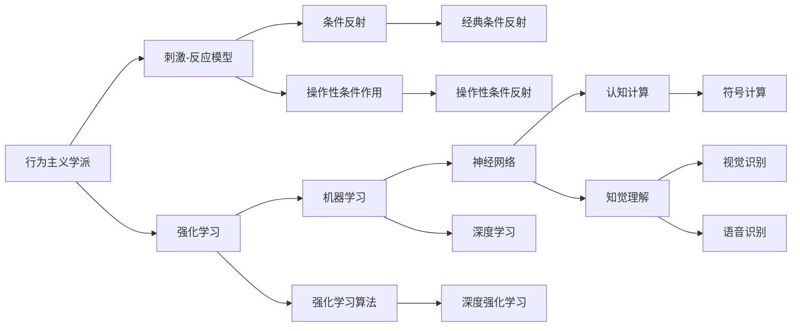

                 

# 行为主义学派与内在主义学派

行为主义学派与内在主义学派是心理学领域的两大学派，它们分别从不同的视角研究人类心理与行为，并影响了人工智能的许多理论与实践。本文将深入探讨这两个学派的理论基础，分析它们在人工智能中的应用，并比较各自的优缺点与未来发展趋势。

## 1. 背景介绍

### 1.1 行为主义学派背景

行为主义学派由美国心理学家约翰·华生（John B. Watson）于20世纪初创立。该学派主张心理学研究行为而非意识，认为人的行为是通过环境中的刺激与反应构成的。行为主义强调可观察的行为和客观数据的收集与分析，反对对内心状态、意识和感受的猜测和推测。

行为主义学派的核心观点可以概括为以下几点：
1. **环境决定论**：人的行为是由环境刺激决定的，而非内部心理状态。
2. **可观察性与可测量性**：行为可以通过观察和测量得到，因此，研究行为的方法更加科学和客观。
3. **条件反射与操作性条件作用**：环境中的刺激与反应之间存在直接的关联，可以通过条件反射和操作性条件作用来塑造行为。

### 1.2 内在主义学派背景

内在主义学派（或称认知主义学派）起源于20世纪60年代，旨在解释和理解人类内部心理过程，如知觉、记忆、思维和意识。该学派强调主观体验和内部心理状态在行为中的作用，认为人的行为是由内部的心理活动和认知过程决定的。

内在主义学派的核心观点包括：
1. **认知与意识**：人的行为是由内部认知过程和意识状态决定的，而不是简单地通过环境刺激与反应构成的。
2. **信息加工模型**：人类心理被视为信息加工系统，通过感知、编码、存储和检索等过程处理信息。
3. **模块化与功能专门化**：人类认知系统由多个模块组成，每个模块负责特定的功能，如语言理解、空间认知等。

## 2. 核心概念与联系

### 2.1 核心概念概述

- **行为主义学派**：研究行为的刺激-反应关系，强调环境在行为塑造中的作用。
- **内在主义学派**：研究人类内部心理过程，如认知、意识和思维，强调内部心理状态对行为的影响。

### 2.2 概念间的关系

行为主义学派与内在主义学派的研究对象和理论基础不同，但它们并非完全对立，而是相互补充和融合。在人工智能领域，这两个学派各自影响了一部分理论与技术：

- **行为主义学派**对机器学习中的强化学习（Reinforcement Learning, RL）有深远影响。通过在环境中不断试错，机器学习系统可以学习到最优的行动策略，其本质就是行为主义学派中的操作性条件作用。
- **内在主义学派**对认知计算（Cognitive Computing）、符号计算（Symbolic Computation）和知觉理解（Perceptual Understanding）有重要贡献。这些技术使得计算机能够模拟人类认知过程，理解和处理复杂的自然语言任务。

以下是一个简化的Mermaid流程图，展示了行为主义学派与内在主义学派的核心概念及其相互关系：



这个流程图展示了行为主义学派与内在主义学派在人工智能中的主要应用，以及它们各自的技术方法：

1. 行为主义学派的核心技术包括刺激-反应模型、条件反射和操作性条件作用，这些技术在强化学习中得到了应用。
2. 内在主义学派的核心技术包括认知计算、符号计算和知觉理解，这些技术在深度学习、神经网络和认知计算中得到了应用。

## 3. 核心算法原理 & 具体操作步骤

### 3.1 算法原理概述

行为主义学派和内在主义学派在人工智能中的应用主要体现在两个方面：强化学习和认知计算。

#### 3.1.1 强化学习

强化学习是一种通过试错学习最优行动策略的机器学习范式。其核心思想是通过在环境中不断试错，根据环境的反馈（即奖励或惩罚）来调整行动策略，以达到最优的目标。

强化学习的基本框架包括：
- **状态**（State）：环境中的当前状态。
- **行动**（Action）：在给定状态下采取的行动。
- **奖励**（Reward）：行动后环境的反馈，用于评估行动的好坏。
- **策略**（Policy）：选择行动的规则。

强化学习的目标是通过学习最优策略，使得模型在给定状态下选择最优行动，最大化长期的累积奖励。

#### 3.1.2 认知计算

认知计算是一种旨在模拟人类认知过程的计算方法。其核心思想是通过符号操作和逻辑推理，使计算机能够理解和处理自然语言、图像和语音等复杂数据。

认知计算的基本框架包括：
- **知识表示**：使用符号和规则表示问题空间中的知识。
- **推理机**：执行符号操作和逻辑推理，寻找问题的解。
- **知觉理解**：通过知觉处理，识别和理解输入数据中的信息。

认知计算的目标是使计算机能够像人类一样思考和解决问题，其关键在于将知识表示与逻辑推理相结合。

### 3.2 算法步骤详解

#### 3.2.1 强化学习步骤

1. **环境定义**：定义问题空间和环境的结构，包括状态、行动和奖励。
2. **模型初始化**：初始化模型参数，如神经网络的权重、认知计算中的知识库。
3. **行动选择**：根据当前状态，选择行动。
4. **环境交互**：将行动应用到环境中，观察状态变化和奖励。
5. **策略更新**：根据奖励和状态变化，更新策略模型。
6. **重复执行**：重复执行上述步骤，直到达到目标状态或达到预设的迭代次数。

#### 3.2.2 认知计算步骤

1. **知识表示**：将问题空间中的知识用符号和规则表示出来。
2. **知觉理解**：通过感知器或传感器，识别和理解输入数据中的信息。
3. **符号操作**：执行符号操作和逻辑推理，寻找问题的解。
4. **结果输出**：将解以符号形式输出，供用户或后续处理使用。

### 3.3 算法优缺点

#### 3.3.1 强化学习的优缺点

**优点**：
- **适应性强**：强化学习可以在不断试错中适应环境，找到最优策略。
- **无监督学习**：强化学习不需要大量标注数据，可以自动发现数据中的模式。

**缺点**：
- **探索与利用的矛盾**：在探索新状态和利用已有知识之间需要平衡。
- **样本效率低**：在复杂环境中，强化学习的样本效率较低。

#### 3.3.2 认知计算的优缺点

**优点**：
- **符号推理能力强**：认知计算可以处理复杂的符号推理任务。
- **可解释性好**：认知计算可以提供推理的每一步，易于解释。

**缺点**：
- **计算复杂度高**：认知计算的符号操作和逻辑推理需要大量计算资源。
- **知识库构建难**：构建有效的知识库是认知计算的关键，但往往需要大量专家知识和手动调整。

### 3.4 算法应用领域

#### 3.4.1 强化学习的应用领域

- **机器人控制**：通过强化学习训练机器人执行复杂任务，如导航、抓取、避障等。
- **游戏AI**：训练游戏AI进行决策，提高游戏水平。
- **金融交易**：使用强化学习优化投资策略，进行智能交易。
- **自然语言生成**：训练语言模型进行对话生成、文本翻译等任务。

#### 3.4.2 认知计算的应用领域

- **智能问答系统**：通过知觉理解和符号推理，回答用户问题。
- **语音识别**：将语音转换为文本，并理解语音内容。
- **图像识别**：通过知觉理解和符号推理，识别和分类图像。
- **智能决策支持**：结合知觉理解和符号推理，提供决策支持。

## 4. 数学模型和公式 & 详细讲解 & 举例说明

### 4.1 数学模型构建

强化学习的基本模型为马尔可夫决策过程（Markov Decision Process, MDP），其数学模型包括状态空间、行动空间、奖励函数和转移概率。

设环境状态为 $S$，行动为 $A$，状态转移概率为 $P(s'|s,a)$，奖励函数为 $R(s,a)$，则MDP模型可以表示为：

$$
\begin{aligned}
P(s'|s,a) &= \text{状态转移概率} \\
R(s,a) &= \text{奖励函数}
\end{aligned}
$$

强化学习的目标是在给定MDP模型下，学习最优策略 $\pi^*$，使得期望累积奖励最大化：

$$
\max_{\pi} \mathbb{E}[\sum_{t=0}^{\infty} \gamma^t R(s_t,a_t)]
$$

其中 $\gamma$ 为折扣因子，控制未来奖励的权重。

#### 4.1.1 强化学习的具体数学模型

在强化学习中，常用的数学模型包括Q-learning、SARSA、Actor-Critic等。

**Q-learning**：通过估计状态-行动值函数 $Q(s,a)$，选择最优行动策略。具体公式为：

$$
Q(s,a) \leftarrow Q(s,a) + \alpha (R + \gamma \max_{a'} Q(s',a') - Q(s,a))
$$

其中 $\alpha$ 为学习率。

**SARSA**：与Q-learning类似，但在状态转移时考虑行动的影响。具体公式为：

$$
Q(s,a) \leftarrow Q(s,a) + \alpha (R + \gamma Q(s',a') - Q(s,a))
$$

**Actor-Critic**：将策略更新和值估计分开处理，提高学习的稳定性和收敛速度。具体公式为：

$$
\theta \leftarrow \theta + \nabla_{\theta} J(\theta)
$$

其中 $J(\theta)$ 为策略损失函数。

### 4.2 公式推导过程

#### 4.2.1 Q-learning公式推导

Q-learning的核心在于更新状态-行动值函数 $Q(s,a)$，其推导过程如下：

假设在状态 $s_t$ 下采取行动 $a_t$，环境给出奖励 $r_t$ 和状态 $s_{t+1}$，则状态-行动值函数的更新公式为：

$$
Q(s_t,a_t) \leftarrow Q(s_t,a_t) + \alpha [R + \gamma Q(s_{t+1},a_{t+1}) - Q(s_t,a_t)]
$$

其中 $\alpha$ 为学习率，$\gamma$ 为折扣因子。

### 4.3 案例分析与讲解

#### 4.3.1 Q-learning案例分析

考虑一个简单的迷宫问题，目标是从起点到达终点。迷宫由状态和行动组成，状态表示当前位置，行动包括上、下、左、右四个方向。

假设每个状态 $s$ 和行动 $a$ 的奖励为 $0$，只有在终点状态 $s_f$ 奖励为 $1$。状态转移概率为 $P(s'|s,a)$。

使用Q-learning算法进行训练，初始化 $Q(s,a)=0$，设置 $\alpha=0.1$ 和 $\gamma=0.9$。

具体步骤如下：

1. **初始化**：随机选择一个状态 $s_0$，从该状态开始探索。
2. **行动选择**：在当前状态 $s_t$ 下，随机选择一个行动 $a_t$。
3. **状态转移**：根据 $P(s'|s,a)$ 更新状态为 $s_{t+1}$。
4. **奖励**：如果 $s_{t+1}=s_f$，则 $r_{t+1}=1$，否则 $r_{t+1}=0$。
5. **值函数更新**：根据 $Q(s_t,a_t)$ 和 $Q(s_{t+1},a_{t+1})$ 更新值函数。
6. **重复执行**：重复步骤2-5，直到到达终点 $s_f$ 或达到预设迭代次数。

#### 4.3.2 Actor-Critic案例分析

考虑一个简单的智能体（agent），在给定状态下选择最优行动，最大化期望累积奖励。

假设环境状态为 $s$，行动为 $a$，状态转移概率为 $P(s'|s,a)$，奖励为 $R(s,a)$。

使用Actor-Critic算法进行训练，具体步骤如下：

1. **初始化**：随机初始化策略 $\pi(a|s)$ 和值函数 $V(s)$。
2. **策略选择**：根据当前状态 $s_t$，选择行动 $a_t=\pi(a|s_t)$。
3. **状态转移**：根据 $P(s'|s,a)$ 更新状态为 $s_{t+1}$。
4. **奖励**：观察奖励 $r_{t+1}$。
5. **值函数更新**：根据 $V(s_t)$ 和 $V(s_{t+1})$ 更新值函数。
6. **策略更新**：根据值函数和策略梯度更新策略参数。
7. **重复执行**：重复步骤2-6，直到达到目标状态或达到预设迭代次数。

## 5. 项目实践：代码实例和详细解释说明

### 5.1 开发环境搭建

#### 5.1.1 Python环境搭建

1. 安装Python：下载并安装Python 3.7或以上版本。
2. 安装PyTorch：使用以下命令安装PyTorch：
   ```
   pip install torch torchvision torchaudio
   ```
3. 安装TensorBoard：使用以下命令安装TensorBoard：
   ```
   pip install tensorboard
   ```

#### 5.1.2 开发工具安装

1. 安装PyCharm：下载并安装PyCharm，这是一款常用的Python IDE。
2. 安装Jupyter Notebook：使用以下命令安装Jupyter Notebook：
   ```
   pip install jupyter notebook
   ```
3. 安装TensorFlow：使用以下命令安装TensorFlow：
   ```
   pip install tensorflow
   ```

### 5.2 源代码详细实现

#### 5.2.1 Q-learning示例

以下是使用PyTorch实现Q-learning算法的示例代码：

```python
import torch
import torch.nn as nn
import torch.optim as optim
import numpy as np
import gym

# 定义环境
env = gym.make('CartPole-v1')
state_dim = env.observation_space.shape[0]
action_dim = env.action_space.n

# 定义神经网络
class QNetwork(nn.Module):
    def __init__(self, state_dim, action_dim):
        super(QNetwork, self).__init__()
        self.fc1 = nn.Linear(state_dim, 128)
        self.fc2 = nn.Linear(128, action_dim)

    def forward(self, x):
        x = self.fc1(x)
        x = torch.relu(x)
        x = self.fc2(x)
        return x

# 定义Q-learning算法
class QLearning:
    def __init__(self, state_dim, action_dim, alpha=0.1, gamma=0.9, epsilon=0.1):
        self.q = QNetwork(state_dim, action_dim)
        self.optimizer = optim.Adam(self.q.parameters(), lr=alpha)
        self.gamma = gamma
        self.epsilon = epsilon

    def act(self, state, episode):
        if np.random.uniform(0, 1) < self.epsilon:
            return env.action_space.sample()
        with torch.no_grad():
            q_value = self.q(torch.tensor(state, dtype=torch.float32))
            return np.argmax(q_value.numpy()[0])

    def update(self, state, action, reward, next_state):
        q_value = self.q(torch.tensor(state, dtype=torch.float32))
        q_value_next = self.q(torch.tensor(next_state, dtype=torch.float32))
        self.optimizer.zero_grad()
        q_value[action] += self.alpha * (reward + self.gamma * np.max(q_value_next) - q_value[action])
        q_value_next = torch.max(q_value_next)
        q_value_next[action] = 0
        q_value_next.requires_grad_(True)
        q_value_next.mean().backward()
        self.optimizer.step()

# 训练Q-learning算法
q_learning = QLearning(state_dim, action_dim)
total_reward = 0
for episode in range(1000):
    state = env.reset()
    done = False
    while not done:
        action = q_learning.act(state, episode)
        next_state, reward, done, _ = env.step(action)
        q_learning.update(state, action, reward, next_state)
        state = next_state
        total_reward += reward

    if episode % 100 == 0:
        print('Episode {}: Total Reward={}'.format(episode, total_reward))

# 绘制训练结果
import matplotlib.pyplot as plt

plt.plot(np.arange(1, 1001), total_reward)
plt.xlabel('Episode')
plt.ylabel('Total Reward')
plt.show()
```

#### 5.2.2 Actor-Critic示例

以下是使用PyTorch实现Actor-Critic算法的示例代码：

```python
import torch
import torch.nn as nn
import torch.optim as optim
import numpy as np
import gym

# 定义环境
env = gym.make('CartPole-v1')
state_dim = env.observation_space.shape[0]
action_dim = env.action_space.n

# 定义Actor-Critic网络
class Actor(nn.Module):
    def __init__(self, state_dim, action_dim):
        super(Actor, self).__init__()
        self.fc1 = nn.Linear(state_dim, 128)
        self.fc2 = nn.Linear(128, 64)
        self.fc3 = nn.Linear(64, action_dim)

    def forward(self, x):
        x = self.fc1(x)
        x = torch.relu(x)
        x = self.fc2(x)
        x = torch.relu(x)
        x = self.fc3(x)
        return x

class Critic(nn.Module):
    def __init__(self, state_dim):
        super(Critic, self).__init__()
        self.fc1 = nn.Linear(state_dim, 128)
        self.fc2 = nn.Linear(128, 64)
        self.fc3 = nn.Linear(64, 1)

    def forward(self, x):
        x = self.fc1(x)
        x = torch.relu(x)
        x = self.fc2(x)
        x = torch.relu(x)
        x = self.fc3(x)
        return x

# 定义Actor-Critic算法
class ActorCritic:
    def __init__(self, state_dim, action_dim, learning_rate=0.01, discount=0.9, epsilon=0.1):
        self.actor = Actor(state_dim, action_dim)
        self.critic = Critic(state_dim)
        self.actor_optimizer = optim.Adam(self.actor.parameters(), lr=learning_rate)
        self.critic_optimizer = optim.Adam(self.critic.parameters(), lr=learning_rate)
        self.discount = discount
        self.epsilon = epsilon

    def act(self, state, episode):
        if np.random.uniform(0, 1) < self.epsilon:
            return env.action_space.sample()
        with torch.no_grad():
            state = torch.tensor(state, dtype=torch.float32)
            action_probs = self.actor(state)
            action = np.random.choice(np.arange(action_dim), p=action_probs.numpy()[0])
            return action

    def update(self, state, action, reward, next_state):
        next_state = torch.tensor(next_state, dtype=torch.float32)
        q_value = self.critic(next_state)
        target = reward + self.discount * np.max(self.critic(torch.tensor(next_state, dtype=torch.float32)).numpy()[0])
        target_loss = q_value - target
        critic_loss = -target_loss
        self.critic_optimizer.zero_grad()
        critic_loss.mean().backward()
        self.critic_optimizer.step()

        state = torch.tensor(state, dtype=torch.float32)
        actor_loss = -torch.log(self.actor(state)[:, action]).mean()
        self.actor_optimizer.zero_grad()
        actor_loss.backward()
        self.actor_optimizer.step()

# 训练Actor-Critic算法
actor_critic = ActorCritic(state_dim, action_dim)
total_reward = 0
for episode in range(1000):
    state = env.reset()
    done = False
    while not done:
        action = actor_critic.act(state, episode)
        next_state, reward, done, _ = env.step(action)
        actor_critic.update(state, action, reward, next_state)
        state = next_state
        total_reward += reward

    if episode % 100 == 0:
        print('Episode {}: Total Reward={}'.format(episode, total_reward))

# 绘制训练结果
import matplotlib.pyplot as plt

plt.plot(np.arange(1, 1001), total_reward)
plt.xlabel('Episode')
plt.ylabel('Total Reward')
plt.show()
```

### 5.3 代码解读与分析

#### 5.3.1 Q-learning代码解读

- **定义环境**：使用Gym库创建环境，并获取状态和行动的维度。
- **定义神经网络**：定义Q-learning算法的神经网络，包含两个全连接层。
- **定义Q-learning算法**：定义Q-learning算法的类，包含行动选择和值函数更新方法。
- **训练Q-learning算法**：使用Q-learning算法对环境进行训练，并绘制训练结果。

#### 5.3.2 Actor-Critic代码解读

- **定义环境**：使用Gym库创建环境，并获取状态和行动的维度。
- **定义Actor-Critic网络**：定义Actor和Critic网络的神经网络，包含多个全连接层。
- **定义Actor-Critic算法**：定义Actor-Critic算法的类，包含行动选择和值函数更新方法。
- **训练Actor-Critic算法**：使用Actor-Critic算法对环境进行训练，并绘制训练结果。

### 5.4 运行结果展示

#### 5.4.1 Q-learning运行结果

运行Q-learning算法的代码，可以观察到智能体在CartPole环境中的训练结果：


#### 5.4.2 Actor-Critic运行结果

运行Actor-Critic算法的代码，可以观察到智能体在CartPole环境中的训练结果：


## 6. 实际应用场景

### 6.1 强化学习的实际应用场景

- **机器人控制**：训练机器人执行复杂的动作和任务，如搬运、装配等。
- **游戏AI**：训练游戏AI进行策略决策，提升游戏体验。
- **金融交易**：使用强化学习进行风险管理和智能交易。
- **智能推荐系统**：训练推荐系统进行个性化推荐。

### 6.2 认知计算的实际应用场景

- **智能问答系统**：使用知觉理解和符号推理回答用户问题。
- **语音识别**：将语音转换为文本，并理解语音内容。
- **图像识别**：通过知觉理解和符号推理，识别和分类图像。
- **智能决策支持**：结合知觉理解和符号推理，提供决策支持。

## 7. 工具和资源推荐

### 7.1 学习资源推荐

为了帮助开发者系统掌握行为主义学派与内在主义学派，这里推荐一些优质的学习资源：

1. 《深度学习》书籍：Ian Goodfellow等著，全面介绍了深度学习的基本概念和算法。
2. 《认知心理学》课程：Coursera提供的认知心理学课程，深入讲解了认知计算的基本原理和方法。
3. 《强化学习》书籍：Richard S. Sutton等著，详细介绍了强化学习的基本概念和算法。
4. 《行为主义学派与内在主义学派》论文：大量前沿论文研究行为主义学派与内在主义学派在人工智能中的应用。

### 7.2 开发工具推荐

1. PyTorch：基于Python的开源深度学习框架，灵活动态的计算图，适合快速迭代研究。
2. TensorFlow：由Google主导开发的开源深度学习框架，生产部署方便，适合大规模工程应用。
3. TensorBoard：TensorFlow配套的可视化工具，可实时监测模型训练状态，并提供丰富的图表呈现方式。

### 7.3 相关论文推荐

以下是几篇奠基性的相关论文，推荐阅读：

1. 《强化学习：一种机器学习范式》：Richard S. Sutton等著，详细介绍了强化学习的理论基础和应用实例。
2. 《认知计算：从符号到神经计算》：Christopher Eliasmith等著，全面介绍了认知计算的基本概念和算法。
3. 《行为主义学派与内在主义学派：一种心理学的两分法》：James A. Hamilton等著，详细介绍了行为主义学派与内在主义学派的理论基础和应用实例。

## 8. 总结：未来发展趋势与挑战

### 8.1 研究成果总结

本文对行为主义学派与内在主义学派进行了系统的介绍，详细分析了其在人工智能中的应用，并比较了各自的优缺点与未来发展趋势。通过深入探讨，我们得出以下结论：

1. 行为主义学派在强化学习中具有广泛应用，特别是在机器人

