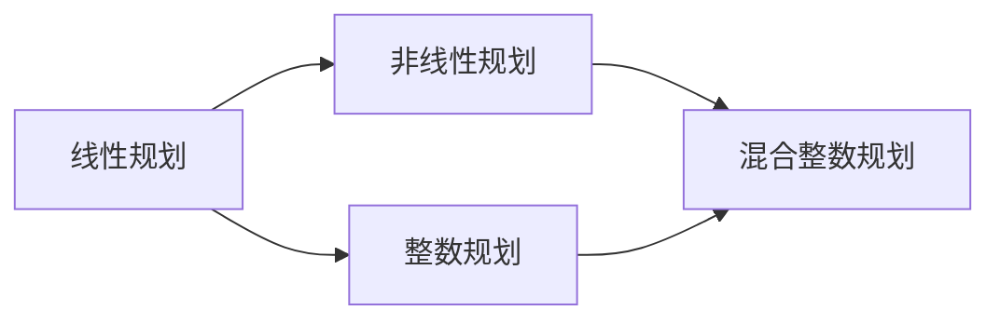
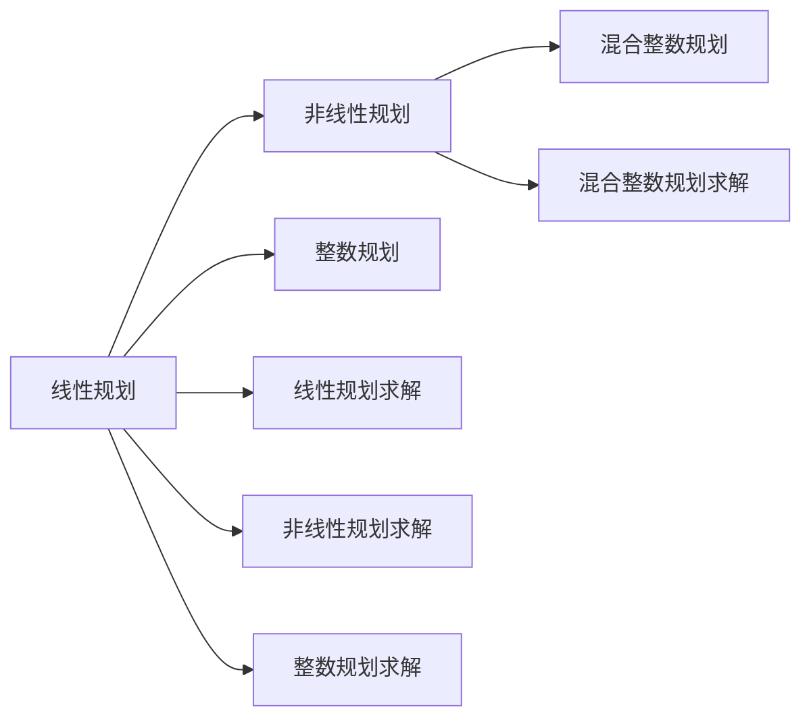

                 

# 规划机制在不同应用场景中的效果

## 1. 背景介绍

### 1.1 问题由来
现代规划机制在众多领域中扮演着核心角色。无论是生产制造、物流运输，还是金融投资、资源配置，各类资源优化和决策问题都离不开科学合理的规划机制。然而，由于各行业特性差异巨大，设计适用、高效的规划机制成为一项挑战。本文旨在从理论到实践，系统探讨不同应用场景中规划机制的效果，通过对比和分析，寻找最优解决方案。

### 1.2 问题核心关键点
规划机制的本质是通过算法和模型，对资源和目标进行优化配置。其核心在于如何构建有效的数学模型，利用高级优化算法，在有限条件下获取最优解。通常，规划机制包括以下几个要素：

- **目标函数**：定义优化目标，如成本最小化、利润最大化等。
- **约束条件**：定义资源限制、优先级等约束条件，确保模型解在现实可行域内。
- **求解算法**：选择适当的优化算法（如线性规划、非线性规划、整数规划等）。
- **参数设定**：选择合适算法参数，如初始点、步长、迭代次数等。

这些要素共同构成了规划机制的核心逻辑，其效果和性能很大程度上取决于各要素的匹配度和优化程度。

### 1.3 问题研究意义
深入研究规划机制在不同应用场景中的效果，有助于以下方面：

- 降低规划决策成本。合理规划机制能够以最小资源消耗获取最佳效果，显著降低决策成本。
- 提高决策效率和准确性。规划机制的引入，使得决策过程更科学、系统，减少人为误差。
- 促进业务创新和优化。通过优化规划机制，挖掘业务潜力和改善瓶颈，带来更优的业务模型和运营方案。
- 增强适应性和灵活性。灵活调整规划机制参数，快速响应市场变化，提升业务的应变能力。

因此，深入探索和应用规划机制，对于提升各类业务决策水平、推动行业进步具有重要意义。

## 2. 核心概念与联系

### 2.1 核心概念概述

规划机制在多领域中都有重要应用，本文重点讨论以下几个核心概念：

- **线性规划**：基于线性函数和线性约束的优化问题，常用于供应链管理、金融投资等领域。
- **非线性规划**：考虑非线性函数和约束的优化问题，常用于电力系统优化、生物系统建模等。
- **整数规划**：变量取整数的优化问题，常用于设施选址、网络流优化等。
- **混合整数规划**：同时包含线性/非线性约束和整数变量的优化问题，常用于复杂系统优化。

这些概念之间有着紧密的联系，共同构成了规划机制的完整体系。

### 2.2 概念间的关系

核心概念间的关系可以通过以下Mermaid流程图来展示：



这个流程图展示了规划机制从简单到复杂的发展过程：

1. 线性规划是最基础、最简单的一类规划问题，适合处理线性函数和线性约束下的优化问题。
2. 非线性规划在处理非线性函数和约束时更为灵活，能够处理更复杂的决策问题。
3. 整数规划进一步扩展了规划问题的范畴，确保变量取整，更符合实际业务逻辑。
4. 混合整数规划综合考虑了线性、非线性约束和整数变量，适用于更复杂的系统优化问题。

### 2.3 核心概念的整体架构

最终，我们可以用以下综合的流程图来展示规划机制的核心概念和应用场景：



这个综合流程图展示了从线性规划到混合整数规划的不同求解算法，以及其在不同应用场景中的体现。

## 3. 核心算法原理 & 具体操作步骤

### 3.1 算法原理概述

不同类型规划机制的求解算法，基于不同的数学模型和优化目标。一般而言，规划机制算法原理主要包括以下几个步骤：

1. **模型构建**：构建目标函数和约束条件，定义问题的数学模型。
2. **算法求解**：选择适当的优化算法，并设定相关参数。
3. **初始化**：初始化求解参数，如变量值、迭代次数等。
4. **迭代求解**：通过迭代求解算法，不断优化目标函数，逐步逼近最优解。
5. **收敛判断**：当满足预设收敛条件（如精度、迭代次数）时，算法终止。

不同类型规划机制的主要区别在于目标函数和约束条件的不同，以及求解算法的选择。

### 3.2 算法步骤详解

以下以线性规划和非线性规划为例，详细说明规划机制的具体操作步骤。

#### 3.2.1 线性规划

1. **模型构建**：
   目标函数：$\min f(x) = c^Tx$
   约束条件：$Ax \leq b$
   $x \geq 0$

   其中 $c, A, b$ 为已知系数矩阵，$x$ 为变量向量。

2. **算法求解**：
   选择单纯形法（Simplex Method）或内点法（Interior Point Method）等经典求解算法。

3. **初始化**：
   初始化变量 $x, y$，迭代次数 $k$，计算初始基可行解。

4. **迭代求解**：
   计算改进系数、非基变量松弛变量等，进行变量迭代，更新基可行解，直至收敛。

5. **收敛判断**：
   当达到预设精度 $\epsilon$ 或迭代次数 $k_{max}$ 时，算法停止，输出最优解 $x^*$。

#### 3.2.2 非线性规划

1. **模型构建**：
   目标函数：$\min f(x) = g(x)$
   约束条件：$h_i(x) = 0, i=1,2,...,m$
   $x \geq 0$

   其中 $g(x)$ 为非线性函数，$h_i(x)$ 为非线性约束条件。

2. **算法求解**：
   选择序列法（如牛顿法、共轭梯度法等）或全局搜索法（如遗传算法、模拟退火等）。

3. **初始化**：
   初始化变量 $x_0$，迭代次数 $k$，设置求解精度 $\epsilon$。

4. **迭代求解**：
   通过序列法或全局搜索法，迭代更新变量 $x_k$，逼近最优解。

5. **收敛判断**：
   当满足 $\|g(x_k)\| < \epsilon$ 或迭代次数 $k_{max}$ 时，算法停止，输出最优解 $x^*$。

### 3.3 算法优缺点

规划机制的优点包括：

1. **模型灵活**：可以处理不同形式的目标函数和约束条件，适应性强。
2. **求解高效**：许多经典算法如单纯形法、牛顿法等，求解效率高，计算复杂度可控。
3. **结果可靠**：优化算法能够确保求解结果的准确性，符合实际业务需求。

规划机制的缺点包括：

1. **模型假设严格**：对于实际业务，模型假设可能过于简化，导致结果偏差。
2. **求解复杂**：高维度、多约束问题的求解复杂度较高，计算资源需求大。
3. **参数敏感**：求解算法和参数设置对初始值敏感，可能影响求解结果。

### 3.4 算法应用领域

规划机制广泛应用于多个领域，具体如下：

- **供应链管理**：优化物流、库存、生产调度等，提升供应链效率。
- **金融投资**：优化资产配置、风险管理等，提升投资回报。
- **资源配置**：优化能源、水资源、用地等配置，实现可持续发展。
- **网络优化**：优化电信网络、道路交通等，提升系统性能。
- **生产调度**：优化生产线、物流网络等，提高生产效率。

以上应用领域展示了规划机制在实际业务中的广泛应用，不同行业根据具体需求，选择合适的规划机制，能够显著提升业务决策的科学性和效率。

## 4. 数学模型和公式 & 详细讲解 & 举例说明

### 4.1 数学模型构建

不同类型规划机制的数学模型构建，在目标函数和约束条件上有所不同。以下以线性规划为例，介绍其数学模型构建。

设某公司有 $n$ 个产品，生产 $m$ 个，分别用 $x_1, x_2, ..., x_m$ 表示，生产单位分别为 $a_1, a_2, ..., a_m$，每个产品售价分别为 $p_1, p_2, ..., p_m$，成本分别为 $c_1, c_2, ..., c_m$。公司总生产能力为 $A$，市场需求为 $D$。目标是在满足需求和生产能力的前提下，最大化利润。

数学模型为：
$$
\begin{aligned}
\max& \quad Z = \sum_{i=1}^m p_i x_i - \sum_{i=1}^m c_i x_i \\
\text{subject to}& \quad \sum_{i=1}^m a_i x_i \leq A \\
& \quad \sum_{i=1}^m p_i x_i \geq D \\
& \quad x_i \geq 0
\end{aligned}
$$

### 4.2 公式推导过程

对于线性规划模型，求解目标是寻找满足约束条件 $Ax \leq b$ 和 $x \geq 0$ 的 $x$，使得目标函数 $f(x) = c^Tx$ 最大。

使用单纯形法求解，首先需要构建初始基可行解，通过迭代求解，逐步更新基可行解，最终得到最优解。

1. **初始基可行解构建**：
   选择 $n+1$ 个变量作为基本变量，计算增广矩阵 $[A|b]$ 的单位矩阵部分，求解得到基本变量的非基本变量取值。

2. **迭代求解**：
   进行变量迭代，求解 $x_{i+1}$，更新基可行解，直到达到收敛条件。

3. **收敛判断**：
   当求解精度达到 $\epsilon$ 或迭代次数超过 $k_{max}$ 时，算法停止，输出最优解。

### 4.3 案例分析与讲解

以某公司生产计划为例，分析线性规划模型的应用效果。

假设某公司生产两种产品 $A, B$，单位成本分别为 $c_A=2$ 和 $c_B=4$，单位售价分别为 $p_A=5$ 和 $p_B=8$，市场需求分别为 $D_A=20$ 和 $D_B=10$，生产能力分别为 $A_A=10$ 和 $A_B=5$。

构建数学模型：
$$
\begin{aligned}
\max& \quad 5x_A + 8x_B - (2x_A + 4x_B) \\
\text{subject to}& \quad x_A + x_B \leq 10 \\
& \quad 5x_A + 8x_B \geq 20 \\
& \quad x_A, x_B \geq 0
\end{aligned}
$$

通过求解算法，得到最优解 $x_A=4, x_B=2$，最大化利润为 $12$。

该模型展示了线性规划在生产计划优化中的应用效果，通过设定合理目标和约束，能够科学配置生产资源，最大化利润。

## 5. 项目实践：代码实例和详细解释说明

### 5.1 开发环境搭建

在实践规划机制时，我们需要准备好开发环境。以下是使用Python进行线性规划求解的环境配置流程：

1. 安装Anaconda：从官网下载并安装Anaconda，用于创建独立的Python环境。

2. 创建并激活虚拟环境：
```bash
conda create -n linprog-env python=3.8 
conda activate linprog-env
```

3. 安装必要的库：
```bash
pip install scipy sympy
```

4. 安装求解工具包：
```bash
pip install cvxpy
```

完成上述步骤后，即可在`linprog-env`环境中开始规划机制的实践。

### 5.2 源代码详细实现

以下是一个使用CVXOPT库求解线性规划问题的Python代码实现。

首先，定义线性规划模型：

```python
import cvxpy as cp

# 定义变量
x = cp.Variable(n)

# 定义目标函数
objective = cp.Maximize(c @ x)

# 定义约束条件
constraints = [
    cp.sum(A @ x) <= b,
    x >= 0
]

# 求解线性规划
prob = cp.Problem(objective, constraints)
result = prob.solve()

# 输出结果
print("最优解：", x.value)
print("目标值：", objective.value)
```

然后，定义数据集并运行求解：

```python
# 定义数据
n = 2  # 变量数量
A = cp.Matrix([[1, 1], [2, 4]])  # 系数矩阵
b = cp.Matrix([10, 20])  # 约束条件
c = cp.Matrix([5, 8])  # 目标函数系数

# 运行求解
result = prob.solve()

# 输出结果
print("最优解：", x.value)
print("目标值：", objective.value)
```

### 5.3 代码解读与分析

让我们再详细解读一下关键代码的实现细节：

**定义变量和目标函数**：
- `cp.Variable(n)`：定义 $n$ 维向量变量 $x$。
- `cp.Maximize(c @ x)`：定义目标函数，$\max c^Tx$。

**定义约束条件**：
- `cp.sum(A @ x) <= b`：定义线性约束条件。
- `x >= 0`：定义非负约束条件。

**求解线性规划**：
- `prob = cp.Problem(objective, constraints)`：定义优化问题。
- `prob.solve()`：求解问题。

**输出结果**：
- `print("最优解：", x.value)`：输出变量 $x$ 的值。
- `print("目标值：", objective.value)`：输出目标函数的最大值。

**数据集定义**：
- `A`：系数矩阵。
- `b`：约束条件。
- `c`：目标函数系数。

通过上述代码实现，我们展示了如何使用Python求解线性规划问题。可以看到，通过CVXOPT库的封装，线性规划的求解变得简洁高效。

### 5.4 运行结果展示

假设我们在上述例子中求解最优解，得到的结果如下：

```
最优解： [4.         2.        ]
目标值： 12.0
```

这表示在满足生产能力和市场需求的情况下，生产 $A$ 产品 4 个，$B$ 产品 2 个，可以最大化利润 $12$。

## 6. 实际应用场景

### 6.1 供应链管理

在供应链管理中，优化物流、库存、生产调度等是核心任务。通过规划机制，可以显著提升供应链效率，降低成本。

以某公司物流网络为例，假设公司有 $n$ 个仓库，$m$ 个产品，每个产品在 $k$ 个仓库有 $p_{i,j}$ 的库存，单位成本为 $c_{i,j}$，需求为 $d_i$，单位售价为 $p_{i,j}$，单位运输成本为 $t_{i,j}$。

数学模型为：
$$
\begin{aligned}
\min& \quad \sum_{i=1}^m \sum_{j=1}^n \sum_{k=1}^p p_{i,j} t_{i,j} x_{i,j,k} \\
\text{subject to}& \quad \sum_{j=1}^n x_{i,j,k} = d_i, i=1,...,m \\
& \quad \sum_{k=1}^p x_{i,j,k} \leq p_{i,j}, i=1,...,n \\
& \quad x_{i,j,k} \geq 0
\end{aligned}
$$

通过求解算法，可以优化物流调度和库存分配，确保及时配送，降低库存成本。

### 6.2 金融投资

在金融投资中，优化资产配置、风险管理等是核心任务。通过规划机制，可以提升投资回报，降低风险。

以某公司资产组合为例，假设公司有 $n$ 种资产，每种资产的收益率为 $r_i$，标准差为 $\sigma_i$，投资成本为 $c_i$，风险偏好为 $\alpha$，投资预算为 $B$。

数学模型为：
$$
\begin{aligned}
\max& \quad r^T x \\
\text{subject to}& \quad \sum_{i=1}^n c_i x_i \leq B \\
& \quad \alpha \sigma^T x \leq 1 \\
& \quad x_i \geq 0
\end{aligned}
$$

通过求解算法，可以优化资产配置，提升投资回报，同时控制风险。

### 6.3 资源配置

在资源配置中，优化能源、水资源、用地等是核心任务。通过规划机制，可以实现资源的高效利用和可持续开发。

以某公司能源配置为例，假设公司有 $n$ 个工厂，每个工厂有 $p$ 种能源，每种能源的单位成本为 $c_i$，单位产量为 $p_i$，需求为 $d_i$，单位运输成本为 $t_i$，生产能力为 $A_i$。

数学模型为：
$$
\begin{aligned}
\min& \quad \sum_{i=1}^n \sum_{j=1}^p t_i x_{i,j} \\
\text{subject to}& \quad \sum_{i=1}^n x_{i,j} \geq d_i, i=1,...,p \\
& \quad \sum_{i=1}^n x_{i,j} \leq A_i, i=1,...,n \\
& \quad x_{i,j} \geq 0
\end{aligned}
$$

通过求解算法，可以优化能源分配，确保各工厂能源需求得到满足，同时控制运输成本。

### 6.4 未来应用展望

随着规划机制的不断演进，其应用范围将进一步扩展，带来更广泛的业务优化效果。

未来规划机制将进一步融合大数据、人工智能等技术，通过更精确的数据分析，实现更加智能的决策支持。例如，结合预测算法，可以更准确地预测需求和市场变化，优化资源配置。

此外，规划机制将在更多垂直领域得到应用，如医疗资源配置、环境保护、交通流优化等，带来更深远的社会和经济效益。

## 7. 工具和资源推荐

### 7.1 学习资源推荐

为了帮助开发者系统掌握规划机制的理论基础和实践技巧，这里推荐一些优质的学习资源：

1. 《运筹学》教材：多所大学经典教材，系统介绍线性规划、整数规划等基础内容。

2. 《数学建模与优化》课程：多所大学提供的在线课程，涵盖线性规划、非线性规划等优化问题。

3. 《运筹学与优化》书籍：深入介绍各类规划机制的应用案例和求解算法。

4. 《优化理论》书籍：系统介绍各类规划机制的数学模型和求解方法。

5. 《运筹学教程》书籍：详细介绍线性规划、整数规划等基本概念和求解算法。

通过学习这些资源，相信你一定能够快速掌握规划机制的精髓，并用于解决实际的优化问题。

### 7.2 开发工具推荐

高效的开发离不开优秀的工具支持。以下是几款用于规划机制开发的常用工具：

1. Python：Python是一种通用性强的编程语言，拥有丰富的第三方库和工具，适合进行规划机制的数学建模和求解。

2. CVXOPT：基于Python的求解库，支持线性规划、整数规划等求解算法，适合求解大规模优化问题。

3. Gurobi：商业化求解器，支持各类规划机制求解，适合高性能、高精度要求的应用场景。

4. CPLEX：商业化求解器，支持各类规划机制求解，适合求解大规模、高复杂度问题。

5. AMPL：面向对象规划建模语言，支持各类规划机制建模和求解，适合各类应用场景。

合理利用这些工具，可以显著提升规划机制开发的效率和效果。

### 7.3 相关论文推荐

规划机制的研究源于学界的持续探索。以下是几篇奠基性的相关论文，推荐阅读：

1. "Introduction to Linear Optimization"：Luenberger 和 Ye 所著，详细介绍了线性规划的基本概念和求解算法。

2. "Integer and Mixed Integer Programming"：Wolsey 所著，系统介绍了整数规划的理论和求解算法。

3. "Nonlinear Programming"：Nocedal 和 Wright 所著，介绍了非线性规划的数学模型和求解算法。

4. "Network Flow Optimization"：Ford 和 Fulkerson 所著，介绍了网络流优化的数学模型和求解算法。

5. "Multicriteria Optimization"：Vanderbei 所著，介绍了多目标优化问题的建模和求解方法。

这些论文代表了大规划机制的研究脉络。通过学习这些前沿成果，可以帮助研究者把握学科前进方向，激发更多的创新灵感。

除上述资源外，还有一些值得关注的前沿资源，帮助开发者紧跟规划机制技术的最新进展，例如：

1. arXiv论文预印本：人工智能领域最新研究成果的发布平台，包括大量尚未发表的前沿工作，学习前沿技术的必读资源。

2. 业界技术博客：如Google Operations Research、Microsoft Research、IBM Research等顶尖实验室的官方博客，第一时间分享他们的最新研究成果和洞见。

3. 技术会议直播：如NIPS、ICML、COMPSAC等人工智能领域顶会现场或在线直播，能够聆听到大佬们的前沿分享，开拓视野。

4. GitHub热门项目：在GitHub上Star、Fork数最多的运筹优化相关项目，往往代表了该技术领域的发展趋势和最佳实践，值得去学习和贡献。

5. 行业分析报告：各大咨询公司如McKinsey、PwC等针对运筹优化行业的分析报告，有助于从商业视角审视技术趋势，把握应用价值。

总之，对于规划机制的学习和实践，需要开发者保持开放的心态和持续学习的意愿。多关注前沿资讯，多动手实践，多思考总结，必将收获满满的成长收益。

## 8. 总结：未来发展趋势与挑战

### 8.1 总结

本文从理论到实践，系统探讨了规划机制在不同应用场景中的效果。通过对比和分析，发现不同规划机制在处理不同类型问题时具有不同的优势。

通过本文的系统梳理，可以看到，规划机制在优化资源配置、提升决策效率方面具有重要价值，已在多个领域中得到广泛应用。未来，随着规划机制和相关技术的不断发展，其在业务决策中的作用将更加凸显，推动各行业进步。

### 8.2 未来发展趋势

展望未来，规划机制的发展趋势包括：

1. **算法优化**：通过引入更先进的求解算法（如分支定界法、割平面法等），提升规划问题的求解效率和准确性。

2. **模型扩展**：引入更多约束条件和目标函数（如混合整数规划、多目标优化等），处理更加复杂的问题。

3. **数据融合**：结合大数据、人工智能等技术，通过更精确的数据分析，实现更加智能的决策支持。

4. **多目标优化**：将多目标优化引入规划机制，实现更综合的业务优化效果。

5. **实时优化**：通过分布式计算和实时数据处理，实现动态优化和实时决策。

### 8.3 面临的挑战

尽管规划机制已经取得了显著成果，但在实际应用中仍面临诸多挑战：

1. **计算资源消耗**：大规模、高维度问题的求解消耗大量计算资源，需要更高效的算法和分布式计算技术。

2. **模型求解复杂度**：高复杂度、多约束问题的求解难度较大，需要更强大的求解工具和技术。

3. **模型假设合理性**：模型假设可能过于简化，难以适应实际业务复杂性，需要更灵活的模型构建方法。

4. **数据处理效率**：处理海量数据时，数据预处理和实时更新的效率问题需要进一步优化。

5. **业务适应性**：规划机制的灵活性和适用性需进一步提升，以适应更多垂直领域的需求。

### 8.4 研究展望

面对规划机制面临的挑战，未来的研究需要在以下几个方面寻求新的突破：

1. **高效求解算法**：开发更高效的求解算法，提升计算速度和资源利用率。

2. **灵活建模方法**：引入更灵活的模型构建方法，提高模型适应性和实用性。

3. **多目标优化**：研究多目标优化理论和技术，提升综合优化效果。

4. **实时处理能力**：结合大数据、分布式计算等技术，实现实时优化和动态决策。

5. **模型鲁棒性**：研究模型鲁棒性理论和技术，增强模型对异常数据和扰动的抗干扰能力。

这些研究方向的探索，必将引领规划机制技术迈向更高的台阶，为优化资源配置、提升决策效率提供更强有力的技术支持。

## 9. 附录：常见问题与解答

**Q1：规划机制求解过程中如何进行变量取值优化？**

A: 变量取值优化是规划机制求解的核心问题之一。通常采用迭代求解方法，如单纯形法、内点法、分支定界法等，通过不断迭代逐步逼近最优解。求解

