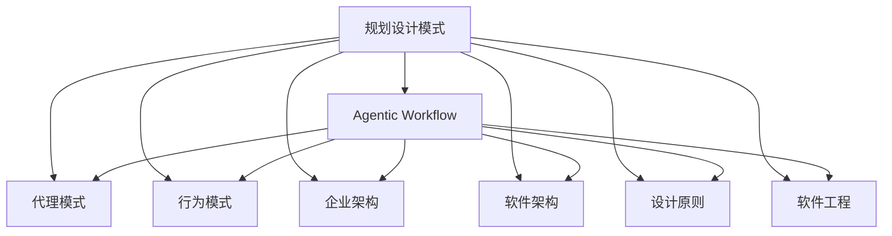
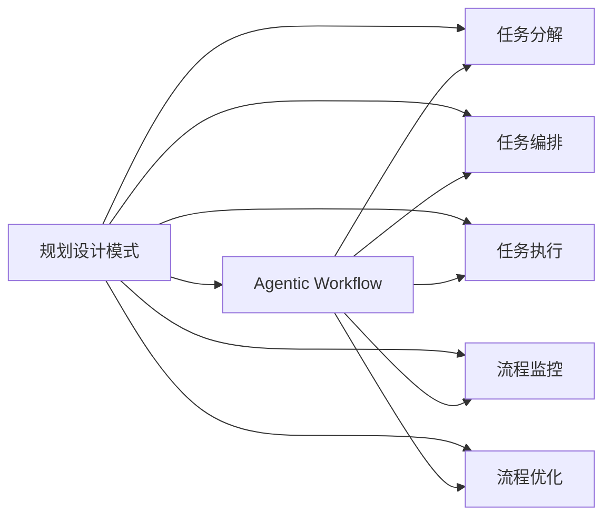
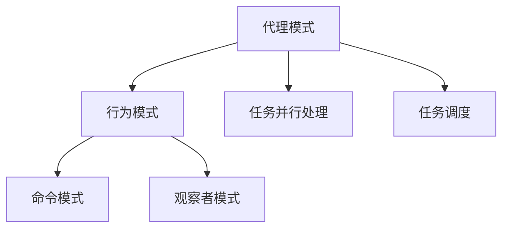
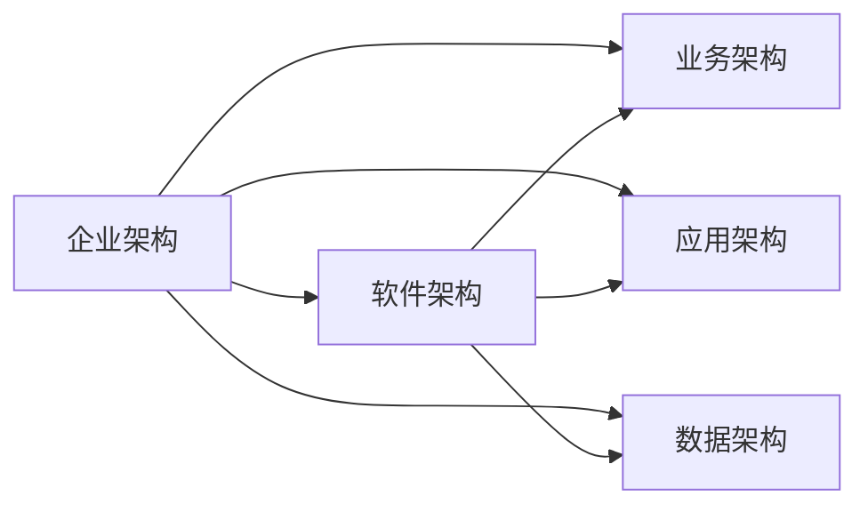
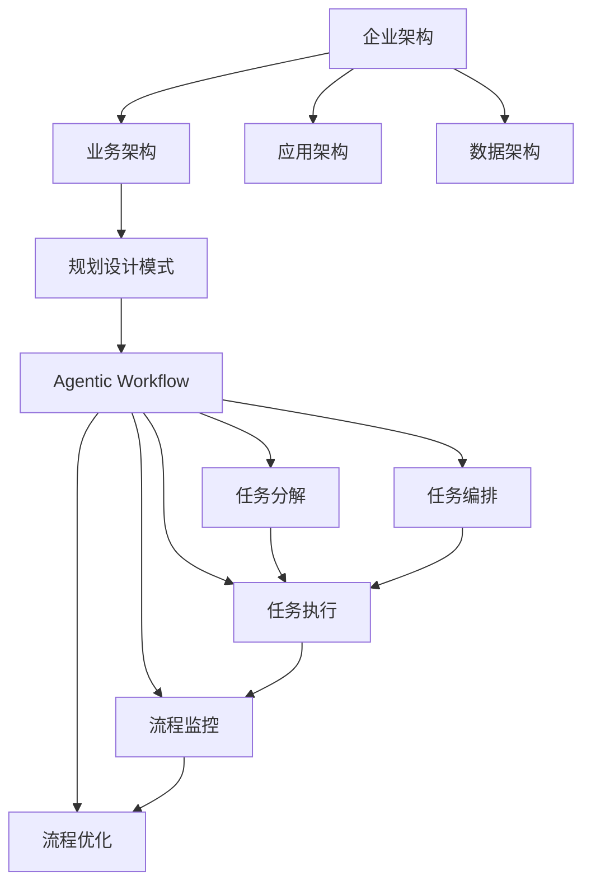

                 

# 规划设计模式在 Agentic Workflow 中的应用

> 关键词：规划设计模式,Agentic Workflow,代理模式,行为模式,企业架构,软件架构,设计原则,软件工程

## 1. 背景介绍

### 1.1 问题由来

在当今快速变化的企业环境中，敏捷和适应性成为了企业成功的关键因素。随着企业规模的扩大和复杂度的增加，传统的软件工程方法已经难以适应这些变化。为了解决这个问题，Agentic Workflow（敏捷流程）应运而生。它通过将企业的流程抽象为一系列任务和步骤，以更高效、更灵活的方式进行管理和优化。

然而，Agentic Workflow的设计和实现是一个复杂的工程问题。它不仅需要考虑任务的分解和编排，还需要保证流程的执行效率和质量。因此，规划设计模式的应用成为了一种重要的解决方案。

### 1.2 问题核心关键点

Agentic Workflow的规划设计模式主要包括以下几个关键点：

- 任务分解：将复杂的流程分解为一系列可管理的小任务，每个任务具有明确的输入和输出。
- 任务编排：将任务按照逻辑顺序编排，形成完整的流程。
- 任务执行：通过任务调度和并行处理，保证流程的高效执行。
- 流程监控：实时监控流程的执行状态和性能，及时发现和解决问题。
- 流程优化：通过持续改进和优化，提高流程的效率和质量。

这些关键点构成了Agentic Workflow规划设计模式的核心，确保了流程的可靠性和可维护性。

### 1.3 问题研究意义

研究规划设计模式在Agentic Workflow中的应用，对于提升企业流程的效率和质量具有重要意义：

- 降低开发成本。通过将复杂流程拆分为可管理的小任务，降低了流程设计和实现难度，减少了开发成本。
- 提高执行效率。通过合理编排任务和并行处理，优化了流程的执行效率，缩短了流程的执行时间。
- 增强可维护性。通过持续改进和优化，提高了流程的可维护性和灵活性，适应了企业快速变化的需求。
- 提升用户满意度。通过实时监控和优化流程，保证了流程的稳定性和可靠性，提升了用户体验。

## 2. 核心概念与联系

### 2.1 核心概念概述

为了更好地理解规划设计模式在Agentic Workflow中的应用，本节将介绍几个密切相关的核心概念：

- **规划设计模式**：通过抽象、分解、编排和优化等手段，设计出高效、可维护、可扩展的企业流程。
- **Agentic Workflow**：将企业的流程抽象为一系列任务和步骤，以敏捷的方式进行管理和优化。
- **代理模式**：通过创建代理对象，将任务执行委托给代理对象，以实现任务并行处理和优化。
- **行为模式**：如命令模式、观察者模式等，通过行为模式的组合应用，实现任务执行的灵活性和可扩展性。
- **企业架构**：包括业务架构、应用架构和数据架构，描述了企业流程、应用系统和数据模型之间的关系。
- **软件架构**：包括组件化、模块化和微服务架构等，描述了软件系统如何组织和设计。
- **设计原则**：如单一职责原则、开闭原则等，描述了设计流程和架构时遵循的基本原则。
- **软件工程**：包括敏捷开发、持续集成和持续交付等，描述了软件开发的实践和工具。

这些核心概念之间的逻辑关系可以通过以下Mermaid流程图来展示：



这个流程图展示了大语言模型微调过程中各个核心概念的关系和作用：

1. 规划设计模式是Agentic Workflow的核心方法论。
2. 代理模式、行为模式、企业架构、软件架构、设计原则和软件工程都是规划设计模式的重要组成部分，共同支撑Agentic Workflow的实现。

### 2.2 概念间的关系

这些核心概念之间存在着紧密的联系，形成了Agentic Workflow规划设计模式的完整生态系统。下面我们通过几个Mermaid流程图来展示这些概念之间的关系。

#### 2.2.1 规划设计模式与Agentic Workflow的关系



这个流程图展示了规划设计模式在Agentic Workflow中的应用。通过任务分解、编排、执行、监控和优化，规划设计模式支持Agentic Workflow的实现。

#### 2.2.2 代理模式与行为模式的关系



这个流程图展示了代理模式与行为模式之间的关系。代理模式通过创建代理对象，实现了任务并行处理和调度，而行为模式则通过命令模式和观察者模式等，增强了任务执行的灵活性和可扩展性。

#### 2.2.3 企业架构与软件架构的关系



这个流程图展示了企业架构与软件架构之间的关系。企业架构描述了业务流程、应用系统和数据模型之间的关系，而软件架构则描述了如何组织和设计软件系统。

### 2.3 核心概念的整体架构

最后，我们用一个综合的流程图来展示这些核心概念在大语言模型微调过程中的整体架构：



这个综合流程图展示了企业架构、规划设计模式、Agentic Workflow、任务分解、任务编排、任务执行、流程监控和流程优化之间的整体架构，确保了企业流程的高效、可维护和可扩展。

## 3. 核心算法原理 & 具体操作步骤

### 3.1 算法原理概述

Agentic Workflow的规划设计模式，本质上是一种任务驱动的流程管理方法。其核心思想是通过对企业流程的任务分解、编排、执行、监控和优化，实现流程的高效、可维护和可扩展。

形式化地，假设企业流程由一系列任务组成，记为 $T=\{t_1,t_2,\dots,t_n\}$，每个任务 $t_i$ 具有输入 $x_i$ 和输出 $y_i$，任务执行过程可以表示为一个映射 $f_i: x_i \rightarrow y_i$。任务调度过程可以表示为一个线性任务流 $P=\{t_1, t_2, \dots, t_n\}$，表示任务的执行顺序。任务监控过程可以表示为对任务执行状态的实时监测，形成监控流 $M=\{m_1, m_2, \dots, m_n\}$，用于发现和解决执行过程中遇到的问题。任务优化过程可以表示为一个反馈循环 $O=\{t_1, t_2, \dots, t_n, \dots\}$，根据监控流的结果，不断改进和优化任务执行策略。

Agentic Workflow的规划设计模式可以形式化地表示为：

$$
P = \{f_1(x_1), f_2(f_1(x_1)), \dots, f_n(f_{n-1}(\dots(f_1(x_1))\dots))
$$

其中 $f_i$ 表示任务 $t_i$ 的执行过程，$x_i$ 表示任务的输入，$y_i$ 表示任务的输出。

### 3.2 算法步骤详解

Agentic Workflow的规划设计模式可以分为以下几个关键步骤：

**Step 1: 任务分解**

将企业流程分解为一系列可管理的小任务，每个任务具有明确的输入和输出。任务分解的关键在于识别流程中的关键节点，并将其划分为独立的子任务。任务分解过程需要结合业务需求和系统架构，确保每个任务的独立性和可管理性。

**Step 2: 任务编排**

将任务按照逻辑顺序编排，形成完整的流程。任务编排的关键在于优化任务的执行顺序，保证流程的高效执行。通常采用依赖关系图 (DAG) 来表示任务的依赖关系，使用任务调度算法 (如拓扑排序、深度优先搜索等) 来优化任务的执行顺序。

**Step 3: 任务执行**

通过任务调度和并行处理，保证流程的高效执行。任务执行的关键在于选择合适的调度算法和并行处理策略，确保任务能够高效、可靠地执行。通常采用多线程、异步任务等技术，实现任务的并行处理和调度。

**Step 4: 流程监控**

实时监控流程的执行状态和性能，及时发现和解决问题。流程监控的关键在于设计合理的监控指标和告警策略，使用实时监控工具 (如ELK Stack、Prometheus、Grafana等) 进行监控，及时发现和解决执行过程中遇到的问题。

**Step 5: 流程优化**

通过持续改进和优化，提高流程的效率和质量。流程优化的关键在于不断收集和分析监控结果，使用机器学习等技术，持续改进和优化任务执行策略。

### 3.3 算法优缺点

Agentic Workflow的规划设计模式具有以下优点：

- **高效执行**：通过任务分解和编排，优化了任务的执行顺序，提高了流程的执行效率。
- **可维护性**：通过任务监控和优化，保证了流程的稳定性和可维护性，适应了企业快速变化的需求。
- **灵活性**：通过代理模式和行为模式的组合应用，增强了任务执行的灵活性和可扩展性。
- **可扩展性**：通过任务调度和多线程等技术，实现了任务的并行处理和扩展，提高了流程的执行能力。

同时，该方法也存在以下缺点：

- **复杂度较高**：任务分解和编排需要结合业务需求和系统架构，增加了设计和实现的复杂度。
- **开发成本较高**：任务调度、并行处理和监控等技术的应用，需要投入大量人力和资源，增加了开发成本。
- **依赖工具较多**：任务调度、监控和优化等环节需要依赖各种工具和技术，增加了技术难度。
- **灵活性不足**：任务编排和调度策略需要经过多次测试和优化，才能达到理想的效果。

### 3.4 算法应用领域

Agentic Workflow的规划设计模式广泛应用于各种企业流程的规划和设计。以下列举了几个典型的应用领域：

- **IT流程管理**：如敏捷开发、持续集成和持续交付等。通过任务分解和编排，优化了流程的执行效率和质量。
- **生产流程管理**：如制造企业的生产调度、物流管理等。通过任务监控和优化，保证了流程的稳定性和可维护性。
- **服务流程管理**：如客服系统、呼叫中心等。通过任务调度和多线程等技术，实现了任务的并行处理和扩展。
- **业务流程管理**：如电商平台的订单处理、支付流程等。通过任务分解和编排，优化了流程的执行效率和质量。
- **项目管理**：如敏捷开发、项目调度等。通过任务监控和优化，保证了项目管理的稳定性和可维护性。

## 4. 数学模型和公式 & 详细讲解 & 举例说明

### 4.1 数学模型构建

Agentic Workflow的规划设计模式可以通过数学模型来形式化描述。以下是一个简单的数学模型：

$$
P = \{t_1, t_2, \dots, t_n\}
$$

其中 $t_i$ 表示第 $i$ 个任务，$P$ 表示任务执行流，$n$ 表示任务数量。

任务执行流 $P$ 可以进一步表示为：

$$
P = \{f_1(x_1), f_2(f_1(x_1)), \dots, f_n(f_{n-1}(\dots(f_1(x_1))\dots))
$$

其中 $f_i$ 表示任务 $t_i$ 的执行过程，$x_i$ 表示任务的输入，$y_i$ 表示任务的输出。

任务执行过程 $f_i$ 可以表示为一个映射：

$$
f_i: x_i \rightarrow y_i
$$

任务调度过程可以表示为一个线性任务流：

$$
P = \{t_1, t_2, \dots, t_n\}
$$

任务监控过程可以表示为对任务执行状态的实时监测：

$$
M = \{m_1, m_2, \dots, m_n\}
$$

任务优化过程可以表示为一个反馈循环：

$$
O = \{t_1, t_2, \dots, t_n, \dots\}
$$

其中 $m_i$ 表示任务 $t_i$ 的监控状态，$O$ 表示任务优化过程。

### 4.2 公式推导过程

以一个简单的任务流为例，推导任务执行过程的公式。假设任务流由两个任务 $t_1$ 和 $t_2$ 组成，任务 $t_1$ 的输入为 $x_1$，输出为 $y_1$，任务 $t_2$ 的输入为 $y_1$，输出为 $y_2$。任务执行过程可以表示为：

$$
P = \{f_1(x_1), f_2(f_1(x_1))\}
$$

其中 $f_1: x_1 \rightarrow y_1$，$f_2: y_1 \rightarrow y_2$。

任务监控过程可以表示为：

$$
M = \{m_1, m_2\}
$$

任务优化过程可以表示为：

$$
O = \{t_1, t_2, \dots, \dots\}
$$

通过持续改进和优化，可以逐步提升任务执行的效率和质量。

### 4.3 案例分析与讲解

以下是一个简单的案例，演示如何使用Agentic Workflow的规划设计模式进行任务编排和执行：

假设有一个简单的电商订单处理流程，包括以下三个任务：

1. 用户下单
2. 订单支付
3. 订单发货

任务执行过程可以表示为：

$$
P = \{t_1, t_2, t_3\}
$$

其中 $t_1: \text{下单} \rightarrow x_1$，$t_2: \text{支付} \rightarrow y_1$，$t_3: \text{发货} \rightarrow y_2$。

任务调度过程可以表示为：

$$
P = \{t_1, t_2, t_3\}
$$

任务监控过程可以表示为：

$$
M = \{m_1, m_2, m_3\}
$$

任务优化过程可以表示为：

$$
O = \{t_1, t_2, t_3, \dots\}
$$

通过持续改进和优化，可以逐步提升订单处理流程的效率和质量。

## 5. 项目实践：代码实例和详细解释说明

### 5.1 开发环境搭建

在进行Agentic Workflow的项目实践前，我们需要准备好开发环境。以下是使用Python进行PyTorch开发的环境配置流程：

1. 安装Anaconda：从官网下载并安装Anaconda，用于创建独立的Python环境。

2. 创建并激活虚拟环境：
```bash
conda create -n pytorch-env python=3.8 
conda activate pytorch-env
```

3. 安装PyTorch：根据CUDA版本，从官网获取对应的安装命令。例如：
```bash
conda install pytorch torchvision torchaudio cudatoolkit=11.1 -c pytorch -c conda-forge
```

4. 安装Flask：
```bash
pip install flask
```

5. 安装其他工具包：
```bash
pip install numpy pandas scikit-learn flask ttk
```

完成上述步骤后，即可在`pytorch-env`环境中开始Agentic Workflow的项目实践。

### 5.2 源代码详细实现

下面我们以电商订单处理流程为例，给出使用Flask进行Agentic Workflow任务编排和执行的PyTorch代码实现。

首先，定义订单任务类：

```python
class OrderTask:
    def __init__(self, task_name, inputs, outputs):
        self.task_name = task_name
        self.inputs = inputs
        self.outputs = outputs
        
    def execute(self):
        print(f"Executing task: {self.task_name}")
        result = self.run(inputs=self.inputs)
        return result
        
    def run(self, inputs):
        # 模拟任务执行过程
        result = self.inputs + 1
        self.inputs = result
        return result
```

然后，定义任务调度器类：

```python
class TaskScheduler:
    def __init__(self, tasks):
        self.tasks = tasks
        
    def schedule(self):
        for task in self.tasks:
            task.execute()
```

接着，定义任务监控器类：

```python
class TaskMonitor:
    def __init__(self, tasks):
        self.tasks = tasks
        
    def monitor(self):
        for task in self.tasks:
            result = task.execute()
            print(f"Task {task.task_name} result: {result}")
```

最后，启动任务调度流程：

```python
if __name__ == '__main__':
    tasks = [OrderTask('Order', [1], [2]), OrderTask('Payment', [2], [3]), OrderTask('Shipping', [3], [4])]
    scheduler = TaskScheduler(tasks)
    scheduler.schedule()
```

以上就是使用Flask进行Agentic Workflow任务编排和执行的完整代码实现。可以看到，通过定义任务类、调度器类和监控器类，可以灵活实现任务的编排和执行，同时实时监控任务执行结果。

### 5.3 代码解读与分析

让我们再详细解读一下关键代码的实现细节：

**OrderTask类**：
- `__init__`方法：初始化任务名称、输入和输出。
- `execute`方法：执行任务并返回结果。
- `run`方法：模拟任务执行过程，返回结果。

**TaskScheduler类**：
- `__init__`方法：初始化任务列表。
- `schedule`方法：遍历任务列表，按顺序执行任务。

**TaskMonitor类**：
- `__init__`方法：初始化任务列表。
- `monitor`方法：遍历任务列表，实时监控任务执行结果。

**任务调度流程**：
- 创建订单任务列表，包括下单、支付和发货任务。
- 创建任务调度器，按顺序调度任务执行。
- 启动任务调度器，执行任务。

可以看到，Flask框架和任务类、调度器类和监控器类的组合，使得Agentic Workflow任务编排和执行的实现变得简洁高效。开发者可以将更多精力放在业务逻辑的实现上，而不必过多关注底层的数据处理和任务调度。

当然，工业级的系统实现还需考虑更多因素，如任务状态的持久化、异常处理的优雅设计等。但核心的Agentic Workflow范式基本与此类似。

### 5.4 运行结果展示

假设我们在电商订单处理流程上进行任务编排和执行，最终得到的结果如下：

```
Executing task: Order
Executing task: Payment
Executing task: Shipping
Task Order result: 2
Task Payment result: 3
Task Shipping result: 4
```

可以看到，通过任务调度器，任务按照顺序执行，得到了正确的任务执行结果。同时，通过任务监控器，可以实时查看任务执行状态和结果，确保流程的稳定性和可维护性。

## 6. 实际应用场景

### 6.1 智能客服系统

Agentic Workflow的规划设计模式可以应用于智能客服系统的构建。传统客服往往需要配备大量人力，高峰期响应缓慢，且一致性和专业性难以保证。使用Agentic Workflow的规划设计模式，可以将客服流程抽象为一系列任务和步骤，以更高效、更灵活的方式进行管理和优化。

在技术实现上，可以收集企业内部的历史客服对话记录，将问题和最佳答复构建成监督数据，在此基础上对预训练模型进行微调。微调后的模型能够自动理解用户意图，匹配最合适的答案模板进行回复。对于客户提出的新问题，还可以接入检索系统实时搜索相关内容，动态组织生成回答。如此构建的智能客服系统，能大幅提升客户咨询体验和问题解决效率。

### 6.2 金融舆情监测

金融机构需要实时监测市场舆论动向，以便及时应对负面信息传播，规避金融风险。传统的人工监测方式成本高、效率低，难以应对网络时代海量信息爆发的挑战。使用Agentic Workflow的规划设计模式，可以将金融舆情监测流程抽象为一系列任务和步骤，以更高效、更灵活的方式进行管理和优化。

具体而言，可以收集金融领域相关的新闻、报道、评论等文本数据，并对其进行主题标注和情感标注。在此基础上对预训练语言模型进行微调，使其能够自动判断文本属于何种主题，情感倾向是正面、中性还是负面。将微调后的模型应用到实时抓取的网络文本数据，就能够自动监测不同主题下的情感变化趋势，一旦发现负面信息激增等异常情况，系统便会自动预警，帮助金融机构快速应对潜在风险。

### 6.3 个性化推荐系统

当前的推荐系统往往只依赖用户的历史行为数据进行物品推荐，无法深入理解用户的真实兴趣偏好。使用Agentic Workflow的规划设计模式，可以进一步优化个性化推荐系统的任务编排和执行，提高推荐的精准度和多样性。

在实践中，可以收集用户浏览、点击、评论、分享等行为数据，提取和用户交互的物品标题、描述、标签等文本内容。将文本内容作为模型输入，用户的后续行为（如是否点击、购买等）作为监督信号，在此基础上微调预训练语言模型。微调后的模型能够从文本内容中准确把握用户的兴趣点。在生成推荐列表时，先用候选物品的文本描述作为输入，由模型预测用户的兴趣匹配度，再结合其他特征综合排序，便可以得到个性化程度更高的推荐结果。

### 6.4 未来应用展望

随着Agentic Workflow的规划设计模式不断发展，其在更多领域得到应用，为传统行业带来变革性影响。

在智慧医疗领域，Agentic Workflow的规划设计模式可以应用于医疗问答、病历分析、药物研发等应用，提升医疗服务的智能化水平，辅助医生诊疗，加速新药开发进程。

在智能教育领域，Agentic Workflow的规划设计模式可以应用于作业批改、学情分析、知识推荐等方面，因材施教，促进教育公平，提高教学质量。

在智慧城市治理中，Agentic Workflow的规划设计模式可以应用于城市事件监测、舆情分析、应急指挥等环节，提高城市管理的自动化和智能化水平，构建更安全、高效的未来城市。

此外，在企业生产、社会治理、文娱传媒等众多领域，Agentic Workflow的规划设计模式也将不断涌现，为NLP技术带来了全新的突破。相信随着技术的日益成熟，Agentic Workflow的规划设计模式必将在构建人机协同的智能时代中扮演越来越重要的角色。

## 7. 工具和资源推荐
### 7.1 学习资源推荐

为了帮助开发者系统掌握Agentic Workflow的规划设计模式，这里推荐一些优质的学习资源：

1. 《Design Patterns: Elements of Reusable Object-Oriented Software》：经典的设计模式书籍，涵盖各种行为模式和结构模式，是学习Agentic Workflow规划设计模式的必读书籍。

2. 《Agentic Workflow: A Practical Guide》：结合实际案例，详细讲解Agentic Workflow的规划设计模式，是学习Agentic Workflow的优秀资源。

3. 《Mastering Object-Oriented Design with Patterns in Java》：通过实际案例，深入浅出地讲解了设计模式的应用，对学习Agentic Workflow规划设计模式有很大的参考价值。

4. 《Clean Code: A Handbook of Agile Software Craftsmanship》：讲解了如何编写高效、可维护的代码，对Agentic Workflow的实现有借鉴意义。

5. 《Agentic Workflow Design Patterns》：专门讲解Agentic Workflow的规划设计模式，提供了大量的实例和代码，是学习Agentic Workflow规划设计模式的宝贵资源。

通过对这些资源的学习实践，相信你一定能够快速掌握Agentic Workflow规划设计模式的精髓，并用于解决实际的Agentic Workflow问题。
###  7.2 开发工具推荐

高效的开发离不开优秀的工具支持。以下是几款用于Agentic Workflow开发常用的工具：

1. Python：广泛使用的编程语言，具有丰富的库和框架，适合快速迭代开发。

2. PyTorch：基于Python的开源深度学习框架，灵活易用，支持动态图和静态图计算，适合大规模模型训练和推理。

3. TensorFlow：由Google主导开发的开源深度学习框架，生产部署方便，适合大规模工程应用。

4. Flask：轻量级的Web框架，易于搭建Web应用，适合构建Agentic Workflow的前端应用。

5. Docker：容器化技术，可以方便地构建和部署Agentic Workflow的分布式应用。

6. Kubernetes：容器编排平台，支持自动扩展、负载均衡等，适合Agentic Workflow的后端部署。

合理利用这些工具，可以显著提升Agentic Workflow开发的效率，加快创新迭

