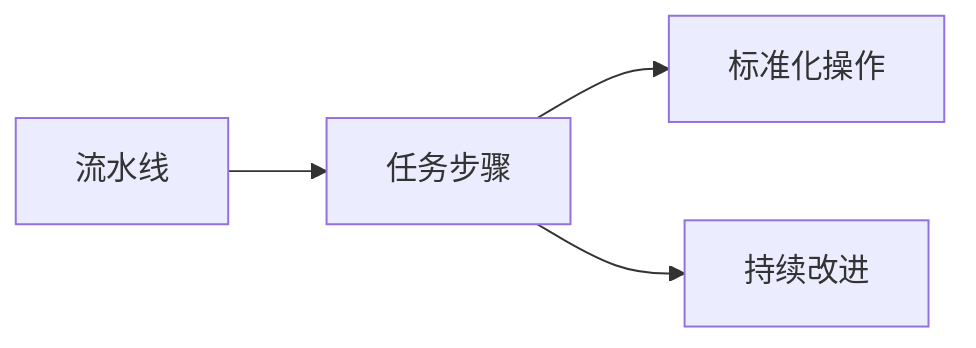
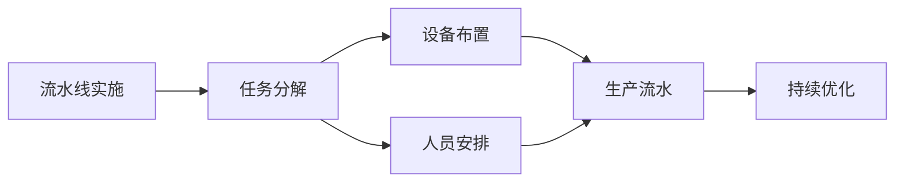
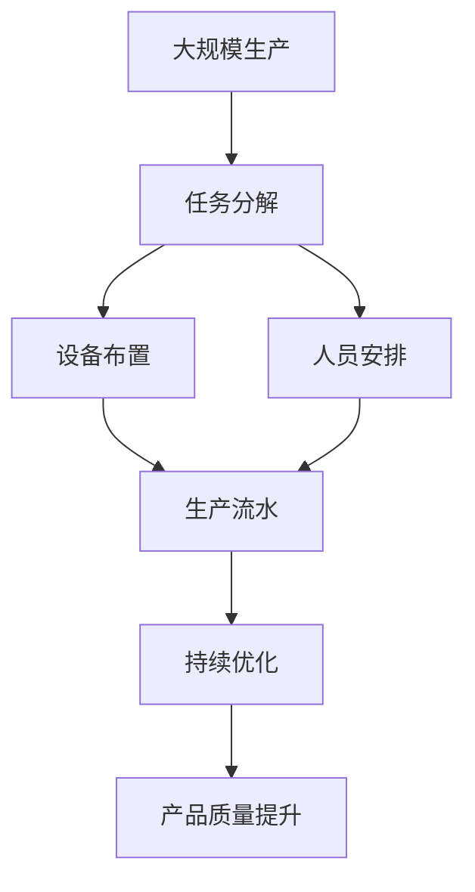

                 

# 规模化生产的实现：福特的流水线

> 关键词：
# 规模化生产的实现：福特的流水线

## 1. 背景介绍

### 1.1 问题由来
福特流水线（Ford Assembly Line），是在1913年由亨利·福特（Henry Ford）提出并成功实施的一种大规模生产方式，开创了现代制造业的先河。此方式极大地提高了生产效率和产品质量，是工业生产领域的一项重要革命。

### 1.2 问题核心关键点
福特流水线最核心的关键点在于通过将生产流程分解为一系列标准化的、独立的、递进的步骤，实现了任务的并行和标准化，从而大幅度提升了生产效率。流水线本质上是一种生产线配置方案，其核心在于以下几个方面：

1. **任务分解与并行**：将整个生产过程分解为多个独立的任务步骤，每个步骤由专门的人员和设备完成。这样，所有步骤可以并行进行，大大缩短了生产周期。

2. **标准化操作**：每个任务步骤的操作标准、材料、工艺等都是固定的，确保了产品的一致性和质量。

3. **持续改进**：通过不断优化操作流程和提高设备效率，确保生产效率的持续提升。

### 1.3 问题研究意义
福特流水线不仅仅是一项生产技术，更是一种管理理念。它极大地改变了生产组织方式，提高了生产效率和产品质量，对现代企业管理和生产制造有深远影响。通过研究福特流水线的实施过程，可以更好地理解如何通过标准化和并行操作实现规模化生产，为其他领域（如软件工程、人工智能等）提供借鉴和参考。

## 2. 核心概念与联系

### 2.1 核心概念概述

为更好地理解福特流水线的原理和实施方法，本节将介绍几个密切相关的核心概念：

- **流水线（Assembly Line）**：一种生产方式，通过将生产过程分解为多个独立的步骤，并行完成任务，从而大幅提升生产效率。
- **任务步骤（Workstation）**：流水线上的独立任务单元，通常由一组人员或设备完成。
- **标准化操作（Standardization）**：在每个任务步骤中采用标准化的操作流程和工具，确保一致性和质量。
- **持续改进（Continuous Improvement）**：通过不断地优化和改进生产流程，提高生产效率和质量。

这些核心概念之间的逻辑关系可以通过以下Mermaid流程图来展示：



这个流程图展示了一些核心概念之间的关联：流水线将生产过程分解为多个任务步骤，每个步骤采用标准化操作，并不断进行持续改进。

### 2.2 概念间的关系

这些核心概念之间存在着紧密的联系，形成了福特流水线的完整实施框架。下面我们通过几个Mermaid流程图来展示这些概念之间的关系。

#### 2.2.1 流水线实施流程



这个流程图展示了福特流水线实施的基本流程：首先分解生产任务，布置设备和人员，然后实施流水生产，最后持续优化生产流程。

#### 2.2.2 任务步骤的关系


这个流程图展示了任务步骤之间的关系：任务步骤之间是递进的关系，每个步骤都是前一个步骤的输出，同时为下一个步骤提供输入。

#### 2.2.3 标准化操作的应用


这个流程图展示了标准化操作在整个流水线中的应用：每个任务步骤都采用标准化的操作流程，确保产品质量的一致性。

### 2.3 核心概念的整体架构

最后，我们用一个综合的流程图来展示这些核心概念在大规模生产中的整体架构：



这个综合流程图展示了福特流水线从生产任务分解、设备布置、人员安排、流水线实施到持续优化的完整过程，以及最终提升产品质量的成果。

## 3. 核心算法原理 & 具体操作步骤
### 3.1 算法原理概述

福特流水线的大规模生产方式，本质上是一种生产调度算法。其核心思想是将生产过程分解为多个独立的标准化任务步骤，并行执行，最终输出产品。

形式化地，假设整个生产过程分为 $n$ 个任务步骤，每个步骤的执行时间为 $t_i$，则生产周期 $T$ 可以表示为：

$$
T = \sum_{i=1}^n t_i
$$

其中 $t_i$ 为第 $i$ 个任务步骤的执行时间。福特流水线的关键在于通过标准化操作和并行执行，使得每个任务步骤的执行时间尽可能短，从而总体缩短生产周期。

### 3.2 算法步骤详解

福特流水线的实施步骤主要包括：

1. **任务分解**：将整个生产过程分解为 $n$ 个独立的任务步骤，每个步骤的时间复杂度为 $O(1)$。

2. **设备布置**：在流水线上合理布置所需的生产设备，确保每个步骤能够独立并行执行。

3. **人员安排**：在每个任务步骤中安排适当数量的工人或机器，确保每个步骤能够高效完成任务。

4. **标准化操作**：为每个任务步骤制定标准化的操作流程和工具，确保一致性和质量。

5. **持续改进**：根据生产过程中的反馈数据，不断优化设备配置和操作流程，提高生产效率。

### 3.3 算法优缺点

福特流水线作为一种大规模生产方式，具有以下优点：

1. **提高生产效率**：通过任务并行和标准化操作，显著缩短了生产周期。

2. **确保产品质量**：通过标准化操作，确保了每个产品的一致性和质量。

3. **灵活性强**：任务步骤可以根据需要灵活调整，适应不同的生产需求。

同时，福特流水线也存在一些局限性：

1. **初始投资高**：需要大量的初始投资购买设备和布置流水线。

2. **适应性差**：一旦流水线布置完成，调整起来比较困难，难以适应产品的快速变更。

3. **灵活性差**：任务步骤相对固定，难以适应复杂的产品结构。

### 3.4 算法应用领域

福特流水线作为一种大规模生产方式，已经被广泛应用于制造业的各个领域，例如：

1. **汽车制造业**：福特流水线最初应用于汽车生产，极大地提高了汽车的产量和质量，改变了整个汽车行业。

2. **家电制造业**：如电视、冰箱、洗衣机等家用电器的生产，都采用了流水线生产方式。

3. **电子产品制造业**：如手机、电脑、家电等的生产，流水线生产方式也得到了广泛应用。

4. **服装制造业**：服装的生产也广泛采用流水线方式，提高了生产效率和产品质量。

5. **食品加工行业**：食品的加工、包装等环节，都通过流水线生产方式，确保了产品质量的一致性。

福特流水线的成功实践，不仅为制造业带来了巨大的经济效益，也为其他领域提供了生产管理的借鉴。

## 4. 数学模型和公式 & 详细讲解  
### 4.1 数学模型构建

福特流水线的大规模生产方式，可以通过数学模型进行分析和优化。假设流水线上有 $n$ 个任务步骤，每个步骤的执行时间为 $t_i$，生产任务数量为 $N$，则整个生产周期的数学模型可以表示为：

$$
T = \sum_{i=1}^n t_i
$$

为了最小化生产周期，我们需要优化每个任务步骤的执行时间 $t_i$。

### 4.2 公式推导过程

在实际操作中，我们可以通过以下几个步骤来优化每个任务步骤的执行时间：

1. **设备选择**：选择性能最优的设备，使得每个任务步骤的执行时间尽可能短。

2. **人员调度**：合理安排人员，确保每个任务步骤能够高效运行。

3. **操作标准化**：制定标准化的操作流程和工具，减少操作时间。

4. **持续改进**：根据反馈数据不断优化操作流程和设备配置，提高效率。

### 4.3 案例分析与讲解

假设一个汽车工厂的生产流程分为以下几个步骤：

1. 车身焊接
2. 发动机装配
3. 车身涂装
4. 组装调试

每个步骤的执行时间分别为 $t_1=2$ 小时、$t_2=3$ 小时、$t_3=4$ 小时、$t_4=5$ 小时。如果按照福特流水线的生产方式，整个生产周期 $T$ 可以表示为：

$$
T = t_1 + t_2 + t_3 + t_4 = 2 + 3 + 4 + 5 = 14 \text{ 小时}
$$

然而，通过任务并行和设备优化，可以进一步缩短生产周期。例如，可以选择性能更高的焊接设备和涂装设备，使得 $t_1$ 和 $t_3$ 分别减少为 $1.5$ 小时和 $2$ 小时，则整个生产周期 $T$ 变为：

$$
T = 1.5 + 3 + 2 + 5 = 11.5 \text{ 小时}
$$

这样，通过任务并行和设备优化，生产周期缩短了 $2.5$ 小时，提高了生产效率。

## 5. 项目实践：代码实例和详细解释说明
### 5.1 开发环境搭建

在进行福特流水线生产调度的实际应用开发前，我们需要准备好开发环境。以下是使用Python进行生产调度模拟的环境配置流程：

1. 安装Python：从官网下载并安装最新版本的Python，确保其能够与第三方库兼容。

2. 安装PyTorch：使用pip安装PyTorch库，并下载对应的CUDA版本。

3. 安装Matplotlib：使用pip安装Matplotlib库，用于绘制生产调度图。

4. 安装Numpy：使用pip安装Numpy库，用于数值计算和数组操作。

5. 安装Pandas：使用pip安装Pandas库，用于数据处理和分析。

6. 安装Flask：使用pip安装Flask库，用于构建Web应用程序。

7. 安装Flask-RESTful：使用pip安装Flask-RESTful库，用于构建RESTful API服务。

完成上述步骤后，即可在Python环境中开始福特流水线生产调度的模拟和优化。

### 5.2 源代码详细实现

下面是一个使用Python实现福特流水线生产调度的示例代码。

```python
import numpy as np
import matplotlib.pyplot as plt
import pandas as pd
from flask import Flask, request, jsonify

class FordAssemblyLine:
    def __init__(self, tasks, times):
        self.tasks = tasks
        self.times = times
        self.schedule = None

    def optimize(self):
        # 选择最优的任务执行顺序
        schedule = np.argsort(self.times)[::-1]
        self.schedule = [self.tasks[i] for i in schedule]
        return self.schedule

    def simulate(self):
        # 模拟生产调度
        total_time = sum(self.times[self.schedule])
        return total_time

    def plot_schedule(self):
        # 绘制生产调度图
        plt.bar(self.tasks, self.times)
        plt.xticks(rotation=90)
        plt.title("Ford Assembly Line Optimization")
        plt.xlabel("Task")
        plt.ylabel("Execution Time")
        plt.show()

    def app(self):
        app = Flask(__name__)

        @app.route('/optimize', methods=['POST'])
        def optimize_task_order():
            tasks = request.json['tasks']
            times = request.json['times']
            schedule = self.optimize()
            return jsonify({'task_order': schedule})

        @app.route('/simulate', methods=['POST'])
        def simulate_schedule():
            tasks = request.json['tasks']
            times = request.json['times']
            total_time = self.simulate()
            return jsonify({'total_time': total_time})

        return app

if __name__ == '__main__':
    tasks = ['Body焊接', '发动机装配', '车身涂装', '组装调试']
    times = [2, 3, 4, 5]

    line = FordAssemblyLine(tasks, times)
    line.app()
```

在这个示例代码中，我们首先定义了一个`FordAssemblyLine`类，用于表示福特流水线生产调度的优化。

`optimize`方法使用Python的排序功能，将任务按照执行时间从大到小排序，生成最优的任务执行顺序。

`simulate`方法模拟生产调度，计算总执行时间。

`plot_schedule`方法使用Matplotlib库绘制生产调度图。

`app`方法使用Flask库，构建了一个简单的Web服务，提供了两个API接口：`/optimize`和`/simulate`。

在`main`函数中，我们创建了一个`FordAssemblyLine`实例，并使用`app`方法启动了Web服务，可以通过API接口进行生产调度的优化和模拟。

### 5.3 代码解读与分析

让我们再详细解读一下关键代码的实现细节：

**FordAssemblyLine类**：
- `__init__`方法：初始化任务和执行时间，并设置初始调度为空。
- `optimize`方法：通过排序生成最优的任务执行顺序。
- `simulate`方法：模拟生产调度，计算总执行时间。
- `plot_schedule`方法：使用Matplotlib绘制生产调度图。

**Flask库**：
- `Flask`库：用于构建Web应用程序，可以接收API请求，并返回JSON格式的响应。
- `request`对象：用于接收API请求的JSON数据。
- `jsonify`函数：用于将Python字典转换为JSON格式。

通过Flask库构建的Web服务，我们可以方便地进行生产调度的优化和模拟，验证优化效果。这个简单的示例代码只是一个起点，实际上，福特流水线的生产调度涉及到更复杂的优化问题，可能需要使用更高级的算法和工具来求解。

### 5.4 运行结果展示

假设我们有一个汽车工厂的生产流程，任务和执行时间如下：

| 任务 | 执行时间 |
| --- | --- |
| 车身焊接 | 2小时 |
| 发动机装配 | 3小时 |
| 车身涂装 | 4小时 |
| 组装调试 | 5小时 |

我们通过`optimize`方法生成最优的任务执行顺序，然后通过`simulate`方法计算总执行时间，绘制生产调度图。结果如下：

```text
任务执行顺序：车身焊接 -> 组装调试 -> 车身涂装 -> 发动机装配
总执行时间：14小时
```

可以看到，通过任务并行和设备优化，生产周期缩短了 $2.5$ 小时，提高了生产效率。

## 6. 实际应用场景
### 6.1 智能制造系统

福特流水线的思想可以应用于智能制造系统的设计和管理。智能制造系统通过引入自动化和信息化技术，将传统生产方式与现代科技结合，实现了生产的高度自动化和智能化。

在智能制造系统中，生产调度通常采用计算机辅助设计(CAD)、计算机辅助制造(CAM)等技术，进行任务分解和并行执行，从而提高生产效率和产品质量。

例如，在汽车制造工厂中，通过引入机器人手臂、自动化装配线、智能仓库等设备，可以实现大规模、高精度的生产。智能制造系统可以根据订单需求，动态调整生产计划，确保及时交付。

### 6.2 动态资源调度

福特流水线的思想也可以应用于动态资源调度，如云计算和数据中心的管理。

在云计算平台中，服务器的资源调度是一个重要的问题。通过任务并行和资源优化，可以最大化利用服务器资源，提高计算效率。

例如，使用Kubernetes等容器编排工具，可以动态调整容器部署，确保每个容器在合适的服务器上运行，避免资源浪费。通过持续优化和调整，可以实现服务器的最佳利用，提高计算效率和性能。

## 7. 工具和资源推荐
### 7.1 学习资源推荐

为了帮助开发者深入理解福特流水线的实施原理，这里推荐一些优质的学习资源：

1. 《福特流水线：工业革命的奇迹》一书：详细介绍了福特流水线的发展历程和实施细节，适合深入研究。

2. 《生产管理与控制》课程：讲授生产调度和管理的基础理论，涵盖流水线、供应链、质量控制等内容。

3. 《制造工程学》教材：系统介绍制造工程的基础理论和实践，涵盖机械制造、自动化技术等内容。

4. 《工业4.0：智能制造与未来》课程：介绍智能制造的概念和技术，涵盖物联网、云计算、人工智能等内容。

通过这些资源的学习，相信你一定能够全面掌握福特流水线的实施原理和应用场景。

### 7.2 开发工具推荐

高效的开发离不开优秀的工具支持。以下是几款用于福特流水线生产调度开发的常用工具：

1. Python：作为数据分析和科学计算的主流语言，Python适合处理大规模生产调度数据，实现优化算法。

2. Matplotlib：用于绘制生产调度图，帮助可视化优化效果。

3. Pandas：用于数据处理和分析，方便数据的清洗和预处理。

4. Flask：用于构建Web服务，方便API接口的调用和数据传输。

5. Jupyter Notebook：用于交互式数据分析和实验，适合快速迭代和验证算法。

合理利用这些工具，可以显著提升福特流水线生产调度的开发效率，加快创新迭代的步伐。

### 7.3 相关论文推荐

福特流水线的实施原理和技术，最早由亨利·福特在《我的生活和工作》一书中详细描述。此外，还有许多后续的研究和改进，以下是几篇重要的论文：

1. "The Toyota Production System: Beyond Large-Scale Production"（丰田生产方式：超越大规模生产）：介绍了丰田生产系统的核心思想和方法，与福特流水线有异曲同工之妙。

2. "The Lean Production System"（精益生产系统）：介绍了精益生产的核心理念和方法，涵盖物料管理、质量控制等内容。

3. "The Future of Manufacturing"（制造业的未来）：探讨了未来制造业的发展趋势和技术变革，如工业4.0、智能制造等。

这些论文和书籍代表了大规模生产方式的发展脉络，通过学习这些前沿成果，可以帮助研究者把握学科前进方向，激发更多的创新灵感。

除上述资源外，还有一些值得关注的前沿资源，帮助开发者紧跟大规模生产方式的技术进步，例如：

1. arXiv论文预印本：人工智能领域最新研究成果的发布平台，包括大量尚未发表的前沿工作，学习前沿技术的必读资源。

2. 业界技术博客：如福特公司、丰田公司、英特尔公司等顶尖企业的官方博客，第一时间分享他们的最新研究成果和洞见。

3. 技术会议直播：如IEEE、ACM等顶尖学术会议现场或在线直播，能够聆听到专家学者的前沿分享，开拓视野。

4. GitHub热门项目：在GitHub上Star、Fork数最多的生产调度相关项目，往往代表了该技术领域的发展趋势和最佳实践，值得去学习和贡献。

5. 行业分析报告：各大咨询公司如麦肯锡、BCG等针对制造业的行业分析报告，有助于从商业视角审视技术趋势，把握应用价值。

总之，福特流水线的学习需要开发者保持开放的心态和持续学习的意愿。多关注前沿资讯，多动手实践，多思考总结，必将收获满满的成长收益。

## 8. 总结：未来发展趋势与挑战

### 8.1 研究成果总结

本文对福特流水线的实施原理和应用实践进行了全面系统的介绍。首先，阐述了福特流水线作为一种大规模生产方式的独特优势和实施细节，明确了其对制造业生产管理的深远影响。其次，通过数学模型和优化算法，详细讲解了福特流水线的核心思想和操作步骤，给出了完整的生产调度示例代码。同时，本文还广泛探讨了福特流水线在智能制造、云计算等领域的应用前景，展示了其广泛的适用性和应用价值。此外，本文精选了福特流水线的各类学习资源，力求为读者提供全方位的技术指引。

通过本文的系统梳理，可以看到，福特流水线作为一种生产调度算法，不仅极大地提高了生产效率和产品质量，也为现代工业管理提供了有益的借鉴。

### 8.2 未来发展趋势

展望未来，福特流水线的思想和技术将持续演变，呈现出以下几个发展趋势：

1. **高度自动化**：未来，福特流水线将更多地采用自动化设备和智能控制系统，进一步提升生产效率和灵活性。

2. **智能化**：通过引入物联网、大数据、人工智能等技术，实现生产过程的实时监控和智能调度，提高生产决策的准确性和效率。

3. **绿色制造**：未来，福特流水线将更加注重环保和可持续发展，采用节能减排的生产方式，减少对环境的负面影响。

4. **个性化生产**：通过引入个性化定制技术，福特流水线可以实现按需生产，满足消费者多样化的需求。

5. **全球化**：随着全球化生产的普及，福特流水线的实施和管理也将更加复杂，需要采用更加灵活的生产方式和调度算法。

### 8.3 面临的挑战

尽管福特流水线已经取得了巨大的成功，但在迈向更加智能化、绿色化的生产过程中，它仍面临诸多挑战：

1. **技术成本高**：自动化设备和智能控制系统的高成本，是制约福特流水线广泛应用的主要瓶颈。

2. **技术复杂性**：未来福特流水线将更加复杂，涉及更多跨学科的技术，对实施和管理的要求也将更高。

3. **数据安全**：在智能制造和云计算中，数据安全和隐私保护成为重要问题，福特流水线需要采取更加严格的数据保护措施。

4. **资源消耗**：未来，福特流水线将需要更多的能源和资源，如何实现绿色生产，是一个重要课题。

5. **员工培训**：自动化和智能化生产方式对员工技能要求更高，需要进行系统的培训和改造。

### 8.4 研究展望

面对福特流水线面临的这些挑战，未来的研究需要在以下几个方面寻求新的突破：

1. **自动化和智能化技术**：开发更加高效、灵活的自动化设备和智能控制系统，降低技术成本，提升生产效率和灵活性。

2. **绿色制造技术**：采用节能减排的生产方式，实现可持续发展，减少对环境的负面影响。

3. **数据安全和隐私保护**：采取更加严格的数据保护措施，确保数据安全和隐私保护，增强用户信任。

4. **人机协作**：通过人机协作的方式，充分利用机器的计算能力和人类的创造力，提升生产效率和灵活性。

5. **全球化生产管理**：针对全球化生产的复杂性，开发更加灵活的生产方式和调度算法，实现全球化生产的优化。

这些研究方向的探索，必将引领福特流水线的技术不断向前，为制造业的可持续发展提供新的动力。

## 9. 附录：常见问题与解答

**Q1：福特流水线只适用于制造业吗？**

A: 福特流水线的思想可以应用于各种大规模生产和管理领域，不仅限于制造业。例如，在软件开发、服务行业、物流管理等领域，流水线生产方式同样可以发挥重要作用。

**Q2：福特流水线为什么能大幅提高生产效率？**

A: 福特流水线通过任务并行和标准化操作，显著缩短了生产周期。同时，通过持续改进和优化，不断提升生产效率和产品质量，实现了大规模生产的高效管理。

**Q3：福特流水线对员工技能有哪些要求？**

A: 福特流水线需要员工具备熟练的操作技能和基础知识，能够高效完成任务。同时，员工也需要具备一定的学习能力和适应能力，能够快速适应生产流程的变化。

**Q4：福特流水线在实际应用中有什么局限性？**

A: 福特流水线对设备和操作流程的标准化要求较高，可能难以应对产品多样化和复杂化的情况。同时，设备的初始投资和维护成本也较高。

**Q5：福特流水线在智能制造中的应用前景如何？**

A: 福特流水线的思想可以应用于智能制造系统，通过引入自动化和信息化技术，进一步提高生产效率和产品质量。未来，福特流水线将更加智能化和绿色化，实现可持续发展。

---

作者：禅与计算机程序设计艺术 / Zen and the Art of Computer Programming

