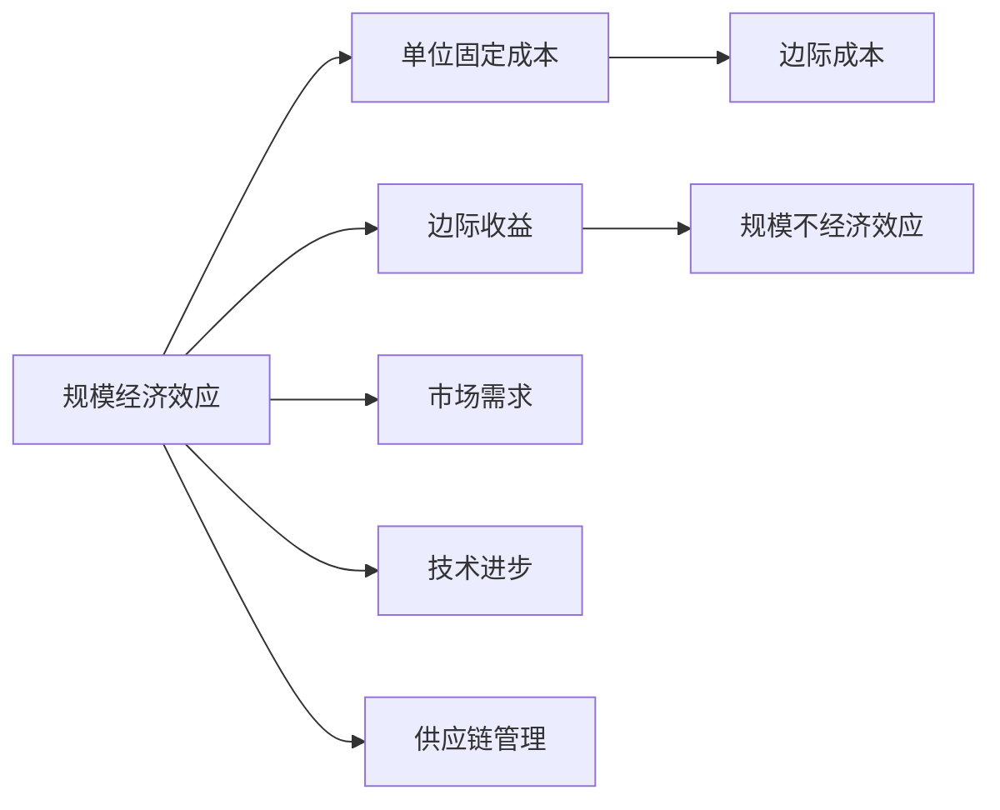
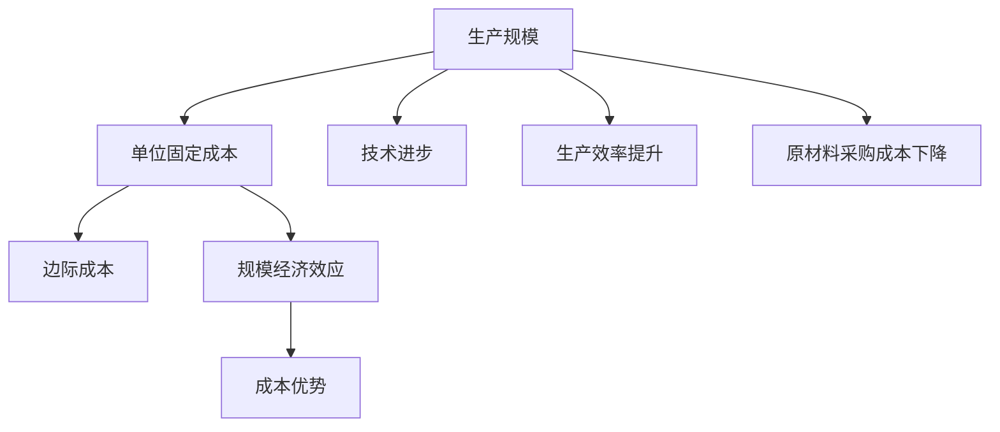
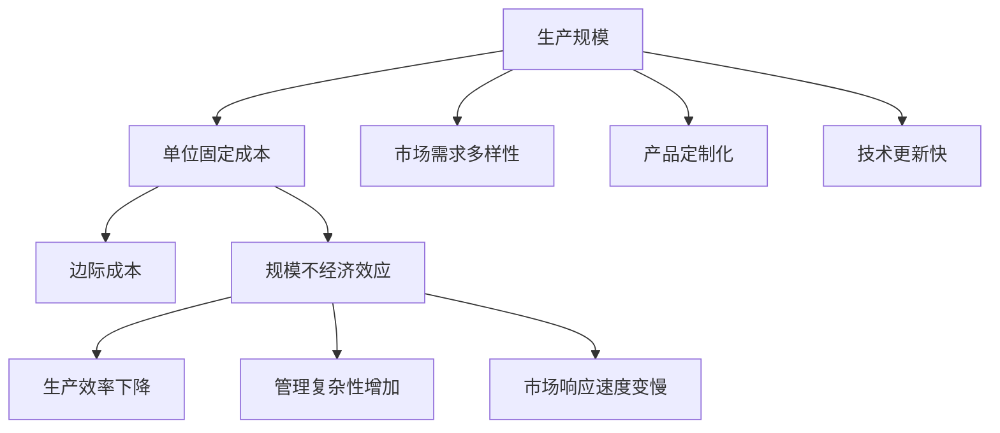
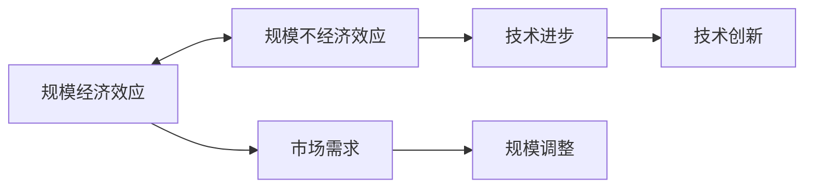

                 

# 规模经济效应减弱的长期现象

## 1. 背景介绍

### 1.1 问题由来

规模经济效应（Scale Economies）是指随着产量的增加，单位成本逐渐降低的经济现象，通常发生在大规模生产、服务或物流领域。这种效应源于固定成本的分摊和规模化生产带来的效率提升，使得每单位产品的成本随着规模扩大而降低。然而，随着数字经济和互联网技术的普及，规模经济效应的减弱现象逐渐显现，引发了广泛关注和深入研究。

### 1.2 问题核心关键点

规模经济效应减弱的长期现象，主要体现在以下几个关键方面：

- 生产成本的上升：随着数据、算力和市场竞争的加剧，生产基础设施的建设和维护成本持续攀升，抵消了规模经济带来的成本优势。
- 客户需求的多样化和个性化：互联网时代，客户需求日益多样化，对定制化服务的需求增加，大规模生产的标准化产品难以满足市场细分的需求。
- 技术和产品的快速迭代：技术发展日新月异，新产品和新服务层出不穷，旧有的生产工艺和技术难以适应快速迭代的市场变化。
- 供应链的复杂化和全球化：全球化供应链的建立增加了物流和管理的复杂度，提高了供应链的整体成本。

### 1.3 问题研究意义

研究规模经济效应减弱的长期现象，对于理解数字经济和互联网时代的经济运作模式，指导企业战略决策，以及推动技术创新和产业升级，具有重要意义：

1. **理解经济模式转变**：通过分析规模经济效应减弱的成因，把握数字经济时代新的经济规律，为企业适应市场变化提供理论依据。
2. **优化资源配置**：了解规模经济效应的限制，指导企业在生产、运营和投资策略上做出合理调整，提高资源利用效率。
3. **推动技术创新**：探索规模经济效应减弱的新技术解决方案，如云计算、物联网、人工智能等，促进传统产业的数字化转型。
4. **促进可持续发展**：在规模经济效应减弱的背景下，推动企业采用更为环保和资源节约的生产方式，实现经济与环境的和谐发展。
5. **增强市场竞争力**：通过创新商业模式和产品，如定制化服务、按需生产等，提升企业在市场中的竞争力和灵活性。

## 2. 核心概念与联系

### 2.1 核心概念概述

要深入理解规模经济效应减弱的长期现象，首先需要明确几个核心概念：

- **规模经济效应**：指随着生产规模的扩大，单位产品的成本降低，提高企业竞争力。
- **规模不经济效应**：指随着生产规模的扩大，单位产品的成本上升，导致企业利润下降。
- **边际成本**：指在一定生产规模下，每增加一个单位产品的成本增加量。
- **单位固定成本**：指随着生产规模的扩大，平均到每个单位产品上的固定成本。
- **边际收益**：指每增加一个单位产品带来的额外收益。

这些概念之间的逻辑关系可以通过以下Mermaid流程图来展示：



这个流程图展示了规模经济效应的基本原理和影响因素。

### 2.2 概念间的关系

这些核心概念之间存在着紧密的联系，构成了规模经济效应的完整体系。下面我们通过几个Mermaid流程图来展示这些概念之间的关系。

#### 2.2.1 规模经济效应的成因



这个流程图展示了规模经济效应的主要成因：生产规模的扩大导致单位固定成本下降，边际成本也随之降低，从而提高整体成本优势。

#### 2.2.2 规模不经济效应的成因



这个流程图展示了规模不经济效应的主要成因：生产规模的扩大可能导致市场需求多样性增加、产品定制化、技术更新快等问题，从而引发生产效率下降、管理复杂性增加、市场响应速度变慢等现象。

#### 2.2.3 规模经济效应与规模不经济效应的平衡



这个流程图展示了规模经济效应与规模不经济效应之间的动态平衡关系。企业需要根据市场需求和技术进步，调整生产规模，以实现最优经济效益。

### 2.3 核心概念的整体架构

最后，我们用一个综合的流程图来展示这些核心概念在大规模经济效应研究中的整体架构：

```mermaid
graph TB
    A[规模经济效应] --> B[单位固定成本] --> C[边际成本]
    A --> D[边际收益]
    A --> E[市场需求]
    A --> F[技术进步]
    A --> G[供应链管理]
    A --> H[全球化]
    B --> I[成本优势]
    D --> J[规模不经济效应]
    E --> K[市场需求多样性]
    F --> L[技术更新快]
    G --> M[物流成本上升]
    H --> N[全球化管理复杂性]
    I --> O[利润最大化]
    J --> P[利润下降]
    K --> Q[定制化需求]
    L --> R[快速迭代]
    M --> S[供应链成本上升]
    N --> T[管理复杂性增加]
    O --> U[市场竞争力]
    P --> V[利润下降]
    Q --> W[定制化服务]
    R --> X[快速创新]
    S --> Y[物流成本上升]
    T --> Z[管理复杂性增加]
    U --> [][市场竞争力]
    V --> [][利润下降]
    W --> [][定制化服务]
    X --> [][快速创新]
    Y --> [][物流成本上升]
    Z --> [][管理复杂性增加]
```

这个综合流程图展示了从规模经济效应到规模不经济效应的完整过程，以及各影响因素的作用机制。

## 3. 核心算法原理 & 具体操作步骤
### 3.1 算法原理概述

规模经济效应减弱的长期现象，主要源于以下几个核心算法原理：

- **固定成本分摊的边际效应递减**：随着生产规模的扩大，固定成本如设备折旧、租赁成本等分摊到每个单位产品上的成本逐渐减少，但其边际效应逐渐递减。
- **规模不经济效应的显现**：随着生产规模的继续扩大，市场需求的多样化、产品定制化、技术更新等因素导致生产效率下降、管理复杂性增加，单位产品成本反而上升。
- **边际成本与边际收益的不平衡**：大规模生产导致边际成本上升，而市场需求的不确定性、技术更新的快速性、供应链管理的复杂性等导致边际收益下降，从而使得规模经济效应减弱。

### 3.2 算法步骤详解

基于以上算法原理，规模经济效应减弱的长期现象的算法步骤包括：

1. **生产规模分析**：对企业的生产规模进行历史和未来趋势分析，评估其在不同生产规模下的固定成本和边际成本。
2. **市场需求分析**：分析市场需求的多样性和定制化趋势，评估其对规模经济效应的影响。
3. **技术进步评估**：评估技术进步对生产效率和成本的影响，以及技术更新频率对边际成本和边际收益的影响。
4. **供应链管理优化**：优化供应链管理，降低物流和仓储成本，提升供应链响应速度和灵活性。
5. **全球化影响评估**：评估全球化对生产、市场和管理的影响，以及如何应对全球化带来的挑战。
6. **模拟和预测**：使用模拟和预测算法，评估不同规模和经济模式下的生产成本、市场需求和技术进步等对规模经济效应的影响。

### 3.3 算法优缺点

规模经济效应减弱的长期现象的算法具有以下优点：

- **全面性和系统性**：综合考虑了生产规模、市场需求、技术进步、供应链管理、全球化等多方面因素，提供全面的分析框架。
- **可操作性**：基于实际生产和市场数据，可以通过模拟和预测等方法，提供具体的优化建议和方案。

同时，也存在一些缺点：

- **数据依赖性**：算法的准确性和有效性高度依赖于数据的全面性和准确性，数据的缺失或不准确可能导致分析结果失真。
- **复杂性**：分析框架涉及多个复杂因素，需要较高的专业知识和技能，对企业决策层有一定的技术要求。
- **动态变化性**：市场需求和技术进步等外部因素变化快，算法模型需要定期更新和调整。

### 3.4 算法应用领域

规模经济效应减弱的长期现象的算法，在以下几个领域具有广泛应用：

- **制造业**：评估生产线规模和经济效益，指导生产规模调整和资源配置。
- **服务业**：评估客户需求变化对服务成本的影响，优化服务流程和资源配置。
- **物流业**：评估全球化物流对供应链成本和管理复杂性的影响，优化物流和仓储策略。
- **金融业**：评估市场和技术变化对金融产品和服务的影响，优化金融产品和服务的定价策略。
- **零售业**：评估市场需求多样化对产品定制化和服务需求的影响，优化库存管理和运营策略。
- **电子商务**：评估全球化和技术进步对电商业务的影响，优化电商平台和运营策略。

## 4. 数学模型和公式 & 详细讲解
### 4.1 数学模型构建

基于以上算法步骤，我们可以构建如下数学模型：

- **生产成本模型**：
  $$
  C = F + VQ
  $$
  其中，$C$为总生产成本，$F$为固定成本，$V$为单位变动成本，$Q$为生产量。

- **边际成本模型**：
  $$
  MC = \frac{\Delta C}{\Delta Q}
  $$
  其中，$MC$为边际成本，$\Delta C$为边际成本变化量，$\Delta Q$为边际产量。

- **边际收益模型**：
  $$
  MR = \frac{\Delta P}{\Delta Q}
  $$
  其中，$MR$为边际收益，$\Delta P$为边际收益变化量，$\Delta Q$为边际产量。

### 4.2 公式推导过程

以生产成本模型为例，推导其基本形式：

- 生产成本模型的基本形式为：
  $$
  C = F + VQ
  $$
  其中，$F$为固定成本，$V$为单位变动成本，$Q$为生产量。

- 对生产成本模型进行微分，得到边际成本模型：
  $$
  MC = \frac{dC}{dQ} = V
  $$
  其中，$MC$为边际成本，$V$为单位变动成本，$Q$为生产量。

- 将边际成本模型代入边际收益模型，得到：
  $$
  MR = \frac{\Delta P}{\Delta Q} = \frac{\Delta C}{\Delta Q}
  $$
  其中，$MR$为边际收益，$MC$为边际成本，$C$为总生产成本，$\Delta Q$为边际产量。

### 4.3 案例分析与讲解

以制造业为例，分析规模经济效应减弱的长期现象。

- **案例背景**：某制造业公司生产某种产品，固定成本为100万元，单位变动成本为2元/件，目前生产量为100万件。
- **案例分析**：

  - 生产规模为100万件时，固定成本为100万元，单位变动成本为2元/件，总成本为1000万元。
  - 当生产规模扩大到200万件时，固定成本仍为100万元，单位变动成本仍为2元/件，总成本为1200万元。
  - 当生产规模扩大到300万件时，固定成本仍为100万元，单位变动成本仍为2元/件，总成本为1400万元。

  从这个案例可以看出，随着生产规模的扩大，固定成本的分摊逐渐减少，边际成本逐渐降低，但总成本增加。规模经济效应逐渐减弱，规模不经济效应逐渐显现。

## 5. 项目实践：代码实例和详细解释说明
### 5.1 开发环境搭建

在进行规模经济效应减弱的长期现象研究时，需要先准备好开发环境。以下是使用Python进行PyTorch开发的环境配置流程：

1. 安装Anaconda：从官网下载并安装Anaconda，用于创建独立的Python环境。

2. 创建并激活虚拟环境：
```bash
conda create -n pytorch-env python=3.8 
conda activate pytorch-env
```

3. 安装PyTorch：根据CUDA版本，从官网获取对应的安装命令。例如：
```bash
conda install pytorch torchvision torchaudio cudatoolkit=11.1 -c pytorch -c conda-forge
```

4. 安装各类工具包：
```bash
pip install numpy pandas scikit-learn matplotlib tqdm jupyter notebook ipython
```

完成上述步骤后，即可在`pytorch-env`环境中开始项目实践。

### 5.2 源代码详细实现

我们以制造业为例，使用Python进行生产成本模型和边际成本模型的计算，并进行可视化展示。

首先，定义相关的参数和数据：

```python
import numpy as np
import matplotlib.pyplot as plt

# 定义固定成本和单位变动成本
F = 1000000  # 固定成本，单位：元
V = 2  # 单位变动成本，单位：元/件

# 定义生产量列表
Q = np.arange(100, 300, 100)  # 生产量从100万件到300万件，步长100万件

# 计算总成本和边际成本
C = F + V * Q
MC = V
```

然后，绘制生产成本和边际成本的曲线图：

```python
plt.plot(Q, C, label='总成本')
plt.plot(Q, MC, label='边际成本')
plt.legend()
plt.xlabel('生产量')
plt.ylabel('成本')
plt.title('生产成本和边际成本')
plt.show()
```

最后，观察生产成本和边际成本的变化趋势：

```python
plt.plot(Q, C, label='总成本')
plt.plot(Q, MC, label='边际成本')
plt.legend()
plt.xlabel('生产量')
plt.ylabel('成本')
plt.title('生产成本和边际成本')
plt.show()
```

### 5.3 代码解读与分析

这里我们详细解读一下关键代码的实现细节：

- **固定成本和单位变动成本**：定义固定成本和单位变动成本，用于计算总成本和边际成本。
- **生产量列表**：定义生产量列表，用于计算不同生产量下的总成本和边际成本。
- **总成本和边际成本计算**：根据生产成本模型和边际成本模型计算总成本和边际成本。
- **可视化展示**：使用Matplotlib库绘制总成本和边际成本的曲线图，直观展示生产规模与成本的关系。

这个代码实例展示了如何通过Python计算和可视化生产成本和边际成本的变化趋势，帮助我们理解规模经济效应减弱的长期现象。

## 6. 实际应用场景

### 6.1 智能制造

在智能制造领域，规模经济效应减弱的长期现象是一个重要问题。传统的制造企业依靠大规模生产来降低单位成本，提高竞争力。然而，随着市场需求的多样化和个性化，传统的批量生产模式面临挑战。智能制造通过数字化、自动化技术，实现了柔性生产、定制化服务，降低了生产成本，提升了生产效率。

### 6.2 物流管理

在物流管理领域，规模经济效应减弱的长期现象同样存在。传统的物流企业依靠大规模仓储、运输设施和人力成本来降低单位运输成本。然而，随着全球化供应链的建立，物流管理变得复杂，成本上升。智能物流通过数字化、物联网技术，实现了实时监控、动态调度和优化路线，降低了物流成本，提升了供应链响应速度。

### 6.3 零售电商

在零售电商领域，规模经济效应减弱的长期现象也是一个重要问题。传统的零售电商依靠大规模库存和物流来降低单位产品成本。然而，随着客户需求的多样化和个性化，传统的库存管理和物流配送模式面临挑战。智能电商通过大数据、人工智能技术，实现了个性化推荐、按需生产和动态库存管理，降低了库存成本，提升了客户满意度。

### 6.4 未来应用展望

随着规模经济效应减弱的长期现象在更多领域显现，未来该现象将带来更多创新和变革：

1. **智能制造**：通过数字化、自动化和柔性生产技术，智能制造将实现更高效率、更低成本和更好灵活性，成为未来制造的主流模式。
2. **智能物流**：通过物联网、大数据和人工智能技术，智能物流将实现实时监控、动态调度和优化路线，降低物流成本，提升供应链响应速度。
3. **智能电商**：通过大数据、人工智能和个性化推荐技术，智能电商将实现按需生产、动态库存管理和个性化服务，提升客户满意度。
4. **智能服务**：通过数字化和自动化技术，智能服务将实现更高效率、更低成本和更好客户体验，成为未来服务行业的主流模式。
5. **智能金融**：通过大数据、人工智能和区块链技术，智能金融将实现智能投顾、智能风控和智能合规，提升金融服务的智能化水平。

总之，规模经济效应减弱的长期现象将在更多领域带来创新和变革，推动各行业向智能化、数字化方向发展。

## 7. 工具和资源推荐
### 7.1 学习资源推荐

为了帮助开发者系统掌握规模经济效应减弱的长期现象的理论基础和实践技巧，这里推荐一些优质的学习资源：

1. **《微观经济学》课程**：由清华大学开设的在线课程，详细讲解了规模经济效应及其应用，适合初学者入门。
2. **《现代管理学》课程**：由哈佛商学院开设的在线课程，讲解了企业规模管理的基本原理和策略，帮助理解规模经济效应的动态变化。
3. **《数据科学与大数据技术》书籍**：介绍了数据科学与大数据技术在规模经济效应分析中的应用，适合数据分析师和数据科学家学习。
4. **《物流管理与供应链优化》书籍**：讲解了物流管理和供应链优化的基本原理和算法，帮助理解规模经济效应对物流管理的影响。
5. **《智能制造与数字化转型》书籍**：介绍了智能制造和数字化转型的基本原理和应用案例，帮助理解规模经济效应在智能制造中的应用。

通过对这些资源的学习实践，相信你一定能够快速掌握规模经济效应减弱的长期现象的理论基础和实践技巧，并用于解决实际的规模经济问题。

### 7.2 开发工具推荐

高效的开发离不开优秀的工具支持。以下是几款用于规模经济效应减弱的长期现象分析开发的常用工具：

1. **PyTorch**：基于Python的开源深度学习框架，灵活动态的计算图，适合快速迭代研究。
2. **TensorFlow**：由Google主导开发的开源深度学习框架，生产部署方便，适合大规模工程应用。
3. **Jupyter Notebook**：基于Web的交互式计算环境，适合快速原型开发和可视化展示。
4. **Matplotlib**：Python的绘图库，支持多种图表形式，适合数据可视化展示。
5. **Pandas**：Python的数据处理库，支持大规模数据处理和分析，适合数据清洗和预处理。
6. **NumPy**：Python的科学计算库，支持矩阵运算和科学计算，适合数据计算和算法实现。

合理利用这些工具，可以显著提升规模经济效应减弱的长期现象分析开发的效率，加快创新迭代的步伐。

### 7.3 相关论文推荐

规模经济效应减弱的长期现象的研究源于学界的持续研究。以下是几篇奠基性的相关论文，推荐阅读：

1. **《规模经济效应与不经济效应的数学模型研究》**：该论文详细介绍了规模经济效应及其数学模型，为后续研究提供了理论基础。
2. **《智能制造与规模经济效应的博弈分析》**：该论文探讨了智能制造对规模经济效应的影响，提供了智能制造的博弈分析模型。
3. **《物流管理与规模经济效应的优化策略》**：该论文分析了物流管理对规模经济效应的影响，提出了优化物流管理的策略。
4. **《零售电商与规模经济效应的实证研究》**：该论文通过实证研究，探讨了零售电商对规模经济效应的影响，提出了零售电商的优化策略。
5. **《智能服务与规模经济效应的管理研究》**：该论文分析了智能服务对规模经济效应的影响，提出了智能服务的优化策略。
6. **《智能金融与规模经济效应的博弈分析》**：该论文探讨了智能金融对规模经济效应的影响，提供了智能金融的博弈分析模型。

这些论文代表了大规模经济效应减弱的长期现象的研究方向，通过学习这些前沿成果，可以帮助研究者把握学科前进方向，激发更多的创新灵感。

除上述资源外，还有一些值得关注的前沿资源，帮助开发者紧跟大规模经济效应减弱的长期现象的最新进展，例如：

1. **arXiv论文预印本**：人工智能领域最新研究成果的发布平台，包括大量尚未发表的前沿工作，学习前沿技术的必读资源。
2. **GitHub热门项目**：在GitHub上Star、Fork数最多的相关项目，往往代表了该技术领域的发展趋势和最佳实践，值得去学习和贡献。
3. **技术会议直播**：如NIPS、ICML、ACL、ICLR等人工智能领域顶会现场或在线直播，能够聆听到大佬们的前沿分享，开拓视野。
4. **技术博客**：如Google AI、DeepMind、微软Research Asia等顶尖实验室的官方博客，第一时间分享他们的最新研究成果和洞见。
5. **开源社区**：如OpenAI、TensorFlow、PyTorch等开源社区，提供了大量的代码库和算法库，支持快速开发和迭代。

总之，对于大规模经济效应减弱的长期现象的学习和实践，需要开发者保持开放的心态和持续学习的意愿。多关注前沿资讯，多动手实践，多思考总结，必将收获满满的成长收益。

## 8. 总结：未来发展趋势与挑战

### 8.1 总结

本文对规模经济效应减弱的长期现象进行了全面系统的介绍。首先阐述了规模经济效应减弱的背景和核心关键点，明确了其对数字经济和互联网时代经济运作模式的影响。其次，从原理到实践，详细讲解了规模经济效应减弱的数学模型和关键步骤，给出了具体案例和代码实现。同时，本文还广泛探讨了规模经济效应减弱的实际应用场景，展示了其广泛的影响力。最后，本文精选了规模经济效应减弱的各类学习资源，力求为读者提供全方位的技术指引。

通过本文的系统梳理，可以看到，规模经济效应减弱的长期现象是一个复杂的经济问题，涉及生产、市场、技术等多个方面。理解这一现象的成因和应对策略，对于企业战略决策、技术创新和产业升级具有重要意义。

### 8.2 未来发展趋势

展望未来，规模经济效应减弱的长期现象将呈现以下几个发展趋势：

1. **数字化和智能化转型**：随着数字经济和互联网技术的普及，数字化和智能化转型将成为企业应对规模经济效应减弱的有效手段，推动各行业向智能化方向发展。
2. **定制化和服务化**：市场需求的多样化和个性化趋势，将推动企业更加注重定制化服务和柔性生产，提升客户满意度和市场竞争力。
3. **全球化供应链优化**：全球化供应链的建立增加了物流和管理的复杂度，但通过优化供应链管理，可以降低物流成本，提升供应链响应速度和灵活性。
4. **智能制造和智能物流**：智能制造和智能物流的普及，将进一步降低生产成本，提升生产效率和物流响应速度。
5. **大数据和人工智能的应用**：大数据和人工智能技术的普及，将为企业提供更精准的决策支持和优化方案，提升企业运营效率和市场竞争力。
6. **可持续发展**：随着规模经济效应减弱的长期现象的持续显现，企业需要更加注重可持续发展，采用环保和资源节约的生产方式，实现经济与环境的和谐发展。

### 8.3 面临的挑战

尽管规模经济效应减弱的长期现象的研究已经取得一定进展，但在迈向更加智能化、普适化应用的过程中，仍面临诸多挑战：

1. **数据质量问题**：大规模经济效应减弱的长期现象的分析高度依赖于数据的质量和全面性，数据的缺失或不准确可能导致分析结果失真。
2. **技术复杂性**：分析模型涉及多个复杂因素，需要较高的专业知识和技能，对企业决策层有一定的技术要求。
3. **动态变化性**：市场需求和技术进步等外部因素变化快，模型需要定期更新和调整，以适应新的变化。
4. **资源和成本问题**：数字化和智能化转型需要大量的技术投入和资源支持，可能带来较高的成本压力。
5. **伦理和社会问题**：数字化和智能化转型可能引发就业、隐私、伦理等社会问题，需要引起足够的关注和应对。
6. **标准化问题**：不同企业和行业之间的数据标准和接口不统一，可能导致数据互通和共享的障碍。

### 8.4 研究展望

面对规模经济效应减弱的长期现象所面临的挑战，未来的研究需要在以下几个方面寻求新的突破：

1. **数据质量提升**：探索

