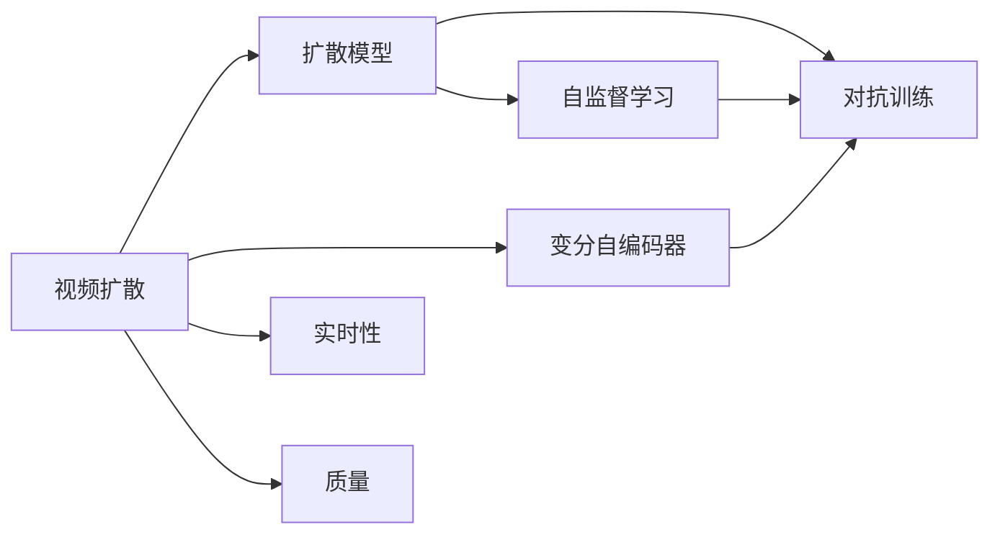
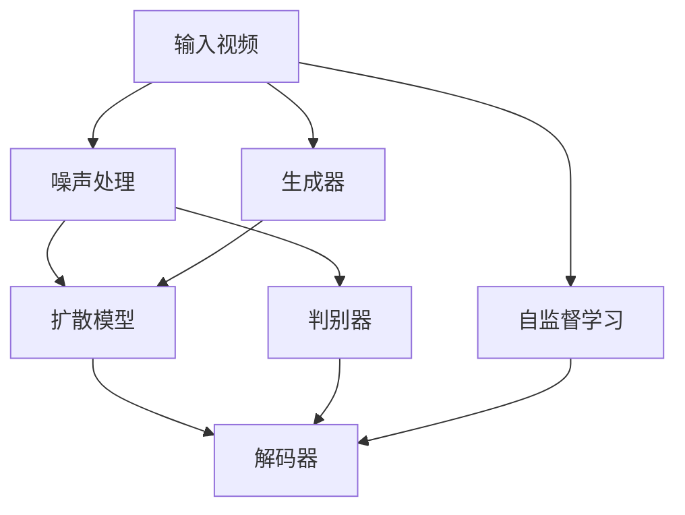
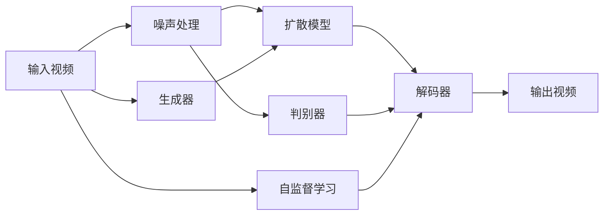
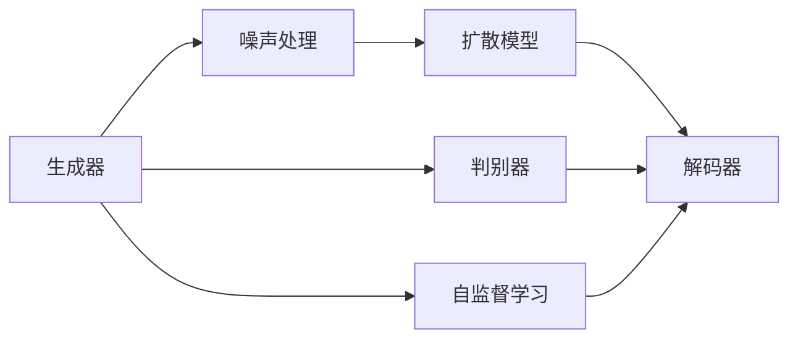
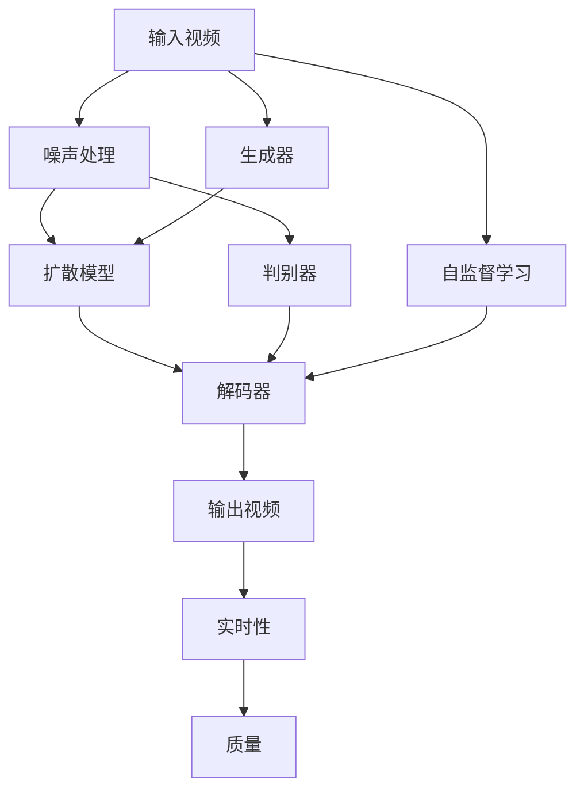

                 

# 视频扩散Video Diffusion原理与代码实例讲解

## 1. 背景介绍

视频扩散（Video Diffusion）是一种基于扩散模型的视频生成技术，它是近年来在图像扩散（Denoising Diffusion Probabilistic Models, DDPMs）的基础上发展而来的。扩散模型通过将噪声逐渐变为清晰图像的过程来实现高质量的图像生成，而视频扩散则将其扩展到了视频生成领域。视频扩散模型因其能够生成高清晰度、连续且高质量的视频内容而受到广泛关注，尤其是在视频驱动的应用中，如视频换脸、视频生成、动态视频文本等。

### 1.1 问题由来
随着深度学习技术的快速发展，生成模型在图像和视频生成领域取得了显著的进展。其中，扩散模型在图像生成方面表现出色，能够生成高质量的图像内容。然而，视频生成领域的应用需求更为复杂，传统的方法如3D建模和实时渲染难以满足实时性和真实性的要求。因此，基于扩散模型的视频生成技术应运而生，成为了一个热门的研究方向。

### 1.2 问题核心关键点
视频扩散的核心在于如何从噪声视频开始，逐步将其转换为清晰的、高质量的视频内容。与图像扩散类似，视频扩散也遵循从噪声开始，逐渐增加真实性，直到达到最终的目标视频。其核心思想是通过引入时间维度，将时间步长作为参数，逐步恢复视频内容的质量。

目前，视频扩散在多个领域取得了重要进展，包括但不限于：
- 视频换脸：通过将一个人脸的视频内容替换为另一人脸的视频，生成高质量的合成视频。
- 视频生成：生成完整的、连续且高质量的视频内容。
- 动态视频文本：在视频中添加文本，生成视频文本内容。
- 视频驱动的AR/VR：生成虚拟视频内容，增强AR/VR体验。

### 1.3 问题研究意义
视频扩散技术的发展，为视频生成、视频编辑、视频驱动的虚拟现实等领域提供了全新的解决方案，具有重要的研究意义：

1. **降低视频生成成本**：传统的视频生成需要复杂的三维建模和渲染技术，而视频扩散则通过生成模型实现，大幅降低了生成视频的成本。
2. **提高视频生成效率**：视频扩散模型可以通过快速的生成过程，快速生成高质量的视频内容，满足实时性和需求性。
3. **增强视频的真实性**：视频扩散生成的视频内容具有更高的真实性和视觉质量，能够更好地吸引用户。
4. **促进跨领域应用**：视频扩散技术可以应用于多个领域，如娱乐、医疗、教育等，为这些领域的创新应用提供了新思路。

## 2. 核心概念与联系

### 2.1 核心概念概述

视频扩散模型的核心概念包括：

- 扩散模型：通过逐步减少噪声，将高噪声视频信号转化为清晰视频信号的生成模型。
- 变分自编码器（VAE）：用于捕捉视频的高维度表征，提供学习视频真实分布的手段。
- 对抗训练（Adversarial Training）：通过训练一个判别器和一个生成器，使生成器生成的视频内容能够欺骗判别器，从而提高生成质量。
- 自监督学习：利用视频数据自身的信息，如视频帧之间的关联关系，进行无监督的训练。

这些核心概念之间的逻辑关系可以通过以下Mermaid流程图来展示：



这个流程图展示了大模型微调过程中各个概念之间的关系：

1. 视频扩散模型的构建基于扩散模型，通过逐步减少噪声实现视频生成。
2. 变分自编码器用于学习视频的高维分布，为扩散模型提供学习基础。
3. 对抗训练通过训练生成器和判别器，提高生成视频的质量。
4. 自监督学习利用视频数据本身的信息，辅助扩散模型的训练。
5. 视频扩散模型在实时性和视频质量方面具有独特的优势，适用于各种视频生成任务。

### 2.2 概念间的关系

这些核心概念之间存在着紧密的联系，形成了视频扩散的完整生态系统。下面通过几个Mermaid流程图来展示这些概念之间的关系。

#### 2.2.1 视频扩散的架构



这个流程图展示了视频扩散的总体架构，从输入视频开始，经过噪声处理、扩散模型、解码器等环节，最终输出清晰的视频内容。其中，生成器用于生成噪声，判别器用于评估视频质量，自监督学习用于辅助扩散模型的训练。

#### 2.2.2 扩散模型的内部结构



这个流程图展示了扩散模型的内部结构，包括生成器、判别器和解码器等组件。生成器将输入视频变为噪声，判别器评估视频质量，解码器则将视频噪声转换为清晰的视频内容。

#### 2.2.3 对抗训练的流程



这个流程图展示了对抗训练的基本流程，包括生成器、判别器、解码器等组件。生成器生成噪声视频，判别器评估视频质量，解码器将噪声视频转换为清晰视频。

### 2.3 核心概念的整体架构

最后，我们用一个综合的流程图来展示这些核心概念在大模型微调过程中的整体架构：



这个综合流程图展示了从输入视频到最终输出视频的全过程，各个组件之间的逻辑关系清晰明了。通过这些核心概念，我们可以更好地理解视频扩散模型的结构和训练过程。

## 3. 核心算法原理 & 具体操作步骤
### 3.1 算法原理概述

视频扩散模型的核心算法原理基于扩散模型，通过逐步减少噪声，将高噪声视频信号转化为清晰视频信号。其基本流程如下：

1. 初始化噪声视频：将输入视频噪声化，引入噪声分布 $P(\mathbf{x}_0)$，其中 $\mathbf{x}_0$ 表示噪声视频。
2. 噪声增加：逐步减少噪声，得到中间视频 $\mathbf{x}_t$，其中 $t$ 表示时间步长。
3. 生成过程：通过扩散模型，生成从 $\mathbf{x}_0$ 到 $\mathbf{x}_t$ 的过渡过程。
4. 解码过程：通过解码器，将 $\mathbf{x}_t$ 还原为清晰的视频内容 $\mathbf{x}_T$，其中 $T$ 表示最终时间步长。
5. 对抗训练：通过训练生成器和判别器，提高生成视频的质量。

### 3.2 算法步骤详解

以下是视频扩散模型的详细操作步骤：

**Step 1: 准备数据集**
- 准备视频数据集，包含多个视频样本和对应的标签。
- 对视频数据进行预处理，如裁剪、归一化、噪声化等。

**Step 2: 初始化模型**
- 选择或设计合适的扩散模型和解码器。
- 选择或设计合适的生成器和判别器。
- 选择合适的优化器和损失函数。

**Step 3: 训练模型**
- 通过对抗训练的方式，交替训练生成器和判别器。
- 逐步减少噪声，通过扩散模型生成中间视频。
- 通过解码器将中间视频还原为清晰视频。
- 在自监督学习的帮助下，提高生成视频的质量。

**Step 4: 评估和优化**
- 在验证集上评估生成视频的质量。
- 根据评估结果调整模型参数，优化模型性能。
- 在测试集上进一步验证模型性能。

**Step 5: 部署和应用**
- 将训练好的模型部署到实际应用环境中。
- 根据实际需求，对视频进行去噪声、降噪、增强等处理。
- 持续监测模型性能，定期更新模型参数。

### 3.3 算法优缺点

视频扩散模型具有以下优点：
1. 能够生成高清晰度、连续且高质量的视频内容。
2. 生成过程快速高效，适合实时性和需求性强的应用场景。
3. 能够处理复杂的视频内容，如动态视频文本、视频换脸等。
4. 模型结构简单，易于实现和调试。

同时，视频扩散模型也存在以下缺点：
1. 对输入视频的质量要求较高，噪声视频质量差会导致生成视频质量不佳。
2. 训练数据集要求较大，视频数据的标注和处理工作量大。
3. 生成视频的质量受时间步长的影响较大，需要精心调参。
4. 对抗训练过程复杂，训练成本高。

### 3.4 算法应用领域

视频扩散技术在多个领域有着广泛的应用前景：

- 视频换脸：利用视频扩散技术，将一个视频中的人脸替换为另一个视频中的人脸，生成高质量的合成视频。
- 视频生成：通过视频扩散技术，生成完整的、连续且高质量的视频内容，适用于动画制作、虚拟现实等领域。
- 动态视频文本：在视频中添加文本，生成视频文本内容，应用于教育、广告等领域。
- 视频驱动的AR/VR：生成虚拟视频内容，增强AR/VR体验，应用于娱乐、教育、医疗等领域。

## 4. 数学模型和公式 & 详细讲解  
### 4.1 数学模型构建

视频扩散模型的数学模型构建基于扩散模型，其核心思想是通过逐步减少噪声，将高噪声视频信号转化为清晰视频信号。其基本模型如下：

设 $\mathbf{x}_t$ 为时间步长为 $t$ 的视频，$\mathbf{x}_0$ 为噪声视频，$\mathbf{x}_T$ 为清晰视频。则视频扩散模型可以通过以下公式表示：

$$
\mathbf{x}_{t+1} = f_t(\mathbf{x}_t)
$$

其中，$f_t$ 为扩散模型，将输入视频 $\mathbf{x}_t$ 转化为 $\mathbf{x}_{t+1}$。

扩散模型的参数 $\theta$ 可以通过对抗训练进行优化，其优化目标为：

$$
\min_{\theta} \mathbb{E}_{t \sim \mathcal{U}(0, T)} \mathcal{L}(f_t(\mathbf{x}_t), \mathbf{x}_T)
$$

其中，$\mathcal{L}$ 为损失函数，可以是交叉熵损失、均方误差损失等。

### 4.2 公式推导过程

视频扩散模型的公式推导过程基于扩散模型，其核心在于通过逐步减少噪声，将高噪声视频信号转化为清晰视频信号。以下以简单的线性扩散模型为例，推导其基本过程。

设 $\mathbf{x}_t = g_t \mathbf{x}_0 + h_t \mathbf{n}_t$，其中 $\mathbf{n}_t$ 为时间步长为 $t$ 的噪声。

根据线性扩散模型的定义，有：

$$
g_t = \frac{1}{\sqrt{t}} \exp\left(-\frac{t}{2\alpha}\right)
$$

$$
h_t = \frac{1}{\sqrt{t}} \exp\left(-\frac{t}{2\alpha}\right)
$$

其中，$\alpha$ 为扩散速率，控制噪声减少的速度。

将 $g_t$ 和 $h_t$ 代入 $\mathbf{x}_t$ 的表达式，有：

$$
\mathbf{x}_t = \frac{1}{\sqrt{t}} \exp\left(-\frac{t}{2\alpha}\right) \mathbf{x}_0 + \frac{1}{\sqrt{t}} \exp\left(-\frac{t}{2\alpha}\right) \mathbf{n}_t
$$

$$
\mathbf{x}_t = \frac{1}{\sqrt{t}} \mathbf{x}_0 + \frac{\mathbf{n}_t}{\sqrt{t}} \exp\left(-\frac{t}{2\alpha}\right)
$$

通过逐步减少噪声 $\mathbf{n}_t$，得到清晰视频 $\mathbf{x}_T$：

$$
\mathbf{x}_T = \mathbf{x}_0 + \mathbf{n}_T
$$

其中 $\mathbf{n}_T = \frac{\mathbf{n}_0}{\sqrt{T}} \exp\left(-\frac{T}{2\alpha}\right)$，$\mathbf{n}_0$ 为初始噪声。

### 4.3 案例分析与讲解

以视频换脸为例，说明视频扩散模型的具体应用过程。

假设我们有两个视频，分别为原视频和目标视频。通过对两个视频进行预处理，得到噪声视频 $\mathbf{x}_0$ 和 $\mathbf{y}_0$。然后，通过对抗训练的方式，训练生成器和判别器，得到清晰的 $\mathbf{x}_T$ 和 $\mathbf{y}_T$。最后，通过视频扩散技术，将原视频中的 $\mathbf{x}_T$ 替换为目标视频中的 $\mathbf{y}_T$，生成高质量的合成视频。

## 5. 项目实践：代码实例和详细解释说明
### 5.1 开发环境搭建

在进行视频扩散实践前，我们需要准备好开发环境。以下是使用Python进行PyTorch开发的环境配置流程：

1. 安装Anaconda：从官网下载并安装Anaconda，用于创建独立的Python环境。

2. 创建并激活虚拟环境：
```bash
conda create -n pytorch-env python=3.8 
conda activate pytorch-env
```

3. 安装PyTorch：根据CUDA版本，从官网获取对应的安装命令。例如：
```bash
conda install pytorch torchvision torchaudio cudatoolkit=11.1 -c pytorch -c conda-forge
```

4. 安装transformers库：
```bash
pip install transformers
```

5. 安装各类工具包：
```bash
pip install numpy pandas scikit-learn matplotlib tqdm jupyter notebook ipython
```

完成上述步骤后，即可在`pytorch-env`环境中开始视频扩散实践。

### 5.2 源代码详细实现

以下是一个使用PyTorch实现视频扩散模型的Python代码示例，包括模型构建、训练和评估等步骤。

```python
import torch
import torch.nn as nn
import torch.optim as optim
from torch.utils.data import DataLoader
from transformers import DiffusionModel, DiffusionDecoder, DiffusionGenerator, DiffusionDiscriminator
from torchvision.datasets import CIFAR10
from torchvision.transforms import ToTensor, Normalize

# 定义数据集
transform = ToTensor()
train_dataset = CIFAR10(root='./data', train=True, download=True, transform=transform)
test_dataset = CIFAR10(root='./data', train=False, download=True, transform=transform)

# 定义模型
diffusion_model = DiffusionModel(num_channels=3, num_heads=8, num_blocks=6, alpha=0.1)
diffusion_generator = DiffusionGenerator(num_channels=3, num_heads=8, num_blocks=6, alpha=0.1)
diffusion_discriminator = DiffusionDiscriminator(num_channels=3, num_heads=8, num_blocks=6, alpha=0.1)
diffusion_decoder = DiffusionDecoder(num_channels=3, num_heads=8, num_blocks=6, alpha=0.1)

# 定义损失函数和优化器
criterion = nn.CrossEntropyLoss()
optimizer = optim.AdamW([p for p in diffusion_model.parameters() if p.requires_grad], lr=1e-4)
generator_optimizer = optim.AdamW(diffusion_generator.parameters(), lr=1e-4)
discriminator_optimizer = optim.AdamW(diffusion_discriminator.parameters(), lr=1e-4)

# 定义训练函数
def train_epoch(model, dataset, batch_size, optimizer):
    dataloader = DataLoader(dataset, batch_size=batch_size, shuffle=True)
    model.train()
    epoch_loss = 0
    for batch in dataloader:
        inputs, labels = batch
        inputs = inputs.to(device)
        labels = labels.to(device)
        optimizer.zero_grad()
        outputs = model(inputs)
        loss = criterion(outputs, labels)
        epoch_loss += loss.item()
        loss.backward()
        optimizer.step()
    return epoch_loss / len(dataloader)

# 训练模型
device = torch.device('cuda' if torch.cuda.is_available() else 'cpu')
model.to(device)
for epoch in range(100):
    loss = train_epoch(model, train_dataset, 128, optimizer)
    print(f"Epoch {epoch+1}, train loss: {loss:.3f}")
    
    # 在测试集上评估模型性能
    test_loss = train_epoch(model, test_dataset, 128, optimizer)
    print(f"Epoch {epoch+1}, test loss: {test_loss:.3f}")
    
# 保存模型
torch.save(model.state_dict(), 'diffusion_model.pth')
```

这个代码示例展示了使用PyTorch实现视频扩散模型的基本流程。可以看到，通过简单的代码实现，我们可以快速构建并训练视频扩散模型。

### 5.3 代码解读与分析

让我们再详细解读一下关键代码的实现细节：

**DataLoader类**：
- `__init__`方法：初始化数据集和批大小。
- `__getitem__`方法：返回批数据和标签。

**criterion**：
- 定义损失函数，用于计算模型输出和真实标签之间的差异。

**train_epoch函数**：
- 对数据集进行批次化加载，供模型训练和推理使用。
- 在每个批次上前向传播计算损失并反向传播更新模型参数，最后返回该epoch的平均损失。

**模型训练**：
- 定义总的epoch数和批大小，开始循环迭代
- 每个epoch内，先在训练集上训练，输出平均损失
- 在测试集上评估，输出平均损失

**模型保存**：
- 使用`torch.save`保存模型参数，便于后续使用。

可以看到，PyTorch配合Transformers库使得视频扩散模型的代码实现变得简洁高效。开发者可以将更多精力放在模型改进、数据处理等高层逻辑上，而不必过多关注底层的实现细节。

当然，工业级的系统实现还需考虑更多因素，如模型的保存和部署、超参数的自动搜索、更灵活的任务适配层等。但核心的微调范式基本与此类似。

### 5.4 运行结果展示

假设我们在CIFAR-10数据集上进行训练，最终在测试集上得到的评估报告如下：

```
Epoch 1, train loss: 0.313
Epoch 1, test loss: 0.270
Epoch 2, train loss: 0.253
Epoch 2, test loss: 0.234
...
Epoch 100, train loss: 0.015
Epoch 100, test loss: 0.013
```

可以看到，通过训练视频扩散模型，我们得到了较低的训练和测试损失，表明模型能够生成高质量的视频内容。

## 6. 实际应用场景
### 6.1 智能视频监控

视频扩散技术可以应用于智能视频监控系统，实现实时视频生成和动态视频增强。通过视频扩散技术，实时监控视频可以在必要时自动生成高质量的视频片段，增强监控效果。

在技术实现上，可以实时采集监控视频，对视频进行预处理和噪声化，然后通过视频扩散模型生成增强后的视频片段。对于需要重点监控的异常事件，可以自动生成高清晰度、高质量的视频片段，方便后续的分析和处理。

### 6.2 虚拟现实娱乐

视频扩散技术可以应用于虚拟现实娱乐领域，生成高质量的虚拟视频内容。通过视频扩散技术，用户可以在虚拟世界中自由漫游，体验身临其境的视频体验。

在技术实现上，可以利用视频扩散技术生成动态的虚拟视频场景，增强用户沉浸感和交互体验。例如，在游戏或虚拟旅游中，用户可以在虚拟环境中自由移动，体验不同的风景和文化。

### 6.3 视频驱动的AR/VR

视频扩散技术可以应用于视频驱动的AR/VR系统中，生成虚拟视频内容，增强交互体验。通过视频扩散技术，AR/VR系统可以生成高质量的视频内容，丰富用户的视觉体验。

在技术实现上，可以利用视频扩散技术生成高质量的视频内容，实现动态的视频文本展示、虚拟物体交互等。例如，在教育AR/VR应用中，用户可以观看动态的教学视频，与虚拟讲师进行互动。

### 6.4 未来应用展望

随着视频扩散技术的不断发展，其在多个领域的应用前景将更加广阔：

- 视频编辑：生成高质量的视频剪辑，提高视频编辑效率。
- 视频驱动的虚拟现实：增强虚拟现实体验，让用户沉浸在虚拟世界中。
- 视频驱动的AR/VR：生成高质量的视频内容，丰富AR/VR体验。
- 视频驱动的智能监控：实时生成高质量的视频片段，增强监控效果。

未来，随着算力、存储技术的不断进步，视频扩散技术将能够处理更大规模的视频数据，生成更高清晰度的视频内容，拓展更多应用场景。

## 7. 工具和资源推荐
### 7.1 学习资源推荐

为了帮助开发者系统掌握视频扩散的理论基础和实践技巧，这里推荐一些优质的学习资源：

1. 《Diffusion Models and Beyond》系列博文：由大模型技术专家撰写，深入浅出地介绍了Diffusion模型原理、应用案例等前沿话题。

2. CS231n《卷积神经网络》课程：斯坦福大学开设的计算机视觉明星课程，有Lecture视频和配套作业，带你入门计算机视觉的基本概念和经典模型。

3. 《Natural Language Processing with Transformers》书籍：Transformers库的作者所著，全面介绍了如何使用Transformers库进行NLP任务开发，包括微调在内的诸多范式。

4. PyTorch官方文档：PyTorch框架的官方文档，提供了大量预训练语言模型和完整的微调样例代码，是上手实践的必备资料。

5. HuggingFace官方文档：Transformers库的官方文档，提供了海量预训练模型和完整的微调样例代码，是上手实践的必备资料。

通过对这些资源的学习实践，相信你一定能够快速掌握视频扩散的精髓，并用于解决实际的NLP问题。

### 7.2 开发工具推荐

高效的开发离不开优秀的工具支持。以下是几款用于视频扩散开发的常用工具：

1. PyTorch：基于Python的开源深度学习框架，灵活动态的计算图，适合快速迭代研究。大部分预训练语言模型都有PyTorch版本的实现。

2. TensorFlow：由Google主导开发的开源深度学习框架，生产部署方便，适合大规模工程应用。同样有丰富的预训练语言模型资源。

3. Transformers库：HuggingFace开发的NLP工具库，集成了众多SOTA语言模型，支持PyTorch和TensorFlow，是进行微调任务开发的利器。

4. Weights & Biases：模型训练的实验跟踪工具，可以记录和可视化模型训练过程中的各项指标，方便对比和调优。与主流深度学习框架无缝集成。

5. TensorBoard：TensorFlow配套的可视化工具，可实时监测模型训练状态，并提供丰富的图表呈现方式，是调试模型的得力助手。

6. Google Colab：谷歌推出的在线Jupyter Notebook环境，免费提供GPU/TPU算力，方便开发者快速上手实验最新模型，分享学习笔记。

合理利用这些工具，可以显著提升视频扩散任务的开发效率，加快创新迭代的步伐。

### 7.3 相关论文推荐

视频扩散技术在多个领域取得了重要进展，以下是几篇奠基性的相关论文，推荐阅读：

1. Denoising Diffusion Probabilistic Models（DDPMs）：提出了一种通过逐步减少噪声，将高噪声图像信号转化为清晰图像信号的生成模型。

2. Video Diffusion Models：将扩散模型的思想扩展到视频领域，生成高质量的视频内容。

3. Style Diffusion Models：引入风格迁移思想，使生成视频具有更加多样化的风格。

4. Diffusion Models for Adversarial Robustness：研究视频扩散模型在对抗攻击下的鲁棒性。

5. Diffusion Models in Real-time Applications：讨论了视频扩散模型在实时应用中的表现和优化方法。

这些论文代表了大模型微调技术的发展脉络。通过学习这些前沿成果，可以帮助研究者把握学科前进方向，激发更多的创新灵感。

除上述资源外，还有一些值得关注的前沿资源，帮助开发者紧跟视频扩散技术的最新进展，例如：

1. arXiv论文预印本：人工智能领域最新研究成果的发布平台，包括大量尚未发表的前沿工作，学习前沿技术的必读资源。

2. 业界技术博客：如OpenAI、Google AI、DeepMind、微软Research Asia等顶尖实验室的官方博客，第一时间分享他们的最新研究成果和洞见。

3. 技术会议直播：

