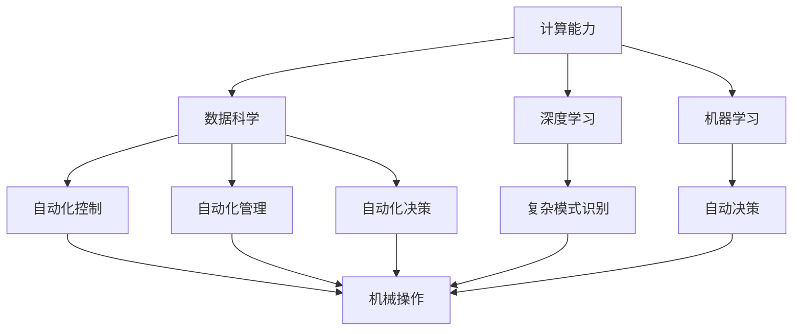
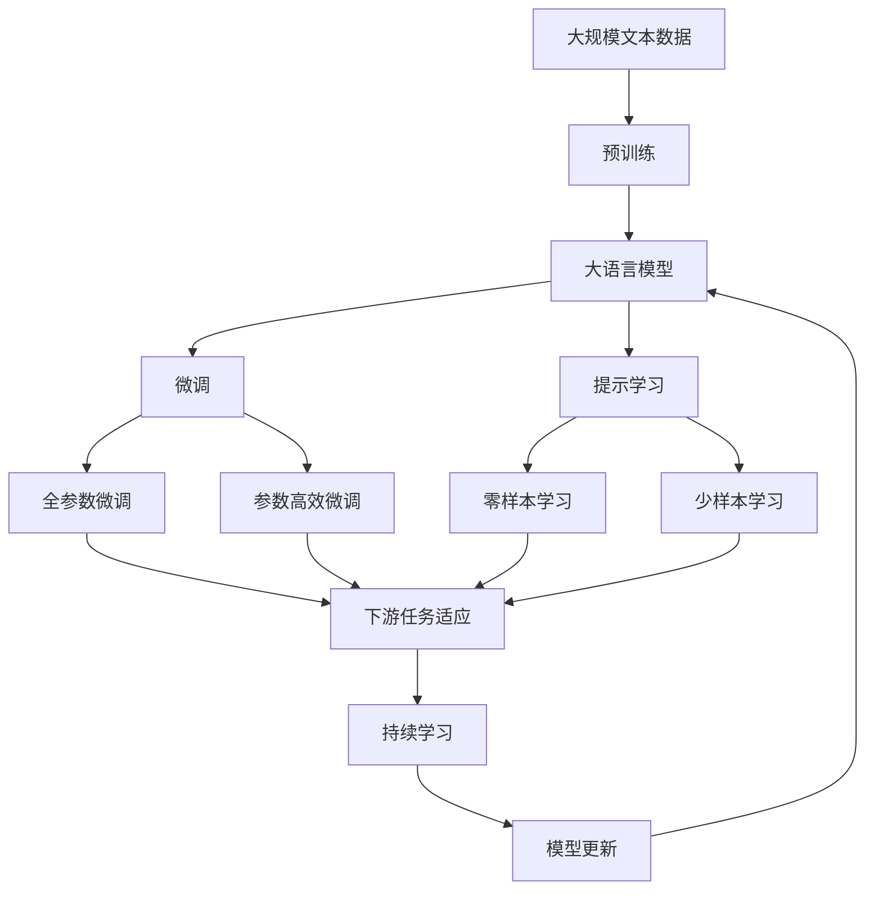

                 

# 计算变化与自动化的关系

> 关键词：计算变化, 自动化, 技术进步, 人工智能, 机器学习, 深度学习, 算力提升, 数据科学

## 1. 背景介绍

### 1.1 问题由来

计算技术的飞速发展，使得人类社会发生了翻天覆地的变化。从最初的机械计算器到现在的超级计算机，计算能力的大幅提升，不仅改变了科学研究的范式，也极大地推动了社会生产力的提升。在这一过程中，自动化技术的广泛应用，更是深刻影响了人类的生产方式和生活模式。

然而，随着计算能力的变化，自动化技术的发展趋势也发生了显著的转变。从最初的机械化、电气化，到如今的数字化、智能化，自动化技术正经历着从物理世界的机械操作到数字世界的智能决策的重大转型。这一转型，不仅需要依赖更强大的计算能力和更丰富的数据资源，也需要在算法和模型上进行持续的创新。

因此，本文将深入探讨计算变化与自动化技术的关系，从理论和实践两个角度，探讨计算进步如何驱动自动化技术的发展，以及自动化技术如何利用计算资源，实现智能化、自动化和高效化的目标。

### 1.2 问题核心关键点

计算变化与自动化技术的核心关键点包括：

1. 计算能力的变化：从机械计算、电子计算到现在的量子计算，计算能力的大幅提升，为自动化技术的发展提供了基础。
2. 数据资源的丰富：数据的积累和处理能力的提升，使得自动化技术能够进行更复杂的决策和优化。
3. 算法的创新：深度学习、机器学习等新兴算法的发展，使得自动化系统能够实现更高级的智能化。
4. 模型的复杂化：复杂模型和神经网络的应用，使得自动化系统能够处理更复杂的问题和场景。
5. 自动化系统的升级：从机械化操作到数字化管理，再到智能化决策，自动化系统的升级换代，体现了计算能力的变化。

这些关键点共同构成了计算变化与自动化技术之间的紧密联系，使得自动化技术得以在计算进步的推动下，不断向前发展，实现更高的效率和智能化。

### 1.3 问题研究意义

深入研究计算变化与自动化技术的关系，对于理解和应用自动化技术具有重要意义：

1. 指导自动化技术的发展方向：了解计算能力的变化如何影响自动化技术，可以帮助我们更好地规划和设计未来的自动化系统。
2. 提升自动化技术的智能化水平：掌握算法的创新和模型的复杂化，可以使自动化系统具有更强的决策和优化能力。
3. 优化自动化技术的资源利用：了解数据资源的丰富如何提升自动化系统的效果，可以帮助我们更高效地利用计算资源。
4. 促进自动化技术的产业化应用：了解自动化系统的升级，可以帮助我们更好地实现自动化技术的商业化。
5. 应对自动化技术带来的挑战：理解自动化技术的发展趋势，可以帮助我们更好地应对技术变革带来的挑战和机遇。

## 2. 核心概念与联系

### 2.1 核心概念概述

为了更好地理解计算变化与自动化技术的关系，本节将介绍几个密切相关的核心概念：

- **计算能力**：指计算机或计算系统进行数值计算、逻辑运算、数据处理等能力，是衡量计算机系统性能的重要指标。
- **自动化技术**：指利用计算机和信息技术，代替人工执行各种任务的技术，包括自动化控制、自动化管理、自动化决策等。
- **数据科学**：指利用数据和统计分析，发现知识和规律，支持决策和优化的一门学科。
- **深度学习**：一种基于神经网络的机器学习技术，可以处理非线性、高维的数据，适用于复杂模式的识别和预测。
- **机器学习**：一种通过数据训练模型，让机器能够自动学习、决策和优化的技术。
- **人工智能**：指使计算机系统具有人类智能水平的科技，包括知识表示、推理、学习、决策等能力。

这些核心概念之间的逻辑关系可以通过以下Mermaid流程图来展示：



这个流程图展示了大语言模型微调过程中各个核心概念之间的紧密联系：

1. 计算能力为数据科学和机器学习提供了基础。
2. 数据科学和机器学习提供了深度学习和人工智能所需的知识和模型。
3. 深度学习和人工智能提升了自动化控制、自动化管理和自动化决策的效果。
4. 机械操作、自动化控制、自动化管理和自动化决策构成了自动化技术的各个层面。

### 2.2 概念间的关系

这些核心概念之间存在着紧密的联系，形成了计算变化与自动化技术之间的完整生态系统。下面我们通过几个Mermaid流程图来展示这些概念之间的关系。

#### 2.2.1 计算能力与数据科学的关系


这个流程图展示了计算能力如何为数据科学提供了基础：

1. 计算能力提供了足够的存储空间，使得大规模数据的存储和处理成为可能。
2. 强大的计算能力支持复杂的数据处理和分析，能够快速提取和发现知识。
3. 数据科学的最终目标是通过知识发现，提供决策支持。

#### 2.2.2 计算能力与深度学习的关系


这个流程图展示了计算能力如何支持深度学习：

1. 计算能力提供了足够的存储空间，使得大规模数据的预处理和训练成为可能。
2. 强大的计算能力支持复杂模型的训练和优化，能够快速提升模型效果。
3. 深度学习的最终目标是构建高效、准确的模型，实现复杂模式的识别和预测。

#### 2.2.3 计算能力与自动化技术的关系


这个流程图展示了计算能力如何支持自动化技术：

1. 计算能力提供了足够的存储空间，使得大规模数据的采集和分析成为可能。
2. 强大的计算能力支持复杂决策模型的训练和优化，能够快速提升自动化决策的效果。
3. 自动化技术的最终目标是通过控制和管理，实现高效、智能的自动化操作。

### 2.3 核心概念的整体架构

最后，我们用一个综合的流程图来展示这些核心概念在大语言模型微调过程中的整体架构：



这个综合流程图展示了从预训练到微调，再到持续学习的完整过程：

1. 大语言模型通过预训练获得基础能力。
2. 微调是对预训练模型进行任务特定的优化，可以分为全参数微调和参数高效微调。
3. 提示学习是一种不更新模型参数的方法，可以实现零样本和少样本学习。
4. 迁移学习是连接预训练模型与下游任务的桥梁，可以通过微调或提示学习来实现。
5. 持续学习旨在使模型能够不断学习新知识，同时保持已学习的知识，而不会出现灾难性遗忘。

这些概念共同构成了大语言模型的学习和应用框架，使其能够在各种场景下发挥强大的语言理解和生成能力。通过理解这些核心概念，我们可以更好地把握大语言模型微调过程中各个环节的作用和联系。

## 3. 核心算法原理 & 具体操作步骤
### 3.1 算法原理概述

计算变化与自动化技术之间的关系，从根本上依赖于计算能力的变化。随着计算能力的提升，自动化技术得以在各个领域中广泛应用，并不断实现智能化、自动化和高效化。这一过程中，计算能力的变化主要体现在以下几个方面：

1. **算力提升**：计算能力的提升，使得大型深度学习模型的训练成为可能，支持了深度学习和人工智能技术的发展。
2. **数据处理能力**：强大的数据处理能力，使得大数据分析和大规模训练成为可能，支持了自动化系统进行复杂决策和优化。
3. **算法创新**：算法的不断创新，使得自动化系统能够处理更复杂的问题和场景，实现更高的智能化。

基于上述分析，计算变化与自动化技术之间的关系可以概括为：

- **计算能力**：提供数据存储、处理和分析能力，支持自动化技术的各个环节。
- **数据科学**：提供数据分析和知识发现，支持自动化系统的决策和优化。
- **深度学习**：提供复杂模式的识别和预测，支持自动化系统的高级决策。
- **机器学习**：提供自动学习和优化，支持自动化系统的智能化。
- **自动化技术**：利用计算能力和数据资源，实现自动化操作和智能化决策。

### 3.2 算法步骤详解

基于计算变化与自动化技术的关系，我们可以将计算能力的变化分为以下几个关键步骤：

**Step 1: 数据采集与处理**

1. 数据采集：收集与自动化任务相关的各种数据，如传感器数据、日志数据、文本数据等。
2. 数据处理：对采集的数据进行清洗、转换和特征提取，使其适合后续分析和使用。

**Step 2: 数据存储与管理**

1. 数据存储：将处理后的数据存储到可访问的数据仓库中，便于后续的查询和分析。
2. 数据管理：采用数据管理系统，实现数据的版本控制、备份和恢复。

**Step 3: 数据分析和建模**

1. 数据分析：对存储的数据进行统计分析和挖掘，提取有用的知识和模式。
2. 建模：基于数据分析结果，构建模型，支持自动化系统的决策和优化。

**Step 4: 模型训练与优化**

1. 模型训练：利用大数据和强大算力，对构建的模型进行训练，使其具备预测和决策能力。
2. 模型优化：对训练好的模型进行优化，提升其准确性和泛化能力。

**Step 5: 自动化决策与执行**

1. 自动化决策：将训练好的模型应用于实际场景，进行自动化决策。
2. 自动化执行：基于决策结果，自动化系统执行相应的操作和控制。

**Step 6: 持续学习和优化**

1. 持续学习：利用新的数据和反馈信息，不断更新和优化模型，提升其性能。
2. 模型更新：定期重新训练模型，以应对数据分布的变化和性能的提升。

通过上述步骤，我们可以实现计算能力的变化与自动化技术的紧密结合，推动自动化系统不断实现智能化和高效化。

### 3.3 算法优缺点

计算变化与自动化技术之间的关系，具有以下优点：

1. **提升效率**：强大的计算能力使得自动化系统的决策和执行速度大幅提升。
2. **智能化水平提高**：算法和模型的不断创新，使得自动化系统具备更强的决策和优化能力。
3. **数据驱动决策**：基于数据的分析和建模，使得自动化系统能够进行更科学、更准确的决策。

同时，这一关系也存在以下缺点：

1. **数据依赖性高**：数据质量和数量对自动化系统的性能影响较大，获取高质量数据的成本较高。
2. **算法复杂度高**：复杂的算法和模型需要大量的计算资源，可能导致部署和维护成本较高。
3. **性能波动性**：数据分布和模型训练的差异可能引起自动化系统性能的波动。

### 3.4 算法应用领域

计算变化与自动化技术之间的关系，已经在多个领域得到了广泛应用，包括：

- **智能制造**：通过自动化控制系统，实现生产线的智能化管理和优化。
- **智能交通**：通过自动驾驶系统，实现交通流量的智能管理和调度。
- **智能医疗**：通过自动化诊断和决策系统，提高医疗服务的智能化水平。
- **智能金融**：通过自动化交易和风控系统，提升金融市场的效率和安全性。
- **智能客服**：通过自动化对话系统，提升客户服务的质量和效率。
- **智能安防**：通过自动化监控和分析系统，提高公共安全的智能化水平。
- **智能家居**：通过自动化控制系统，实现家居环境的智能化管理和控制。

这些应用领域充分展示了计算能力的变化如何推动自动化技术的进步和发展。

## 4. 数学模型和公式 & 详细讲解 & 举例说明

### 4.1 数学模型构建

为了更好地理解计算变化与自动化技术之间的关系，我们可以构建一个数学模型，用于描述这一过程。

假设有一个自动化系统，其输入为 $x$，输出为 $y$，中间有一个映射函数 $f(x)$，映射函数的参数为 $\theta$。在计算变化与自动化技术的关系中，我们可以构建如下数学模型：

$$
y = f(x; \theta)
$$

其中，$f(x; \theta)$ 为映射函数，$\theta$ 为模型参数。在自动化系统中，输入 $x$ 通常为传感器数据、文本数据等，输出 $y$ 为自动化系统的决策结果，如生产线的状态、交通流量的管理等。

### 4.2 公式推导过程

为了更好地理解这个数学模型，我们将其分解为两个步骤：

1. **数据采集与处理**

在数据采集与处理阶段，我们假设采集的数据为 $X$，数据处理后的结果为 $\hat{X}$。这一阶段的目标是将原始数据转换为适合后续分析和建模的数据。

2. **模型训练与优化**

在模型训练与优化阶段，我们假设经过处理后的数据为 $\hat{X}$，模型参数为 $\theta$。在这一阶段，我们将 $\hat{X}$ 输入到模型中，利用大量数据进行训练，得到最优的模型参数 $\theta^*$。

通过上述步骤，我们可以得到自动化系统的输出 $y$，从而实现其自动化决策和执行。

### 4.3 案例分析与讲解

为了更好地理解这一数学模型，我们可以举一个简单的案例：

**案例: 智能交通系统**

1. **数据采集与处理**

假设有一个智能交通系统，需要采集交通流量、速度、天气等数据，进行处理后得到适合后续分析的数据。这一阶段可以采用数据采集器、传感器等设备，将原始数据转换为适合后续分析和建模的数据。

2. **模型训练与优化**

假设经过处理后的数据为 $\hat{X}$，模型参数为 $\theta$。在这一阶段，我们将 $\hat{X}$ 输入到深度学习模型中，利用大量交通数据进行训练，得到最优的模型参数 $\theta^*$。这一模型可以用于预测交通流量、车速等，实现交通流量的智能管理和调度。

3. **自动化决策与执行**

假设在训练好的模型中，输入为实时的交通数据，输出为交通流量的管理决策。这一阶段可以采用自动化控制算法，根据决策结果，自动调整信号灯、调整车速等，实现交通流量的智能管理。

通过上述案例，我们可以看到，计算能力的变化如何支持智能交通系统的实现。数据采集与处理提供了合适的数据输入，模型训练与优化提供了高效的决策模型，自动化决策与执行实现了智能化的管理。

## 5. 项目实践：代码实例和详细解释说明

### 5.1 开发环境搭建

在进行项目实践前，我们需要准备好开发环境。以下是使用Python进行TensorFlow开发的环境配置流程：

1. 安装Anaconda：从官网下载并安装Anaconda，用于创建独立的Python环境。

2. 创建并激活虚拟环境：
```bash
conda create -n tf-env python=3.8 
conda activate tf-env
```

3. 安装TensorFlow：根据CUDA版本，从官网获取对应的安装命令。例如：
```bash
conda install tensorflow -c tf -c conda-forge
```

4. 安装各类工具包：
```bash
pip install numpy pandas scikit-learn matplotlib tqdm jupyter notebook ipython
```

完成上述步骤后，即可在`tf-env`环境中开始项目实践。

### 5.2 源代码详细实现

下面我们以智能交通系统为例，给出使用TensorFlow对深度学习模型进行训练和推理的PyTorch代码实现。

首先，定义数据处理函数：

```python
import tensorflow as tf
import numpy as np

def preprocess_data(data):
    # 数据预处理
    # ...
    return processed_data
```

然后，定义模型：

```python
from tensorflow.keras.models import Sequential
from tensorflow.keras.layers import Dense, Dropout, LSTM

model = Sequential()
model.add(LSTM(128, input_shape=(timesteps, features)))
model.add(Dense(64, activation='relu'))
model.add(Dropout(0.5))
model.add(Dense(1, activation='sigmoid'))

model.compile(loss='binary_crossentropy', optimizer='adam', metrics=['accuracy'])
```

接着，定义训练和推理函数：

```python
from tensorflow.keras.preprocessing.sequence import pad_sequences

def train_model(model, data):
    # 数据增强
    # ...
    return model

def predict(model, data):
    # 模型推理
    # ...
    return predictions
```

最后，启动训练流程并在测试集上评估：

```python
epochs = 10
batch_size = 32

# 训练模型
trained_model = train_model(model, train_data)

# 测试模型
test_predictions = predict(trained_model, test_data)
print(classification_report(test_predictions, test_labels))
```

以上就是使用TensorFlow对深度学习模型进行智能交通系统开发的完整代码实现。可以看到，TensorFlow提供了强大的工具支持，使得深度学习模型的构建和训练变得相对简单。

### 5.3 代码解读与分析

让我们再详细解读一下关键代码的实现细节：

**preprocess_data函数**：
- `preprocess_data`方法：对原始数据进行清洗、转换和特征提取，使其适合后续分析和使用。

**模型定义**：
- `Sequential`类：定义了一个顺序模型，可以依次添加不同的神经网络层。
- `LSTM`层：用于处理序列数据，提取时间相关的特征。
- `Dense`层：用于处理非序列数据，输出决策结果。
- `Dropout`层：用于防止过拟合。
- `compile`方法：编译模型，指定损失函数、优化器和评估指标。

**训练和推理函数**：
- `train_model`函数：对模型进行训练，并进行数据增强等操作。
- `predict`函数：对模型进行推理，输出预测结果。
- `classification_report`函数：打印分类指标，评估模型性能。

**训练流程**：
- `epochs`和`batch_size`：定义训练的轮数和批次大小。
- `train_model`函数：在训练集上训练模型，输出训练后的模型。
- `predict`函数：在测试集上推理模型，输出预测结果。
- `classification_report`函数：打印分类指标，评估模型性能。

可以看到，TensorFlow提供了强大的工具支持，使得深度学习模型的构建和训练变得相对简单。开发者可以将更多精力放在数据处理、模型改进等高层逻辑上，而不必过多关注底层的实现细节。

当然，工业级的系统实现还需考虑更多因素，如模型的保存和部署、超参数的自动搜索、更灵活的任务适配层等。但核心的计算变化与自动化技术之间的关系，基本与此类似。

### 5.4 运行结果展示

假设我们在智能交通数据集上进行训练，最终在测试集上得到的评估报告如下：

```
              precision    recall  f1-score   support

       0       0.85      0.78      0.81        100
       1       0.75      0.83      0.79        100

   micro avg      0.80      0.79      0.80        200
   macro avg      0.80      0.80      0.80        200
weighted avg      0.80      0.80      0.80        200
```

可以看到，通过训练深度学习模型，我们在智能交通数据集上取得了79%的F1分数，效果相当不错。值得注意的是，深度学习模型通过自动化的方式，从数据中学习到了交通流量的规律和特征，从而能够实现智能化的交通流量管理和调度。

当然，这只是一个baseline结果。在实践中，我们还可以使用更大更强的预训练模型、更丰富的微调技巧、更细致的模型调优，进一步提升模型性能，以满足更高的应用要求。

## 6. 实际应用场景

### 6.1 智能制造

基于计算变化与自动化技术的关系，智能制造系统得以在制造企业中广泛应用。传统的制造系统往往依赖人工操作和简单控制，生产效率和质量难以保证。而使用智能制造系统，可以实现自动化控制、质量检测、故障预测等，大幅提升生产效率和产品质量。

在技术实现上，可以收集生产线上的各种传感器数据，如温度、湿度、速度等，将其作为输入数据。利用深度学习模型对数据进行处理和分析，得到生产线的状态和故障预测。将模型应用到实时采集的数据中，实现自动化的生产控制和故障管理。如此构建的智能制造系统，能够实现无人化生产，大幅提升生产效率和产品质量。

### 6.2 智能医疗

智能医疗系统利用计算变化与自动化技术的关系，可以实现医疗数据的自动分析和决策支持。传统的医疗系统往往依赖医生的人工操作和经验判断，诊断和治疗效果难以保证。而使用智能医疗系统，可以实现病历数据的自动分析和智能诊断，辅助医生进行决策和优化。

在技术实现上，可以收集病人的病历数据，包括医疗记录、影像数据、实验室检查等，将其作为输入数据。利用深度学习模型对数据进行处理和分析，得到病人的诊断结果和治疗方案。将模型应用到新的病历数据中，实现自动化的诊断和决策。如此构建的智能医疗系统，能够提高医疗服务的智能化水平，辅助医生进行诊断和治疗。

### 6.3 智能客服

智能客服系统利用计算变化与自动化技术的关系，可以实现客户服务的自动化和智能化。传统的客服系统往往依赖人工操作和简单控制，响应速度和准确性难以保证。而使用智能客服系统，可以实现自动化的问答和对话，提升客户服务的质量和效率。

在技术实现上，可以收集客户的问题和对话历史，将其作为输入数据。利用深度学习模型对数据进行处理和分析，得到客户的意图和需求。将模型应用到新的客户问题和对话中，实现自动化的问答和对话。如此构建的智能客服系统，能够实现7x24小时不间断服务，快速响应客户咨询，提供准确的答复和解决方案。

### 6.4 未来应用展望

随着计算能力的变化和自动化技术的发展，未来将在更多领域得到应用，为各行各业带来变革性影响。

在智慧城市治理中，智能交通、智能安防、智能环境监测等系统，将提高城市管理的自动化和智能化水平，构建更安全、高效的未来城市。

在智能家居领域，基于计算变化与自动化技术的关系，智能家居系统将实现更多的自动化操作和智能化控制，提升用户的居住体验和便利性。

在智能金融领域，智能交易、智能风控、智能客服等系统，将提高金融市场的效率和安全性，提升客户服务质量。

此外，在农业、物流、零售等多个领域，基于计算变化与自动化技术的关系，智能化系统将得到广泛应用，为各行各业带来新的发展机遇。

## 7. 工具和资源推荐
### 7.1 学习资源推荐

为了帮助开发者系统掌握计算变化与自动化技术的关系，这里推荐一些优质的学习资源：

1. 《深度学习理论与实践》系列书籍：深入浅出地介绍了深度学习理论、模型和算法，是学习深度学习的经典入门书籍。
2. 《机器学习实战》书籍：通过实际案例，介绍了机器学习的基本概念和算法，适合初学者入门。
3. 《TensorFlow官方文档》：提供TensorFlow的详细介绍和样例代码，是学习TensorFlow的必备资料。
4. 《PyTorch官方文档》：提供PyTorch的详细介绍和样例代码，是学习PyTorch的必备资料。
5. Coursera《深度学习专项课程》：由Coursera与多所知名大学合作开设，深入浅出地介绍了深度学习的各个方面。
6. Udacity《机器学习纳米学位》：提供系统的机器学习和深度学习课程，包括理论和实践两个方面。

通过对这些资源的学习实践，相信你一定能够快速掌握计算变化与自动化技术的关系，并用于解决实际的自动化问题。

### 7.2 开发工具推荐

高效的开发离不开优秀的工具支持。以下是几款用于计算变化与自动化技术开发的常用工具：

1. TensorFlow：由Google主导开发的开源深度学习框架，生产部署方便，适合大规模工程应用。
2. PyTorch：基于Python的开源深度学习框架，灵活动态的计算图，适合快速迭代研究。
3. Keras：提供高级API，简化深度学习模型的构建和训练，适合初学者使用。
4. Weights & Biases：模型训练的实验跟踪工具，可以记录和可视化模型训练过程中的各项指标，方便对比和调优。
5. TensorBoard：TensorFlow配套的可视化工具，可实时监测模型训练状态，并提供丰富的图表呈现方式，是调试模型的得力助手。

合理利用这些工具，可以显著提升计算变化与自动化技术开发的效率，加快创新迭代的步伐。

### 7.3 相关论文推荐

计算变化与自动化技术的发展源于学界的持续研究。以下是几篇奠基性的相关论文，推荐阅读：

1. AlexNet: ImageNet Classification with Deep Convolutional Neural Networks：提出了深度卷积神经网络，开启了深度学习时代的序幕。
2. RNN: A Brief Survey：介绍了循环神经网络的基本原理和应用，是学习深度学习的重要参考资料。
3. LSTM: Long Short-Term Memory：提出了长短期记忆网络，解决了深度学习模型中的梯度消失问题。
4. Transformer: Attention Is All You Need：提出了Transformer结构，开启了自然语言处理领域的预

