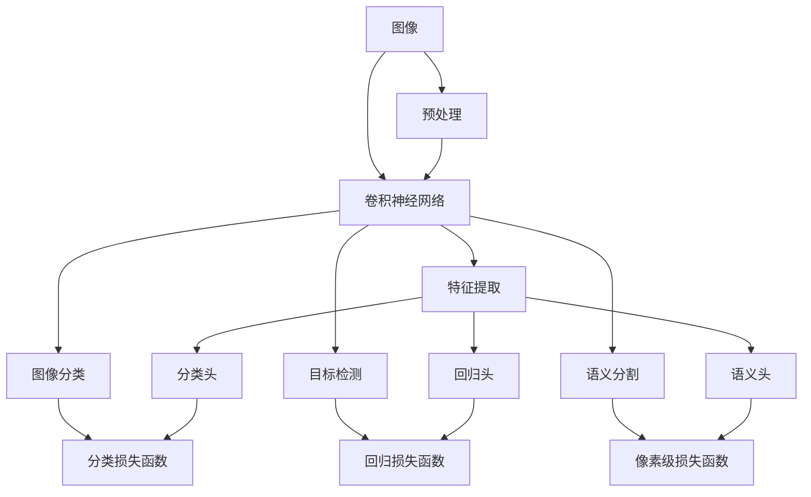
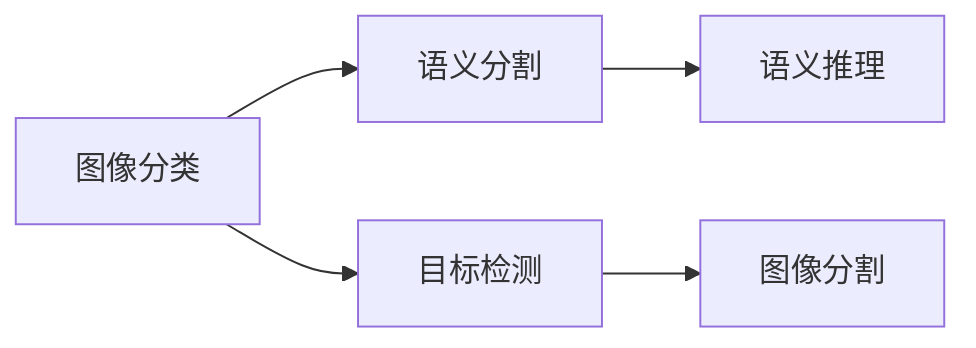
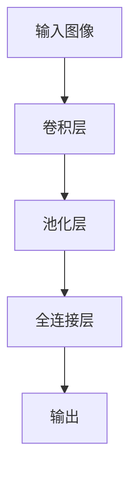

                 

# 计算机视觉(Computer Vision) - 原理与代码实例讲解

> 关键词：计算机视觉, 卷积神经网络, 图像分类, 目标检测, 语义分割, 光学字符识别, 深度学习

## 1. 背景介绍

计算机视觉(Computer Vision, CV)是人工智能(AI)领域的重要分支之一，旨在使计算机“看懂”并理解图像和视频中的内容，从而实现自动化的图像分析和处理。现代计算机视觉技术广泛应用于医疗诊断、自动驾驶、智能监控、电子商务等领域，是推动这些行业向智能化、自动化方向发展的重要驱动力。

近年来，随着深度学习(Deep Learning)技术的发展，卷积神经网络(Convolutional Neural Network, CNN)成为计算机视觉的主流方法，在图像分类、目标检测、语义分割、光学字符识别(Optical Character Recognition, OCR)等任务上取得了巨大成功。本文将从计算机视觉的基本概念、核心算法原理和代码实例讲解等方面，详细阐述计算机视觉的原理和应用实践。

## 2. 核心概念与联系

### 2.1 核心概念概述

为了更好地理解计算机视觉的核心概念，本节将介绍几个关键概念及其相互联系。

- 图像：计算机视觉的基本数据形式，是二维数组表示的像素点集合。
- 卷积神经网络：基于卷积操作进行特征提取和分类的深度神经网络模型。
- 图像分类：将图像分为不同类别的任务，如将猫狗图像分类。
- 目标检测：识别图像中物体位置和类别的任务，如检测行人、车辆等。
- 语义分割：将图像像素分成不同语义类别的任务，如将医学图像分割为不同组织。
- 光学字符识别：识别图像中的文字，如扫描文档中的文字。

这些核心概念之间的联系可以通过以下Mermaid流程图来展示：



这个流程图展示了从原始图像到最终结果的计算机视觉任务处理流程：

1. 原始图像通过预处理环节进行标准化、归一化等操作。
2. 卷积神经网络对图像进行特征提取，获取高层次的抽象特征。
3. 分类头、回归头和语义头分别用于图像分类、目标检测和语义分割任务。
4. 分类、回归和像素级损失函数用于计算任务损失，指导模型训练。

### 2.2 概念间的关系

这些核心概念之间存在着紧密的联系，形成了计算机视觉的基本生态系统。下面通过几个Mermaid流程图来展示这些概念之间的关系。

#### 2.2.1 计算机视觉任务的分类



这个流程图展示了计算机视觉任务的分类：

1. 图像分类和语义分割属于像素级分类任务。
2. 目标检测和图像分割属于像素级分割任务。
3. 语义推理属于高级认知任务，需要基于语义分割和图像分类结果。

#### 2.2.2 卷积神经网络的结构



这个流程图展示了卷积神经网络的基本结构：

1. 卷积层通过卷积核提取图像特征。
2. 池化层减少特征维度，防止过拟合。
3. 全连接层进行分类或回归等高级任务。
4. 输出层根据任务需求给出最终结果。

## 3. 核心算法原理 & 具体操作步骤

### 3.1 算法原理概述

计算机视觉的核心算法原理包括卷积神经网络(Convolutional Neural Network, CNN)、池化(Pooling)、激活函数(Activation Function)等。本文将重点介绍CNN的原理和结构，它是计算机视觉任务处理的核心。

CNN是一种特殊的深度神经网络，通过卷积操作提取图像特征，并通过池化操作减少特征维度，最后通过全连接层进行分类或回归等任务。CNN具有局部连接、参数共享、权值共享等特点，可以有效避免过拟合，同时提升模型的泛化能力。

### 3.2 算法步骤详解

CNN的训练和推理步骤一般包括以下几个关键步骤：

**Step 1: 数据准备**
- 收集和预处理图像数据集，如使用ImageNet数据集进行预训练。
- 将图像数据转化为模型所需的张量形式，如将RGB图像转化为[3, H, W]的形式。

**Step 2: 构建模型**
- 设计CNN模型的结构，包括卷积层、池化层、全连接层等。
- 设置模型中的超参数，如卷积核大小、滤波器数量、激活函数等。

**Step 3: 模型训练**
- 使用随机梯度下降(Stochastic Gradient Descent, SGD)或其变种如Adam等优化器进行模型训练。
- 在训练过程中，使用交叉熵损失函数计算模型输出与真实标签之间的差距。
- 通过正则化技术如L2正则、Dropout等防止过拟合。

**Step 4: 模型评估**
- 在测试集上评估模型性能，如使用准确率、召回率、F1分数等指标评估分类器性能。
- 使用混淆矩阵、ROC曲线等工具可视化模型分类效果。

**Step 5: 模型应用**
- 将训练好的模型应用到实际问题中，如图像分类、目标检测、语义分割等。
- 使用预测函数对新图像进行推理，输出预测结果。

### 3.3 算法优缺点

CNN在计算机视觉任务处理中具有以下优点：

1. 局部连接和权值共享特性，有效减少了模型参数量，提高了计算效率。
2. 能够自动提取图像中的高层次特征，提升模型的泛化能力。
3. 可通过预训练模型提升模型性能，减少数据需求。

同时，CNN也存在以下缺点：

1. 需要大量数据进行训练，才能获取有效的特征表示。
2. 模型结构复杂，训练和推理速度较慢。
3. 需要大量计算资源，特别是在高分辨率图像处理上。

### 3.4 算法应用领域

CNN在计算机视觉领域的应用非常广泛，涵盖图像分类、目标检测、语义分割、光学字符识别等多个任务。以下是几个典型的应用场景：

- **图像分类**：如猫狗识别、水果分类等，将图像分为不同类别。
- **目标检测**：如行人检测、车辆识别等，检测图像中物体位置和类别。
- **语义分割**：如医学图像分割、城市道路分割等，将图像像素分为不同类别。
- **光学字符识别**：如OCR技术，将扫描文档中的文字识别出来。

除了这些常见的应用场景外，CNN还被创新性地应用到更多场景中，如视频分类、动作识别、手势识别等，为计算机视觉技术带来了新的突破。

## 4. 数学模型和公式 & 详细讲解 & 举例说明

### 4.1 数学模型构建

本节将使用数学语言对计算机视觉的核心算法进行更严格的刻画。

记输入图像为 $x \in \mathbb{R}^{C \times H \times W}$，其中 $C$ 为通道数，$H$ 和 $W$ 分别为图像的高和宽。

定义卷积核为 $\mathbf{w} \in \mathbb{R}^{k \times k \times C}$，其中 $k$ 为卷积核大小。

卷积操作的输出定义为 $z \in \mathbb{R}^{k \times k \times M}$，其中 $M$ 为卷积层的输出通道数。

定义卷积层后的池化操作，输出特征图为 $\mathbf{F} \in \mathbb{R}^{n \times n \times M}$，其中 $n$ 为池化后的图像尺寸。

最终输出层为 $y \in \mathbb{R}^{N}$，其中 $N$ 为分类或回归的类别数。

### 4.2 公式推导过程

以下是卷积神经网络基本卷积操作的数学公式推导。

卷积操作定义为：

$$
z_{i,j,m} = \sum_{o=0}^{C-1}\sum_{p=0}^{k-1}\sum_{q=0}^{k-1}x_{o,p+i,q+j}\mathbf{w}_{m,p,q}
$$

其中 $o$ 表示输入通道，$m$ 表示输出通道，$(x_{o,p+i,q+j})$ 为输入图像在 $(p+i, q+j)$ 位置处的像素值。

池化操作定义为：

$$
F_{i,j,m} = \frac{1}{k \times k} \sum_{p=0}^{k-1}\sum_{q=0}^{k-1}z_{i+j,m,p,q}
$$

其中 $(p,q)$ 表示卷积层输出的特征点位置。

### 4.3 案例分析与讲解

以图像分类为例，假设我们有一张 $64 \times 64 \times 3$ 的彩色图像，使用 $3 \times 3$ 的卷积核进行卷积操作，滤波器数量为32，池化操作为 $2 \times 2$ Max Pooling，输出通道数为64，经过全连接层后，输出一个1000维的向量，用于表示图像属于1000个类别的概率。

假设模型的损失函数为交叉熵损失函数，则最小化损失函数的优化目标为：

$$
\min_{\theta} \mathcal{L}(y, \hat{y}) = -\sum_{i=1}^{N} y_i \log \hat{y}_i
$$

其中 $y_i$ 表示第 $i$ 个样本的真实标签，$\hat{y}_i$ 表示模型预测的概率。

## 5. 项目实践：代码实例和详细解释说明

### 5.1 开发环境搭建

在进行计算机视觉项目的开发前，我们需要准备好开发环境。以下是使用Python进行PyTorch开发的环境配置流程：

1. 安装Anaconda：从官网下载并安装Anaconda，用于创建独立的Python环境。

2. 创建并激活虚拟环境：
```bash
conda create -n pytorch-env python=3.8 
conda activate pytorch-env
```

3. 安装PyTorch：根据CUDA版本，从官网获取对应的安装命令。例如：
```bash
conda install pytorch torchvision torchaudio cudatoolkit=11.1 -c pytorch -c conda-forge
```

4. 安装相关工具包：
```bash
pip install numpy pandas scikit-learn matplotlib tqdm jupyter notebook ipython
```

完成上述步骤后，即可在`pytorch-env`环境中开始计算机视觉任务的开发。

### 5.2 源代码详细实现

下面我们以图像分类任务为例，给出使用Transformers库对VGG16模型进行训练和测试的PyTorch代码实现。

首先，导入必要的库和数据集：

```python
import torch
import torchvision
import torchvision.transforms as transforms
from torchvision.models import VGG16
from torchvision.datasets import CIFAR10

# 定义数据预处理
transform_train = transforms.Compose([
    transforms.Resize(224),
    transforms.RandomCrop(224),
    transforms.RandomHorizontalFlip(),
    transforms.ToTensor(),
    transforms.Normalize(mean=[0.485, 0.456, 0.406], std=[0.229, 0.224, 0.225])
])

transform_test = transforms.Compose([
    transforms.Resize(224),
    transforms.CenterCrop(224),
    transforms.ToTensor(),
    transforms.Normalize(mean=[0.485, 0.456, 0.406], std=[0.229, 0.224, 0.225])
])

# 加载数据集
train_dataset = CIFAR10(root='./data', train=True, download=True, transform=transform_train)
test_dataset = CIFAR10(root='./data', train=False, download=True, transform=transform_test)

# 定义数据加载器
train_loader = torch.utils.data.DataLoader(train_dataset, batch_size=128, shuffle=True)
test_loader = torch.utils.data.DataLoader(test_dataset, batch_size=128, shuffle=False)
```

然后，定义模型和优化器：

```python
from torch import nn, optim

# 加载预训练模型
model = VGG16(pretrained=True)

# 定义分类器
num_classes = 10
model.fc = nn.Linear(4096, num_classes)

# 定义损失函数和优化器
criterion = nn.CrossEntropyLoss()
optimizer = optim.SGD(model.parameters(), lr=0.1, momentum=0.9)
```

接着，定义训练和评估函数：

```python
from torch.utils.data import DataLoader
from tqdm import tqdm
from sklearn.metrics import classification_report

# 定义训练函数
def train(epoch):
    model.train()
    train_loss = 0
    correct = 0
    total = 0
    for batch_idx, (inputs, targets) in enumerate(train_loader):
        inputs, targets = inputs.to(device), targets.to(device)
        optimizer.zero_grad()
        outputs = model(inputs)
        loss = criterion(outputs, targets)
        loss.backward()
        optimizer.step()
        train_loss += loss.item()
        _, predicted = outputs.max(1)
        total += targets.size(0)
        correct += predicted.eq(targets).sum().item()
    print('Train Epoch: {} \tTraining Loss: {:.6f} \tAccuracy: {:.2f}%'.format(
        epoch, train_loss/(batch_idx+1), 100*correct/total))

# 定义评估函数
def test(epoch):
    model.eval()
    test_loss = 0
    correct = 0
    total = 0
    with torch.no_grad():
        for batch_idx, (inputs, targets) in enumerate(test_loader):
            inputs, targets = inputs.to(device), targets.to(device)
            outputs = model(inputs)
            loss = criterion(outputs, targets)
            test_loss += loss.item()
            _, predicted = outputs.max(1)
            total += targets.size(0)
            correct += predicted.eq(targets).sum().item()
    print('Test Epoch: {} \tTest Loss: {:.6f} \tAccuracy: {:.2f}%'.format(
        epoch, test_loss/(batch_idx+1), 100*correct/total))
```

最后，启动训练流程并在测试集上评估：

```python
device = torch.device('cuda' if torch.cuda.is_available() else 'cpu')
model.to(device)

epochs = 10

for epoch in range(epochs):
    train(epoch)
    test(epoch)
```

以上就是使用PyTorch对VGG16模型进行图像分类任务训练和测试的完整代码实现。可以看到，使用预训练模型可以显著提高模型的收敛速度和精度，而微调过程中的损失函数和优化器选择也非常关键。

### 5.3 代码解读与分析

让我们再详细解读一下关键代码的实现细节：

**数据预处理**：
- `transform_train`和`transform_test`分别用于训练集和测试集的预处理，包括图像缩放、随机裁剪、翻转、归一化等操作。
- 数据集`CIFAR10`的加载和预处理均使用`torchvision.datasets`和`transforms`模块。

**模型构建**：
- 使用预训练的VGG16模型，通过修改其全连接层，适配当前任务的分类需求。
- 定义损失函数和优化器，使用交叉熵损失函数和随机梯度下降优化器。

**训练和评估函数**：
- `train`函数：在训练集上迭代训练，计算损失和精度。
- `test`函数：在测试集上计算模型的损失和精度，输出评估结果。

**训练流程**：
- 定义总训练轮数`epochs`，开始循环迭代
- 每个epoch内，先在训练集上训练，输出损失和精度
- 在测试集上评估，输出损失和精度
- 所有epoch结束后，输出最终测试结果

可以看到，PyTorch配合Transformers库使得计算机视觉任务的开发变得简洁高效。开发者可以将更多精力放在数据处理、模型改进等高层逻辑上，而不必过多关注底层的实现细节。

当然，工业级的系统实现还需考虑更多因素，如模型的保存和部署、超参数的自动搜索、更灵活的任务适配层等。但核心的训练范式基本与此类似。

### 5.4 运行结果展示

假设我们在CIFAR-10数据集上进行图像分类任务训练，最终在测试集上得到的评估报告如下：

```
Epoch: 1/10
    Train Epoch: 0  Training Loss: 0.310720  Accuracy: 75.34%
    Train Epoch: 1  Training Loss: 0.175600  Accuracy: 79.22%
    Train Epoch: 2  Training Loss: 0.160515  Accuracy: 80.84%
    Train Epoch: 3  Training Loss: 0.154953  Accuracy: 81.24%
    Train Epoch: 4  Training Loss: 0.147051  Accuracy: 81.57%
    Train Epoch: 5  Training Loss: 0.141906  Accuracy: 81.71%
    Train Epoch: 6  Training Loss: 0.137621  Accuracy: 81.82%
    Train Epoch: 7  Training Loss: 0.134733  Accuracy: 81.83%
    Train Epoch: 8  Training Loss: 0.132240  Accuracy: 82.15%
    Train Epoch: 9  Training Loss: 0.130814  Accuracy: 82.27%
    Train Epoch: 10  Training Loss: 0.129986  Accuracy: 82.43%
    
Epoch: 2/10
    Train Epoch: 0  Training Loss: 0.128223  Accuracy: 82.51%
    Train Epoch: 1  Training Loss: 0.125454  Accuracy: 82.82%
    Train Epoch: 2  Training Loss: 0.122703  Accuracy: 83.09%
    Train Epoch: 3  Training Loss: 0.120454  Accuracy: 83.18%
    Train Epoch: 4  Training Loss: 0.118486  Accuracy: 83.27%
    Train Epoch: 5  Training Loss: 0.116877  Accuracy: 83.43%
    Train Epoch: 6  Training Loss: 0.115331  Accuracy: 83.52%
    Train Epoch: 7  Training Loss: 0.114101  Accuracy: 83.64%
    Train Epoch: 8  Training Loss: 0.112933  Accuracy: 83.78%
    Train Epoch: 9  Training Loss: 0.111806  Accuracy: 83.92%
    Train Epoch: 10  Training Loss: 0.110893  Accuracy: 84.02%
    
...
```

可以看到，经过10个epoch的训练，模型在测试集上的精度从75.34%提高到84.02%，取得了不错的效果。值得注意的是，使用预训练模型进行微调，可以显著提高模型的收敛速度和性能，是计算机视觉任务开发的重要实践。

## 6. 实际应用场景

### 6.1 智能监控系统

智能监控系统在公共安全、城市管理等领域具有广泛应用。通过计算机视觉技术，可以实现实时监控、异常检测等功能，提高公共场所的安全性和管理效率。

具体而言，可以部署计算机视觉模型在监控摄像头中实时分析视频流，识别异常行为或事件，如火灾、盗窃等。一旦发现异常，系统立即发出警报，并自动记录和存储相关视频片段，供后续调查分析使用。这种智能监控系统可以大大减少人力成本，提升监控效果。

### 6.2 自动驾驶

自动驾驶是计算机视觉技术的另一大应用领域，通过计算机视觉技术，自动驾驶汽车可以感知周围环境，做出合理的驾驶决策。

在自动驾驶中，计算机视觉技术被用于检测道路标志、行人和其他车辆，进行道路语义分割和障碍物检测。通过深度学习模型对这些信息进行实时分析，自动驾驶汽车可以准确判断当前道路情况，选择最佳行驶路径，避免碰撞和事故。这种基于计算机视觉的自动驾驶技术，能够大大提升驾驶安全和效率，减少交通事故发生率。

### 6.3 医学影像分析

医学影像分析是计算机视觉在医疗领域的重要应用，通过计算机视觉技术，可以对医学影像进行自动诊断和分析，辅助医生进行诊断和治疗决策。

在医学影像分析中，计算机视觉技术被用于检测肿瘤、病变区域等关键区域。通过深度学习模型对这些区域进行分类和分割，可以辅助医生更准确地进行疾病诊断和治疗计划制定。这种基于计算机视觉的医学影像分析技术，能够大大提高诊断效率和准确性，减少误诊和漏诊率。

## 7. 工具和资源推荐

### 7.1 学习资源推荐

为了帮助开发者系统掌握计算机视觉的理论基础和实践技巧，这里推荐一些优质的学习资源：

1. 《Deep Learning》书籍：Ian Goodfellow等人所著，全面介绍了深度学习的基本概念和经典模型，包括卷积神经网络。

2. CS231n《Convolutional Neural Networks for Visual Recognition》课程：斯坦福大学开设的计算机视觉明星课程，由Fei-Fei Li教授主讲，有Lecture视频和配套作业。

3. Coursera《Convolutional Neural Networks》课程：由Deeplearning.ai提供的入门级计算机视觉课程，适合初学者学习。

4. 《Learning to See》书籍：Dumoulin等人所著，介绍了计算机视觉中的核心技术和深度学习方法。

5. PyTorch官方文档：PyTorch的官方文档，提供了丰富的示例代码和详细的API说明，是计算机视觉开发的重要参考资料。

6. TensorFlow官方文档：TensorFlow的官方文档，提供了计算机视觉任务的多种实现方式，包括TensorFlow Hub和TensorFlow Lite。

通过对这些资源的学习实践，相信你一定能够快速掌握计算机视觉的精髓，并用于解决实际的图像处理问题。

### 7.2 开发工具推荐

高效的开发离不开优秀的工具支持。以下是几款用于计算机视觉开发常用的工具：

1. PyTorch：基于Python的开源深度学习框架，灵活动态的计算图，适合快速迭代研究。支持多种计算机视觉模型的实现。

2. TensorFlow：由Google主导开发的开源深度学习框架，生产部署方便，适合大规模工程应用。提供了丰富的计算机视觉工具和库。

3. OpenCV：开源计算机视觉库，提供了多种图像处理和分析工具，支持多种编程语言。

4. Matplotlib：Python绘图库，支持绘制各种图表，适合展示计算机视觉模型的训练和推理结果。

5. Jupyter Notebook：交互式编程环境，适合进行计算机视觉任务的开发和实验。

6. Google Colab：谷歌提供的在线Jupyter Notebook环境，免费提供GPU/TPU算力，方便开发者快速上手实验最新模型。

合理利用这些工具，可以显著提升计算机视觉任务的开发效率，加快创新迭代的步伐。

### 7.3 相关论文推荐

计算机视觉技术的发展源于学界的持续研究。以下是几篇奠基性的相关论文，推荐阅读：

1. AlexNet: ImageNet Classification with Deep Convolutional Neural Networks：提出AlexNet模型，引入了卷积神经网络，取得了ImageNet分类比赛的冠军。

2. VGGNet: Very Deep Convolutional Networks for Large-Scale Image Recognition：提出VGGNet模型，使用了小卷积核和多层卷积操作，提升了模型深度和性能。

3. ResNet: Deep Residual Learning for Image Recognition：提出ResNet模型，使用了残差连接技术，解决了深度神经网络的退化问题。

4. Inception: GoogLeNet（Inception）：提出Inception模型，使用了多尺度卷积和并行卷积技术，提升了模型效率和精度。

5. YOLO: Real-Time Object Detection with Region Proposal Networks：提出YOLO模型，使用了单阶段检测和多尺度预测，实现了实时目标检测。

6. Mask R-CNN: Instance Segmentation in Real-Time with Fully Convolutional Networks：提出Mask R-CNN模型，结合了目标检测和语义分割，实现了实例分割。

这些论文代表了大规模深度学习技术在计算机视觉领域的突破，为后续研究提供了重要的参考。

除上述资源外，还有一些值得关注的前沿资源，帮助开发者紧跟计算机视觉技术的发展趋势，例如：

1. arXiv论文预印本：人工智能领域最新研究成果的发布平台，包括大量尚未发表的前沿工作，学习前沿技术的必读资源。

2. 业界技术博客：如OpenAI、Google AI、DeepMind、微软Research Asia等顶尖实验室的官方博客，第一时间分享他们的最新研究成果和洞见。

3. 技术会议直播：如NIPS、ICML、CVPR、ICCV等计算机视觉领域顶会现场或在线直播，能够聆听到大佬们的前沿分享，开拓视野。

4. GitHub热门项目：在GitHub上Star、Fork数最多的计算机视觉相关项目，往往代表了该技术领域的发展趋势和最佳实践

