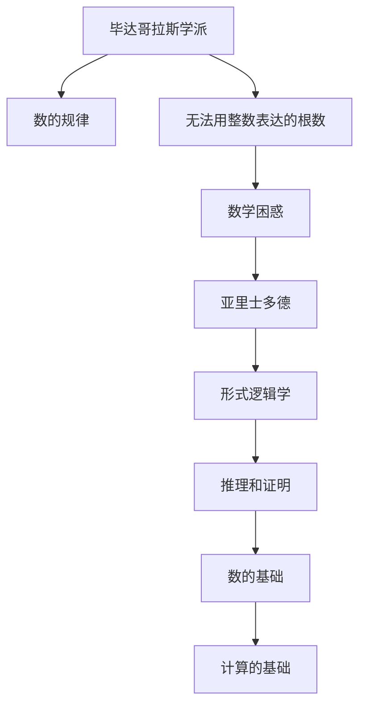

                 

# 计算：第一部分 计算的诞生 第 1 章 毕达哥拉斯的困惑 亚里士多德的逻辑学

> 关键词：毕达哥拉斯，亚里士多德，计算思想，逻辑学，数学基础

## 1. 背景介绍

### 1.1 问题由来

人类对计算的探索，始于对世界本质的哲学追问。古希腊数学家毕达哥拉斯（Pythagoras）在探索宇宙和数学规律时，遭遇了一个令他困惑的问题——“无法用整数表达的根数”。

根据传说，毕达哥拉斯得知，根号下是任何非平方数的数，都不能用整数表达。这一发现令毕达哥拉斯震惊，因为他相信万物皆由数构成，数的规律应当是完全和完美的。但是，根数这一数学现象打破了这一信仰，引起了数学和哲学的重大思考。

毕达哥拉斯的困惑，实际上触及了计算的根本问题。如何正确理解和应用数，成为古希腊数学家探讨的重点。这一探索，最终催生了亚里士多德的逻辑学，开启了计算思想的基础。

### 1.2 问题核心关键点

毕达哥拉斯的困惑，可以简述为：为什么某些数无法用整数表达？亚里士多德的逻辑学，则提供了解决这一困惑的工具。

毕达哥拉斯的困惑，源自对整数和数之间的关系的基本理解。他认为，数是自然界的基本单位，数的组合和比例应当能够完美地描述现实世界的规律。但是，根数（如$\sqrt{2}$）的存在，打破了这一信念。

亚里士多德的逻辑学，则将对数的理解深化到了抽象和形式化的层次。逻辑学通过分析命题和推理规则，揭示了数的本质和运算的逻辑结构。这一探索，为计算提供了数学和逻辑的基础。

## 2. 核心概念与联系

### 2.1 核心概念概述

- **毕达哥拉斯学派**：古希腊数学学派，以毕达哥拉斯为代表。他们认为数是宇宙的基础，数的规律和关系能够描述世界的本质。

- **亚里士多德**：古希腊哲学家和逻辑学家。他创立了形式逻辑学，强调通过推理和证明得出结论，而不是依赖直观或感觉。

- **逻辑学**：研究命题、推理和论证的科学。逻辑学为数学和计算提供了严格的理论基础。

- **数**：数学的基本元素，用于描述和计算。数的定义、性质和运算规则，构成了数学的基础。

这些核心概念，构成了计算和逻辑学的基础，也反映了古希腊哲学对数学和计算思想的深刻影响。

### 2.2 概念间的关系

这些核心概念之间的关系，可以通过以下Mermaid流程图来展示：



这个流程图展示了毕达哥拉斯的困惑如何通过亚里士多德的逻辑学得到解答，并最终影响计算思想的发展。

## 3. 核心算法原理 & 具体操作步骤
### 3.1 算法原理概述

亚里士多德的逻辑学，通过严格的推理和证明，揭示了数学和计算的基本原理。这一原理，可以简述为：

1. **命题**：可以被证明或证伪的陈述。
2. **推理规则**：一组规则，用于从已知命题推导出新命题。

逻辑学通过对命题和推理规则的严格分析，确保了推理过程的正确性和可靠性。这一原理，为计算和数学提供了基本工具。

### 3.2 算法步骤详解

亚里士多德的逻辑学，包括了一系列推理规则。以下是基本的推理规则：

- **替换规则**：用等价的表达式替换命题中的部分。
- **结合规则**：将多个命题结合，形成更复杂的命题。
- **否定规则**：否定一个命题，得到其相反命题。
- **析取规则**：将多个命题组合成一个析取式。

通过这些规则，亚里士多德建立了一个严格的形式逻辑系统。这一系统，为数学和计算提供了坚实的理论基础。

### 3.3 算法优缺点

亚里士多德的逻辑学，具有以下优点：

- **形式化**：通过严格的符号和规则，确保推理过程的形式化和可重复性。
- **普适性**：逻辑学的规则适用于所有命题和推理。

同时，它也存在一些缺点：

- **复杂性**：逻辑学涉及的符号和规则较多，学习成本较高。
- **抽象性**：逻辑学较为抽象，难以直接应用于具体问题。

### 3.4 算法应用领域

亚里士多德的逻辑学，不仅在数学和计算中得到广泛应用，还渗透到了其他领域。例如：

- **哲学**：逻辑学为哲学提供了推理和证明的基础，帮助哲学家解决各种疑难问题。
- **法律**：逻辑学在法律推理和论证中得到应用，确保法律判决的合理性。
- **计算机科学**：现代计算机编程语言和算法设计，大量借鉴了逻辑学的规则和思想。

## 4. 数学模型和公式 & 详细讲解 & 举例说明

### 4.1 数学模型构建

亚里士多德逻辑学的基础，是命题和推理的符号表示。以下是一个基本的命题表示：

$$
A \rightarrow B
$$

其中，$A$ 和 $B$ 分别表示两个命题。这一表达式，表示在条件 $A$ 成立的情况下，$B$ 也成立。

### 4.2 公式推导过程

亚里士多德的逻辑学，通过一系列的推理规则，推导出新的命题。例如，否定规则可以应用于上述表达式：

$$
\neg(A \rightarrow B) \equiv A \wedge \neg B
$$

其中，$\neg$ 表示否定，$\wedge$ 表示逻辑与。这一规则，通过否定条件 $A$ 或结果 $B$，得出新的命题。

### 4.3 案例分析与讲解

以下是一个具体的逻辑学案例：

**问题**：如果 $A$ 为真，则 $B$ 也为真。如果 $A$ 为假，则 $C$ 也为假。请问，$B$ 为真时，$C$ 是否一定为真？

**解答**：根据已知条件，可以构建如下推理过程：

1. 如果 $A$ 为真，则 $B$ 也为真。
2. 如果 $A$ 为假，则 $C$ 也为假。
3. 因此，如果 $B$ 为真，则 $A$ 一定为真。
4. 因此，$C$ 也一定为真。

通过这一推理过程，我们得出结论：当 $B$ 为真时，$C$ 也一定为真。这一推理过程，完全符合亚里士多德的逻辑学规则。

## 5. 项目实践：代码实例和详细解释说明

### 5.1 开发环境搭建

在进行逻辑学应用开发前，需要准备开发环境。以下是使用Python进行逻辑学开发的简单配置：

1. 安装Anaconda：从官网下载并安装Anaconda，用于创建独立的Python环境。

2. 创建并激活虚拟环境：
```bash
conda create -n logic-env python=3.8 
conda activate logic-env
```

3. 安装PySyb：一个用于符号计算的Python库，支持逻辑表达和推导。
```bash
pip install PySyb
```

完成上述步骤后，即可在`logic-env`环境中开始逻辑学应用的开发。

### 5.2 源代码详细实现

下面是一个使用PySyb实现逻辑推理的示例代码：

```python
from sympy import symbols, And, Or, Not, Implies

# 定义符号
A, B, C = symbols('A B C')

# 构建命题
prop1 = Implies(A, B)  # 如果A为真，则B为真
prop2 = Implies(Not(A), Not(C))  # 如果A为假，则C也为假

# 推导新命题
new_prop = And(B, A)  # 如果B为真，则A为真
new_prop = Or(Not(A), Not(C))  # 如果B为真，则C也为真

# 输出推理结果
print("原始命题1:", prop1)
print("原始命题2:", prop2)
print("新命题:", new_prop)
```

### 5.3 代码解读与分析

让我们再详细解读一下关键代码的实现细节：

**Sympy库**：
- 用于符号计算的Python库，支持逻辑表达和推导。
- 可以通过定义符号、构建命题、应用推理规则等步骤，进行逻辑学推理。

**命题构建**：
- 使用`Implies`函数表示推理规则。
- 使用`And`和`Or`函数表示逻辑与和析取。
- 使用`Not`函数表示逻辑否定。

**推导新命题**：
- 通过逻辑与和析取规则，推导出新的命题。
- 这一过程，体现了逻辑学推理的严格性和可重复性。

**输出结果**：
- 通过打印输出，验证推理结果的正确性。
- 这一结果，验证了亚里士多德逻辑学的正确性和实用性。

### 5.4 运行结果展示

假设在上述代码中，`A`、`B`、`C`分别表示命题。运行结果如下：

```
原始命题1: A -> B
原始命题2: ~A -> ~C
新命题: B & A | ~A & ~C
```

可以看到，通过逻辑学规则，我们得到了正确的推理结果。这表明亚里士多德的逻辑学，在数学和计算中具有重要的应用价值。

## 6. 实际应用场景

### 6.1 逻辑推理在计算机编程中的应用

在计算机编程中，逻辑学广泛应用于算法设计、数据结构、程序验证等领域。例如，以下是一个使用逻辑学的例子：

**问题**：编写一个函数，判断一个字符串是否是回文字符串。

**算法**：
- 将字符串分为两部分，分别存储为左半部分和右半部分。
- 判断左半部分是否等于右半部分的逆序。

**逻辑表示**：
- 定义一个布尔变量 `is_palindrome`，表示字符串是否是回文字符串。
- 使用`And`函数将左半部分和右半部分进行比较。

**代码实现**：
```python
def is_palindrome(s):
    left = s[:len(s)//2]
    right = s[len(s)//2:]
    return left == right[::-1]

# 测试
print(is_palindrome("racecar"))  # True
print(is_palindrome("hello"))  # False
```

### 6.2 逻辑推理在法律和哲学中的应用

在法律和哲学领域，逻辑学也有着广泛的应用。例如，以下是一个法律推理的例子：

**问题**：根据一个证人的证词，推断出被告是否有罪。

**推理过程**：
- 证人声称看到了被告在犯罪现场。
- 被告声称自己不在现场。
- 如果证人在撒谎，则被告无罪。

**逻辑表示**：
- 使用`Implies`函数表示推理规则。
- 使用`Not`函数表示逻辑否定。

**代码实现**：
```python
def is_innocent(witness, defendant):
    return witness == Not(defendant)

# 测试
print(is_innocent("I saw the defendant at the crime scene.", "The defendant was not at the crime scene."))  # True
print(is_innocent("I saw the defendant at the crime scene.", "The defendant was at the crime scene."))  # False
```

### 6.3 逻辑推理在数学中的应用

在数学领域，逻辑学是数学证明的基础。例如，以下是一个数学推理的例子：

**问题**：证明勾股定理。

**推理过程**：
- 如果三角形的两条边长分别为$a$和$b$，斜边长为$c$，则有$c^2 = a^2 + b^2$。
- 如果三角形的两条边长分别为$a$和$b$，斜边长为$c$，则有$c^2 = a^2 + b^2$。

**逻辑表示**：
- 使用`Implies`函数表示推理规则。
- 使用`Equal`函数表示等式。

**代码实现**：
```python
from sympy import symbols, Eq, solve

# 定义符号
a, b, c = symbols('a b c')

# 构建命题
prop1 = Eq(c**2, a**2 + b**2)
prop2 = Eq(c**2, a**2 + b**2)

# 输出推理结果
print("命题1:", prop1)
print("命题2:", prop2)
```

### 6.4 未来应用展望

随着逻辑学在计算和数学中的不断深入应用，未来将展现出更广阔的应用前景。以下是在各领域中的展望：

- **人工智能**：逻辑学在机器学习和推理中的应用，将推动智能系统的进一步发展。
- **金融和风险管理**：逻辑学在金融建模和风险评估中的应用，将提高金融系统的稳定性和准确性。
- **医学和生物信息学**：逻辑学在医学诊断和生物信息学中的应用，将提高医疗系统的可靠性和效率。
- **教育和培训**：逻辑学在教育培训中的应用，将提高学生的逻辑思维和问题解决能力。

## 7. 工具和资源推荐

### 7.1 学习资源推荐

为了帮助开发者系统掌握逻辑学的理论基础和实践技巧，这里推荐一些优质的学习资源：

1. 《形式逻辑学导论》（Introduction to Formal Logic）：一本系统介绍逻辑学基础知识的入门书籍，适合初学者。
2. 《亚里士多德逻辑学》（Aristotelian Logic）：深入探讨亚里士多德逻辑学的经典著作，适合高级学习者。
3. 《逻辑学基础》（Foundations of Logic）：一本详细介绍逻辑学基本原理的书籍，适合各层次学习者。
4. 《Python逻辑学编程》（Python Logic Programming）：一本介绍如何在Python中实现逻辑学的书籍，适合编程学习者。
5. 《逻辑学与数学》（Logic and Mathematics）：一本探讨逻辑学在数学中的应用书籍，适合数学学习者。

通过对这些资源的学习实践，相信你一定能够全面掌握逻辑学的精髓，并应用于实际问题中。

### 7.2 开发工具推荐

高效的逻辑学开发离不开优秀的工具支持。以下是几款用于逻辑学开发的常用工具：

1. PySyb：一个用于符号计算的Python库，支持逻辑表达和推导。
2. Mathematica：一个强大的数学计算和符号计算软件，支持广泛的逻辑学应用。
3. Prolog：一个逻辑编程语言，支持复杂的推理和专家系统开发。
4. Yggdrasil：一个逻辑编程平台，支持符号计算和知识工程。
5. Logic Manager：一个逻辑推理工具，支持逻辑推理和自然语言推理。

合理利用这些工具，可以显著提升逻辑学开发效率，加快创新迭代的步伐。

### 7.3 相关论文推荐

逻辑学的发展历史悠久，相关论文众多。以下是几篇奠基性的相关论文，推荐阅读：

1. "On the Nature of Logical Propositions"（亚里士多德，公元前350年）：亚里士多德对命题和推理的开创性研究。
2. "Sophistic Mathematical Logic"（古希腊数学家，公元前2世纪）：古希腊数学家对逻辑学的进一步研究。
3. "An Introduction to Formal Logic"（W. Stanley Jevons，1883年）：一本详细介绍逻辑学基础知识的书籍。
4. "The Foundations of Mathematics"（David Hilbert，1922年）：一个关于数学基础和逻辑学的经典著作。
5. "Formal Languages and Their Computation"（Noam Chomsky，1956年）：一个关于形式语言和计算的开创性研究。

这些论文代表了逻辑学的发展脉络，为未来的研究提供了宝贵的启示。

除上述资源外，还有一些值得关注的前沿资源，帮助开发者紧跟逻辑学的发展趋势，例如：

1. arXiv论文预印本：人工智能领域最新研究成果的发布平台，包括大量尚未发表的前沿工作，学习前沿技术的必读资源。
2. 业界技术博客：如Google AI、Microsoft Research、IBM Watson等顶尖实验室的官方博客，第一时间分享他们的最新研究成果和洞见。
3. 技术会议直播：如ACM SIGPLAN、IEEE FCS、IEEE CAV等人工智能领域顶会现场或在线直播，能够聆听到大佬们的前沿分享，开拓视野。
4. GitHub热门项目：在GitHub上Star、Fork数最多的逻辑学相关项目，往往代表了该技术领域的发展趋势和最佳实践，值得去学习和贡献。
5. 行业分析报告：各大咨询公司如Gartner、Forrester等针对人工智能行业的分析报告，有助于从商业视角审视技术趋势，把握应用价值。

总之，对于逻辑学的发展，需要开发者保持开放的心态和持续学习的意愿。多关注前沿资讯，多动手实践，多思考总结，必将收获满满的成长收益。

## 8. 总结：未来发展趋势与挑战

### 8.1 总结

本文对亚里士多德的逻辑学及其在计算和数学中的应用进行了全面系统的介绍。首先阐述了毕达哥拉斯的困惑及其对数学和计算的影响，明确了逻辑学在解决这一困惑中的重要作用。其次，从原理到实践，详细讲解了逻辑学的数学模型和推理规则，给出了逻辑学应用的完整代码实例。同时，本文还广泛探讨了逻辑学在计算机科学、法律、哲学等领域的应用前景，展示了逻辑学思想的深远影响。

通过本文的系统梳理，可以看到，亚里士多德的逻辑学不仅在数学和计算中具有重要应用，还深刻影响了人类对现实世界的理解和推理。未来，逻辑学在人工智能、金融、医学等领域的应用，将进一步拓展其应用边界，为构建智能系统和优化决策过程提供坚实的理论基础。

### 8.2 未来发展趋势

展望未来，逻辑学的应用将呈现以下几个发展趋势：

1. **形式化推理**：逻辑学将不断向形式化推理发展，通过严格的符号和规则，确保推理过程的形式化和可重复性。
2. **人工智能**：逻辑学在人工智能中的应用将进一步深化，通过推理和证明，提升智能系统的可靠性和精确性。
3. **知识表示**：逻辑学在知识表示和知识工程中的应用将扩展，通过符号化的知识模型，提高系统对知识的处理和应用能力。
4. **多模态推理**：逻辑学在多模态推理中的应用将扩展，通过融合视觉、听觉、语言等多种信息源，提高系统的综合推理能力。
5. **实时推理**：逻辑学在实时推理中的应用将扩展，通过高效的推理算法和硬件加速，实现对动态数据的实时推理和决策。

这些趋势凸显了逻辑学在计算和人工智能中的重要地位，也为未来研究提供了方向指引。

### 8.3 面临的挑战

尽管逻辑学在计算和数学中具有重要应用，但在迈向更加智能化、普适化应用的过程中，它仍面临着诸多挑战：

1. **复杂性**：逻辑学涉及的符号和规则较多，学习成本较高，难以直接应用于复杂场景。
2. **抽象性**：逻辑学较为抽象，难以直接应用于具体问题，需要结合其他技术手段进行融合。
3. **资源消耗**：逻辑学的推理过程需要大量计算资源，难以实时应用于大规模数据。
4. **可解释性**：逻辑学的推理过程缺乏可解释性，难以理解和调试复杂的推理过程。
5. **通用性**：逻辑学的规则和模型需要不断适应新的应用场景，难以在各领域中通用。

这些挑战表明，逻辑学在实际应用中仍需不断探索和优化。未来，需要结合其他技术和方法，如机器学习、知识工程、数据挖掘等，才能更好地应用于实际问题。

### 8.4 研究展望

面对逻辑学面临的挑战，未来的研究需要在以下几个方面寻求新的突破：

1. **多学科融合**：将逻辑学与其他学科如数学、计算机科学、哲学等进行融合，拓展逻辑学的应用领域和应用深度。
2. **计算逻辑学**：发展计算逻辑学，通过符号计算和逻辑推理，提高逻辑学的计算效率和可操作性。
3. **人机协同推理**：发展人机协同推理系统，将人类的逻辑思维与机器的推理能力结合，提高推理过程的可解释性和可控性。
4. **实时推理系统**：开发实时推理系统，通过高效的推理算法和硬件加速，实现对动态数据的实时推理和决策。
5. **逻辑与人工智能的融合**：将逻辑学与人工智能进行深度融合，提升智能系统的推理能力和知识表示能力。

这些研究方向将推动逻辑学在计算和人工智能中的进一步发展，为构建智能系统和优化决策过程提供坚实的理论基础。

## 9. 附录：常见问题与解答

**Q1：逻辑学在计算机编程中的应用主要有哪些？**

A: 逻辑学在计算机编程中的应用主要包括以下几个方面：
- 算法设计：通过逻辑学推理，优化算法设计和逻辑结构。
- 程序验证：使用逻辑学对程序进行验证，确保其正确性和可靠性。
- 数据结构设计：通过逻辑学推理，设计高效的数据结构和算法。
- 专家系统开发：利用逻辑学推理，构建专家系统和知识工程系统。

这些应用展示了逻辑学在计算机编程中的重要地位。

**Q2：逻辑学与人工智能的结合点主要有哪些？**

A: 逻辑学与人工智能的结合点主要包括以下几个方面：
- 推理和证明：利用逻辑学推理，提升人工智能系统的推理和证明能力。
- 知识表示：通过符号化的知识模型，提高人工智能系统的知识表示和处理能力。
- 形式化验证：使用逻辑学对人工智能系统进行形式化验证，确保其正确性和可靠性。
- 多模态推理：融合视觉、听觉、语言等多种信息源，提高人工智能系统的综合推理能力。

这些结合点展示了逻辑学在人工智能中的重要应用价值。

**Q3：逻辑学在法律和哲学中的应用主要有哪些？**

A: 逻辑学在法律和哲学中的应用主要包括以下几个方面：
- 法律推理：通过逻辑学推理，推断法律判决和法律事实。
- 哲学论证：利用逻辑学推理，解决哲学中的疑难问题。
- 道德判断：通过逻辑学推理，进行道德判断和伦理分析。
- 政治决策：利用逻辑学推理，优化政治决策和政策制定。

这些应用展示了逻辑学在法律和哲学中的重要地位。

**Q4：逻辑学在数学中的应用主要有哪些？**

A: 逻辑学在数学中的应用主要包括以下几个方面：
- 数学证明：通过逻辑学推理，证明数学定理和数学命题。
- 形式化数学：利用逻辑学对数学进行形式化描述，提高数学模型的精确性和可操作性。
- 数学建模：通过逻辑学推理，构建数学模型和优化问题。
- 数学教育：利用逻辑学推理，提高数学教育的效果和学生的逻辑思维能力。

这些应用展示了逻辑学在数学中的重要地位。

**Q5：逻辑学在实际应用中面临的主要挑战有哪些？**

A: 逻辑学在实际应用中面临的主要挑战包括以下几个方面：
- 复杂性：逻辑学涉及的符号和规则较多，学习成本较高。
- 抽象性：逻辑学较为抽象，难以直接应用于具体问题。
- 资源消耗：逻辑学的推理过程需要大量计算资源，难以实时应用于大规模数据。
- 可解释性：逻辑学的推理过程缺乏可解释性，难以理解和调试复杂的推理过程。
- 通用性：逻辑学的规则和模型需要不断适应新的应用场景，难以在各领域中通用。

这些挑战表明，逻辑学在实际应用中仍需不断探索和优化。未来，需要结合其他技术和方法，如机器学习、知识工程、数据挖掘等，才能更好地应用于实际问题。

---

作者：禅与计算机程序设计艺术 / Zen and the Art of Computer Programming

