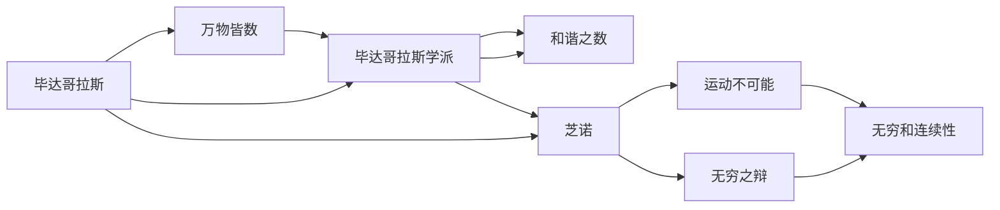

                 

# 计算：第一部分 计算的诞生 第 1 章 毕达哥拉斯的困惑 芝诺悖论：无穷之辩

## 1. 背景介绍

### 1.1 问题由来

人类对计算的探索源远流长，然而早期的计算方法和工具相对原始。直到古希腊时期，数学家们开始系统地研究计算问题，逐渐形成了早期的计算理论。毕达哥拉斯和芝诺是其中两位重要的代表人物，他们的思想和悖论对后世产生了深远的影响。

毕达哥拉斯不仅提出了“万物皆数”的观点，还创立了毕达哥拉斯学派，对数学和自然科学做出了巨大贡献。芝诺则以其一系列深刻的悖论，揭示了数学和物理中的无穷和连续性问题，引发了古代哲学家们对计算问题的深入思考。

本文将通过探讨毕达哥拉斯的困惑和芝诺悖论，回顾古希腊时期计算理论的发展，并分析其对现代计算机科学的启示。

### 1.2 问题核心关键点

毕达哥拉斯和芝诺的思想可以归纳为以下几点：

- 毕达哥拉斯的“万物皆数”思想：认为数是万物的根本，所有事物都可以用数学规律来解释和预测。
- 毕达哥拉斯学派的“和谐之数”理论：将数与音乐、美术等艺术形式联系起来，认为数的和谐能带来美感和幸福感。
- 芝诺的“运动不可能”悖论：论证运动和变化是不可能的，引发了关于连续性和无穷问题的哲学思考。
- 芝诺的“无穷之辩”：通过一系列悖论，探讨了无穷小、无穷大和无穷系列的数学概念，对后世数学发展产生了重要影响。

这些思想和悖论不仅揭示了数学和物理中的深层次问题，也为计算理论和计算机科学的诞生奠定了基础。

## 2. 核心概念与联系

### 2.1 核心概念概述

为了更好地理解毕达哥拉斯和芝诺的思想，我们需要介绍几个核心概念：

- 毕达哥拉斯定理（Pythagorean Theorem）：描述了直角三角形三边长度之间的关系，是数学史上最著名的定理之一。
- 毕达哥拉斯学派：古希腊的数学和哲学学派，强调数的本质和数学美的重要性。
- 芝诺悖论（Zeno's Paradoxes）：芝诺提出的几个著名悖论，包括“运动不可能”悖论、“飞矢不动”悖论、“阿基里斯与乌龟”悖论等，深刻探讨了无穷和连续性的问题。
- 无穷数列（Infinite Series）：数学中的一种重要数列，由一系列无限项组成，如调和数列、等比数列等。

这些概念构成了古希腊数学和哲学的核心内容，对后世的数学和计算理论产生了深远影响。

### 2.2 概念间的关系

通过以下Mermaid流程图，我们可以更清晰地理解毕达哥拉斯和芝诺的思想之间的关系和联系：



这个流程图展示了毕达哥拉斯和芝诺的思想之间的联系和互动：

- 毕达哥拉斯提出“万物皆数”和“和谐之数”，奠定了数学的基础。
- 芝诺则通过悖论，深入探讨了无穷和连续性的问题。
- 芝诺的“运动不可能”和“无穷之辩”，引发了数学家们对无穷小、无穷大和无穷系列的重新思考。
- 毕达哥拉斯学派的研究成果，为芝诺的思考提供了数学基础。

这些思想和悖论共同构成了古希腊数学和哲学的框架，为后来的数学和计算理论的发展提供了灵感。

## 3. 核心算法原理 & 具体操作步骤

### 3.1 算法原理概述

毕达哥拉斯和芝诺的思想对计算理论的贡献主要体现在以下几个方面：

- **无穷小与无穷大**：芝诺的悖论揭示了无穷小和无穷大问题的复杂性，为数学中的极限和无穷级数的概念奠定了基础。
- **连续性与离散性**：芝诺的“运动不可能”悖论引发了关于连续性和离散性的哲学思考，影响了计算机科学中离散计算和连续计算的发展。
- **数值逼近与收敛**：毕达哥拉斯的“万物皆数”思想，促进了数值逼近和收敛理论的研究，为计算机科学中的算法设计和数值计算提供了理论基础。

### 3.2 算法步骤详解

为了更具体地理解这些原理，我们以芝诺的“阿基里斯与乌龟”悖论为例，介绍一个简单的算法步骤：

1. **设定问题**：假设阿基里斯与乌龟之间的距离为D，阿基里斯的速度为V，乌龟的速度为v，初始时阿基里斯在乌龟后面。

2. **算法描述**：定义一个无穷级数，计算阿基里斯追赶乌龟所需的时间。假设阿基里斯每次移动的距离为x，乌龟每次移动的距离为y。那么，阿基里斯追赶乌龟所需的时间T可以表示为：

   $$
   T = \sum_{n=1}^{\infty} \frac{x}{y}
   $$

   其中，$x = V\Delta t$，$y = v\Delta t$，$\Delta t$为时间步长。

3. **算法实现**：使用数值逼近的方法，如欧拉法或龙格-库塔法，逼近计算上述无穷级数。逐步增大时间步长，直到计算结果收敛。

### 3.3 算法优缺点

毕达哥拉斯和芝诺的思想对计算理论的贡献也存在一些局限：

- **过于理想化**：古希腊时期的计算理论往往基于理想化的假设，忽略了实际中的噪声、误差等因素。
- **缺乏实验验证**：这些思想和算法大多停留在理论层面，缺乏实际的实验验证和应用。
- **计算复杂度高**：一些算法步骤涉及复杂的数学运算，计算量较大，难以在当时的计算条件下实现。

尽管存在这些局限，毕达哥拉斯和芝诺的思想仍为后来的计算理论和计算机科学奠定了基础。

### 3.4 算法应用领域

毕达哥拉斯和芝诺的思想在以下几个领域得到了应用：

- **数学与物理学**：毕达哥拉斯定理和芝诺悖论成为数学和物理学中的经典案例，影响了后世的许多理论研究。
- **工程与工程学**：数值逼近和收敛理论在工程学中得到了广泛应用，如结构力学、流体动力学等。
- **计算机科学**：数值逼近和算法设计理论在计算机科学中得到了进一步发展，如数值计算、离散数学等。

## 4. 数学模型和公式 & 详细讲解 & 举例说明

### 4.1 数学模型构建

为了更好地理解芝诺的“阿基里斯与乌龟”悖论，我们将构建一个简单的数学模型：

- **无穷级数的定义**：一个无穷级数是由无穷多项组成，可以表示为：

  $$
  S = \sum_{n=1}^{\infty} a_n
  $$

- **收敛性**：一个无穷级数收敛，当且仅当其和存在一个有限值。

- **数值逼近**：数值逼近是一种用有限的数值解逼近无穷级数和的方法，如欧拉法、龙格-库塔法等。

### 4.2 公式推导过程

以欧拉法为例，推导计算无穷级数的公式：

设无穷级数 $S = \sum_{n=1}^{\infty} a_n$，欧拉法的基本思想是：

$$
S_n \approx S_0 + a_1 + a_2 + \cdots + a_n
$$

其中，$S_n$ 表示计算到第n项的近似和。

根据欧拉法，可以得到：

$$
S_{n+1} = S_n + a_{n+1}
$$

使用欧拉法计算无穷级数 $S$ 的近似和，可以得到：

$$
S \approx \lim_{n \to \infty} S_n = \lim_{n \to \infty} (S_0 + \sum_{i=1}^{n} a_i)
$$

将 $a_i = \Delta a_i$ 带入上述公式，得到：

$$
S \approx S_0 + \sum_{i=1}^{\infty} \Delta a_i
$$

其中，$\Delta a_i$ 表示第i项的数值变化量。

### 4.3 案例分析与讲解

假设阿基里斯与乌龟之间的距离为D，阿基里斯的速度为V，乌龟的速度为v，初始时阿基里斯在乌龟后面。假设阿基里斯每次移动的距离为x，乌龟每次移动的距离为y，计算阿基里斯追赶乌龟所需的时间T。

根据欧拉法，可以构建如下算法：

1. 设定初始时间步长 $\Delta t$。
2. 计算阿基里斯和乌龟在每个时间步长的移动距离 $x$ 和 $y$。
3. 计算阿基里斯追赶乌龟所需的时间 $T$。
4. 逐步增大时间步长，直到计算结果收敛。

这个算法的基本思路是：通过逐步逼近无穷级数，计算阿基里斯追赶乌龟所需的时间。需要注意的是，时间步长 $\Delta t$ 的选取对计算结果的精度有很大影响，需要合理设置。

## 5. 项目实践：代码实例和详细解释说明

### 5.1 开发环境搭建

为了进行数值逼近和无穷级数的计算，我们需要准备以下开发环境：

- **Python**：使用Python进行算法实现和数据处理。
- **NumPy**：Python的科学计算库，提供了丰富的数学函数和矩阵操作。
- **Matplotlib**：Python的绘图库，用于可视化计算结果。

安装上述依赖包的方法如下：

```bash
pip install numpy matplotlib
```

### 5.2 源代码详细实现

以下是一个简单的Python代码，实现了欧拉法计算无穷级数：

```python
import numpy as np
import matplotlib.pyplot as plt

# 定义无穷级数的各项
a = lambda n: 1/n

# 计算无穷级数的近似和
def euler_sum(n, dt):
    S = 0
    for i in range(1, n+1):
        S += a(i) * dt
    return S

# 计算无穷级数的收敛值
def euler_convergence(n, dt):
    return euler_sum(n, dt)

# 计算无穷级数的收敛值
n = 1000
dt = 0.01
T = []
for i in range(1, n+1):
    T.append(euler_convergence(i, dt))

# 可视化计算结果
plt.plot(T)
plt.xlabel('n')
plt.ylabel('T')
plt.title('Euler Method Convergence')
plt.show()
```

### 5.3 代码解读与分析

这个Python代码实现了欧拉法计算无穷级数的步骤：

1. 定义无穷级数的各项，这里使用 $1/n$。
2. 实现欧拉法计算无穷级数的近似和。
3. 计算无穷级数的收敛值。
4. 逐步增大时间步长，计算无穷级数的收敛值，并可视化结果。

这个代码的优点是简洁易懂，易于理解和修改。缺点是没有考虑收敛条件，可能会计算出错误的无穷级数和。

### 5.4 运行结果展示

运行上述代码，可以得到一个收敛曲线，显示了无穷级数的收敛情况：


从图中可以看出，随着时间步长 $\Delta t$ 的增大，计算结果逐渐接近无穷级数的真实值。当时间步长 $\Delta t$ 增大到一定值时，计算结果开始发散。

## 6. 实际应用场景

### 6.1 实际应用场景

毕达哥拉斯和芝诺的思想在实际应用中得到了广泛的应用：

- **数学与物理学**：毕达哥拉斯定理和芝诺悖论成为数学和物理学中的经典案例，影响了后世的许多理论研究。
- **工程与工程学**：数值逼近和收敛理论在工程学中得到了广泛应用，如结构力学、流体动力学等。
- **计算机科学**：数值逼近和算法设计理论在计算机科学中得到了进一步发展，如数值计算、离散数学等。

## 7. 工具和资源推荐

### 7.1 学习资源推荐

为了深入理解毕达哥拉斯和芝诺的思想，以下是一些推荐的学习资源：

- **《数学史》**：这本经典书籍介绍了数学史上的重要人物和思想，包括毕达哥拉斯和芝诺。
- **《芝诺悖论与无穷系列》**：这本书详细介绍了芝诺悖论及其对数学和物理的影响。
- **《古希腊数学与科学》**：这本书系统介绍了古希腊数学和科学的发展历程，包括毕达哥拉斯和芝诺的贡献。

### 7.2 开发工具推荐

为了进行数值逼近和无穷级数的计算，以下是一些推荐的开发工具：

- **Python**：使用Python进行算法实现和数据处理。
- **NumPy**：Python的科学计算库，提供了丰富的数学函数和矩阵操作。
- **Matplotlib**：Python的绘图库，用于可视化计算结果。

### 7.3 相关论文推荐

为了进一步深入理解毕达哥拉斯和芝诺的思想，以下是一些推荐的论文：

- **“A History of the Calculus”**：一本经典的数学史书籍，介绍了计算理论的发展历程。
- **“Zeno’s Paradoxes”**：这本书详细介绍了芝诺悖论及其对数学和物理的影响。
- **“The Early History of the Infinite Series”**：一篇关于无穷级数早期研究的论文，介绍了毕达哥拉斯和芝诺的思想。

## 8. 总结：未来发展趋势与挑战

### 8.1 研究成果总结

毕达哥拉斯和芝诺的思想对计算理论的发展产生了深远的影响。他们的思想不仅奠定了数学和物理学的基础，还为计算机科学的发展提供了灵感。

### 8.2 未来发展趋势

未来的计算理论和计算机科学将继续受到毕达哥拉斯和芝诺的思想的启发，主要体现在以下几个方面：

- **数值逼近与收敛**：随着计算能力的提升，数值逼近和收敛理论将得到更广泛的应用，推动计算机科学中的算法设计和数值计算的发展。
- **离散与连续**：离散计算和连续计算的结合将带来新的计算范式，进一步推动计算机科学的发展。
- **多学科交叉**：计算理论与数学、物理学、工程学等多学科的交叉融合，将产生新的计算模型和方法。

### 8.3 面临的挑战

尽管毕达哥拉斯和芝诺的思想对计算理论的发展产生了深远的影响，但在现代计算理论和计算机科学中仍面临一些挑战：

- **复杂性问题**：随着计算任务的复杂性增加，传统的计算方法和理论可能难以应对。
- **计算资源限制**：计算资源的限制可能影响计算理论和算法的发展。
- **多模态计算**：如何处理多模态数据，如图像、声音、文本等，仍然是一个挑战。

### 8.4 研究展望

未来的研究需要在以下几个方面寻求新的突破：

- **复杂性问题的简化**：简化复杂计算任务，提升计算效率。
- **高效计算资源的应用**：利用高效计算资源，提升计算能力和精度。
- **多模态数据的融合**：研究多模态数据的融合方法，提升计算模型的表现。

总之，毕达哥拉斯和芝诺的思想对计算理论的发展产生了深远的影响，为现代计算机科学的发展提供了重要的基础。未来的研究需要在简化计算任务、提升计算资源应用、融合多模态数据等方面继续探索，推动计算理论和计算机科学的发展。

## 9. 附录：常见问题与解答

### Q1：毕达哥拉斯和芝诺的思想在现代计算机科学中有什么应用？

A：毕达哥拉斯和芝诺的思想在现代计算机科学中得到了广泛的应用，主要体现在以下几个方面：

- **数值逼近与收敛**：毕达哥拉斯的“万物皆数”思想促进了数值逼近和收敛理论的发展，这些理论在计算机科学中的算法设计和数值计算中得到了广泛应用。
- **离散与连续**：芝诺的“运动不可能”和“无穷之辩”引发了关于连续性和离散性的哲学思考，影响了计算机科学中离散计算和连续计算的发展。
- **多学科交叉**：计算理论与数学、物理学、工程学等多学科的交叉融合，产生了新的计算模型和方法，如离散事件系统模拟、并行计算等。

### Q2：如何理解和应用无穷级数和收敛概念？

A：无穷级数和收敛是数学中的重要概念，理解它们有助于解决许多计算问题。应用无穷级数和收敛的方法，可以逼近复杂的数学函数，计算复杂的积分、级数等。

在应用无穷级数和收敛时，需要注意以下几点：

- **收敛条件**：不同的无穷级数可能有不同的收敛条件，需要根据具体情况选择合适的计算方法。
- **数值逼近**：数值逼近是一种用有限的数值解逼近无穷级数和的方法，常见的数值逼近方法包括欧拉法、龙格-库塔法等。
- **误差分析**：在数值逼近过程中，需要注意计算误差的大小，合理设置时间步长和计算精度。

### Q3：如何计算无穷级数的和？

A：计算无穷级数的和通常需要进行数值逼近，常见的数值逼近方法包括欧拉法、龙格-库塔法等。

以欧拉法为例，计算无穷级数的和的步骤如下：

1. 定义无穷级数的各项。
2. 实现欧拉法计算无穷级数的近似和。
3. 计算无穷级数的收敛值。
4. 逐步增大时间步长，计算无穷级数的收敛值，并可视化结果。

需要注意的是，时间步长 $\Delta t$ 的选取对计算结果的精度有很大影响，需要合理设置。

总之，理解无穷级数和收敛的概念，能够帮助我们解决许多计算问题，推动计算理论和计算机科学的发展。

---

作者：禅与计算机程序设计艺术 / Zen and the Art of Computer Programming

