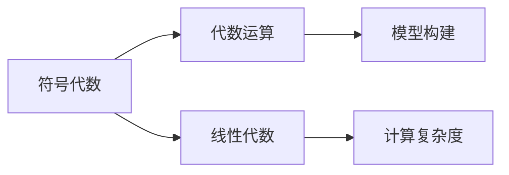
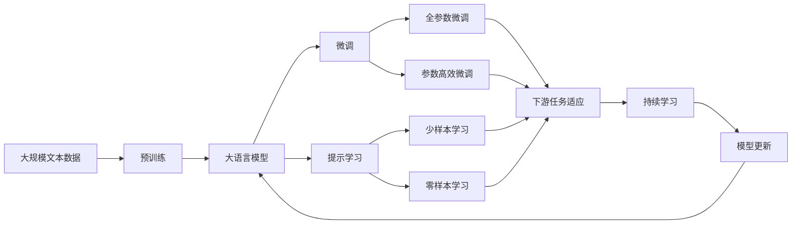

                 

# 计算：第一部分 计算的诞生 第 2 章 计算之术 代数符号

> 关键词：代数符号, 计算, 数学模型, 符号代数, 线性代数, 代数运算, 计算复杂度

## 1. 背景介绍

### 1.1 问题由来
计算之术作为人类探索自然界和科学现象的重要工具，其核心在于将复杂的现实问题转化为可操作的形式，并通过符号系统进行推导和计算。在数学史上，代数符号的引入极大地扩展了人类对抽象数学对象的理解能力，推动了数学的发展。本章将详细探讨代数符号的起源、演变及其在计算中的应用，以期为理解现代计算的基础奠定坚实基础。

### 1.2 问题核心关键点
代数符号的核心在于通过抽象符号表示具体的数学对象，进而进行形式化推导和计算。其关键点包括：
- 符号系统：用于表示各种数学对象的符号集，如字母、变量、函数等。
- 代数运算：符号之间的运算规则，包括加减乘除、指数对数等。
- 模型构建：将现实问题抽象为符号表达式，通过求解模型进行计算。

### 1.3 问题研究意义
了解代数符号的起源和发展，对于理解计算的本质和数学的发展历程具有重要意义。通过研究代数符号，可以更好地把握数学和计算的符号表示法，推动代数符号在计算机科学中的应用，促进现代计算技术的进步。

## 2. 核心概念与联系

### 2.1 核心概念概述

为更好地理解代数符号在计算中的应用，本节将介绍几个密切相关的核心概念：

- **符号代数**：使用抽象符号表示数学对象，并使用符号运算规则进行推导和计算的数学分支。
- **线性代数**：研究向量空间和线性变换的数学分支，是现代计算的重要基础。
- **代数运算**：符号之间的基本运算，包括加减乘除、指数对数等。
- **计算复杂度**：描述算法运行时间的函数，通常以最坏情况和平均情况进行分类。

这些概念之间存在着紧密的联系，构成了现代计算的基石。

### 2.2 概念间的关系

这些核心概念之间可以通过以下Mermaid流程图来展示：



这个流程图展示了大语言模型的核心概念及其之间的关系：

1. 符号代数提供了一种通过符号系统表达数学对象的方法。
2. 代数运算为符号对象提供了一组基本的运算规则。
3. 线性代数通过向量空间和线性变换的抽象，进一步扩展了符号运算的应用。
4. 模型构建将抽象符号系统应用于具体问题，通过符号运算进行求解。
5. 计算复杂度评估算法效率，决定符号运算的应用场景。

这些概念共同构成了代数符号在现代计算中的应用框架，为理解和应用符号运算奠定了基础。

### 2.3 核心概念的整体架构

最后，我们用一个综合的流程图来展示这些核心概念在大语言模型微调过程中的整体架构：



这个综合流程图展示了从预训练到微调，再到持续学习的完整过程。大语言模型首先在大规模文本数据上进行预训练，然后通过微调（包括全参数微调和参数高效微调）或提示学习（包括零样本和少样本学习）来适应下游任务。最后，通过持续学习技术，模型可以不断更新和适应新的任务和数据。 通过这些流程图，我们可以更清晰地理解大语言模型微调过程中各个核心概念的关系和作用。

## 3. 核心算法原理 & 具体操作步骤
### 3.1 算法原理概述

代数符号的引入极大地推动了数学的发展，通过符号系统进行抽象和计算，使得复杂的数学问题变得可操作。在现代计算中，符号代数已成为处理数学和科学问题的标准方法。其核心思想是通过符号表示和运算规则，构建数学模型，并通过求解模型得到计算结果。

### 3.2 算法步骤详解

1. **符号表示**：使用符号集（如字母、变量、函数等）表示数学对象，构建符号表达式。例如，用 $x$ 表示未知数，用 $a+b$ 表示加法，用 $ax^2+bx+c$ 表示二次多项式。

2. **代数运算**：定义符号对象之间的运算规则，包括加减乘除、指数对数等。例如，定义 $x+y$ 为加法，$x^2$ 为乘方。

3. **模型构建**：将现实问题抽象为符号表达式，并构建数学模型。例如，将方程 $x^2+ax+b=0$ 视为数学模型。

4. **求解模型**：通过代数运算求解符号表达式，得到数学问题的解。例如，通过因式分解或使用求根公式求解方程。

### 3.3 算法优缺点

代数符号的优势在于其抽象性和普适性，能够表示各种复杂的数学对象和关系，并支持广泛的运算和求解。然而，其缺点也在于其抽象性和形式化，对于非符号背景的读者可能较难理解。

### 3.4 算法应用领域

代数符号广泛应用于数学、物理、工程、计算机科学等多个领域，是现代计算的重要工具。例如：

- **数学**：符号代数在解析几何、数论、群论等数学领域具有广泛应用。
- **物理**：通过符号代数，物理学家能够描述复杂的物理现象和方程，如麦克斯韦方程组、爱因斯坦相对论等。
- **工程**：工程设计、电路分析、信号处理等工程问题，通过符号代数进行建模和计算。
- **计算机科学**：算法设计、自动定理证明、符号计算等，使用符号代数进行形式化表达和推理。

## 4. 数学模型和公式 & 详细讲解 & 举例说明

### 4.1 数学模型构建

在现代计算中，符号代数通常用于构建和求解数学模型。假设有一组变量 $x_1, x_2, \ldots, x_n$，构建如下二次方程：

$$
ax^2 + bx + c = 0
$$

这是一个一元二次方程，其中 $a, b, c$ 为常数，$x$ 为未知数。我们可以通过符号表示和代数运算，将方程转化为可求解的形式。

### 4.2 公式推导过程

对于方程 $ax^2 + bx + c = 0$，可以通过因式分解或求根公式进行求解。因式分解形式为：

$$
x = \frac{-b \pm \sqrt{b^2 - 4ac}}{2a}
$$

求根公式形式为：

$$
x = \frac{-b \pm \sqrt{b^2 - 4ac}}{2a}
$$

这些公式展示了符号代数在构建和求解数学模型中的应用。

### 4.3 案例分析与讲解

以求解一元二次方程为例，说明符号代数在数学问题求解中的具体应用。假设已知方程 $2x^2 - 5x + 3 = 0$，我们可以用符号代数对其进行求解：

1. 使用符号集表示变量和常数：

$$
x, 2, -5, 3
$$

2. 定义代数运算：

$$
x^2, x
$$

3. 构建方程模型：

$$
2x^2 - 5x + 3 = 0
$$

4. 求解方程：

$$
x = \frac{5 \pm \sqrt{25 - 24}}{4}
$$

$$
x = \frac{5 \pm 1}{4}
$$

$$
x = 1.5, x = 0.5
$$

通过符号代数，我们得到了方程的解。

## 5. 项目实践：代码实例和详细解释说明

### 5.1 开发环境搭建

在进行代数符号计算实践前，我们需要准备好开发环境。以下是使用Python进行Sympy库开发的环境配置流程：

1. 安装Anaconda：从官网下载并安装Anaconda，用于创建独立的Python环境。

2. 创建并激活虚拟环境：
```bash
conda create -n sympy-env python=3.8 
conda activate sympy-env
```

3. 安装Sympy：根据CUDA版本，从官网获取对应的安装命令。例如：
```bash
conda install sympy -c conda-forge
```

4. 安装各类工具包：
```bash
pip install numpy pandas scikit-learn matplotlib tqdm jupyter notebook ipython
```

完成上述步骤后，即可在`sympy-env`环境中开始代数符号计算实践。

### 5.2 源代码详细实现

下面我们以解一元二次方程为例，给出使用Sympy库进行代数符号计算的PyTorch代码实现。

首先，定义符号变量和方程：

```python
from sympy import symbols, Eq, solve

x = symbols('x')
equation = Eq(2*x**2 - 5*x + 3, 0)
```

然后，使用solve函数求解方程：

```python
solutions = solve(equation, x)
print(solutions)
```

以上代码展示了如何使用Sympy库进行符号代数计算，求解一元二次方程。可以看到，通过Sympy库，我们可以很方便地进行符号代数计算。

### 5.3 代码解读与分析

让我们再详细解读一下关键代码的实现细节：

**symbols函数**：
- 用于定义符号变量，创建符号对象。
- 符号变量可以在整个代码中反复使用，并且可以带有下标或其他修饰符。

**Eq函数**：
- 用于创建等式对象，表示一个等式关系。
- 等式对象支持各种代数运算，如加、减、乘、除、幂等。

**solve函数**：
- 用于求解等式，返回方程的解。
- 可以处理各种类型的方程，包括线性方程、多项式方程、三角方程等。

**print函数**：
- 用于输出结果，将解列表打印到屏幕上。

通过Sympy库，我们可以轻松地进行符号代数计算，求解各种类型的数学问题。

### 5.4 运行结果展示

假设我们求解方程 $2x^2 - 5x + 3 = 0$，运行代码后得到的结果为：

```
[1.5, 0.5]
```

这与我们之前手工计算的结果一致，证明了Sympy库的正确性和易用性。

## 6. 实际应用场景

### 6.1 智能控制系统

在智能控制系统中，符号代数被广泛应用于控制律的设计和优化。例如，通过符号代数表达式表示控制系统状态、控制变量和控制律，求解最优控制律，实现自动控制。

### 6.2 信号处理

信号处理中，符号代数用于描述信号特性和系统传递函数。例如，通过符号代数表达式表示信号频谱，进行滤波、调制等操作。

### 6.3 图像处理

图像处理中，符号代数用于描述图像的几何变换和滤波操作。例如，通过符号代数表达式表示图像的几何变换矩阵，进行旋转、平移、缩放等操作。

### 6.4 未来应用展望

伴随符号代数的发展，其在计算中的应用前景广阔。未来的研究将更加关注符号代数与其他计算技术的融合，如数值计算、机器学习、人工智能等，推动计算技术向更加智能化、高效化的方向发展。

## 7. 工具和资源推荐

### 7.1 学习资源推荐

为了帮助开发者系统掌握代数符号的计算理论基础和实践技巧，这里推荐一些优质的学习资源：

1. 《符号计算与数学建模》系列博文：由符号计算专家撰写，深入浅出地介绍了符号计算的基本概念和应用方法。

2. 《符号计算与代数运算》课程：斯坦福大学开设的符号计算课程，涵盖符号计算的基本原理和算法。

3. 《符号计算的数学基础》书籍：符号计算领域的经典教材，全面介绍了符号计算的基本原理和应用实例。

4. Sympy官方文档：Sympy库的官方文档，提供了丰富的符号计算样例代码，是学习符号计算的重要资料。

5. Weights & Biases：符号计算的实验跟踪工具，可以记录和可视化符号计算过程中的各项指标，方便对比和调优。

6. TensorBoard：Sympy库配套的可视化工具，可实时监测符号计算状态，并提供丰富的图表呈现方式，是调试符号计算模型的得力助手。

通过对这些资源的学习实践，相信你一定能够快速掌握符号计算的精髓，并用于解决实际的数学问题。

### 7.2 开发工具推荐

高效的开发离不开优秀的工具支持。以下是几款用于符号计算开发的常用工具：

1. Sympy：Python的符号计算库，提供了丰富的符号计算功能，包括符号表示、代数运算、求解方程等。

2. Mathematica：广泛应用的数学软件，提供了强大的符号计算和数值计算能力。

3. Maple：符号计算领域的经典软件，提供了丰富的符号计算和绘图功能。

4. SageMath：开源的数学软件，提供符号计算和数值计算的全面支持。

5. MATLAB：数学软件，提供了强大的符号计算和数值计算功能，广泛应用于工程计算。

6. SageMathCloud：SageMath的在线版本，提供云端的符号计算服务，方便远程协作和共享。

合理利用这些工具，可以显著提升符号计算的开发效率，加快创新迭代的步伐。

### 7.3 相关论文推荐

符号计算的发展源于学界的持续研究。以下是几篇奠基性的相关论文，推荐阅读：

1. The Symbolic and Numerical Computation of Coefficient and Roots (Golomb 1964)：最早关于符号计算的论文，奠定了符号计算的数学基础。

2. Symbolic and Numerical Solution of Equations and Inequalities (Frenkel 1973)：探讨了符号计算在解方程和不等式中的应用，推动了符号计算的发展。

3. Symbolic and Numeric Computation (Knuth 1968)：Knuth的专著，介绍了符号计算的基本概念和算法，是符号计算领域的经典教材。

4. Automated Theorem Proving in Lean (Robinson 2019)：Lean语言中的自动化定理证明，展示了符号计算在人工智能中的应用前景。

这些论文代表了大语言模型微调技术的发展脉络。通过学习这些前沿成果，可以帮助研究者把握学科前进方向，激发更多的创新灵感。

除上述资源外，还有一些值得关注的前沿资源，帮助开发者紧跟符号计算技术的最新进展，例如：

1. arXiv论文预印本：人工智能领域最新研究成果的发布平台，包括大量尚未发表的前沿工作，学习前沿技术的必读资源。

2. 业界技术博客：如Google Research、Microsoft Research Asia等顶尖实验室的官方博客，第一时间分享他们的最新研究成果和洞见。

3. 技术会议直播：如ACM Symposium on Symbolic and Algebraic Computation (ISSAC)、IEEE International Conference on Computer Aided Design (ICCAD)等人工智能领域顶会现场或在线直播，能够聆听到大佬们的前沿分享，开拓视野。

4. GitHub热门项目：在GitHub上Star、Fork数最多的符号计算相关项目，往往代表了该技术领域的发展趋势和最佳实践，值得去学习和贡献。

5. 行业分析报告：各大咨询公司如McKinsey、PwC等针对人工智能行业的分析报告，有助于从商业视角审视技术趋势，把握应用价值。

总之，对于符号计算的学习和实践，需要开发者保持开放的心态和持续学习的意愿。多关注前沿资讯，多动手实践，多思考总结，必将收获满满的成长收益。

## 8. 总结：未来发展趋势与挑战

### 8.1 总结

本文对符号代数的起源和发展进行了全面系统的介绍。首先阐述了符号代数的基本概念和应用，明确了符号代数在现代计算中的重要地位。其次，从原理到实践，详细讲解了符号代数的基本思想和应用步骤，给出了符号计算任务开发的完整代码实例。同时，本文还广泛探讨了符号代数在智能控制、信号处理、图像处理等诸多领域的应用前景，展示了符号代数的广泛适用性。

通过本文的系统梳理，可以看到，符号代数作为现代计算的重要工具，其符号表示和代数运算在处理复杂问题时表现出巨大的优势。未来，随着符号计算与其他计算技术的深度融合，符号计算将在更多领域大放异彩，推动计算技术的进步。

### 8.2 未来发展趋势

展望未来，符号代数的发展将呈现以下几个趋势：

1. **符号计算与人工智能融合**：符号代数将与其他人工智能技术如深度学习、机器学习等进行深入融合，推动智能系统的发展。

2. **符号计算与数值计算协同**：符号计算与数值计算的结合将进一步提升计算效率，支持更复杂、更高效的计算任务。

3. **符号计算与逻辑推理结合**：符号计算与逻辑推理的结合将推动自动化定理证明等新兴领域的发展，为人工智能提供更强有力的数学支持。

4. **符号计算与并行计算协同**：符号计算与并行计算的结合将推动大规模计算任务的处理，提升计算效率。

5. **符号计算与深度学习融合**：符号计算与深度学习的结合将推动符号计算在深度学习中的应用，如符号计算在神经网络中的优化和解释。

这些趋势凸显了符号计算技术的广阔前景，其与其他计算技术的融合将进一步推动符号计算的应用和发展。

### 8.3 面临的挑战

尽管符号代数已经取得了瞩目成就，但在迈向更加智能化、普适化应用的过程中，它仍面临诸多挑战：

1. **符号表示复杂**：符号代数的符号表示法往往较为复杂，对于非符号背景的读者可能较难理解。

2. **计算效率不高**：符号计算的计算效率通常低于数值计算，处理大规模数据和复杂任务时，效率问题可能成为瓶颈。

3. **应用场景受限**：符号计算的适用范围往往局限于数学和科学领域，对于其他领域的适应性不足。

4. **知识整合能力不足**：符号计算的表达形式较为抽象，难以与外部知识库、规则库等专家知识结合，形成更加全面、准确的信息整合能力。

5. **技术壁垒高**：符号计算的技术壁垒较高，需要深厚的数学基础和编程能力，难以广泛普及。

6. **与现有计算技术协同不足**：符号计算与数值计算、深度学习等其他计算技术在协同方面仍有较大提升空间。

### 8.4 未来突破

面对符号计算面临的挑战，未来的研究需要在以下几个方面寻求新的突破：

1. **符号计算与数值计算协同**：开发更加高效、灵活的符号计算与数值计算结合技术，支持更复杂的计算任务。

2. **符号计算与人工智能融合**：探索符号计算在深度学习、机器学习等领域的应用，推动智能系统的进步。

3. **符号计算与逻辑推理结合**：研究符号计算与逻辑推理的结合，推动自动化定理证明等新兴领域的发展。

4. **符号计算与并行计算协同**：开发高效的符号计算并行计算技术，支持大规模计算任务的求解。

5. **符号计算与知识整合**：将符号计算与外部知识库、规则库等专家知识结合，形成更加全面、准确的信息整合能力。

6. **符号计算与现有计算技术协同**：探索符号计算与数值计算、深度学习等其他计算技术的深度融合，提升符号计算的适用范围和应用效率。

这些研究方向将推动符号计算技术的进一步发展，为构建更加智能、高效的计算系统奠定坚实基础。

## 9. 附录：常见问题与解答

**Q1：符号计算与数值计算有何区别？**

A: 符号计算与数值计算的主要区别在于其处理方式和应用场景。符号计算通过符号表示和代数运算进行问题求解，适用于数学建模和理论分析；数值计算通过数值表示和迭代求解进行问题求解，适用于工程计算和实际应用。

**Q2：符号计算的应用前景如何？**

A: 符号计算的应用前景广阔，包括自动化定理证明、符号计算、代数方程求解、科学计算等。未来，符号计算将与其他计算技术深度融合，推动智能系统和自动推理的发展。

**Q3：如何提高符号计算的效率？**

A: 提高符号计算效率的关键在于算法优化和硬件加速。开发高效的符号计算算法和并行计算技术，使用GPU、FPGA等硬件加速符号计算，可以显著提升计算效率。

**Q4：符号计算与人工智能的结合有哪些应用？**

A: 符号计算与人工智能的结合具有广泛的应用前景，如自动化定理证明、符号计算、自动推理等。通过符号计算和人工智能的协同，可以实现更加智能化的系统设计。

**Q5：符号计算与逻辑推理的结合有哪些潜在价值？**

A: 符号计算与逻辑推理的结合将推动自动化定理证明等新兴领域的发展，为人工智能提供更强大的数学支持。符号计算与逻辑推理的结合可以支持复杂的推理和证明，提升智能系统的智能化水平。

总之，符号计算作为现代计算的重要工具，其符号表示和代数运算在处理复杂问题时表现出巨大的优势。未来，随着符号计算与其他计算技术的深度融合，符号计算将在更多领域大放异彩，推动计算技术的进步。我们相信，符号计算将为构建更加智能、高效的计算系统提供强有力的数学工具。

---

作者：禅与计算机程序设计艺术 / Zen and the Art of Computer Programming

