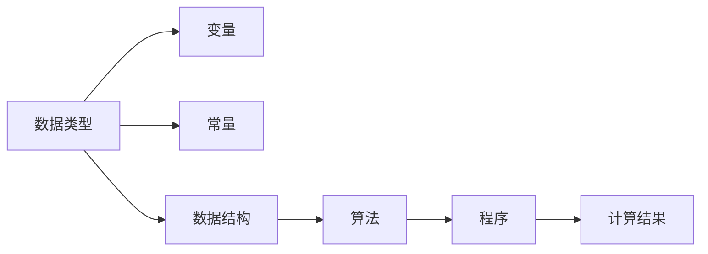

                 

# 计算：第一部分 计算的诞生 第 2 章 计算之术 未知量的表示

> 关键词：计算机编程, 编程语言, 编码, 数据结构, 算法, 计算复杂度

## 1. 背景介绍

### 1.1 问题由来
在《计算：第一部分 计算的诞生》第1章中，我们介绍了计算机的诞生背景和基本原理。本章将继续深入探讨计算之术，尤其是计算机编程的基础——未知量的表示。这一主题不仅对理解计算机如何处理数据和执行指令至关重要，也是整个计算领域的核心概念之一。

### 1.2 问题核心关键点
未知量的表示是计算机编程的基础，也是理解算法和数据结构的关键。在本章中，我们将详细探讨未知量的表示方法、常见数据结构及其特性，以及如何通过编程语言实现这些数据结构。

### 1.3 问题研究意义
掌握未知量的表示方法对于计算机编程和算法设计具有重要意义。它不仅帮助程序员理解数据的组织方式，还能提升程序的效率和可维护性。此外，通过深入学习未知量的表示方法，可以更好地理解计算的本质和计算机处理数据的方式。

## 2. 核心概念与联系

### 2.1 核心概念概述

为了更好地理解未知量的表示方法，我们将介绍几个关键概念：

- **数据类型(Data Type)**：编程语言中用于表示不同类型数据的抽象概念。例如，整数、浮点数、字符串等。
- **变量(Variable)**：存储在计算机内存中的数据，可以通过编程语言中定义的标识符访问。
- **常量(Constant)**：一旦被赋值，其值在程序执行过程中保持不变。
- **数据结构(Data Structure)**：用于组织和管理数据的抽象数据类型。常见的数据结构包括数组、链表、栈、队列、树等。
- **算法(Algorithm)**：解决问题的一组明确、有限的步骤。通常分为基本算法和高级算法。

这些概念通过程序流控制结构（如条件语句、循环语句）和数据抽象（如封装、继承等）构成了一个完整的计算系统。理解这些概念及其相互联系，对于掌握计算机编程至关重要。

### 2.2 核心概念的联系

数据类型、变量、常量、数据结构、算法之间存在着密切的联系，构成了一个完整的计算模型。以下是这些概念之间的联系示意图：



这个图展示了数据类型、变量、常量、数据结构、算法和程序之间的关系。数据类型定义了数据的组织方式，变量和常量作为数据存储在内存中，数据结构提供了数据组织和管理的手段，算法定义了操作数据的步骤，最终通过程序实现计算过程，产生计算结果。

## 3. 核心算法原理 & 具体操作步骤

### 3.1 算法原理概述

计算机编程的本质是通过算法将问题转化为计算步骤，使用数据结构组织和管理数据，最终实现计算结果。这一过程涉及到对未知量的表示和操作。

### 3.2 算法步骤详解

未知量的表示和操作主要分为以下几个步骤：

1. **数据类型定义**：在编程语言中定义数据类型，用于描述数据的特性和操作方式。
2. **变量声明和初始化**：声明变量并初始化其值。变量可以存储不同的数据类型，包括整数、浮点数、字符串等。
3. **数据结构定义**：定义数据结构，如数组、链表、栈、队列等，用于组织和管理数据。
4. **算法实现**：编写算法，即明确的步骤，用于操作数据结构中的元素。
5. **程序执行**：通过编程语言提供的控制结构（如条件语句、循环语句）和函数调用，实现算法的执行。

### 3.3 算法优缺点

未知量的表示和操作算法具有以下优点：

- **灵活性**：通过定义不同的数据类型和数据结构，程序员可以灵活地组织和管理数据。
- **可复用性**：使用算法和数据结构，可以复用已有的代码，提高编程效率。
- **可扩展性**：算法和数据结构能够支持复杂的数据处理和计算任务。

同时，这些算法也存在一些缺点：

- **复杂性**：对于复杂的数据结构和算法，理解和使用难度较大。
- **性能问题**：不合理的算法和数据结构可能导致性能瓶颈。
- **实现难度**：高级算法和数据结构可能需要较高的编程技巧。

### 3.4 算法应用领域

未知量的表示和操作算法在计算机科学和工程领域有着广泛的应用，包括但不限于：

- **数据库管理**：使用数组和链表等数据结构存储和管理数据。
- **图形处理**：使用栈和队列等数据结构处理图形遍历和路径搜索。
- **人工智能**：使用树和图等数据结构实现搜索和推理算法。
- **操作系统**：使用数组和链表等数据结构管理进程和内存。

## 4. 数学模型和公式 & 详细讲解 & 举例说明

### 4.1 数学模型构建

在计算机编程中，数学模型和公式的应用主要体现在数据结构和算法的实现上。以下是一个简单的数学模型示例：

假设有一个数组 `A`，存储整数序列 `[1, 2, 3, 4, 5]`。我们可以通过数学公式来计算数组中所有元素的平均值：

$$
\text{avg} = \frac{1}{n} \sum_{i=1}^{n} A[i]
$$

其中 $n$ 为数组长度，$A[i]$ 为第 $i$ 个元素的值。

### 4.2 公式推导过程

数组的平均值的计算可以通过以下步骤推导：

1. 计算数组中所有元素的和：
   $$
   S = \sum_{i=1}^{n} A[i]
   $$

2. 将和除以数组长度：
   $$
   \text{avg} = \frac{S}{n}
   $$

3. 将结果赋值给变量 `avg`。

### 4.3 案例分析与讲解

假设我们有一个包含 10 个元素的整数数组 `A`，我们可以使用Python代码来实现上述数学模型：

```python
A = [1, 2, 3, 4, 5, 6, 7, 8, 9, 10]
n = len(A)
S = sum(A)
avg = S / n
print(avg)
```

输出结果为 `5.5`，即数组中所有元素的平均值。

## 5. 项目实践：代码实例和详细解释说明

### 5.1 开发环境搭建

在开始项目实践前，我们需要准备好开发环境。以下是Python项目实践的开发环境搭建步骤：

1. 安装Python：从官网下载并安装Python，选择最新版本。
2. 安装必要的Python库：如NumPy、Pandas、Matplotlib等。
3. 设置开发工具：如PyCharm、Jupyter Notebook等。

### 5.2 源代码详细实现

下面我们以计算数组平均值为例，使用Python代码实现。

```python
import numpy as np

# 定义数组
A = np.array([1, 2, 3, 4, 5, 6, 7, 8, 9, 10])

# 计算数组平均值
avg = np.mean(A)

# 输出结果
print(avg)
```

### 5.3 代码解读与分析

代码中，我们使用了NumPy库来定义数组 `A` 和计算平均值 `avg`。具体步骤如下：

1. 导入NumPy库。
2. 定义数组 `A`，使用NumPy的`array`函数创建。
3. 计算数组平均值 `avg`，使用NumPy的`mean`函数。
4. 输出结果 `avg`。

### 5.4 运行结果展示

运行上述代码，输出结果为 `5.5`，即数组中所有元素的平均值。

## 6. 实际应用场景

### 6.1 数据库管理

数据库管理系统广泛使用数组、链表等数据结构来存储和管理数据。例如，关系型数据库中的表可以通过二维数组来表示，关系型数据库中的记录可以通过链表来管理。

### 6.2 图形处理

在图形处理中，栈和队列等数据结构被广泛用于图形遍历和路径搜索。例如，深度优先搜索和广度优先搜索算法分别使用栈和队列来维护搜索状态。

### 6.3 人工智能

在人工智能领域，树和图等数据结构被用于搜索和推理算法。例如，决策树和随机森林算法使用树来表示决策过程，图神经网络算法使用图来表示数据结构。

### 6.4 未来应用展望

未来，未知量的表示和操作算法将在更多领域得到应用。例如：

- **物联网**：使用数据结构管理传感器数据，进行实时分析和决策。
- **金融科技**：使用数据结构存储和管理金融数据，进行风险评估和投资决策。
- **生物信息学**：使用数据结构处理和分析生物数据，进行基因组分析和药物设计。

## 7. 工具和资源推荐

### 7.1 学习资源推荐

为了帮助开发者系统掌握未知量的表示方法，以下是一些优质的学习资源：

1. 《计算机程序设计艺术》系列书籍：深入探讨计算机编程的原理和技巧。
2. 《算法导论》：介绍算法的基本概念、设计和分析。
3. 《数据结构与算法分析》：详细讲解各种数据结构和算法的实现和应用。
4. 在线课程：如Coursera、edX等提供的计算机科学和编程课程。
5. 编程竞赛：如LeetCode、HackerRank等平台提供的编程练习和竞赛。

通过对这些资源的学习实践，相信你一定能够快速掌握未知量的表示方法，并用于解决实际的编程问题。

### 7.2 开发工具推荐

高效的开发离不开优秀的工具支持。以下是几款用于未知量表示和操作的常用工具：

1. Python：强大的编程语言，支持数据类型、变量、常量、数据结构和算法的实现。
2. NumPy：Python的科学计算库，提供了高效的数组和矩阵操作。
3. Pandas：Python的数据分析库，提供了强大的数据结构和数据操作功能。
4. PyCharm：流行的Python开发工具，提供代码自动补全、调试等功能。
5. Jupyter Notebook：交互式编程工具，适合快速迭代和调试代码。

合理利用这些工具，可以显著提升未知量表示和操作的开发效率，加快创新迭代的步伐。

### 7.3 相关论文推荐

未知量的表示和操作算法的发展源于学界的持续研究。以下是几篇奠基性的相关论文，推荐阅读：

1. Knuth's "The Art of Computer Programming"：详细介绍了数据结构和算法的实现和应用。
2. Cormen等人的《算法导论》：介绍算法的基本概念、设计和分析。
3. Hoare的《Data Structures》：介绍各种数据结构的实现和应用。
4. Kernighan和Ritchie的《The C Programming Language》：介绍C语言的数据类型和算法实现。
5. de Bakker的《Algorithms in Data Structures》：介绍数据结构和算法的实现和分析。

这些论文代表了大语言模型微调技术的发展脉络。通过学习这些前沿成果，可以帮助研究者把握学科前进方向，激发更多的创新灵感。

## 8. 总结：未来发展趋势与挑战

### 8.1 总结

本文对未知量的表示方法进行了全面系统的介绍。首先阐述了未知量的表示在计算机编程中的基础地位，明确了其在理解算法和数据结构中的关键作用。其次，从原理到实践，详细讲解了未知量的表示方法、常见数据结构及其特性，以及如何通过编程语言实现这些数据结构。同时，本文还探讨了未知量的表示方法在数据库管理、图形处理、人工智能等领域的应用前景。

通过本文的系统梳理，可以看到，未知量的表示方法在计算机编程中起着至关重要的作用，帮助程序员理解数据的组织方式，提高程序的效率和可维护性。未来，伴随未知量表示方法的不断演进，计算机编程将变得更加灵活、高效和可维护。

### 8.2 未来发展趋势

未知量的表示方法将继续发展，呈现出以下几个趋势：

1. **多维数据结构**：随着数据复杂度的增加，多维数据结构将逐渐普及，用于处理更加复杂的数据关系。
2. **自动化数据结构**：自动化生成和优化数据结构，减少人工设计的时间和成本。
3. **数据流优化**：数据流分析工具将帮助程序员优化数据结构和算法，提高程序性能。
4. **智能编程工具**：通过机器学习和人工智能技术，智能推荐数据结构和算法，提高编程效率。
5. **数据结构语言**：出现专门用于数据结构和算法编程的编程语言，如Go、Rust等。

这些趋势将进一步推动未知量表示和操作算法的发展，提升计算机编程的效率和可维护性。

### 8.3 面临的挑战

尽管未知量的表示方法已经取得了显著进展，但在迈向更加智能化、普适化应用的过程中，它仍面临诸多挑战：

1. **复杂性**：多维数据结构和自动化生成数据结构，增加了学习和使用的难度。
2. **性能瓶颈**：自动化数据结构和智能编程工具可能带来性能问题。
3. **工具支持不足**：缺乏专门用于数据结构和算法编程的开发工具和语言。
4. **兼容性问题**：不同编程语言和平台之间的数据结构和算法兼容性问题。
5. **数据安全**：数据结构的误用可能导致数据泄露和滥用。

正视未知量表示方法面临的这些挑战，积极应对并寻求突破，将是大语言模型微调技术迈向成熟的必由之路。相信随着学界和产业界的共同努力，这些挑战终将一一被克服，未知量表示方法必将在构建人机协同的智能时代中扮演越来越重要的角色。

### 8.4 未来突破

面对未知量表示方法所面临的种种挑战，未来的研究需要在以下几个方面寻求新的突破：

1. **自动化数据结构设计**：开发自动化生成和优化数据结构的工具，减少人工设计的时间和成本。
2. **智能编程辅助**：通过机器学习和人工智能技术，智能推荐数据结构和算法，提高编程效率。
3. **跨平台兼容性**：研究和解决不同编程语言和平台之间的数据结构和算法兼容性问题。
4. **安全性保障**：加强数据结构的误用防护，确保数据安全和隐私。

这些研究方向的探索，必将引领未知量表示和操作算法迈向更高的台阶，为构建安全、可靠、可解释、可控的智能系统铺平道路。面向未来，未知量表示方法还需要与其他人工智能技术进行更深入的融合，如知识表示、因果推理、强化学习等，多路径协同发力，共同推动自然语言理解和智能交互系统的进步。只有勇于创新、敢于突破，才能不断拓展未知量表示的边界，让智能技术更好地造福人类社会。

## 9. 附录：常见问题与解答

**Q1：未知量的表示方法是否适用于所有编程语言？**

A: 未知量的表示方法在大多数编程语言中都是适用的。不同的编程语言可能提供不同的数据类型和数据结构，但本质上，未知量的表示方法是一致的。例如，Python提供了列表和字典等数据结构，Java提供了数组和ArrayList等数据结构，C++提供了vector和map等数据结构。

**Q2：如何选择合适的数据结构？**

A: 选择合适的数据结构需要考虑数据的特点、操作频率和性能要求。以下是一些常见的选择原则：

- 如果数据需要频繁访问，可以使用数组或哈希表。
- 如果数据需要频繁插入和删除，可以使用链表或平衡树。
- 如果需要支持快速查找和排序，可以使用二叉树或B树。
- 如果需要支持多维数据和复杂关系，可以使用图和邻接表。

**Q3：如何优化数据结构的性能？**

A: 优化数据结构的性能可以从以下几个方面入手：

- 减少数据冗余：通过压缩和优化数据结构，减少存储空间占用。
- 使用缓存机制：使用缓存技术，减少数据的重复计算和存储。
- 实现自定义操作：根据具体需求，自定义数据结构的操作，提升性能。

**Q4：如何在程序中有效使用数据结构？**

A: 在程序中有效使用数据结构需要遵循以下原则：

- 选择合适的数据结构：根据数据特点和操作需求，选择最适合的数据结构。
- 合理设计数据结构：根据具体应用场景，合理设计数据结构，避免过度设计或冗余。
- 高效使用数据结构：在程序中高效使用数据结构，减少资源消耗，提高程序性能。

**Q5：如何在不同编程语言中实现相同的算法？**

A: 在不同的编程语言中实现相同的算法，需要考虑以下几点：

- 理解算法的本质：深入理解算法的原理和实现方式，而不是仅仅关注语法和API。
- 选择适合的编程语言：选择适合实现算法的编程语言，考虑其特性和性能。
- 实现细节差异：注意不同编程语言在实现细节上的差异，如数据类型、函数调用等。

这些问题的解答，将帮助你更好地理解未知量的表示方法，并在实际开发中灵活应用。

---

作者：禅与计算机程序设计艺术 / Zen and the Art of Computer Programming

