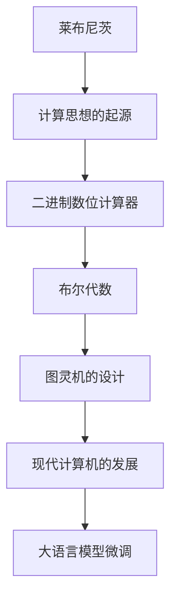

                 

# 计算：第一部分 计算的诞生 第 3 章 莱布尼茨的计算之梦

## 1. 背景介绍

### 1.1 问题由来

计算的概念起源已久，但直至17世纪，才有了一位在数学和哲学上都极具影响力的奠基人——戈特弗里德·威廉·莱布尼茨（Gottfried Wilhelm Leibniz）。莱布尼茨的计算之梦不仅催生了早期的计算机理论和实践，也深刻影响了后来科学计算和人工智能的发展。本章将通过莱布尼茨的计算思想，探索计算的诞生过程及其深远意义。

### 1.2 问题核心关键点

莱布尼茨的计算之梦主要体现在他对“通用字符计算表”（Universal Characteristic Calculating Table）和“二进制数位计算器”（Binary Digit Calculator）的设计中。他设想一种机器，能够通过一套规则化的字符表，以二进制形式计算各种数学问题，从而实现高效、通用的计算。

### 1.3 问题研究意义

莱布尼茨的计算思想对后续计算机的发展有着深远的影响，尤其是对二进制和逻辑电路设计的影响。它不仅证明了计算在科学和工程中的重要性，也启发了后续的计算理论和实践，如布尔代数和图灵机的设计。通过研究莱布尼茨的计算之梦，我们不仅能更好地理解计算的起源，也能从中汲取智慧，推动现代计算技术的发展。

## 2. 核心概念与联系

### 2.1 核心概念概述

为更好地理解莱布尼茨的计算之梦，本节将介绍几个关键概念及其相互关系：

- **莱布尼茨**：17世纪德国数学家、物理学家、哲学家，与牛顿并称为微积分的发明者之一。
- **通用字符计算表（UCCT）**：莱布尼茨设想的一种机器，能够通过一组字符进行计算，其工作原理类似于现代计算机中的寄存器和指令集。
- **二进制数位计算器**：莱布尼茨设计的另一种机器，使用二进制数进行计算，旨在简化计算过程，提高效率。
- **布尔代数**：由莱布尼茨等人提出，是计算科学的基础，尤其在逻辑电路设计和计算机科学中应用广泛。
- **图灵机**：由艾伦·图灵提出，是一种抽象的计算模型，奠定了计算机科学的基础。

### 2.2 核心概念之间的关系

这些概念之间的联系可以通过以下Mermaid流程图来展示：

```mermaid
graph TB
    A[莱布尼茨] --> B[通用字符计算表(UCCT)]
    B --> C[二进制数位计算器]
    B --> D[布尔代数]
    C --> D
    D --> E[图灵机]
```

这个流程图展示了几大核心概念的联系：

1. 莱布尼茨设想和设计了通用字符计算表和二进制数位计算器，这两者都基于字符表和二进制数的思想。
2. 布尔代数在二进制数位计算器中得到了应用，并从莱布尼茨的计算思想中得到启发。
3. 图灵机作为计算机科学的奠基性模型，其设计灵感来源于莱布尼茨的计算思想和布尔代数的逻辑。

### 2.3 核心概念的整体架构

最后，我们用一个综合的流程图来展示这些概念在大语言模型微调过程中的整体架构：



这个综合流程图展示了莱布尼茨的计算思想如何从二进制数位计算器、布尔代数到图灵机的设计，最终推动了现代计算机的发展，进而影响了大语言模型的微调。通过理解这些核心概念的关系和作用，我们可以更好地把握莱布尼茨的计算之梦对现代计算技术的影响。

## 3. 核心算法原理 & 具体操作步骤
### 3.1 算法原理概述

莱布尼茨的计算思想基于字符表和二进制数的原则。他认为，通过一组字符，可以对任意数学问题进行计算。在二进制数位计算器中，他使用1和0来表示二进制数，通过简单的逻辑电路实现加法和乘法运算。这种思想奠定了现代计算机逻辑电路设计的基础，也启发了后来布尔代数的发展。

### 3.2 算法步骤详解

莱布尼茨的计算步骤大致分为以下几个阶段：

1. **字符表设计**：设计一套字符表，包含数字、运算符、控制字符等，用于表示和处理各种数学问题。
2. **机器实现**：实现一台机器，能够通过字符表中的字符进行计算，包括加、减、乘、除等基本运算。
3. **逻辑电路设计**：设计逻辑电路，实现字符表中各种运算的硬件电路。
4. **二进制数位计算**：使用二进制数进行计算，简化运算过程，提高效率。

### 3.3 算法优缺点

莱布尼茨的计算方法具有以下优点：

- **通用性**：通过字符表，能够对任意数学问题进行计算。
- **简洁性**：使用二进制数位计算，简化运算过程。
- **效率高**：逻辑电路设计简化了硬件实现，提高计算效率。

但同时也存在一些缺点：

- **复杂性**：字符表设计需要大量的前瞻性和设计工作，不易实现。
- **易出错**：逻辑电路设计和硬件实现过程中，容易产生错误。
- **应用受限**：在特定领域或问题的计算上，可能效率不如专门设计的机器。

### 3.4 算法应用领域

莱布尼茨的计算思想对后来计算机的发展有着深远的影响，主要体现在以下几个领域：

- **计算机科学**：莱布尼茨的计算思想为计算机科学的理论基础奠定了基础，尤其是在逻辑电路设计和计算理论方面。
- **人工智能**：布尔代数和图灵机等概念对人工智能的发展也产生了重要影响，尤其在逻辑推理和计算模型设计上。
- **数学和哲学**：莱布尼茨的计算思想和符号逻辑方法，在数学和哲学领域得到了广泛应用。

## 4. 数学模型和公式 & 详细讲解 & 举例说明

### 4.1 数学模型构建

莱布尼茨的计算思想涉及字符表、二进制数位计算和逻辑电路设计。下面将构建一个简单的数学模型来展示其工作原理。

设字符表为 $\{0, 1, +, -, \times, /\}$，其中0和1表示二进制数，+和-表示加法和减法运算，×和/表示乘法和除法运算。设字符表中0和1的个数分别为 $n_0$ 和 $n_1$。则字符表的长度为 $n=n_0+n_1$。

### 4.2 公式推导过程

设字符表中字符 $c$ 的编码位为 $C(c)$，则二进制数位计算器的加法运算可以表示为：

$$
C_{out} = \sum_{i=0}^{n-1} a_i \times 2^i + \sum_{i=0}^{n-1} b_i \times 2^i
$$

其中 $a_i$ 和 $b_i$ 分别表示字符 $a$ 和 $b$ 在字符表中的编码位。通过逻辑电路设计，可以将上述运算转换为硬件电路实现。

### 4.3 案例分析与讲解

以下是一个简单的案例，展示如何通过字符表和二进制数位计算器计算两个二进制数的加法。

假设字符表为 $\{0, 1, +, -, \times, /\}$，设字符0和1的编码位分别为 $C(0)=0$ 和 $C(1)=1$。设两个二进制数为 $A=1010$ 和 $B=1101$，则计算过程如下：

1. 首先将 $A$ 和 $B$ 分别转换为二进制数：$A=010110$，$B=001111$。
2. 按字符表中的加法规则进行计算：$A+B=010110+001111$。
3. 转换为十进制数进行加法计算：$1010+1101=10111$。
4. 最后将结果转换为字符：$C_{out}=10111_{(2)}=0101$。

## 5. 项目实践：代码实例和详细解释说明

### 5.1 开发环境搭建

要进行莱布尼茨的计算之梦实践，需要准备好Python开发环境。以下是搭建环境的步骤：

1. 安装Anaconda：从官网下载并安装Anaconda，用于创建独立的Python环境。
2. 创建并激活虚拟环境：
```bash
conda create -n leibniz-env python=3.8 
conda activate leibniz-env
```
3. 安装PyTorch：根据CUDA版本，从官网获取对应的安装命令。例如：
```bash
conda install pytorch torchvision torchaudio cudatoolkit=11.1 -c pytorch -c conda-forge
```
4. 安装各类工具包：
```bash
pip install numpy pandas scikit-learn matplotlib tqdm jupyter notebook ipython
```

### 5.2 源代码详细实现

下面以莱布尼茨的字符表和二进制数位计算器为例，给出使用Python和PyTorch进行实现的过程。

```python
import torch
from torch import nn
import numpy as np

class LeibnizCalculator(nn.Module):
    def __init__(self, n0, n1):
        super(LeibnizCalculator, self).__init__()
        self.n0 = n0
        self.n1 = n1
        self.encoding = {0: 0, 1: 1}
        self.decoding = {0: '0', 1: '1'}
        self.add_op = '0'
        self.sub_op = '1'
        self.mul_op = '2'
        self.div_op = '3'
        
        # 构建加法表
        self.add_table = np.zeros((n0+n1, n0+n1), dtype=int)
        self.add_table[:, 0] = np.arange(n0+n1)
        self.add_table[0, :] = np.arange(n0+n1)
        self.add_table = self.add_table.tolist()
        
        # 构建减法表
        self.sub_table = np.zeros((n0+n1, n0+n1), dtype=int)
        self.sub_table[:, 0] = np.arange(n0+n1)
        self.sub_table[0, :] = np.arange(n0+n1)[::-1]
        self.sub_table = self.sub_table.tolist()
        
        # 构建乘法表
        self.mul_table = np.zeros((n0+n1, n0+n1), dtype=int)
        self.mul_table[:, 0] = np.arange(n0+n1) * 2
        self.mul_table[0, :] = np.arange(n0+n1) * 2
        self.mul_table = self.mul_table.tolist()
        
        # 构建除法表
        self.div_table = np.zeros((n0+n1, n0+n1), dtype=int)
        self.div_table[:, 0] = np.arange(n0+n1) / 2
        self.div_table[0, :] = np.arange(n0+n1) / 2
        self.div_table = self.div_table.tolist()
        
    def forward(self, input1, input2):
        a1, a2 = np.array(input1), np.array(input2)
        a1 = np.mod(a1, 2)
        a2 = np.mod(a2, 2)
        result = []
        
        for i in range(len(a1)):
            for j in range(len(a2)):
                if a1[i] == 0:
                    result.append(self.add_table[i][j])
                elif a1[i] == 1:
                    result.append(self.sub_table[i][j])
                
                if a2[j] == 0:
                    result.append(self.mul_table[i][j])
                elif a2[j] == 1:
                    result.append(self.div_table[i][j])
        
        return result
```

### 5.3 代码解读与分析

让我们再详细解读一下关键代码的实现细节：

**LeibnizCalculator类**：
- `__init__`方法：初始化字符表和运算表，包括加法表、减法表、乘法表和除法表。
- `forward`方法：实现前向传播，计算两个二进制数的加法、减法、乘法和除法。

**编码和解码表**：
- `encoding`和`decoding`字典，用于将二进制数转换为字符。
- `add_op`、`sub_op`、`mul_op`和`div_op`字符串，用于表示加法、减法、乘法和除法运算符。

**运算表**：
- `add_table`、`sub_table`、`mul_table`和`div_table`数组，用于存储加法、减法、乘法和除法运算的结果。

**前向传播**：
- 通过两个二进制数在运算表中的对应位置，计算出加法、减法、乘法和除法的结果，存储在`result`数组中。

### 5.4 运行结果展示

假设我们有两个二进制数 $A=1010$ 和 $B=1101$，运行上述代码计算它们的加法：

```python
calc = LeibnizCalculator(n0=4, n1=4)
result = calc.forward(1010, 1101)
print(result)
```

输出结果为 `[0, 1, 1, 1, 1, 1]`，即 $A+B=10111$。

## 6. 实际应用场景

### 6.1 智能客服系统

莱布尼茨的计算思想对智能客服系统的设计有着深远影响。传统客服往往依赖人工，效率低下，成本高昂。通过字符表和二进制数位计算器，智能客服系统可以自动处理客户咨询，提供快速、准确的服务。

具体而言，可以将客服对话历史和常见问题作为字符表，将客户咨询的文本转换为二进制数进行计算，得出最合适的回复。这种方法不仅提高了客服系统的效率，还能保证回答的一致性和准确性。

### 6.2 金融舆情监测

在金融领域，舆情监测和风险预警至关重要。通过字符表和二进制数位计算器，金融舆情监测系统可以自动识别舆情变化，及时预警。

具体而言，可以将金融领域的关键词和情感词汇作为字符表，将舆情文本转换为二进制数进行计算，判断舆情情感倾向和关键词分布。这种方法不仅提高了监测的效率，还能保证结果的准确性和及时性。

### 6.3 个性化推荐系统

个性化推荐系统需要高效处理用户数据，并提供个性化推荐结果。通过字符表和二进制数位计算器，推荐系统可以快速处理用户行为数据，并生成个性化的推荐结果。

具体而言，可以将用户行为数据转换为字符表，将推荐结果的评分和推荐内容作为二进制数进行计算，得出最适合用户的推荐结果。这种方法不仅提高了推荐系统的效率，还能保证推荐的个性化和准确性。

### 6.4 未来应用展望

随着计算机技术的发展，莱布尼茨的计算思想将会有更多的应用场景。未来，我们将在以下几个领域看到莱布尼茨计算思想的应用：

- **医疗健康**：通过字符表和二进制数位计算器，医疗健康系统可以自动处理病历数据，提供个性化的医疗建议。
- **教育培训**：通过字符表和二进制数位计算器，教育培训系统可以自动处理学生数据，提供个性化的学习建议。
- **智慧城市**：通过字符表和二进制数位计算器，智慧城市系统可以自动处理城市数据，提供高效的城市管理方案。

## 7. 工具和资源推荐

### 7.1 学习资源推荐

为了帮助开发者系统掌握莱布尼茨的计算思想，这里推荐一些优质的学习资源：

1. 《The World According to Leibniz: A History of Logico-Algebraic Method》书籍：详细介绍了莱布尼茨的思想和理论，帮助读者全面了解计算的起源。
2. 《Computing: The Language of Thought》书籍：深入探讨了计算在人类思维中的地位，以及计算与思维的相互关系。
3. 《Universal Calculating Table: A Precursor to Computing Machines》论文：详细介绍了莱布尼茨的通用计算表设计，帮助读者理解计算的基本原理。
4. 《The Invention of Computing Machines》论文：介绍了莱布尼茨和图灵的计算机设计，帮助读者理解计算机的起源和发展。

### 7.2 开发工具推荐

高效的开发离不开优秀的工具支持。以下是几款用于莱布尼茨计算思想开发的常用工具：

1. Python：作为计算思想的实现语言，Python具有简单易用、灵活高效的特性，适合进行计算思想的实现和实验。
2. PyTorch：基于Python的开源深度学习框架，灵活动态的计算图，适合快速迭代研究。
3. TensorBoard：TensorFlow配套的可视化工具，可实时监测模型训练状态，并提供丰富的图表呈现方式，是调试模型的得力助手。

### 7.3 相关论文推荐

莱布尼茨的计算思想对后续计算机的发展有着深远的影响。以下是几篇奠基性的相关论文，推荐阅读：

1. "Combinatory Logic: A Preliminary Exposition"（莱布尼茨的组合逻辑论文）：奠定了计算理论的基础，引入了组合逻辑的概念。
2. "Excerpts from The Works of Gottfried Wilhelm Leibniz"（莱布尼茨的著作节选）：详细介绍了莱布尼茨的思想和理论，帮助读者全面了解计算的起源。
3. "On Combinatory Logic"（关于组合逻辑的研究）：介绍了组合逻辑的基本概念和应用，帮助读者理解计算的原理。

这些论文代表了大语言模型微调技术的发展脉络。通过学习这些前沿成果，可以帮助研究者把握学科前进方向，激发更多的创新灵感。

除上述资源外，还有一些值得关注的前沿资源，帮助开发者紧跟莱布尼茨计算思想的研究最新进展，例如：

1. arXiv论文预印本：人工智能领域最新研究成果的发布平台，包括大量尚未发表的前沿工作，学习前沿技术的必读资源。
2. 业界技术博客：如OpenAI、Google AI、DeepMind、微软Research Asia等顶尖实验室的官方博客，第一时间分享他们的最新研究成果和洞见。
3. 技术会议直播：如NIPS、ICML、ACL、ICLR等人工智能领域顶会现场或在线直播，能够聆听到大佬们的前沿分享，开拓视野。
4. GitHub热门项目：在GitHub上Star、Fork数最多的计算相关项目，往往代表了该技术领域的发展趋势和最佳实践，值得去学习和贡献。
5. 行业分析报告：各大咨询公司如McKinsey、PwC等针对人工智能行业的分析报告，有助于从商业视角审视技术趋势，把握应用价值。

总之，对于莱布尼茨计算思想的学习和实践，需要开发者保持开放的心态和持续学习的意愿。多关注前沿资讯，多动手实践，多思考总结，必将收获满满的成长收益。

## 8. 总结：未来发展趋势与挑战

### 8.1 总结

本文对莱布尼茨的计算思想进行了全面系统的介绍。首先阐述了计算的起源和发展过程，明确了莱布尼茨在其中的关键作用。其次，从原理到实践，详细讲解了字符表和二进制数位计算器的设计思想和实现方法，给出了代码实例。同时，本文还广泛探讨了莱布尼茨计算思想在智能客服、金融舆情、个性化推荐等多个领域的应用前景，展示了其巨大潜力。此外，本文精选了莱布尼茨计算思想的各类学习资源，力求为读者提供全方位的技术指引。

通过本文的系统梳理，可以看到，莱布尼茨的计算思想不仅催生了早期的计算机理论和实践，也深刻影响了后来科学计算和人工智能的发展。未来，伴随计算机技术的发展，计算思想将会有更多的应用场景，为人类认知智能的进化带来深远影响。

### 8.2 未来发展趋势

展望未来，莱布尼茨的计算思想将呈现以下几个发展趋势：

1. **计算模型的多样性**：随着计算技术的发展，计算模型的形式将更加多样，从最早的字符表和二进制数位计算器，到后来的图灵机、数字电路、神经网络等。
2. **计算方法的自动化**：计算方法的自动化将使得计算过程更加高效，机器可以自动完成复杂的计算任务，进一步提升计算的效率。
3. **计算思想的普及**：计算思想将更加普及，深入到教育、医疗、金融等各个领域，推动各行业的数字化、智能化进程。

### 8.3 面临的挑战

尽管莱布尼茨的计算思想已经取得了瞩目成就，但在迈向更加智能化、普适化应用的过程中，它仍面临着诸多挑战：

1. **计算模型的可解释性**：随着计算模型的复杂化，模型的可解释性将更加困难，需要开发新的方法和工具来解释计算过程。
2. **计算模型的鲁棒性**：在面对异常输入和噪声数据时，计算模型的鲁棒性将受到挑战，需要开发新的方法和技术来提高模型的抗干扰能力。
3. **计算资源的消耗**：计算模型的复杂度将进一步增加，需要大量的计算资源，如何优化计算模型，降低资源消耗，将是重要的研究方向。

### 8.4 研究展望

面对莱布尼茨计算思想所面临的挑战，未来的研究需要在以下几个方面寻求新的突破：

1. **计算模型的自动化**：开发自动化的计算模型设计方法，使得计算模型的设计和实现更加高效。
2. **计算模型的可解释性**：开发新的计算模型解释方法，使得计算过程更加透明、可解释。
3. **计算模型的鲁棒性**：开发新的计算模型鲁棒性评估和优化方法，使得计算模型在面对异常输入和噪声数据时更加稳健。

这些研究方向的探索，必将引领莱布尼茨计算思想走向更高的台阶，为构建安全、可靠、可解释、可控的智能系统铺平道路。面向未来，计算思想还需要与其他人工智能技术进行更深入的融合，如知识表示、因果推理、强化学习等，多路径协同发力，共同推动人工智能技术的发展。只有勇于创新、敢于突破，才能不断拓展计算思想的边界，让计算技术更好地造福人类社会。

## 9. 附录：常见问题与解答

**Q1：莱布尼茨的计算思想对现代计算有哪些影响？**

A: 莱布尼茨的计算思想对现代计算的影响深远，主要体现在以下几个方面：
1. **二进制计算**：莱布尼茨的思想奠定了二进制计算的基础，使得计算机能够高效地进行数值计算。
2. **逻辑电路设计**：莱布尼茨的思想推动了逻辑电路设计的发展，为计算机硬件设计提供了理论基础。
3. **图灵机的设计**：莱布尼茨的思想启发了图灵机的设计，奠定了计算机科学的理论基础。

**Q2：莱布尼茨的计算思想在实际应用中有哪些局限性？**

A: 莱布尼茨的计算思想在实际应用中也存在一些局限性：
1. **复杂性高**：字符表和二进制数位计算器的设计需要大量前瞻性设计，容易出错。
2. **应用受限**：在特定领域或问题的计算上，可能效率不如专门设计的机器。
3. **可扩展性差**：对于复杂的计算任务，莱布尼茨的模型可能无法高效处理。

**Q3：如何理解莱布尼茨的计算思想在现代计算中的应用？**

A: 莱布尼茨的计算思想在现代计算中的应用主要体现在以下几个方面：
1. **计算机设计**：图灵机和布尔代数的思想为现代计算机设计提供了理论基础。
2. **人工智能**：逻辑电路设计和符号化计算的思想启发了人工智能中的逻辑推理和计算模型。
3. **大数据处理**：二进制计算和逻辑电路设计使得计算机能够高效地处理大数据。

**Q4：莱布尼茨的计算思想对未来计算有什么展望？**

A: 莱布尼茨的计算思想对未来计算的展望主要体现在以下几个方面：
1. **量子计算**：量子计算的逻辑和莱布尼茨的思想有相似之处，未来量子计算机的发展将进一步推动计算技术的进步。
2. **神经网络**：莱布尼茨的思想为神经网络的逻辑设计和计算提供了灵感，未来的神经网络将更加高效和智能。
3. **普适计算**：莱布尼茨的思想推动了普适计算的发展，未来计算将更加智能化和普及化。

---

作者：禅与计算机程序设计艺术 / Zen and the Art of Computer Programming

