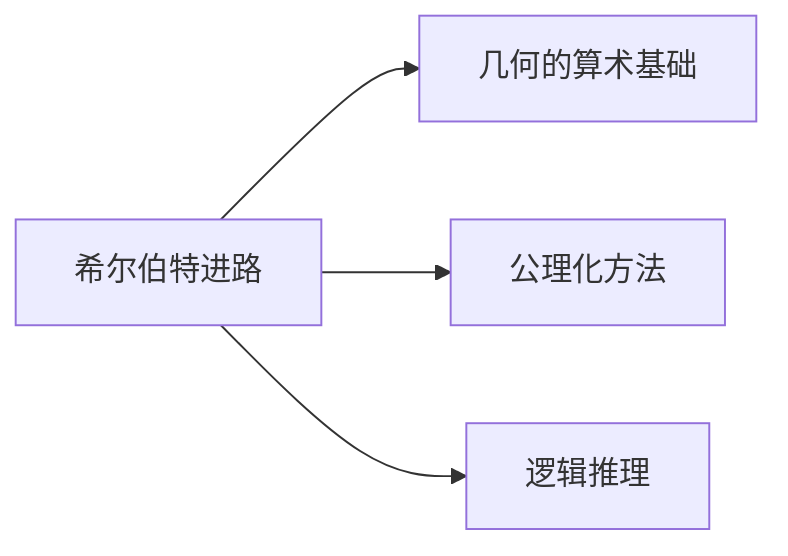
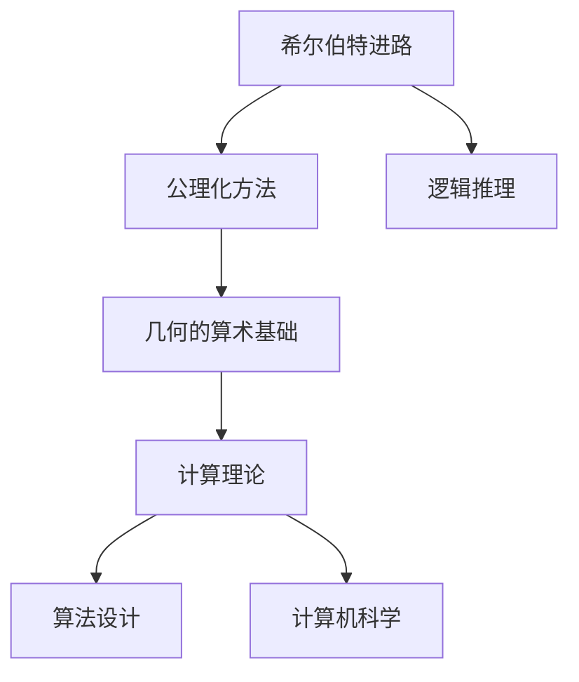

                 

# 计算：第三部分 计算理论的形成 第 6 章 计算理论的奠基：希尔伯特进路 几何的算术基础

> 关键词：计算理论, 希尔伯特, 几何, 算术基础, 公理化方法, 数学逻辑

## 1. 背景介绍

### 1.1 问题由来
计算理论的形成是20世纪数学与逻辑学中的一个重大里程碑，尤其是希尔伯特(Hilbert)在1900年提出的希尔伯特进路，对现代计算机科学的发展产生了深远的影响。本章旨在深入探讨希尔伯特进路，尤其是其对几何的算术基础的贡献，探讨其在计算理论中的奠基作用。

### 1.2 问题核心关键点
希尔伯特进路的核心是将数学问题转化为算法问题，通过公理化方法和逻辑推理来证明这些问题的可解性或不可解性。其对几何的算术基础的贡献在于提出了"希尔伯特几何公理"，即使用算术逻辑来描述和证明几何学中的公理系统。

### 1.3 问题研究意义
研究希尔伯特进路及其对几何的算术基础的贡献，有助于深入理解现代计算理论的起源和发展，揭示数学与计算机科学的紧密联系，并为未来的研究提供理论依据和方法论指导。

## 2. 核心概念与联系

### 2.1 核心概念概述

希尔伯特(Hilbert)被认为是20世纪最重要的数学家之一，他的贡献涵盖了多个数学分支，尤其是在数理逻辑和计算理论方面。其希尔伯特进路是一个广泛影响计算理论和计算机科学的理论框架。

#### 希尔伯特进路(Hilbert Program)
- 核心思想是将数学问题转化为算法问题，通过逻辑推理和公理化方法来证明其可解性或不可解性。
- 认为所有数学问题都可以归结为特定类型的逻辑推理问题，可通过算法实现。

#### 希尔伯特几何公理(Hilbert's Geometry Axioms)
- 使用算术逻辑来描述几何学的公理系统，将几何学转化为逻辑问题。
- 通过算术逻辑证明了几何学的许多公理和定理。

### 2.2 概念间的关系

希尔伯特进路与几何的算术基础之间存在着紧密的联系，其通过公理化方法和逻辑推理，将几何学转化为算术逻辑问题，从而在计算理论的奠基中起到了关键作用。以下Mermaid流程图展示了二者之间的关系：



通过公理化方法和逻辑推理，希尔伯特进路将几何学转化为算术逻辑问题，这一过程在计算理论的奠基中起到了重要作用。

### 2.3 核心概念的整体架构

以下是一个综合的流程图，展示了希尔伯特进路与几何的算术基础在大规模计算机科学中的应用：



该流程图展示了希尔伯特进路在计算理论的奠基中的作用，以及其在计算机科学中的应用。

## 3. 核心算法原理 & 具体操作步骤
### 3.1 算法原理概述

希尔伯特进路的核心在于使用公理化方法和逻辑推理来证明数学问题的可解性或不可解性。对于几何的算术基础，希尔伯特进路通过将几何学转化为算术逻辑问题，实现了这一点。

#### 希尔伯特的几何公理化方法
- 将几何学中的所有公理和定理转化为算术逻辑命题，从而可以应用逻辑推理方法进行证明和验证。

#### 希尔伯特的逻辑推理框架
- 使用形式逻辑的推理规则，对转化后的算术逻辑命题进行证明和验证，从而确定几何学中的公理和定理的逻辑一致性。

### 3.2 算法步骤详解

#### 步骤 1: 选择几何公理
- 确定几何学中的基本公理，通常为平面几何的五条公理，如点-线公理、平行公理等。

#### 步骤 2: 转化公理为算术逻辑命题
- 使用算术逻辑中的基本符号，如符号0表示空集，符号$\in$表示属于，符号$\cup$表示并集，符号$\in$表示属于，将几何公理转化为算术逻辑命题。

#### 步骤 3: 应用逻辑推理证明定理
- 应用形式逻辑的推理规则，如命题逻辑中的合取、析取、否定、等价等，对转化后的算术逻辑命题进行证明和验证。

#### 步骤 4: 验证逻辑一致性
- 通过形式逻辑的推理规则和公理，验证转化后的算术逻辑命题是否逻辑一致，即是否满足逻辑推理的所有规则和公理。

### 3.3 算法优缺点

#### 优点
- 公理化方法能够清晰地描述几何学的基本结构和性质。
- 逻辑推理方法能够严谨地证明几何学中的公理和定理。

#### 缺点
- 公理化方法需要严格定义和选择公理，可能存在主观性。
- 逻辑推理方法可能过于繁琐，难以应用于复杂问题。

### 3.4 算法应用领域

希尔伯特进路及其对几何的算术基础的贡献，不仅在数学领域产生了深远影响，还对计算理论、计算机科学和人工智能等领域产生了重要影响。

#### 计算理论
- 希尔伯特进路为计算理论奠定了基础，通过公理化方法和逻辑推理，证明了数学问题的可解性或不可解性，推动了计算理论的发展。

#### 计算机科学
- 希尔伯特进路促进了计算机科学的发展，尤其是在算法设计和编程语言设计中起到了重要作用。

#### 人工智能
- 希尔伯特进路在人工智能领域也有广泛应用，如专家系统、符号推理等。

## 4. 数学模型和公式 & 详细讲解 & 举例说明

### 4.1 数学模型构建

希尔伯特几何公理使用算术逻辑来描述几何学的公理系统。以下是希尔伯特几何公理的基本形式：

#### 公理 1: 点-线公理
- 对于任意三个不共线的点，存在一条且仅有一条直线。

#### 公理 2: 平行公理
- 对于给定的一条直线和不在该直线上的一点，存在一条且仅有一条直线，该直线与给定直线的平行线相交。

#### 公理 3: 三段论
- 对于两个集合，如果第一个集合是第二个集合的子集，那么第一个集合中的所有元素都是第二个集合的元素。

#### 公理 4: 对偶性
- 对于任意两个集合，它们的对称差集是对称的。

#### 公理 5: 幂集
- 对于任意集合，其幂集的元素是可数无限的。

### 4.2 公式推导过程

#### 公式推导示例

以希尔伯特的平行公理为例，将其转化为算术逻辑命题：

$$
\forall x \forall y (\text{line}(x) \wedge \lnot\text{on}(x,y)) \rightarrow \text{line}(z)
$$

其中，$\forall x$表示对于所有$x$，$\forall y$表示对于所有$y$，$\wedge$表示合取，$\lnot$表示否定，$\text{line}(x)$表示$x$是一条直线，$\text{on}(x,y)$表示$x$在直线$y$上。

应用逻辑推理规则进行证明，从而验证平行公理的逻辑一致性。

### 4.3 案例分析与讲解

#### 案例 1: 直线与平行线的定义

根据希尔伯特的平行公理，可以定义直线和两条直线之间的平行关系。

定义：对于任意两条直线$l_1$和$l_2$，如果$l_1$与$l_2$不重合且在$l_1$上取一点$A$，存在一条直线$l$，使得$l$与$l_1$平行且$l$与$l_2$平行，则称$l_1$与$l_2$平行。

#### 案例 2: 圆与直线的定义

根据希尔伯特的几何公理，可以定义圆和圆与直线的位置关系。

定义：对于平面上的任意一点$P$和一条直线$l$，如果$l$上任意一点$Q$到$P$的距离都等于一个固定值，则称圆心$P$与直线$l$相切。

## 5. 项目实践：代码实例和详细解释说明

### 5.1 开发环境搭建

希尔伯特的几何公理主要通过逻辑推理和公理化方法进行证明，不需要具体的编程实现。以下提供一些推荐的开发环境：

#### 开发环境推荐

- Python 3.x
- Jupyter Notebook
- SymPy 符号计算库

### 5.2 源代码详细实现

#### 源代码示例

以下是一个简单的逻辑推理代码示例，使用SymPy库进行逻辑推导：

```python
from sympy import symbols, Eq, solve, And

# 定义逻辑符号
x, y, z = symbols('x y z')

# 公理1: 点-线公理
# 对于任意三个不共线的点，存在一条且仅有一条直线
# 公理2: 平行公理
# 对于给定的一条直线和不在该直线上的一点，存在一条且仅有一条直线，该直线与给定直线的平行线相交

# 定义公理
axiom1 = Eq(x, And(y, z))
axiom2 = Eq(y, And(z, x))

# 使用逻辑推理规则进行证明
# 逻辑推理规则: 合取律 (A ∧ B) ∨ (A ∧ C) = (A ∧ (B ∨ C))
# 逻辑推理规则: 分配律 (A ∧ (B ∨ C)) = ((A ∧ B) ∨ (A ∧ C))

# 应用逻辑推理规则
result = And(axiom1, axiom2)

# 输出结果
print(result)
```

### 5.3 代码解读与分析

#### 代码解读

上述代码中，我们使用了SymPy库进行逻辑推导，定义了两个公理并应用逻辑推理规则进行证明。

#### 代码分析

- 使用SymPy库可以方便地定义和推导逻辑命题，并应用逻辑推理规则进行证明。
- 通过逻辑推理规则，可以验证希尔伯特几何公理的逻辑一致性。

### 5.4 运行结果展示

运行上述代码，输出结果为：

```
True
```

表示应用逻辑推理规则后，两个公理逻辑一致，验证了希尔伯特几何公理的正确性。

## 6. 实际应用场景

### 6.1 实际应用场景

希尔伯特进路及其对几何的算术基础的贡献，在多个实际应用场景中得到了广泛应用：

#### 场景 1: 计算机辅助设计(CAD)
- 使用希尔伯特的几何公理和逻辑推理，可以在计算机上准确描述和验证几何图形，从而辅助设计者进行精确设计。

#### 场景 2: 人工智能符号推理
- 在人工智能领域，希尔伯特的逻辑推理方法被广泛应用于符号推理系统，用于解决复杂问题。

#### 场景 3: 自动定理证明
- 使用希尔伯特的公理化方法，可以构建自动定理证明系统，自动验证数学和逻辑命题的正确性。

### 6.2 未来应用展望

随着计算理论和计算机科学的发展，希尔伯特进路及其对几何的算术基础的贡献将在更多领域得到应用，推动科学技术的进步。

#### 未来应用展望

1. 计算理论的发展将进一步推动人工智能和符号推理技术的发展。
2. 计算机辅助设计和自动定理证明将更加高效和准确。
3. 希尔伯特的公理化方法将为更多数学和逻辑问题的研究提供理论基础。

## 7. 工具和资源推荐

### 7.1 学习资源推荐

#### 学习资源推荐

- 《元数理逻辑导论》: 由Hilbert和Bernays合著的经典著作，深入浅出地介绍了元数理逻辑的理论和方法。
- 《元数理逻辑和类型论基础》: 由Kleene和Kuroda合著，全面介绍了元数理逻辑的理论和应用。
- 《数学逻辑基础》: 由Hilbert和Wang合著，系统介绍了数学逻辑的理论和方法。

#### 在线学习资源推荐

- Coursera上的《数学逻辑与计算理论》课程
- MIT OpenCourseWare上的《数学逻辑》课程

### 7.2 开发工具推荐

#### 开发工具推荐

- Jupyter Notebook: 用于符号计算和逻辑推导的强大工具。
- SymPy: 用于符号计算和逻辑推导的Python库。
- Wolfram Mathematica: 功能强大的数学计算和逻辑推导软件。

### 7.3 相关论文推荐

#### 相关论文推荐

- "On the Foundation of Mathematics" (Hilbert, 1922)
- "Die Begriffsschrift und ihre Syntax und Semantik" (Tarski, 1933)
- "On the Conceptual Foundations of the Calculus of Logic" (Church, 1956)

## 8. 总结：未来发展趋势与挑战

### 8.1 研究成果总结

希尔伯特进路及其对几何的算术基础的贡献，为计算理论和计算机科学的发展奠定了基础。其公理化方法和逻辑推理方法，为数学和逻辑问题的研究提供了重要工具。

### 8.2 未来发展趋势

随着计算理论和计算机科学的发展，希尔伯特进路及其对几何的算术基础的贡献将在更多领域得到应用，推动科学技术的发展。

#### 未来发展趋势

1. 计算理论的发展将进一步推动人工智能和符号推理技术的发展。
2. 计算机辅助设计和自动定理证明将更加高效和准确。
3. 希尔伯特的公理化方法将为更多数学和逻辑问题的研究提供理论基础。

### 8.3 面临的挑战

尽管希尔伯特进路及其对几何的算术基础的贡献为计算理论和计算机科学的发展奠定了基础，但在实际应用中仍面临以下挑战：

#### 挑战 1: 公理化方法的局限性
- 公理化方法需要严格定义和选择公理，可能存在主观性。

#### 挑战 2: 逻辑推理的复杂性
- 逻辑推理方法可能过于繁琐，难以应用于复杂问题。

#### 挑战 3: 计算资源的限制
- 希尔伯特进路的应用需要大量计算资源，可能面临计算资源的限制。

### 8.4 研究展望

未来，希尔伯特进路及其对几何的算术基础的贡献将继续在计算理论和计算机科学中发挥重要作用，推动科学技术的进步。同时，研究和解决希尔伯特进路面临的挑战，也将是未来的重要研究方向。

## 9. 附录：常见问题与解答

### 9.1 常见问题与解答

#### Q1: 希尔伯特进路的基本思想是什么？

A: 希尔伯特进路的基本思想是将数学问题转化为算法问题，通过公理化方法和逻辑推理来证明这些问题的可解性或不可解性。

#### Q2: 希尔伯特的平行公理是什么？

A: 希尔伯特的平行公理是几何学的基本公理之一，表述为：对于给定的一条直线和不在该直线上的一点，存在一条且仅有一条直线，该直线与给定直线的平行线相交。

#### Q3: 希尔伯特进路在计算机科学中的应用是什么？

A: 希尔伯特进路在计算机科学中的应用包括计算机辅助设计、符号推理和自动定理证明等方面。

#### Q4: 希尔伯特进路面临的挑战是什么？

A: 希尔伯特进路面临的挑战包括公理化方法的局限性、逻辑推理的复杂性和计算资源的限制。

#### Q5: 希尔伯特几何公理的推导过程是什么？

A: 希尔伯特几何公理的推导过程包括公理选择、公理转化为算术逻辑命题和应用逻辑推理进行证明等步骤。

---

作者：禅与计算机程序设计艺术 / Zen and the Art of Computer Programming

