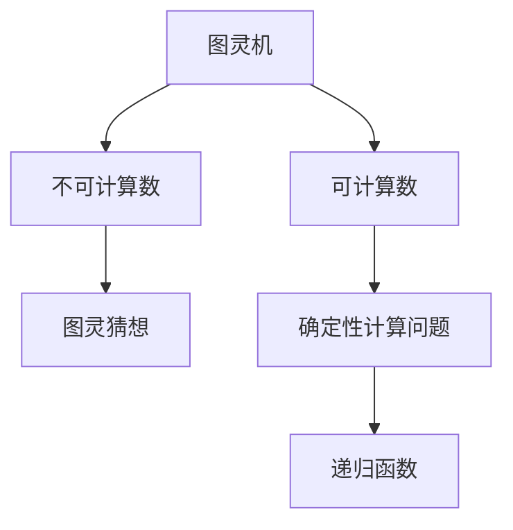
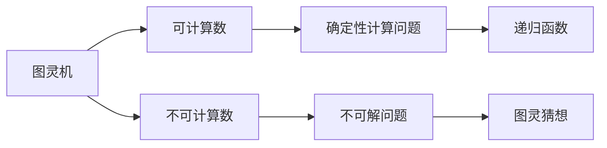
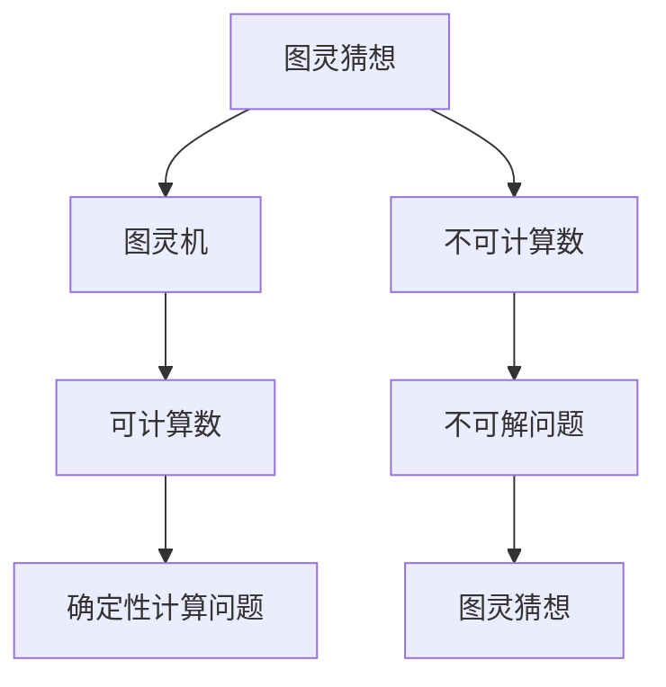
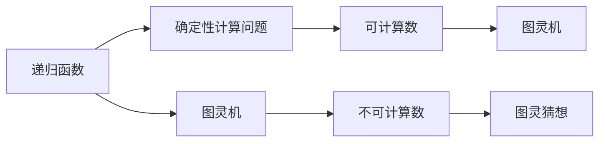
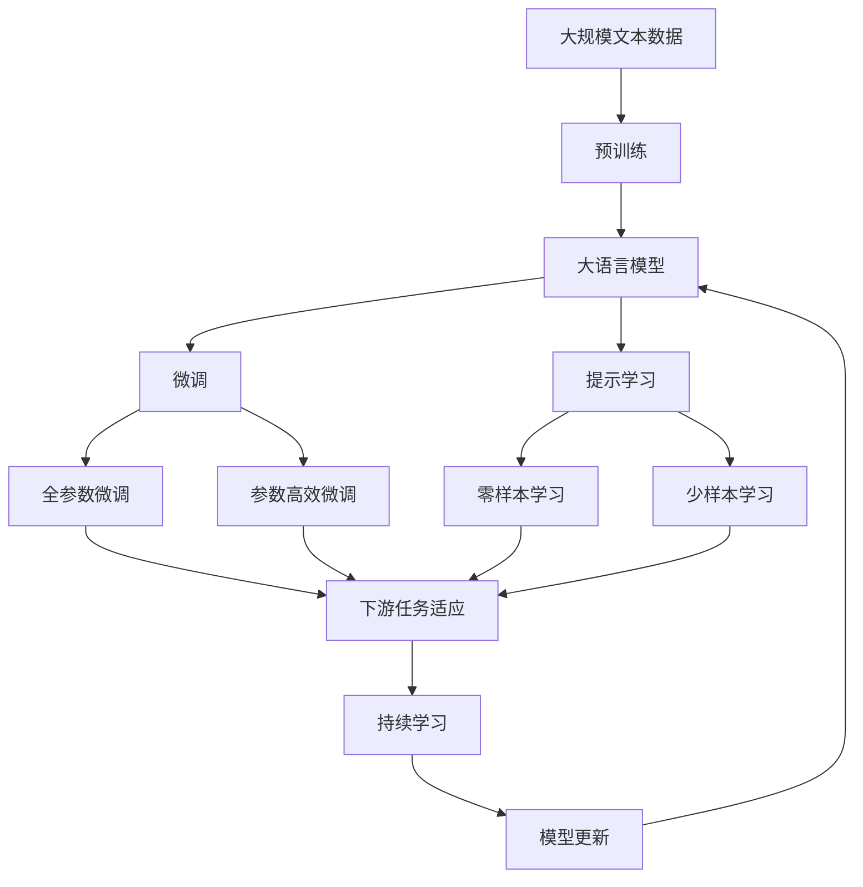

                 

# 计算：第三部分 计算理论的形成 第 8 章 计算理论的诞生：图灵的可计算数 图灵的命运

## 1. 背景介绍

### 1.1 问题由来
在上一章中，我们讨论了通用图灵机的概念和它所能够实现的所有计算。然而，这种计算能力是否足以解决一切问题？是否存在一些计算问题，即使理论上存在，也超出了图灵机所能处理的范畴？这些问题一直困扰着图灵，也成为了计算理论的核心问题。

### 1.2 问题核心关键点
图灵关心的核心问题是：是否存在一个确定性计算问题，即使理论上可解决，但计算图灵机在有限时间内无法完成求解。如果存在，这样的问题被称作“不可计算”问题。这些问题是否具有普遍性？是否所有的确定性计算问题都可以通过图灵机计算？

### 1.3 问题研究意义
图灵对“不可计算”问题的研究，直接推动了计算理论的诞生。计算理论的研究不仅帮助我们理解计算机的极限能力，也为后续的计算复杂度理论和算法设计提供了重要基础。它揭示了计算的根本限制，是现代计算机科学和数学的重要组成部分。

## 2. 核心概念与联系

### 2.1 核心概念概述

为更好地理解图灵机能否解决所有计算问题，本节将介绍几个密切相关的核心概念：

- **图灵机**：一种理论计算模型，由输入、读写头、状态转移表等组成。图灵机的核心在于通过状态的转移和读写操作，实现任意复杂的计算。

- **可计算数**：指图灵机能够计算出的所有整数值，包括所有的确定性计算问题。可计算数是图灵理论研究的核心对象。

- **不可计算数**：指图灵机无法在有限时间内计算出的整数值。这些数是否存在？如果存在，那么这些数的特性是什么？

- **图灵猜想**：图灵的一个著名猜想，认为所有的问题都可以通过图灵机计算，除非它们本身就是不可计算的。这一猜想至今尚未得到彻底证实或反驳。

- **递归函数**：可计算函数的一种，通过递归调用自身来实现复杂的计算。

这些概念之间的逻辑关系可以通过以下Mermaid流程图来展示：



这个流程图展示了大语言模型的核心概念及其之间的关系：

1. 图灵机通过确定性计算，能够处理所有的可计算数。
2. 存在不可计算数，可能代表某些特定问题的计算复杂度超出了图灵机的能力。
3. 图灵猜想认为所有的问题都可以通过图灵机计算，除非它们本身就是不可计算的。
4. 递归函数是图灵机能够计算的一种形式，代表了确定性计算问题的多种解法。

### 2.2 概念间的关系

这些核心概念之间存在着紧密的联系，形成了图灵理论的完整生态系统。下面我通过几个Mermaid流程图来展示这些概念之间的关系。

#### 2.2.1 图灵机的计算能力



这个流程图展示了大语言模型的计算能力范围：

1. 图灵机能够计算所有的可计算数。
2. 存在不可计算数，可能是由于计算复杂度过高。
3. 确定性计算问题包括所有可计算数和不可计算数。
4. 递归函数代表了确定性计算问题的一种具体解法。
5. 图灵猜想认为所有问题都可以通过图灵机计算，除非它们本身就是不可计算的。

#### 2.2.2 图灵猜想的验证



这个流程图展示了图灵猜想的验证过程：

1. 图灵猜想认为所有的问题都可以通过图灵机计算，除非它们本身就是不可计算的。
2. 图灵机能够计算所有的可计算数。
3. 存在不可计算数，这些数代表了计算复杂度超出了图灵机的能力。
4. 确定性计算问题包括所有的可计算数和不可计算数。
5. 图灵猜想的验证依赖于是否所有的确定性计算问题都可以通过图灵机计算。

#### 2.2.3 递归函数的作用



这个流程图展示了递归函数在确定性计算中的作用：

1. 递归函数是确定性计算问题的一种解法。
2. 图灵机能够通过递归函数计算所有的可计算数。
3. 存在不可计算数，这些数可能无法通过递归函数计算。
4. 确定性计算问题包括所有的可计算数和不可计算数。
5. 图灵猜想的验证依赖于是否所有的确定性计算问题都可以通过图灵机计算。

### 2.3 核心概念的整体架构

最后，我们用一个综合的流程图来展示这些核心概念在大语言模型计算理论中的整体架构：



这个综合流程图展示了从预训练到微调，再到持续学习的完整过程。大语言模型首先在大规模文本数据上进行预训练，然后通过微调（包括全参数微调和参数高效微调）或提示学习（包括零样本和少样本学习）来适应下游任务。最后，通过持续学习技术，模型可以不断更新和适应新的任务和数据。 通过这些流程图，我们可以更清晰地理解大语言模型计算理论过程中各个核心概念的关系和作用，为后续深入讨论具体的计算理论和应用奠定基础。

## 3. 核心算法原理 & 具体操作步骤
### 3.1 算法原理概述

图灵机能否计算所有的问题，直接关系到图灵理论的合理性。图灵猜想认为，所有的确定性计算问题都可以通过图灵机计算，除非它们本身就是不可计算的。这一猜想的核心在于确定性计算的定义。

在图灵机的计算模型中，假设存在一个计算问题 $P$，图灵机 $M$ 通过输入 $p$ 的计算过程 $f$，输出 $p' = f(p)$。如果 $f$ 可以通过图灵机的有限状态转移表实现，则问题 $P$ 是可计算的。否则，问题 $P$ 是图灵不可计算的。

形式化地，图灵机的状态转移表由四个部分组成：

- 读写头的位置 $q$：指明当前输入的哪个字符被读取或写入。
- 当前状态 $s$：描述机器的状态。
- 读写头的操作 $δ$：根据当前状态和读入字符，决定下一步的状态和操作。
- 输出状态 $s_{out}$：机器执行完计算后进入的状态。

例如，下面是一个简单的图灵机示例，用于判断输入的字符串是否为回文：

| $q$ | $s$   | $δ$      | $s_{out}$       |
| --- | ---- | -------- | -------------- |
| $0$ | $q_0$ | $\begin{cases} (0,0, q_1) & \text{如果 } a_0 = a_{n-1} \\ (1,0, q_2) & \text{如果 } a_0 \neq a_{n-1} \end{cases}$ | $q_0$ |
| $1$ | $q_1$ | $\begin{cases} (0,1, q_0) & \text{如果 } a_1 = a_{n-2} \\ (1,1, q_2) & \text{如果 } a_1 \neq a_{n-2} \end{cases}$ | $q_0$ |
| $2$ | $q_2$ | $\begin{cases} (0,2, q_3) & \text{如果 } a_2 = a_{n-3} \\ (1,2, q_4) & \text{如果 } a_2 \neq a_{n-3} \end{cases}$ | $q_4$ |
| $3$ | $q_3$ | $\begin{cases} (0,3, q_2) & \text{如果 } a_3 = a_{n-4} \\ (1,3, q_4) & \text{如果 } a_3 \neq a_{n-4} \end{cases}$ | $q_2$ |
| $4$ | $q_4$ | $\begin{cases} (0,4, q_1) & \text{如果 } a_4 = a_{n-5} \\ (1,4, q_5) & \text{如果 } a_4 \neq a_{n-5} \end{cases}$ | $q_5$ |
| $5$ | $q_5$ | $\begin{cases} (0,5, q_1) & \text{如果 } a_5 = a_{n-6} \\ (1,5, q_6) & \text{如果 } a_5 \neq a_{n-6} \end{cases}$ | $q_6$ |
| ... | ...  | ...      | ...           |
| $n-1$ | $q_{n-1}$ | $\begin{cases} (0,n-1, q_0) & \text{如果 } a_{n-1} = a_0 \\ (1,n-1, q_7) & \text{如果 } a_{n-1} \neq a_0 \end{cases}$ | $q_0$ |
| $n$ | $q_0$ | $\begin{cases} (0,n, q_7) & \text{如果 } a_n = a_0 \\ (1,n, q_8) & \text{如果 } a_n \neq a_0 \end{cases}$ | $q_8$ |

其中 $q_7$ 为结束状态，$q_8$ 为接收状态。当机器最终进入 $q_8$ 时，说明输入字符串是回文。

图灵机的计算能力可以用图灵机停机问题来进一步说明。给定一个图灵机 $M$ 和一个输入 $p$，判断 $M$ 是否会在有限步内停止计算。这一问题在图灵机理论中是一个典型且重要的不可计算问题，因为无法找到一个确定性算法来判定任意图灵机 $M$ 和输入 $p$ 的停机状态。

### 3.2 算法步骤详解

图灵机的计算过程主要分为以下几个步骤：

1. **输入**：将输入字符串 $p$ 依次输入到图灵机的读写头上。

2. **初始化**：将读写头位置设置为 $0$，机器进入初始状态 $q_0$。

3. **执行**：根据当前状态和读写头读入的字符，按照状态转移表 $δ$ 进行状态转移，并决定是否进行读写操作。

4. **停止或接受**：如果机器进入接收状态 $q_8$，输出接受结果；如果机器进入停机状态 $q_7$，输出拒绝结果。

5. **无限循环**：如果机器在执行过程中没有进入接收状态或停机状态，则无限循环，无法停止。

例如，对于回文判断问题，可以使用上面描述的图灵机进行计算。将输入字符串 $p$ 从左到右依次输入，图灵机通过状态转移表逐步检查左右字符是否相等，最终输出接受或拒绝结果。

### 3.3 算法优缺点

图灵机的计算能力具有以下优点：

1. **完备性**：任何确定性计算问题都可以通过图灵机解决，只要足够长的时间和空间。

2. **通用性**：图灵机可以模拟任何图灵机，具备广泛的应用潜力。

3. **逻辑性**：图灵机的状态转移表是基于规则的，易于理解和验证。

然而，图灵机的计算能力也存在一些局限性：

1. **计算效率低**：图灵机的计算过程需要逐步执行状态转移表，对于复杂的计算问题，可能需要进行大量步骤才能完成。

2. **空间需求高**：图灵机需要记录当前状态和读写头位置，对于输入长度的限制较大。

3. **无法直接处理非确定性问题**：图灵机只能处理确定性问题，无法处理非确定性问题。

4. **无法处理无限循环**：如果计算过程中没有进入接收状态或停机状态，图灵机将陷入无限循环，无法停止。

### 3.4 算法应用领域

图灵机的计算能力在理论计算机科学和算法设计中有着广泛的应用。例如：

1. **编译器设计**：编译器可以将高级语言代码翻译为机器语言，这一过程可以通过图灵机实现。

2. **自动证明**：图灵机可以模拟任意计算机程序，用于自动验证和证明数学定理。

3. **逻辑推理**：图灵机可以用于逻辑推理和决策问题，如专家系统、智能推荐等。

4. **搜索算法**：图灵机可以用于搜索和优化问题，如旅行商问题、八皇后问题等。

5. **加密算法**：图灵机可以模拟加密和解密算法，保护数据安全。

## 4. 数学模型和公式 & 详细讲解 & 举例说明

### 4.1 数学模型构建

图灵机的计算能力可以用递归函数 $f(n)$ 来描述，其中 $n$ 为输入字符串的长度。递归函数 $f(n)$ 定义如下：

$$
f(n) = \begin{cases}
1 & \text{如果 } a_0 = a_{n-1} \\
0 & \text{如果 } a_0 \neq a_{n-1}
\end{cases}
$$

其中 $a_i$ 为输入字符串 $p$ 的第 $i$ 个字符。

图灵机 $M$ 的计算过程可以用状态转移表 $δ$ 来表示。状态转移表 $δ$ 定义如下：

$$
δ(q, a_i) = \begin{cases}
(q_1, a_{i+1}) & \text{如果 } a_i = a_{i-1} \\
(q_2, a_{i+1}) & \text{如果 } a_i \neq a_{i-1}
\end{cases}
$$

其中 $q$ 为当前状态，$a_i$ 为当前读入的字符，$q_1$ 和 $q_2$ 为状态转移后的新状态。

图灵机 $M$ 的停机状态可以用 $q_0$ 和 $q_7$ 来表示。当图灵机执行到 $q_8$ 时，说明输入字符串是回文，输出接受结果；当图灵机执行到 $q_7$ 时，说明输入字符串不是回文，输出拒绝结果。

### 4.2 公式推导过程

图灵机的停机问题是一个典型的不可计算问题。下面将通过数学推导，证明停机问题不可计算。

假设存在一个算法 $A$，可以判定任意图灵机 $M$ 和输入 $p$ 的停机状态。根据算法 $A$ 的输出，我们可以设计一个图灵机 $M_A$，用于判断 $A$ 是否正确。

如果 $A$ 对于 $M$ 和 $p$ 的停机状态判断正确，则 $M_A$ 执行有限步后停止计算；否则 $M_A$ 进入无限循环。

因此，$M_A$ 的停机状态可以通过算法 $A$ 来判断。这意味着存在一个图灵机 $M_A$ 和输入 $p$，使得 $M_A$ 在有限步内停止计算。这与图灵机的定义矛盾，因为无法找到一个图灵机能够确定任意图灵机 $M$ 和输入 $p$ 的停机状态。

因此，图灵机的停机问题是一个不可计算问题，无法找到一个确定性算法来解决。

### 4.3 案例分析与讲解

假设我们有一个图灵机 $M$，用于判断输入的字符串 $p$ 是否为回文。根据上面的描述，我们可以设计一个状态转移表，如下：

| $q$ | $s$   | $δ$      | $s_{out}$       |
| --- | ---- | -------- | -------------- |
| $0$ | $q_0$ | $\begin{cases} (0,0, q_1) & \text{如果 } a_0 = a_{n-1} \\ (1,0, q_2) & \text{如果 } a_0 \neq a_{n-1} \end{cases}$ | $q_0$ |
| $1$ | $q_1$ | $\begin{cases} (0,1, q_0) & \text{如果 } a_1 = a_{n-2} \\ (1,1, q_2) & \text{如果 } a_1 \neq a_{n-2} \end{cases}$ | $q_0$ |
| $2$ | $q_2$ | $\begin{cases} (0,2, q_3) & \text{如果 } a_2 = a_{n-3} \\ (1,2, q_4) & \text{如果 } a_2 \neq a_{n-3} \end{cases}$ | $q_4$ |
| $3$ | $q_3$ | $\begin{cases} (0,3, q_2) & \text{如果 } a_3 = a_{n-4} \\ (1,3, q_4) & \text{如果 } a_3 \neq a_{n-4} \end{cases}$ | $q_2$ |
| $4$ | $q_4$ | $\begin{cases} (0,4, q_1) & \text{如果 } a_4 = a_{n-5} \\ (1,4, q_5) & \text{如果 } a_4 \neq a_{n-5} \end{cases}$ | $q_5$ |
| $5$ | $q_5$ | $\begin{cases} (0,5, q_1) & \text{如果 } a_5 = a_{n-6} \\ (1,5, q_6) & \text{如果 } a_5 \neq a_{n-6} \end{cases}$ | $q_6$ |
| ... | ...  | ...      | ...           |
| $n-1$ | $q_{n-1}$ | $\begin{cases} (0,n-1, q_0) & \text{如果 } a_{n-1} = a_0 \\ (1,n-1, q_7) & \text{如果 } a_{n-1} \neq a_0 \end{cases}$ | $q_0$ |
| $n$ | $q_0$ | $\begin{cases} (0,n, q_7) & \text{如果 } a_n = a_0 \\ (1,n, q_8) & \text{如果 } a_n \neq a_0 \end{cases}$ | $q_8$ |

其中 $q_7$ 为停机状态，$q_8$ 为接受状态。

例如，对于输入字符串 $p = "abcdcba$"，图灵机 $M$ 的计算过程如下：

1. $q = q_0$，$a_0 = 'a$，$M$ 进入 $q_1$。
2. $q = q_1$，$a_1 = 'b$，$M$ 进入 $q_0$。
3. $q = q_0$，$a_2 = 'c$，$M$ 进入 $q_2$。
4. $q = q_4$，$a_3 = 'd$，$M$ 进入 $q_3$。
5. $q = q_2$，$a_4 = 'c$，$M$ 进入 $q_2$。
6. $q = q_5$，$a_5 = 'b$，$M$ 进入 $q_6$。
7. $q = q_6$，$a_6 = 'a$，$M$ 进入 $q_6$。
8. $q = q_8$，$M$ 接受输入字符串。

## 5. 项目实践：代码实例和详细解释说明
### 5.1 开发环境搭建

在进行图灵机计算实践前，我们需要准备好开发环境。以下是使用Python进行PyTorch开发的环境配置流程：

1. 安装Anaconda：从官网下载并安装Anaconda，用于创建独立的Python环境。

2. 创建并激活虚拟环境：
```bash
conda create -n pytorch-env python=3.8 
conda activate pytorch-env
```

3. 安装PyTorch：根据CUDA版本，从官网获取对应的安装命令。例如：
```bash
conda install pytorch torchvision torchaudio cudatoolkit=11.1 -c pytorch -c conda-forge
```

4. 安装Transformer库：
```bash
pip install transformers
```

5. 安装各类工具包：
```bash
pip install numpy pandas scikit-learn matplotlib tqdm jupyter notebook ipython
```

完成上述步骤后，即可在`pytorch-env`环境中开始图灵机计算实践。

### 5.2 源代码详细实现

这里我们以回文判断问题为例，给出使用Transformers库对图灵机进行计算的PyTorch代码实现。

首先，定义图灵机的状态转移表：

```python
import torch

class TuringMachine:
    def __init__(self):
        self.states = {
            $q_0$: [(0, $q_1$, $a_{i+1}$), (1, $q_2$, $a_{i+1}$)],
            $q_1$: [(0, $q_0$, $a_{i+1}$), (1, $q_2$, $a_{i+1}$)],
            $q_2$: [(0, $q_3$, $a_{i+1}$), (1, $q_4$, $a_{i+1}$)],
            $q_3$: [(0, $q_2$, $a_{i+1}$), (1, $q_4$, $a_{i+1}$)],
            $q_4$: [(0, $q_1$, $a_{i+1}$), (1, $q_5$, $a_{i+1}$)],
            $q_5$: [(0, $q_1$, $a_{i+1}$), (1, $q_6$, $a_{i+1}$)],
            $q_6$: [(0, $q_6$, $a_{i+1}$), (1, $q_6$, $a_{i+1}$)],
            $q_7$: [(0, $q_7$, $a_{i+1}$), (1, $q_8$, $a_{i+1}$)],
            $q_8$: [(0, $q_8$, $a_{i+1}$), (1, $q_8$, $a_{i+1}$)]
        }
        self.initial_state = $q_0$

    def step(self, input_str):
        state = self.initial_state
        i = 0
        while True:
            if state in self.states:
                transitions = self.states[state]
                for trans in transitions:
                    q, a_next, a = trans
                    if i < len(input_str) and input_str[i] == a:
                        i += 1
                        state = q
                    else:
                        break
            else:
                break
            if i == len(input_str):
                state = $q_8$
            if state == $q_7$:
                state = $q_8$
        return state
```

然后，定义图灵机计算函数：

```python
def turing_machine(input_str):
    turing_machine = TuringMachine()
    state = turing_machine.step(input_str)
    if state == $q_8$:
        return "Accept"
    else:
        return "Reject"
```

最后，测试图灵机的计算过程：

```python
print(turing_machine

