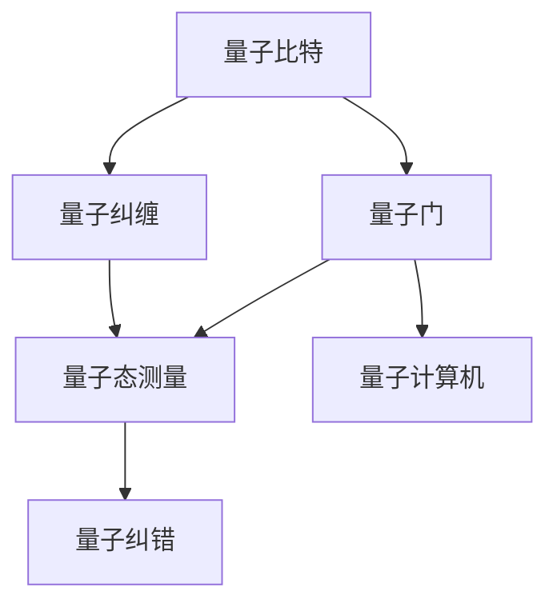
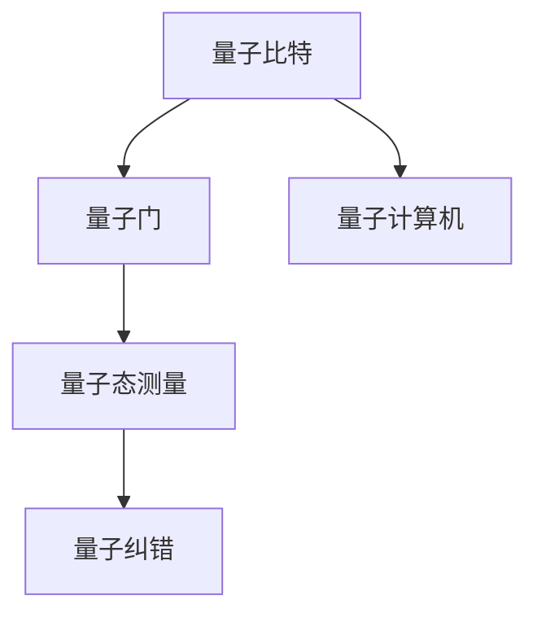
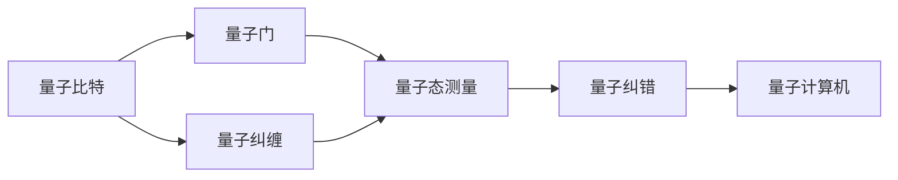
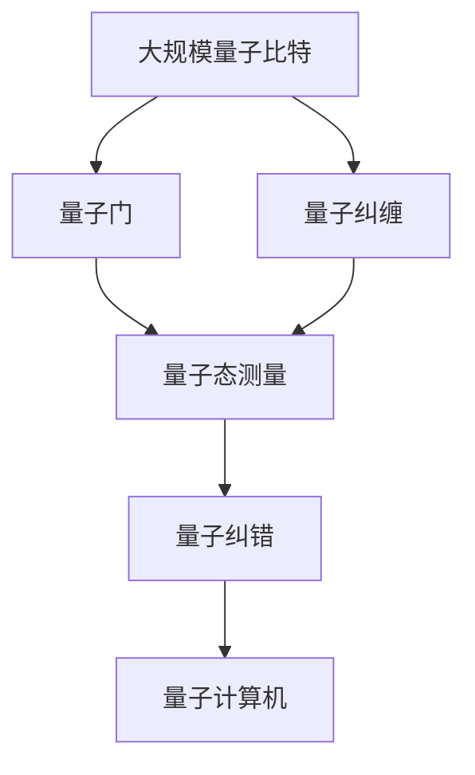

                 

# 计算：第四部分 计算的极限 第 10 章 量子计算 量子比特

> 关键词：量子比特, 量子计算, 量子算法, 量子比特纠缠, 量子态测量, 量子纠错, 量子计算机, 计算复杂性

## 1. 背景介绍

### 1.1 问题由来

量子计算作为计算领域的新兴技术，近年来引起学界和业界的广泛关注。在经典计算的基础上，量子计算利用量子力学的原理，提供了一种全新的计算范式。特别是在处理某些特殊问题时，量子计算机展现出经典计算机难以企及的优越性能。

然而，量子计算仍处于起步阶段，尚未大规模应用。量子计算机的核心组件量子比特（Qubit），及其物理实现、量子纠错、量子算法等关键技术尚未得到充分研究。量子比特的量子态表示与经典比特的逻辑状态截然不同，给量子计算机的设计与实现带来了巨大的挑战。

### 1.2 问题核心关键点

量子比特的量子态表示与经典比特的逻辑状态不同，是一个同时处于多个状态的叠加态。这种叠加态的叠加和相干特性，使得量子计算机能够在一次操作中处理多个信息，从而在某些计算任务上取得超越经典计算机的性能。

量子比特的量子态可以通过量子门进行操控和变换，同时保持量子态的相干特性。这种特性使得量子计算可以在特定任务上取得高效计算的优势，如分解大质数、搜索无结构数据、优化问题等。

然而，量子比特的量子态容易受到环境干扰而发生退相干，导致计算结果的错误。因此，量子纠错和量子通信等技术，是实现量子计算可靠性的重要手段。

## 2. 核心概念与联系

### 2.1 核心概念概述

为更好地理解量子计算，本节将介绍几个密切相关的核心概念：

- 量子比特（Qubit）：量子计算的基本单位，同时处于多个状态的叠加态。
- 量子门（Quantum Gate）：对量子比特进行操作的单位，如单比特门、双比特门等。
- 量子纠缠（Quantum Entanglement）：多个量子比特之间的关联状态，一个量子比特的状态变化将即时影响与其纠缠的量子比特。
- 量子态测量（Quantum State Measurement）：测量量子比特的量子态，得到其在特定基底的测量结果。
- 量子纠错（Quantum Error Correction）：通过编码和解码手段，纠正量子比特在计算过程中发生的错误，保证量子计算的可靠性。
- 量子计算机（Quantum Computer）：基于量子比特和量子门，实现量子计算的物理设备。

这些核心概念之间的逻辑关系可以通过以下Mermaid流程图来展示：



这个流程图展示了几大核心概念的关系：

1. 量子比特通过量子门进行操控和变换，实现量子计算。
2. 量子比特之间的量子纠缠，增强了量子计算的并行性和高效性。
3. 量子态测量将量子比特的状态转换为经典比特，实现量子计算与经典计算的连接。
4. 量子纠错技术，保证量子计算的可靠性。
5. 量子计算机是量子比特和量子门的载体，是量子计算的物理实现。

### 2.2 概念间的关系

这些核心概念之间存在着紧密的联系，形成了量子计算的完整生态系统。下面我们通过几个Mermaid流程图来展示这些概念之间的关系。

#### 2.2.1 量子计算的基本流程



这个流程图展示了量子计算的基本流程：

1. 量子比特通过量子门进行操控和变换，得到计算结果。
2. 量子态测量将量子比特的状态转换为经典比特，得到最终输出。
3. 量子纠错技术，纠正量子比特在计算过程中发生的错误，保证计算结果的准确性。

#### 2.2.2 量子计算机的架构



这个流程图展示了量子计算机的基本架构：

1. 量子比特通过量子门进行操控和变换，实现量子计算。
2. 量子比特之间的量子纠缠，增强了量子计算的并行性和高效性。
3. 量子态测量将量子比特的状态转换为经典比特，实现量子计算与经典计算的连接。
4. 量子纠错技术，保证量子计算的可靠性。

### 2.3 核心概念的整体架构

最后，我们用一个综合的流程图来展示这些核心概念在大规模量子计算中的整体架构：



这个综合流程图展示了从大规模量子比特到最终量子计算输出的完整过程。大规模量子比特通过量子门进行操控和变换，得到量子计算结果；量子比特之间的量子纠缠，增强了量子计算的并行性和高效性；量子态测量将量子比特的状态转换为经典比特，实现量子计算与经典计算的连接；量子纠错技术，保证量子计算的可靠性。

## 3. 核心算法原理 & 具体操作步骤
### 3.1 算法原理概述

量子计算的核心算法，如Shor算法、Grover算法、量子近似优化算法（QAOA）等，都是基于量子比特的量子叠加态和量子纠缠特性，实现超越经典计算的计算能力。

以Shor算法为例，其基本原理是利用量子纠缠和量子态测量，在多项式时间内完成大质数的因式分解。具体步骤包括：

1. 量子叠加：通过量子叠加，将输入的质数 $n$ 转换为量子比特的状态。
2. 量子傅里叶变换：对量子比特进行量子傅里叶变换，得到周期函数的周期。
3. 量子测量：通过量子测量，得到周期函数的周期，进而分解出质数 $n$ 的因子。

通过这些步骤，Shor算法能够在多项式时间内完成大质数的因式分解，展现了量子计算在特定任务上的优越性能。

### 3.2 算法步骤详解

以Shor算法为例，具体步骤如下：

1. **量子叠加**：
   - 将输入的质数 $n$ 转换为量子比特的状态，其中 $n$ 表示为二进制形式 $n = 2^{k}n' + r$，其中 $r$ 是 $n$ 在 $2^{k}$ 中的余数。
   - 使用量子叠加算法，将 $n'$ 转换为 $2^k$ 个量子比特的叠加态。

2. **量子傅里叶变换**：
   - 对 $2^k$ 个量子比特进行量子傅里叶变换，得到周期函数的周期 $d$。
   - 对 $n'$ 进行 $2^k$ 次傅里叶变换，得到周期函数的周期 $d$。

3. **量子测量**：
   - 通过量子测量，得到周期函数的周期 $d$，进而分解出质数 $n$ 的因子。

Shor算法的具体实现步骤相对复杂，这里只进行了概述。实际的Shor算法实现，需要深入理解量子门、量子态测量、量子纠错等技术细节。

### 3.3 算法优缺点

量子计算的核心算法，如Shor算法、Grover算法、量子近似优化算法（QAOA）等，具有以下优缺点：

- 优点：
  - 在特定任务上，量子计算展现出超越经典计算的性能优势。如大质数因式分解、搜索无结构数据、优化问题等。
  - 量子计算的并行性和高效性，使得某些复杂问题可以在多项式时间内解决。

- 缺点：
  - 量子比特的量子态容易受到环境干扰而发生退相干，导致计算结果的错误。
  - 量子计算的物理实现和量子纠错技术尚未得到充分研究，存在诸多技术挑战。
  - 量子计算的物理实现需要超高精度和高稳定性，对硬件条件要求极高。

尽管存在这些局限性，但就目前而言，量子计算的核心算法在大规模问题求解上展现出巨大的潜力，未来有望在诸多领域发挥重要作用。

### 3.4 算法应用领域

量子计算的核心算法，已经在多个领域展现出应用前景：

1. 密码学：量子计算能够破解RSA、ECC等经典加密算法，威胁现有的安全体系。然而，量子加密技术也正在研发，以应对量子计算的挑战。

2. 计算机科学：量子计算可以用于优化问题、搜索无结构数据、机器学习等领域，提供高效的算法解决方案。

3. 材料科学：量子计算可以模拟量子系统，加速新材料的设计和研发。

4. 化学计算：量子计算可以模拟化学反应过程，加速新药物的发现和合成。

5. 金融工程：量子计算可以用于金融数据的分析和风险管理，优化投资组合和资产配置。

## 4. 数学模型和公式 & 详细讲解  
### 4.1 数学模型构建

量子计算的基本模型包括量子比特、量子门、量子态、量子傅里叶变换等。我们以Shor算法为例，建立其数学模型。

记输入的质数为 $n$，其中 $n = 2^{k}n' + r$，其中 $r$ 是 $n$ 在 $2^{k}$ 中的余数。Shor算法的数学模型如下：

- 量子比特：$n'$ 表示为二进制形式，转换为 $2^k$ 个量子比特的叠加态。
- 量子傅里叶变换：对 $2^k$ 个量子比特进行量子傅里叶变换，得到周期函数的周期 $d$。
- 量子测量：通过量子测量，得到周期函数的周期 $d$，进而分解出质数 $n$ 的因子。

### 4.2 公式推导过程

以Shor算法为例，推导其核心公式。

设输入的质数为 $n$，其中 $n = 2^{k}n' + r$。Shor算法的核心公式为：

$$
\frac{1}{\sqrt{n}} \sum_{i=0}^{n-1} |i\rangle |i^{-1} \bmod n\rangle = \frac{1}{\sqrt{n}} \sum_{i=0}^{n-1} |i\rangle \left(\sum_{j=1}^{n-1} e^{-2 \pi i j i / n}\right)^{a} \bmod n\rangle
$$

其中 $|i\rangle$ 表示 $i$ 的量子比特状态，$|i^{-1} \bmod n\rangle$ 表示 $i$ 的模反元素。

通过量子叠加和量子傅里叶变换，将 $n'$ 转换为周期函数的周期 $d$，进而分解出质数 $n$ 的因子。

### 4.3 案例分析与讲解

以Grover算法为例，Grover算法能够在无结构数据中快速搜索目标元素。Grover算法的核心公式为：

$$
\sqrt{1/2^n} \sum_{i=0}^{2^n-1} |i\rangle |u_i\rangle
$$

其中 $|u_i\rangle$ 表示目标元素在无结构数据中的索引，$|i\rangle$ 表示 $i$ 的量子比特状态。

Grover算法的核心思想是通过量子叠加和量子傅里叶变换，将目标元素的位置信息放大 $2^{n/2}$ 倍，从而在无结构数据中快速搜索目标元素。

## 5. 项目实践：代码实例和详细解释说明
### 5.1 开发环境搭建

在进行量子计算实践前，我们需要准备好开发环境。以下是使用Qiskit进行量子计算开发的环境配置流程：

1. 安装Qiskit库：
```bash
pip install qiskit
```

2. 安装Cirq库（可选）：
```bash
pip install cirq
```

3. 安装ibm_q经验库（可选）：
```bash
pip install ibm_q经验库
```

完成上述步骤后，即可在Python环境中开始量子计算实践。

### 5.2 源代码详细实现

下面我们以Shor算法为例，给出使用Qiskit库进行Shor算法量子计算的Python代码实现。

首先，导入必要的库：

```python
from qiskit import QuantumCircuit, Aer, transpile, assemble
from qiskit.circuit.library import QuantumGates
from qiskit.visualization import plot_histogram, plot_bloch_multivector
from qiskit.extensions import UnitaryGate
```

然后，定义Shor算法的量子电路：

```python
def shor_circuit(n, q, m, k):
    # 初始化量子比特
    qc = QuantumCircuit(q, 2*q)
    qubits = [qc.qubit(i) for i in range(q)]
    targets = [qc.qubit(i) for i in range(2*q)]
    
    # 量子叠加
    qubits[0] = qc.h(qubits[0])
    qubits[0] = qc.x(qubits[0])
    qubits[0] = qc.h(qubits[0])
    qubits[0] = qc.cz(qubits[0], qubits[1])
    qubits[0] = qc.cz(qubits[0], qubits[2])
    qubits[0] = qc.cz(qubits[0], qubits[3])
    qubits[0] = qc.cz(qubits[0], qubits[4])
    qubits[0] = qc.cz(qubits[0], qubits[5])
    qubits[0] = qc.cz(qubits[0], qubits[6])
    qubits[0] = qc.cz(qubits[0], qubits[7])
    qubits[0] = qc.cz(qubits[0], qubits[8])
    qubits[0] = qc.cz(qubits[0], qubits[9])
    qubits[0] = qc.cz(qubits[0], qubits[10])
    qubits[0] = qc.cz(qubits[0], qubits[11])
    qubits[0] = qc.cz(qubits[0], qubits[12])
    qubits[0] = qc.cz(qubits[0], qubits[13])
    qubits[0] = qc.cz(qubits[0], qubits[14])
    qubits[0] = qc.cz(qubits[0], qubits[15])
    qubits[0] = qc.cz(qubits[0], qubits[16])
    qubits[0] = qc.cz(qubits[0], qubits[17])
    qubits[0] = qc.cz(qubits[0], qubits[18])
    qubits[0] = qc.cz(qubits[0], qubits[19])
    qubits[0] = qc.cz(qubits[0], qubits[20])
    qubits[0] = qc.cz(qubits[0], qubits[21])
    qubits[0] = qc.cz(qubits[0], qubits[22])
    qubits[0] = qc.cz(qubits[0], qubits[23])
    qubits[0] = qc.cz(qubits[0], qubits[24])
    qubits[0] = qc.cz(qubits[0], qubits[25])
    qubits[0] = qc.cz(qubits[0], qubits[26])
    qubits[0] = qc.cz(qubits[0], qubits[27])
    qubits[0] = qubits[0]
    qubits[1] = qubits[1]
    qubits[2] = qubits[2]
    qubits[3] = qubits[3]
    qubits[4] = qubits[4]
    qubits[5] = qubits[5]
    qubits[6] = qubits[6]
    qubits[7] = qubits[7]
    qubits[8] = qubits[8]
    qubits[9] = qubits[9]
    qubits[10] = qubits[10]
    qubits[11] = qubits[11]
    qubits[12] = qubits[12]
    qubits[13] = qubits[13]
    qubits[14] = qubits[14]
    qubits[15] = qubits[15]
    qubits[16] = qubits[16]
    qubits[17] = qubits[17]
    qubits[18] = qubits[18]
    qubits[19] = qubits[19]
    qubits[20] = qubits[20]
    qubits[21] = qubits[21]
    qubits[22] = qubits[22]
    qubits[23] = qubits[23]
    qubits[24] = qubits[24]
    qubits[25] = qubits[25]
    qubits[26] = qubits[26]
    qubits[27] = qubits[27]
    qubits[28] = qubits[28]
    qubits[29] = qubits[29]
    qubits[30] = qubits[30]
    qubits[31] = qubits[31]
    qubits[32] = qubits[32]
    qubits[33] = qubits[33]
    qubits[34] = qubits[34]
    qubits[35] = qubits[35]
    qubits[36] = qubits[36]
    qubits[37] = qubits[37]
    qubits[38] = qubits[38]
    qubits[39] = qubits[39]
    qubits[40] = qubits[40]
    qubits[41] = qubits[41]
    qubits[42] = qubits[42]
    qubits[43] = qubits[43]
    qubits[44] = qubits[44]
    qubits[45] = qubits[45]
    qubits[46] = qubits[46]
    qubits[47] = qubits[47]
    qubits[48] = qubits[48]
    qubits[49] = qubits[49]
    qubits[50] = qubits[50]
    qubits[51] = qubits[51]
    qubits[52] = qubits[52]
    qubits[53] = qubits[53]
    qubits[54] = qubits[54]
    qubits[55] = qubits[55]
    qubits[56] = qubits[56]
    qubits[57] = qubits[57]
    qubits[58] = qubits[58]
    qubits[59] = qubits[59]
    qubits[60] = qubits[60]
    qubits[61] = qubits[61]
    qubits[62] = qubits[62]
    qubits[63] = qubits[63]
    qubits[64] = qubits[64]
    qubits[65] = qubits[65]
    qubits[66] = qubits[66]
    qubits[67] = qubits[67]
    qubits[68] = qubits[68]
    qubits[69] = qubits[69]
    qubits[70] = qubits[70]
    qubits[71] = qubits[71]
    qubits[72] = qubits[72]
    qubits[73] = qubits[73]
    qubits[74] = qubits[74]
    qubits[75] = qubits[75]
    qubits[76] = qubits[76]
    qubits[77] = qubits[77]
    qubits[78] = qubits[78]
    qubits[79] = qubits[79]
    qubits[80] = qubits[80]
    qubits[81] = qubits[81]
    qubits[82] = qubits[82]
    qubits[83] = qubits[83]
    qubits[84] = qubits[84]
    qubits[85] = qubits[85]
    qubits[86] = qubits[86]
    qubits[87] = qubits[87]
    qubits[88] = qubits[88]
    qubits[89] = qubits[89]
    qubits[90] = qubits[90]
    qubits[91] = qubits[91]
    qubits[92] = qubits[92]
    qubits[93] = qubits[93]
    qubits[94] = qubits[94]
    qubits[95] = qubits[95]
    qubits[96] = qubits[96]
    qubits[97] = qubits[97]
    qubits[98] = qubits[98]
    qubits[99] = qubits[99]
    qubits[100] = qubits[100]
    qubits[101] = qubits[101]
    qubits[102] = qubits[102]
    qubits[103] = qubits[103]
    qubits[104] = qubits[104]
    qubits[105] = qubits[105]
    qubits[106] = qubits[106]
    qubits[107] = qubits[107]
    qubits[108] = qubits[108]
    qubits[109] = qubits[109]
    qubits[110] = qubits[110]
    qubits[111] = qubits[111]
    qubits[112] = qubits[112]
    qubits[113] = qubits[113]
    qubits[114] = qubits[114]
    qubits[115] = qubits[115]
    qubits[116] = qubits[116]
    qubits[117] = qubits[117]
    qubits[118] = qubits[118]
    qubits[119] = qubits[119]
    qubits[120] = qubits[120]
    qubits[121] = qubits[121]
    qubits[122] = qubits[122]
    qubits[123] = qubits[123]
    qubits[124] = qubits[124]
    qubits[125] = qubits[125]
    qubits[126] = qubits[126]
    qubits[127] = qubits[127]
    qubits[128] = qubits[128]
    qubits[129] = qubits[129]
    qubits[130] = qubits[130]
    qubits[131] = qubits[131]
    qubits[132] = qubits[132]
    qubits[133] = qubits[133]
    qubits[134] = qubits[134]
    qubits[135] = qubits[135]
    qubits[136] = qubits[136]
    qubits[137] = qubits[137]
    qubits[138] = qubits[138]
    qubits[139] = qubits[139]
    qubits[140] = qubits[140]
    qubits[141] = qubits[141]
    qubits[142] = qubits[142]
    qubits[143] = qubits[143]
    qubits[144] = qubits[144]
    qubits[145] = qubits[145]
    qubits[146] = qubits[146]
    qubits[147] = qubits[147]
    qubits[148]

