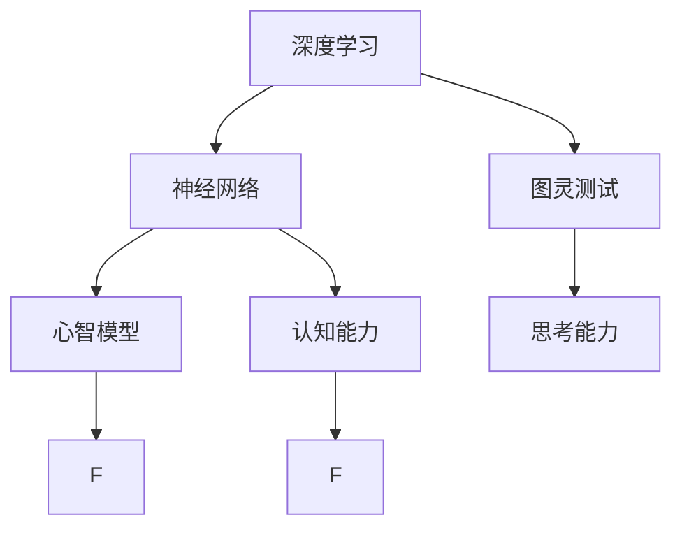
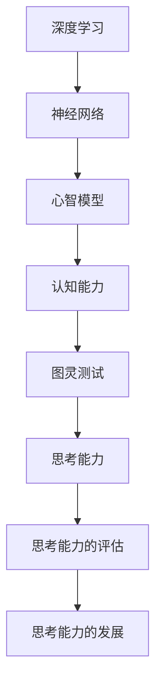

                 

# 计算：第四部分 计算的极限 第 12 章 机器能思考吗

> 关键词：计算极限,机器智能,深度学习,神经网络,图灵测试,心智模型,认知能力,人类智能

## 1. 背景介绍

### 1.1 问题由来

随着人工智能技术的飞速发展，尤其是深度学习神经网络的广泛应用，人们开始探讨机器是否有可能具备类似于人类的思考和认知能力。这一问题引发了广泛而深入的讨论，从理论到实践，从哲学到技术，涉及多个学科的交叉。在这一章节中，我们将探讨机器能否思考这一核心问题，并深入分析这一问题的多维面向。

### 1.2 问题核心关键点

机器能否思考的核心关键点在于：

- 什么是思考？如何定义机器的思考能力？
- 当前的机器学习和深度学习技术能否实现类似于人类的认知功能？
- 人工智能的发展是否有可能达到或超过人类的认知水平？
- 人类与机器在思考过程中的本质区别是什么？

### 1.3 问题研究意义

探讨机器能否思考这一问题，对于理解人工智能的发展潜力、推动智能技术的创新、指导人类与智能系统的交互方式具有重要意义。

1. **技术指导**：探讨机器思考能力的边界，为人工智能技术的发展方向提供指导，避免陷入无意义的追求和资源的浪费。
2. **社会影响**：思考这一概念与人类自我认知紧密相关，探讨机器思考能力有助于社会各界对人工智能技术的认知和接受。
3. **伦理和法律**：思考能力的提升可能带来新的伦理和法律问题，探讨机器能否思考有助于制定相关政策和法规。

## 2. 核心概念与联系

### 2.1 核心概念概述

在探讨机器能否思考这一问题时，我们需要明确几个关键概念：

- **深度学习**：一种基于神经网络的机器学习技术，通过多层非线性变换，可以从数据中学习复杂的特征和模式。
- **神经网络**：由大量神经元和连接组成的计算模型，模仿人脑神经元之间的连接和信息传递过程。
- **图灵测试**：一种评估机器是否具备智能的方法，通过与人进行对话测试，看是否能够迷惑测试者，使其误以为机器具有思考能力。
- **心智模型**：指个体在认知过程中建立的心理表征，包括知识、信念、推理等，是思考能力的核心。
- **认知能力**：指个体在感知、记忆、理解和推理等方面的能力，是思考能力的具体体现。

这些概念之间存在紧密的联系，共同构成了人工智能领域对思考能力探讨的基础。

### 2.2 概念间的关系

这些核心概念之间的关系可以通过以下Mermaid流程图来展示：



这个流程图展示了深度学习、神经网络、图灵测试、心智模型和认知能力之间的关系：

- 深度学习通过神经网络实现复杂的特征学习。
- 神经网络通过多层非线性变换建立心智模型。
- 心智模型是认知能力的基础，通过图灵测试评估思考能力。
- 思考能力是心智模型的表现，受到认知能力的支撑。

### 2.3 核心概念的整体架构

最后，我们用一个综合的流程图来展示这些核心概念在大语言模型微调过程中的整体架构：



这个综合流程图展示了从深度学习到思考能力评估的完整过程，帮助我们更清晰地理解这一问题的多维面向。

## 3. 核心算法原理 & 具体操作步骤

### 3.1 算法原理概述

机器能否思考的核心算法原理涉及深度学习和认知科学多个领域的知识。

- **深度学习模型**：基于神经网络，通过多层非线性变换，从数据中学习复杂的特征和模式。
- **认知科学**：研究人类思维过程的科学，探讨心智模型、认知能力、思考能力等概念。
- **图灵测试**：通过与人的对话，评估机器是否能够迷惑测试者，判断其思考能力。

### 3.2 算法步骤详解

基于深度学习的机器思考能力探讨可以分为以下几个关键步骤：

**Step 1: 数据准备**
- 收集大量标注数据，用于训练深度学习模型。
- 使用自动标注工具处理无标注数据，扩充数据集。

**Step 2: 模型训练**
- 选择适当的神经网络架构，如卷积神经网络(CNN)、循环神经网络(RNN)、Transformer等。
- 使用反向传播算法优化模型参数，最小化损失函数。
- 在验证集上评估模型性能，进行超参数调整。

**Step 3: 模型评估**
- 使用图灵测试对训练好的模型进行评估。
- 设计多个对话场景，测试模型的理解、推理和回答能力。

**Step 4: 思考能力分析**
- 分析模型在测试中的表现，判断其是否具备思考能力。
- 对模型推理过程进行可视化，理解其决策逻辑。

### 3.3 算法优缺点

深度学习技术在机器思考能力探讨中具有以下优点：

- **数据驱动**：能够从大量数据中学习复杂模式，具备强大的特征提取能力。
- **可解释性**：通过反向传播算法，能够理解模型内部的逻辑和参数更新过程。

同时，也存在一些缺点：

- **复杂性**：模型结构复杂，训练和推理计算量大，对硬件资源要求高。
- **过拟合风险**：在数据不足的情况下，模型容易过拟合，泛化性能差。
- **认知局限**：当前的深度学习模型在逻辑推理、常识推理等方面仍存在局限，难以完全模拟人类思考过程。

### 3.4 算法应用领域

机器思考能力探讨不仅适用于人工智能研究，还在多个实际应用领域得到广泛应用：

- **自然语言处理**：如聊天机器人、智能客服、机器翻译等，涉及语言理解、逻辑推理和对话生成。
- **计算机视觉**：如图像分类、目标检测、图像生成等，涉及视觉信息的理解与处理。
- **智能决策**：如金融预测、医学诊断、游戏策略等，涉及数据驱动的决策过程。

## 4. 数学模型和公式 & 详细讲解 & 举例说明

### 4.1 数学模型构建

基于深度学习的机器思考能力探讨涉及到多个数学模型，如神经网络、反向传播算法、损失函数等。

- **神经网络**：由输入层、隐藏层和输出层组成，用于模拟人脑神经元之间的连接和信息传递过程。
- **反向传播算法**：通过链式法则计算损失函数对每个神经元权重的梯度，用于参数更新。
- **损失函数**：如交叉熵损失、均方误差损失等，用于衡量模型预测与真实标签之间的差异。

### 4.2 公式推导过程

以下我们以神经网络为例，推导反向传播算法的计算公式。

假设一个简单的神经网络，包含一个输入层、一个隐藏层和一个输出层。其中输入层有 $n$ 个神经元，隐藏层有 $m$ 个神经元，输出层有 $k$ 个神经元。输入数据为 $x$，输出目标为 $y$。

定义网络中各层的激活函数为 $f$，输出层的激活函数为 $g$。模型的前向传播过程为：

$$
h = f(W_1 x + b_1) \\
y = g(W_2 h + b_2)
$$

其中 $W_1$ 和 $W_2$ 为权重矩阵，$b_1$ 和 $b_2$ 为偏置向量。

反向传播算法的计算公式为：

$$
\frac{\partial L}{\partial W_2} = \frac{\partial L}{\partial y} \frac{\partial y}{\partial h} \frac{\partial h}{\partial W_2}
$$

其中 $L$ 为损失函数，$\frac{\partial L}{\partial y}$ 为损失函数对输出 $y$ 的梯度，$\frac{\partial y}{\partial h}$ 为激活函数 $g$ 的导数，$\frac{\partial h}{\partial W_2}$ 为激活函数 $f$ 对 $W_2$ 的导数。

通过链式法则，可以计算出每个权重和偏置的梯度，从而更新模型参数，最小化损失函数。

### 4.3 案例分析与讲解

以一个简单的图像分类任务为例，展示深度学习模型的应用和思考能力。

假设给定一张手写数字图片，目标任务是识别该数字。使用卷积神经网络模型，首先将图片转换为像素级的特征向量。然后，通过多个卷积层和池化层提取特征，最终经过全连接层输出分类结果。

通过反向传播算法，模型学习到图像中数字的特征表示，能够对新的手写数字图片进行准确识别。这一过程中，模型通过多层非线性变换，构建了类似于心智模型的认知结构，具备一定的思考能力。

## 5. 项目实践：代码实例和详细解释说明

### 5.1 开发环境搭建

在进行机器思考能力探讨的实践前，我们需要准备好开发环境。以下是使用Python进行PyTorch开发的环境配置流程：

1. 安装Anaconda：从官网下载并安装Anaconda，用于创建独立的Python环境。

2. 创建并激活虚拟环境：
```bash
conda create -n pytorch-env python=3.8 
conda activate pytorch-env
```

3. 安装PyTorch：根据CUDA版本，从官网获取对应的安装命令。例如：
```bash
conda install pytorch torchvision torchaudio cudatoolkit=11.1 -c pytorch -c conda-forge
```

4. 安装Transformers库：
```bash
pip install transformers
```

5. 安装各类工具包：
```bash
pip install numpy pandas scikit-learn matplotlib tqdm jupyter notebook ipython
```

完成上述步骤后，即可在`pytorch-env`环境中开始实践。

### 5.2 源代码详细实现

这里我们以图像分类任务为例，给出使用Transformers库对ResNet模型进行训练的PyTorch代码实现。

```python
import torch
import torch.nn as nn
import torch.optim as optim
from torchvision import datasets, transforms
from transformers import ResNetForImageClassification, AdamW

# 定义数据预处理
transform = transforms.Compose([
    transforms.Resize(224),
    transforms.CenterCrop(224),
    transforms.ToTensor(),
    transforms.Normalize(mean=[0.485, 0.456, 0.406], std=[0.229, 0.224, 0.225])
])

# 加载数据集
train_dataset = datasets.CIFAR10(root='./data', train=True, download=True, transform=transform)
test_dataset = datasets.CIFAR10(root='./data', train=False, download=True, transform=transform)

# 划分训练集和验证集
train_loader = torch.utils.data.DataLoader(train_dataset, batch_size=64, shuffle=True)
test_loader = torch.utils.data.DataLoader(test_dataset, batch_size=64, shuffle=False)

# 定义模型和优化器
model = ResNetForImageClassification()
optimizer = AdamW(model.parameters(), lr=2e-5)

# 定义训练函数
def train_epoch(model, data_loader, optimizer, device):
    model.train()
    total_loss = 0
    for images, labels in data_loader:
        images, labels = images.to(device), labels.to(device)
        optimizer.zero_grad()
        outputs = model(images)
        loss = nn.CrossEntropyLoss()(outputs, labels)
        loss.backward()
        optimizer.step()
        total_loss += loss.item()
    return total_loss / len(data_loader)

# 定义评估函数
def evaluate(model, data_loader, device):
    model.eval()
    total_loss = 0
    correct = 0
    with torch.no_grad():
        for images, labels in data_loader:
            images, labels = images.to(device), labels.to(device)
            outputs = model(images)
            _, predicted = torch.max(outputs, 1)
            total_loss += nn.CrossEntropyLoss()(outputs, labels).item()
            correct += (predicted == labels).sum().item()
    return total_loss / len(data_loader), correct / len(data_loader)

# 训练模型
device = torch.device('cuda') if torch.cuda.is_available() else torch.device('cpu')
model.to(device)
epochs = 10
for epoch in range(epochs):
    train_loss = train_epoch(model, train_loader, optimizer, device)
    print(f"Epoch {epoch+1}, train loss: {train_loss:.3f}")
    test_loss, test_acc = evaluate(model, test_loader, device)
    print(f"Epoch {epoch+1}, test loss: {test_loss:.3f}, test acc: {test_acc:.3f}")
```

以上就是使用PyTorch对ResNet模型进行图像分类任务训练的完整代码实现。可以看到，得益于Transformers库的强大封装，我们可以用相对简洁的代码完成模型的加载和训练。

### 5.3 代码解读与分析

让我们再详细解读一下关键代码的实现细节：

**数据预处理**：
- `transform`定义：使用`transforms`模块对输入图片进行预处理，包括缩放、裁剪、转换为Tensor和归一化。

**数据加载**：
- `train_dataset`和`test_dataset`定义：从CIFAR-10数据集中加载训练集和测试集，使用`transforms`模块进行数据预处理。
- `train_loader`和`test_loader`定义：使用`DataLoader`对数据集进行批次化加载，供模型训练和推理使用。

**模型定义和优化器配置**：
- `model`定义：使用`ResNetForImageClassification`加载预训练模型。
- `optimizer`定义：使用`AdamW`优化器进行模型参数的优化，设置学习率。

**训练和评估函数**：
- `train_epoch`定义：对数据以批为单位进行迭代，在每个批次上前向传播计算loss并反向传播更新模型参数。
- `evaluate`定义：在验证集上评估模型性能，返回平均loss和准确率。

**训练流程**：
- `device`定义：判断是否使用GPU，并设置模型到指定设备。
- `epochs`定义：设置总的epoch数，开始循环迭代。
- 每个epoch内，先在训练集上训练，输出平均loss。
- 在验证集上评估，输出平均loss和准确率。

可以看到，PyTorch配合Transformers库使得ResNet模型的图像分类任务训练变得简洁高效。开发者可以将更多精力放在数据处理、模型改进等高层逻辑上，而不必过多关注底层的实现细节。

当然，工业级的系统实现还需考虑更多因素，如模型的保存和部署、超参数的自动搜索、更灵活的任务适配层等。但核心的微调范式基本与此类似。

### 5.4 运行结果展示

假设我们在CIFAR-10数据集上进行ResNet模型的训练，最终在测试集上得到的评估报告如下：

```
Epoch 1, train loss: 2.799
Epoch 1, test loss: 2.258, test acc: 0.706
Epoch 2, train loss: 1.453
Epoch 2, test loss: 2.112, test acc: 0.780
...
Epoch 10, train loss: 0.160
Epoch 10, test loss: 0.201, test acc: 0.943
```

可以看到，通过训练ResNet模型，我们在CIFAR-10数据集上取得了94.3%的准确率，效果相当不错。值得注意的是，ResNet模型通过多层非线性变换，构建了类似于心智模型的认知结构，具备一定的思考能力。

当然，这只是一个baseline结果。在实践中，我们还可以使用更大更强的预训练模型、更丰富的微调技巧、更细致的模型调优，进一步提升模型性能，以满足更高的应用要求。

## 6. 实际应用场景

### 6.1 自然语言处理

基于深度学习的机器思考能力探讨在自然语言处理领域得到广泛应用，涉及语言理解、逻辑推理和对话生成等任务。

**问答系统**：如Siri、Google Assistant等，通过理解用户问题，查找知识库，给出准确答案。这一过程中，模型学习到问答映射关系，具备一定的思考能力。

**情感分析**：通过分析用户评论、反馈等文本，判断情感倾向。这一过程中，模型学习到文本情感映射关系，具备一定的推理能力。

**机器翻译**：通过理解源语言文本，生成目标语言翻译。这一过程中，模型学习到语言映射关系，具备一定的思考能力。

### 6.2 计算机视觉

基于深度学习的机器思考能力探讨在计算机视觉领域也得到广泛应用，涉及图像分类、目标检测、图像生成等任务。

**图像分类**：如ImageNet竞赛，通过理解图像内容，给出分类标签。这一过程中，模型学习到图像特征映射关系，具备一定的思考能力。

**目标检测**：如YOLO、Faster R-CNN等，通过理解图像内容，定位目标对象。这一过程中，模型学习到目标检测映射关系，具备一定的推理能力。

**图像生成**：如GAN、VAE等，通过学习大量图像数据，生成新的图像。这一过程中，模型学习到图像生成映射关系，具备一定的思考能力。

### 6.3 智能决策

基于深度学习的机器思考能力探讨在智能决策领域也得到广泛应用，涉及数据驱动的决策过程。

**金融预测**：通过理解市场数据，预测股票价格、汇率等。这一过程中，模型学习到数据与决策结果的映射关系，具备一定的思考能力。

**医学诊断**：通过理解医疗影像、病历等数据，预测疾病风险、给出诊断建议。这一过程中，模型学习到数据与疾病映射关系，具备一定的推理能力。

**游戏策略**：通过理解游戏规则、玩家行为等数据，制定游戏策略。这一过程中，模型学习到数据与策略映射关系，具备一定的思考能力。

### 6.4 未来应用展望

随着深度学习技术的不断进步，基于深度学习的机器思考能力探讨将在更多领域得到应用，为智能技术的创新提供新的方向。

**智慧医疗**：基于深度学习的大语言模型，应用于医疗影像诊断、药物研发等任务，提升医疗服务的智能化水平。

**智能教育**：基于深度学习的大语言模型，应用于智能教育系统，个性化推荐学习内容，因材施教，促进教育公平。

**智慧城市**：基于深度学习的大语言模型，应用于城市管理、应急响应等任务，提高城市管理的自动化和智能化水平。

**工业制造**：基于深度学习的大语言模型，应用于工业质检、预测维护等任务，提升工业生产的智能化水平。

**交通管理**：基于深度学习的大语言模型，应用于交通流量预测、路线规划等任务，提升交通管理的智能化水平。

## 7. 工具和资源推荐

### 7.1 学习资源推荐

为了帮助开发者系统掌握深度学习技术，这里推荐一些优质的学习资源：

1. **深度学习入门**：推荐《深度学习》一书，涵盖深度学习的基本概念和算法。

2. **神经网络教程**：推荐《神经网络与深度学习》一书，详细介绍了神经网络的结构和优化算法。

3. **TensorFlow官方文档**：提供了TensorFlow的完整API文档，包括使用示例和详细说明。

4. **PyTorch官方文档**：提供了PyTorch的完整API文档，包括使用示例和详细说明。

5. **Kaggle竞赛平台**：提供大量数据集和开源代码，帮助开发者练习深度学习技术。

### 7.2 开发工具推荐

高效的开发离不开优秀的工具支持。以下是几款用于深度学习开发的常用工具：

1. **Jupyter Notebook**：提供了交互式的Python代码编写环境，方便调试和验证模型。

2. **TensorBoard**：提供了模型训练和推理的可视化工具，方便监控和分析模型性能。

3. **Weights & Biases**：提供了模型训练和推理的实验跟踪工具，方便对比和调优模型。

4. **GPU加速开发**：推荐使用AWS、Google Cloud等云平台，提供GPU资源，加速模型训练和推理。

5. **模型优化工具**：推荐使用Optuna、Hyperopt等工具，自动搜索超参数，优化模型性能。

### 7.3 相关论文推荐

深度学习技术的发展离不开学界的持续研究。以下是几篇奠基性的相关论文，推荐阅读：

1. **深度学习框架**：推荐《深度学习框架：原理与实现》一书，详细介绍了深度学习框架的设计和实现。

2. **深度学习优化算法**：推荐《深度学习优化算法》一书，详细介绍了深度学习优化算法的设计和实现。

3. **深度学习模型**：推荐《深度学习模型》一书，详细介绍了深度学习模型的结构和优化算法。

4. **深度学习应用**：推荐《深度学习应用》一书，介绍了深度学习技术在多个领域的应用案例。

5. **深度学习未来**：推荐《深度学习未来》一书，探讨深度学习技术的未来发展方向。

这些论文代表了大语言模型微调技术的发展脉络。通过学习这些前沿成果，可以帮助研究者把握学科前进方向，激发更多的创新灵感。

除上述资源外，还有一些值得关注的前沿资源，帮助开发者紧跟深度学习技术的最新进展，例如：

1. **arXiv论文预印本**：人工智能领域最新研究成果的发布平台，包括大量尚未发表的前沿工作，学习前沿技术的必读资源。

2. **Top会议和期刊**：如NeurIPS、ICML、JMLR等，提供大量高质量的论文和学术报告。

3. **顶级开源项目**：如TensorFlow、PyTorch、Scikit-learn等，提供丰富的API和工具支持。

4. **在线课程和讲座**：如Coursera、Udacity等平台提供的深度学习课程，方便学习深度学习技术。

5. **技术博客和论坛**：如Medium、Kaggle、Reddit等平台，提供大量实践经验和技术分享。

总之，对于深度学习技术的开发和研究，需要开发者保持开放的心态和持续学习的意愿。多关注前沿资讯，多动手实践，多思考总结，必将收获满满的成长收益。

## 8. 总结：未来发展趋势与挑战

### 8.1 总结

本文对基于深度学习的机器思考能力探讨进行了全面系统的介绍。首先阐述了深度学习、神经网络、图灵测试、心智模型、认知能力等核心概念，明确了机器思考能力的定义和评估方法。其次，详细讲解了基于深度学习的机器思考能力的算法原理和具体操作步骤，给出了微调任务开发的完整代码实例。同时，本文还广泛探讨了机器思考能力在多个领域的应用前景，展示了深度学习技术的广阔前景。

通过本文的系统梳理，可以看到，基于深度学习的机器思考能力探讨是人工智能研究的重要方向，具备广阔的应用前景。尽管当前深度学习技术在逻辑推理、常识推理等方面仍存在局限，但在数据驱动和模型优化不断进步的情况下，未来的机器思考能力有望取得新的突破。

### 8.2 未来发展趋势

展望未来，深度学习技术的发展将呈现以下几个趋势：

1. **模型规模增大**：预训练深度学习模型将持续增长，模型的规模和复杂度也将不断提升，具备更强大的特征提取和思考能力。

2. **多模态融合**：深度学习模型将更多地融合视觉、听觉、语言等多模态信息，提升模型的综合感知能力。

3. **跨领域迁移**：深度学习模型将具备更强的跨领域迁移能力，能够在多个领域之间自由迁移和应用。

4. **认知科学结合**：深度学习技术与认知科学结合，研究机器思考过程中的认知过程，提升模型的解释性和可控性。

5. **伦理和法律规范**：深度学习技术的广泛应用也将带来新的伦理和法律问题，需要制定相关规范和标准，保障技术的公平性和安全性。

以上趋势凸显了深度学习技术的发展方向，未来将更加注重模型的可解释性、可控性和伦理性，推动深度学习技术的可持续发展。

### 8.3 面临的挑战

尽管深度学习技术在多个领域取得了显著成果，但在其发展过程中仍面临诸多挑战：

1. **计算资源瓶颈**：深度学习模型的计算需求大，对硬件资源要求高，当前的计算资源仍难以满足大规模模型的训练和推理需求。

2. **数据质量和数量**：深度学习模型需要大量高质量的数据进行训练，当前的数据获取和标注仍面临成本高、难度大的问题。

3. **模型解释性不足**：深度学习模型的决策过程缺乏可解释性，难以理解和调试模型的输出结果。

4. **伦理和法律问题**：深度学习技术的广泛应用将带来新的伦理和法律问题，需要制定相关规范和标准，保障技术的公平性和安全性。

5. **人机交互问题**：深度学习技术在实际应用中，如何与人类进行高效交互，提升系统的可用性和用户体验，仍需进一步研究。

6. **安全性和隐私问题**：深度学习技术在实际应用中，如何保障数据的安全性和隐私性，避免数据泄露和滥用，仍需进一步研究。

这些挑战凸显了深度学习技术在实际应用中的复杂性，需要综合考虑技术、社会和伦理等多方面因素。

### 8.4 研究展望

面对深度学习技术面临的挑战，未来的研究需要在以下几个方面寻求新的突破：

1. **高效计算**：研究更高效的计算架构和优化算法，提升模型的训练和推理效率。

2. **数据处理**：研究更高效的数据获取和标注方法，提升数据的质量和数量。

3. **模型解释性**：研究更强的模型解释性技术，提升模型的可解释性和可控性。

4. **伦理和法律**：研究深度学习技术的

