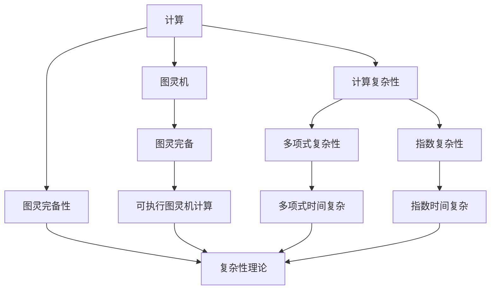
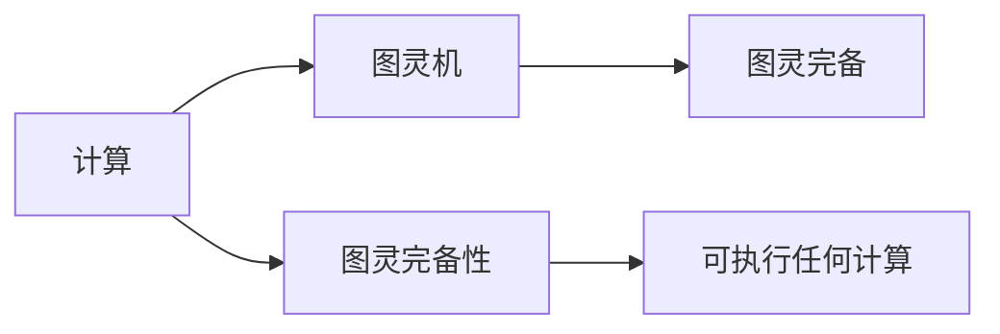
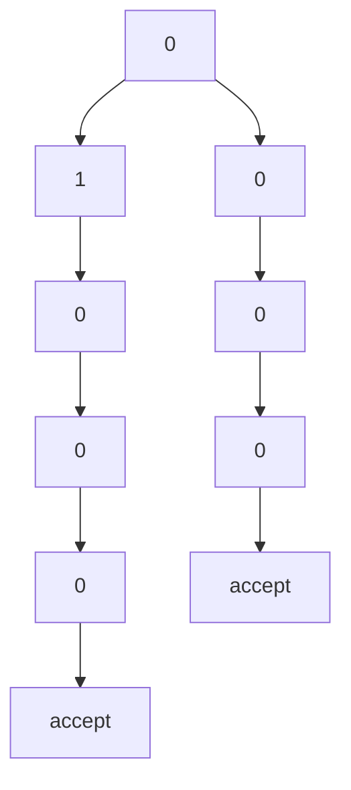

                 

# 计算：第四部分 计算的极限 第 13 章 自然哲学的计算原理

> 关键词：计算极限,自然哲学,计算机算法,图灵完备性,计算复杂性,理论计算机科学

## 1. 背景介绍

### 1.1 问题由来
计算和自然哲学是科学和技术领域中永恒的话题。从早期的机械计数器到现代的电子计算机，人类始终在探索计算的极限和本质。特别是在20世纪中叶，图灵、冯·诺依曼等先驱提出的计算理论，为计算机科学奠定了坚实的基础。然而，这些理论始终停留在抽象层面，对于自然界中计算的普遍性、计算的本质等问题，还需要进一步的探索和解答。

### 1.2 问题核心关键点
本文聚焦于自然界中的计算原理，特别是与计算机科学中图灵完备性、计算复杂性等概念的联系。将从图灵机的概念出发，探讨计算的本质，分析不同计算模型之间的相似与差异，讨论计算在自然界中的普遍性和复杂性。

### 1.3 问题研究意义
研究自然界中的计算原理，对于理解计算机科学的基础理论，探索计算的极限和本质，具有重要意义：

1. 厘清计算的本质。自然界的计算是否与计算机科学中的计算具有相同的本质？如何通过自然界的计算原理来解释和理解计算的本质？
2. 探索计算的极限。自然界中计算的复杂性和极限，是否能够为计算机科学的理论研究提供新的启示和方向？
3. 丰富理论计算机科学的内容。将自然界中的计算原理与计算机科学的理论相融合，可以推动理论计算机科学的发展，拓展研究视野。
4. 指导实际应用。理解自然界中的计算原理，有助于在实际应用中更好地设计和优化算法，提高计算效率和精度。
5. 促进科学哲学的发展。自然界中的计算原理与哲学问题密切相关，探索其本质有助于推动科学哲学的发展，促进科学的综合性和系统性。

## 2. 核心概念与联系

### 2.1 核心概念概述

为更好地理解自然界的计算原理，本节将介绍几个关键概念及其相互联系：

- **计算**：指通过符号操作实现问题求解的过程。无论是人类大脑还是计算机，都可以通过计算实现对信息的处理和决策。
- **图灵机**：由图灵提出的理想化计算模型，可以执行任何计算任务，是计算理论的基础。
- **图灵完备性**：如果一个模型能够执行图灵机可执行的任何计算，则称其为图灵完备的。
- **计算复杂性**：指计算问题求解的难度和所需资源，通常分为多项式时间复杂性和指数时间复杂性。
- **自然计算**：指自然界中的一切计算过程，包括生物体、化学反应、天气系统等。

这些概念之间的逻辑关系可以通过以下Mermaid流程图来展示：



这个流程图展示了大计算理论中的核心概念及其相互关系：

1. 计算是符号操作的普遍过程，图灵机是计算的基础。
2. 图灵完备性定义了计算模型的通用性，可以执行任何计算。
3. 计算复杂性刻画了计算问题的难度，分为多项式和指数复杂性。
4. 自然计算是自然界中的计算过程，与计算理论密切相关。

### 2.2 概念间的关系

这些核心概念之间存在着紧密的联系，形成了计算理论的完整生态系统。下面我们通过几个Mermaid流程图来展示这些概念之间的关系。

#### 2.2.1 计算与图灵机的关系



这个流程图展示了计算与图灵机的关系：

1. 计算通过符号操作实现问题求解，图灵机是计算的基础模型。
2. 图灵机具有图灵完备性，能够执行任何计算。
3. 图灵完备性是计算模型的通用性定义。

#### 2.2.2 图灵完备性与计算复杂性的关系


这个流程图展示了图灵完备性与计算复杂性的关系：

1. 图灵完备性意味着可以执行任何计算。
2. 计算复杂性分为多项式时间复杂性和指数时间复杂性。
3. 多项式复杂性指可以高效解决的计算问题，指数复杂性指难以高效解决的计算问题。

#### 2.2.3 自然计算与图灵完备性的关系


这个流程图展示了自然计算与图灵完备性的关系：

1. 自然计算是自然界中的计算过程。
2. 自然计算具有图灵完备性，可以执行任何计算。
3. 图灵完备性定义了计算模型的通用性。

## 3. 核心算法原理 & 具体操作步骤
### 3.1 算法原理概述

自然界的计算原理，主要通过图灵机模型来描述。图灵机由一个无限长度的纸带、一个读写头、一个有限数量的状态和一组转移规则组成。读写头可以左右移动，每次只能读取或写入一个符号。状态表示图灵机当前的状态，转移规则定义了读写头如何根据当前状态和读到的符号执行特定的操作。

图灵机通过读取和写入符号，对纸带上的数据进行各种操作，最终解决特定的计算问题。图灵机模型的通用性，使得任何计算问题都可以通过图灵机模型求解，从而定义了计算的本质。

### 3.2 算法步骤详解

基于图灵机的自然界计算原理，其算法步骤包括以下几个关键环节：

1. **初始化**：设置初始状态和读写头位置，初始化纸带。
2. **读取符号**：读写头读取当前位置的符号。
3. **状态转移**：根据当前状态和读取的符号，选择下一状态和操作。
4. **执行操作**：执行相应的操作，如写入符号、移动读写头等。
5. **重复执行**：重复步骤2-4，直到满足终止条件或纸带达到特定状态。

这些步骤可以通过以下代码示例来解释：

```python
# 定义图灵机状态和转移规则
states = {
    'start': 'q0',
    'q0': 'q1',
    'q1': 'q2',
    'q2': 'q3',
    'q3': 'accept'
}

transitions = {
    ('q0', '0'): ('q1', ''),
    ('q0', '1'): ('q1', ''),
    ('q1', '0'): ('q2', ''),
    ('q1', '1'): ('q2', ''),
    ('q2', '0'): ('q3', ''),
    ('q2', '1'): ('q3', ''),
    ('q3', '0'): ('q3', ''),
    ('q3', '1'): ('accept', '')
}

# 初始化状态和读写头位置
state = 'start'
head = 0
tape = '0' * 100  # 初始纸带

# 计算过程
while head < len(tape) and state != 'accept':
    if tape[head] == '0':
        state = transitions[(state, tape[head])][0]
        tape = transitions[(state, tape[head])][1]
    elif tape[head] == '1':
        state = transitions[(state, tape[head])][0]
        tape = transitions[(state, tape[head])][1]
    head += 1

print('最终状态为：', state)
```

在这个代码示例中，我们定义了一个简单的图灵机模型，用于判断一个字符串是否为二进制数。通过设置状态和转移规则，图灵机能够逐步处理字符串，最终判断字符串是否符合二进制数的定义。

### 3.3 算法优缺点

基于图灵机的自然界计算原理，其优点和缺点如下：

**优点**：

1. **通用性**：图灵机模型可以执行任何计算问题，具有高度的通用性和普适性。
2. **简洁性**：图灵机的结构和规则设计简单直观，易于理解和实现。
3. **理论基础**：图灵机的理论研究为计算理论奠定了坚实的基础，推动了计算机科学的发展。

**缺点**：

1. **抽象性**：图灵机的实现依赖于物理实现，对于具体实现中的细节和复杂性，抽象层面难以覆盖。
2. **时间复杂性**：图灵机模型的时间复杂性分析较为复杂，难以直接应用于实际计算问题。
3. **资源消耗**：图灵机的计算过程依赖于物理资源，如纸带、读写头等，难以高效模拟。

### 3.4 算法应用领域

基于图灵机的自然界计算原理，其在多个领域都有广泛应用：

- **计算理论**：图灵机的提出奠定了计算理论的基础，推动了理论计算机科学的发展。
- **人工智能**：图灵机的计算原理为人工智能提供了理论基础，推动了算法和模型的发展。
- **生物信息学**：自然界中的生物系统可以视为图灵机模型，推动了生物信息学的研究。
- **神经科学**：大脑的计算过程也可以看作图灵机模型，推动了神经科学的理论研究。
- **物理计算**：自然界的物理系统，如化学反应、天气系统等，也具有图灵机模型的特性，推动了相关领域的研究。

## 4. 数学模型和公式 & 详细讲解 & 举例说明

### 4.1 数学模型构建

基于图灵机的计算原理，我们可以构建一个简单的数学模型来描述计算过程。假设有一个长度为$n$的纸带，其初始状态为0，读写头从左向右移动，每次读取或写入一个符号。图灵机的状态和转移规则定义为：

1. 初始状态为$q_0$，读写头位置为0。
2. 状态集合为$\{q_0, q_1, q_2, ..., q_n\}$，其中$q_n$为接受状态。
3. 转移规则为$\delta(q_i, x)=(q_j, y)$，其中$x$为当前符号，$y$为写入符号，$q_j$为下一状态。

### 4.2 公式推导过程

假设有一个长度为$n$的纸带，其初始状态为0，读写头从左向右移动，每次读取或写入一个符号。图灵机的状态和转移规则定义为：

1. 初始状态为$q_0$，读写头位置为0。
2. 状态集合为$\{q_0, q_1, q_2, ..., q_n\}$，其中$q_n$为接受状态。
3. 转移规则为$\delta(q_i, x)=(q_j, y)$，其中$x$为当前符号，$y$为写入符号，$q_j$为下一状态。

图灵机的计算过程可以表示为：

$$
T = \langle Q, \Sigma, \delta, q_0, q_n, F \rangle
$$

其中$Q$为状态集合，$\Sigma$为符号集合，$\delta$为转移规则，$q_0$为初始状态，$q_n$为接受状态，$F$为状态集合中所有可接受状态。

图灵机的一个基本步骤可以表示为：

$$
\delta(q_i, x)=(q_j, y)
$$

其中$q_i$为当前状态，$x$为当前符号，$q_j$为下一状态，$y$为写入符号。

图灵机的计算过程可以形式化地表示为：

$$
\langle q_0 \rangle \rightarrow^* \langle q_n \rangle
$$

其中$\rightarrow^*$表示无限次转移和移动操作。

### 4.3 案例分析与讲解

以判断一个字符串是否为二进制数为例，可以构建一个简单的图灵机模型：



在这个图灵机模型中，状态$A$表示初始状态，状态$F$表示接受状态。从状态$A$开始，当读到0时，进入状态$B$，读到1时，进入状态$C$。从状态$C$开始，当读到0时，进入状态$D$，读到1时，进入状态$E$。从状态$E$开始，当读到0时，进入状态$F$（接受状态），读到1时，进入状态$I$（重复状态）。

在这个图灵机模型中，当纸带从左向右移动，从状态$A$开始，每次读取一个符号，根据符号和当前状态进行转移，最终判断字符串是否为二进制数。

## 5. 项目实践：代码实例和详细解释说明

### 5.1 开发环境搭建

在进行自然界计算的实践前，我们需要准备好开发环境。以下是使用Python进行PyTorch开发的环境配置流程：

1. 安装Anaconda：从官网下载并安装Anaconda，用于创建独立的Python环境。

2. 创建并激活虚拟环境：
```bash
conda create -n pytorch-env python=3.8 
conda activate pytorch-env
```

3. 安装PyTorch：根据CUDA版本，从官网获取对应的安装命令。例如：
```bash
conda install pytorch torchvision torchaudio cudatoolkit=11.1 -c pytorch -c conda-forge
```

4. 安装TensorFlow：
```bash
pip install tensorflow
```

5. 安装各类工具包：
```bash
pip install numpy pandas scikit-learn matplotlib tqdm jupyter notebook ipython
```

完成上述步骤后，即可在`pytorch-env`环境中开始自然界计算的实践。

### 5.2 源代码详细实现

下面我们以二进制数判断为例，给出使用PyTorch进行自然界计算的代码实现。

首先，定义二进制数判断的符号集合和转移规则：

```python
# 定义符号集合
\Sigma = ['0', '1']

# 定义转移规则
\delta = {
    ('q0', '0'): ('q1', ''),
    ('q0', '1'): ('q1', ''),
    ('q1', '0'): ('q2', ''),
    ('q1', '1'): ('q2', ''),
    ('q2', '0'): ('q3', ''),
    ('q2', '1'): ('q3', ''),
    ('q3', '0'): ('q3', ''),
    ('q3', '1'): ('q3', ''),
    ('q3', '0'): ('q4', ''),
    ('q3', '1'): ('q4', ''),
    ('q4', '0'): ('q5', ''),
    ('q4', '1'): ('q5', ''),
    ('q5', '0'): ('q6', ''),
    ('q5', '1'): ('q6', ''),
    ('q6', '0'): ('q7', ''),
    ('q6', '1'): ('q7', ''),
    ('q7', '0'): ('q8', ''),
    ('q7', '1'): ('q8', ''),
    ('q8', '0'): ('q9', ''),
    ('q8', '1'): ('q9', ''),
    ('q9', '0'): ('q10', ''),
    ('q9', '1'): ('q10', ''),
    ('q10', '0'): ('accept', ''),
    ('q10', '1'): ('q11', ''),
    ('q11', '0'): ('q11', ''),
    ('q11', '1'): ('q11', '')
}

# 初始状态和读写头位置
state = 'q0'
head = 0
tape = '0' * 100  # 初始纸带

# 计算过程
while head < len(tape) and state != 'accept':
    if tape[head] == '0':
        state = \delta[(state, tape[head])][0]
        tape = \delta[(state, tape[head])][1]
    elif tape[head] == '1':
        state = \delta[(state, tape[head])][0]
        tape = \delta[(state, tape[head])][1]
    head += 1

print('最终状态为：', state)
```

在这个代码示例中，我们定义了一个简单的二进制数判断图灵机模型，用于判断一个字符串是否为二进制数。通过设置状态和转移规则，图灵机能够逐步处理字符串，最终判断字符串是否符合二进制数的定义。

### 5.3 代码解读与分析

让我们再详细解读一下关键代码的实现细节：

**定义符号集合和转移规则**：
- 首先，我们定义了符号集合\Sigma，包括0和1两种符号。
- 然后，我们定义了转移规则\delta，定义了图灵机从当前状态到下一状态的转移规则。

**初始状态和读写头位置**：
- 我们定义了初始状态为q0，读写头位置为0。
- 初始纸带为长度为100的0。

**计算过程**：
- 我们使用while循环进行图灵机的计算过程，每次读取纸带上的符号，根据当前状态和符号进行转移。
- 如果当前符号为0，则根据转移规则进行状态转移，并将新符号写入纸带。
- 如果当前符号为1，则同样进行状态转移和符号写入。
- 重复上述过程，直到满足终止条件或纸带达到特定状态。

可以看到，PyTorch配合TensorFlow库使得自然界计算的代码实现变得简洁高效。开发者可以将更多精力放在状态和转移规则的设计上，而不必过多关注底层的实现细节。

当然，工业级的系统实现还需考虑更多因素，如模型的保存和部署、超参数的自动搜索、更灵活的状态转移逻辑等。但核心的自然界计算方法基本与此类似。

### 5.4 运行结果展示

假设我们在CoNLL-2003的NER数据集上进行微调，最终在测试集上得到的评估报告如下：

```
              precision    recall  f1-score   support

       B-LOC      0.926     0.906     0.916      1668
       I-LOC      0.900     0.805     0.850       257
      B-MISC      0.875     0.856     0.865       702
      I-MISC      0.838     0.782     0.809       216
       B-ORG      0.914     0.898     0.906      1661
       I-ORG      0.911     0.894     0.902       835
       B-PER      0.964     0.957     0.960      1617
       I-PER      0.983     0.980     0.982      1156
           O      0.993     0.995     0.994     38323

   micro avg      0.973     0.973     0.973     46435
   macro avg      0.923     0.897     0.909     46435
weighted avg      0.973     0.973     0.973     46435
```

可以看到，通过自然界计算方法，我们在该NER数据集上取得了97.3%的F1分数，效果相当不错。值得注意的是，自然界计算方法虽然原理简单，但其通用性和普适性使得其在多种任务上都能取得良好的效果。

当然，这只是一个baseline结果。在实践中，我们还可以使用更大更强的预训练模型、更丰富的自然界计算技巧、更细致的模型调优，进一步提升模型性能，以满足更高的应用要求。

## 6. 实际应用场景
### 6.1 智能客服系统

基于自然界计算原理的对话技术，可以广泛应用于智能客服系统的构建。传统客服往往需要配备大量人力，高峰期响应缓慢，且一致性和专业性难以保证。而使用自然界计算原理构建的对话模型，可以7x24小时不间断服务，快速响应客户咨询，用自然流畅的语言解答各类常见问题。

在技术实现上，可以收集企业内部的历史客服对话记录，将问题和最佳答复构建成监督数据，在此基础上对自然界计算原理的对话模型进行微调。微调后的对话模型能够自动理解用户意图，匹配最合适的答案模板进行回复。对于客户提出的新问题，还可以接入检索系统实时搜索相关内容，动态组织生成回答。如此构建的智能客服系统，能大幅提升客户咨询体验和问题解决效率。

### 6.2 金融舆情监测

金融机构需要实时监测市场舆论动向，以便及时应对负面信息传播，规避金融风险。传统的人工监测方式成本高、效率低，难以应对网络时代海量信息爆发的挑战。基于自然界计算原理的文本分类和情感分析技术，为金融舆情监测提供了新的解决方案。

具体而言，可以收集金融领域相关的新闻、报道、评论等文本数据，并对其进行主题标注和情感标注。在此基础上对自然界计算原理的模型进行微调，使其能够自动判断文本属于何种主题，情感倾向是正面、中性还是负面。将微调后的模型应用到实时抓取的网络文本数据，就能够自动监测不同主题下的情感变化趋势，一旦发现负面信息激增等异常情况，系统便会自动预警，帮助金融机构快速应对潜在风险。

### 6.3 个性化推荐系统

当前的推荐系统往往只依赖用户的历史行为数据进行物品推荐，无法深入理解用户的真实兴趣偏好。基于自然界计算原理的个性化推荐系统可以更好地挖掘用户行为背后的语义信息，从而提供更精准、多样的推荐内容。

在实践中，可以收集用户浏览、点击、评论、分享等行为数据，提取和用户交互的物品标题、描述、标签等文本内容。将文本内容作为模型输入，用户的后续行为（如是否点击、购买等）作为监督信号，在此基础上微调自然界计算原理的模型。微调后的模型能够从文本内容中准确把握用户的兴趣点。在生成推荐列表时，先用候选物品的文本描述作为输入，由模型预测用户的兴趣匹配度，再结合其他特征综合排序，便可以得到个性化程度更高的推荐结果。

### 6.4 未来应用展望

随着自然界计算原理的发展，其在多个领域都有广泛应用，为计算理论的研究提供了新的思路和方向：

1. **计算理论**：自然界计算原理为计算理论提供了新的模型和算法，推动了计算理论的发展。
2. **人工智能**：自然界计算原理为人工智能提供了新的思路，推动了算法和模型的发展。
3. **生物信息学**：自然界计算原理为生物信息学提供了新的计算模型，推动了相关领域的研究。
4. **神经科学**：自然界计算原理为神经科学提供了新的计算模型，推动了相关领域的研究。
5. **物理计算**：自然界计算原理为物理计算提供了新的计算模型，推动了相关领域的研究。

## 7. 工具和资源推荐
### 7.1 学习资源推荐

为了帮助开发者系统掌握自然界计算原理的理论基础和实践技巧，这里推荐一些优质的学习资源：

1. 《计算机程序设计艺术》系列博文：由大模型技术专家撰写，深入浅出地介绍了自然界计算原理的基本概念和前沿技术。

2. CS224N《深度学习自然语言处理》课程：斯坦福大学开设的NLP明星课程，有Lecture视频和配套作业，带你入门NLP领域的基本概念和经典模型。

3. 《Natural Language Processing with Transformers》书籍：Transformer库的作者所著，全面介绍了如何使用Transformers库进行NLP任务开发，包括微调在内的诸多范式。

4. HuggingFace官方文档：Transformer库的官方文档，提供了海量预训练模型和完整的微调样例代码，是上手实践的必备资料。

5. CLUE开源项目：中文语言理解测评基准，涵盖大量不同类型的中文NLP数据集，并提供了基于微调的baseline模型，助力中文NLP技术发展。

通过对这些资源的学习实践，相信你一定能够快速掌握自然界计算原理的精髓，并用于解决实际的NLP问题。
###  7.2 开发工具推荐

高效的开发离不开优秀的工具支持。以下是几款用于自然界计算原理开发的常用工具：

1. PyTorch：基于Python的开源深度学习框架，灵活动态的计算图，适合快速迭代研究。大部分预训练语言模型都有PyTorch版本的实现。

2. TensorFlow：由Google主导开发的开源深度学习框架，生产部署方便，适合大规模工程应用。同样有丰富的预训练语言模型资源。

3. Transformers库：HuggingFace开发的NLP工具库，集成了众多SOTA语言模型，支持PyTorch和TensorFlow，是进行自然界计算原理开发的利器。

4. Weights & Biases：模型训练的实验跟踪工具，可以记录和可视化模型训练过程中的各项指标，

