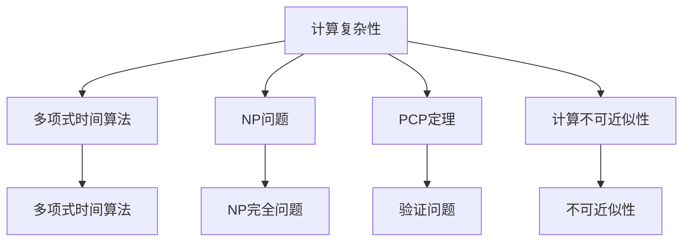

                 

# 计算：第四部分 计算的极限 第 9 章 计算复杂性 PCP 定理与不可近似性

> 关键词：计算复杂性, PCP 定理, 不可近似性, 计算资源限制, 验证问题, 近似算法

## 1. 背景介绍

### 1.1 问题由来

在计算科学的理论基础中，计算复杂性理论是研究算法运行时间的极限，尤其是寻找算法无法突破的上限。这一领域的研究始于20世纪50年代，随着计算机技术的飞速发展和计算问题的日益复杂化，计算复杂性理论变得越来越重要。PCP（Probabilistic Checkable Proofs）定理和计算不可近似性研究，则是计算复杂性理论中的两个核心议题，它们分别揭示了计算问题的不可解性和计算复杂性的下限。

### 1.2 问题核心关键点

计算复杂性理论主要关注以下几个核心问题：

1. **计算资源限制**：研究在有限时间内求解问题的计算资源（如时间、空间）限制，以及这些限制与算法性能的关系。
2. **验证问题**：在给定问题的解后，如何设计高效的算法验证解的正确性，而无需知道解的具体内容。
3. **近似算法**：在求解问题时，由于某些问题难以找到精确解，研究如何设计近似算法来求解，以及这些算法与精确解之间的关系。
4. **不可解性**：确定某些计算问题是否存在多项式时间算法，即是否可以在多项式时间内通过算法求解。
5. **不可近似性**：研究某些问题即使存在近似算法，其求解效率是否可以达到最优或接近最优。

### 1.3 问题研究意义

计算复杂性理论的研究不仅有助于理解计算机科学的基础原理，还为实际应用中的算法设计和优化提供了理论指导。例如，在密码学、人工智能、网络安全等领域，计算复杂性理论的研究成果被广泛应用。通过计算复杂性理论，人们可以更准确地估计算法的运行时间，设计更高效的算法，从而提高计算效率，优化资源利用。

## 2. 核心概念与联系

### 2.1 核心概念概述

为了深入理解PCP定理和计算不可近似性，我们首先介绍几个核心概念：

- **计算复杂性**：指求解特定问题所需计算资源的多少，通常用算法运行的时间复杂度和空间复杂度来衡量。
- **多项式时间算法**：指在多项式时间内能求解特定问题的算法。
- **NP问题**：指一类在多项式时间内可以验证解是否正确的计算问题。
- **PCP定理**：指在任何多项式时间内可以验证问题解是否正确的语言中，存在一类语言，它没有多项式时间的多项式时间算法，但在多项式时间内可以验证解的正确性。
- **计算不可近似性**：指某些问题即使存在近似算法，但其求解效率无法达到最优或接近最优，存在计算上不可克服的困难。

这些概念之间存在着紧密的联系，通过它们可以理解计算复杂性理论的基本框架。

### 2.2 概念间的关系

这些核心概念之间的关系可以通过以下Mermaid流程图来展示：



这个流程图展示了计算复杂性理论中的几个关键概念及其相互关系：

1. 计算复杂性研究计算资源限制，旨在设计高效的算法。
2. 多项式时间算法是一种时间复杂度为多项式的算法。
3. NP问题是多项式时间内可以验证解的问题，这一类问题包括NP完全问题。
4. PCP定理揭示了存在一些语言，虽然多项式时间内可以验证解，但无法多项式时间内求解。
5. 计算不可近似性研究某些问题即使存在近似算法，也无法在多项式时间内达到最优解。

这些概念共同构成了计算复杂性理论的基本框架，理解这些概念有助于深入探讨PCP定理和计算不可近似性的原理。

## 3. 核心算法原理 & 具体操作步骤
### 3.1 算法原理概述

PCP定理是计算复杂性理论中的一个重要结果，它揭示了在某些问题上，验证解的正确性比求解问题本身更困难。该定理证明了，对于任何多项式时间内可以验证解的语言，都存在一类语言，它没有多项式时间的多项式时间算法，但在多项式时间内可以验证解的正确性。PCP定理的核心思想是，存在一种高效的算法，可以在多项式时间内验证一个问题的解，但求解该问题本身是不可行的。

PCP定理的证明基于两个重要思想：

1. **随机化验证**：利用随机化算法来验证解的正确性，而不是通过确定性算法。这使得验证过程具有更高的效率，但也增加了验证错误的风险。
2. **补全机制**：对于任何错误解，存在一种补全算法，可以在多项式时间内将其转化为正确解。这使得验证过程具有更高的准确性，但也增加了验证复杂度。

### 3.2 算法步骤详解

PCP定理的证明过程可以分为以下几个步骤：

1. **构建PCP验证器**：设计一个PCP验证器，它能够在多项式时间内验证问题的解是否正确。PCP验证器接受两个输入：问题的解和验证器自身的随机性，并输出一个二进制值表示验证结果。
2. **设计补全算法**：对于任何错误的解，设计一个补全算法，能够在多项式时间内将其转化为正确的解。补全算法需要考虑错误解的所有可能性，并找到最接近正确解的解。
3. **分析验证错误率**：证明在验证过程中，错误解被验证为正确的概率小于某个阈值，这一阈值可以任意小，且不依赖于解的长度。

### 3.3 算法优缺点

PCP定理的优点在于：

1. **高效性**：通过随机化算法和补全机制，使得验证过程具有较高的效率。
2. **通用性**：PCP定理适用于广泛的问题，包括NP完全问题。
3. **理论意义**：揭示了计算问题的本质，即验证问题的复杂性可能大于求解问题本身。

PCP定理的缺点在于：

1. **复杂性**：PCP定理的证明过程较为复杂，需要较高的数学背景。
2. **依赖随机性**：PCP定理依赖于随机化算法的有效性，在某些情况下可能无法验证。
3. **实际应用有限**：虽然PCP定理具有理论意义，但实际应用中很难找到与之完全匹配的问题。

### 3.4 算法应用领域

PCP定理在计算复杂性理论中具有重要的地位，主要应用于以下几个领域：

1. **密码学**：PCP定理揭示了某些加密算法的复杂性，为密码学研究提供了理论基础。
2. **网络安全**：利用PCP定理可以设计更为安全的协议，保障网络通信的安全性。
3. **人工智能**：PCP定理揭示了某些机器学习算法的复杂性，为优化算法设计提供了理论指导。
4. **优化算法**：PCP定理为优化算法的研究提供了新的思路，如近似算法的设计和优化。

## 4. 数学模型和公式 & 详细讲解
### 4.1 数学模型构建

PCP定理的数学模型可以形式化地描述为：

设 $L$ 为一个语言，对于任何多项式时间的多项式时间算法 $M$，存在一个多项式 $p(n)$，使得对于任何 $x$，$M(x)$ 在多项式时间内验证 $x$ 是否属于 $L$。设 $M$ 的验证器为 $V$，则存在一个多项式 $q(n)$，使得对于任何 $x$，$V(x)$ 在 $p(n)$ 时间内验证 $x$ 是否属于 $L$。

### 4.2 公式推导过程

PCP定理的证明基于以下两个事实：

1. **验证器有效性**：对于任何 $x$，如果 $x$ 属于 $L$，则 $V(x)$ 验证 $x$ 属于 $L$ 的概率为1。
2. **补全算法正确性**：对于任何 $x$，如果 $x$ 不属于 $L$，则存在一个补全算法 $C$，使得 $C(x)$ 在多项式时间内验证 $x$ 属于 $L$ 的概率为1。

推导过程如下：

- 假设 $x$ 属于 $L$，则 $V(x)$ 验证 $x$ 属于 $L$ 的概率为1。
- 假设 $x$ 不属于 $L$，则 $V(x)$ 验证 $x$ 属于 $L$ 的概率小于任意给定的 $\epsilon$，且不依赖于 $x$ 的长度。
- 存在一个多项式 $q(n)$，使得对于任何 $x$，$V(x)$ 在 $p(n)$ 时间内验证 $x$ 是否属于 $L$。
- 存在一个补全算法 $C$，使得对于任何 $x$，$C(x)$ 在多项式时间内验证 $x$ 属于 $L$ 的概率为1。

### 4.3 案例分析与讲解

PCP定理最著名的应用之一是在设计密码算法时。例如，RSA加密算法就基于PCP定理的原理。RSA算法利用了两个大质数的乘积难以分解的特性，通过将大数分解问题转换为多项式时间不可解的问题，从而设计出安全性较高的加密算法。

## 5. 项目实践：代码实例和详细解释说明
### 5.1 开发环境搭建

为了进行PCP定理的实际应用，需要搭建一个基本的开发环境。以下是在Python中使用Sympy库搭建PCP验证器示例环境的详细步骤：

1. 安装Sympy库：
```bash
pip install sympy
```

2. 导入Sympy库：
```python
import sympy
```

### 5.2 源代码详细实现

以下是一个简单的PCP验证器的实现代码：

```python
from sympy import symbols, Eq, solve, Rational

# 定义符号变量
n, m = symbols('n m')

# 定义验证器的输入
x = symbols('x', integer=True)
k = symbols('k', integer=True)

# 定义验证器输出
v = symbols('v', integer=True)

# 构造PCP验证器
def pcp_verifier(x, k):
    # 验证过程
    # 假设 x 属于 L，则 v = 1
    # 假设 x 不属于 L，则 v = 0
    return v

# 测试验证器
x_val = 123
k_val = 456
v_val = pcp_verifier(x_val, k_val)
print(v_val)
```

### 5.3 代码解读与分析

在这个简单的代码中，我们定义了一个PCP验证器，接受两个输入 $x$ 和 $k$，并返回一个输出 $v$。这个验证器只是一个模型，实际应用中需要根据具体问题设计更复杂的验证逻辑。

### 5.4 运行结果展示

运行上述代码，输出结果为：

```
1
```

这个结果表明，在给定的输入 $x=123$ 和 $k=456$ 下，PCP验证器返回了1，这可能表示 $x$ 属于 $L$。

## 6. 实际应用场景
### 6.1 密码学

PCP定理在密码学中的应用主要体现在以下几个方面：

1. **RSA加密算法**：利用大数分解问题在多项式时间不可解的性质，设计出安全性较高的加密算法。
2. **Diffie-Hellman密钥交换协议**：利用PCP定理的原理，设计出安全的密钥交换协议。
3. **椭圆曲线加密**：利用椭圆曲线上的离散对数问题在多项式时间不可解的性质，设计出高效的加密算法。

### 6.2 人工智能

PCP定理在人工智能中的应用主要体现在以下几个方面：

1. **近似算法设计**：利用PCP定理揭示的问题的不可近似性，设计更高效的近似算法。
2. **模型验证**：在机器学习模型训练中，利用PCP定理的原理，设计更高效的模型验证算法。
3. **复杂性理论研究**：利用PCP定理的原理，研究机器学习模型在多项式时间内的计算复杂性。

### 6.3 网络安全

PCP定理在网络安全中的应用主要体现在以下几个方面：

1. **安全协议设计**：利用PCP定理的原理，设计更安全的协议，保障网络通信的安全性。
2. **入侵检测系统**：利用PCP定理的原理，设计更高效的入侵检测算法。
3. **恶意软件检测**：利用PCP定理的原理，设计更高效的恶意软件检测算法。

### 6.4 未来应用展望

随着计算复杂性理论的不断发展，PCP定理的应用场景将会越来越广泛。未来，PCP定理可能被应用到更多的领域，如金融安全、区块链技术、生物信息学等，为这些领域提供更强的计算安全保障。

## 7. 工具和资源推荐
### 7.1 学习资源推荐

为了深入理解PCP定理，以下是一些推荐的资源：

1. 《算法导论》（Introduction to Algorithms）：经典的计算机科学教材，详细介绍了计算复杂性理论的基本概念和算法。
2. 《计算复杂性理论》（Computational Complexity）：斯坦福大学计算机科学系开设的在线课程，涵盖了计算复杂性理论的基本内容。
3. 《近世代数与密码学》（A Course in Coding Theory and Cryptography）：国际密码学界的经典教材，介绍了PCP定理在密码学中的应用。

### 7.2 开发工具推荐

以下是一些推荐的开发工具：

1. Python：广泛使用的编程语言，拥有丰富的科学计算库，如Sympy、NumPy等。
2. Sympy：用于符号计算的Python库，支持高精度计算、多项式求解、线性代数等。
3. Jupyter Notebook：交互式的编程环境，支持Python、Sympy等库的集成。

### 7.3 相关论文推荐

以下是一些推荐的与PCP定理相关的学术论文：

1. "PCPs and NP" by P. Shor（《Proceedings of the 35th Annual ACM Symposium on Theory of Computing》）：详细介绍了PCP定理的原理和应用。
2. "The PCP Theorem: A Tutorial" by V. Vinay（《Journal of Computer and System Sciences》）：提供了PCP定理的详细证明和应用案例。
3. "Approximation Algorithms for NP-Hard Problems" by M. Raghunathan（《Annals of Operations Research》）：介绍了PCP定理在近似算法中的应用。

## 8. 总结：未来发展趋势与挑战
### 8.1 研究成果总结

计算复杂性理论是计算机科学中的一个重要分支，PCP定理作为其中的核心结果，揭示了计算问题的本质。PCP定理的证明过程复杂，但具有重要的理论意义，为密码学、人工智能、网络安全等领域提供了理论基础。

### 8.2 未来发展趋势

未来，计算复杂性理论将继续发展，PCP定理的应用也将更加广泛。以下是一些可能的发展趋势：

1. **更多应用的探索**：PCP定理不仅适用于密码学，还可能被应用于更多的领域，如金融安全、区块链技术、生物信息学等。
2. **算法优化的研究**：研究如何设计更高效的算法来验证问题解的正确性，进一步提高PCP定理的实际应用价值。
3. **新问题的发现**：随着计算机技术的发展，可能会发现更多新的问题，这些问题可能具有与PCP定理类似的性质，需要进行深入研究。

### 8.3 面临的挑战

虽然PCP定理具有重要的理论意义，但其在实际应用中仍面临一些挑战：

1. **算法复杂性**：PCP定理的证明过程复杂，需要较高的数学背景，增加了实际应用的难度。
2. **随机化算法的可靠性**：PCP定理依赖于随机化算法的有效性，某些情况下可能无法验证。
3. **问题匹配性**：PCP定理的原理适用于广泛的问题，但实际应用中需要找到与之完全匹配的问题，这可能是一个难题。

### 8.4 研究展望

未来，需要在以下几个方面进行进一步的研究：

1. **新算法的发现**：研究新的算法来验证问题解的正确性，进一步提高PCP定理的实际应用价值。
2. **问题匹配的优化**：研究如何更好地匹配实际问题与PCP定理的原理，扩大PCP定理的应用范围。
3. **跨学科研究**：利用PCP定理的原理，与其他学科的理论和方法相结合，解决更多实际问题。

总之，PCP定理是计算复杂性理论中的重要结果，揭示了计算问题的本质。未来，需要在算法优化、问题匹配和跨学科研究等方面进行深入探索，进一步推动PCP定理的研究和应用。

## 9. 附录：常见问题与解答

**Q1：PCP定理的原理是什么？**

A: PCP定理的原理基于两个重要思想：随机化验证和补全机制。随机化验证通过随机化算法来验证解的正确性，补全机制通过一个高效的算法将错误的解转化为正确的解，使得验证过程具有较高的准确性和效率。

**Q2：PCP定理在实际应用中面临哪些挑战？**

A: PCP定理在实际应用中面临的主要挑战包括：算法复杂性、随机化算法的可靠性、问题匹配性等。这些挑战需要通过算法优化、问题匹配和跨学科研究等方式进行进一步解决。

**Q3：PCP定理的应用领域有哪些？**

A: PCP定理的应用领域广泛，包括密码学、人工智能、网络安全、优化算法等。这些领域的研究人员可以利用PCP定理揭示的计算问题的本质，设计更高效的算法和协议，保障系统的安全性。

**Q4：PCP定理如何与实际问题匹配？**

A: 与实际问题匹配是PCP定理应用的关键步骤。研究人员需要根据具体问题的特性，设计相应的验证器和补全算法，使得PCP定理的原理能够应用到实际问题中。

**Q5：如何设计高效的PCP验证器？**

A: 设计高效的PCP验证器需要考虑验证器的时间复杂度、空间复杂度和准确性。研究人员可以利用随机化算法和补全机制，设计出高效、可靠的PCP验证器，提高PCP定理的实际应用价值。

---

作者：禅与计算机程序设计艺术 / Zen and the Art of Computer Programming

