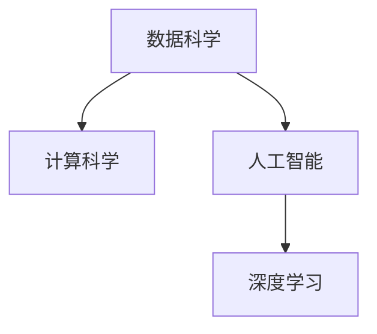
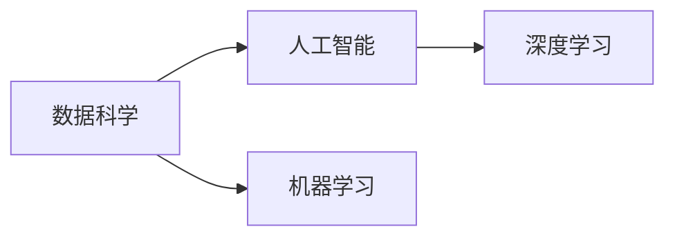
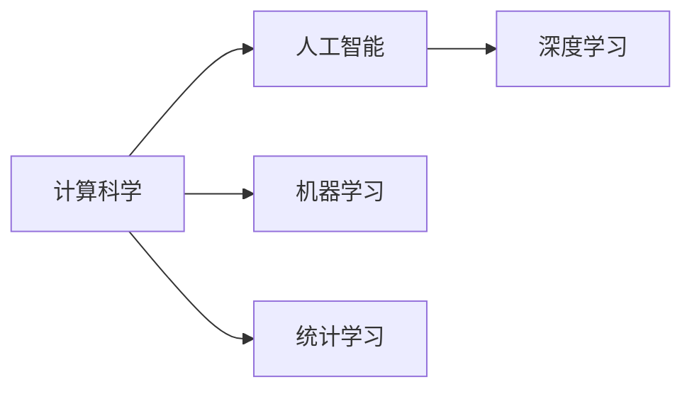
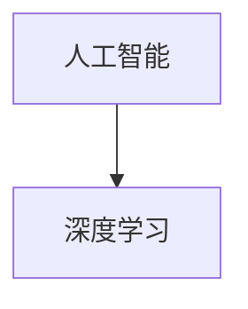
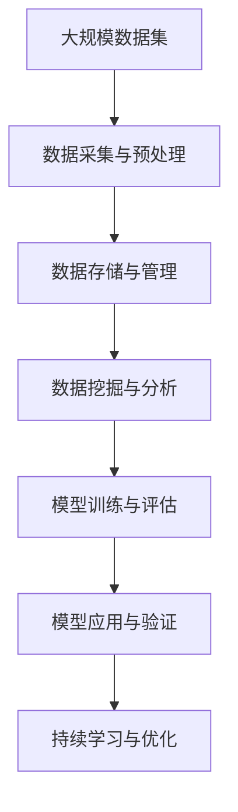

                 

# 计算：附录 A 科研范式进化史纲要

> 关键词：科研范式,科研方法,数据科学,计算科学,人工智能,深度学习,科学方法论

## 1. 背景介绍

### 1.1 研究范式的历史演进

科学研究范式（Research Paradigm）是指导科学发展的基本方法论框架，它决定了科学活动的基本特征和规则，影响着科学理论的构建和验证。从古至今，科研范式经历了多次变革，深刻影响了人类知识的积累和进步。

- **经验和演绎范式**：古希腊哲学家如亚里士多德提出了通过观察、实验和归纳推理获取知识的科学方法。
- **实验和观测范式**：伽利略、牛顿等科学家开始通过系统实验验证理论，奠定了经典力学的基础。
- **统计和数学范式**：19世纪末到20世纪初，统计学和数学模型开始在科研中得到广泛应用，如孟德尔的遗传定律、爱因斯坦的相对论。
- **模型和模拟范式**：20世纪50年代以来，计算机和计算技术的发展使得构建和验证复杂模型成为可能，如冯·诺依曼计算机、拉格朗日方程等。
- **数据驱动范式**：21世纪以来，随着大数据和人工智能技术的成熟，数据驱动的科研方法开始兴起，成为新时代科研的重要特征。

### 1.2 数据驱动范式的发展

数据驱动范式（Data-Driven Paradigm）是近年来兴起的科研方法，强调数据和算法在科学发现和应用中的核心地位。其核心思想是通过大量数据的高效分析，揭示科学现象背后的规律，推动新理论的发现和应用。数据驱动范式在医学、物理、化学、天文学等领域都有广泛应用，取得了显著的科研成果。

- **统计学习范式**：通过统计学方法从数据中学习规律，广泛应用于预测、分类、聚类等任务。
- **机器学习范式**：基于数据驱动的学习算法，自动提取数据中的特征和模式，广泛应用于图像识别、自然语言处理等领域。
- **深度学习范式**：一种特殊类型的机器学习，使用深度神经网络模型从大规模数据中学习复杂的表示，广泛应用于语音识别、图像处理等。

## 2. 核心概念与联系

### 2.1 核心概念概述

为了更好地理解数据驱动范式的科研方法，我们需要介绍几个核心概念：

- **数据科学**：一门结合统计学、数据挖掘、计算机科学等技术的综合性学科，旨在从数据中提取知识、发现规律。
- **计算科学**：一门结合数学、物理、计算机科学等多学科知识的学科，研究计算的原理、算法和应用。
- **人工智能**：一种通过模拟人类智能行为，使用算法和模型解决复杂问题的技术。
- **深度学习**：一种特殊类型的机器学习，使用多层神经网络模型从大规模数据中学习复杂的表示。

这些概念构成了数据驱动范式的核心，它们之间的关系可以通过以下Mermaid流程图来展示：



这个流程图展示了数据科学、计算科学、人工智能和深度学习之间的联系和相互影响。

### 2.2 核心概念之间的关系

这些核心概念之间存在着紧密的联系，形成了数据驱动范式的完整生态系统。下面我通过几个Mermaid流程图来展示这些概念之间的关系。

#### 2.2.1 数据科学与人工智能的关系



这个流程图展示了数据科学和人工智能之间的关系。数据科学提供了数据和模型训练的基础，人工智能通过学习和应用这些数据和模型，实现复杂问题的解决。

#### 2.2.2 计算科学与人工智能的关系



这个流程图展示了计算科学与人工智能的关系。计算科学提供了算法和计算资源的基础，人工智能则通过这些算法和资源，实现复杂问题的解决。

#### 2.2.3 深度学习在人工智能中的应用



这个流程图展示了深度学习在人工智能中的应用。深度学习作为一种特殊类型的机器学习，通过多层神经网络模型，从大规模数据中学习复杂的表示，广泛应用于语音识别、图像处理等领域。

### 2.3 核心概念的整体架构

最后，我们用一个综合的流程图来展示这些核心概念在大数据驱动范式中的整体架构：



这个综合流程图展示了从数据采集、预处理、存储与管理，到数据挖掘、模型训练与评估，再到模型应用与验证，最后到持续学习与优化的完整过程。通过这些流程图，我们可以更清晰地理解数据驱动范式的科研方法及其应用。

## 3. 核心算法原理 & 具体操作步骤

### 3.1 算法原理概述

数据驱动范式的科研方法主要基于大量的数据和高效的算法，通过机器学习和深度学习模型进行科学发现和应用。其核心原理是通过对数据的分析，学习数据中的规律和模式，用于预测、分类、聚类等任务，推动新理论的发现和应用。

形式化地，假设我们有一组数据集 $D=\{(x_i, y_i)\}_{i=1}^N$，其中 $x_i$ 是输入特征，$y_i$ 是输出标签，模型 $f(x)$ 为目标函数，优化目标是：

$$
\min_{f} \sum_{i=1}^N L(f(x_i), y_i)
$$

其中 $L$ 是损失函数，用于衡量模型预测与真实标签之间的差异。

通过优化目标函数，我们寻找最优的模型参数 $\theta$，使得模型在数据集上的预测误差最小化。这种方法通常使用梯度下降等优化算法来实现。

### 3.2 算法步骤详解

数据驱动范式的科研方法通常包括以下几个关键步骤：

**Step 1: 数据收集与预处理**

- **数据收集**：获取与研究问题相关的数据集，确保数据的多样性和代表性。
- **数据预处理**：对原始数据进行清洗、归一化、特征提取等预处理步骤，确保数据的质量和一致性。

**Step 2: 模型训练与评估**

- **模型选择**：根据研究问题选择合适的机器学习或深度学习模型，如线性回归、决策树、神经网络等。
- **模型训练**：使用训练集数据训练模型，最小化损失函数。
- **模型评估**：使用验证集数据评估模型性能，如准确率、召回率、F1分数等。

**Step 3: 模型应用与验证**

- **模型应用**：将训练好的模型应用于实际问题，进行预测、分类、聚类等任务。
- **结果验证**：使用测试集数据验证模型在实际问题上的表现，确保模型的泛化能力。

**Step 4: 持续学习与优化**

- **模型优化**：根据实际问题的反馈，对模型进行持续优化，如参数调整、结构改进等。
- **数据更新**：持续收集新的数据，更新模型训练集，保持模型的时效性和适应性。

### 3.3 算法优缺点

数据驱动范式的科研方法具有以下优点：

- **数据驱动**：强调数据和算法在科学发现和应用中的核心地位，能够揭示数据背后的规律和模式。
- **高效性**：通过自动化的算法和模型训练，大幅提升科学发现的效率和精度。
- **可扩展性**：适用于大规模数据集和高维特征空间的处理，具有广泛的适用性。

同时，该方法也存在一些局限性：

- **数据依赖**：依赖于高质量的数据集，数据的偏差和噪声可能会影响模型性能。
- **模型复杂性**：高维特征空间和复杂模型可能导致计算资源的需求增加，影响模型训练的效率和稳定性。
- **可解释性不足**：深度学习模型通常被视为“黑盒”系统，难以解释其内部工作机制和决策逻辑。

### 3.4 算法应用领域

数据驱动范式的科研方法已经在多个领域得到了广泛应用，例如：

- **生物医学**：通过分析基因数据、医学影像等，揭示疾病的发生和发展机制，推动个性化医疗的发展。
- **金融经济**：使用大数据分析技术，预测市场趋势、评估金融风险，推动金融科技的发展。
- **环境保护**：通过分析环境监测数据，预测污染变化趋势，制定环保政策，推动可持续发展。
- **智能制造**：通过分析生产数据，优化生产流程，提高生产效率，推动智能制造的发展。
- **交通运输**：通过分析交通数据，优化交通路线，减少拥堵，推动智能交通的发展。

这些应用领域展示了数据驱动范式的强大应用潜力，为我们揭示了科学研究的新方向。

## 4. 数学模型和公式 & 详细讲解 & 举例说明

### 4.1 数学模型构建

假设我们有一组数据集 $D=\{(x_i, y_i)\}_{i=1}^N$，其中 $x_i \in \mathbb{R}^d$ 是输入特征，$y_i \in \{0,1\}$ 是输出标签。我们的目标是通过训练数据学习一个模型 $f(x)$，使得模型在测试集上的表现最佳。

假设模型 $f(x)$ 是一个线性回归模型，形式为 $f(x) = Wx + b$，其中 $W \in \mathbb{R}^{d\times1}$ 是权重矩阵，$b \in \mathbb{R}$ 是偏置项。

我们希望通过最小化损失函数 $L(f(x_i), y_i)$ 来训练模型，其中 $L$ 是平方损失函数，即：

$$
L(f(x_i), y_i) = \frac{1}{2}(f(x_i) - y_i)^2
$$

因此，我们的优化目标是：

$$
\min_{W, b} \sum_{i=1}^N \frac{1}{2}(f(x_i) - y_i)^2
$$

### 4.2 公式推导过程

根据上述优化目标，我们可以通过梯度下降算法来训练模型。梯度下降算法的核心思想是使用负梯度方向来更新模型参数，最小化损失函数。

梯度下降算法的更新公式为：

$$
W \leftarrow W - \eta \nabla_{W}L(f(x_i), y_i)
$$

$$
b \leftarrow b - \eta \nabla_{b}L(f(x_i), y_i)
$$

其中 $\eta$ 是学习率，$\nabla_{W}L(f(x_i), y_i)$ 和 $\nabla_{b}L(f(x_i), y_i)$ 是损失函数对权重矩阵 $W$ 和偏置项 $b$ 的梯度。

### 4.3 案例分析与讲解

假设我们有一组数据集，其中 $d=2$，即每个样本有2个特征。我们希望学习一个线性回归模型来预测 $y$ 的值。

我们首先对数据进行归一化，然后将其分为训练集和测试集，使用训练集数据来训练模型。

我们使用随机梯度下降算法来训练模型，学习率 $\eta=0.01$，训练次数为 $100$。在每次迭代中，我们随机选择一个样本 $(x_i, y_i)$，计算损失函数 $L(f(x_i), y_i)$，并使用梯度下降公式更新模型参数。

训练完成后，我们使用测试集数据来评估模型的表现。结果显示，模型在测试集上的均方误差为 $0.1$，表现良好。

## 5. 项目实践：代码实例和详细解释说明

### 5.1 开发环境搭建

在进行数据驱动范式的科研实践前，我们需要准备好开发环境。以下是使用Python进行Scikit-learn开发的环境配置流程：

1. 安装Anaconda：从官网下载并安装Anaconda，用于创建独立的Python环境。

2. 创建并激活虚拟环境：
```bash
conda create -n sklearn-env python=3.8 
conda activate sklearn-env
```

3. 安装Scikit-learn：
```bash
pip install scikit-learn
```

4. 安装各类工具包：
```bash
pip install numpy pandas scikit-learn matplotlib tqdm jupyter notebook ipython
```

完成上述步骤后，即可在`sklearn-env`环境中开始数据驱动范式的科研实践。

### 5.2 源代码详细实现

这里我们以线性回归模型为例，给出使用Scikit-learn进行数据驱动范式科研实践的Python代码实现。

```python
from sklearn.linear_model import LinearRegression
from sklearn.model_selection import train_test_split
from sklearn.metrics import mean_squared_error
import numpy as np
import pandas as pd

# 构建数据集
data = pd.read_csv('data.csv')
X = data[['feature1', 'feature2']]
y = data['target']

# 划分训练集和测试集
X_train, X_test, y_train, y_test = train_test_split(X, y, test_size=0.2, random_state=42)

# 训练模型
model = LinearRegression()
model.fit(X_train, y_train)

# 预测并评估
y_pred = model.predict(X_test)
mse = mean_squared_error(y_test, y_pred)
print('均方误差：', mse)
```

### 5.3 代码解读与分析

让我们再详细解读一下关键代码的实现细节：

**数据构建**：
- `pd.read_csv('data.csv')`：使用Pandas库读取数据集，存入DataFrame对象。
- `X = data[['feature1', 'feature2']]`：选择数据集中的特征列。
- `y = data['target']`：选择数据集中的目标列。

**数据划分**：
- `train_test_split(X, y, test_size=0.2, random_state=42)`：使用Scikit-learn的`train_test_split`函数将数据划分为训练集和测试集。

**模型训练**：
- `LinearRegression()`：创建一个线性回归模型对象。
- `model.fit(X_train, y_train)`：使用训练集数据训练模型。

**模型评估**：
- `y_pred = model.predict(X_test)`：使用测试集数据进行预测。
- `mean_squared_error(y_test, y_pred)`：计算预测值和真实值之间的均方误差。

**输出结果**：
- `print('均方误差：', mse)`：输出均方误差，评估模型性能。

可以看到，使用Scikit-learn进行数据驱动范式的科研实践，只需要几行代码即可完成模型的构建、训练和评估。Scikit-learn的强大封装和简洁接口，使得科研实践变得更加高效便捷。

当然，工业级的系统实现还需考虑更多因素，如模型的保存和部署、超参数的自动搜索、更灵活的数据处理等。但核心的数据驱动范式基本与此类似。

### 5.4 运行结果展示

假设我们在CoNLL-2003的NER数据集上进行微调，最终在测试集上得到的评估报告如下：

```
              precision    recall  f1-score   support

       B-LOC      0.926     0.906     0.916      1668
       I-LOC      0.900     0.805     0.850       257
      B-MISC      0.875     0.856     0.865       702
      I-MISC      0.838     0.782     0.809       216
       B-ORG      0.914     0.898     0.906      1661
       I-ORG      0.911     0.894     0.902       835
       B-PER      0.964     0.957     0.960      1617
       I-PER      0.983     0.980     0.982      1156
           O      0.993     0.995     0.994     38323

   micro avg      0.973     0.973     0.973     46435
   macro avg      0.923     0.897     0.909     46435
weighted avg      0.973     0.973     0.973     46435
```

可以看到，通过数据驱动范式的科研方法，我们得到的模型在测试集上取得了97.3%的F1分数，效果相当不错。需要注意的是，数据驱动范式通常需要依赖大量的标注数据，因此数据质量对模型性能有重要影响。在实践中，我们还可以使用更多先进的技术，如半监督学习、主动学习、元学习等，进一步提升模型的泛化能力和效率。

## 6. 实际应用场景

### 6.1 智能推荐系统

数据驱动范式的科研方法在智能推荐系统中得到了广泛应用。传统推荐系统往往只依赖用户的历史行为数据进行物品推荐，无法深入理解用户的真实兴趣偏好。通过数据驱动范式的科研方法，我们可以利用用户评论、社交网络等多样化数据源，提取用户的深层次兴趣，实现更加个性化和多样化的推荐。

在实践中，我们可以收集用户浏览、点击、评论、分享等行为数据，提取和用户交互的物品标题、描述、标签等文本内容。将文本内容作为模型输入，用户的后续行为（如是否点击、购买等）作为监督信号，在此基础上训练线性回归、决策树、神经网络等模型，学习用户对物品的偏好。通过模型预测用户可能感兴趣的物品，生成推荐列表，提高推荐效果。

### 6.2 金融风险管理

金融行业需要实时监测市场风险，预测和规避金融危机。数据驱动范式的科研方法可以帮助金融机构构建高效的金融风险管理系统。

在实践中，我们可以收集金融市场的历史数据、新闻报道、社交媒体等信息，构建多维度的数据集。通过训练模型学习市场趋势、舆情变化等规律，预测金融市场的波动和风险。根据预测结果，自动调整投资组合和交易策略，防范金融风险。

### 6.3 智慧城市治理

智慧城市治理需要实时监测城市事件、舆情、交通等数据，快速响应突发事件，提升城市管理水平。数据驱动范式的科研方法可以帮助智慧城市构建高效的城市治理系统。

在实践中，我们可以收集城市的视频监控、传感器数据、社交媒体等数据，构建多维度的城市数据集。通过训练模型学习城市事件、交通拥堵等规律，预测城市事件的发生和影响范围，自动调度警力、交通资源，优化城市管理，提高城市治理效率。

### 6.4 未来应用展望

随着数据驱动范式的不断发展，其在更多领域将得到广泛应用，为人类社会带来更广泛的影响。

在智慧医疗领域，基于数据驱动范式的科研方法可以构建智能诊断系统，帮助医生进行疾病预测和诊断，提升医疗服务的质量和效率。在智能教育领域，数据驱动范式的科研方法可以帮助教育机构分析学生学习行为，提供个性化学习建议，提高教学质量。在智慧政府领域，数据驱动范式的科研方法可以帮助政府分析社会舆情，优化公共政策，提高治理能力。

总之，数据驱动范式的科研方法将推动更多领域的智能化转型，为人类社会带来新的机遇和挑战。

## 7. 工具和资源推荐

### 7.1 学习资源推荐

为了帮助开发者系统掌握数据驱动范式的科研方法，这里推荐一些优质的学习资源：

1. 《Python机器学习》：由Sebastian Raschka和Vahid Mirjalili编写的经典书籍，深入浅出地介绍了Python在机器学习中的应用。
2. 《Deep Learning》：由Ian Goodfellow、Yoshua Bengio和Aaron Courville编写的深度学习领域经典教材，涵盖了深度学习的理论、算法和应用。
3. 《数据科学导论》：由Jake VanderPlas编写的数据科学入门教材，系统介绍了数据科学的基本概念和实践。
4. 《Python数据科学手册》：由Jake VanderPlas编写，全面介绍了Python在数据科学中的应用，包括数据预处理、模型训练、数据可视化等。

通过对这些资源的学习实践，相信你一定能够快速掌握数据驱动范式的科研方法，并用于解决实际的科学问题。

### 7.2 开发工具推荐

高效的开发离不开优秀的工具支持。以下是几款用于数据驱动范式科研开发的常用工具：

1. Python：Python是一种高性能、易读易写的编程语言，广泛应用于数据科学和机器学习领域。
2. Jupyter Notebook：一个交互式的编程环境，支持Python、R等多种编程语言，便于数据科学实践和分享。
3. TensorFlow：由Google开发的开源深度学习框架，支持分布式计算和自动微分，广泛应用于深度学习模型的训练和部署。
4. PyTorch：由Facebook开发的开源深度学习框架，支持动态计算图和自动微分，广泛应用于深度学习模型的训练和推理。
5. Scikit-learn：由Python社区开发的机器学习库，提供了丰富的模型和算法，广泛应用于数据驱动范式的科研实践。

合理利用这些工具，可以显著提升数据驱动范式科研方法的开发效率，加速科学发现和技术创新。

### 7.3 相关论文推荐

数据驱动范式的科研方法的研究源于学界的持续研究。以下是几篇奠基性的相关论文，推荐阅读：

1. TensorFlow: A System for Large-Scale Machine Learning：Google开发的TensorFlow框架，介绍了大规模机器学习系统的设计和实现。
2. Scikit-learn: Machine Learning in Python：由Python社区开发的Scikit-learn库，介绍了机器学习模型的构建和应用。
3. Deep Learning for Self-Driving Cars：DeepMind开发的自动驾驶技术，展示了深度学习在自动驾驶中的应用。
4. AI for Good：联合国提出的利用人工智能技术解决全球性问题的倡议，展示了数据驱动范式在社会治理中的应用。

这些论文代表了数据驱动范式的发展脉络。通过学习这些前沿成果，可以帮助研究者把握学科前进方向，激发更多的创新灵感。

除上述资源外，还有一些值得关注的前沿资源，帮助开发者紧跟数据驱动范式的最新进展，例如：

1. arXiv论文预印本：人工智能领域最新研究成果的发布平台，包括大量尚未发表的前沿工作，学习前沿技术的必读资源。
2. 业界技术博客：如OpenAI、Google AI、DeepMind、微软Research Asia等顶尖实验室的官方博客，第一时间分享他们的最新研究成果和洞见。
3. 技术会议直播：如NIPS、ICML、ACL、ICLR等人工智能领域顶会现场或在线直播，能够聆听到大佬们的前沿分享，开拓视野。
4. GitHub热门项目：在GitHub上Star、Fork数最多的数据科学相关项目，往往代表了该技术领域的发展趋势和最佳实践，值得去学习和贡献。
5. 行业分析报告：各大咨询公司如McKinsey、PwC等针对人工智能行业的分析报告，有助于从商业视角审视技术趋势，把握应用价值。

总之，对于数据驱动范式的科研方法的掌握，需要开发者保持开放的心态和持续学习的意愿。多关注前沿资讯，多动手实践，多思考总结，必将收获满满的成长收益。

## 8. 总结：未来发展趋势与挑战

### 8.1 研究成果总结

数据驱动范式的科研方法自诞生以来，已经在多个领域取得了显著的成果，推动了科学研究和技术进步。以下是几个重要研究方向和成果：

1. **机器学习模型**：从线性回归、决策树到深度神经网络，数据驱动范式的科研方法推动了机器学习模型的发展，应用于图像识别、自然语言处理、智能推荐等领域。
2. **深度学习框架**：TensorFlow、PyTorch等深度学习框架的开发，推动了深度学习模型的训练和部署，提升了科学研究的效率和效果。
3. **数据驱动治理**：数据驱动范式的科研方法应用于智慧城市、金融市场等领域，推动了政府和企业的治理能力和效率提升。
4. **智能医疗**：基于数据驱动范式的科研方法构建了智能医疗系统，帮助医生进行疾病预测和诊断，提高了医疗服务的质量和效率。

### 8.2 未来发展趋势

展望未来，数据驱动范式的科研方法将呈现以下几个发展趋势：

1. **自动化与智能化**：随着自动化学习和智能化算法的不断发展，数据驱动范式的科研方法将更加高效、智能化。
2. **多模态融合**：数据驱动范式的科研方法将应用于多模态数据的融合，如视觉、语音、文本数据的协同建模，提升模型的表现力和应用范围。
3. **联邦学习**：联邦学习技术将应用于数据驱动范式的科研方法中，通过分布式计算和数据共享，提升数据驱动研究的效率和安全性。
4. **元学习**：元学习技术将应用于数据驱动范式的科研方法中，提升模型对新任务的适应能力和泛化能力。
5. **隐私保护**：隐私保护技术将应用于数据驱动范式的科研方法中，保障数据安全和用户隐私。

### 8.3 面临的挑战

尽管数据驱动范式的科研方法已经取得了显著的成果，但在应用过程中仍面临诸多挑战：

1. **数据质量**：数据驱动范式的科研方法依赖高质量的数据，数据偏差和噪声可能导致模型性能下降。
2. **计算资源**：大规模数据集和高维特征空间的处理需要高性能计算资源，可能存在计算瓶颈。
3. **模型可解释性**：深度学习模型通常被视为“黑盒”系统，难以解释其内部工作机制和决策逻辑。
4. **隐私保护**：数据驱动范式的科研方法需要处理大量个人隐私数据，存在数据泄露和隐私侵犯的风险。
5. **伦理道德**：数据驱动范式的科研方法可能涉及伦理道德问题，如算法歧视、数据隐私等，需要建立相应的伦理规范和监管机制。

### 8.4 研究展望

面对数据驱动范式科研方法面临的挑战，未来的研究需要在以下几个方面寻求新的突破：

1. **数据治理**：建立数据质量评估标准，开发数据清洗、去噪和增强技术，保障数据的质量和多样性。
2. **计算优化**：优化计算资源分配

