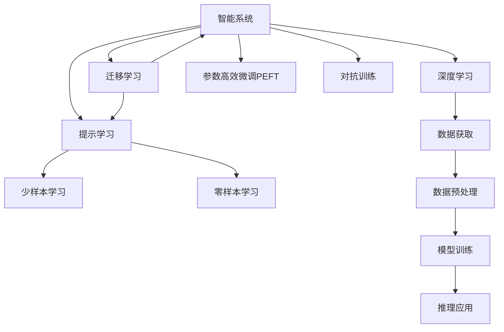
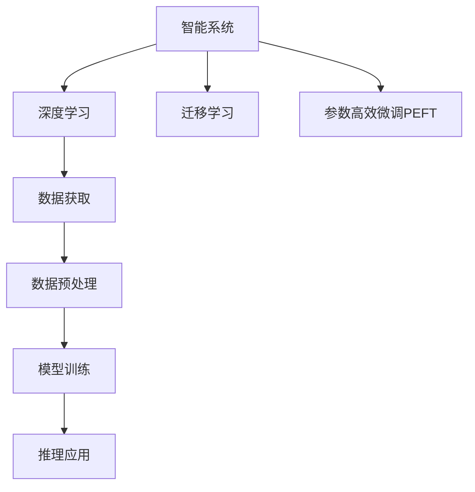
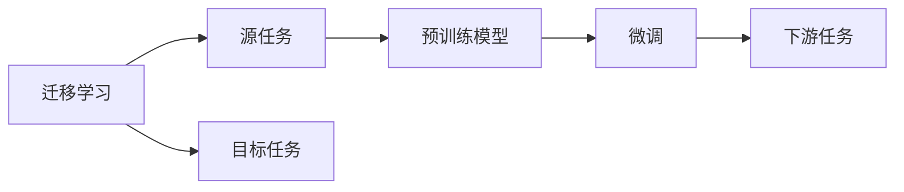
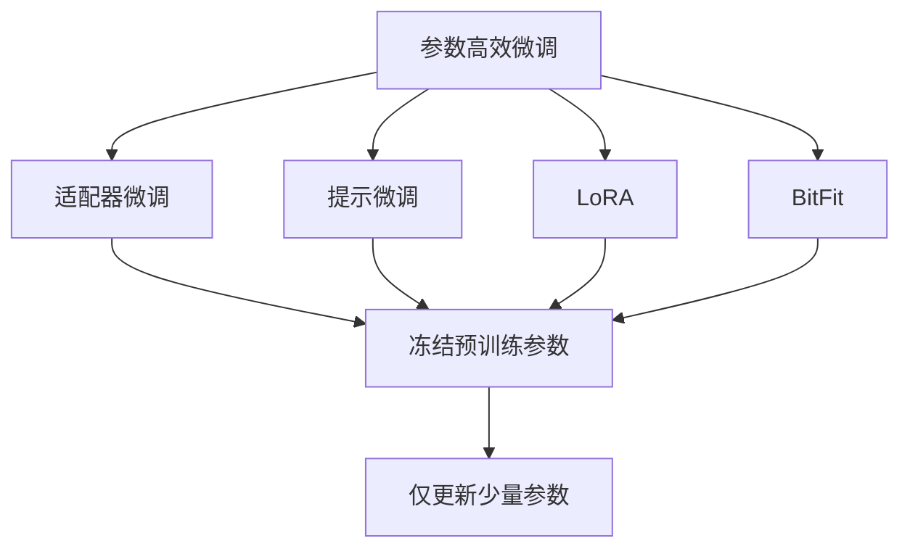
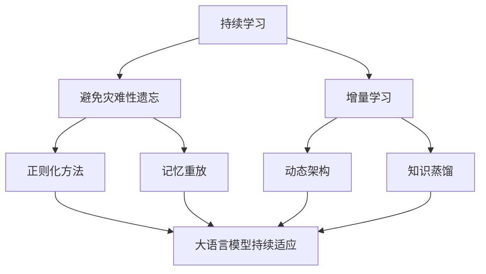
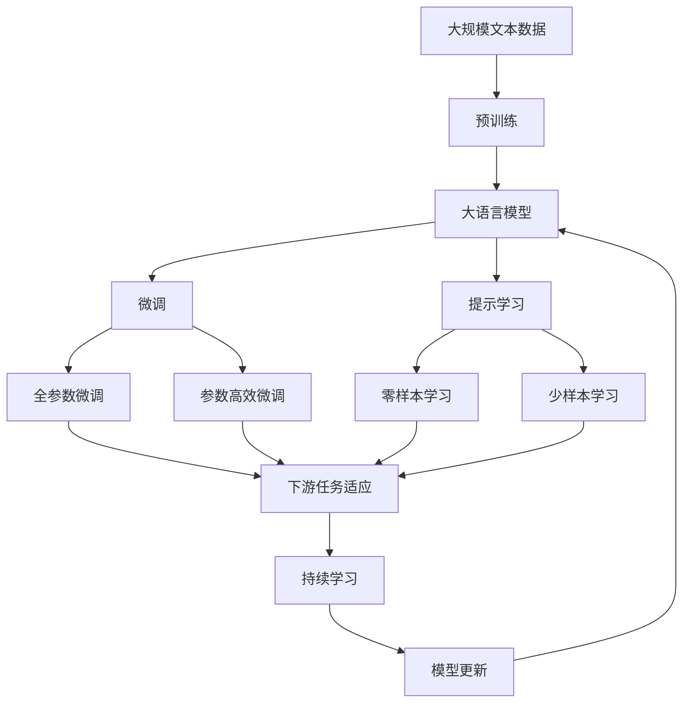

                 

# 计算：附录 C 世界需要什么样的智能系统

> 关键词：智能系统,算法原理,核心概念,实际应用

## 1. 背景介绍

### 1.1 问题由来
在全球数字化转型加速的背景下，智能系统（Intelligent Systems）成为了各行各业提升效率、优化决策、改善用户体验的关键技术。然而，当前智能系统的发展面临诸多挑战，如泛化能力不足、可解释性差、安全性低等，难以满足实际需求。因此，如何设计出高效、鲁棒、可靠的智能系统，成为人工智能领域的重要研究方向。

### 1.2 问题核心关键点
智能系统通常包括数据获取、数据预处理、模型训练、推理应用等环节。其中，模型训练是智能系统设计的核心，也是本文关注的焦点。模型训练的目标是利用大量标注数据，通过优化算法，使模型在特定任务上表现出色。然而，如何设计合理的模型架构、选择合适的优化算法、避免过拟合、提高泛化能力，是智能系统训练中的关键问题。

### 1.3 问题研究意义
研究智能系统的模型训练方法，有助于提升智能系统在各个领域的应用效果，加速技术落地应用。通过合理的模型设计和技术优化，可以在保证高性能的前提下，提升系统稳定性、安全性，改善用户体验。这不仅有助于各行业的智能化转型，还能推动技术的发展，为未来智能系统的设计和应用提供指导。

## 2. 核心概念与联系

### 2.1 核心概念概述

为更好地理解智能系统的模型训练方法，本节将介绍几个密切相关的核心概念：

- 智能系统（Intelligent System）：利用人工智能技术，自动执行复杂任务的系统。包括知识表示、推理、规划、感知、学习等关键环节。
- 深度学习（Deep Learning）：基于人工神经网络的机器学习技术，具有强大的特征提取和建模能力。广泛应用于计算机视觉、自然语言处理、语音识别等领域。
- 迁移学习（Transfer Learning）：将一个领域学习到的知识，迁移到另一个相关领域的学习方法。广泛应用于大模型微调、知识迁移等场景。
- 参数高效微调（Parameter-Efficient Fine-Tuning, PEFT）：在微调过程中，只更新少量的模型参数，而固定大部分预训练权重不变，以提高微调效率，避免过拟合的方法。
- 对抗训练（Adversarial Training）：通过加入对抗样本，提高模型鲁棒性，避免模型被恶意攻击或误导。
- 提示学习（Prompt Learning）：通过在输入文本中添加提示模板，引导大语言模型进行特定任务的推理和生成。可以在不更新模型参数的情况下，实现零样本或少样本学习。
- 少样本学习（Few-shot Learning）：在只有少量标注样本的情况下，模型能够快速适应新任务的学习方法。在大语言模型中，通常通过在输入中提供少量示例来实现。
- 零样本学习（Zero-shot Learning）：在没有任何特定任务的训练样本的情况下，仅凭任务描述就能够执行新任务的能力。大语言模型通过预训练获得的广泛知识，使其能够理解任务指令并生成相应输出。

这些核心概念之间的逻辑关系可以通过以下Mermaid流程图来展示：



这个流程图展示了大语言模型微调过程中各个核心概念的关系和作用：

1. 智能系统通过深度学习进行特征提取和模型训练。
2. 迁移学习是连接预训练模型与下游任务的桥梁，可以通过微调或提示学习来实现。
3. 参数高效微调方法可以在固定大部分预训练参数的情况下，仍可取得不错的提升。
4. 对抗训练提高模型鲁棒性，避免模型被攻击或误导。
5. 提示学习实现零样本和少样本学习，减少微调参数。
6. 少样本学习在少量标注数据下仍能快速适应新任务。
7. 零样本学习在没有任何特定任务训练样本的情况下，仍能完成任务。

这些概念共同构成了智能系统的学习和应用框架，使其能够在各种场景下发挥强大的智能能力。通过理解这些核心概念，我们可以更好地把握智能系统的工作原理和优化方向。

### 2.2 概念间的关系

这些核心概念之间存在着紧密的联系，形成了智能系统的完整生态系统。下面我通过几个Mermaid流程图来展示这些概念之间的关系。

#### 2.2.1 智能系统的学习范式



这个流程图展示了大语言模型的学习过程，包括数据获取、预处理、训练、推理等环节。

#### 2.2.2 迁移学习与微调的关系



这个流程图展示了迁移学习的基本原理，以及它与微调的关系。迁移学习涉及源任务和目标任务，预训练模型在源任务上学习，然后通过微调适应各种下游任务（目标任务）。

#### 2.2.3 参数高效微调方法



这个流程图展示了几种常见的参数高效微调方法，包括适配器微调、提示微调、LoRA和BitFit。这些方法的共同特点是冻结大部分预训练参数，只更新少量参数，从而提高微调效率。

#### 2.2.4 持续学习在大语言模型中的应用



这个流程图展示了持续学习在大语言模型中的应用。持续学习的主要目标是避免灾难性遗忘和实现增量学习。通过正则化方法、记忆重放、动态架构和知识蒸馏等技术，可以使大语言模型持续适应新的任务和数据。

### 2.3 核心概念的整体架构

最后，我们用一个综合的流程图来展示这些核心概念在大语言模型微调过程中的整体架构：



这个综合流程图展示了从预训练到微调，再到持续学习的完整过程。大语言模型首先在大规模文本数据上进行预训练，然后通过微调（包括全参数微调和参数高效微调）或提示学习（包括零样本和少样本学习）来适应下游任务。最后，通过持续学习技术，模型可以不断更新和适应新的任务和数据。 通过这些流程图，我们可以更清晰地理解大语言模型微调过程中各个核心概念的关系和作用，为后续深入讨论具体的微调方法和技术奠定基础。

## 3. 核心算法原理 & 具体操作步骤
### 3.1 算法原理概述

基于深度学习的智能系统模型训练，本质上是一个参数优化问题。其核心思想是：利用标注数据，通过优化算法最小化模型预测与真实标签之间的差异，从而提升模型在特定任务上的性能。

形式化地，假设智能系统模型为 $M_{\theta}:\mathcal{X} \rightarrow \mathcal{Y}$，其中 $\mathcal{X}$ 为输入空间，$\mathcal{Y}$ 为输出空间，$\theta$ 为模型参数。假设训练集为 $D=\{(x_i,y_i)\}_{i=1}^N, x_i \in \mathcal{X}, y_i \in \mathcal{Y}$。

定义模型 $M_{\theta}$ 在数据样本 $(x,y)$ 上的损失函数为 $\ell(M_{\theta}(x),y)$，则在数据集 $D$ 上的经验风险为：

$$
\mathcal{L}(\theta) = \frac{1}{N} \sum_{i=1}^N \ell(M_{\theta}(x_i),y_i)
$$

模型训练的目标是最小化经验风险，即找到最优参数：

$$
\theta^* = \mathop{\arg\min}_{\theta} \mathcal{L}(\theta)
$$

在实践中，我们通常使用基于梯度的优化算法（如SGD、Adam等）来近似求解上述最优化问题。设 $\eta$ 为学习率，$\lambda$ 为正则化系数，则参数的更新公式为：

$$
\theta \leftarrow \theta - \eta \nabla_{\theta}\mathcal{L}(\theta) - \eta\lambda\theta
$$

其中 $\nabla_{\theta}\mathcal{L}(\theta)$ 为损失函数对参数 $\theta$ 的梯度，可通过反向传播算法高效计算。

### 3.2 算法步骤详解

基于深度学习的智能系统模型训练一般包括以下几个关键步骤：

**Step 1: 准备训练数据**
- 收集与任务相关的标注数据集 $D=\{(x_i,y_i)\}_{i=1}^N, x_i \in \mathcal{X}, y_i \in \mathcal{Y}$，确保数据质量。
- 将数据集划分为训练集、验证集和测试集，一般要求标注数据与预训练数据的分布不要差异过大。

**Step 2: 设计模型架构**
- 选择合适的深度学习模型结构，如卷积神经网络（CNN）、循环神经网络（RNN）、Transformer等。
- 添加任务适配层，如分类层、回归层、解码器等，确保模型输出符合任务需求。

**Step 3: 设置超参数**
- 选择合适的优化算法及其参数，如Adam、SGD等，设置学习率、批大小、迭代轮数等。
- 设置正则化技术及强度，包括权重衰减、Dropout、Early Stopping等。
- 确定冻结预训练参数的策略，如仅微调顶层，或全部参数都参与微调。

**Step 4: 执行梯度训练**
- 将训练集数据分批次输入模型，前向传播计算损失函数。
- 反向传播计算参数梯度，根据设定的优化算法和学习率更新模型参数。
- 周期性在验证集上评估模型性能，根据性能指标决定是否触发 Early Stopping。
- 重复上述步骤直到满足预设的迭代轮数或 Early Stopping 条件。

**Step 5: 测试和部署**
- 在测试集上评估微调后模型 $M_{\hat{\theta}}$ 的性能，对比微调前后的精度提升。
- 使用微调后的模型对新样本进行推理预测，集成到实际的应用系统中。
- 持续收集新的数据，定期重新微调模型，以适应数据分布的变化。

以上是基于深度学习的智能系统模型训练的一般流程。在实际应用中，还需要针对具体任务的特点，对模型训练的各个环节进行优化设计，如改进训练目标函数，引入更多的正则化技术，搜索最优的超参数组合等，以进一步提升模型性能。

### 3.3 算法优缺点

基于深度学习的智能系统模型训练方法具有以下优点：
1. 灵活高效。可以针对各种复杂任务设计不同的模型架构，灵活应对任务需求。
2. 通用适用。广泛应用于计算机视觉、自然语言处理、语音识别等多个领域，并取得了显著效果。
3. 精度高。深度学习模型通过大量的数据训练，具有很强的泛化能力，能够在大规模数据上取得高精度结果。

同时，该方法也存在一定的局限性：
1. 数据依赖。模型训练高度依赖标注数据，标注成本高、获取难度大，对数据质量和多样性有较高要求。
2. 过拟合风险。深度模型通常具有较多参数，容易发生过拟合，需要引入正则化等方法避免过拟合。
3. 资源消耗大。深度学习模型通常需要高性能硬件支持，计算资源消耗大，训练时间长。
4. 可解释性差。深度学习模型通常为"黑盒"系统，难以解释其决策过程，缺乏可解释性。
5. 安全性不足。深度学习模型在训练过程中容易引入偏见和有害信息，难以确保安全性。

尽管存在这些局限性，但深度学习模型训练仍然是大规模智能化系统设计和开发的主流方法，具有广泛的应用前景。未来研究重点在于如何解决数据依赖、过拟合风险、资源消耗、可解释性和安全性等问题，以提升智能系统的性能和可靠性。

### 3.4 算法应用领域

基于深度学习的智能系统模型训练方法，在多个领域已经得到了广泛的应用，包括但不限于：

1. 计算机视觉：如图像分类、目标检测、图像生成等。通过大规模图像数据训练深度卷积神经网络，实现高效的图像理解和生成。
2. 自然语言处理：如机器翻译、文本分类、情感分析等。通过大规模文本数据训练深度循环神经网络或Transformer模型，实现语言的理解和生成。
3. 语音识别：如自动语音识别、语音合成等。通过大规模语音数据训练深度循环神经网络，实现语音的识别和生成。
4. 推荐系统：如个性化推荐、广告推荐等。通过用户行为数据训练深度神经网络，实现个性化的商品推荐。
5. 智能交互：如智能客服、虚拟助手等。通过用户交互数据训练深度神经网络，实现智能对话和决策。
6. 医疗诊断：如医学影像诊断、疾病预测等。通过医疗数据训练深度神经网络，实现高效的医疗诊断和预测。

除了上述这些经典应用外，深度学习模型训练还在更多场景中得到了创新性的应用，如可控文本生成、常识推理、代码生成、数据增强等，为各行各业带来了新的突破。

## 4. 数学模型和公式 & 详细讲解  
### 4.1 数学模型构建

本节将使用数学语言对基于深度学习的智能系统模型训练过程进行更加严格的刻画。

记智能系统模型为 $M_{\theta}:\mathcal{X} \rightarrow \mathcal{Y}$，其中 $\mathcal{X}$ 为输入空间，$\mathcal{Y}$ 为输出空间，$\theta$ 为模型参数。假设训练集为 $D=\{(x_i,y_i)\}_{i=1}^N, x_i \in \mathcal{X}, y_i \in \mathcal{Y}$。

定义模型 $M_{\theta}$ 在数据样本 $(x,y)$ 上的损失函数为 $\ell(M_{\theta}(x),y)$，则在数据集 $D$ 上的经验风险为：

$$
\mathcal{L}(\theta) = \frac{1}{N} \sum_{i=1}^N \ell(M_{\theta}(x_i),y_i)
$$

模型训练的目标是最小化经验风险，即找到最优参数：

$$
\theta^* = \mathop{\arg\min}_{\theta} \mathcal{L}(\theta)
$$

在实践中，我们通常使用基于梯度的优化算法（如SGD、Adam等）来近似求解上述最优化问题。设 $\eta$ 为学习率，$\lambda$ 为正则化系数，则参数的更新公式为：

$$
\theta \leftarrow \theta - \eta \nabla_{\theta}\mathcal{L}(\theta) - \eta\lambda\theta
$$

其中 $\nabla_{\theta}\mathcal{L}(\theta)$ 为损失函数对参数 $\theta$ 的梯度，可通过反向传播算法高效计算。

### 4.2 公式推导过程

以下我们以二分类任务为例，推导交叉熵损失函数及其梯度的计算公式。

假设模型 $M_{\theta}$ 在输入 $x$ 上的输出为 $\hat{y}=M_{\theta}(x) \in [0,1]$，表示样本属于正类的概率。真实标签 $y \in \{0,1\}$。则二分类交叉熵损失函数定义为：

$$
\ell(M_{\theta}(x),y) = -[y\log \hat{y} + (1-y)\log (1-\hat{y})]
$$

将其代入经验风险公式，得：

$$
\mathcal{L}(\theta) = -\frac{1}{N}\sum_{i=1}^N [y_i\log M_{\theta}(x_i)+(1-y_i)\log(1-M_{\theta}(x_i))]
$$

根据链式法则，损失函数对参数 $\theta_k$ 的梯度为：

$$
\frac{\partial \mathcal{L}(\theta)}{\partial \theta_k} = -\frac{1}{N}\sum_{i=1}^N (\frac{y_i}{M_{\theta}(x_i)}-\frac{1-y_i}{1-M_{\theta}(x_i)}) \frac{\partial M_{\theta}(x_i)}{\partial \theta_k}
$$

其中 $\frac{\partial M_{\theta}(x_i)}{\partial \theta_k}$ 可进一步递归展开，利用自动微分技术完成计算。

在得到损失函数的梯度后，即可带入参数更新公式，完成模型的迭代优化。重复上述过程直至收敛，最终得到适应下游任务的最优模型参数 $\theta^*$。

## 5. 项目实践：代码实例和详细解释说明
### 5.1 开发环境搭建

在进行深度学习模型训练前，我们需要准备好开发环境。以下是使用Python进行TensorFlow开发的环境配置流程：

1. 安装Anaconda：从官网下载并安装Anaconda，用于创建独立的Python环境。

2. 创建并激活虚拟环境：
```bash
conda create -n tensorflow-env python=3.8 
conda activate tensorflow-env
```

3. 安装TensorFlow：根据CUDA版本，从官网获取对应的安装命令。例如：
```bash
conda install tensorflow tensorflow-gpu=2.5 -c conda-forge -c pytorch
```

4. 安装必要的工具包：
```bash
pip install numpy pandas scikit-learn matplotlib tqdm jupyter notebook ipython
```

完成上述步骤后，即可在`tensorflow-env`环境中开始模型训练。

### 5.2 源代码详细实现

下面我们以二分类任务为例，给出使用TensorFlow实现深度学习模型训练的代码实现。

首先，定义模型和损失函数：

```python
import tensorflow as tf
from tensorflow.keras.layers import Dense, Dropout
from tensorflow.keras.models import Sequential
from tensorflow.keras.losses import BinaryCrossentropy

# 定义模型架构
model = Sequential([
    Dense(64, input_dim=784, activation='relu'),
    Dropout(0.5),
    Dense(1, activation='sigmoid')
])

# 定义损失函数
loss_fn = BinaryCrossentropy()

# 编译模型
model.compile(optimizer='adam', loss=loss_fn)
```

然后，定义训练和评估函数：

```python
from tensorflow.keras.datasets import mnist
from tensorflow.keras.utils import to_categorical

# 加载MNIST数据集
(x_train, y_train), (x_test, y_test) = mnist.load_data()

# 数据预处理
x_train = x_train.reshape(60000, 784) / 255.0
x_test = x_test.reshape(10000, 784) / 255.0
y_train = to_categorical(y_train, 10)
y_test = to_categorical(y_test, 10)

# 训练函数
def train_epoch(model, dataset, batch_size, optimizer):
    dataloader = tf.data.Dataset.from_tensor_slices(dataset)
    dataloader = dataloader.shuffle(buffer_size=1024).batch(batch_size).prefetch(tf.data.experimental.AUTOTUNE)
    model.fit(dataloader, epochs=1, callbacks=[tf.keras.callbacks.EarlyStopping(patience=5)])

# 评估函数
def evaluate(model, dataset, batch_size):
    dataloader = tf.data.Dataset.from_tensor_slices(dataset)
    dataloader = dataloader.batch(batch_size).prefetch(tf.data.experimental.AUTOTUNE)
    y_pred = model.predict(dataloader, verbose=0)
    return tf.argmax(y_pred, axis=1) == tf.argmax(y_true, axis=1)

# 训练过程
epochs = 10
batch_size = 64

for epoch in range(epochs):
    print(f"Epoch {epoch+1}, train accuracy: {train_epoch(model, (x_train, y_train), batch_size, optimizer):.4f}")
    print(f"Epoch {epoch+1}, test accuracy: {evaluate(model, (x_test, y_test), batch_size):.4f}")
```

以上就是使用TensorFlow进行深度学习模型训练的完整代码实现。可以看到，通过TensorFlow的高级API，我们可以用非常简洁的代码实现模型定义、编译、训练、评估等关键步骤。

### 5.3 代码解读与分析

让我们再详细解读一下关键代码的实现细节：

**模型定义与编译**：
- 使用`Sequential`模型定义多层神经网络结构。
- 添加全连接层、Dropout层和输出层。
- 使用`BinaryCrossentropy`定义二分类交叉熵损失函数。
- 使用`model.compile`编译模型，指定优化器、损失函数等参数。

**数据预处理**：
- 将原始图像数据展平为一维向量，并进行归一化。
- 将标签转换为one-hot编码。
- 使用`tf.data.Dataset`创建数据集对象，并进行预处理操作，如数据增强、批处理、随机化等。

**训练和评估函数**：
- 定义`train_epoch`函数，通过数据集对象进行训练，设置EarlyStopping回调函数，避免过拟合。
- 定义`evaluate`函数，计算模型在测试集上的准确率。
- 使用`for`循环进行多轮训练，并输出每个epoch的训练和测试结果。

可以看到，TensorFlow提供了一站式的深度学习框架，能够快速实现模型的训练和评估，极大地简化了模型开发流程。当然，实际应用中还需要考虑更多因素，如模型裁剪、量化加速、服务化封装等。

## 6. 实际应用场景
### 6.1 智能客服系统

基于深度学习的智能客服系统，可以自动处理客户咨询，提高服务效率和用户体验。该系统通过自然语言处理技术，将客户咨询转化为文本输入，输入到训练好的深度学习模型中，生成自动回复。

具体而言，可以收集企业内部的历史客服对话记录，标注出问题和最佳答复，构建监督数据集。在数据集上训练深度学习模型，并使用对抗训练等技术提升模型鲁棒性。微调后的模型可以实时响应用户咨询，生成流畅自然的回复，显著提高客服系统的响应速度和服务质量。

### 6.2 金融舆情监测

金融机构需要实时监测市场舆论动向，以便及时应对负面信息传播，规避金融风险。通过深度学习模型，可以从新闻、报道、评论等文本数据中自动提取舆情信息，进行情感分析。

具体实现时，可以收集金融领域相关的新闻、报道、评论等文本数据，构建情感标注数据集。在数据集上训练深度学习模型，并使用对抗训练等技术提升模型鲁棒性。微调后的模型可以实时监测网络舆情，及时预警市场异常，辅助金融机构做出风险控制决策。

### 6.3 个性化推荐系统

当前的推荐系统往往只依赖用户的历史行为数据进行物品推荐，无法深入理解用户的真实兴趣偏好。深度学习模型通过用户行为数据进行训练，可以挖掘出用户深层次的兴趣点，从而实现更加个性化、精准的推荐。

具体实现时，可以收集用户浏览、点击、评论、分享等行为数据，并从中提取文本特征。在特征上训练深度学习模型，并使用对抗训练等技术提升模型鲁棒性。微调后的模型可以根据用户的行为和兴趣，实时生成个性化的商品推荐列表，提升用户体验和满意度。

### 6.4 未来应用展望

随着深度学习模型的不断发展，智能系统的应用范围将不断扩展，带来更多的行业变革。

在智慧医疗领域，基于深度学习模型的智能诊断系统可以自动分析医学影像，识别疾病病灶，辅助医生做出诊断决策。在智能教育领域，基于深度学习模型的智能教育系统可以自动评估学生作业，提供个性化的学习建议。在智慧城市治理中，基于深度学习模型的智能交通系统可以自动分析交通数据，优化交通信号灯控制，提升城市交通效率。

除了上述这些行业应用外，深度学习模型还在更多领域得到创新性应用，如金融风控、智能制造、智能农业等，为各行各业带来新的技术突破。

## 7. 工具和资源推荐
### 7.1 学习资源推荐

为了

