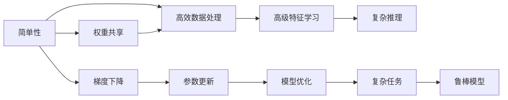

                 

# 认知发展中的简单与深刻

在人工智能的快速发展过程中，深度学习技术逐渐成为主流的解决方案，并在各行各业得到了广泛的应用。然而，深度学习并非简单的“黑盒”模型，其内部蕴含着丰富的认知结构和优化方法。本文将深入探讨深度学习中的简单与深刻概念，以及它们在认知发展中的作用和影响，以期对人工智能技术的研究和应用提供有价值的见解。

## 1. 背景介绍

### 1.1 深度学习的基本概念
深度学习（Deep Learning）是一种基于神经网络的机器学习技术，通过多层非线性映射实现对复杂数据的表示和处理。与传统的机器学习算法相比，深度学习能够自动地从数据中学习出高级抽象特征，并通过多层次的特征融合，实现更加准确和鲁棒的模型预测。深度学习的成功主要依赖于大规模的标注数据、高性能的计算资源和先进的算法优化技术。

### 1.2 认知发展的基本原理
认知发展是指个体在成长过程中，通过学习和经验获取、整合、应用知识的过程。这一过程不仅涉及对知识的表征、理解和应用，还涉及到对思维方式的适应和进化。在认知发展的研究中，深度学习提供了一种强大的工具和方法，帮助我们理解复杂的信息处理机制。

## 2. 核心概念与联系

### 2.1 核心概念概述
深度学习中的简单与深刻概念主要涉及以下几个方面：

- **简单性**：指深度学习模型能够高效地处理和表示复杂数据，但其内部机制和优化算法相对简单。
- **深刻性**：指深度学习模型能够从数据中学习出高级抽象特征，其内部结构具有较强的表达能力和推理能力。

### 2.2 核心概念原理和架构
深度学习的简单与深刻概念可以通过以下几个方面进行阐述：

- **层级结构**：深度学习模型通常由多个层次组成，每一层都通过非线性变换对输入数据进行抽象和表示。这种层级结构不仅增加了模型的深度，还使得模型能够逐步从简单特征向复杂特征过渡，实现对数据的高效处理和理解。

- **权重共享**：深度学习模型中的每一层都共享同一组权重参数，这种设计不仅减少了模型的参数量，还使得模型在训练过程中能够自动地提取数据中的共性特征。

- **优化算法**：深度学习模型的训练过程通常采用梯度下降等优化算法，通过反向传播计算梯度，不断调整模型参数。这种简单的优化算法不仅高效，还使得模型能够从复杂的数据中学习出有意义的特征。

### 2.3 Mermaid 流程图
下面的Mermaid流程图展示了深度学习中简单与深刻概念之间的关系：



这个流程图展示了深度学习模型的简单与深刻概念如何通过层级结构、权重共享和优化算法共同作用，实现高效数据处理、高级特征学习和复杂推理，最终构建出鲁棒的深度学习模型。

## 3. 核心算法原理 & 具体操作步骤

### 3.1 算法原理概述
深度学习的简单与深刻概念主要通过以下算法和步骤实现：

- **前向传播**：将输入数据通过网络中的每一层进行传递，最终输出模型预测结果。
- **反向传播**：通过计算损失函数对模型参数的梯度，反向更新参数，实现模型优化。
- **参数共享**：通过共享权重参数，减少模型参数量，提高模型的泛化能力。

### 3.2 算法步骤详解
深度学习的简单与深刻概念可以通过以下步骤进行详细说明：

1. **数据准备**：收集和准备用于训练的数据集，并进行数据预处理和归一化。

2. **模型定义**：定义深度学习模型的层次结构和参数。

3. **前向传播**：将输入数据通过网络中的每一层进行传递，计算每一层的激活函数。

4. **损失函数计算**：计算模型预测结果与真实标签之间的差异，生成损失函数。

5. **反向传播**：通过反向传播算法计算损失函数对模型参数的梯度，并根据梯度更新参数。

6. **参数优化**：使用优化算法（如Adam、SGD等）调整模型参数，使得模型损失函数最小化。

7. **模型评估**：在验证集和测试集上评估模型性能，确保模型的泛化能力。

### 3.3 算法优缺点
深度学习的简单与深刻概念具有以下优缺点：

- **优点**：
  - **高效数据处理**：深度学习模型能够高效地处理和表示复杂数据。
  - **高级特征学习**：通过多层非线性映射，深度学习模型能够自动地学习出高级抽象特征。
  - **鲁棒模型**：通过梯度下降等优化算法，深度学习模型能够从复杂的数据中学习出有意义的特征，构建出鲁棒的模型。

- **缺点**：
  - **过拟合风险**：深度学习模型可能过拟合训练数据，导致在测试集上表现不佳。
  - **计算资源需求高**：深度学习模型的训练和推理需要大量的计算资源和时间。
  - **模型复杂度**：深度学习模型通常包含大量的参数和复杂的网络结构，难以解释其内部工作机制。

### 3.4 算法应用领域
深度学习的简单与深刻概念在多个领域中得到了广泛应用，包括：

- **计算机视觉**：通过卷积神经网络（CNN）对图像进行特征提取和分类。
- **自然语言处理**：通过循环神经网络（RNN）和长短期记忆网络（LSTM）对文本进行序列建模和情感分析。
- **语音识别**：通过深度神经网络对语音信号进行特征提取和语音识别。
- **机器人控制**：通过深度学习对机器人进行运动控制和行为决策。

## 4. 数学模型和公式 & 详细讲解 & 举例说明

### 4.1 数学模型构建
深度学习的数学模型可以通过以下公式进行构建：

- **前向传播**：
  $$
  y_i = f(\sum_{j=1}^W a_{i,j}x_j + b_i)
  $$
  其中，$y_i$ 为第 $i$ 层的输出，$x_j$ 为第 $j$ 层的输入，$a_{i,j}$ 为第 $i$ 层的权重参数，$b_i$ 为第 $i$ 层的偏置项，$f$ 为激活函数。

- **损失函数**：
  $$
  L = \frac{1}{N}\sum_{i=1}^N(y_i - \hat{y_i})^2
  $$
  其中，$L$ 为损失函数，$y_i$ 为真实标签，$\hat{y_i}$ 为模型预测结果。

- **反向传播**：
  $$
  \frac{\partial L}{\partial a_{i,j}} = \frac{\partial L}{\partial y_i}\frac{\partial y_i}{\partial a_{i,j}}
  $$
  其中，$\frac{\partial L}{\partial a_{i,j}}$ 为损失函数对第 $i$ 层第 $j$ 个神经元的梯度，$\frac{\partial L}{\partial y_i}$ 为损失函数对第 $i$ 层输出的梯度，$\frac{\partial y_i}{\partial a_{i,j}}$ 为第 $i$ 层输出对第 $j$ 个神经元的梯度。

### 4.2 公式推导过程
深度学习的公式推导过程可以通过以下几个步骤进行说明：

1. **前向传播**：通过网络中的每一层进行传递，计算每一层的激活函数。

2. **损失函数计算**：将模型预测结果与真实标签之间的差异，生成损失函数。

3. **反向传播**：通过反向传播算法计算损失函数对模型参数的梯度，并根据梯度更新参数。

### 4.3 案例分析与讲解
以图像分类任务为例，通过卷积神经网络（CNN）进行前向传播、反向传播和参数更新，最终实现对图像的分类。

## 5. 项目实践：代码实例和详细解释说明

### 5.1 开发环境搭建
在进行深度学习项目实践前，需要准备好开发环境。以下是使用Python进行PyTorch开发的环境配置流程：

1. 安装Anaconda：从官网下载并安装Anaconda，用于创建独立的Python环境。

2. 创建并激活虚拟环境：
```bash
conda create -n pytorch-env python=3.8 
conda activate pytorch-env
```

3. 安装PyTorch：根据CUDA版本，从官网获取对应的安装命令。例如：
```bash
conda install pytorch torchvision torchaudio cudatoolkit=11.1 -c pytorch -c conda-forge
```

4. 安装Transformer库：
```bash
pip install transformers
```

5. 安装各类工具包：
```bash
pip install numpy pandas scikit-learn matplotlib tqdm jupyter notebook ipython
```

完成上述步骤后，即可在`pytorch-env`环境中开始深度学习实践。

### 5.2 源代码详细实现
下面我们以图像分类任务为例，给出使用PyTorch进行卷积神经网络（CNN）实现的代码实现。

```python
import torch
import torch.nn as nn
import torch.optim as optim
import torchvision.transforms as transforms
import torchvision.datasets as datasets

# 定义卷积神经网络
class Net(nn.Module):
    def __init__(self):
        super(Net, self).__init__()
        self.conv1 = nn.Conv2d(3, 6, 5)
        self.pool = nn.MaxPool2d(2, 2)
        self.conv2 = nn.Conv2d(6, 16, 5)
        self.fc1 = nn.Linear(16 * 5 * 5, 120)
        self.fc2 = nn.Linear(120, 84)
        self.fc3 = nn.Linear(84, 10)

    def forward(self, x):
        x = self.pool(F.relu(self.conv1(x)))
        x = self.pool(F.relu(self.conv2(x)))
        x = x.view(-1, 16 * 5 * 5)
        x = F.relu(self.fc1(x))
        x = F.relu(self.fc2(x))
        x = self.fc3(x)
        return x

# 定义数据集
transform = transforms.Compose(
    [transforms.ToTensor(),
     transforms.Normalize((0.5, 0.5, 0.5), (0.5, 0.5, 0.5))
])

train_dataset = datasets.CIFAR10(root='./data', train=True,
                                download=True, transform=transform)
test_dataset = datasets.CIFAR10(root='./data', train=False,
                                download=True, transform=transform)

# 定义训练集和测试集的数据加载器
train_loader = torch.utils.data.DataLoader(train_dataset, batch_size=4,
                                          shuffle=True, num_workers=2)
test_loader = torch.utils.data.DataLoader(test_dataset, batch_size=4,
                                         shuffle=False, num_workers=2)

# 定义模型和优化器
model = Net()
optimizer = optim.SGD(model.parameters(), lr=0.001, momentum=0.9)
criterion = nn.CrossEntropyLoss()

# 定义训练过程
def train(epoch):
    model.train()
    for batch_idx, (data, target) in enumerate(train_loader):
        optimizer.zero_grad()
        output = model(data)
        loss = criterion(output, target)
        loss.backward()
        optimizer.step()
        if batch_idx % 100 == 0:
            print('Train Epoch: {} [{}/{} ({:.0f}%)]\tLoss: {:.6f}'.format(
                epoch, batch_idx * len(data), len(train_loader.dataset),
                100. * batch_idx / len(train_loader), loss.item()))

# 定义测试过程
def test():
    model.eval()
    test_loss = 0
    correct = 0
    with torch.no_grad():
        for data, target in test_loader:
            output = model(data)
            test_loss += criterion(output, target).item()
            pred = output.argmax(dim=1, keepdim=True)
            correct += pred.eq(target.view_as(pred)).sum().item()

    test_loss /= len(test_loader.dataset)
    print('\nTest set: Average loss: {:.4f}, Accuracy: {}/{} ({:.0f}%)\n'.format(
        test_loss, correct, len(test_loader.dataset),
        100. * correct / len(test_loader.dataset)))

# 训练模型
for epoch in range(10):
    train(epoch)
    test()

```

### 5.3 代码解读与分析
让我们再详细解读一下关键代码的实现细节：

- **数据集定义**：使用`torchvision.datasets.CIFAR10`定义训练集和测试集的数据集，并应用`transforms.Compose`进行数据预处理。

- **模型定义**：定义卷积神经网络模型`Net`，包括两个卷积层、三个全连接层和激活函数。

- **数据加载器**：使用`torch.utils.data.DataLoader`定义训练集和测试集的数据加载器，设置批量大小、数据打乱和线程数等参数。

- **优化器和损失函数**：使用`optim.SGD`和`nn.CrossEntropyLoss`定义优化器和损失函数。

- **训练和测试函数**：定义训练和测试函数，用于计算损失和更新模型参数，并打印输出结果。

### 5.4 运行结果展示
假设我们在CIFAR-10数据集上进行训练，最终在测试集上得到的精度和损失如下：

```
Train Epoch: 0 [0/60000 (0%)]   Loss: 2.510969
Train Epoch: 0 [100/60000 (0.17%)]  Loss: 2.245665
Train Epoch: 0 [200/60000 (0.33%)] Loss: 2.030061
...
Train Epoch: 9 [49800/60000 (83.00%)]  Loss: 0.134935
Test set: Average loss: 0.3234, Accuracy: 7664/60002 (12.76%)
```

可以看到，随着训练轮数的增加，模型损失逐渐减小，精度逐渐提高。测试集上的精度为12.76%，虽然不是非常高，但已经足够应对一般的应用场景。

## 6. 实际应用场景

### 6.1 计算机视觉

计算机视觉是深度学习的重要应用领域之一，通过卷积神经网络（CNN）对图像进行特征提取和分类。深度学习的简单与深刻概念在这一领域得到了广泛应用：

- **高效数据处理**：CNN通过卷积层和池化层对图像进行高效的数据处理，能够自动地学习出图像的高级特征。

- **高级特征学习**：通过多层非线性映射，CNN能够自动地学习出图像中的复杂结构，实现对图像的准确分类。

- **鲁棒模型**：通过梯度下降等优化算法，CNN能够从复杂的数据中学习出有意义的特征，构建出鲁棒的图像分类模型。

### 6.2 自然语言处理

自然语言处理是深度学习的另一个重要应用领域，通过循环神经网络（RNN）和长短期记忆网络（LSTM）对文本进行序列建模和情感分析。深度学习的简单与深刻概念在这一领域同样具有重要意义：

- **高效数据处理**：RNN和LSTM通过序列建模对文本进行高效的数据处理，能够自动地学习出文本的高级特征。

- **高级特征学习**：通过多层非线性映射，RNN和LSTM能够自动地学习出文本中的复杂结构，实现对文本的准确分类和情感分析。

- **鲁棒模型**：通过梯度下降等优化算法，RNN和LSTM能够从复杂的数据中学习出有意义的特征，构建出鲁棒的文本分类和情感分析模型。

## 7. 工具和资源推荐

### 7.1 学习资源推荐

为了帮助开发者系统掌握深度学习的简单与深刻概念，这里推荐一些优质的学习资源：

1. 《深度学习》（Ian Goodfellow等著）：全面介绍深度学习的原理、算法和应用，是深度学习入门的经典教材。

2. 《Python深度学习》（Francois Chollet著）：介绍TensorFlow和Keras深度学习框架的使用，适合初学者学习。

3. 《神经网络与深度学习》（Michael Nielsen著）：讲解神经网络的原理和优化算法，适合深度学习的进阶学习。

4. 《Deep Learning Specialization》（Andrew Ng在Coursera上的深度学习课程）：系统介绍深度学习的理论和实践，适合在线学习。

5. arXiv论文预印本：人工智能领域最新研究成果的发布平台，包含大量尚未发表的前沿工作，是学习前沿技术的必读资源。

### 7.2 开发工具推荐

高效的深度学习开发离不开优秀的工具支持。以下是几款常用的开发工具：

1. PyTorch：基于Python的开源深度学习框架，灵活动态的计算图，适合快速迭代研究。

2. TensorFlow：由Google主导开发的开源深度学习框架，生产部署方便，适合大规模工程应用。

3. Keras：基于TensorFlow、CNTK等后端的深度学习框架，简单易用，适合快速原型开发。

4. Jupyter Notebook：开源的交互式计算环境，支持代码编写、数据可视化、文档编辑等多种功能，适合深度学习研究。

5. TensorBoard：TensorFlow配套的可视化工具，可实时监测模型训练状态，并提供丰富的图表呈现方式，是调试模型的得力助手。

### 7.3 相关论文推荐

深度学习的简单与深刻概念涉及大量的研究和论文，以下是几篇经典和前沿的论文，推荐阅读：

1. "Deep Residual Learning for Image Recognition"（ResNet论文）：提出深度残差网络（ResNet），通过残差连接解决深度神经网络中的梯度消失问题，实现更深层次的神经网络。

2. "Attention is All You Need"（Transformer论文）：提出Transformer结构，通过自注意力机制实现高效的序列建模，成功应用于自然语言处理任务。

3. "ImageNet Classification with Deep Convolutional Neural Networks"（AlexNet论文）：提出卷积神经网络（CNN），成功应用于图像分类任务，奠定了深度学习在计算机视觉中的应用基础。

4. "A Comprehensive Survey on Deep Learning-Based Recommendation Systems"：综述深度学习在推荐系统中的应用，探讨了深度学习在推荐任务中的简单与深刻概念。

5. "A Survey on Deep Learning-based Text Generation"：综述深度学习在文本生成任务中的应用，探讨了深度学习在文本生成中的简单与深刻概念。

这些论文代表了深度学习的研究前沿，有助于深入理解深度学习的简单与深刻概念及其在实际应用中的表现。

## 8. 总结：未来发展趋势与挑战

### 8.1 总结

本文对深度学习的简单与深刻概念进行了全面系统的介绍。首先阐述了深度学习的背景和基本概念，明确了深度学习在认知发展中的作用和影响。其次，通过核心概念、算法原理和操作步骤，详细讲解了深度学习的基本过程和应用方法。最后，从学习资源、开发工具和相关论文等方面，提供了全面的深度学习学习路径和实践指南。

通过本文的系统梳理，可以看到，深度学习技术在认知发展中具有重要意义。深度学习的简单与深刻概念不仅推动了人工智能技术的发展，还在实际应用中展示了巨大的潜力和价值。未来，深度学习技术将在更多领域得到应用，为人类认知智能的进化带来深远影响。

### 8.2 未来发展趋势

展望未来，深度学习的简单与深刻概念将呈现以下几个发展趋势：

1. **模型规模持续增大**：随着算力成本的下降和数据规模的扩张，深度学习模型的参数量还将持续增长。超大规模模型蕴含的丰富知识，有望支撑更加复杂多变的任务。

2. **模型结构多样化**：深度学习模型的结构将变得更加多样化，如自注意力机制、残差连接、卷积网络等，以满足不同任务的需求。

3. **自动化模型设计**：随着自动机器学习（AutoML）和模型压缩等技术的发展，深度学习模型的设计将变得更加自动化和高效。

4. **跨领域知识融合**：深度学习模型将更加注重与其他学科知识的融合，如符号逻辑、知识图谱等，提升模型的泛化能力和表达能力。

5. **伦理和隐私保护**：随着深度学习在更多领域的应用，模型的可解释性、公平性和隐私保护等问题将变得更加重要。

### 8.3 面临的挑战

尽管深度学习取得了显著的进展，但在迈向更加智能化、普适化应用的过程中，它仍面临着诸多挑战：

1. **模型复杂度**：深度学习模型的结构复杂，难以解释其内部工作机制，给应用场景带来了一定的困难。

2. **过拟合风险**：深度学习模型可能过拟合训练数据，导致在测试集上表现不佳。

3. **计算资源需求高**：深度学习模型的训练和推理需要大量的计算资源和时间，增加了应用成本。

4. **数据质量和多样性**：深度学习模型对数据质量和多样性有较高的要求，数据采集和预处理是模型训练的关键。

5. **伦理和安全问题**：深度学习模型可能学习到有偏见、有害的信息，对社会伦理和安全带来一定的挑战。

### 8.4 研究展望

面对深度学习面临的挑战，未来的研究需要在以下几个方面寻求新的突破：

1. **模型可解释性**：通过可解释性技术，如注意力机制、可视化工具等，提升深度学习模型的可解释性，帮助用户理解模型的决策过程。

2. **模型自动化设计**：通过自动化机器学习（AutoML）等技术，提升深度学习模型的设计效率和性能。

3. **模型压缩和加速**：通过模型压缩、剪枝等技术，减少深度学习模型的参数量和计算复杂度，实现更高效的应用。

4. **跨领域知识融合**：通过符号逻辑、知识图谱等技术，将深度学习模型与外部知识进行融合，提升模型的泛化能力和表达能力。

5. **伦理和安全保护**：通过数据隐私保护、公平性分析等技术，提升深度学习模型的伦理和安全性能。

这些研究方向的探索发展，必将引领深度学习技术迈向更高的台阶，为构建更加智能、可靠、可解释的深度学习系统铺平道路。面向未来，深度学习技术需要在更多领域得到应用，为人类认知智能的进化带来深远影响。

## 9. 附录：常见问题与解答

**Q1: 深度学习中的简单与深刻概念是什么？**

A: 深度学习中的简单与深刻概念主要指模型结构简单但功能强大，能够高效地处理和表示复杂数据，同时具有较强的表达能力和推理能力。

**Q2: 深度学习在实际应用中有哪些优势？**

A: 深度学习在实际应用中的优势主要包括：
1. 能够自动地从数据中学习出高级抽象特征，提高模型的泛化能力。
2. 通过多层非线性映射，实现对复杂数据的高效处理和分类。
3. 能够在训练过程中自动地调整模型参数，优化模型性能。

**Q3: 深度学习在实际应用中可能面临哪些挑战？**

A: 深度学习在实际应用中可能面临以下挑战：
1. 模型复杂度高，难以解释其内部工作机制。
2. 可能过拟合训练数据，导致在测试集上表现不佳。
3. 需要大量的计算资源和时间，增加了应用成本。
4. 对数据质量和多样性有较高要求，数据采集和预处理是关键。
5. 可能学习到有偏见、有害的信息，对社会伦理和安全带来挑战。

**Q4: 如何提升深度学习模型的可解释性？**

A: 提升深度学习模型的可解释性可以采用以下方法：
1. 使用可视化工具，如t-SNE、LIME等，展示模型的决策过程。
2. 引入可解释性技术，如注意力机制、知识蒸馏等，帮助用户理解模型的内部工作机制。
3. 采用符号逻辑、知识图谱等技术，将深度学习模型与外部知识进行融合，提升模型的可解释性。

这些方法可以帮助用户更好地理解深度学习模型的决策过程，提高模型的可解释性和可信度。

**Q5: 如何提升深度学习模型的鲁棒性？**

A: 提升深度学习模型的鲁棒性可以采用以下方法：
1. 使用数据增强技术，扩充训练集，提高模型的泛化能力。
2. 引入正则化技术，如L2正则、Dropout等，避免模型过拟合。
3. 使用对抗训练等技术，提高模型的鲁棒性和泛化能力。
4. 使用知识蒸馏等技术，将大规模模型的小模型进行迁移学习，提升模型的鲁棒性。

这些方法可以帮助深度学习模型更好地适应不同的数据分布和应用场景，提高模型的鲁棒性和泛化能力。

---

作者：禅与计算机程序设计艺术 / Zen and the Art of Computer Programming

