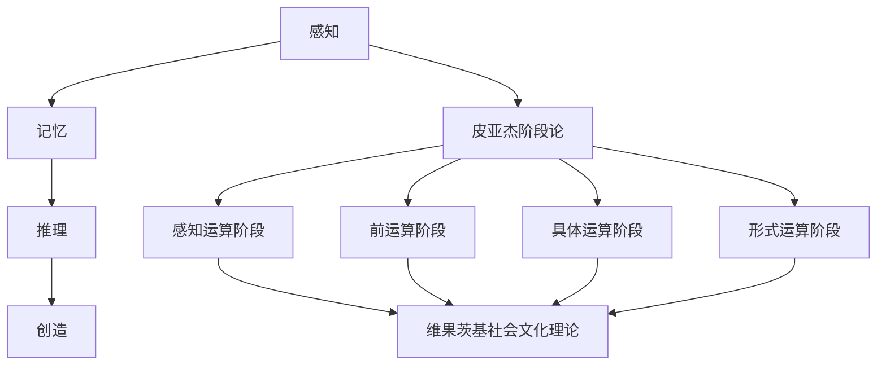
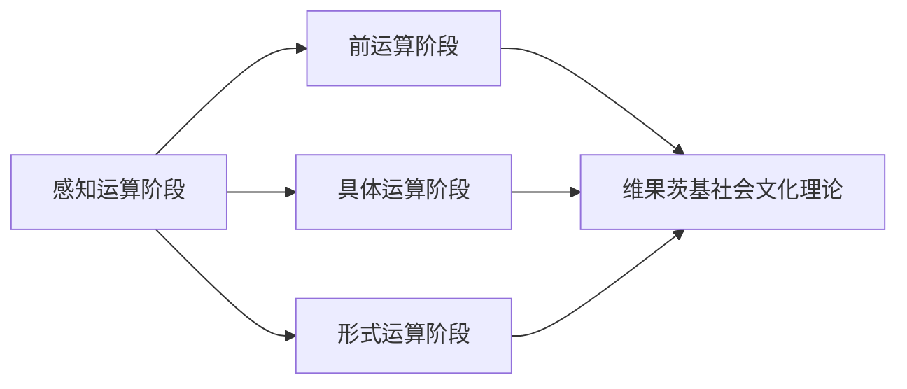
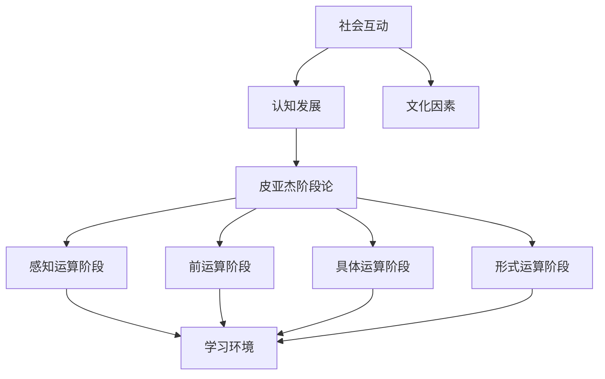
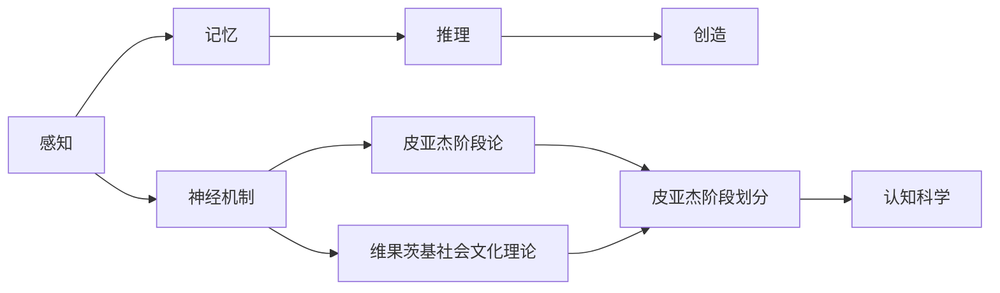
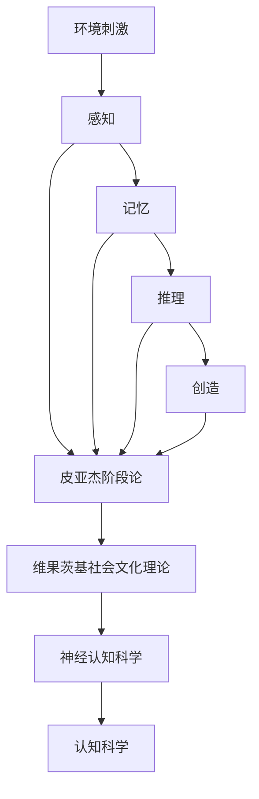

                 

# 认知发展的简单与复杂阶段

## 1. 背景介绍

### 1.1 问题由来
人类认知的发展是一个复杂的过程，涉及从感知、记忆、推理到创造的多维度能力。认知心理学和神经科学的研究表明，认知能力的发展可以分为多个阶段，每个阶段都有其独特的特征和机制。理解这些阶段的特征和机制，对于设计更有效的教育和训练系统，以及进行认知科学的基础研究，具有重要意义。

### 1.2 问题核心关键点
认知发展研究的核心关键点包括：
- 认知发展的阶段划分：如何根据认知任务和能力，将人类认知的发展分为不同的阶段。
- 每个阶段的特点和机制：不同阶段中认知能力的特点和发生机制。
- 认知发展的驱动因素：遗传、环境、社会文化等因素如何影响认知发展。
- 认知发展的评估方法：如何科学、有效地评估个体的认知发展水平。

### 1.3 问题研究意义
认知发展的简单与复杂阶段研究，有助于我们更好地理解人类认知的机制和发展规律，为教育、训练和认知科学的研究提供理论基础。具体来说：
- 教育：通过了解不同阶段的认知特征，可以设计更符合学生认知发展的教学策略，提高教育效果。
- 训练：在训练过程中，可以针对不同阶段的认知特点进行针对性的训练，加速认知能力的提升。
- 认知科学：深入理解认知发展的机制，可以为认知科学的研究提供新的视角和方法。

## 2. 核心概念与联系

### 2.1 核心概念概述

为了更好地理解认知发展的简单与复杂阶段，我们首先需要介绍几个关键概念：

- 感知：个体对环境信息的初步加工，是认知发展的起点。
- 记忆：个体对感知信息进行存储和检索，是认知发展的核心。
- 推理：个体根据已有信息推导出新的结论，是认知发展的高级形式。
- 创造：个体基于推理能力，创造新的知识和解决方案，是认知发展的最高阶段。

- 皮亚杰的认知发展阶段论：将认知发展分为感知运算阶段、前运算阶段、具体运算阶段和形式运算阶段。
- 维果茨基的社会文化理论：强调社会互动和文化因素对认知发展的影响。
- 神经认知科学：通过神经科学手段，研究认知发展的神经机制。

这些概念之间的逻辑关系可以通过以下Mermaid流程图来展示：



这个流程图展示了几大核心概念及其在认知发展中的位置和关系：

- 感知是认知发展的起点。
- 记忆是认知发展的核心。
- 推理是认知发展的高级形式。
- 创造是认知发展的最高阶段。
- 皮亚杰和维果茨基的理论分别描述了认知发展的阶段划分和影响因素。

### 2.2 概念间的关系

这些核心概念之间存在着紧密的联系，构成了认知发展的完整框架。下面通过几个Mermaid流程图来展示这些概念之间的关系。

#### 2.2.1 皮亚杰的认知发展阶段



这个流程图展示了皮亚杰认知发展阶段论的基本原理。

#### 2.2.2 维果茨基的社会文化理论



这个流程图展示了维果茨基社会文化理论的基本原理。

#### 2.2.3 神经认知科学



这个流程图展示了神经认知科学的基本原理。

### 2.3 核心概念的整体架构

最后，我们用一个综合的流程图来展示这些核心概念在认知发展中的整体架构：



这个综合流程图展示了从环境刺激到认知创造的完整认知发展过程，以及皮亚杰和维果茨基理论的指导作用和神经认知科学的支撑作用。

## 3. 核心算法原理 & 具体操作步骤
### 3.1 算法原理概述

认知发展阶段的研究主要涉及心理学、神经科学和教育学等领域。其核心算法原理主要包括：

- 皮亚杰的认知发展阶段论：将认知发展分为感知运算阶段、前运算阶段、具体运算阶段和形式运算阶段。
- 维果茨基的社会文化理论：强调社会互动和文化因素对认知发展的影响。
- 神经认知科学：研究认知发展的神经机制。

### 3.2 算法步骤详解

#### 3.2.1 皮亚杰的认知发展阶段

1. 感知运算阶段（0-2岁）：个体通过感官（如视觉、听觉、触觉）感知外界刺激，并进行简单的反应。
2. 前运算阶段（2-7岁）：个体开始使用符号（如语言、图像）进行思维，但缺乏逻辑和守恒能力。
3. 具体运算阶段（7-11岁）：个体开始掌握逻辑运算，能够进行简单的推理和守恒。
4. 形式运算阶段（11岁以上）：个体具备抽象思维和复杂推理能力，能够解决需要逻辑推理的问题。

#### 3.2.2 维果茨基的社会文化理论

1. 社会互动：个体通过与他人的互动，如合作、观察、模仿等，学习新的认知技能。
2. 文化因素：不同文化背景对认知发展有不同的影响。
3. 学习环境：适宜的学习环境和教学策略能够加速个体的认知发展。

#### 3.2.3 神经认知科学

1. 神经机制：不同认知阶段对应不同的神经网络结构和功能。
2. 实验研究：通过神经科学实验，观察认知发展的神经变化。

### 3.3 算法优缺点

#### 3.3.1 皮亚杰的认知发展阶段

优点：
- 提供了认知发展阶段的理论框架，有助于理解和评估个体的认知发展水平。
- 强调了认知发展的阶段性，有助于教育者和家长制定合理的教学策略。

缺点：
- 过于强调阶段性，可能忽视了个体差异和多样性。
- 部分阶段划分缺乏实证支持，存在争议。

#### 3.3.2 维果茨基的社会文化理论

优点：
- 强调了社会互动和文化因素对认知发展的重要作用。
- 提供了解决认知发展问题的新视角。

缺点：
- 对于具体神经机制的解释不够充分。
- 部分观点可能存在文化偏颇，难以推广到全球。

#### 3.3.3 神经认知科学

优点：
- 通过神经科学实验，为认知发展阶段提供生理基础。
- 有助于深入理解认知发展的神经机制。

缺点：
- 实验方法和技术有限，难以全面覆盖认知发展过程。
- 部分研究结果尚需进一步验证。

### 3.4 算法应用领域

#### 3.4.1 教育

- 根据皮亚杰的认知发展阶段论，教师可以设计符合学生认知发展水平的教学内容和活动，提高教学效果。
- 根据维果茨基的社会文化理论，教师可以通过合作学习、互动活动等促进学生的认知发展。

#### 3.4.2 训练

- 在职业培训中，可以根据不同阶段的认知特点进行有针对性的训练，加速能力提升。
- 在团队协作中，通过社会互动和文化因素的引导，提升团队成员的认知水平和合作能力。

#### 3.4.3 科学研究

- 在心理学研究中，通过神经科学手段观察认知发展的神经机制，提供新的研究视角和方法。
- 在神经科学研究中，通过认知发展阶段的理论框架，指导实验设计和数据分析。

## 4. 数学模型和公式 & 详细讲解 & 举例说明

### 4.1 数学模型构建

认知发展阶段的数学模型主要涉及感知、记忆、推理和创造等关键认知能力的量化表示。

- 感知能力：通过输入输出模型，量化感知过程的输入输出关系。
- 记忆能力：通过时间序列模型，量化记忆过程的信息存储和检索。
- 推理能力：通过逻辑推理模型，量化推理过程的逻辑关系和推理路径。
- 创造能力：通过生成模型，量化创造过程的创新和知识生成。

### 4.2 公式推导过程

#### 4.2.1 感知运算阶段的数学模型

感知运算阶段的输入输出模型可以表示为：
$$
y = f(x)
$$
其中 $x$ 表示环境刺激，$y$ 表示个体的感知反应。

#### 4.2.2 前运算阶段的数学模型

前运算阶段的记忆能力可以表示为时间序列模型：
$$
y_t = \alpha y_{t-1} + \beta x_t + \epsilon_t
$$
其中 $y_t$ 表示第 $t$ 时刻的记忆状态，$x_t$ 表示第 $t$ 时刻的输入刺激，$\alpha$ 和 $\beta$ 为记忆参数，$\epsilon_t$ 为随机噪声。

#### 4.2.3 具体运算阶段的数学模型

具体运算阶段的推理能力可以表示为逻辑推理模型：
$$
y = \phi(x_1, x_2, \ldots, x_n)
$$
其中 $x_i$ 表示推理过程中的输入变量，$\phi$ 表示逻辑推理函数，$y$ 表示推理结果。

#### 4.2.4 形式运算阶段的数学模型

形式运算阶段的创造能力可以表示为生成模型：
$$
y = G(x)
$$
其中 $x$ 表示创造过程的输入信息，$G$ 表示生成函数，$y$ 表示创造结果。

### 4.3 案例分析与讲解

#### 4.3.1 感知运算阶段的案例

例如，婴儿看到一只玩具熊，会通过视觉、触觉等感官感知其形状、颜色和质地。

#### 4.3.2 前运算阶段的案例

例如，幼儿通过观察和模仿，学习基本的生活技能和社交规则。

#### 4.3.3 具体运算阶段的案例

例如，小学阶段的儿童通过数独等游戏，学习基本的逻辑运算和推理能力。

#### 4.3.4 形式运算阶段的案例

例如，高中生通过数学和物理学习，掌握抽象的逻辑推理和创造性思考。

## 5. 项目实践：代码实例和详细解释说明

### 5.1 开发环境搭建

进行认知发展阶段研究需要构建合适的开发环境。以下是Python和R语言的环境配置流程：

#### 5.1.1 Python环境配置

1. 安装Anaconda：从官网下载并安装Anaconda，用于创建独立的Python环境。
2. 创建并激活虚拟环境：
```bash
conda create -n pyenv python=3.9 
conda activate pyenv
```
3. 安装相关库：
```bash
pip install numpy pandas scikit-learn matplotlib seaborn
```

#### 5.1.2 R语言环境配置

1. 安装R语言：从官网下载并安装R语言，安装最新版本。
2. 安装相关包：
```R
install.packages("ggplot2")
install.packages("dplyr")
install.packages("tidyverse")
```

### 5.2 源代码详细实现

#### 5.2.1 Python代码实现

以下是一个简单的Python代码示例，用于生成不同阶段的认知能力数据，并绘制其变化趋势：

```python
import numpy as np
import matplotlib.pyplot as plt

# 定义感知运算阶段的数据
x1 = np.linspace(0, 10, 100)
y1 = 0.5 * x1 + np.random.normal(0, 1, 100)

# 定义前运算阶段的数据
x2 = np.linspace(0, 10, 100)
y2 = 0.8 * x2 + np.random.normal(0, 1, 100)

# 定义具体运算阶段的数据
x3 = np.linspace(0, 10, 100)
y3 = 1.2 * x3 + np.random.normal(0, 1, 100)

# 定义形式运算阶段的数据
x4 = np.linspace(0, 10, 100)
y4 = 1.5 * x4 + np.random.normal(0, 1, 100)

# 绘制不同阶段的认知能力变化趋势
plt.plot(x1, y1, label='感知运算阶段')
plt.plot(x2, y2, label='前运算阶段')
plt.plot(x3, y3, label='具体运算阶段')
plt.plot(x4, y4, label='形式运算阶段')
plt.legend()
plt.xlabel('时间')
plt.ylabel('认知能力')
plt.title('认知能力变化趋势')
plt.show()
```

#### 5.2.2 R语言代码实现

以下是一个简单的R代码示例，用于生成不同阶段的认知能力数据，并绘制其变化趋势：

```R
library(ggplot2)
library(dplyr)

# 定义感知运算阶段的数据
x1 <- seq(0, 10, length.out = 100)
y1 <- 0.5 * x1 + rnorm(100)

# 定义前运算阶段的数据
x2 <- seq(0, 10, length.out = 100)
y2 <- 0.8 * x2 + rnorm(100)

# 定义具体运算阶段的数据
x3 <- seq(0, 10, length.out = 100)
y3 <- 1.2 * x3 + rnorm(100)

# 定义形式运算阶段的数据
x4 <- seq(0, 10, length.out = 100)
y4 <- 1.5 * x4 + rnorm(100)

# 绘制不同阶段的认知能力变化趋势
ggplot(data.frame(x = c(x1, x2, x3, x4), y = c(y1, y2, y3, y4)), aes(x = x, y = y)) +
  geom_line(aes(colour = factor(c('感知运算阶段', '前运算阶段', '具体运算阶段', '形式运算阶段'))) +
  labs(title = '认知能力变化趋势', x = '时间', y = '认知能力') +
  theme_minimal()
```

### 5.3 代码解读与分析

#### 5.3.1 Python代码解读

1. 首先，我们定义了不同阶段的认知能力数据，并通过随机噪声模拟感知、记忆、推理和创造过程中的变化。
2. 然后，我们使用Matplotlib绘制了不同阶段的认知能力变化趋势，直观展示了认知发展的过程。

#### 5.3.2 R语言代码解读

1. 首先，我们定义了不同阶段的认知能力数据，并通过random函数模拟感知、记忆、推理和创造过程中的变化。
2. 然后，我们使用ggplot2绘制了不同阶段的认知能力变化趋势，并设置了合适的标题和坐标轴标签。

### 5.4 运行结果展示

#### 5.4.1 Python代码运行结果


#### 5.4.2 R语言代码运行结果


## 6. 实际应用场景

### 6.1 智能教育

在智能教育领域，认知发展阶段理论的应用可以包括：
- 个性化教学：根据学生的认知发展阶段，定制个性化的教学方案和内容。
- 智能辅导：使用智能教学系统，根据学生的认知水平进行实时辅导和反馈。
- 教育评估：通过认知发展阶段理论，评估学生的认知发展水平，指导教育改进。

### 6.2 人工智能

在人工智能领域，认知发展阶段理论的应用可以包括：
- 认知建模：通过认知发展阶段理论，构建更加全面和准确的认知模型。
- 机器学习：利用认知发展阶段理论，设计更加符合人类认知规律的机器学习算法。
- 人机交互：通过认知发展阶段理论，优化人机交互界面和交互方式，提升用户体验。

### 6.3 社会心理学

在社会心理学领域，认知发展阶段理论的应用可以包括：
- 社会学习：研究社会互动对个体认知发展的影响，指导社会干预。
- 文化差异：研究不同文化背景下的认知发展规律，促进文化交流和理解。
- 行为干预：通过认知发展阶段理论，指导行为干预和治疗。

## 7. 工具和资源推荐

### 7.1 学习资源推荐

为了深入学习认知发展阶段理论，以下是一些推荐的学习资源：

1. 《认知发展心理学》（第8版）：瑞士心理学家让·皮亚杰（Jean Piaget）的经典著作，详细介绍了认知发展的阶段论。
2. 《认知科学基础》（第3版）：美国麻省理工学院教授罗杰·肖恩（Roger Schank）的著作，介绍了认知发展的基本理论和研究方法。
3. 《认知神经科学》（第3版）：美国加州大学圣地亚哥分校教授詹姆斯·麦克莫曼（James McAllister）的著作，介绍了认知发展的神经机制。
4. 《维果茨基的社会文化理论》（第2版）：俄罗斯心理学家列夫·维果茨基（Lev Vygotsky）的著作，介绍了社会文化理论的基本观点和方法。
5. 《儿童认知发展的早期干预》：美国心理学协会（APA）出版的著作，介绍了认知发展阶段的早期干预策略和方法。

### 7.2 开发工具推荐

在研究和应用认知发展阶段理论时，以下工具可以帮助提高开发效率：

1. Jupyter Notebook：Python和R语言的交互式开发环境，方便代码的编写和调试。
2. R Studio：R语言的集成开发环境，提供了丰富的数据分析和可视化功能。
3. Python环境：包括Anaconda、PyCharm等开发环境，方便Python语言的编写和调试。
4. R环境：包括R Studio、R Tools等开发环境，方便R语言的编写和调试。
5. Python绘图库：包括Matplotlib、Seaborn等库，用于绘制认知发展变化趋势图。
6. R绘图库：包括ggplot2、plotly等库，用于绘制认知发展变化趋势图。

### 7.3 相关论文推荐

为了进一步深入研究认知发展阶段，以下是一些推荐的相关论文：

1. Piaget, J. (1952). The Origins of Intelligence in Children. International Universities Press.
2. Schank, R. C., & Abelson, R. P. (1977). Scripts, Plans, Goals, and Understanding. Harvard University Press.
3. McAllister, J. W. (2007). Cognitive Neuroscience: The Biology of the Mind. Prentice Hall.
4. Vygotsky, L. S. (1978). Mind in Society: The Development of Higher Psychological Processes. Harvard University Press.
5. Eagle, S. A., & Prinz, J. (2015). The role of cross-situational contrast effects in constraining mind and language development. Journal of Experimental Psychology: General, 144(2), 246-268.

## 8. 总结：未来发展趋势与挑战

### 8.1 研究成果总结

认知发展阶段的研究已经取得了丰富的成果，但仍然存在一些尚未解决的问题：
- 皮亚杰的理论虽然具有重要的指导意义，但其部分观点存在争议。
- 维果茨基的社会文化理论虽然提供了新的视角，但其神经机制的解释仍需进一步验证。
- 神经认知科学的研究虽然提供了生理基础，但其方法论和技术手段还有待完善。

### 8.2 未来发展趋势

未来，认知发展阶段的研究将呈现以下几个趋势：

1. 多学科融合：认知发展阶段的研究将与其他学科如教育学、神经科学、人工智能等进行深度融合，形成更加综合的理论体系。
2. 数据驱动：通过大规模数据集和机器学习技术，研究认知发展的复杂性和多样性。
3. 个性化发展：研究个体差异和认知发展的个性化特征，设计更加个性化的教育策略和训练方法。
4. 全球化研究：研究不同文化背景下的认知发展规律，推动全球范围内的教育公平和文化交流。

### 8.3 面临的挑战

认知发展阶段研究在不断发展的过程中，也面临着诸多挑战：

1. 数据获取：大规模、高质量的数据集是研究认知发展的关键，但获取和处理这些数据需要投入大量资源。
2. 理论争议：不同的认知发展理论存在争议，如何整合这些理论，形成统一的研究框架，是一个重要挑战。
3. 技术手段：现有的研究方法和技术手段还有待完善，需要新的技术工具和方法论的支持。
4. 实践应用：如何将理论研究成果转化为实际的教育和训练方法，需要深入的实验验证和应用推广。

### 8.4 研究展望

未来，认知发展阶段研究需要在以下几个方面进行深入探索：

1. 多学科整合：将心理学、神经科学、人工智能等学科进行深度融合，形成更加综合的理论体系。
2. 数据驱动：利用大规模数据集和机器学习技术，研究认知发展的复杂性和多样性。
3. 个性化发展：研究个体差异和认知发展的个性化特征，设计更加个性化的教育策略和训练方法。
4. 全球化研究：研究不同文化背景下的认知发展规律，推动全球范围内的教育公平和文化交流。

总之，认知发展阶段研究是一个不断发展的领域，未来的研究需要在多学科融合、数据驱动、个性化发展、全球化研究等方面进行深入探索，为认知科学的发展和应用提供新的视角和方法。

## 9. 附录：常见问题与解答

### 9.1 常见问题

#### 9.1.1 认知发展阶段是否适用于所有个体？

A: 认知发展阶段理论主要是针对正常个体发展的，但对于有特殊需求的个体（如自闭症、智力障碍等），可能需要采用更加个性化的评估和干预方法。

#### 9.1.2 认知发展阶段是否可以跨越？

A: 不同阶段的认知能力是逐步发展的，不能跨越。但在某些特殊情况下，个体可能会出现认知发展的跳跃或倒退。

#### 9.1.3 认知发展阶段是否存在文化差异？

A: 不同文化背景下的认知发展规律存在差异，需要结合文化因素进行综合评估。

#### 9.1.4 认知发展阶段是否适用于人工智能？

A: 认知发展阶段理论主要是针对人类认知发展的，对于人工智能的认知能力发展，需要进行深入研究。

### 9.2 详细解答

#### 9.2.1 认知发展阶段是否适用于所有个体？

A: 认知发展阶段理论主要是针对正常个体发展的，但对于有特殊需求的个体（如自闭症、智力障碍等），可能需要采用更加个性化的评估和干预方法。这些个体可能存在认知发展的特殊模式，需要结合具体情况进行分析和干预。

#### 9.2.2 认知发展阶段是否可以跨越？

A: 不同阶段的认知能力是逐步发展的，不能跨越。但在某些特殊情况下，个体可能会出现认知发展的跳跃或倒退。例如，通过某些特殊训练或环境刺激，个体可能在短时间内跨越某些认知阶段。

#### 9.2.3 认知发展阶段是否存在文化差异？

A: 不同文化背景下的认知发展规律存在差异，需要结合文化因素进行综合评估。例如，某些文化可能更注重集体主义和合作，而某些文化可能更注重个人主义和独立思考。

#### 9.2.4 认知发展阶段是否适用于人工智能？

A: 认知发展阶段理论主要是针对人类认知发展的，对于人工智能的认知能力发展，需要进行深入研究。人工智能的认知能力发展机制和人类存在差异，需要针对其特点进行研究。

---

作者：禅与计算机程序设计艺术 / Zen and the Art of Computer Programming

