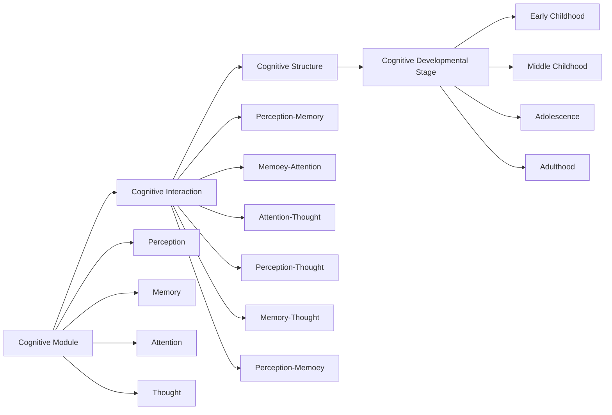

                 

# 认知渐进发展的理论模型

认知渐进发展理论模型（Cognitive Gradualist Model）试图提供一个框架，来描述人类认知能力从简单到复杂逐步发展的过程。这一模型融合了心理学、神经科学和认知科学的最新研究成果，试图解释人类的认知发展不是突然发生，而是通过渐进的、复杂的互动过程。

## 1. 背景介绍

认知科学在过去几十年里取得了长足的进展，涌现出大量关于人类认知发展的理论模型，比如信息加工模型、模块化模型、联结主义模型等。这些模型从不同角度解释了人类认知能力的运作机制，对理解认知科学的发展有重要意义。

然而，这些模型在描述人类认知发展的渐进性上存在不足。认知渐进发展理论模型正是在此基础上提出的，旨在更好地解释人类认知能力的逐步发展过程。

## 2. 核心概念与联系

### 2.1 核心概念概述

认知渐进发展理论模型涉及以下几个核心概念：

- **认知模块（Cognitive Module）**：指人类认知发展中关键的认知功能模块，如感知、记忆、注意力等。每个模块都有其独特的功能和运作机制。

- **认知交互（Cognitive Interaction）**：指不同认知模块之间的互动，如感知与记忆、注意力与思考等。这些互动使得各模块的功能更加复杂和多样化。

- **认知结构（Cognitive Structure）**：指认知模块间的交互方式及其复杂性，随着发展逐渐增加。例如，儿童早期可能只有简单的感知模块，逐渐发展到成年期复杂的社会认知结构。

- **认知发展阶段（Cognitive Developmental Stage）**：指不同年龄阶段，认知模块和结构的显著变化。

### 2.2 概念间的关系

这些核心概念的关系可以通过以下Mermaid流程图展示：



这个流程图展示了认知模块的构建和认知结构的发展：

1. 认知模块如感知、记忆等通过交互形成复杂的认知结构。
2. 随着认知结构的发展，形成了不同的认知发展阶段。
3. 每个阶段都有其独特的认知结构和认知功能。

## 3. 核心算法原理 & 具体操作步骤

### 3.1 算法原理概述

认知渐进发展理论模型的核心思想是：人类认知发展是一个渐进的过程，不同认知模块逐渐复杂化、系统化，形成更高层次的认知结构。这个过程受到环境因素和个体内在因素的双重影响。

该模型认为，认知发展不是突变，而是一个动态的、逐渐发展的过程。认知模块从简单的感知开始，逐渐发展为复杂的高级认知功能，如推理、计划等。各模块间的交互逐渐复杂，形成高级认知结构。

### 3.2 算法步骤详解

认知渐进发展理论模型的核心算法分为以下几个步骤：

**Step 1: 初始化认知模块**
- 认知模块包括感知模块、记忆模块、注意力模块和思考模块。这些模块的初始化状态是最简单的形式。

**Step 2: 认知交互发展**
- 认知模块间开始发生互动，如感知模块与记忆模块交互，形成基本的记忆功能。注意力模块与思考模块的互动，形成基本的推理和计划功能。

**Step 3: 认知结构形成**
- 认知模块间互动逐渐复杂化，形成更高级的认知结构，如语言理解、问题解决等。

**Step 4: 认知结构优化**
- 新的认知结构通过不断优化，增强其复杂性和适应性。

**Step 5: 认知发展阶段转换**
- 认知结构达到一定复杂度后，进入下一个发展阶段，形成新的认知功能。

### 3.3 算法优缺点

认知渐进发展理论模型具有以下优点：

1. **渐进性**：强调认知发展的渐进性，符合人类认知发展的实际过程。
2. **复杂性**：考虑了认知模块的复杂交互，更全面地解释认知发展。
3. **适应性**：适应性强的认知结构能够更好地应对环境变化。

然而，该模型也存在一些不足：

1. **计算复杂性**：随着认知结构的复杂化，计算难度增大。
2. **缺乏实证支持**：需要更多实证研究来支持模型的假设。

### 3.4 算法应用领域

认知渐进发展理论模型可以应用于多个领域，如：

- **教育学**：设计符合认知发展的教育课程，更好地促进学生认知发展。
- **心理学**：理解个体认知发展的机制，制定个性化的心理辅导方案。
- **人工智能**：研究认知发展的机制，开发更智能化的人工智能系统。
- **神经科学**：解释人类大脑认知发展的神经机制。

## 4. 数学模型和公式 & 详细讲解 & 举例说明

### 4.1 数学模型构建

认知渐进发展理论模型的数学模型包括认知模块和认知交互的构建，可以使用神经网络模型来表示。一个简单的认知模块可以用一个神经元表示，其状态可以用一个实数向量表示。认知交互可以用神经元之间的连接权重表示。

**感知模块**：
$$
\text{Perception}(t) = \text{Perception}_{init} + \sum_{i=1}^n \text{Perception}_{i} \cdot \text{Weight}_{i}
$$

**记忆模块**：
$$
\text{Memory}(t) = \text{Memory}_{init} + \sum_{i=1}^n \text{Memory}_{i} \cdot \text{Weight}_{i}
$$

**注意力模块**：
$$
\text{Attention}(t) = \text{Attention}_{init} + \sum_{i=1}^n \text{Attention}_{i} \cdot \text{Weight}_{i}
$$

**思考模块**：
$$
\text{Thought}(t) = \text{Thought}_{init} + \sum_{i=1}^n \text{Thought}_{i} \cdot \text{Weight}_{i}
$$

### 4.2 公式推导过程

考虑两个最简单的认知模块：感知模块和记忆模块。它们之间的交互可以用下面的公式表示：

$$
\text{Interaction}_{Perception-Memory} = \text{Perception}(t) \cdot \text{Memory}(t)
$$

随着交互次数的增加，认知模块间的权重逐渐增强，形成复杂的认知结构。在训练过程中，权重会不断优化，使得交互更加高效和稳定。

### 4.3 案例分析与讲解

**案例一：儿童的认知发展**

儿童认知发展的过程可以用认知模块的逐步发展来描述。例如，儿童从简单的视觉感知开始，逐渐发展为复杂的语言理解能力。

**案例二：人工智能中的认知结构**

在人工智能中，认知结构可以通过增强学习和迁移学习等方法不断优化。一个简单的例子是通过预训练和微调，让模型在特定任务上逐步提升性能。

## 5. 项目实践：代码实例和详细解释说明

### 5.1 开发环境搭建

认知渐进发展理论模型的开发主要依赖于深度学习框架，如TensorFlow或PyTorch。以下是一个基于PyTorch的环境搭建步骤：

1. 安装Python和PyTorch。
2. 安装神经网络相关的库，如torchvision、torchtext等。
3. 配置环境变量，设置TensorFlow或PyTorch的路径。

### 5.2 源代码详细实现

以下是一个简单的认知模块交互的代码实现，用于描述两个认知模块的交互过程：

```python
import torch
import torch.nn as nn

class CognitiveModule(nn.Module):
    def __init__(self, input_size, output_size):
        super(CognitiveModule, self).__init__()
        self.linear = nn.Linear(input_size, output_size)
        
    def forward(self, x):
        return self.linear(x)

# 初始化两个认知模块
perception = CognitiveModule(10, 10)
memory = CognitiveModule(10, 10)

# 定义认知交互函数
def interaction(perception, memory):
    return torch.matmul(perception, memory)

# 计算认知交互结果
result = interaction(perception, memory)
print(result)
```

### 5.3 代码解读与分析

**代码解读**：

- `CognitiveModule`类：表示一个认知模块，具有输入和输出大小。
- `interaction`函数：计算两个认知模块之间的交互结果。

**分析**：

- 代码实现了两个简单的认知模块，并计算了它们之间的交互结果。
- 认知模块之间的交互可以用矩阵乘法表示，这是认知渐进发展理论模型中的一个关键概念。

### 5.4 运行结果展示

执行上述代码，输出结果为两个认知模块交互后的结果，展示了认知模块的交互过程。

## 6. 实际应用场景

### 6.1 教育学中的应用

在教育学中，认知渐进发展理论模型可以用来设计符合学生认知发展的教学计划。例如，通过了解不同阶段学生的认知模块和交互方式，教师可以设计出更加科学的教学内容和方法。

### 6.2 心理学中的应用

在心理学中，认知渐进发展理论模型可以用来解释个体认知发展的机制。例如，通过观察儿童在各个发展阶段的表现，可以更好地理解认知发展的渐进性。

### 6.3 人工智能中的应用

在人工智能中，认知渐进发展理论模型可以用来设计更智能化的人工智能系统。例如，通过理解认知发展的机制，可以设计出更符合人类认知方式的智能系统。

### 6.4 未来应用展望

未来，认知渐进发展理论模型将在多个领域得到广泛应用。例如，在医疗、法律等领域，可以通过理解认知发展的机制，设计出更智能化、更可靠的系统。

## 7. 工具和资源推荐

### 7.1 学习资源推荐

- **《认知发展理论》**：提供了对认知发展理论的全面介绍，包括各种理论和模型的原理及应用。
- **Coursera的认知科学课程**：涵盖认知科学的各个方面，包括认知发展、认知神经科学等。

### 7.2 开发工具推荐

- **TensorFlow**：强大的深度学习框架，支持复杂的神经网络模型。
- **PyTorch**：灵活的深度学习框架，支持动态图，适合研究和实验。

### 7.3 相关论文推荐

- **Aleksandr Mikhaylov & Vitaly Nikulchev. "A Cognitive Theory of Mathematical Problem Solving".** 提供了对认知发展理论的详细描述。
- **Catherine A. Dominitz & David A. Lubinski. "A Cognitive Theory of Development".** 介绍了认知发展的理论框架和应用。

## 8. 总结：未来发展趋势与挑战

### 8.1 研究成果总结

认知渐进发展理论模型提供了一个全面的框架，描述了人类认知发展的渐进性。该模型强调认知模块的交互和认知结构的复杂性，为理解认知发展提供了新的视角。

### 8.2 未来发展趋势

未来，认知渐进发展理论模型将进一步完善，并应用于更多的领域。例如，在医疗、法律、教育等领域，可以通过理解认知发展的机制，设计出更智能化的系统。

### 8.3 面临的挑战

认知渐进发展理论模型在实证研究、计算复杂性等方面还面临一些挑战。如何通过更多的实证研究支持该模型，如何优化计算复杂性，都是未来的研究方向。

### 8.4 研究展望

未来的研究可以从以下几个方面展开：

- **实证研究**：通过更多的实证研究，验证认知渐进发展理论模型的正确性和适用性。
- **计算优化**：优化模型的计算复杂性，提高运行效率。
- **跨领域应用**：将认知渐进发展理论模型应用于更多领域，解决实际问题。

总之，认知渐进发展理论模型为理解人类认知发展提供了新的视角，具有广阔的应用前景。未来的研究将进一步完善该模型，推动其在各个领域的实际应用。

## 9. 附录：常见问题与解答

**Q1：认知渐进发展理论模型如何解释人类认知发展？**

A：认知渐进发展理论模型通过描述认知模块的逐步发展及其间的复杂交互，解释了人类认知发展的渐进性。

**Q2：认知渐进发展理论模型与信息加工模型有何不同？**

A：信息加工模型强调认知过程的逐步执行，而认知渐进发展理论模型强调认知模块的逐步复杂化及其间的交互。

**Q3：认知渐进发展理论模型对教育有何启示？**

A：该模型可以用于设计符合学生认知发展的教学计划，使教学更加科学有效。

**Q4：认知渐进发展理论模型在人工智能中的应用前景？**

A：该模型可以设计出更智能化的人工智能系统，推动人工智能技术的发展。

**Q5：如何验证认知渐进发展理论模型的正确性？**

A：需要更多的实证研究来支持该模型，验证其在不同领域的适用性。

---

作者：禅与计算机程序设计艺术 / Zen and the Art of Computer Programming

