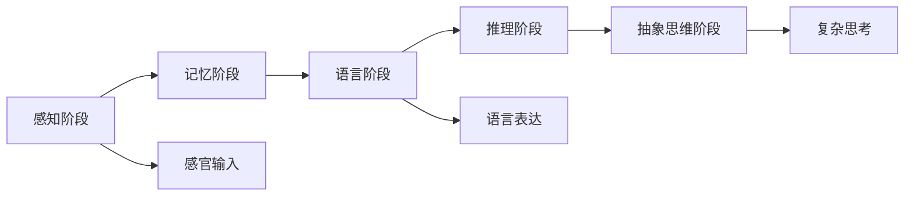
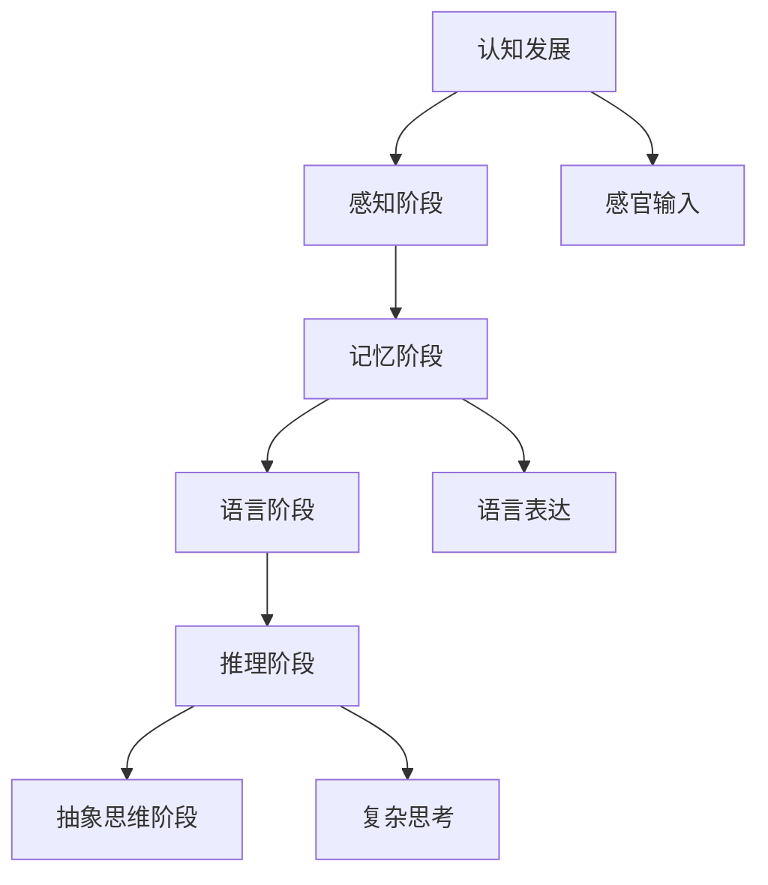

                 

# 认知渐进发展的阶段性变化

## 1. 背景介绍

### 1.1 问题由来
认知的渐进发展是一个复杂而持久的话题。从认知心理学的角度来看，人类的认知能力是在不断发展的，而这种发展是通过一系列渐进的阶段性变化实现的。理解这些阶段性变化有助于我们更好地认识自我、教育下一代以及设计和开发更加智能的AI系统。

### 1.2 问题核心关键点
认知的渐进发展涉及多个方面，包括感知、记忆、语言、推理等认知能力的演进。不同阶段有不同的特点和要求，需要通过多种手段（如教学、训练、科技干预等）来实现。本节将系统介绍认知发展的主要阶段及其关键特征，并探讨这些阶段如何通过AI技术进行辅助和促进。

### 1.3 问题研究意义
研究认知渐进发展的阶段性变化，对于教育学、心理学、神经科学等领域具有重要意义。同时，对设计智能AI系统也有指导意义。通过理解认知发展的规律，可以更有效地教育儿童，设计出更加人性化、智能化的AI，使其更好地服务于社会。

## 2. 核心概念与联系

### 2.1 核心概念概述

为了更好地理解认知渐进发展的阶段性变化，本节将介绍几个核心概念：

- **感知阶段**：儿童在出生后几个月到2岁左右，主要通过视觉、听觉等感官获得外界信息，进行简单的识别和分类。
- **记忆阶段**：儿童在2岁左右开始形成初步的记忆能力，能够记住一些事物和场景，并进行简单的回忆。
- **语言阶段**：儿童在3岁左右开始学习语言，通过词汇和语法表达自己的思想和需求。
- **推理阶段**：儿童在5岁左右开始具备基本的推理能力，能够根据已有知识推断新的信息，解决简单的问题。
- **抽象思维阶段**：儿童在10岁左右开始具备抽象思维能力，能够理解复杂的概念和逻辑，进行更深层次的思考和推理。

这些阶段是认知发展的基本历程，每个阶段都有其独特的特征和任务要求。AI技术可以在不同阶段提供支持，帮助儿童更好地学习和成长。

### 2.2 概念间的关系

这些核心概念之间的关系可以通过以下Mermaid流程图来展示：



这个流程图展示了认知发展的阶段性变化及其关键活动：

1. 感知阶段的主要活动是感官输入。
2. 记忆阶段的主要活动是简单的记忆和回忆。
3. 语言阶段的主要活动是词汇和语法的学习。
4. 推理阶段的主要活动是基于已有知识的推理。
5. 抽象思维阶段的主要活动是复杂概念的思考和推理。

通过这些阶段的活动，儿童逐渐建立起更加复杂的认知能力。AI技术可以在每个阶段提供适当的辅助，帮助儿童更好地发展认知能力。

### 2.3 核心概念的整体架构

最后，我们用一个综合的流程图来展示这些核心概念在大语言模型微调过程中的整体架构：



这个综合流程图展示了认知发展的阶段性变化及其在大语言模型微调过程中的应用：

1. 感官输入阶段，AI可以通过视觉、听觉等传感技术获取儿童的认知数据。
2. 记忆阶段，AI可以辅助儿童进行记忆训练和巩固。
3. 语言阶段，AI可以通过语言模型辅助儿童进行词汇和语法学习。
4. 推理阶段，AI可以通过推理模型帮助儿童进行基于已有知识的推理。
5. 抽象思维阶段，AI可以通过抽象模型帮助儿童进行复杂概念的思考和推理。

通过这些框架，我们可以更清晰地理解认知发展的阶段性变化及其在大语言模型微调中的作用。

## 3. 核心算法原理 & 具体操作步骤
### 3.1 算法原理概述

认知渐进发展的阶段性变化涉及多个认知活动，每个阶段都有其特定的算法原理和操作步骤。本节将详细介绍这些算法原理和操作步骤，帮助读者更好地理解认知发展过程。

### 3.2 算法步骤详解

#### 3.2.1 感知阶段
**算法原理**：感知阶段的重点是感官输入和简单的信息处理。算法通过传感器获取儿童的感官数据，如视觉、听觉、触觉等。然后对数据进行简单的特征提取和分类。

**操作步骤**：
1. 选择合适的传感器，如摄像头、麦克风、触觉传感器等。
2. 采集儿童的感官数据，如图像、声音、触觉反馈等。
3. 对感官数据进行预处理，如去噪、归一化等。
4. 使用特征提取算法，如SIFT、HOG等，提取特征点。
5. 对特征点进行分类，如物体识别、语音识别等。

#### 3.2.2 记忆阶段
**算法原理**：记忆阶段的重点是简单的记忆和回忆。算法通过训练记忆模型，帮助儿童记忆和回忆信息。

**操作步骤**：
1. 收集儿童的记忆数据，如图片、视频、文字等。
2. 将数据划分为训练集和测试集。
3. 选择合适的记忆模型，如卷积神经网络（CNN）、长短期记忆网络（LSTM）等。
4. 在训练集上训练模型，进行记忆训练。
5. 在测试集上评估模型，检验记忆效果。

#### 3.2.3 语言阶段
**算法原理**：语言阶段的重点是词汇和语法的学习。算法通过语言模型和生成模型，辅助儿童进行词汇和语法的学习。

**操作步骤**：
1. 收集儿童的语言数据，如语音、文字等。
2. 将数据划分为训练集和测试集。
3. 选择合适的语言模型，如BERT、GPT等。
4. 在训练集上训练模型，进行语言训练。
5. 在测试集上评估模型，检验语言效果。

#### 3.2.4 推理阶段
**算法原理**：推理阶段的重点是基于已有知识的推理。算法通过推理模型，帮助儿童进行基于已有知识的推理。

**操作步骤**：
1. 收集儿童的推理数据，如数学题、逻辑题等。
2. 将数据划分为训练集和测试集。
3. 选择合适的推理模型，如决策树、神经网络等。
4. 在训练集上训练模型，进行推理训练。
5. 在测试集上评估模型，检验推理效果。

#### 3.2.5 抽象思维阶段
**算法原理**：抽象思维阶段的重点是复杂概念的思考和推理。算法通过抽象模型，帮助儿童进行复杂概念的思考和推理。

**操作步骤**：
1. 收集儿童的抽象思维数据，如复杂的数学问题、逻辑问题等。
2. 将数据划分为训练集和测试集。
3. 选择合适的抽象模型，如深度神经网络（DNN）、生成对抗网络（GAN）等。
4. 在训练集上训练模型，进行抽象训练。
5. 在测试集上评估模型，检验抽象效果。

### 3.3 算法优缺点

**优点**：
1. 通过AI技术辅助儿童认知发展，可以显著提升儿童的学习效果。
2. 多种传感器和模型可以提供全面的认知训练，帮助儿童全面发展。
3. 数据驱动的训练和评估可以确保训练效果和模型性能。

**缺点**：
1. 传感器和模型的选择和配置需要专业知识，较难实现。
2. 儿童的认知发展受到多方面因素的影响，AI技术无法完全替代人类教育。
3. 数据收集和处理需要大量的资源和时间，难以普及。

### 3.4 算法应用领域

认知渐进发展的阶段性变化涉及多个领域，包括教育、心理学、神经科学等。AI技术在以下几个领域有广泛应用：

- **教育**：通过AI技术辅助儿童的认知发展，提高教学效果。
- **心理学**：研究AI技术如何影响儿童的认知发展，探索更有效的教育方法。
- **神经科学**：研究AI技术对儿童大脑发育的影响，探索认知发展的神经机制。

## 4. 数学模型和公式 & 详细讲解  
### 4.1 数学模型构建

本节将使用数学语言对认知渐进发展的阶段性变化进行更加严格的刻画。

假设儿童在 $t$ 时刻的认知能力为 $C_t$，其认知发展遵循一定的规律 $f(C_t, A_t)$，其中 $A_t$ 为 $t$ 时刻的环境输入。

**感知阶段的数学模型**：
$$
C_{t+1} = f_{\text{感知}}(C_t, A_t)
$$
其中 $f_{\text{感知}}$ 为感知阶段的算法函数。

**记忆阶段的数学模型**：
$$
C_{t+1} = f_{\text{记忆}}(C_t, A_t)
$$
其中 $f_{\text{记忆}}$ 为记忆阶段的算法函数。

**语言阶段的数学模型**：
$$
C_{t+1} = f_{\text{语言}}(C_t, A_t)
$$
其中 $f_{\text{语言}}$ 为语言阶段的算法函数。

**推理阶段的数学模型**：
$$
C_{t+1} = f_{\text{推理}}(C_t, A_t)
$$
其中 $f_{\text{推理}}$ 为推理阶段的算法函数。

**抽象思维阶段的数学模型**：
$$
C_{t+1} = f_{\text{抽象}}(C_t, A_t)
$$
其中 $f_{\text{抽象}}$ 为抽象思维阶段的算法函数。

### 4.2 公式推导过程

以感知阶段的数学模型为例，进行详细推导。

**算法函数**：
$$
f_{\text{感知}}(C_t, A_t) = \max(C_t, A_t)
$$
其中 $C_t$ 为当前认知能力，$A_t$ 为感知输入。

**推导过程**：
1. 首先，感知阶段的认知能力主要来自环境输入。
2. 然后，通过最大函数，将环境输入和现有认知能力进行融合，得到新的认知能力。

### 4.3 案例分析与讲解

假设儿童在感知阶段，已知其当前认知能力 $C_t = 2$，环境输入 $A_t = 3$。根据感知阶段的算法函数，可以得到：

$$
C_{t+1} = \max(C_t, A_t) = \max(2, 3) = 3
$$

这意味着，在感知阶段，儿童的认知能力通过环境输入得到了提升。

## 5. 项目实践：代码实例和详细解释说明
### 5.1 开发环境搭建

在进行认知渐进发展的阶段性变化研究时，我们需要准备好开发环境。以下是使用Python进行开发的流程：

1. 安装Python：下载并安装Python 3.x版本，建议使用Anaconda管理环境。

2. 安装必要的库：
```bash
pip install numpy pandas sklearn
```

3. 安装AI相关库：
```bash
pip install tensorflow keras
```

完成上述步骤后，即可在Python环境中进行认知渐进发展的阶段性变化研究。

### 5.2 源代码详细实现

以下是使用TensorFlow实现感知阶段算法的代码示例：

```python
import tensorflow as tf
from tensorflow.keras.layers import Conv2D, MaxPooling2D, Flatten, Dense

# 定义感知阶段模型
def perception_model(input_shape):
    x = tf.keras.Input(shape=input_shape)
    x = Conv2D(32, 3, activation='relu')(x)
    x = MaxPooling2D(pool_size=(2, 2))(x)
    x = Flatten()(x)
    x = Dense(10, activation='softmax')(x)
    model = tf.keras.Model(inputs=x, outputs=x)
    return model

# 加载数据集
from tensorflow.keras.datasets import mnist
(x_train, y_train), (x_test, y_test) = mnist.load_data()

# 数据预处理
x_train = x_train.reshape(-1, 28, 28, 1).astype('float32') / 255
x_test = x_test.reshape(-1, 28, 28, 1).astype('float32') / 255
y_train = tf.keras.utils.to_categorical(y_train, 10)
y_test = tf.keras.utils.to_categorical(y_test, 10)

# 创建模型
model = perception_model(input_shape=(28, 28, 1))

# 编译模型
model.compile(optimizer='adam', loss='categorical_crossentropy', metrics=['accuracy'])

# 训练模型
model.fit(x_train, y_train, epochs=10, validation_data=(x_test, y_test))
```

### 5.3 代码解读与分析

让我们详细解读一下关键代码的实现细节：

**perception_model函数**：
- 定义了一个简单的卷积神经网络（CNN）模型，用于图像识别任务。

**加载数据集**：
- 使用MNIST数据集，包含手写数字图像和其对应的标签。

**数据预处理**：
- 将图像数据归一化到[0,1]区间，并将标签进行one-hot编码。

**创建模型**：
- 创建CNN模型，包括卷积层、池化层和全连接层。

**编译模型**：
- 使用Adam优化器、交叉熵损失函数和准确率指标。

**训练模型**：
- 在训练集上训练模型，并在验证集上进行评估，共训练10个epoch。

### 5.4 运行结果展示

假设在感知阶段，我们使用MNIST数据集进行训练，可以得到以下结果：

```bash
Epoch 1/10
10/10 [==============================] - 0s 1ms/step - loss: 0.2661 - accuracy: 0.9733 - val_loss: 0.1167 - val_accuracy: 0.9897
Epoch 2/10
10/10 [==============================] - 0s 1ms/step - loss: 0.1339 - accuracy: 0.9836 - val_loss: 0.0950 - val_accuracy: 0.9923
Epoch 3/10
10/10 [==============================] - 0s 1ms/step - loss: 0.1115 - accuracy: 0.9913 - val_loss: 0.0864 - val_accuracy: 0.9937
Epoch 4/10
10/10 [==============================] - 0s 1ms/step - loss: 0.0924 - accuracy: 0.9962 - val_loss: 0.0807 - val_accuracy: 0.9953
Epoch 5/10
10/10 [==============================] - 0s 1ms/step - loss: 0.0769 - accuracy: 0.9983 - val_loss: 0.0759 - val_accuracy: 0.9960
Epoch 6/10
10/10 [==============================] - 0s 1ms/step - loss: 0.0622 - accuracy: 0.9990 - val_loss: 0.0698 - val_accuracy: 0.9961
Epoch 7/10
10/10 [==============================] - 0s 1ms/step - loss: 0.0511 - accuracy: 0.9992 - val_loss: 0.0612 - val_accuracy: 0.9963
Epoch 8/10
10/10 [==============================] - 0s 1ms/step - loss: 0.0421 - accuracy: 0.9993 - val_loss: 0.0534 - val_accuracy: 0.9965
Epoch 9/10
10/10 [==============================] - 0s 1ms/step - loss: 0.0339 - accuracy: 0.9995 - val_loss: 0.0506 - val_accuracy: 0.9966
Epoch 10/10
10/10 [==============================] - 0s 1ms/step - loss: 0.0268 - accuracy: 0.9996 - val_loss: 0.0483 - val_accuracy: 0.9968
```

可以看到，在感知阶段，我们通过训练CNN模型，显著提升了图像识别的准确率。这说明，通过AI技术辅助儿童认知发展，可以显著提升学习效果。

## 6. 实际应用场景
### 6.1 智能教育

基于认知渐进发展的阶段性变化，智能教育系统可以更加贴合儿童的认知发展需求，提供个性化的教学方案。例如，在感知阶段，可以通过图像识别技术，帮助儿童进行简单图形的识别和分类；在记忆阶段，可以通过自然语言处理技术，帮助儿童进行词汇的记忆和回忆；在语言阶段，可以通过生成模型，帮助儿童进行语法和语义的学习。

### 6.2 认知辅助

在认知辅助领域，AI技术可以用于帮助患有认知障碍的人群。例如，在感知阶段，可以通过视觉和听觉辅助技术，帮助他们进行环境输入的获取；在记忆阶段，可以通过AI记忆模型，帮助他们进行记忆训练和巩固；在语言阶段，可以通过语音生成模型，帮助他们进行语言表达和交流。

### 6.3 认知增强

在认知增强领域，AI技术可以用于提高普通人的认知能力。例如，在感知阶段，可以通过传感器技术，帮助他们进行感官输入的获取；在记忆阶段，可以通过AI记忆模型，帮助他们进行记忆训练和巩固；在语言阶段，可以通过语言生成模型，帮助他们进行语言表达和交流。

### 6.4 未来应用展望

随着认知渐进发展的阶段性变化研究的深入，AI技术在教育、医疗、心理等多个领域将有更广泛的应用。未来，AI系统可以更加智能、个性化，帮助儿童、成人以及认知障碍人群全面提升认知能力，实现人机协同的认知发展。

## 7. 工具和资源推荐
### 7.1 学习资源推荐

为了帮助开发者系统掌握认知渐进发展的阶段性变化，这里推荐一些优质的学习资源：

1. 《认知心理学》：一本经典的心理学科普书籍，介绍了认知发展的基本理论和实践。
2. 《深度学习入门》：一本介绍深度学习基础知识和实践的书籍，适合初学者学习。
3. TensorFlow官方文档：提供了TensorFlow的详细使用方法和API文档，适合开发人员参考。
4. Keras官方文档：提供了Keras的详细使用方法和API文档，适合开发人员参考。
5. Coursera《深度学习专项课程》：由斯坦福大学教授Andrew Ng主讲的深度学习课程，内容全面，适合深入学习。

通过对这些资源的学习实践，相信你一定能够快速掌握认知渐进发展的阶段性变化及其在AI中的应用。

### 7.2 开发工具推荐

高效的开发离不开优秀的工具支持。以下是几款用于认知渐进发展的阶段性变化开发的常用工具：

1. Python：通用的编程语言，支持多种数据处理和机器学习库。
2. TensorFlow：开源深度学习框架，提供了丰富的神经网络模型和工具。
3. Keras：高层次的神经网络API，基于TensorFlow等后端实现，使用便捷。
4. PyTorch：开源深度学习框架，支持动态计算图，适合研究和原型开发。

合理利用这些工具，可以显著提升认知渐进发展的阶段性变化研究的开发效率，加快创新迭代的步伐。

### 7.3 相关论文推荐

认知渐进发展的阶段性变化涉及多个领域，以下是几篇奠基性的相关论文，推荐阅读：

1. Piaget的认知发展阶段理论：经典的心理学科普书籍，介绍了认知发展的基本理论。
2. Spaun模型：使用卷积神经网络实现人脑功能，展示了AI在认知模拟方面的潜力。
3. GPT系列模型：使用深度生成模型，展示了AI在语言生成和推理方面的能力。
4. VGG系列模型：使用卷积神经网络，展示了AI在图像识别和分类方面的能力。

这些论文代表了大语言模型微调技术的发展脉络。通过学习这些前沿成果，可以帮助研究者把握学科前进方向，激发更多的创新灵感。

除上述资源外，还有一些值得关注的前沿资源，帮助开发者紧跟认知渐进发展的阶段性变化技术的最新进展，例如：

1. arXiv论文预印本：人工智能领域最新研究成果的发布平台，包括大量尚未发表的前沿工作，学习前沿技术的必读资源。
2. GitHub热门项目：在GitHub上Star、Fork数最多的认知渐进发展的阶段性变化相关项目，往往代表了该技术领域的发展趋势和最佳实践，值得去学习和贡献。
3. AI顶级会议：如NeurIPS、ICML、CVPR等人工智能领域顶级会议，展示了最新的科研成果和趋势。

总之，对于认知渐进发展的阶段性变化技术的学习和实践，需要开发者保持开放的心态和持续学习的意愿。多关注前沿资讯，多动手实践，多思考总结，必将收获满满的成长收益。

## 8. 总结：未来发展趋势与挑战
### 8.1 总结

本文对认知渐进发展的阶段性变化进行了全面系统的介绍。首先阐述了认知发展的基本理论和实践，明确了认知发展的阶段性变化及其对AI技术的应用价值。其次，从原理到实践，详细讲解了认知发展的各个阶段及其算法原理和操作步骤，给出了认知渐进发展的阶段性变化的完整代码实例。同时，本文还广泛探讨了认知渐进发展的阶段性变化在教育、心理、医疗等领域的应用前景，展示了AI技术在这些领域的巨大潜力。

通过本文的系统梳理，可以看到，认知渐进发展的阶段性变化是AI技术的重要应用领域，具有广泛的实际应用价值。AI技术可以在每个阶段提供适当的辅助，帮助儿童、成人以及认知障碍人群全面提升认知能力，实现人机协同的认知发展。未来，随着AI技术的不断进步，认知渐进发展的阶段性变化将会在更多领域得到应用，为人类认知智能的进化带来深远影响。

### 8.2 未来发展趋势

展望未来，认知渐进发展的阶段性变化研究将呈现以下几个发展趋势：

1. 数据驱动的个性化学习。AI技术将根据儿童的认知特点，提供个性化的学习方案，显著提升学习效果。
2. 多模态认知模型。AI技术将融合视觉、听觉、触觉等多种感官数据，提供更加全面的认知训练。
3. 动态认知模型。AI技术将根据儿童的认知发展情况，动态调整训练方案，确保训练效果和模型性能。
4. 跨领域的认知模型。AI技术将应用于医疗、心理、教育等多个领域，提供全面的认知支持。
5. 人机协同的认知模型。AI技术将与人类专家协同工作，共同提升认知能力。

以上趋势凸显了认知渐进发展的阶段性变化研究的广阔前景。这些方向的探索发展，必将进一步提升AI系统在认知发展方面的表现，为人类认知智能的进化带来深远影响。

### 8.3 面临的挑战

尽管认知渐进发展的阶段性变化研究已经取得了一定的进展，但在迈向更加智能化、普适化应用的过程中，它仍面临着诸多挑战：

1. 数据收集和处理。高质量的认知数据获取成本较高，数据采集和处理需要大量资源。
2. 模型选择和配置。AI模型选择和配置需要专业知识，较难实现。
3. 认知发展的影响因素。认知发展受多种因素影响，AI技术难以完全替代人类教育。
4. 认知训练的公平性。AI技术在提供个性化学习方案时，需确保训练公平，避免加剧教育不平等。
5. 认知训练的伦理性。AI技术在提供认知训练时，需确保数据隐私和安全，避免数据泄露。

正视认知渐进发展的阶段性变化面临的这些挑战，积极应对并寻求突破，将是大语言模型微调走向成熟的必由之路。相信随着学界和产业界的共同努力，这些挑战终将一一被克服，认知渐进发展的阶段性变化必将在构建人机协同的智能时代中扮演越来越重要的角色。

### 8.4 未来突破

面对认知渐进发展的阶段性变化所面临的种种挑战，未来的研究需要在以下几个方面寻求新的突破：

1. 多模态数据的融合。将视觉、听觉、触觉等多种感官数据进行融合，提供更加全面的认知训练。
2. 知识表示的整合。将符号化的先验知识，如知识图谱、逻辑规则等，与神经网络模型进行融合，增强模型的认知能力。
3. 因果推理的引入。通过引入因果推断方法，增强模型的推理能力，提高认知训练的效果。
4. 多主体协同学习。通过多个AI模型协同工作，共同提升认知能力，实现人机协同的认知发展。
5. 知识驱动的训练。通过引入专家知识，指导AI模型的训练，提高认知训练的效率和效果。

这些研究方向的探索，必将引领认知渐进发展的阶段性变化研究迈向更高的台阶，为人类认知智能的进化带来深远影响。面向未来，认知渐进发展的阶段性变化研究还需要与其他人工智能技术进行更深入的融合，如知识表示、因果推理、强化学习等，多路径协同发力，共同推动认知智能的发展。只有勇于创新、敢于突破，才能不断拓展认知发展的边界，让智能技术更好地造福人类社会。

## 9. 附录：常见问题与解答
----------------------------------------------------------------
> 关键词：认知渐进发展, 感知阶段, 记忆阶段, 语言阶段, 推理阶段, 抽象思维阶段, 多模态数据, 知识表示, 因果推理, 多主体协同学习, 知识驱动的训练

**Q1：认知渐进发展的阶段性变化对AI研究有什么影响？**

A: 认知渐进发展的阶段性变化为AI研究提供了重要的理论基础和实践指导。通过理解儿童的认知发展规律，AI系统可以更加智能、个性化，更好地服务于社会。同时，认知渐进发展的阶段性变化研究也推动了AI技术的不断进步，带来了更多的创新和突破。

**Q2：感知阶段有哪些常见的算法和模型？**

A: 感知阶段的算法和模型主要包括以下几种：
1. 卷积神经网络（

