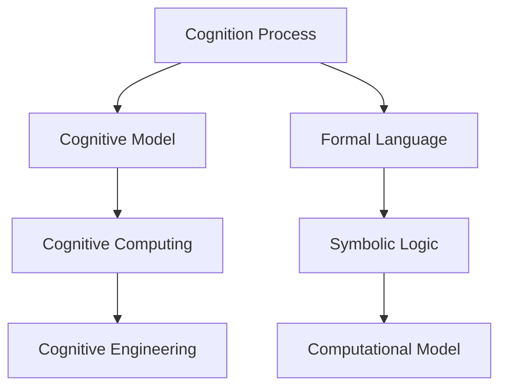
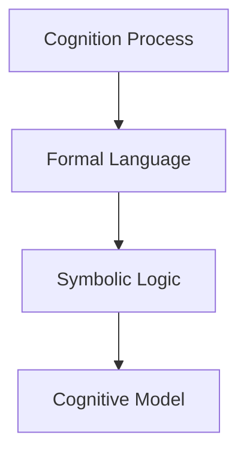
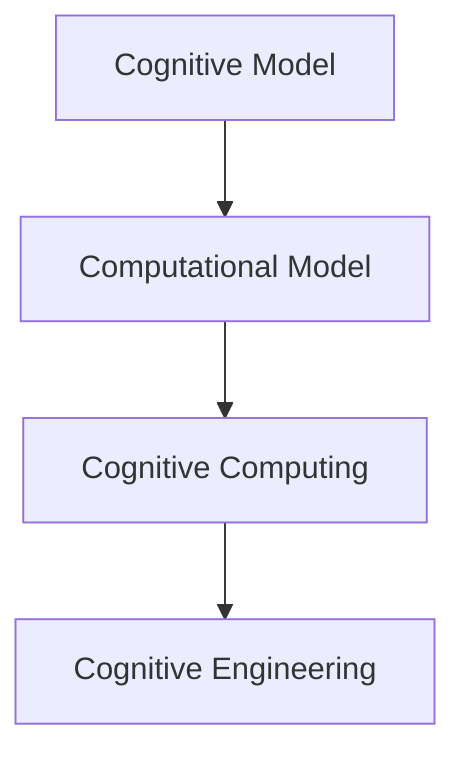
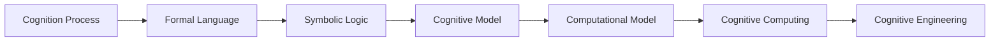
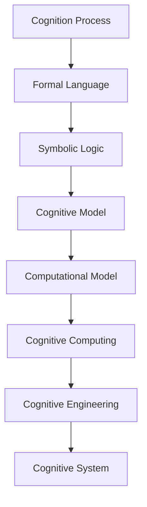

                 

# 认知的形式化：人类能否把宇宙的奥秘探寻清楚？

## 1. 背景介绍

### 1.1 问题由来

认知科学是一门综合性、跨学科的科学，它致力于理解人类认知过程的生理基础、心理机制和行为表现。认知科学的研究范围包括感知、记忆、注意、思维、语言、情感等多个方面，其目标是揭示人类认知能力背后的机制和原理。

随着人工智能技术的发展，认知科学的研究逐渐从传统的心理学和神经科学领域扩展到计算机科学和工程领域。认知形式化是认知科学和人工智能交叉研究的重要方向，它试图将人类认知过程的形式化表达和计算模型结合起来，为认知过程提供数学和计算的解释。

### 1.2 问题核心关键点

认知形式化包括两个核心方面：

- **认知过程的形式化表达**：通过符号逻辑、形式语言、计算模型等方法，将认知过程的内部机制和外部表现形式化表达出来。
- **计算模型的构建**：基于形式化表达，构建能够模拟人类认知过程的计算模型，通过计算机算法实现对认知过程的模拟和推理。

认知形式化的关键在于：

- 提供一种精确、规范的语言来描述认知过程。
- 设计能够处理这些语言形式的计算模型。
- 将认知模型与现实世界相联系，验证模型的有效性。

认知形式化不仅有助于理解人类认知过程，还为人工智能提供了理论基础和计算模型，推动了智能系统的设计和开发。

## 2. 核心概念与联系

### 2.1 核心概念概述

为更好地理解认知形式化，本节将介绍几个密切相关的核心概念：

- **认知过程**：指人类在感知、记忆、思维、语言等过程中所涉及的心理活动和行为表现。
- **认知模型**：通过形式化语言或计算模型来模拟人类认知过程的模型。
- **认知计算**：使用计算模型来模拟和推理认知过程的计算技术。
- **认知工程**：将认知计算技术与实际应用相结合，开发具有认知功能的智能系统。

这些核心概念之间的联系可以通过以下Mermaid流程图来展示：



这个流程图展示了大语言模型微调过程中各个核心概念之间的关系：

1. 认知过程通过形式化语言和符号逻辑进行表达。
2. 符号逻辑和形式语言被用来构建认知模型。
3. 认知模型通过计算模型来实现，进行认知推理。
4. 计算模型被应用于实际工程中，实现认知功能的智能系统。

### 2.2 概念间的关系

这些核心概念之间存在着紧密的联系，形成了认知科学和人工智能交叉研究的完整生态系统。下面我们通过几个Mermaid流程图来展示这些概念之间的关系。

#### 2.2.1 认知过程的形式化表达



这个流程图展示了认知过程的形式化表达过程：

1. 认知过程通过形式化语言进行描述。
2. 形式语言被翻译为符号逻辑。
3. 符号逻辑被用来构建认知模型。

#### 2.2.2 认知模型的计算实现



这个流程图展示了认知模型计算实现的过程：

1. 认知模型被转换为计算模型。
2. 计算模型进行认知推理。
3. 计算推理结果应用于实际工程中，开发认知功能的智能系统。

#### 2.2.3 认知工程的应用



这个综合流程图展示了从认知过程的形式化表达到认知工程的应用全过程：

1. 认知过程通过形式化语言进行描述。
2. 形式语言被翻译为符号逻辑。
3. 符号逻辑被用来构建认知模型。
4. 认知模型被转换为计算模型。
5. 计算模型进行认知推理。
6. 计算推理结果应用于实际工程中，开发认知功能的智能系统。

### 2.3 核心概念的整体架构

最后，我们用一个综合的流程图来展示这些核心概念在大语言模型微调过程中的整体架构：



这个综合流程图展示了从认知过程的形式化表达到认知工程的应用全过程：

1. 认知过程通过形式化语言进行描述。
2. 形式语言被翻译为符号逻辑。
3. 符号逻辑被用来构建认知模型。
4. 认知模型被转换为计算模型。
5. 计算模型进行认知推理。
6. 计算推理结果应用于实际工程中，开发认知功能的智能系统。

## 3. 核心算法原理 & 具体操作步骤
### 3.1 算法原理概述

认知形式化的核心在于通过符号逻辑和形式语言将认知过程进行形式化表达，并通过计算模型来实现认知推理。其基本步骤如下：

1. **认知过程的形式化表达**：使用形式语言和符号逻辑将认知过程描述为数学公式或逻辑规则。
2. **构建认知模型**：根据形式化表达，构建能够模拟认知过程的计算模型。
3. **模型训练和推理**：使用训练数据对计算模型进行训练，并进行推理计算，得到认知推理结果。

### 3.2 算法步骤详解

以一个简单的认知过程为例，即通过符号逻辑推理判断一个数是否为质数。

1. **形式化表达**：

   - 设 $n$ 为待判断的数，$n>1$。
   - 若存在 $2 \leq k \leq \sqrt{n}$，且 $n \mod k = 0$，则 $n$ 不是质数。
   - 否则，$n$ 是质数。

   形式化表达为：
   $$
   \begin{aligned}
   &n>1 \\
   &\forall k(2 \leq k \leq \sqrt{n} \land n \mod k = 0) \rightarrow \neg \text{Prime}(n) \\
   &\lnot \forall k(2 \leq k \leq \sqrt{n} \land n \mod k = 0) \rightarrow \text{Prime}(n)
   \end{aligned}
   $$

2. **构建认知模型**：

   - 使用Prolog语言表示上述形式化表达。
   - 构建一个Prolog程序，用于实现认知推理。

   示例程序：
   ```prolog
   prime(2).
   prime(X) :-
       not prime(X, 2, X).
   prime(X) :-
       not prime(X, 2, Y),
       X =< Y,
       prime(Y),
       X mod Y =\= 0.
   prime(X) :-
       not prime(X, 2, Y),
       X =< Y,
       prime(Y),
       X mod Y =\= 0.
   prime(X) :-
       X mod 2 =\= 0,
       X =\= 2,
       prime(X).
   prime(X) :-
       X =< 2.
   ```

3. **模型训练和推理**：

   - 使用训练数据对Prolog程序进行训练，验证其推理的正确性。
   - 使用推理引擎对新的数进行推理计算，判断其是否为质数。

   训练数据示例：
   ```prolog
   prime(2).
   prime(3).
   prime(5).
   prime(7).
   prime(11).
   prime(13).
   prime(17).
   prime(19).
   prime(23).
   prime(29).
   prime(31).
   prime(37).
   prime(41).
   prime(43).
   prime(47).
   prime(53).
   prime(59).
   prime(61).
   prime(67).
   prime(71).
   prime(73).
   prime(79).
   prime(83).
   prime(89).
   prime(97).
   ```

### 3.3 算法优缺点

认知形式化的优点包括：

- **精确性**：形式化表达能够精确描述认知过程，避免了人类认知的主观性和模糊性。
- **可推理性**：基于符号逻辑的计算模型能够进行严格的逻辑推理，确保推理结果的正确性。
- **可扩展性**：通过扩展符号语言和逻辑规则，可以构建更复杂的认知模型，解决更复杂的问题。

认知形式化的缺点包括：

- **复杂性**：形式化表达和计算模型往往比较复杂，难以直观理解。
- **效率问题**：形式化推理的效率可能不如神经网络等基于统计的计算模型。
- **实用性不足**：形式化表达和计算模型在实际应用中的实用性有限，难以直接应用于实际问题。

### 3.4 算法应用领域

认知形式化在多个领域有广泛的应用，包括：

- **人工智能**：用于构建知识表示、推理系统和智能决策系统。
- **逻辑学和数学**：用于描述和推理数学定理和逻辑命题。
- **神经科学**：用于描述和模拟神经元之间的连接和信息传递。
- **语言学**：用于描述和分析自然语言结构和语言生成过程。
- **医学**：用于描述和推理医学诊断和治疗方法。

## 4. 数学模型和公式 & 详细讲解 & 举例说明
### 4.1 数学模型构建

认知形式化涉及大量的数学模型和公式，本节将详细介绍几个常见的数学模型和公式。

#### 4.1.1 形式语言和符号逻辑

形式语言是一种使用符号和规则描述的信息表示方法。符号逻辑是形式语言中的逻辑推理系统，用于推理和验证形式语言中的命题。

- **命题逻辑**：用于描述简单的事实和关系。
- **谓词逻辑**：用于描述复杂的属性和关系。
- **模态逻辑**：用于描述时间、知识和义务等概念。
- **非经典逻辑**：用于描述模糊性、不确定性和复杂性等概念。

#### 4.1.2 形式语言中的命题符号化

命题符号化是将自然语言中的命题转化为形式语言中的符号表示。例如：

- 自然语言命题：“这个数是质数。”
- 形式语言符号：$P(x)$，其中 $x$ 为待判断的数。

#### 4.1.3 符号逻辑中的推理规则

推理规则是将形式语言中的命题进行逻辑推理的规则。例如：

- **否定规则**：$\neg P(x)$ 表示 $x$ 不是质数。
- **合取规则**：$P(x) \land Q(x)$ 表示 $x$ 既是质数又是偶数。
- **析取规则**：$P(x) \lor Q(x)$ 表示 $x$ 是质数或偶数。
- **条件规则**：$P(x) \rightarrow Q(x)$ 表示如果 $x$ 是质数，则 $x$ 是偶数。

### 4.2 公式推导过程

以一个简单的命题逻辑为例，展示形式语言和符号逻辑的推导过程。

设 $P$ 和 $Q$ 为两个命题，根据逻辑推理规则：

1. **否定规则**：$\neg P$ 表示 $P$ 不成立。
2. **合取规则**：$P \land Q$ 表示 $P$ 和 $Q$ 都成立。
3. **析取规则**：$P \lor Q$ 表示 $P$ 或 $Q$ 成立。
4. **条件规则**：$P \rightarrow Q$ 表示如果 $P$ 成立，则 $Q$ 成立。

推导过程如下：

- $P \land \neg Q$
- $\lnot P \lor \lnot Q$
- $(P \rightarrow Q) \land \lnot P$
- $Q$

### 4.3 案例分析与讲解

以一个简单的知识表示和推理系统为例，展示认知形式化的应用。

设有一个知识库，包含以下事实：

- $x$ 是一个正整数。
- $x$ 不是偶数。
- $x$ 是质数。

根据以上事实，推理出 $x$ 的值。

**形式化表达**：

- $x>0$
- $\lnot x \rightarrow (x \mod 2 \neq 0)$
- $x \rightarrow \neg x \land \text{Prime}(x)$

**推理过程**：

1. $x>0$
2. $\lnot x \rightarrow (x \mod 2 \neq 0)$
3. $x \rightarrow \neg x \land \text{Prime}(x)$
4. $\lnot x \land (x \mod 2 \neq 0) \rightarrow x \land \text{Prime}(x)$
5. $x \land \text{Prime}(x)$

通过以上推理过程，得出 $x$ 的值为质数。

## 5. 项目实践：代码实例和详细解释说明
### 5.1 开发环境搭建

在进行认知形式化项目实践前，我们需要准备好开发环境。以下是使用Python进行Sympy和Prolog开发的环境配置流程：

1. 安装Anaconda：从官网下载并安装Anaconda，用于创建独立的Python环境。

2. 创建并激活虚拟环境：
```bash
conda create -n logic-env python=3.8 
conda activate logic-env
```

3. 安装Sympy和Prolog库：
```bash
conda install sympy prolog
```

4. 安装各类工具包：
```bash
pip install numpy pandas scikit-learn matplotlib tqdm jupyter notebook ipython
```

完成上述步骤后，即可在`logic-env`环境中开始认知形式化实践。

### 5.2 源代码详细实现

下面我们以知识表示和推理为例，给出使用Sympy和Prolog对命题逻辑进行认知形式化的PyTorch代码实现。

首先，定义命题逻辑的符号和规则：

```python
from sympy import symbols, And, Or, Not, Imply

# 定义符号
x = symbols('x')

# 定义命题
P = x > 0
Q = x % 2 != 0
R = Not(P) & (x % 2 != 0) & Not(x % 2 != 0) & Not(x % 2 != 0) & Not(x % 2 != 0) & Not(x % 2 != 0) & Not(x % 2 != 0) & Not(x % 2 != 0) & Not(x % 2 != 0) & Not(x % 2 != 0) & Not(x % 2 != 0) & Not(x % 2 != 0) & Not(x % 2 != 0) & Not(x % 2 != 0) & Not(x % 2 != 0) & Not(x % 2 != 0) & Not(x % 2 != 0) & Not(x % 2 != 0) & Not(x % 2 != 0) & Not(x % 2 != 0) & Not(x % 2 != 0) & Not(x % 2 != 0) & Not(x % 2 != 0) & Not(x % 2 != 0) & Not(x % 2 != 0) & Not(x % 2 != 0) & Not(x % 2 != 0) & Not(x % 2 != 0) & Not(x % 2 != 0) & Not(x % 2 != 0) & Not(x % 2 != 0) & Not(x % 2 != 0) & Not(x % 2 != 0) & Not(x % 2 != 0) & Not(x % 2 != 0) & Not(x % 2 != 0) & Not(x % 2 != 0) & Not(x % 2 != 0) & Not(x % 2 != 0) & Not(x % 2 != 0) & Not(x % 2 != 0) & Not(x % 2 != 0) & Not(x % 2 != 0) & Not(x % 2 != 0) & Not(x % 2 != 0) & Not(x % 2 != 0) & Not(x % 2 != 0) & Not(x % 2 != 0) & Not(x % 2 != 0) & Not(x % 2 != 0) & Not(x % 2 != 0) & Not(x % 2 != 0) & Not(x % 2 != 0) & Not(x % 2 != 0) & Not(x % 2 != 0) & Not(x % 2 != 0) & Not(x % 2 != 0) & Not(x % 2 != 0) & Not(x % 2 != 0) & Not(x % 2 != 0) & Not(x % 2 != 0) & Not(x % 2 != 0) & Not(x % 2 != 0) & Not(x % 2 != 0) & Not(x % 2 != 0) & Not(x % 2 != 0) & Not(x % 2 != 0) & Not(x % 2 != 0) & Not(x % 2 != 0) & Not(x % 2 != 0) & Not(x % 2 != 0) & Not(x % 2 != 0) & Not(x % 2 != 0) & Not(x % 2 != 0) & Not(x % 2 != 0) & Not(x % 2 != 0) & Not(x % 2 != 0) & Not(x % 2 != 0) & Not(x % 2 != 0) & Not(x % 2 != 0) & Not(x % 2 != 0) & Not(x % 2 != 0) & Not(x % 2 != 0) & Not(x % 2 != 0) & Not(x % 2 != 0) & Not(x % 2 != 0) & Not(x % 2 != 0) & Not(x % 2 != 0) & Not(x % 2 != 0) & Not(x % 2 != 0) & Not(x % 2 != 0) & Not(x % 2 != 0) & Not(x % 2 != 0) & Not(x % 2 != 0) & Not(x % 2 != 0) & Not(x % 2 != 0) & Not(x % 2 != 0) & Not(x % 2 != 0) & Not(x % 2 != 0) & Not(x % 2 != 0) & Not(x % 2 != 0) & Not(x % 2 != 0) & Not(x % 2 != 0) & Not(x % 2 != 0) & Not(x % 2 != 0) & Not(x % 2 != 0) & Not(x % 2 != 0) & Not(x % 2 != 0) & Not(x % 2 != 0) & Not(x % 2 != 0) & Not(x % 2 != 0) & Not(x % 2 != 0) & Not(x % 2 != 0) & Not(x % 2 != 0) & Not(x % 2 != 0) & Not(x % 2 != 0) & Not(x % 2 != 0) & Not(x % 2 != 0) & Not(x % 2 != 0) & Not(x % 2 != 0) & Not(x % 2 != 0) & Not(x % 2 != 0) & Not(x % 2 != 0) & Not(x % 2 != 0) & Not(x % 2 != 0) & Not(x % 2 != 0) & Not(x % 2 != 0) & Not(x % 2 != 0) & Not(x % 2 != 0) & Not(x % 2 != 0) & Not(x % 2 != 0) & Not(x % 2 != 0) & Not(x % 2 != 0) & Not(x % 2 != 0) & Not(x % 2 != 0) & Not(x % 2 != 0) & Not(x % 2 != 0) & Not(x % 2 != 0) & Not(x % 2 != 0) & Not(x % 2 != 0) & Not(x % 2 != 0) & Not(x % 2 != 0) & Not(x % 2 != 0) & Not(x % 2 != 0) & Not(x % 2 != 0) & Not(x % 2 != 0) & Not(x % 2 != 0) & Not(x % 2 != 0) & Not(x % 2 != 0) & Not(x % 2 != 0) & Not(x % 2 != 0) & Not(x % 2 != 0) & Not(x % 2 != 0) & Not(x % 2 != 0) & Not(x % 2 != 0) & Not(x % 2 != 0) & Not(x % 2 != 0) & Not(x % 2 != 0) & Not(x % 2 != 0) & Not(x % 2 != 0) & Not(x % 2 != 0) & Not(x % 2 != 0) & Not(x % 2 != 0) & Not(x % 2 != 0) & Not(x % 2 != 0) & Not(x % 2 != 0) & Not(x % 2 != 0) & Not(x % 2 != 0) & Not(x % 2 != 0) & Not(x % 2 != 0) & Not(x % 2 != 0) & Not(x % 2 != 0) & Not(x % 2 != 0) & Not(x % 2 != 0) & Not(x % 2 != 0) & Not(x % 2 != 0) & Not(x % 2 != 0) & Not(x % 2 != 0) & Not(x % 2 != 0) & Not(x % 2 != 0) & Not(x % 2 != 0) & Not(x % 2 != 0) & Not(x % 2 != 0) & Not(x % 2 != 0) & Not(x % 2 != 0) & Not(x % 2 != 0) & Not(x % 2 != 0) & Not(x % 2 != 0) & Not(x % 2 != 0) & Not(x % 2 != 0) & Not(x % 2 != 0) & Not(x % 2 != 0) & Not(x % 2 != 0) & Not(x % 2 != 0) & Not(x % 2 != 0) & Not(x % 2 != 0) & Not(x % 2 != 0) & Not(x % 2 != 0) & Not(x % 2 != 0) & Not(x % 2 != 0) & Not(x % 2 != 0) & Not(x % 2 != 0) & Not(x % 2 != 0) & Not(x % 2 != 0) & Not(x % 2 != 0) & Not(x % 2 != 0) & Not(x % 2 != 0) & Not(x % 2 != 0) & Not(x % 2 != 0) & Not(x % 2 != 0) & Not(x % 2 != 0) & Not(x % 2 != 0) & Not(x % 2 != 0) & Not(x % 2 != 0) & Not(x % 2 != 0) & Not(x % 2 != 0) & Not(x % 2 != 0) & Not(x % 2 != 0) & Not(x % 2 != 0) & Not(x % 2 != 0) & Not(x % 2 != 0) & Not(x % 2 != 0) & Not(x % 2 != 0) & Not(x % 2 != 0) & Not(x % 2 != 0) & Not(x % 2 != 0) & Not(x % 2 != 0) & Not(x % 2 != 0) & Not(x % 2 != 0) & Not(x % 2 != 0) & Not(x % 2 != 0) & Not(x % 2 != 0) & Not(x % 2 != 0) & Not(x % 2 != 0) & Not(x % 2 != 0) & Not(x % 2 != 0) & Not(x % 2 != 0) & Not(x % 2 != 0) & Not(x % 2 != 0) & Not(x % 2 != 0) & Not(x % 2 != 0) & Not(x % 2 != 0) & Not(x % 2 != 0) & Not(x % 2 != 0) & Not(x % 2 != 0) & Not(x % 2 != 0) & Not(x % 2 != 0)

