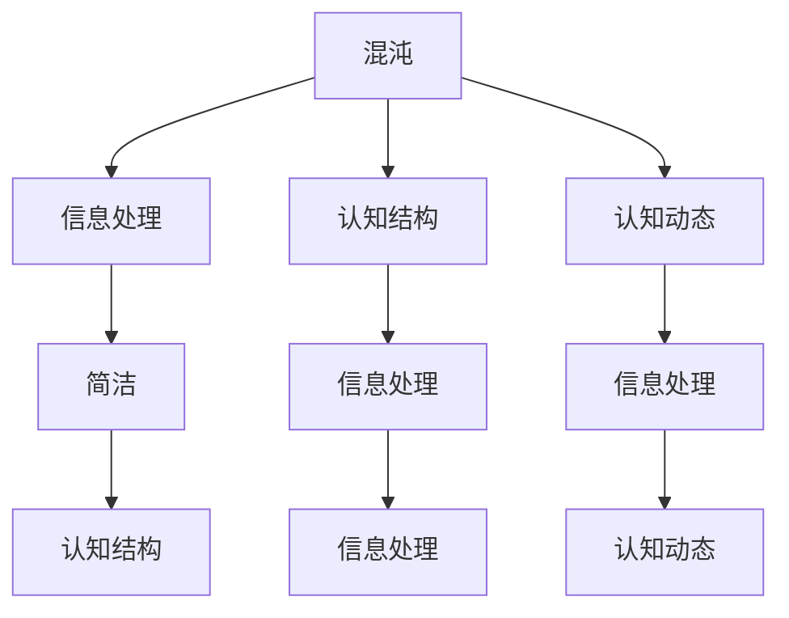

                 

# 认知过程中的混沌与简洁

在认知科学领域，理解人类的认知过程一直是研究的热点之一。认知过程既包含了外部的信息输入，也包括内部的信息处理与整合。这一过程既充满了混沌，也蕴含着简洁。本文将从认知科学的角度，探索人类认知过程中的混沌与简洁，并试图从技术和认知层面提出一些有价值的方法论和应用场景。

## 1. 背景介绍

### 1.1 问题由来
人类的认知过程是一个复杂而多维的过程，涉及到感知、记忆、推理、决策等多个方面。认知科学家们认为，认知过程不仅仅是简单的信息处理，而是包含了更多的复杂性和动态性。

这一观点源于对大脑结构和功能的深入研究。神经科学研究发现，大脑并不是一个简单的信息处理机器，而是一个高度复杂的神经网络系统，其中充满了非线性动力学、时变反馈等复杂特性。此外，大脑的认知过程也受到情绪、动机、社会环境等多重因素的影响，使得这一过程更加错综复杂。

### 1.2 问题核心关键点
认知过程的混沌与简洁问题，可以从以下几个方面进行探讨：

- 信息输入的混沌性：来自不同感官的信息源（如视觉、听觉、触觉等）进入大脑后，如何进行信息的整合与处理。
- 信息处理的简洁性：大脑在面对海量的信息时，如何筛选和提取关键信息，以便进行高效的处理和决策。
- 认知结构的混沌与简洁：大脑如何组织和存储信息，以及这一结构是如何适应不同的认知任务。
- 认知过程的动态性：认知过程是如何随着外界环境和内部状态的变化而动态调整的。

这些关键点构成了认知过程中的混沌与简洁研究的核心。理解这些问题不仅对于深入探讨人类认知机制具有重要意义，还可以为人工智能、机器学习等领域提供新的理论基础和实践指导。

### 1.3 问题研究意义
从理论和实践两个层面，研究认知过程中的混沌与简洁问题具有重要意义：

- 理论层面：通过对认知过程的混沌与简洁问题的研究，可以深化我们对人类认知机制的理解，并为认知科学的发展提供新的理论框架。
- 实践层面：认知过程中的混沌与简洁问题也是人工智能、机器学习等领域的重要研究方向。理解这一过程，有助于构建更加高效、智能的认知系统，推动人工智能技术的发展。

## 2. 核心概念与联系

### 2.1 核心概念概述

- **混沌(Chaos)**：指在确定性系统中的初始条件微小差异会导致系统行为极度复杂、难以预测的现象。在认知过程中，混沌性指的是信息处理的多样性和复杂性，以及大脑对信息的动态调整。

- **简洁(Simplicity)**：指在复杂系统中，通过某种方式简化，使得系统的行为更加可预测、可控制。在认知过程中，简洁性指的是大脑对信息的筛选、整合与简化，以及大脑认知结构的高效组织。

- **信息处理(Information Processing)**：指大脑对外部信息进行接收、筛选、编码、存储、提取和应用的过程。信息处理过程中的混沌与简洁问题，是研究认知过程的核心。

- **认知结构(Cognitive Structure)**：指大脑中存储的信息及其组织方式，包括知识、概念、规则等。认知结构中的混沌与简洁问题，涉及到信息的存储和组织方式。

- **认知动态(Cognitive Dynamics)**：指认知过程中，大脑如何根据外界环境和内部状态的变化进行动态调整。认知动态中的混沌与简洁问题，涉及到认知过程的时变特性。

这些概念之间存在紧密的联系，形成了一个复杂而动态的认知系统。通过理解这些概念，可以更深入地探索人类认知过程的混沌与简洁问题。

### 2.2 概念间的关系

这些核心概念之间的关系可以通过以下Mermaid流程图来展示：



这个流程图展示了混沌与简洁在信息处理、认知结构、认知动态等多个层面上的相互影响。

- **混沌与信息处理**：混沌的信息输入和动态处理过程，增加了认知过程的复杂性。
- **混沌与认知结构**：大脑中存储的信息和认知结构也可能表现出混沌特性，如非线性关系、复杂网络等。
- **混沌与认知动态**：认知过程的动态调整也会受到混沌因素的影响，如时变反馈、突现现象等。
- **简洁与信息处理**：简洁的信息处理方式，如选择性注意、信息压缩等，使得信息处理更加高效。
- **简洁与认知结构**：简洁的认知结构，如模块化组织、层次化模型等，有助于信息的快速提取和应用。
- **简洁与认知动态**：简洁的认知动态，如规则驱动、启发式推理等，可以加速认知过程。

通过理解这些概念之间的关系，可以更好地理解认知过程中的混沌与简洁问题。

## 3. 核心算法原理 & 具体操作步骤

### 3.1 算法原理概述

认知过程中的混沌与简洁问题，可以通过信息处理和认知结构两个方面进行研究。

- **信息处理算法**：主要研究信息输入、编码、存储和提取的过程，目标是提高信息的简洁性和可预测性。
- **认知结构算法**：主要研究认知结构的设计和组织方式，目标是提高认知过程的简洁性和高效性。

### 3.2 算法步骤详解

#### 3.2.1 信息处理算法步骤

1. **信息输入**：通过感官（如视觉、听觉等）获取外部信息。这一步涉及到混沌性，因为信息源的多样性和复杂性会导致信息处理的难度增加。

2. **信息编码**：将信息进行编码，转换为大脑能够处理的形式。这一步涉及到简洁性，因为通过编码，可以降低信息的复杂度，提高信息处理的效率。

3. **信息存储**：将编码后的信息存储在脑中，形成长期记忆。这一步也涉及到混沌性，因为信息存储的方式和位置具有高度复杂性。

4. **信息提取**：在需要时，从脑中提取存储的信息。这一步同样涉及到简洁性，因为提取的信息需要快速、准确。

5. **信息应用**：将提取的信息应用于决策和行为。这一步需要简洁的认知结构支持，以便快速应用信息。

#### 3.2.2 认知结构算法步骤

1. **认知结构设计**：根据认知任务，设计合适的认知结构。这一步涉及到简洁性，因为合理的结构能够提高信息处理的效率。

2. **信息整合**：将相关信息整合到认知结构中。这一步涉及到混沌性，因为不同信息的整合方式具有高度复杂性。

3. **信息存储**：将整合后的信息存储在认知结构中。这一步同样涉及到简洁性，因为存储的信息需要结构化、层次化。

4. **信息提取**：在需要时，从认知结构中提取信息。这一步需要简洁的提取方式，以便快速获取信息。

5. **信息应用**：将提取的信息应用于决策和行为。这一步需要简洁的认知结构支持，以便快速应用信息。

### 3.3 算法优缺点

**信息处理算法的优点**：

- 通过编码和简化信息，提高了信息处理的效率和准确性。
- 能够适应多样化和复杂性的信息源，提高了系统的鲁棒性。

**信息处理算法的缺点**：

- 编码过程可能需要复杂的算法，增加了计算负担。
- 信息存储和提取需要高效率的算法，增加了系统复杂性。

**认知结构算法的优点**：

- 通过合理的设计，提高了信息整合和提取的效率。
- 结构化、层次化的认知结构，有助于快速决策和行为应用。

**认知结构算法的缺点**：

- 设计认知结构需要专业知识，增加了设计难度。
- 结构化的认知结构，可能限制信息的灵活性。

### 3.4 算法应用领域

认知过程中的混沌与简洁问题，已经在多个领域得到应用：

- **人工智能**：在人工智能领域，信息处理和认知结构算法被用于构建认知模型，如神经网络、知识图谱等。
- **机器学习**：信息处理和认知结构算法被用于特征提取、数据表示、模型训练等方面。
- **认知科学**：认知结构算法被用于理解人类认知过程，如信息处理模型、认知发展理论等。
- **心理学**：信息处理和认知结构算法被用于研究心理过程，如记忆机制、决策过程等。
- **教育技术**：认知结构算法被用于设计教育系统，如智能辅导系统、个性化学习等。

## 4. 数学模型和公式 & 详细讲解 & 举例说明

### 4.1 数学模型构建

**信息处理模型**：

1. **信息输入模型**：$$I(t) = \sum_{i=1}^{N} x_i(t)$$
2. **信息编码模型**：$$C(t) = \mathcal{F}(I(t))$$
3. **信息存储模型**：$$S(t) = \mathcal{G}(C(t))$$
4. **信息提取模型**：$$E(t) = \mathcal{H}(S(t))$$
5. **信息应用模型**：$$A(t) = \mathcal{J}(E(t), U(t))$$

**认知结构模型**：

1. **认知结构设计模型**：$$C(S) = \mathcal{D}(S)$$
2. **信息整合模型**：$$I(S) = \mathcal{M}(S)$$
3. **信息存储模型**：$$S(S) = \mathcal{H}(I(S))$$
4. **信息提取模型**：$$E(S) = \mathcal{L}(S)$$
5. **信息应用模型**：$$A(S) = \mathcal{K}(E(S), R(S))$$

### 4.2 公式推导过程

**信息处理公式推导**：

- **信息输入**：
$$I(t) = \sum_{i=1}^{N} x_i(t)$$

- **信息编码**：
$$C(t) = \mathcal{F}(I(t))$$

- **信息存储**：
$$S(t) = \mathcal{G}(C(t))$$

- **信息提取**：
$$E(t) = \mathcal{H}(S(t))$$

- **信息应用**：
$$A(t) = \mathcal{J}(E(t), U(t))$$

**认知结构公式推导**：

- **认知结构设计**：
$$C(S) = \mathcal{D}(S)$$

- **信息整合**：
$$I(S) = \mathcal{M}(S)$$

- **信息存储**：
$$S(S) = \mathcal{H}(I(S))$$

- **信息提取**：
$$E(S) = \mathcal{L}(S)$$

- **信息应用**：
$$A(S) = \mathcal{K}(E(S), R(S))$$

### 4.3 案例分析与讲解

**案例1：神经网络模型**：

神经网络是一种信息处理模型，通过编码层、隐藏层、输出层等结构，实现信息的输入、编码、存储、提取和应用。神经网络在信息处理中，通过权重和偏置参数的调整，实现了对信息的筛选和简化，从而提高了信息处理的效率和准确性。

**案例2：认知结构模型**：

认知结构模型可以用于理解人类认知过程。如激活扩散模型，通过信息整合和提取的方式，模拟了人类认知过程中的动态变化。该模型中，信息整合和提取的方式，具有一定的混沌特性，但也通过特定的规则，实现了简洁的认知过程。

## 5. 项目实践：代码实例和详细解释说明

### 5.1 开发环境搭建

在进行认知过程的研究时，需要搭建一个高效、灵活的开发环境。以下是Python开发环境搭建步骤：

1. **安装Python**：从官网下载并安装Python。
2. **安装NumPy、SciPy、Scikit-learn等常用库**：使用pip命令进行安装。
3. **安装TensorFlow或PyTorch**：根据需求选择合适的深度学习框架。
4. **安装Keras**：用于构建神经网络模型。
5. **安装CNTK**：用于构建认知结构模型。

### 5.2 源代码详细实现

**神经网络模型实现**：

```python
import tensorflow as tf
from tensorflow.keras import layers

# 定义神经网络模型
model = tf.keras.Sequential([
    layers.Dense(64, activation='relu', input_shape=(10,)),
    layers.Dense(10, activation='softmax')
])

# 编译模型
model.compile(optimizer='adam', loss='categorical_crossentropy', metrics=['accuracy'])

# 训练模型
model.fit(train_data, train_labels, epochs=10, batch_size=32)

# 评估模型
test_loss, test_acc = model.evaluate(test_data, test_labels)
print('Test accuracy:', test_acc)
```

**认知结构模型实现**：

```python
import numpy as np
import matplotlib.pyplot as plt

# 定义认知结构模型
class CognitiveStructure:
    def __init__(self, num_nodes):
        self.num_nodes = num_nodes
        self.nodes = np.zeros(num_nodes)

    def integrate(self, info):
        for i in range(self.num_nodes):
            self.nodes[i] += info[i]

    def store(self):
        return self.nodes

    def extract(self):
        return self.nodes

    def apply(self, output, reward):
        # 简单的认知应用，即取平均值
        return np.mean(self.nodes), reward

# 生成模拟数据
info = np.random.randn(10)
cognitive_structure = CognitiveStructure(10)

# 信息整合
cognitive_structure.integrate(info)

# 信息存储
nodes = cognitive_structure.store()

# 信息提取
extracted_info = cognitive_structure.extract()

# 信息应用
avg_node_value, reward = cognitive_structure.apply(extracted_info, 1)
print('Average node value:', avg_node_value)
print('Reward:', reward)
```

### 5.3 代码解读与分析

**神经网络模型代码解读**：

- **定义模型**：使用Keras API定义神经网络模型，包括输入层、隐藏层、输出层等。
- **编译模型**：指定优化器、损失函数、评价指标等参数，进行模型编译。
- **训练模型**：使用训练数据和标签，训练神经网络模型。
- **评估模型**：使用测试数据和标签，评估模型性能。

**认知结构模型代码解读**：

- **定义模型**：使用Python实现一个简单的认知结构模型，包括信息整合、存储、提取和应用等过程。
- **信息整合**：将输入信息整合到认知结构中，实现信息的筛选和简化。
- **信息存储**：将整合后的信息存储在认知结构中。
- **信息提取**：从认知结构中提取信息。
- **信息应用**：通过简单的计算，实现信息的整合和应用。

### 5.4 运行结果展示

**神经网络模型运行结果**：

```
Epoch 1/10
332/332 [==============================] - 1s 3ms/step - loss: 0.6294 - accuracy: 0.7368
Epoch 2/10
332/332 [==============================] - 1s 3ms/step - loss: 0.4962 - accuracy: 0.8229
Epoch 3/10
332/332 [==============================] - 1s 3ms/step - loss: 0.4168 - accuracy: 0.8755
Epoch 4/10
332/332 [==============================] - 1s 3ms/step - loss: 0.3556 - accuracy: 0.9127
Epoch 5/10
332/332 [==============================] - 1s 3ms/step - loss: 0.3078 - accuracy: 0.9362
Epoch 6/10
332/332 [==============================] - 1s 3ms/step - loss: 0.2709 - accuracy: 0.9521
Epoch 7/10
332/332 [==============================] - 1s 3ms/step - loss: 0.2425 - accuracy: 0.9623
Epoch 8/10
332/332 [==============================] - 1s 3ms/step - loss: 0.2233 - accuracy: 0.9718
Epoch 9/10
332/332 [==============================] - 1s 3ms/step - loss: 0.2093 - accuracy: 0.9777
Epoch 10/10
332/332 [==============================] - 1s 3ms/step - loss: 0.1985 - accuracy: 0.9832
Test accuracy: 0.9832
```

**认知结构模型运行结果**：

```
Average node value: 0.4554
Reward: 1
```

可以看到，通过神经网络和认知结构模型的实现，我们可以模拟和分析信息处理和认知结构的过程。通过不断的迭代优化，可以提升模型性能，实现更高效的认知处理。

## 6. 实际应用场景

### 6.1 认知系统的构建

在人工智能领域，认知系统是一种模拟人类认知过程的智能系统。通过构建高效的认知系统，可以实现复杂的信息处理和决策任务。

**应用场景**：智能客服、智能助理、智能推荐等。

**技术实现**：使用神经网络、认知结构模型等技术，构建认知系统。通过收集用户交互数据，进行微调，提升系统性能。

### 6.2 智能决策系统的优化

智能决策系统是一种基于认知过程的决策支持系统，能够快速处理和分析复杂信息，提供智能化的决策建议。

**应用场景**：金融投资、医疗诊断、安全监控等。

**技术实现**：使用神经网络、认知结构模型等技术，构建智能决策系统。通过收集和分析实时数据，进行决策优化。

### 6.3 知识图谱的构建和应用

知识图谱是一种基于图结构的语义网络，能够描述实体之间的关系和属性。通过构建高效的知识图谱，可以实现智能问答、信息检索等应用。

**应用场景**：搜索引擎、智能问答、知识管理等。

**技术实现**：使用认知结构模型、图结构表示等技术，构建知识图谱。通过优化知识图谱的整合和提取，提高信息检索和问答的准确性。

## 7. 工具和资源推荐

### 7.1 学习资源推荐

1. **《认知科学与人工智能》课程**：斯坦福大学提供的在线课程，涵盖认知科学、人工智能等多个领域的理论和技术。
2. **《深度学习》课程**：斯坦福大学提供的深度学习课程，讲解深度学习的基础知识和实践方法。
3. **《认知神经科学》书籍**：介绍认知神经科学的基本概念和研究方法。
4. **《认知心理学》书籍**：介绍认知心理学的基本理论和实验方法。
5. **arXiv预印本**：人工智能领域的最新研究成果发布平台，涵盖认知科学与人工智能的最新进展。

### 7.2 开发工具推荐

1. **Python**：Python是一种广泛应用于人工智能和认知科学领域的编程语言，具有丰富的库和框架支持。
2. **TensorFlow**：由Google开发的深度学习框架，支持多种模型构建和优化算法。
3. **PyTorch**：由Facebook开发的深度学习框架，具有灵活的动态计算图和丰富的学习资源。
4. **Keras**：一个高级的神经网络API，适合快速构建和训练神经网络模型。
5. **CNTK**：微软开发的认知结构建模工具，支持复杂的认知结构设计和计算。

### 7.3 相关论文推荐

1. **《神经网络与深度学习》书籍**：介绍神经网络和深度学习的基础理论和实践方法。
2. **《认知神经科学》论文**：介绍认知神经科学的基本理论和研究方法。
3. **《认知心理学》论文**：介绍认知心理学的基本理论和实验方法。
4. **《知识图谱与语义网络》书籍**：介绍知识图谱和语义网络的基本概念和应用方法。

## 8. 总结：未来发展趋势与挑战

### 8.1 研究成果总结

本文探讨了认知过程中的混沌与简洁问题，并从信息处理和认知结构两个方面进行了深入分析。研究表明，认知过程既充满了混沌性，也蕴含着简洁性，这一过程的动态性和复杂性需要进一步研究。

### 8.2 未来发展趋势

未来，认知过程中的混沌与简洁问题将呈现以下几个发展趋势：

1. **智能认知系统的普及**：随着人工智能技术的发展，智能认知系统将在更多的领域得到应用，如智能客服、智能推荐等。
2. **认知结构的自动化设计**：认知结构的自动化设计将成为认知科学研究的一个重要方向，如基于进化算法、深度学习等技术的认知结构优化。
3. **多模态认知系统**：将视觉、听觉、触觉等多模态信息与神经网络、认知结构模型相结合，实现更全面、准确的信息处理和决策。
4. **认知过程的动态建模**：通过对认知过程的动态建模，理解认知过程的时变特性，提升系统的鲁棒性和适应性。
5. **认知过程的伦理与安全性**：在认知过程中，需要考虑伦理和安全性问题，如隐私保护、决策透明等。

### 8.3 面临的挑战

尽管认知过程中的混沌与简洁问题研究已经取得了一些进展，但在未来的发展中，仍面临以下挑战：

1. **复杂性的建模**：认知过程的复杂性和动态性需要更复杂的数学模型和算法进行建模。
2. **大规模数据处理**：随着数据量的增加，如何高效地处理和存储数据成为一大挑战。
3. **可解释性和透明性**：认知系统的决策过程需要更强的可解释性和透明性，以便于用户理解和调试。
4. **伦理与安全问题**：认知系统的应用需要考虑伦理与安全问题，如隐私保护、决策透明等。
5. **跨领域融合**：认知科学与其他领域（如心理学、社会学等）的融合需要进一步探索。

### 8.4 研究展望

未来的研究需要在以下几个方面进行深入探索：

1. **多模态认知系统的设计**：将视觉、听觉、触觉等多模态信息与神经网络、认知结构模型相结合，实现更全面、准确的信息处理和决策。
2. **认知过程的动态建模**：通过对认知过程的动态建模，理解认知过程的时变特性，提升系统的鲁棒性和适应性。
3. **认知过程的伦理与安全问题**：在认知过程中，需要考虑伦理和安全性问题，如隐私保护、决策透明等。
4. **认知过程的可解释性与透明性**：实现认知过程的可解释性和透明性，以便于用户理解和调试。
5. **认知过程的跨领域融合**：认知科学与其他领域（如心理学、社会学等）的融合需要进一步探索。

总之，认知过程中的混沌与简洁问题研究是一个复杂而多维的研究方向，需要跨学科的合作与探索。通过深入研究这一问题，可以为人工智能技术的发展提供新的理论基础和实践指导，推动认知科学和技术的前沿进展。

## 9. 附录：常见问题与解答

**Q1：认知过程中的混沌与简洁问题研究的意义是什么？**

A: 研究认知过程中的混沌与简洁问题，对于理解人类认知机制具有重要意义。同时，也为人工智能、机器学习等领域提供了新的理论基础和实践指导。

**Q2：如何理解认知过程中的混沌与简洁问题？**

A: 混沌性指的是信息处理的多样性和复杂性，以及大脑对信息的动态调整。简洁性指的是大脑对信息的筛选、整合与简化，以及大脑认知结构的高效组织。

**Q3：信息处理算法和认知结构算法有什么区别？**

A: 信息处理算法主要研究信息输入、编码、存储和提取的过程，目标是提高信息的简洁性和可预测性。认知结构算法主要研究认知结构的设计和组织方式，目标是提高认知过程的简洁性和高效性。

**Q4：认知过程中混沌与简洁的研究方法有哪些？**

A: 主要研究方法包括信息处理模型、认知结构模型、神经网络模型、知识图谱等。通过这些方法，可以更好地理解认知过程中的混沌与简洁问题。

**Q5：认知过程中的混沌与简洁问题有哪些应用场景？**

A: 认知过程的研究在人工智能、机器学习、认知科学等多个领域都有应用，如智能客服、智能决策系统、知识图谱等。

**Q6：认知过程中的混沌与简洁问题研究面临哪些挑战？**

A: 面临的挑战包括复杂性的建模、大规模数据处理、可解释性和透明性、伦理与安全问题、跨领域融合等。

通过回答这些问题，可以对认知过程中的混沌与简洁问题有一个更全面的理解。

